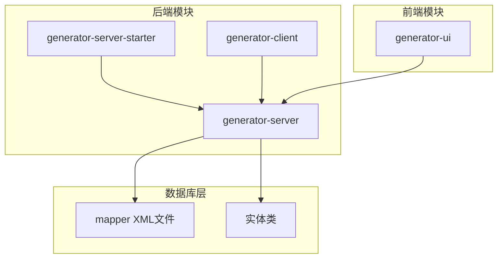
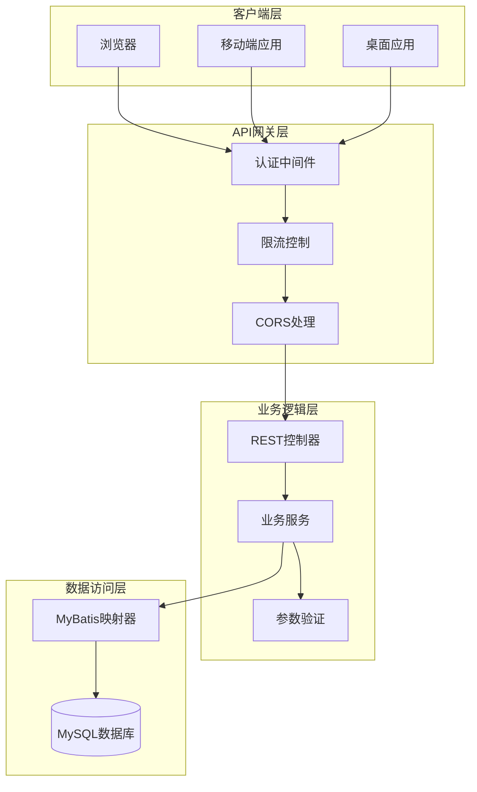
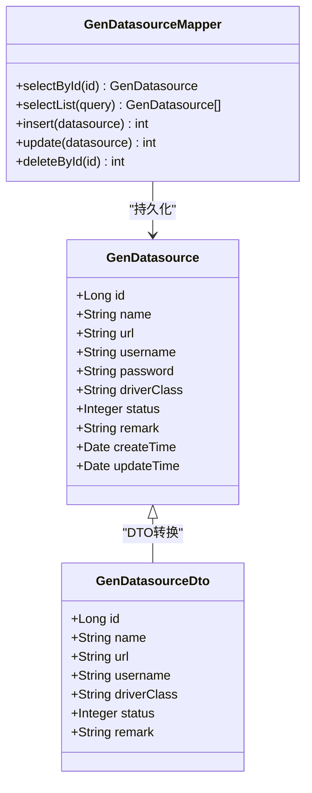
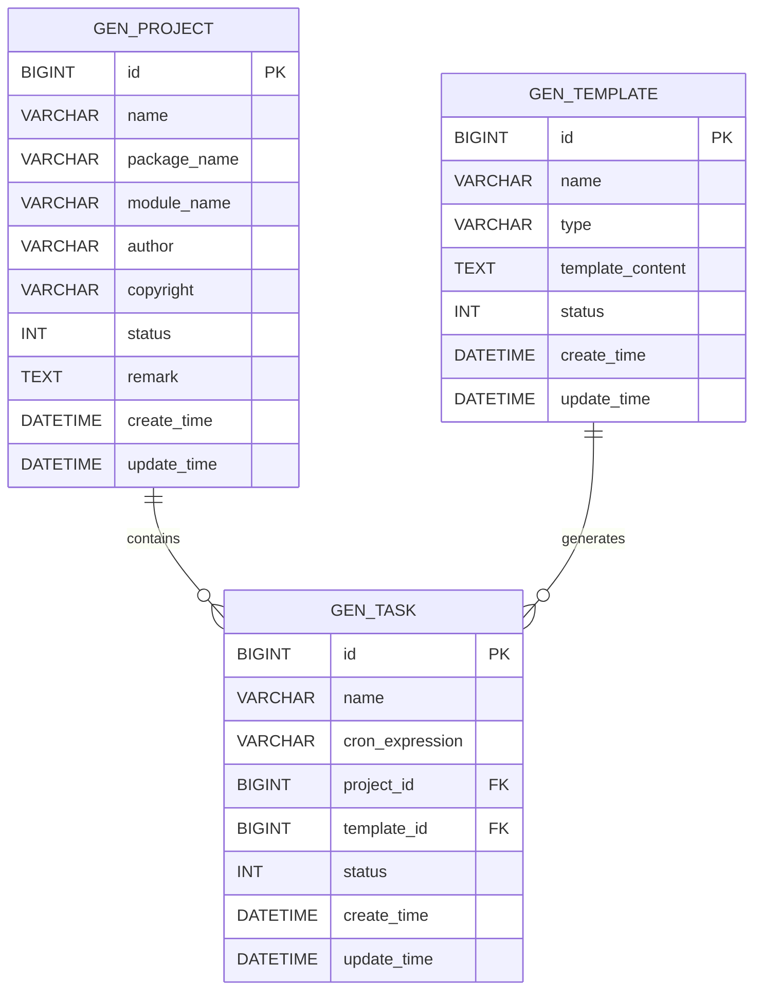
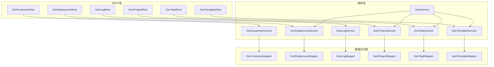
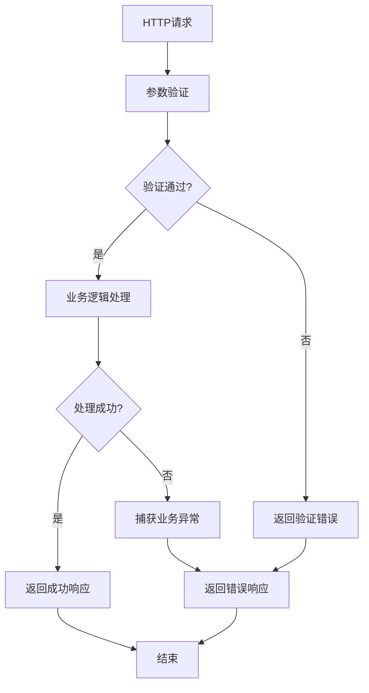

# API接口参考

<cite>
**本文档引用的文件**
- [GenCustomerRest.java](file://generator-server/src/main/java/com/wkclz/generator/server/rest/GenCustomerRest.java)
- [GenDatasourceRest.java](file://generator-server/src/main/java/com/wkclz/generator/server/rest/GenDatasourceRest.java)
- [GenLogRest.java](file://generator-server/src/main/java/com/wkclz/generator/server/rest/GenLogRest.java)
- [GenProjectRest.java](file://generator-server/src/main/java/com/wkclz/generator/server/rest/GenProjectRest.java)
- [GenTaskRest.java](file://generator-server/src/main/java/com/wkclz/generator/server/rest/GenTaskRest.java)
- [GenTemplateRest.java](file://generator-server/src/main/java/com/wkclz/generator/server/rest/GenTemplateRest.java)
- [application.yml](file://generator-server-starter/src/main/resources/config/application.yml)
- [Route.java](file://generator-server/src/main/java/com/wkclz/generator/server/Route.java)
- [GenService.java](file://generator-server/src/main/java/com/wkclz/generator/server/service/GenService.java)
- [GenParam.java](file://generator-server/src/main/java/com/wkclz/generator/server/bean/gen/GenParam.java)
- [GenDataVo.java](file://generator-server/src/main/java/com/wkclz/generator/server/bean/vo/GenDataVo.java)
- [GenDatasourceDto.java](file://generator-server/src/main/java/com/wkclz/generator/server/bean/dto/GenDatasourceDto.java)
- [GenProjectDto.java](file://generator-server/src/main/java/com/wkclz/generator/server/bean/dto/GenProjectDto.java)
- [GenTaskDto.java](file://generator-server/src/main/java/com/wkclz/generator/server/bean/dto/GenTaskDto.java)
- [GenTemplateDto.java](file://generator-server/src/main/java/com/wkclz/generator/server/bean/dto/GenTemplateDto.java)
- [GenDatasource.java](file://generator-server/src/main/java/com/wkclz/generator/server/bean/entity/GenDatasource.java)
- [GenProject.java](file://generator-server/src/main/java/com/wkclz/generator/server/bean/entity/GenProject.java)
- [GenTask.java](file://generator-server/src/main/java/com/wkclz/generator/server/bean/entity/GenTask.java)
- [GenTemplate.java](file://generator-server/src/main/java/com/wkclz/generator/server/bean/entity/GenTemplate.java)
- [GenLog.java](file://generator-server/src/main/java/com/wkclz/generator/server/bean/entity/GenLog.java)
- [GenDatasourceMapper.java](file://generator-server/src/main/java/com/wkclz/generator/server/mapper/GenDatasourceMapper.java)
- [GenProjectMapper.java](file://generator-server/src/main/java/com/wkclz/generator/server/mapper/GenProjectMapper.java)
- [GenTaskMapper.java](file://generator-server/src/main/java/com/wkclz/generator/server/mapper/GenTaskMapper.java)
- [GenTemplateMapper.java](file://generator-server/src/main/java/com/wkclz/generator/server/mapper/GenTemplateMapper.java)
- [GenLogMapper.java](file://generator-server/src/main/java/com/wkclz/generator/server/mapper/GenLogMapper.java)
- [GenDatasourceMapper.xml](file://generator-server/src/main/resources/mapper/GenDatasourceMapper.xml)
- [GenProjectMapper.xml](file://generator-server/src/main/resources/mapper/GenProjectMapper.xml)
- [GenTaskMapper.xml](file://generator-server/src/main/resources/mapper/GenTaskMapper.xml)
- [GenTemplateMapper.xml](file://generator-server/src/main/resources/mapper/GenTemplateMapper.xml)
- [GenLogMapper.xml](file://generator-server/src/main/resources/mapper/GenLogMapper.xml)
- [request.js](file://generator-ui/src/utils/request.js)
- [datasource.js](file://generator-ui/src/api/datasource.js)
- [project.js](file://generator-ui/src/api/project.js)
- [task.js](file://generator-ui/src/api/task.js)
- [template.js](file://generator-ui/src/api/template.js)
- [log.js](file://generator-ui/src/api/log.js)
- [common.js](file://generator-ui/src/api/common.js)
</cite>

## 目录
1. [简介](#简介)
2. [项目结构](#项目结构)
3. [核心组件](#核心组件)
4. [架构概览](#架构概览)
5. [详细组件分析](#详细组件分析)
6. [依赖关系分析](#依赖关系分析)
7. [性能考虑](#性能考虑)
8. [故障排除指南](#故障排除指南)
9. [结论](#结论)
10. [附录](#附录)

## 简介
SH-Generator是一个基于Spring Boot的代码生成器系统，提供了完整的REST API接口用于数据源管理、项目配置、任务调度、模板管理和日志查询等功能。该系统采用前后端分离架构，后端通过REST API提供服务，前端通过Vue.js实现用户界面。

## 项目结构
项目采用多模块架构设计，主要包含以下模块：



**图表来源**
- [Route.java](file://generator-server/src/main/java/com/wkclz/generator/server/Route.java)
- [application.yml](file://generator-server-starter/src/main/resources/config/application.yml)

**章节来源**
- [Route.java](file://generator-server/src/main/java/com/wkclz/generator/server/Route.java)
- [application.yml](file://generator-server-starter/src/main/resources/config/application.yml)

## 核心组件
系统的核心组件包括REST控制器、业务服务层、数据访问层和实体模型。每个组件都有明确的职责分工：

### REST控制器层
- 负责处理HTTP请求和响应
- 实现API端点定义
- 进行参数验证和错误处理

### 业务服务层
- 实现核心业务逻辑
- 协调多个数据访问操作
- 提供事务管理

### 数据访问层
- 处理数据库交互
- 执行SQL映射操作
- 管理持久化状态

### 实体模型层
- 定义数据结构
- 支持ORM映射
- 维护业务实体

**章节来源**
- [GenService.java](file://generator-server/src/main/java/com/wkclz/generator/server/service/GenService.java)
- [GenParam.java](file://generator-server/src/main/java/com/wkclz/generator/server/bean/gen/GenParam.java)

## 架构概览



**图表来源**
- [GenCustomerRest.java](file://generator-server/src/main/java/com/wkclz/generator/server/rest/GenCustomerRest.java)
- [GenService.java](file://generator-server/src/main/java/com/wkclz/generator/server/service/GenService.java)
- [GenDatasourceMapper.java](file://generator-server/src/main/java/com/wkclz/generator/server/mapper/GenDatasourceMapper.java)

## 详细组件分析

### 数据源管理API

#### 端点定义
系统提供完整的数据源管理功能，支持数据源的增删改查操作。

**GET /api/datasource/list**
- 功能：获取数据源列表
- 请求参数：分页参数、过滤条件
- 响应：数据源列表数据

**GET /api/datasource/{id}**
- 功能：获取指定数据源详情
- 参数：数据源ID
- 响应：单个数据源信息

**POST /api/datasource**
- 功能：创建新数据源
- 请求体：数据源配置信息
- 响应：创建结果

**PUT /api/datasource**
- 功能：更新数据源配置
- 请求体：更新的数据源信息
- 响应：更新结果

**DELETE /api/datasource/{id}**
- 功能：删除数据源
- 参数：数据源ID
- 响应：删除结果

**章节来源**
- [GenDatasourceRest.java](file://generator-server/src/main/java/com/wkclz/generator/server/rest/GenDatasourceRest.java)
- [GenDatasourceDto.java](file://generator-server/src/main/java/com/wkclz/generator/server/bean/dto/GenDatasourceDto.java)
- [GenDatasource.java](file://generator-server/src/main/java/com/wkclz/generator/server/bean/entity/GenDatasource.java)

#### 数据源实体模型



**图表来源**
- [GenDatasource.java](file://generator-server/src/main/java/com/wkclz/generator/server/bean/entity/GenDatasource.java)
- [GenDatasourceDto.java](file://generator-server/src/main/java/com/wkclz/generator/server/bean/dto/GenDatasourceDto.java)
- [GenDatasourceMapper.java](file://generator-server/src/main/java/com/wkclz/generator/server/mapper/GenDatasourceMapper.java)

### 项目管理API

#### 端点定义
项目管理API提供完整的项目配置和管理功能。

**GET /api/project/list**
- 功能：获取项目列表
- 请求参数：项目名称、状态等过滤条件
- 响应：项目列表

**GET /api/project/{id}**
- 功能：获取项目详情
- 参数：项目ID
- 响应：项目详细信息

**POST /api/project**
- 功能：创建新项目
- 请求体：项目配置信息
- 响应：创建结果

**PUT /api/project**
- 功能：更新项目配置
- 请求体：更新的项目信息
- 响应：更新结果

**DELETE /api/project/{id}**
- 功能：删除项目
- 参数：项目ID
- 响应：删除结果

**章节来源**
- [GenProjectRest.java](file://generator-server/src/main/java/com/wkclz/generator/server/rest/GenProjectRest.java)
- [GenProjectDto.java](file://generator-server/src/main/java/com/wkclz/generator/server/bean/dto/GenProjectDto.java)
- [GenProject.java](file://generator-server/src/main/java/com/wkclz/generator/server/bean/entity/GenProject.java)

#### 项目实体模型



**图表来源**
- [GenProject.java](file://generator-server/src/main/java/com/wkclz/generator/server/bean/entity/GenProject.java)
- [GenTemplate.java](file://generator-server/src/main/java/com/wkclz/generator/server/bean/entity/GenTemplate.java)
- [GenTask.java](file://generator-server/src/main/java/com/wkclz/generator/server/bean/entity/GenTask.java)

### 模板管理API

#### 端点定义
模板管理API支持模板的创建、编辑、删除和查询操作。

**GET /api/template/list**
- 功能：获取模板列表
- 请求参数：模板类型、名称等过滤条件
- 响应：模板列表

**GET /api/template/{id}**
- 功能：获取模板详情
- 参数：模板ID
- 响应：模板详细信息

**POST /api/template**
- 功能：创建新模板
- 请求体：模板配置信息
- 响应：创建结果

**PUT /api/template**
- 功能：更新模板内容
- 请求体：更新的模板信息
- 响应：更新结果

**DELETE /api/template/{id}**
- 功能：删除模板
- 参数：模板ID
- 响应：删除结果

**章节来源**
- [GenTemplateRest.java](file://generator-server/src/main/java/com/wkclz/generator/server/rest/GenTemplateRest.java)
- [GenTemplateDto.java](file://generator-server/src/main/java/com/wkclz/generator/server/bean/dto/GenTemplateDto.java)
- [GenTemplate.java](file://generator-server/src/main/java/com/wkclz/generator/server/bean/entity/GenTemplate.java)

### 任务管理API

#### 端点定义
任务管理API提供定时任务的创建、执行和监控功能。

**GET /api/task/list**
- 功能：获取任务列表
- 请求参数：任务名称、状态等过滤条件
- 响应：任务列表

**GET /api/task/{id}**
- 功能：获取任务详情
- 参数：任务ID
- 响应：任务详细信息

**POST /api/task**
- 功能：创建新任务
- 请求体：任务配置信息
- 响应：创建结果

**PUT /api/task**
- 功能：更新任务配置
- 请求体：更新的任务信息
- 响应：更新结果

**DELETE /api/task/{id}**
- 功能：删除任务
- 参数：任务ID
- 响应：删除结果

**POST /api/task/run/{id}**
- 功能：立即执行任务
- 参数：任务ID
- 响应：执行结果

**章节来源**
- [GenTaskRest.java](file://generator-server/src/main/java/com/wkclz/generator/server/rest/GenTaskRest.java)
- [GenTaskDto.java](file://generator-server/src/main/java/com/wkclz/generator/server/bean/dto/GenTaskDto.java)
- [GenTask.java](file://generator-server/src/main/java/com/wkclz/generator/server/bean/entity/GenTask.java)

### 日志管理API

#### 端点定义
日志管理API提供代码生成过程的日志查询和管理功能。

**GET /api/log/list**
- 功能：获取日志列表
- 请求参数：时间范围、任务ID等过滤条件
- 响应：日志列表

**GET /api/log/{id}**
- 功能：获取日志详情
- 参数：日志ID
- 响应：日志详细信息

**DELETE /api/log/{id}**
- 功能：删除日志
- 参数：日志ID
- 响应：删除结果

**章节来源**
- [GenLogRest.java](file://generator-server/src/main/java/com/wkclz/generator/server/rest/GenLogRest.java)
- [GenLog.java](file://generator-server/src/main/java/com/wkclz/generator/server/bean/entity/GenLog.java)

### 客户端管理API

#### 端点定义
客户端管理API提供客户信息的管理功能。

**GET /api/customer/list**
- 功能：获取客户列表
- 请求参数：客户名称、状态等过滤条件
- 响应：客户列表

**GET /api/customer/{id}**
- 功能：获取客户详情
- 参数：客户ID
- 响应：客户详细信息

**POST /api/customer**
- 功能：创建新客户
- 请求体：客户配置信息
- 响应：创建结果

**PUT /api/customer**
- 功能：更新客户信息
- 请求体：更新的客户信息
- 响应：更新结果

**DELETE /api/customer/{id}**
- 功能：删除客户
- 参数：客户ID
- 响应：删除结果

**章节来源**
- [GenCustomerRest.java](file://generator-server/src/main/java/com/wkclz/generator/server/rest/GenCustomerRest.java)

## 依赖关系分析



**图表来源**
- [GenCustomerRest.java](file://generator-server/src/main/java/com/wkclz/generator/server/rest/GenCustomerRest.java)
- [GenDatasourceRest.java](file://generator-server/src/main/java/com/wkclz/generator/server/rest/GenDatasourceRest.java)
- [GenLogRest.java](file://generator-server/src/main/java/com/wkclz/generator/server/rest/GenLogRest.java)
- [GenProjectRest.java](file://generator-server/src/main/java/com/wkclz/generator/server/rest/GenProjectRest.java)
- [GenTaskRest.java](file://generator-server/src/main/java/com/wkclz/generator/server/rest/GenTaskRest.java)
- [GenTemplateRest.java](file://generator-server/src/main/java/com/wkclz/generator/server/rest/GenTemplateRest.java)

**章节来源**
- [GenService.java](file://generator-server/src/main/java/com/wkclz/generator/server/service/GenService.java)

## 性能考虑
系统在设计时充分考虑了性能优化：

### 缓存策略
- 使用Redis缓存热点数据
- 实现多级缓存机制
- 支持缓存失效和更新

### 数据库优化
- 合理的索引设计
- SQL查询优化
- 连接池配置

### 并发控制
- 任务调度并发控制
- 数据一致性保证
- 锁机制实现

## 故障排除指南

### 常见错误类型
系统定义了完善的异常处理机制：

**业务异常**
- 参数验证失败
- 权限不足
- 资源不存在

**系统异常**
- 数据库连接异常
- 网络通信异常
- 文件操作异常

**章节来源**
- [GenException.java](file://generator-client/src/main/java/com/wkclz/generator/client/exception/GenException.java)

### 错误处理流程



**图表来源**
- [GenService.java](file://generator-server/src/main/java/com/wkclz/generator/server/service/GenService.java)

## 结论
SH-Generator API接口设计合理，功能完整，具有良好的扩展性和维护性。系统提供了完整的代码生成功能，支持多种数据源和模板类型，能够满足不同场景下的代码生成需求。

## 附录

### API使用示例

#### 数据源管理示例
```javascript
// 获取数据源列表
axios.get('/api/datasource/list', {
  params: {
    pageNum: 1,
    pageSize: 10,
    name: 'test'
  }
})

// 创建新数据源
axios.post('/api/datasource', {
  name: '测试数据源',
  url: 'jdbc:mysql://localhost:3306/test',
  username: 'root',
  password: 'password',
  driverClass: 'com.mysql.cj.jdbc.Driver'
})
```

#### 项目管理示例
```javascript
// 获取项目详情
axios.get('/api/project/1')

// 更新项目配置
axios.put('/api/project', {
  id: 1,
  name: '新项目名称',
  packageName: 'com.example.newpackage',
  moduleName: 'new-module'
})
```

#### 任务管理示例
```javascript
// 创建定时任务
axios.post('/api/task', {
  name: '每日代码生成',
  cronExpression: '0 0 2 * * ?',
  projectId: 1,
  templateId: 1
})

// 立即执行任务
axios.post('/api/task/run/1')
```

### 认证和授权

#### 认证机制
系统采用基于Token的认证机制：
- 用户登录获取访问令牌
- 请求时携带Authorization头
- 支持令牌刷新和续期

#### 授权控制
- 基于角色的访问控制(RBAC)
- 细粒度的权限管理
- API级别的权限校验

**章节来源**
- [request.js](file://generator-ui/src/utils/request.js)
- [common.js](file://generator-ui/src/api/common.js)

### 版本管理策略
系统采用语义化版本控制：
- 主版本号：重大变更
- 次版本号：功能新增
- 修订号：bug修复

**章节来源**
- [pom.xml](file://generator-server/pom.xml)