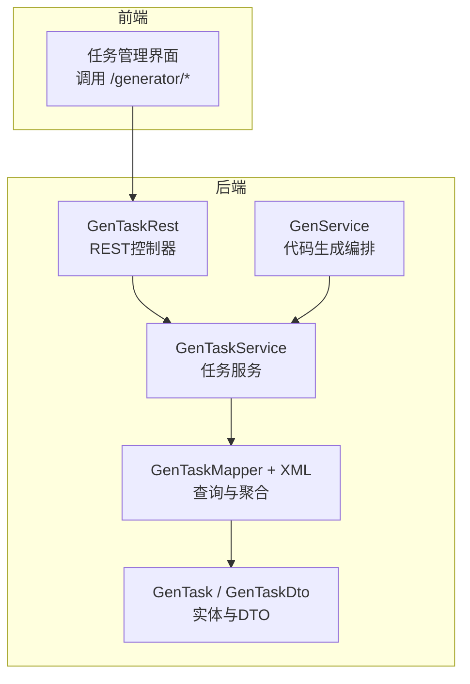
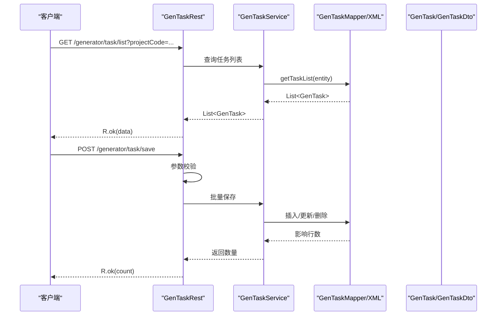
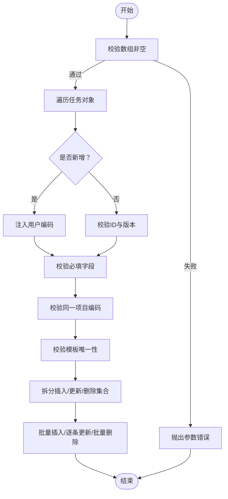
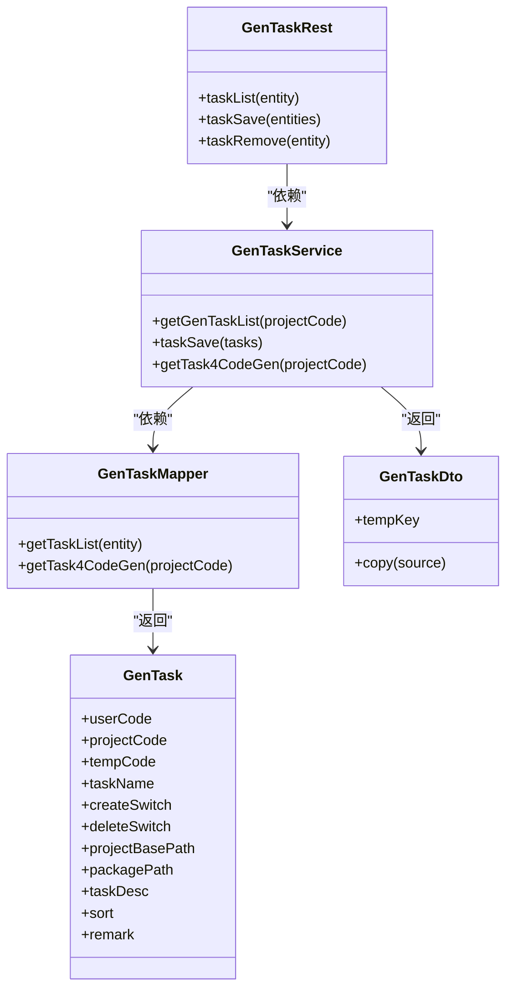

# 任务API

<cite>
**本文引用的文件**
- [GenTaskRest.java](file://generator-server/src/main/java/com/wkclz/generator/server/rest/GenTaskRest.java)
- [Route.java](file://generator-server/src/main/java/com/wkclz/generator/server/Route.java)
- [GenTaskService.java](file://generator-server/src/main/java/com/wkclz/generator/server/service/GenTaskService.java)
- [GenTaskMapper.java](file://generator-server/src/main/java/com/wkclz/generator/server/mapper/GenTaskMapper.java)
- [GenTaskMapper.xml](file://generator-server/src/main/resources/mapper/GenTaskMapper.xml)
- [GenTask.java](file://generator-server/src/main/java/com/wkclz/generator/server/bean/entity/GenTask.java)
- [GenTaskDto.java](file://generator-server/src/main/java/com/wkclz/generator/server/bean/dto/GenTaskDto.java)
- [GenService.java](file://generator-server/src/main/java/com/wkclz/generator/server/service/GenService.java)
- [task.js](file://generator-ui/src/api/task.js)
</cite>

## 目录
1. [简介](#简介)
2. [项目结构](#项目结构)
3. [核心组件](#核心组件)
4. [架构总览](#架构总览)
5. [详细组件分析](#详细组件分析)
6. [依赖分析](#依赖分析)
7. [性能考虑](#性能考虑)
8. [故障排查指南](#故障排查指南)
9. [结论](#结论)
10. [附录](#附录)

## 简介
本文件为“任务管理API”的完整接口文档，聚焦于任务的查询与管理能力，并结合代码生成链路中的任务规则配置与执行监控进行说明。内容涵盖：
- 任务列表查询、批量保存、单条删除等端点的HTTP方法、URL模式、请求参数与响应格式
- 任务规则配置要点（模板绑定、生成开关、删除开关、路径配置等）
- 任务执行状态与监控接口（基于日志服务的生成过程记录）
- 任务批量操作与调度管理建议
- 最佳实践与常见使用场景

## 项目结构
任务API位于后端模块的REST层，通过统一前缀与路由常量暴露接口；服务层负责业务编排与持久化；MyBatis映射器负责SQL查询与聚合。

图表来源
- [GenTaskRest.java:17-74](file://generator-server/src/main/java/com/wkclz/generator/server/rest/GenTaskRest.java#L17-L74)
- [GenTaskService.java:17-113](file://generator-server/src/main/java/com/wkclz/generator/server/service/GenTaskService.java#L17-L113)
- [GenTaskMapper.java:11-19](file://generator-server/src/main/java/com/wkclz/generator/server/mapper/GenTaskMapper.java#L11-L19)
- [GenTaskMapper.xml:1-61](file://generator-server/src/main/resources/mapper/GenTaskMapper.xml#L1-L61)
- [GenTask.java:17-122](file://generator-server/src/main/java/com/wkclz/generator/server/bean/entity/GenTask.java#L17-L122)
- [GenTaskDto.java:13-36](file://generator-server/src/main/java/com/wkclz/generator/server/bean/dto/GenTaskDto.java#L13-L36)
- [GenService.java:36-231](file://generator-server/src/main/java/com/wkclz/generator/server/service/GenService.java#L36-L231)

章节来源
- [Route.java:9-88](file://generator-server/src/main/java/com/wkclz/generator/server/Route.java#L9-L88)
- [GenTaskRest.java:17-74](file://generator-server/src/main/java/com/wkclz/generator/server/rest/GenTaskRest.java#L17-L74)

## 核心组件
- REST控制器：对外暴露任务查询、保存、删除接口，负责参数校验与返回封装
- 任务服务：实现任务列表查询、批量保存（插入/更新/删除）、生成规则查询
- 映射器与XML：提供任务列表查询、生成规则聚合查询
- 实体与DTO：任务实体承载字段，DTO扩展模板键用于生成规则展示
- 生成服务：在代码生成链路中读取任务规则，驱动模板渲染与产物打包

章节来源
- [GenTaskRest.java:17-74](file://generator-server/src/main/java/com/wkclz/generator/server/rest/GenTaskRest.java#L17-L74)
- [GenTaskService.java:17-113](file://generator-server/src/main/java/com/wkclz/generator/server/service/GenTaskService.java#L17-L113)
- [GenTaskMapper.java:11-19](file://generator-server/src/main/java/com/wkclz/generator/server/mapper/GenTaskMapper.java#L11-L19)
- [GenTaskMapper.xml:5-58](file://generator-server/src/main/resources/mapper/GenTaskMapper.xml#L5-L58)
- [GenTask.java:17-122](file://generator-server/src/main/java/com/wkclz/generator/server/bean/entity/GenTask.java#L17-L122)
- [GenTaskDto.java:13-36](file://generator-server/src/main/java/com/wkclz/generator/server/bean/dto/GenTaskDto.java#L13-L36)
- [GenService.java:68-70](file://generator-server/src/main/java/com/wkclz/generator/server/service/GenService.java#L68-L70)

## 架构总览
任务API的调用链从REST控制器进入，经由服务层处理业务逻辑，访问数据库映射器，最终返回给前端或生成服务消费。

图表来源
- [GenTaskRest.java:25-44](file://generator-server/src/main/java/com/wkclz/generator/server/rest/GenTaskRest.java#L25-L44)
- [GenTaskService.java:20-105](file://generator-server/src/main/java/com/wkclz/generator/server/service/GenTaskService.java#L20-L105)
- [GenTaskMapper.xml:5-35](file://generator-server/src/main/resources/mapper/GenTaskMapper.xml#L5-L35)

## 详细组件分析

### 任务查询接口
- 接口地址：GET /generator/task/list
- 请求参数：
  - projectCode：项目编码（必填）
  - userCode：用户编码（可选）
  - tempCode：模板编码（可选）
  - taskName：任务名称（模糊匹配，可选）
- 响应数据：任务列表（GenTask数组）

实现要点
- 控制器侧对projectCode进行非空校验
- 服务层构造查询条件并调用映射器
- XML映射器支持按条件动态拼接WHERE子句并排序

章节来源
- [Route.java:57-57](file://generator-server/src/main/java/com/wkclz/generator/server/Route.java#L57-L57)
- [GenTaskRest.java:25-30](file://generator-server/src/main/java/com/wkclz/generator/server/rest/GenTaskRest.java#L25-L30)
- [GenTaskService.java:20-25](file://generator-server/src/main/java/com/wkclz/generator/server/service/GenTaskService.java#L20-L25)
- [GenTaskMapper.xml:5-35](file://generator-server/src/main/resources/mapper/GenTaskMapper.xml#L5-L35)

### 任务保存接口（批量）
- 接口地址：POST /generator/task/save
- 请求体：任务对象数组（List<GenTask>）
- 请求参数校验：
  - 数组不能为空
  - 新增场景自动注入当前用户编码
  - 更新场景必须提供ID与版本信息
  - 必填字段：projectCode、taskName、tempCode
  - 同次请求仅允许一个项目编码
  - 每个模板编码在同次请求中唯一
- 响应数据：保存影响的任务数量

实现要点
- 服务层对比已存任务，拆分为插入、更新、删除三类
- 批量插入、逐条更新、批量删除
- 返回保存条数

图表来源
- [GenTaskRest.java:47-71](file://generator-server/src/main/java/com/wkclz/generator/server/rest/GenTaskRest.java#L47-L71)
- [GenTaskService.java:27-105](file://generator-server/src/main/java/com/wkclz/generator/server/service/GenTaskService.java#L27-L105)

章节来源
- [Route.java:59-59](file://generator-server/src/main/java/com/wkclz/generator/server/Route.java#L59-L59)
- [GenTaskRest.java:32-44](file://generator-server/src/main/java/com/wkclz/generator/server/rest/GenTaskRest.java#L32-L44)
- [GenTaskRest.java:47-71](file://generator-server/src/main/java/com/wkclz/generator/server/rest/GenTaskRest.java#L47-L71)
- [GenTaskService.java:27-105](file://generator-server/src/main/java/com/wkclz/generator/server/service/GenTaskService.java#L27-L105)

### 任务删除接口
- 接口地址：POST /generator/task/remove
- 请求体：任务对象（至少包含id）
- 响应数据：受影响行数

章节来源
- [Route.java:61-61](file://generator-server/src/main/java/com/wkclz/generator/server/Route.java#L61-L61)
- [GenTaskRest.java:39-44](file://generator-server/src/main/java/com/wkclz/generator/server/rest/GenTaskRest.java#L39-L44)

### 任务规则配置说明
- 关联查询：服务层提供生成规则查询接口，返回包含模板键的DTO列表
- 规则字段（任务实体）：
  - projectCode：项目编码
  - tempCode：模板编码
  - taskName：任务名称
  - createSwitch：是否生成（1=是，0=否）
  - deleteSwitch：是否删除（本地模式有效）
  - projectBasePath：任务项目基本路径
  - packagePath：任务包路径
  - sort：排序
  - remark：备注
- 生成规则DTO（GenTaskDto）：
  - 在任务实体基础上增加tempKey（模板键），用于前端展示与规则说明

章节来源
- [GenTaskService.java:107-110](file://generator-server/src/main/java/com/wkclz/generator/server/service/GenTaskService.java#L107-L110)
- [GenTaskMapper.xml:38-58](file://generator-server/src/main/resources/mapper/GenTaskMapper.xml#L38-L58)
- [GenTask.java:21-75](file://generator-server/src/main/java/com/wkclz/generator/server/bean/entity/GenTask.java#L21-L75)
- [GenTaskDto.java:18-36](file://generator-server/src/main/java/com/wkclz/generator/server/bean/dto/GenTaskDto.java#L18-L36)

### 任务执行状态与监控接口
- 代码生成接口（公开端点，供前端触发下载）：
  - GET /public/gen/data/{projectCode}：获取可生成数据（供前端预览/确认）
  - GET /public/gen/zip/{projectCode}：触发生成并下载压缩包
  - GET /public/gen/rule/{projectCode}：获取生成规则（任务规则+模板键）
- 生成过程监控：
  - 生成服务在开始与结束时分别记录与更新生成日志（GenLog）
  - 前端可通过日志接口查看生成历史与耗时

章节来源
- [Route.java:79-85](file://generator-server/src/main/java/com/wkclz/generator/server/Route.java#L79-L85)
- [GenService.java:55-90](file://generator-server/src/main/java/com/wkclz/generator/server/service/GenService.java#L55-L90)
- [GenService.java:68-70](file://generator-server/src/main/java/com/wkclz/generator/server/service/GenService.java#L68-L70)

### 任务批量操作与调度管理
- 批量操作
  - 保存接口支持一次提交多个任务，服务层自动区分插入/更新/删除
  - 删除接口支持单条删除
- 调度管理
  - 本项目未提供内置定时调度接口，建议通过外部调度系统（如Quartz/Cron）调用生成接口实现定时触发
  - 生成接口幂等：重复触发不会改变生成结果，但会生成新的日志记录

章节来源
- [GenTaskRest.java:32-44](file://generator-server/src/main/java/com/wkclz/generator/server/rest/GenTaskRest.java#L32-L44)
- [GenTaskService.java:27-105](file://generator-server/src/main/java/com/wkclz/generator/server/service/GenTaskService.java#L27-L105)
- [GenService.java:72-90](file://generator-server/src/main/java/com/wkclz/generator/server/service/GenService.java#L72-L90)

### 前端对接参考
- 任务列表查询：GET /generator/task/list
- 任务批量保存：POST /generator/task/save
- 任务删除：POST /generator/task/remove

章节来源
- [task.js:4-12](file://generator-ui/src/api/task.js#L4-L12)

## 依赖分析
任务API的内部依赖关系如下：

图表来源
- [GenTaskRest.java:17-74](file://generator-server/src/main/java/com/wkclz/generator/server/rest/GenTaskRest.java#L17-L74)
- [GenTaskService.java:17-113](file://generator-server/src/main/java/com/wkclz/generator/server/service/GenTaskService.java#L17-L113)
- [GenTaskMapper.java:11-19](file://generator-server/src/main/java/com/wkclz/generator/server/mapper/GenTaskMapper.java#L11-L19)
- [GenTask.java:17-122](file://generator-server/src/main/java/com/wkclz/generator/server/bean/entity/GenTask.java#L17-L122)
- [GenTaskDto.java:13-36](file://generator-server/src/main/java/com/wkclz/generator/server/bean/dto/GenTaskDto.java#L13-L36)

章节来源
- [GenTaskRest.java:17-74](file://generator-server/src/main/java/com/wkclz/generator/server/rest/GenTaskRest.java#L17-L74)
- [GenTaskService.java:17-113](file://generator-server/src/main/java/com/wkclz/generator/server/service/GenTaskService.java#L17-L113)
- [GenTaskMapper.java:11-19](file://generator-server/src/main/java/com/wkclz/generator/server/mapper/GenTaskMapper.java#L11-L19)
- [GenTask.java:17-122](file://generator-server/src/main/java/com/wkclz/generator/server/bean/entity/GenTask.java#L17-L122)
- [GenTaskDto.java:13-36](file://generator-server/src/main/java/com/wkclz/generator/server/bean/dto/GenTaskDto.java#L13-L36)

## 性能考虑
- 批量保存：服务层先做全量查询，再按模板编码拆分插入/更新/删除，避免重复写入
- SQL查询：映射器支持按条件动态拼接，建议前端传入必要过滤条件以减少结果集
- 生成过程：生成目录与压缩在服务端临时目录进行，注意磁盘空间与I/O开销

## 故障排查指南
- 参数校验失败
  - 保存接口要求数组非空、必填字段完整、同一请求仅一个项目、模板唯一
  - 删除接口要求提供ID
- 生成异常
  - 生成过程中若模板解析异常，会记录异常信息并继续生成其他文件
  - 若无可用生成数据，会提示“没有可生成代码的数据”
- 日志核对
  - 通过生成日志记录的开始/结束时间判断生成耗时与异常

章节来源
- [GenTaskRest.java:47-71](file://generator-server/src/main/java/com/wkclz/generator/server/rest/GenTaskRest.java#L47-L71)
- [GenService.java:72-90](file://generator-server/src/main/java/com/wkclz/generator/server/service/GenService.java#L72-L90)
- [GenService.java:92-159](file://generator-server/src/main/java/com/wkclz/generator/server/service/GenService.java#L92-L159)

## 结论
任务API提供了完整的任务查询、批量保存与删除能力，并通过生成规则查询与代码生成接口形成闭环。建议在生产环境中配合外部调度系统实现定时触发，并通过日志接口进行执行状态监控与问题定位。

## 附录

### 接口清单与字段说明

- GET /generator/task/list
  - 查询参数：projectCode（必填）、userCode（可选）、tempCode（可选）、taskName（可选）
  - 响应：任务列表（GenTask[]）

- POST /generator/task/save
  - 请求体：List<GenTask>
  - 字段：id（新增可为空，更新必填）、userCode（新增自动注入）、projectCode（必填）、taskName（必填）、tempCode（必填）、createSwitch（必填）、deleteSwitch（必填）、projectBasePath、packagePath、taskDesc、sort、remark
  - 响应：保存数量（整数）

- POST /generator/task/remove
  - 请求体：GenTask（至少包含id）
  - 响应：受影响行数（整数）

- GET /public/gen/data/{projectCode}
  - 响应：可生成数据（用于前端预览/确认）

- GET /public/gen/zip/{projectCode}
  - 响应：压缩包下载（二进制流）

- GET /public/gen/rule/{projectCode}
  - 响应：生成规则（GenTaskDto[]，包含tempKey）

章节来源
- [Route.java:57-85](file://generator-server/src/main/java/com/wkclz/generator/server/Route.java#L57-L85)
- [GenTaskRest.java:25-44](file://generator-server/src/main/java/com/wkclz/generator/server/rest/GenTaskRest.java#L25-L44)
- [GenTaskService.java:20-25](file://generator-server/src/main/java/com/wkclz/generator/server/service/GenTaskService.java#L20-L25)
- [GenTaskService.java:107-110](file://generator-server/src/main/java/com/wkclz/generator/server/service/GenTaskService.java#L107-L110)
- [GenService.java:55-90](file://generator-server/src/main/java/com/wkclz/generator/server/service/GenService.java#L55-L90)
- [GenService.java:68-70](file://generator-server/src/main/java/com/wkclz/generator/server/service/GenService.java#L68-L70)