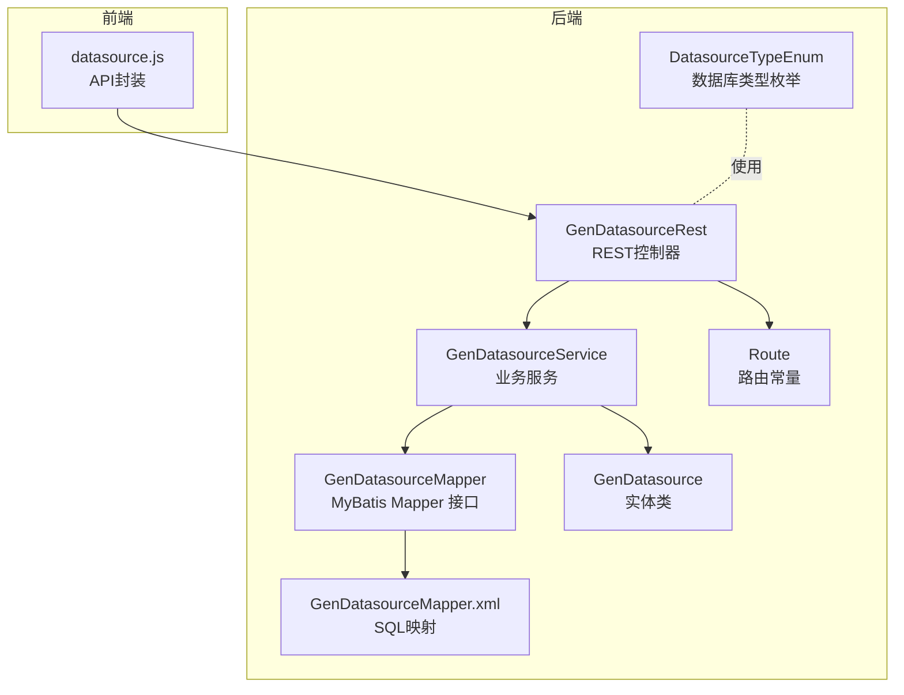
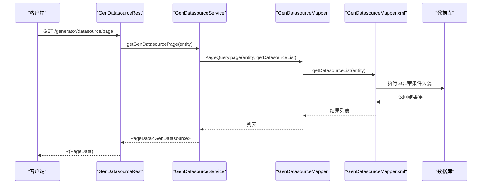
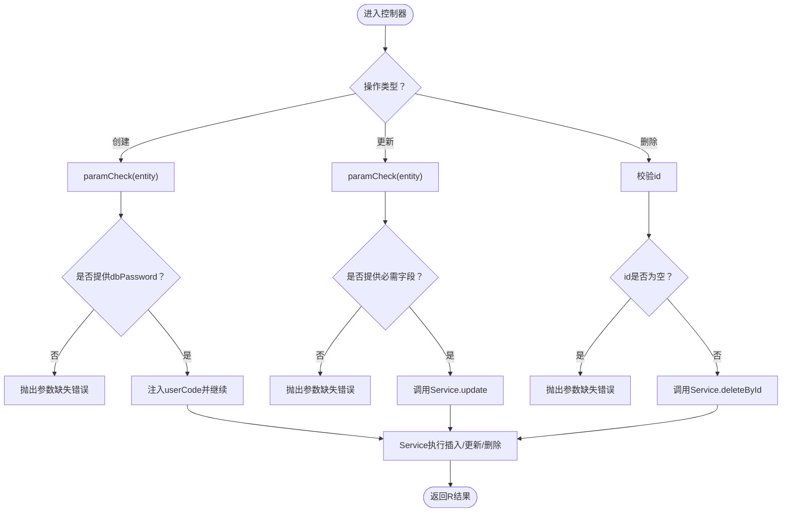
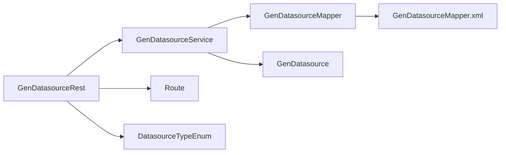

# 数据源API

<cite>
**本文引用的文件**
- [GenDatasourceRest.java](file://generator-server/src/main/java/com/wkclz/generator/server/rest/GenDatasourceRest.java)
- [GenDatasourceService.java](file://generator-server/src/main/java/com/wkclz/generator/server/service/GenDatasourceService.java)
- [GenDatasourceMapper.java](file://generator-server/src/main/java/com/wkclz/generator/server/mapper/GenDatasourceMapper.java)
- [GenDatasourceMapper.xml](file://generator-server/src/main/resources/mapper/GenDatasourceMapper.xml)
- [Route.java](file://generator-server/src/main/java/com/wkclz/generator/server/Route.java)
- [GenDatasource.java](file://generator-server/src/main/java/com/wkclz/generator/server/bean/entity/GenDatasource.java)
- [DatasourceTypeEnum.java](file://generator-server/src/main/java/com/wkclz/generator/server/bean/enums/DatasourceTypeEnum.java)
- [datasource.js](file://generator-ui/src/api/datasource.js)
</cite>

## 目录
1. [简介](#简介)
2. [项目结构](#项目结构)
3. [核心组件](#核心组件)
4. [架构总览](#架构总览)
5. [详细组件分析](#详细组件分析)
6. [依赖分析](#依赖分析)
7. [性能考虑](#性能考虑)
8. [故障排查指南](#故障排查指南)
9. [结论](#结论)
10. [附录](#附录)

## 简介
本文件为“数据源管理API”的完整接口文档，覆盖数据源的CRUD与选项查询能力，包括：
- 分页查询：按条件筛选并分页返回数据源列表
- 详情获取：按主键获取单条数据源信息（敏感字段脱敏）
- 创建：新增数据源
- 更新：按版本号更新数据源（支持部分字段更新）
- 删除：按主键删除数据源
- 选项查询：获取可用数据源列表（常用于下拉选择）

同时，文档给出请求与响应示例、参数校验规则、数据源配置参数说明以及常见使用场景。

## 项目结构
后端采用Spring Boot + MyBatis，REST控制器位于服务端模块，数据访问通过Mapper与XML映射实现；前端通过统一的API封装调用后端路由。

图表来源
- [GenDatasourceRest.java:1-83](file://generator-server/src/main/java/com/wkclz/generator/server/rest/GenDatasourceRest.java#L1-L83)
- [GenDatasourceService.java:1-59](file://generator-server/src/main/java/com/wkclz/generator/server/service/GenDatasourceService.java#L1-L59)
- [GenDatasourceMapper.java:1-17](file://generator-server/src/main/java/com/wkclz/generator/server/mapper/GenDatasourceMapper.java#L1-L17)
- [GenDatasourceMapper.xml:1-59](file://generator-server/src/main/resources/mapper/GenDatasourceMapper.xml#L1-L59)
- [Route.java:1-89](file://generator-server/src/main/java/com/wkclz/generator/server/Route.java#L1-L89)
- [GenDatasource.java:1-116](file://generator-server/src/main/java/com/wkclz/generator/server/bean/entity/GenDatasource.java#L1-L116)
- [DatasourceTypeEnum.java:1-57](file://generator-server/src/main/java/com/wkclz/generator/server/bean/enums/DatasourceTypeEnum.java#L1-L57)
- [datasource.js:1-33](file://generator-ui/src/api/datasource.js#L1-L33)

章节来源
- [Route.java:9-25](file://generator-server/src/main/java/com/wkclz/generator/server/Route.java#L9-L25)
- [GenDatasourceRest.java:16-83](file://generator-server/src/main/java/com/wkclz/generator/server/rest/GenDatasourceRest.java#L16-L83)
- [datasource.js:1-33](file://generator-ui/src/api/datasource.js#L1-L33)

## 核心组件
- REST控制器：提供数据源的分页、详情、创建、更新、删除、选项查询等HTTP端点
- 业务服务：封装分页查询、创建、更新、删除、按编码获取数据源等逻辑
- 数据访问层：基于MyBatis的Mapper接口与XML映射，提供列表查询与选项查询
- 实体类：定义数据源字段及拷贝工具方法
- 枚举类：定义可用的数据库类型集合
- 路由常量：集中管理各端点的URL路径

章节来源
- [GenDatasourceRest.java:16-83](file://generator-server/src/main/java/com/wkclz/generator/server/rest/GenDatasourceRest.java#L16-L83)
- [GenDatasourceService.java:17-59](file://generator-server/src/main/java/com/wkclz/generator/server/service/GenDatasourceService.java#L17-L59)
- [GenDatasourceMapper.java:10-16](file://generator-server/src/main/java/com/wkclz/generator/server/mapper/GenDatasourceMapper.java#L10-L16)
- [GenDatasource.java:19-116](file://generator-server/src/main/java/com/wkclz/generator/server/bean/entity/GenDatasource.java#L19-L116)
- [DatasourceTypeEnum.java:13-57](file://generator-server/src/main/java/com/wkclz/generator/server/bean/enums/DatasourceTypeEnum.java#L13-L57)
- [Route.java:14-25](file://generator-server/src/main/java/com/wkclz/generator/server/Route.java#L14-L25)

## 架构总览
以下序列图展示“分页查询”端点从客户端到数据库的调用链路。

图表来源
- [GenDatasourceRest.java:24-28](file://generator-server/src/main/java/com/wkclz/generator/server/rest/GenDatasourceRest.java#L24-L28)
- [GenDatasourceService.java:19-21](file://generator-server/src/main/java/com/wkclz/generator/server/service/GenDatasourceService.java#L19-L21)
- [GenDatasourceMapper.java](file://generator-server/src/main/java/com/wkclz/generator/server/mapper/GenDatasourceMapper.java#L12)
- [GenDatasourceMapper.xml:5-34](file://generator-server/src/main/resources/mapper/GenDatasourceMapper.xml#L5-L34)

## 详细组件分析

### 数据源实体与字段说明
- 字段清单与约束来源于实体类注解与校验逻辑，关键字段如下：
  - 用户编码：用户维度隔离数据源
  - 数据源编码：唯一标识
  - 数据库类型：取值来自枚举
  - 主机地址、端口、数据库名、用户名、密码
  - 版本号：用于并发更新控制
  - 排序、创建时间、更新时间、备注等基础字段

章节来源
- [GenDatasource.java:24-67](file://generator-server/src/main/java/com/wkclz/generator/server/bean/entity/GenDatasource.java#L24-L67)
- [DatasourceTypeEnum.java:13-24](file://generator-server/src/main/java/com/wkclz/generator/server/bean/enums/DatasourceTypeEnum.java#L13-L24)

### 数据源类型枚举
- 支持类型：MySQL、PostgreSQL、MariaDB、Oracle、Oracle2
- 提供类型名与驱动类名映射，便于运行时选择对应驱动

章节来源
- [DatasourceTypeEnum.java:13-57](file://generator-server/src/main/java/com/wkclz/generator/server/bean/enums/DatasourceTypeEnum.java#L13-L57)

### 路由与端点
- 前缀：/generator
- 端点：
  - GET /generator/datasource/page：分页查询
  - GET /generator/datasource/detail：详情获取
  - POST /generator/datasource/create：创建
  - POST /generator/datasource/update：更新
  - POST /generator/datasource/remove：删除
  - GET /generator/datasource/options：选项查询

章节来源
- [Route.java:9-25](file://generator-server/src/main/java/com/wkclz/generator/server/Route.java#L9-L25)
- [GenDatasourceRest.java:24-63](file://generator-server/src/main/java/com/wkclz/generator/server/rest/GenDatasourceRest.java#L24-L63)

### 参数校验与处理流程
- 控制器层在创建/更新前进行参数校验，并对敏感字段做处理：
  - 创建时自动注入用户编码，要求提供数据库密码
  - 更新时要求提供数据源编码、主键、版本号，且数据库类型、主机、端口、库名、用户名均不可为空
  - 详情返回时会清除数据库密码字段
- 业务层在更新时：
  - 校验数据源存在性
  - 非空字段才进行属性拷贝
  - 密码为空时不覆盖原密码

图表来源
- [GenDatasourceRest.java:38-81](file://generator-server/src/main/java/com/wkclz/generator/server/rest/GenDatasourceRest.java#L38-L81)
- [GenDatasourceService.java:27-40](file://generator-server/src/main/java/com/wkclz/generator/server/service/GenDatasourceService.java#L27-L40)

章节来源
- [GenDatasourceRest.java:38-81](file://generator-server/src/main/java/com/wkclz/generator/server/rest/GenDatasourceRest.java#L38-L81)
- [GenDatasourceService.java:31-40](file://generator-server/src/main/java/com/wkclz/generator/server/service/GenDatasourceService.java#L31-L40)

### 分页查询
- 方法与URL：GET /generator/datasource/page
- 请求参数（查询条件）：
  - dbCode：模糊匹配
  - dbType：精确匹配
  - dbHost：模糊匹配
  - dbSchema：模糊匹配
  - userCode：精确匹配
- 响应：分页包装对象，包含列表与分页信息
- SQL映射：根据传入条件动态拼接WHERE子句

章节来源
- [GenDatasourceRest.java:24-28](file://generator-server/src/main/java/com/wkclz/generator/server/rest/GenDatasourceRest.java#L24-L28)
- [GenDatasourceMapper.xml:24-30](file://generator-server/src/main/resources/mapper/GenDatasourceMapper.xml#L24-L30)

### 详情获取
- 方法与URL：GET /generator/datasource/detail
- 请求参数：
  - id：必填
- 响应：单条数据源信息，数据库密码字段置空
- 校验：必须提供id

章节来源
- [GenDatasourceRest.java:30-36](file://generator-server/src/main/java/com/wkclz/generator/server/rest/GenDatasourceRest.java#L30-L36)

### 创建数据源
- 方法与URL：POST /generator/datasource/create
- 请求体：GenDatasource实体
- 校验规则：
  - 新增时必须提供数据库类型、主机、端口、库名、用户名、数据库密码
  - 自动注入用户编码
- 响应：受影响行数（通常为1）

章节来源
- [GenDatasourceRest.java:38-43](file://generator-server/src/main/java/com/wkclz/generator/server/rest/GenDatasourceRest.java#L38-L43)
- [GenDatasourceRest.java:67-81](file://generator-server/src/main/java/com/wkclz/generator/server/rest/GenDatasourceRest.java#L67-L81)

### 更新数据源
- 方法与URL：POST /generator/datasource/update
- 请求体：GenDatasource实体（需包含主键、版本号、数据源编码）
- 校验规则：
  - 必须提供数据库类型、主机、端口、库名、用户名
- 更新策略：
  - 若请求体未提供密码，则不覆盖原密码
  - 仅对非空字段进行更新
- 响应：受影响行数（通常为1）

章节来源
- [GenDatasourceRest.java:45-50](file://generator-server/src/main/java/com/wkclz/generator/server/rest/GenDatasourceRest.java#L45-L50)
- [GenDatasourceRest.java:67-81](file://generator-server/src/main/java/com/wkclz/generator/server/rest/GenDatasourceRest.java#L67-L81)
- [GenDatasourceService.java:31-40](file://generator-server/src/main/java/com/wkclz/generator/server/service/GenDatasourceService.java#L31-L40)

### 删除数据源
- 方法与URL：POST /generator/datasource/remove
- 请求体：包含主键的GenDatasource实体
- 校验：必须提供id
- 响应：受影响行数（通常为1）

章节来源
- [GenDatasourceRest.java:52-57](file://generator-server/src/main/java/com/wkclz/generator/server/rest/GenDatasourceRest.java#L52-L57)

### 选项查询
- 方法与URL：GET /generator/datasource/options
- 请求参数：可选过滤条件（如dbType、userCode）
- 响应：可用数据源列表（不含敏感字段）
- SQL映射：按条件过滤并排序

章节来源
- [GenDatasourceRest.java:59-63](file://generator-server/src/main/java/com/wkclz/generator/server/rest/GenDatasourceRest.java#L59-L63)
- [GenDatasourceMapper.xml:37-55](file://generator-server/src/main/resources/mapper/GenDatasourceMapper.xml#L37-L55)

### 前端调用示例
- 前端通过统一API封装调用后端路由，示例：
  - 新增：POST /generator/datasource/create
  - 分页：GET /generator/datasource/page
  - 修改：POST /generator/datasource/update
  - 详情：GET /generator/datasource/detail
  - 删除：POST /generator/datasource/remove
  - 选项：GET /generator/datasource/options

章节来源
- [datasource.js:3-31](file://generator-ui/src/api/datasource.js#L3-L31)

## 依赖分析
- 控制器依赖业务服务与路由常量
- 业务服务依赖Mapper接口与分页查询工具
- Mapper接口依赖XML映射SQL
- 实体类被控制器与服务共同使用
- 枚举类被控制器与服务用于类型判断

图表来源
- [GenDatasourceRest.java:16-21](file://generator-server/src/main/java/com/wkclz/generator/server/rest/GenDatasourceRest.java#L16-L21)
- [GenDatasourceService.java:17-17](file://generator-server/src/main/java/com/wkclz/generator/server/service/GenDatasourceService.java#L17-L17)
- [GenDatasourceMapper.java:10-16](file://generator-server/src/main/java/com/wkclz/generator/server/mapper/GenDatasourceMapper.java#L10-L16)
- [GenDatasourceMapper.xml:1-59](file://generator-server/src/main/resources/mapper/GenDatasourceMapper.xml#L1-L59)
- [GenDatasource.java:19-116](file://generator-server/src/main/java/com/wkclz/generator/server/bean/entity/GenDatasource.java#L19-L116)
- [DatasourceTypeEnum.java:13-57](file://generator-server/src/main/java/com/wkclz/generator/server/bean/enums/DatasourceTypeEnum.java#L13-L57)
- [Route.java:14-25](file://generator-server/src/main/java/com/wkclz/generator/server/Route.java#L14-L25)

章节来源
- [GenDatasourceRest.java:16-21](file://generator-server/src/main/java/com/wkclz/generator/server/rest/GenDatasourceRest.java#L16-L21)
- [GenDatasourceService.java:17-17](file://generator-server/src/main/java/com/wkclz/generator/server/service/GenDatasourceService.java#L17-L17)
- [GenDatasourceMapper.java:10-16](file://generator-server/src/main/java/com/wkclz/generator/server/mapper/GenDatasourceMapper.java#L10-L16)

## 性能考虑
- 分页查询建议传入合理过滤条件以减少全表扫描
- 详情与选项接口返回不含敏感字段，避免不必要的数据传输
- 更新时仅对非空字段进行更新，降低写放大
- 建议在前端对频繁调用的选项接口进行缓存

## 故障排查指南
- 参数缺失：创建/更新时缺少必填字段会触发参数校验异常
- 数据源不存在：更新时若主键不存在会提示数据源不存在
- 并发冲突：更新需携带版本号，避免覆盖他人修改
- 前端错误码参考：401（认证失败）、403（权限不足）、404（资源不存在）

章节来源
- [GenDatasourceRest.java:32-34](file://generator-server/src/main/java/com/wkclz/generator/server/rest/GenDatasourceRest.java#L32-L34)
- [GenDatasourceRest.java:47-49](file://generator-server/src/main/java/com/wkclz/generator/server/rest/GenDatasourceRest.java#L47-L49)
- [GenDatasourceService.java:32-33](file://generator-server/src/main/java/com/wkclz/generator/server/service/GenDatasourceService.java#L32-L33)

## 结论
数据源API提供了完整的CRUD与选项查询能力，具备明确的参数校验与安全处理（敏感字段脱敏），配合前端统一API封装，可快速完成数据源的管理与集成。

## 附录

### 接口一览表
- GET /generator/datasource/page：分页查询
- GET /generator/datasource/detail：详情获取
- POST /generator/datasource/create：创建
- POST /generator/datasource/update：更新
- POST /generator/datasource/remove：删除
- GET /generator/datasource/options：选项查询

章节来源
- [Route.java:14-25](file://generator-server/src/main/java/com/wkclz/generator/server/Route.java#L14-L25)

### 请求与响应示例（示意）
- 分页查询
  - 请求：GET /generator/datasource/page?dbType=MYSQL&dbHost=192.168.1.&userCode=U001
  - 响应：包含分页信息与列表
- 详情获取
  - 请求：GET /generator/datasource/detail?id=1
  - 响应：单条数据源，dbPassword为空
- 创建
  - 请求体：包含dbType/dbHost/dbPort/dbSchema/dbUsername/dbPassword等
  - 响应：受影响行数
- 更新
  - 请求体：包含id/version/dbCode等必要字段，可选dbPassword
  - 响应：受影响行数
- 删除
  - 请求体：包含id
  - 响应：受影响行数
- 选项查询
  - 请求：GET /generator/datasource/options?dbType=MYSQL&userCode=U001
  - 响应：可用数据源列表

章节来源
- [GenDatasourceRest.java:24-63](file://generator-server/src/main/java/com/wkclz/generator/server/rest/GenDatasourceRest.java#L24-L63)
- [GenDatasourceMapper.xml:24-55](file://generator-server/src/main/resources/mapper/GenDatasourceMapper.xml#L24-L55)

### 数据源配置参数说明
- dbCode：数据源编码（唯一标识）
- dbType：数据库类型（取值见枚举）
- dbHost：数据库主机地址
- dbPort：数据库端口
- dbSchema：数据库名
- dbUsername：数据库用户名
- dbPassword：数据库密码（创建时必填；更新时可选）
- userCode：用户编码（创建时自动注入）
- version：版本号（更新时必填）

章节来源
- [GenDatasource.java:24-67](file://generator-server/src/main/java/com/wkclz/generator/server/bean/entity/GenDatasource.java#L24-L67)
- [DatasourceTypeEnum.java:13-24](file://generator-server/src/main/java/com/wkclz/generator/server/bean/enums/DatasourceTypeEnum.java#L13-L24)
- [GenDatasourceRest.java:67-81](file://generator-server/src/main/java/com/wkclz/generator/server/rest/GenDatasourceRest.java#L67-L81)

### 常见使用场景
- 在项目初始化时创建数据源，随后在模板或任务中引用该数据源编码
- 通过选项接口为下拉框提供数据源列表
- 对多租户或多用户环境，结合userCode进行数据隔离