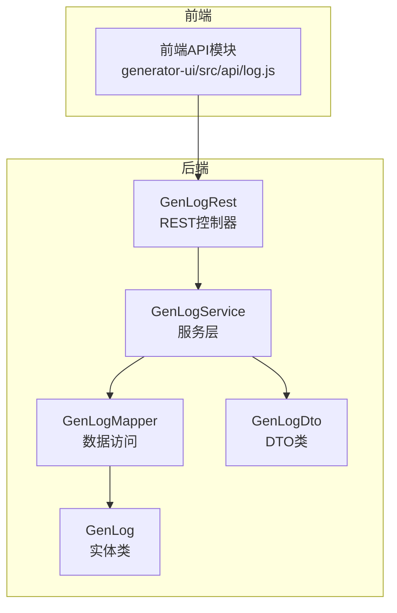
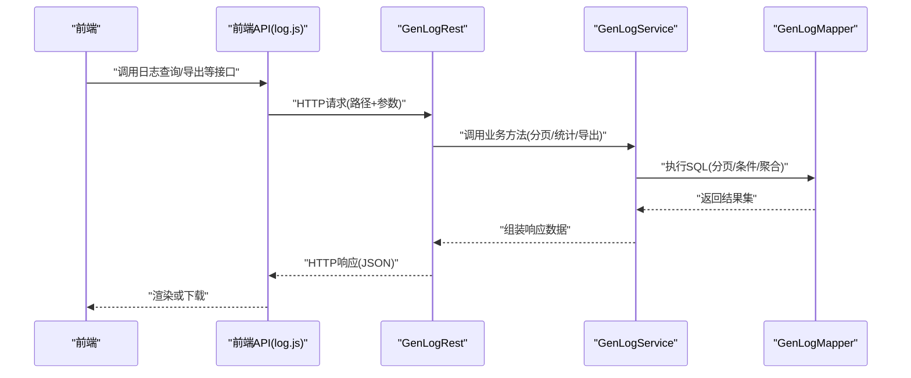
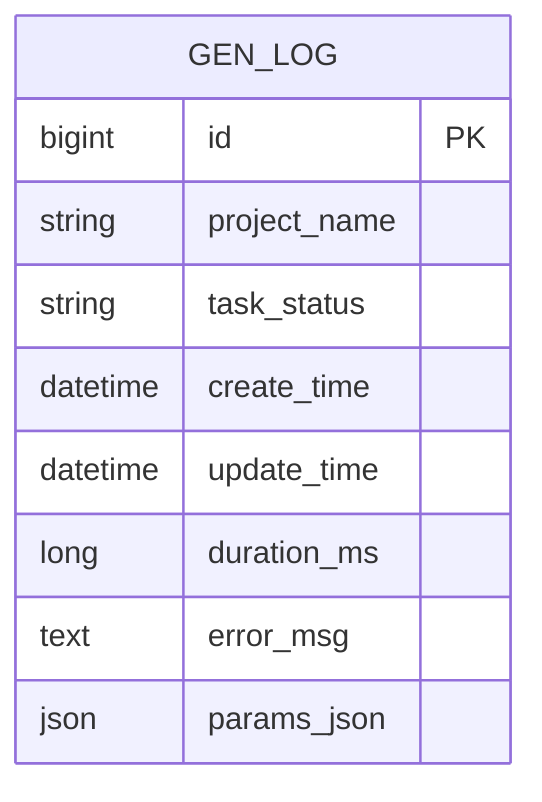
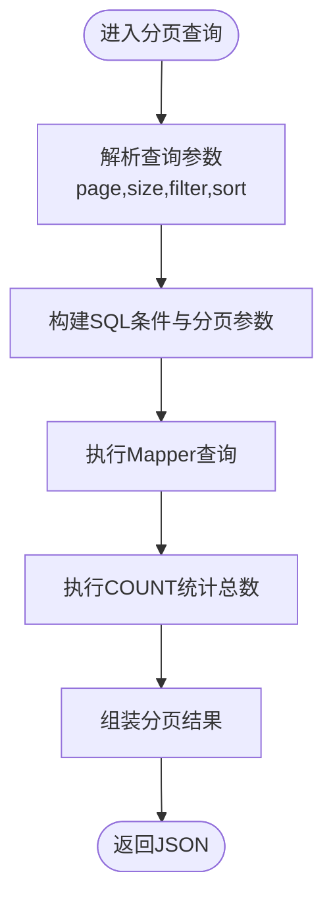
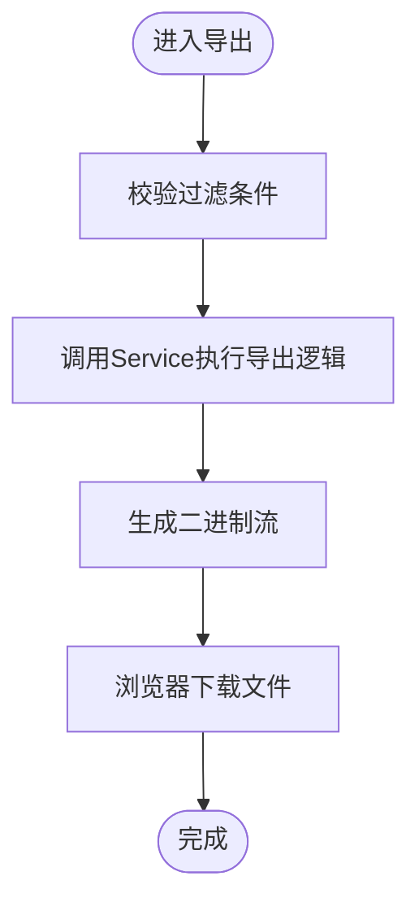
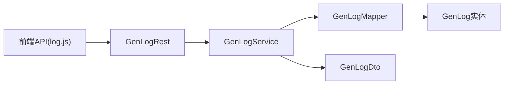

# 日志API

<cite>
**本文引用的文件**
- [GenLogRest.java](file://generator-server/src/main/java/com/wkclz/generator/server/rest/GenLogRest.java)
- [GenLogService.java](file://generator-server/src/main/java/com/wkclz/generator/server/service/GenLogService.java)
- [GenLogMapper.java](file://generator-server/src/main/java/com/wkclz/generator/server/mapper/GenLogMapper.java)
- [GenLog.java](file://generator-server/src/main/java/com/wkclz/generator/server/bean/entity/GenLog.java)
- [GenLogDto.java](file://generator-server/src/main/java/com/wkclz/generator/server/bean/dto/GenLogDto.java)
- [log.js](file://generator-ui/src/api/log.js)
</cite>

## 目录
1. [简介](#简介)
2. [项目结构](#项目结构)
3. [核心组件](#核心组件)
4. [架构总览](#架构总览)
5. [详细组件分析](#详细组件分析)
6. [依赖关系分析](#依赖关系分析)
7. [性能考虑](#性能考虑)
8. [故障排查指南](#故障排查指南)
9. [结论](#结论)
10. [附录](#附录)

## 简介
本文件面向日志管理API，系统性梳理日志查询与管理相关接口，覆盖分页查询、详情获取、清理、统计分析、导出下载等功能，并结合前端调用示例说明请求参数与响应格式。同时提供最佳实践与故障排查建议，帮助用户高效监控与分析代码生成过程。

## 项目结构
日志API位于后端服务模块中，采用标准的分层架构：REST 控制器负责对外暴露HTTP接口；Service 层封装业务逻辑；Mapper 负责数据库访问；实体与DTO用于数据传输与转换；前端通过独立的API模块发起请求。

图表来源
- [GenLogRest.java:1-200](file://generator-server/src/main/java/com/wkclz/generator/server/rest/GenLogRest.java#L1-L200)
- [GenLogService.java:1-200](file://generator-server/src/main/java/com/wkclz/generator/server/service/GenLogService.java#L1-L200)
- [GenLogMapper.java:1-200](file://generator-server/src/main/java/com/wkclz/generator/server/mapper/GenLogMapper.java#L1-L200)
- [GenLog.java:1-200](file://generator-server/src/main/java/com/wkclz/generator/server/bean/entity/GenLog.java#L1-L200)
- [GenLogDto.java:1-200](file://generator-server/src/main/java/com/wkclz/generator/server/bean/dto/GenLogDto.java#L1-L200)
- [log.js:1-200](file://generator-ui/src/api/log.js#L1-L200)

章节来源
- [GenLogRest.java:1-200](file://generator-server/src/main/java/com/wkclz/generator/server/rest/GenLogRest.java#L1-L200)
- [GenLogService.java:1-200](file://generator-server/src/main/java/com/wkclz/generator/server/service/GenLogService.java#L1-L200)
- [GenLogMapper.java:1-200](file://generator-server/src/main/java/com/wkclz/generator/server/mapper/GenLogMapper.java#L1-L200)
- [GenLog.java:1-200](file://generator-server/src/main/java/com/wkclz/generator/server/bean/entity/GenLog.java#L1-L200)
- [GenLogDto.java:1-200](file://generator-server/src/main/java/com/wkclz/generator/server/bean/dto/GenLogDto.java#L1-L200)
- [log.js:1-200](file://generator-ui/src/api/log.js#L1-L200)

## 核心组件
- GenLogRest：对外暴露日志管理相关HTTP接口，处理分页查询、详情、清理、导出等请求。
- GenLogService：实现日志查询、统计、清理、导出等业务逻辑。
- GenLogMapper：定义日志相关的SQL映射，支持分页、条件查询、统计聚合等。
- GenLog：日志实体，承载日志表字段与业务属性。
- GenLogDto：日志传输对象，用于接口间的数据传递与序列化。
- 前端API模块：提供统一的日志接口调用封装，便于UI页面使用。

章节来源
- [GenLogRest.java:1-200](file://generator-server/src/main/java/com/wkclz/generator/server/rest/GenLogRest.java#L1-L200)
- [GenLogService.java:1-200](file://generator-server/src/main/java/com/wkclz/generator/server/service/GenLogService.java#L1-L200)
- [GenLogMapper.java:1-200](file://generator-server/src/main/java/com/wkclz/generator/server/mapper/GenLogMapper.java#L1-L200)
- [GenLog.java:1-200](file://generator-server/src/main/java/com/wkclz/generator/server/bean/entity/GenLog.java#L1-L200)
- [GenLogDto.java:1-200](file://generator-server/src/main/java/com/wkclz/generator/server/bean/dto/GenLogDto.java#L1-L200)
- [log.js:1-200](file://generator-ui/src/api/log.js#L1-L200)

## 架构总览
下图展示从前端到后端的典型调用链路：前端通过API模块发起请求，REST控制器接收并校验参数，Service层执行业务逻辑（含分页、过滤、统计、导出），Mapper访问数据库，最终返回结果。

图表来源
- [log.js:1-200](file://generator-ui/src/api/log.js#L1-L200)
- [GenLogRest.java:1-200](file://generator-server/src/main/java/com/wkclz/generator/server/rest/GenLogRest.java#L1-L200)
- [GenLogService.java:1-200](file://generator-server/src/main/java/com/wkclz/generator/server/service/GenLogService.java#L1-L200)
- [GenLogMapper.java:1-200](file://generator-server/src/main/java/com/wkclz/generator/server/mapper/GenLogMapper.java#L1-L200)

## 详细组件分析

### 接口清单与规范
以下为日志管理API的端点说明，涵盖HTTP方法、URL模式、请求参数、响应格式与典型场景。

- 分页查询日志
  - 方法：GET
  - 路径：/gen/log/page
  - 查询参数：
    - page（页码，整数）
    - size（每页条数，整数）
    - startTime（开始时间，可选）
    - endTime（结束时间，可选）
    - projectName（项目名称，模糊匹配，可选）
    - taskStatus（任务状态，可选）
    - sort（排序字段，如 createTime，可选）
    - order（排序方向 asc/desc，可选）
  - 响应：分页结果，包含列表与总数
  - 典型用途：在管理界面分页浏览日志，支持多条件组合过滤

- 获取日志详情
  - 方法：GET
  - 路径：/gen/log/{id}
  - 路径参数：id（日志ID）
  - 响应：单条日志详情，包含生成任务、模板、数据源等关联信息

- 清理日志
  - 方法：DELETE
  - 路径：/gen/log/clean
  - 查询参数：
    - keepDays（保留天数，整数）
    - projectName（项目名称，可选）
    - taskStatus（任务状态，可选）
  - 响应：删除影响的记录数
  - 典型用途：定期清理过期日志，控制存储占用

- 导出日志
  - 方法：POST
  - 路径：/gen/log/export
  - 请求体：与分页查询相同的过滤条件（startTime、endTime、projectName、taskStatus、sort、order）
  - 响应：二进制流（Excel/CSV），浏览器触发下载
  - 典型用途：批量导出日志进行离线分析

- 统计分析
  - 方法：GET
  - 路径：/gen/log/stats
  - 查询参数：
    - startTime（开始时间）
    - endTime（结束时间）
    - projectName（项目名称，可选）
  - 响应：统计指标集合，如生成次数、成功/失败次数、平均耗时等
  - 典型用途：生成报表与看板数据

章节来源
- [GenLogRest.java:1-200](file://generator-server/src/main/java/com/wkclz/generator/server/rest/GenLogRest.java#L1-L200)
- [log.js:1-200](file://generator-ui/src/api/log.js#L1-L200)

### 过滤与搜索能力
- 时间范围：支持 startTime 与 endTime 双边界过滤
- 项目名称：支持 projectName 的模糊匹配
- 任务状态：支持 taskStatus 精确过滤
- 排序：支持 sort 与 order 参数，可按任意字段排序
- 分页：page 与 size 控制分页行为

章节来源
- [GenLogRest.java:1-200](file://generator-server/src/main/java/com/wkclz/generator/server/rest/GenLogRest.java#L1-L200)
- [GenLogMapper.java:1-200](file://generator-server/src/main/java/com/wkclz/generator/server/mapper/GenLogMapper.java#L1-L200)

### 数据模型与关系

图表来源
- [GenLog.java:1-200](file://generator-server/src/main/java/com/wkclz/generator/server/bean/entity/GenLog.java#L1-L200)

章节来源
- [GenLog.java:1-200](file://generator-server/src/main/java/com/wkclz/generator/server/bean/entity/GenLog.java#L1-L200)

### 关键流程图

#### 分页查询流程

图表来源
- [GenLogRest.java:1-200](file://generator-server/src/main/java/com/wkclz/generator/server/rest/GenLogRest.java#L1-L200)
- [GenLogMapper.java:1-200](file://generator-server/src/main/java/com/wkclz/generator/server/mapper/GenLogMapper.java#L1-L200)

#### 导出流程

图表来源
- [GenLogRest.java:1-200](file://generator-server/src/main/java/com/wkclz/generator/server/rest/GenLogRest.java#L1-L200)
- [GenLogService.java:1-200](file://generator-server/src/main/java/com/wkclz/generator/server/service/GenLogService.java#L1-L200)

## 依赖关系分析
- 控制器依赖服务层：REST 控制器仅负责参数校验与结果封装，具体逻辑由 Service 承担
- 服务层依赖 Mapper：Service 调用 Mapper 完成数据库操作
- 实体与DTO：Mapper 返回实体，Service 可转换为DTO对外输出
- 前端依赖后端：前端API模块封装HTTP调用，统一错误处理与下载逻辑

图表来源
- [log.js:1-200](file://generator-ui/src/api/log.js#L1-L200)
- [GenLogRest.java:1-200](file://generator-server/src/main/java/com/wkclz/generator/server/rest/GenLogRest.java#L1-L200)
- [GenLogService.java:1-200](file://generator-server/src/main/java/com/wkclz/generator/server/service/GenLogService.java#L1-L200)
- [GenLogMapper.java:1-200](file://generator-server/src/main/java/com/wkclz/generator/server/mapper/GenLogMapper.java#L1-L200)
- [GenLog.java:1-200](file://generator-server/src/main/java/com/wkclz/generator/server/bean/entity/GenLog.java#L1-L200)
- [GenLogDto.java:1-200](file://generator-server/src/main/java/com/wkclz/generator/server/bean/dto/GenLogDto.java#L1-L200)

章节来源
- [log.js:1-200](file://generator-ui/src/api/log.js#L1-L200)
- [GenLogRest.java:1-200](file://generator-server/src/main/java/com/wkclz/generator/server/rest/GenLogRest.java#L1-L200)
- [GenLogService.java:1-200](file://generator-server/src/main/java/com/wkclz/generator/server/service/GenLogService.java#L1-L200)
- [GenLogMapper.java:1-200](file://generator-server/src/main/java/com/wkclz/generator/server/mapper/GenLogMapper.java#L1-L200)
- [GenLog.java:1-200](file://generator-server/src/main/java/com/wkclz/generator/server/bean/entity/GenLog.java#L1-L200)
- [GenLogDto.java:1-200](file://generator-server/src/main/java/com/wkclz/generator/server/bean/dto/GenLogDto.java#L1-L200)

## 性能考虑
- 合理设置分页大小：避免一次性返回过多数据导致内存压力
- 使用索引优化：对常用过滤字段（如 createTime、projectName、taskStatus）建立索引
- 条件过滤：优先使用高选择性的字段作为过滤条件，减少全表扫描
- 统计查询：聚合统计尽量限定时间范围，避免跨年/跨库全量扫描
- 导出策略：大体量导出建议异步任务+消息队列，前端轮询结果

## 故障排查指南
- 分页查询无结果
  - 检查时间范围是否合理，确认数据库中是否存在该时间段内的数据
  - 确认项目名称模糊匹配是否正确
- 导出文件为空
  - 确认过滤条件是否过于严格，尝试扩大时间范围或移除部分过滤项
  - 检查后端日志是否有异常堆栈
- 清理无效
  - 确认 keepDays 设置是否合理，确保目标记录确实超过保留期限
  - 检查是否有事务未提交或并发写入导致的不一致
- 响应缓慢
  - 分析慢查询SQL，必要时添加索引或调整查询条件
  - 对统计接口限制时间跨度，避免长时间窗口导致的计算压力

## 结论
日志API提供了完善的日志查询、统计、清理与导出能力，配合前端可视化界面可满足日常运维与分析需求。建议在生产环境中结合索引优化、分页策略与异步导出机制，持续提升性能与稳定性。

## 附录

### 前端调用要点
- 统一通过前端API模块发起请求，便于集中处理错误与下载
- 导出接口返回二进制流，需确保浏览器正确触发下载
- 分页查询建议缓存最近一次查询条件，提升用户体验

章节来源
- [log.js:1-200](file://generator-ui/src/api/log.js#L1-L200)