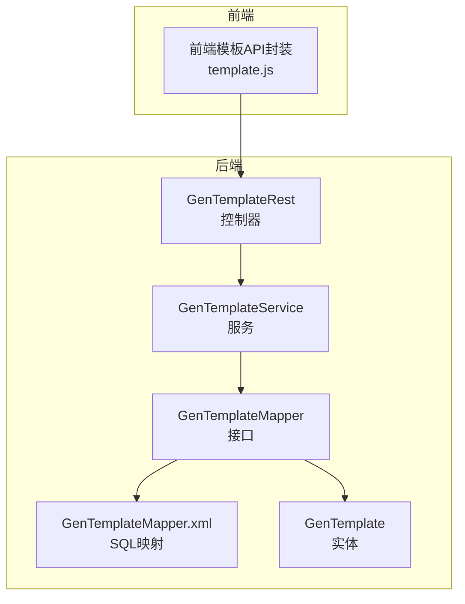
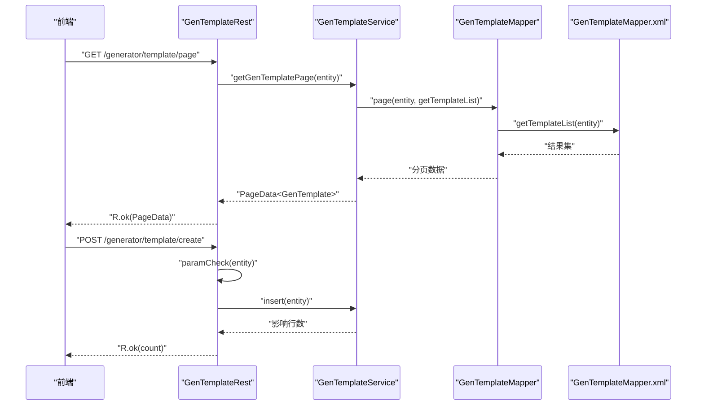
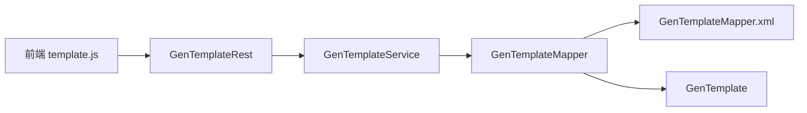
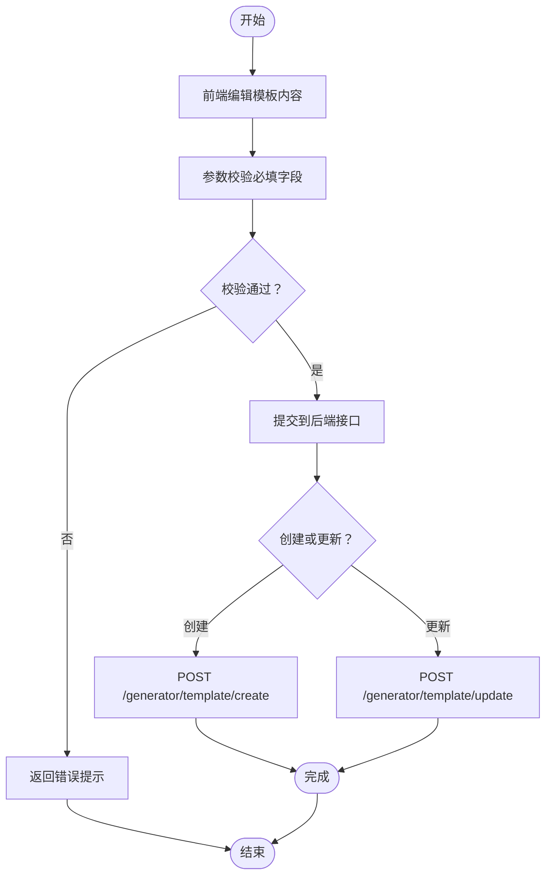

# 模板API

<cite>
**本文引用的文件**
- [GenTemplateRest.java](file://generator-server/src/main/java/com/wkclz/generator/server/rest/GenTemplateRest.java)
- [Route.java](file://generator-server/src/main/java/com/wkclz/generator/server/Route.java)
- [GenTemplateService.java](file://generator-server/src/main/java/com/wkclz/generator/server/service/GenTemplateService.java)
- [GenTemplateMapper.java](file://generator-server/src/main/java/com/wkclz/generator/server/mapper/GenTemplateMapper.java)
- [GenTemplateMapper.xml](file://generator-server/src/main/resources/mapper/GenTemplateMapper.xml)
- [GenTemplate.java](file://generator-server/src/main/java/com/wkclz/generator/server/bean/entity/GenTemplate.java)
- [template.js](file://generator-ui/src/api/template.js)
</cite>

## 目录
1. [简介](#简介)
2. [项目结构](#项目结构)
3. [核心组件](#核心组件)
4. [架构总览](#架构总览)
5. [详细组件分析](#详细组件分析)
6. [依赖分析](#依赖分析)
7. [性能考虑](#性能考虑)
8. [故障排查指南](#故障排查指南)
9. [结论](#结论)
10. [附录](#附录)

## 简介
本文件为“模板管理API”的详细接口文档，覆盖模板的 CRUD（创建、读取、更新、删除）与分页查询、详情获取、模板选项查询等功能。同时说明模板分类字段与规则，并给出模板内容管理（上传、编辑、预览）的建议流程与注意事项。最后提供模板语法与变量使用指南，帮助用户正确编写自定义模板。

## 项目结构
模板API位于后端服务模块中，采用标准的分层架构：REST 控制器 -> 业务服务 -> 数据访问层（MyBatis Mapper）。前端通过统一的 API 文件调用后端接口。

图表来源
- [GenTemplateRest.java:16-81](file://generator-server/src/main/java/com/wkclz/generator/server/rest/GenTemplateRest.java#L16-L81)
- [GenTemplateService.java:14-33](file://generator-server/src/main/java/com/wkclz/generator/server/service/GenTemplateService.java#L14-L33)
- [GenTemplateMapper.java:11-18](file://generator-server/src/main/java/com/wkclz/generator/server/mapper/GenTemplateMapper.java#L11-L18)
- [GenTemplateMapper.xml:6-72](file://generator-server/src/main/resources/mapper/GenTemplateMapper.xml#L6-L72)
- [GenTemplate.java:19-108](file://generator-server/src/main/java/com/wkclz/generator/server/bean/entity/GenTemplate.java#L19-L108)
- [template.js:1-33](file://generator-ui/src/api/template.js#L1-L33)

章节来源
- [GenTemplateRest.java:16-81](file://generator-server/src/main/java/com/wkclz/generator/server/rest/GenTemplateRest.java#L16-L81)
- [Route.java:27-39](file://generator-server/src/main/java/com/wkclz/generator/server/Route.java#L27-L39)
- [template.js:1-33](file://generator-ui/src/api/template.js#L1-L33)

## 核心组件
- 控制器：提供模板的分页查询、详情、创建、更新、删除、选项查询等 HTTP 接口。
- 服务层：封装分页查询、选项查询、按编码集合批量获取模板等逻辑。
- 数据访问层：定义 SQL 查询方法，支持条件过滤、排序与批量 IN 查询。
- 实体：定义模板字段（如模板编码、模板Key、模板名称、文件后缀、描述、内容、排序、版本等）。
- 前端封装：统一的模板 API 方法，便于在页面组件中调用。

章节来源
- [GenTemplateRest.java:25-63](file://generator-server/src/main/java/com/wkclz/generator/server/rest/GenTemplateRest.java#L25-L63)
- [GenTemplateService.java:16-31](file://generator-server/src/main/java/com/wkclz/generator/server/service/GenTemplateService.java#L16-L31)
- [GenTemplateMapper.java:13-16](file://generator-server/src/main/java/com/wkclz/generator/server/mapper/GenTemplateMapper.java#L13-L16)
- [GenTemplate.java:24-61](file://generator-server/src/main/java/com/wkclz/generator/server/bean/entity/GenTemplate.java#L24-L61)
- [template.js:3-31](file://generator-ui/src/api/template.js#L3-L31)

## 架构总览
模板API遵循“控制器-服务-数据访问-映射”的分层设计，所有接口均通过统一前缀进行路由管理。

图表来源
- [GenTemplateRest.java:25-57](file://generator-server/src/main/java/com/wkclz/generator/server/rest/GenTemplateRest.java#L25-L57)
- [GenTemplateService.java:16-18](file://generator-server/src/main/java/com/wkclz/generator/server/service/GenTemplateService.java#L16-L18)
- [GenTemplateMapper.xml:6-33](file://generator-server/src/main/resources/mapper/GenTemplateMapper.xml#L6-L33)

## 详细组件分析

### 接口清单与规范
- 统一前缀：/generator
- 模板模块路由常量见 Route 接口中的 TEMPLATE_* 定义
- 返回体：统一使用 R 包裹，成功时返回数据，失败时返回错误码与消息

章节来源
- [Route.java:27-39](file://generator-server/src/main/java/com/wkclz/generator/server/Route.java#L27-L39)
- [GenTemplateRest.java:16-18](file://generator-server/src/main/java/com/wkclz/generator/server/rest/GenTemplateRest.java#L16-L18)

#### 分页查询
- 方法：GET
- 路由：/generator/template/page
- 请求参数：支持按模板编码、模板Key、模板名称、用户编码模糊过滤；排序规则为 sort 升序、id 降序
- 响应：分页数据对象，包含当前页、每页条数、总数与记录列表
- 处理流程：控制器接收参数 -> 服务层执行分页查询 -> Mapper 执行 SQL -> 返回分页结果

章节来源
- [GenTemplateRest.java:25-29](file://generator-server/src/main/java/com/wkclz/generator/server/rest/GenTemplateRest.java#L25-L29)
- [GenTemplateService.java:16-18](file://generator-server/src/main/java/com/wkclz/generator/server/service/GenTemplateService.java#L16-L18)
- [GenTemplateMapper.xml:6-33](file://generator-server/src/main/resources/mapper/GenTemplateMapper.xml#L6-L33)

#### 详情获取
- 方法：GET
- 路由：/generator/template/detail
- 请求参数：必须携带模板主键 id
- 响应：单个模板实体
- 处理流程：校验 id 非空 -> 服务层按 id 查询 -> 返回实体

章节来源
- [GenTemplateRest.java:31-36](file://generator-server/src/main/java/com/wkclz/generator/server/rest/GenTemplateRest.java#L31-L36)
- [GenTemplateService.java:13-14](file://generator-server/src/main/java/com/wkclz/generator/server/service/GenTemplateService.java#L13-L14)

#### 创建模板
- 方法：POST
- 路由：/generator/template/create
- 请求体：模板实体（非空字段校验见下方）
- 响应：受影响行数
- 处理流程：参数校验（含用户编码注入）-> 插入 -> 返回结果

章节来源
- [GenTemplateRest.java:38-43](file://generator-server/src/main/java/com/wkclz/generator/server/rest/GenTemplateRest.java#L38-L43)
- [GenTemplateRest.java:66-78](file://generator-server/src/main/java/com/wkclz/generator/server/rest/GenTemplateRest.java#L66-L78)

#### 更新模板
- 方法：POST
- 路由：/generator/template/update
- 请求体：模板实体（需包含模板编码、主键、版本号）
- 响应：受影响行数
- 处理流程：参数校验（含版本号校验）-> 更新 -> 返回结果

章节来源
- [GenTemplateRest.java:45-49](file://generator-server/src/main/java/com/wkclz/generator/server/rest/GenTemplateRest.java#L45-L49)
- [GenTemplateRest.java:66-78](file://generator-server/src/main/java/com/wkclz/generator/server/rest/GenTemplateRest.java#L66-L78)

#### 删除模板
- 方法：POST
- 路由：/generator/template/remove
- 请求体：模板实体（需包含主键 id）
- 响应：受影响行数
- 处理流程：校验 id 非空 -> 删除 -> 返回结果

章节来源
- [GenTemplateRest.java:52-57](file://generator-server/src/main/java/com/wkclz/generator/server/rest/GenTemplateRest.java#L52-L57)

#### 模板选项查询
- 方法：GET
- 路由：/generator/template/options
- 请求参数：无
- 响应：模板选项列表（仅包含模板编码、模板Key、模板名称、文件后缀、描述）
- 用途：前端下拉选择或快速筛选

章节来源
- [GenTemplateRest.java:59-63](file://generator-server/src/main/java/com/wkclz/generator/server/rest/GenTemplateRest.java#L59-L63)
- [GenTemplateService.java:20-22](file://generator-server/src/main/java/com/wkclz/generator/server/service/GenTemplateService.java#L20-L22)
- [GenTemplateMapper.xml:37-51](file://generator-server/src/main/resources/mapper/GenTemplateMapper.xml#L37-L51)

### 参数校验与必填字段
- 新增场景：若未提供主键，则自动注入当前登录用户编码；其余必填字段包括：模板Key、模板名称、文件后缀、模板内容
- 更新场景：除上述必填外，还需提供模板编码与版本号（用于并发控制）

章节来源
- [GenTemplateRest.java:66-78](file://generator-server/src/main/java/com/wkclz/generator/server/rest/GenTemplateRest.java#L66-L78)

### 模板实体字段说明
- 字段概览：用户编码、模板编码、模板Key、模板名称、文件后缀、模板描述、模板内容、排序、版本、创建/更新信息等
- 关键约束：部分字段标注为非空，具体以注解为准

章节来源
- [GenTemplate.java:24-61](file://generator-server/src/main/java/com/wkclz/generator/server/bean/entity/GenTemplate.java#L24-L61)

### 模板分类与规则
- 模板类型与分类：代码库未定义独立的“模板类型”枚举或分类表；模板分类主要通过以下字段实现：
  - 模板编码（tempCode）：用于标识模板类别或用途
  - 模板Key（tempKey）：模板标识符，可用于区分不同模板
  - 文件后缀（tempSubfix）：用于生成文件的扩展名，可作为“类型”维度之一
- 过滤与查询：分页查询支持按模板编码、模板Key、模板名称模糊匹配，结合排序字段实现稳定展示顺序

章节来源
- [GenTemplate.java:30-31](file://generator-server/src/main/java/com/wkclz/generator/server/bean/entity/GenTemplate.java#L30-L31)
- [GenTemplate.java:36-37](file://generator-server/src/main/java/com/wkclz/generator/server/bean/entity/GenTemplate.java#L36-L37)
- [GenTemplate.java:48-49](file://generator-server/src/main/java/com/wkclz/generator/server/bean/entity/GenTemplate.java#L48-L49)
- [GenTemplateMapper.xml:24-29](file://generator-server/src/main/resources/mapper/GenTemplateMapper.xml#L24-L29)

### 模板内容管理
- 内容存储：模板内容以字符串形式存储于模板实体的模板内容字段中
- 编辑与预览：建议在前端使用富文本/代码编辑器进行编辑与实时预览；提交时以 JSON 形式发送到创建/更新接口
- 上传流程：前端将模板内容写入模板实体后，调用创建或更新接口完成持久化

章节来源
- [GenTemplate.java:60-61](file://generator-server/src/main/java/com/wkclz/generator/server/bean/entity/GenTemplate.java#L60-L61)
- [GenTemplateRest.java:38-49](file://generator-server/src/main/java/com/wkclz/generator/server/rest/GenTemplateRest.java#L38-L49)

### 模板选项查询接口
- 用途：获取可用模板列表，用于前端下拉选择或快速筛选
- 返回字段：模板编码、模板Key、模板名称、文件后缀、模板描述
- 典型场景：代码生成时根据模板编码集合批量加载模板内容

章节来源
- [GenTemplateRest.java:59-63](file://generator-server/src/main/java/com/wkclz/generator/server/rest/GenTemplateRest.java#L59-L63)
- [GenTemplateMapper.xml:37-51](file://generator-server/src/main/resources/mapper/GenTemplateMapper.xml#L37-L51)

### 代码生成集成
- 批量获取：服务层提供按模板编码集合批量查询模板的方法，返回模板编码、文件后缀与模板内容
- 应用场景：在代码生成阶段，按需加载指定模板内容进行渲染

章节来源
- [GenTemplateService.java:26-31](file://generator-server/src/main/java/com/wkclz/generator/server/service/GenTemplateService.java#L26-L31)
- [GenTemplateMapper.xml:55-68](file://generator-server/src/main/resources/mapper/GenTemplateMapper.xml#L55-L68)

## 依赖分析
- 控制器依赖服务层，服务层依赖数据访问层，数据访问层依赖 MyBatis 映射文件
- 路由常量集中管理，保证前后端一致的接口路径
- 前端通过统一的 API 封装调用后端接口

图表来源
- [template.js:1-33](file://generator-ui/src/api/template.js#L1-L33)
- [GenTemplateRest.java:21-22](file://generator-server/src/main/java/com/wkclz/generator/server/rest/GenTemplateRest.java#L21-L22)
- [GenTemplateService.java:13-14](file://generator-server/src/main/java/com/wkclz/generator/server/service/GenTemplateService.java#L13-L14)
- [GenTemplateMapper.java:11-12](file://generator-server/src/main/java/com/wkclz/generator/server/mapper/GenTemplateMapper.java#L11-L12)
- [GenTemplate.java:19-108](file://generator-server/src/main/java/com/wkclz/generator/server/bean/entity/GenTemplate.java#L19-L108)

## 性能考虑
- 分页查询：建议在模板数量较大时使用分页，避免一次性加载过多数据
- 条件过滤：利用模板编码、模板Key、模板名称的模糊匹配，减少无效扫描
- 排序策略：已按排序字段与主键排序，确保结果稳定且利于分页定位
- 批量查询：在代码生成场景使用按编码集合的 IN 查询，减少多次往返

章节来源
- [GenTemplateMapper.xml:24-32](file://generator-server/src/main/resources/mapper/GenTemplateMapper.xml#L24-L32)
- [GenTemplateMapper.xml:64-67](file://generator-server/src/main/resources/mapper/GenTemplateMapper.xml#L64-L67)

## 故障排查指南
- 参数缺失：创建/更新接口对关键字段有严格校验，若报错请检查是否缺少模板Key、模板名称、文件后缀、模板内容等
- 主键缺失：详情、删除、更新接口要求提供主键，否则会触发参数校验异常
- 版本冲突：更新接口需要提供版本号，避免并发更新导致的数据覆盖
- 前端调用：确认前端 API 调用路径与后端路由一致，避免 404 或跨域问题

章节来源
- [GenTemplateRest.java:33-35](file://generator-server/src/main/java/com/wkclz/generator/server/rest/GenTemplateRest.java#L33-L35)
- [GenTemplateRest.java:54-56](file://generator-server/src/main/java/com/wkclz/generator/server/rest/GenTemplateRest.java#L54-L56)
- [GenTemplateRest.java:70-72](file://generator-server/src/main/java/com/wkclz/generator/server/rest/GenTemplateRest.java#L70-L72)
- [template.js:3-31](file://generator-ui/src/api/template.js#L3-L31)

## 结论
模板API提供了完整的 CRUD 与分页查询能力，并通过模板编码、模板Key、文件后缀等字段实现灵活的分类与检索。配合选项查询与批量加载，能够满足代码生成场景下的模板管理需求。建议在前端实现模板内容的可视化编辑与预览，并严格遵循参数校验规则以确保数据一致性。

## 附录

### 接口一览表
- GET /generator/template/page：分页查询模板
- GET /generator/template/detail：获取模板详情
- POST /generator/template/create：创建模板
- POST /generator/template/update：更新模板
- POST /generator/template/remove：删除模板
- GET /generator/template/options：获取模板选项列表

章节来源
- [Route.java:29-39](file://generator-server/src/main/java/com/wkclz/generator/server/Route.java#L29-L39)
- [GenTemplateRest.java:25-63](file://generator-server/src/main/java/com/wkclz/generator/server/rest/GenTemplateRest.java#L25-L63)

### 模板内容管理流程图

图表来源
- [GenTemplateRest.java:38-49](file://generator-server/src/main/java/com/wkclz/generator/server/rest/GenTemplateRest.java#L38-L49)
- [GenTemplateRest.java:66-78](file://generator-server/src/main/java/com/wkclz/generator/server/rest/GenTemplateRest.java#L66-L78)

### 模板语法与变量使用指南
- 模板内容以字符串形式存储，建议采用通用模板引擎语法（如 FreeMarker、Velocity 等），以便在代码生成时进行变量替换
- 变量命名建议使用清晰、稳定的标识符，并与代码生成器的上下文变量保持一致
- 在前端编辑器中启用语法高亮与格式化，提升模板可读性与维护性
- 对于多语言/多框架场景，建议通过模板Key或文件后缀区分不同模板类型，便于在生成阶段按需选择

[本节为通用指导，无需特定文件来源]