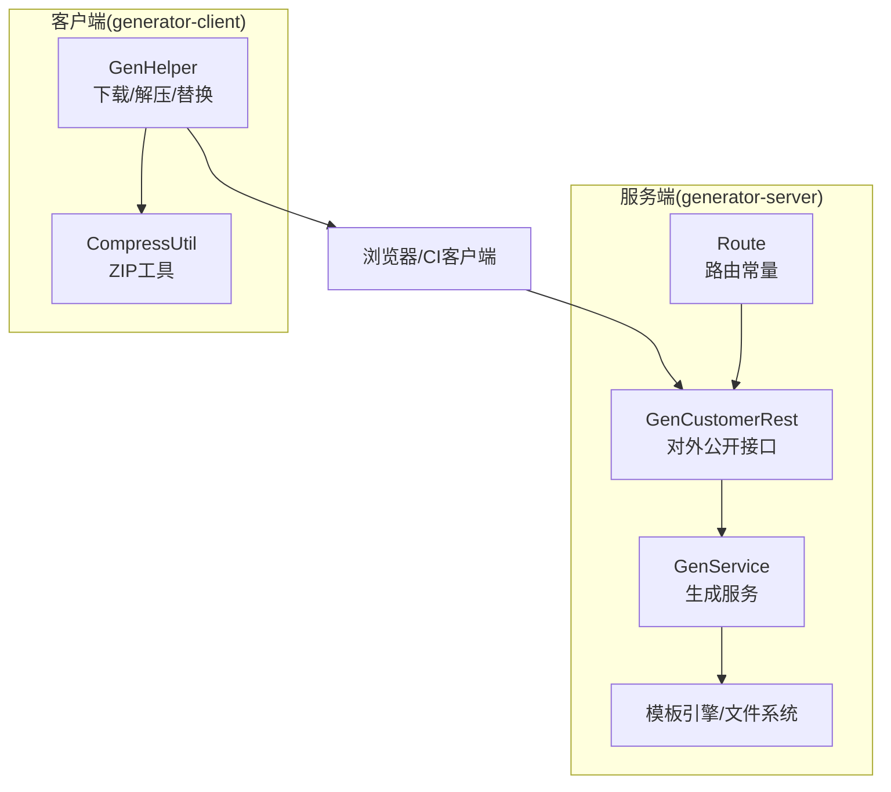
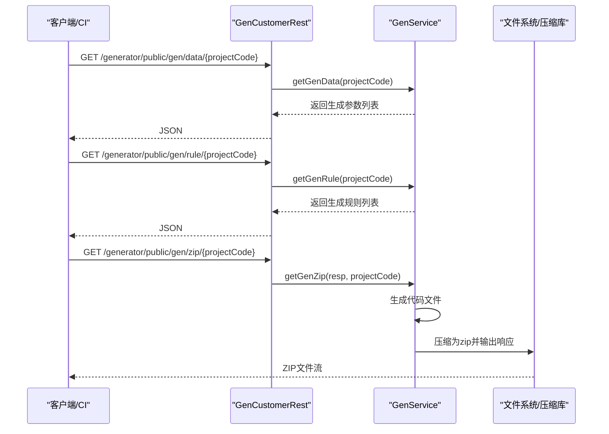
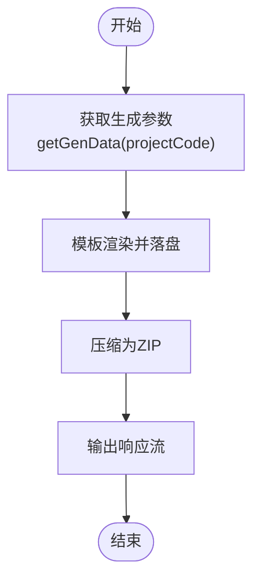
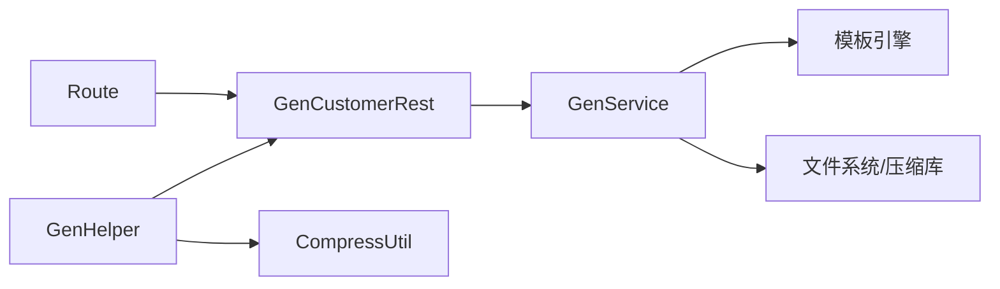

# 生成API

<cite>
**本文引用的文件**
- [Route.java](file://generator-server/src/main/java/com/wkclz/generator/server/Route.java)
- [GenCustomerRest.java](file://generator-server/src/main/java/com/wkclz/generator/server/rest/GenCustomerRest.java)
- [GenService.java](file://generator-server/src/main/java/com/wkclz/generator/server/service/GenService.java)
- [GenParam.java](file://generator-server/src/main/java/com/wkclz/generator/server/bean/gen/GenParam.java)
- [GenTable.java](file://generator-server/src/main/java/com/wkclz/generator/server/bean/gen/GenTable.java)
- [GenTask.java](file://generator-server/src/main/java/com/wkclz/generator/server/bean/entity/GenTask.java)
- [GenHelper.java](file://generator-client/src/main/java/com/wkclz/generator/client/helper/GenHelper.java)
- [CompressUtil.java](file://generator-client/src/main/java/com/wkclz/generator/client/utils/CompressUtil.java)
- [GenException.java](file://generator-client/src/main/java/com/wkclz/generator/client/exception/GenException.java)
</cite>

## 目录
1. [简介](#简介)
2. [项目结构](#项目结构)
3. [核心组件](#核心组件)
4. [架构总览](#架构总览)
5. [详细组件分析](#详细组件分析)
6. [依赖分析](#依赖分析)
7. [性能考虑](#性能考虑)
8. [故障排查指南](#故障排查指南)
9. [结论](#结论)
10. [附录](#附录)

## 简介
本文件为“代码生成API”的完整接口文档，覆盖生成数据获取、代码压缩包下载、生成规则查询等核心能力，并对生成参数配置、结果处理与下载机制、以及在CI/CD中的集成实践进行系统说明。读者可据此快速对接服务端生成能力，实现自动化代码生成流水线。

## 项目结构
- 服务端模块（generator-server）提供REST接口与生成服务，负责根据项目配置与模板生成代码并打包下载。
- 客户端模块（generator-client）提供下载、解压、替换等辅助能力，便于在本地或CI环境中消费生成结果。
- UI模块（generator-ui）提供前端交互，但本文重点聚焦服务端API。

图表来源
- [Route.java:79-84](file://generator-server/src/main/java/com/wkclz/generator/server/Route.java#L79-L84)
- [GenCustomerRest.java:26-41](file://generator-server/src/main/java/com/wkclz/generator/server/rest/GenCustomerRest.java#L26-L41)
- [GenService.java:72-90](file://generator-server/src/main/java/com/wkclz/generator/server/service/GenService.java#L72-L90)
- [GenHelper.java:42-108](file://generator-client/src/main/java/com/wkclz/generator/client/helper/GenHelper.java#L42-L108)

章节来源
- [Route.java:1-88](file://generator-server/src/main/java/com/wkclz/generator/server/Route.java#L1-L88)

## 核心组件
- 路由定义（Route）：集中声明所有生成相关接口的URL模式与描述。
- 控制器（GenCustomerRest）：暴露生成数据、规则查询、压缩包下载三个公开端点。
- 服务（GenService）：实现生成数据组装、模板渲染、文件落盘、压缩打包与响应输出。
- 参数模型（GenParam/GenTable/GenTask）：承载生成所需的数据结构与规则信息。
- 客户端工具（GenHelper/CompressUtil）：封装下载、解压、替换等流程，便于集成到CI/本地脚本。

章节来源
- [GenCustomerRest.java:1-43](file://generator-server/src/main/java/com/wkclz/generator/server/rest/GenCustomerRest.java#L1-L43)
- [GenService.java:55-90](file://generator-server/src/main/java/com/wkclz/generator/server/service/GenService.java#L55-L90)
- [GenParam.java:1-33](file://generator-server/src/main/java/com/wkclz/generator/server/bean/gen/GenParam.java#L1-L33)
- [GenTable.java:1-30](file://generator-server/src/main/java/com/wkclz/generator/server/bean/gen/GenTable.java#L1-L30)
- [GenTask.java:1-124](file://generator-server/src/main/java/com/wkclz/generator/server/bean/entity/GenTask.java#L1-L124)
- [GenHelper.java:42-108](file://generator-client/src/main/java/com/wkclz/generator/client/helper/GenHelper.java#L42-L108)
- [CompressUtil.java:1-70](file://generator-client/src/main/java/com/wkclz/generator/client/utils/CompressUtil.java#L1-L70)

## 架构总览
生成API采用“控制器-服务-模板引擎-文件系统”的分层设计。客户端通过公开接口获取生成数据、规则，触发生成并下载压缩包，随后在本地执行解压与替换逻辑。

图表来源
- [GenCustomerRest.java:26-41](file://generator-server/src/main/java/com/wkclz/generator/server/rest/GenCustomerRest.java#L26-L41)
- [GenService.java:72-90](file://generator-server/src/main/java/com/wkclz/generator/server/service/GenService.java#L72-L90)

## 详细组件分析

### 公开接口清单
- 基础路径：/generator/public
- 生成数据获取
  - 方法：GET
  - 路径：/gen/data/{projectCode}
  - 请求参数：路径变量 projectCode（项目编码）
  - 响应：生成参数列表（包含表结构、列集合、包模板映射等）
- 生成规则查询
  - 方法：GET
  - 路径：/gen/rule/{projectCode}
  - 请求参数：路径变量 projectCode（项目编码）
  - 响应：生成规则列表（任务维度的开关、模板编码、包路径等）
- 代码压缩包下载
  - 方法：GET
  - 路径：/gen/zip/{projectCode}
  - 请求参数：路径变量 projectCode（项目编码）
  - 响应：二进制流（ZIP文件），响应头包含 Content-Disposition 与 Content-Length

章节来源
- [Route.java:79-84](file://generator-server/src/main/java/com/wkclz/generator/server/Route.java#L79-L84)
- [GenCustomerRest.java:26-41](file://generator-server/src/main/java/com/wkclz/generator/server/rest/GenCustomerRest.java#L26-L41)

### 生成参数配置说明
- 关键参数
  - projectCode：项目编码（必填，用于定位项目、数据源、任务与模板）
  - tempCode：模板编码（与任务关联，决定生成文件后缀与内容）
  - projectBasePath：任务对应的项目基础路径（用于组织生成文件的顶层目录）
  - packagePath：任务对应的包路径（用于生成文件的包级目录结构）
  - createSwitch/deleteSwitch：任务开关（控制是否生成/删除）
- 参数模型
  - GenParam：聚合了pkgs（包模板映射）、table（表信息）、各类列集合（全量、业务、列表、查询、新增、修改）
  - GenTable：表名、注释、实体名、变量名、REST分组与路径前缀、导入类型等
  - GenTask：任务实体，包含用户、项目、模板、路径、描述及开关字段

章节来源
- [GenParam.java:10-32](file://generator-server/src/main/java/com/wkclz/generator/server/bean/gen/GenParam.java#L10-L32)
- [GenTable.java:7-29](file://generator-server/src/main/java/com/wkclz/generator/server/bean/gen/GenTable.java#L7-L29)
- [GenTask.java:19-74](file://generator-server/src/main/java/com/wkclz/generator/server/bean/entity/GenTask.java#L19-L74)

### 生成结果处理与下载机制
- 生成流程
  - 服务端根据 projectCode 组装生成参数（表、列、任务规则），加载模板内容，逐模板渲染并落盘到临时目录
  - 渲染异常时以文本形式回退展示，避免中断
- 压缩与下载
  - 生成完成后将临时目录压缩为ZIP，设置响应头（Content-Type、Content-Disposition、Content-Length），并将ZIP流写入响应输出
- 客户端处理
  - 下载ZIP至本地临时目录，解压到同级目录，删除压缩包
  - 依据规则列表对生成文件进行替换与清理，最终得到可直接使用的工程产物

图表来源
- [GenService.java:92-159](file://generator-server/src/main/java/com/wkclz/generator/server/service/GenService.java#L92-L159)
- [GenService.java:162-190](file://generator-server/src/main/java/com/wkclz/generator/server/service/GenService.java#L162-L190)

章节来源
- [GenService.java:72-90](file://generator-server/src/main/java/com/wkclz/generator/server/service/GenService.java#L72-L90)
- [GenService.java:162-190](file://generator-server/src/main/java/com/wkclz/generator/server/service/GenService.java#L162-L190)
- [GenHelper.java:42-108](file://generator-client/src/main/java/com/wkclz/generator/client/helper/GenHelper.java#L42-L108)
- [CompressUtil.java:33-70](file://generator-client/src/main/java/com/wkclz/generator/client/utils/CompressUtil.java#L33-L70)

### 生成进度与状态监控
- 当前实现
  - 服务端在生成开始与结束时记录日志并写入日志表（用于审计与追踪）
  - 未提供专门的“进度轮询”接口
- 建议实践
  - 在CI侧通过定时拉取日志或结合外部调度系统进行状态跟踪
  - 若需要实时进度，可在服务端扩展异步任务与状态查询接口

章节来源
- [GenService.java:75-87](file://generator-server/src/main/java/com/wkclz/generator/server/service/GenService.java#L75-L87)

### 错误处理与重试机制
- 服务端
  - 无生成数据时抛出校验异常
  - 模板解析异常时回退为文本提示
  - 压缩异常时抛出系统异常
- 客户端
  - 下载阶段校验HTTP状态码与Content-Type，若返回JSON则视为错误并记录
  - 解压失败或IO异常时抛出自定义异常
- 重试建议
  - 建议在CI侧对非幂等的下载/解压步骤增加指数退避重试
  - 对于模板渲染异常，建议在UI或服务端修复模板后再重试

章节来源
- [GenService.java:95-97](file://generator-server/src/main/java/com/wkclz/generator/server/service/GenService.java#L95-L97)
- [GenService.java:136-138](file://generator-server/src/main/java/com/wkclz/generator/server/service/GenService.java#L136-L138)
- [GenHelper.java:62-74](file://generator-client/src/main/java/com/wkclz/generator/client/helper/GenHelper.java#L62-L74)
- [GenException.java:6-20](file://generator-client/src/main/java/com/wkclz/generator/client/exception/GenException.java#L6-L20)

### CI/CD 集成示例与最佳实践
- 基本流程
  - 步骤1：调用“生成数据获取”接口确认可生成数据
  - 步骤2：调用“生成规则查询”接口获取任务开关与模板映射
  - 步骤3：调用“代码压缩包下载”接口获取ZIP并解压
  - 步骤4：根据规则对生成文件进行替换与清理
- 最佳实践
  - 将 projectCode 作为流水线变量传入
  - 对下载与解压过程增加超时与重试策略
  - 将生成产物归档到制品库，便于版本追溯
  - 在失败场景输出详细日志并截图保存

章节来源
- [GenHelper.java:42-108](file://generator-client/src/main/java/com/wkclz/generator/client/helper/GenHelper.java#L42-L108)

## 依赖分析
- 控制器依赖服务，服务依赖模板引擎与文件系统
- 客户端依赖服务端公开接口，内部封装下载、解压与替换逻辑
- 路由常量统一管理接口路径，便于维护与扩展

图表来源
- [Route.java:79-84](file://generator-server/src/main/java/com/wkclz/generator/server/Route.java#L79-L84)
- [GenCustomerRest.java:26-41](file://generator-server/src/main/java/com/wkclz/generator/server/rest/GenCustomerRest.java#L26-L41)
- [GenService.java:162-190](file://generator-server/src/main/java/com/wkclz/generator/server/service/GenService.java#L162-L190)
- [GenHelper.java:42-108](file://generator-client/src/main/java/com/wkclz/generator/client/helper/GenHelper.java#L42-L108)
- [CompressUtil.java:33-70](file://generator-client/src/main/java/com/wkclz/generator/client/utils/CompressUtil.java#L33-L70)

## 性能考虑
- 生成规模较大时，建议分批生成或并行渲染不同模板，减少单次生成耗时
- 压缩前尽量避免冗余文件，减少I/O与带宽占用
- 在高并发场景下，注意文件锁与磁盘空间，必要时引入队列或限流

## 故障排查指南
- 问题：下载响应为JSON且包含错误信息
  - 排查：检查 projectCode 是否正确、模板是否可用、数据库连接是否正常
  - 定位：客户端已对Content-Type进行判断并记录错误
- 问题：解压失败或生成文件缺失
  - 排查：确认ZIP文件完整性、磁盘权限、目标目录是否存在
  - 定位：客户端解压工具对文件夹与文件分别处理，失败时抛出异常
- 问题：模板渲染异常
  - 排查：检查模板语法与上下文变量是否匹配
  - 定位：服务端在渲染异常时回退为文本提示，便于定位

章节来源
- [GenHelper.java:62-74](file://generator-client/src/main/java/com/wkclz/generator/client/helper/GenHelper.java#L62-L74)
- [GenException.java:6-20](file://generator-client/src/main/java/com/wkclz/generator/client/exception/GenException.java#L6-L20)
- [GenService.java:136-138](file://generator-server/src/main/java/com/wkclz/generator/server/service/GenService.java#L136-L138)

## 结论
本文档系统梳理了生成API的接口定义、参数配置、结果处理与下载机制，并提供了CI/CD集成建议与故障排查要点。建议在生产环境配合日志与监控体系，完善进度与状态查询能力，进一步提升自动化生成的稳定性与可观测性。

## 附录
- 关键路径速览
  - 生成数据：GET /generator/public/gen/data/{projectCode}
  - 生成规则：GET /generator/public/gen/rule/{projectCode}
  - 代码压缩包：GET /generator/public/gen/zip/{projectCode}