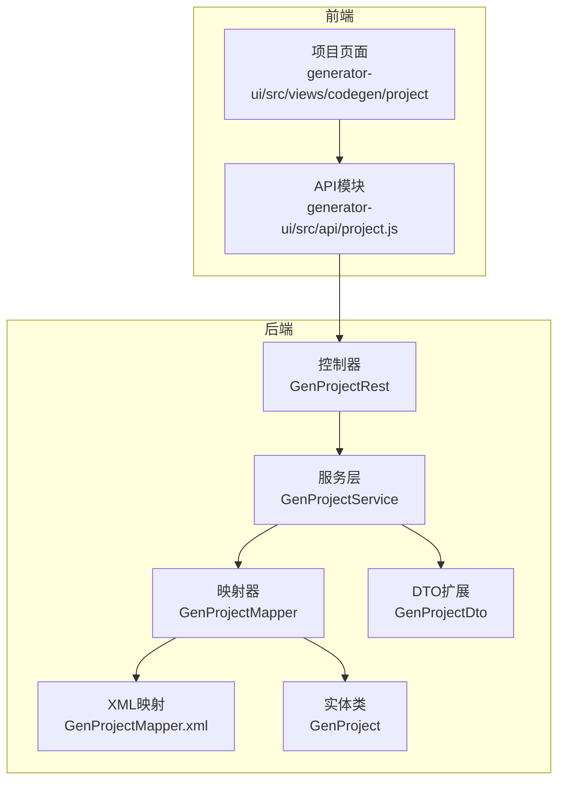
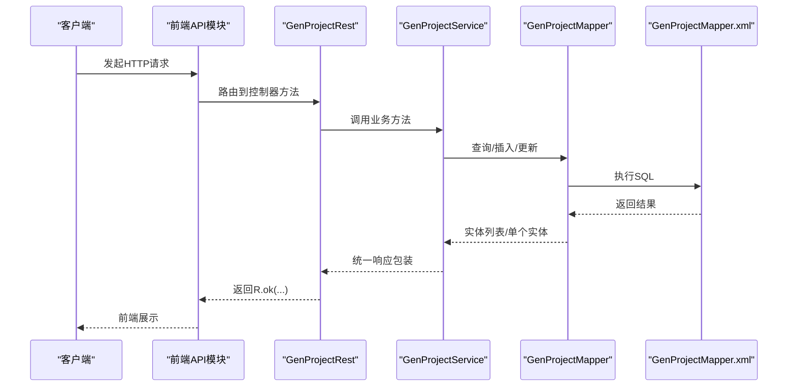
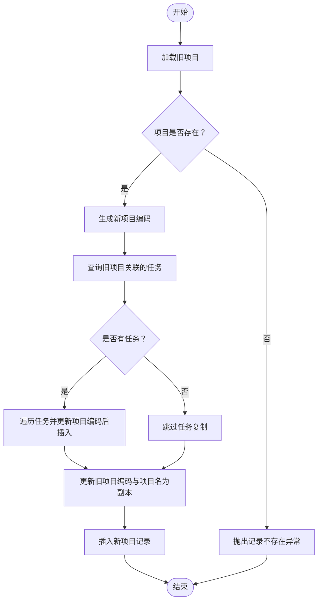
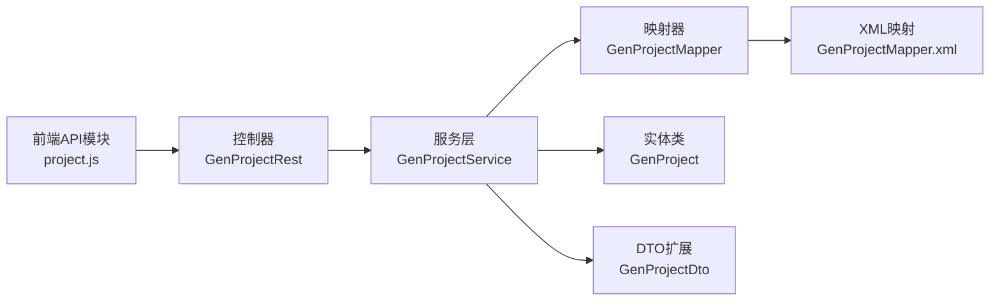

# 项目API

<cite>
**本文引用的文件**
- [generator-server/src/main/java/com/wkclz/generator/server/rest/GenProjectRest.java](file://generator-server/src/main/java/com/wkclz/generator/server/rest/GenProjectRest.java)
- [generator-server/src/main/java/com/wkclz/generator/server/service/GenProjectService.java](file://generator-server/src/main/java/com/wkclz/generator/server/service/GenProjectService.java)
- [generator-server/src/main/java/com/wkclz/generator/server/bean/entity/GenProject.java](file://generator-server/src/main/java/com/wkclz/generator/server/bean/entity/GenProject.java)
- [generator-server/src/main/java/com/wkclz/generator/server/bean/dto/GenProjectDto.java](file://generator-server/src/main/java/com/wkclz/generator/server/bean/dto/GenProjectDto.java)
- [generator-server/src/main/java/com/wkclz/generator/server/mapper/GenProjectMapper.java](file://generator-server/src/main/java/com/wkclz/generator/server/mapper/GenProjectMapper.java)
- [generator-server/src/main/resources/mapper/GenProjectMapper.xml](file://generator-server/src/main/resources/mapper/GenProjectMapper.xml)
- [generator-server/src/main/java/com/wkclz/generator/server/Route.java](file://generator-server/src/main/java/com/wkclz/generator/server/Route.java)
- [generator-ui/src/api/project.js](file://generator-ui/src/api/project.js)
- [generator-server/src/main/java/com/wkclz/generator/server/bean/entity/GenTask.java](file://generator-server/src/main/java/com/wkclz/generator/server/bean/entity/GenTask.java)
- [generator-server/src/main/java/com/wkclz/generator/server/helper/GenParamHFetchelper.java](file://generator-server/src/main/java/com/wkclz/generator/server/helper/GenParamHFetchelper.java)
</cite>

## 目录
1. [简介](#简介)
2. [项目结构](#项目结构)
3. [核心组件](#核心组件)
4. [架构总览](#架构总览)
5. [详细组件分析](#详细组件分析)
6. [依赖分析](#依赖分析)
7. [性能考虑](#性能考虑)
8. [故障排查指南](#故障排查指南)
9. [结论](#结论)
10. [附录](#附录)

## 简介
本文件为“项目管理API”的完整接口文档，覆盖项目CRUD操作（分页查询、详情获取、创建、更新、删除、复制）以及项目配置参数说明。同时包含项目复制功能的实现与使用方法、项目状态与版本控制相关接口说明、最佳实践与常见使用场景示例。

## 项目结构
后端采用分层架构：控制器层负责HTTP路由与参数校验，服务层封装业务逻辑，持久层通过MyBatis映射数据库。前端通过统一API模块调用后端接口。

图表来源
- [generator-ui/src/api/project.js:1-34](file://generator-ui/src/api/project.js#L1-L34)
- [generator-server/src/main/java/com/wkclz/generator/server/rest/GenProjectRest.java:1-79](file://generator-server/src/main/java/com/wkclz/generator/server/rest/GenProjectRest.java#L1-L79)
- [generator-server/src/main/java/com/wkclz/generator/server/service/GenProjectService.java:1-134](file://generator-server/src/main/java/com/wkclz/generator/server/service/GenProjectService.java#L1-L134)
- [generator-server/src/main/java/com/wkclz/generator/server/mapper/GenProjectMapper.java:1-15](file://generator-server/src/main/java/com/wkclz/generator/server/mapper/GenProjectMapper.java#L1-L15)
- [generator-server/src/main/resources/mapper/GenProjectMapper.xml:1-38](file://generator-server/src/main/resources/mapper/GenProjectMapper.xml#L1-L38)
- [generator-server/src/main/java/com/wkclz/generator/server/bean/entity/GenProject.java:1-108](file://generator-server/src/main/java/com/wkclz/generator/server/bean/entity/GenProject.java#L1-L108)
- [generator-server/src/main/java/com/wkclz/generator/server/bean/dto/GenProjectDto.java:1-32](file://generator-server/src/main/java/com/wkclz/generator/server/bean/dto/GenProjectDto.java#L1-L32)

章节来源
- [generator-server/src/main/java/com/wkclz/generator/server/rest/GenProjectRest.java:1-79](file://generator-server/src/main/java/com/wkclz/generator/server/rest/GenProjectRest.java#L1-L79)
- [generator-server/src/main/java/com/wkclz/generator/server/service/GenProjectService.java:1-134](file://generator-server/src/main/java/com/wkclz/generator/server/service/GenProjectService.java#L1-L134)
- [generator-server/src/main/java/com/wkclz/generator/server/bean/entity/GenProject.java:1-108](file://generator-server/src/main/java/com/wkclz/generator/server/bean/entity/GenProject.java#L1-L108)
- [generator-server/src/main/java/com/wkclz/generator/server/bean/dto/GenProjectDto.java:1-32](file://generator-server/src/main/java/com/wkclz/generator/server/bean/dto/GenProjectDto.java#L1-L32)
- [generator-server/src/main/java/com/wkclz/generator/server/mapper/GenProjectMapper.java:1-15](file://generator-server/src/main/java/com/wkclz/generator/server/mapper/GenProjectMapper.java#L1-L15)
- [generator-server/src/main/resources/mapper/GenProjectMapper.xml:1-38](file://generator-server/src/main/resources/mapper/GenProjectMapper.xml#L1-L38)
- [generator-server/src/main/java/com/wkclz/generator/server/Route.java:1-89](file://generator-server/src/main/java/com/wkclz/generator/server/Route.java#L1-L89)
- [generator-ui/src/api/project.js:1-34](file://generator-ui/src/api/project.js#L1-L34)

## 核心组件
- 控制器：处理HTTP请求，执行参数校验，调用服务层并返回统一响应。
- 服务层：实现业务逻辑，包括去重检查、复制逻辑、任务关联迁移、版本控制字段处理。
- 映射层：MyBatis映射器与XML SQL，支持分页查询与动态过滤。
- 实体与DTO：定义项目字段及转换方法，用于前后端交互与扩展。

章节来源
- [generator-server/src/main/java/com/wkclz/generator/server/rest/GenProjectRest.java:1-79](file://generator-server/src/main/java/com/wkclz/generator/server/rest/GenProjectRest.java#L1-L79)
- [generator-server/src/main/java/com/wkclz/generator/server/service/GenProjectService.java:1-134](file://generator-server/src/main/java/com/wkclz/generator/server/service/GenProjectService.java#L1-L134)
- [generator-server/src/main/java/com/wkclz/generator/server/mapper/GenProjectMapper.java:1-15](file://generator-server/src/main/java/com/wkclz/generator/server/mapper/GenProjectMapper.java#L1-L15)
- [generator-server/src/main/resources/mapper/GenProjectMapper.xml:1-38](file://generator-server/src/main/resources/mapper/GenProjectMapper.xml#L1-L38)
- [generator-server/src/main/java/com/wkclz/generator/server/bean/entity/GenProject.java:1-108](file://generator-server/src/main/java/com/wkclz/generator/server/bean/entity/GenProject.java#L1-L108)
- [generator-server/src/main/java/com/wkclz/generator/server/bean/dto/GenProjectDto.java:1-32](file://generator-server/src/main/java/com/wkclz/generator/server/bean/dto/GenProjectDto.java#L1-L32)

## 架构总览
项目API遵循REST风格，统一前缀为“/generator”。控制器通过路由常量拼接具体端点，服务层封装业务与数据访问，映射XML提供SQL查询与过滤条件。

图表来源
- [generator-server/src/main/java/com/wkclz/generator/server/rest/GenProjectRest.java:1-79](file://generator-server/src/main/java/com/wkclz/generator/server/rest/GenProjectRest.java#L1-L79)
- [generator-server/src/main/java/com/wkclz/generator/server/service/GenProjectService.java:1-134](file://generator-server/src/main/java/com/wkclz/generator/server/service/GenProjectService.java#L1-L134)
- [generator-server/src/main/java/com/wkclz/generator/server/mapper/GenProjectMapper.java:1-15](file://generator-server/src/main/java/com/wkclz/generator/server/mapper/GenProjectMapper.java#L1-L15)
- [generator-server/src/main/resources/mapper/GenProjectMapper.xml:1-38](file://generator-server/src/main/resources/mapper/GenProjectMapper.xml#L1-L38)

## 详细组件分析

### 接口清单与规范
- 基础路径：/generator
- 公共请求头：Content-Type: application/json
- 统一响应：R.ok(...) 包裹数据，失败时返回错误码与消息

章节来源
- [generator-server/src/main/java/com/wkclz/generator/server/Route.java:1-89](file://generator-server/src/main/java/com/wkclz/generator/server/Route.java#L1-L89)
- [generator-ui/src/api/project.js:1-34](file://generator-ui/src/api/project.js#L1-L34)

#### 项目-分页查询
- 方法：GET
- 路径：/generator/project/page
- 请求参数：GenProject（支持模糊过滤字段：projectCode、moduleName、projectName、userCode、dbCode）
- 响应：分页数据（PageData<GenProject>）

章节来源
- [generator-server/src/main/java/com/wkclz/generator/server/rest/GenProjectRest.java:22-26](file://generator-server/src/main/java/com/wkclz/generator/server/rest/GenProjectRest.java#L22-L26)
- [generator-server/src/main/resources/mapper/GenProjectMapper.xml:5-34](file://generator-server/src/main/resources/mapper/GenProjectMapper.xml#L5-L34)
- [generator-server/src/main/java/com/wkclz/generator/server/mapper/GenProjectMapper.java:12-12](file://generator-server/src/main/java/com/wkclz/generator/server/mapper/GenProjectMapper.java#L12-L12)

#### 项目-详情获取
- 方法：GET
- 路径：/generator/project/detail
- 请求参数：id（必须）
- 响应：单个项目对象（GenProject）

章节来源
- [generator-server/src/main/java/com/wkclz/generator/server/rest/GenProjectRest.java:28-33](file://generator-server/src/main/java/com/wkclz/generator/server/rest/GenProjectRest.java#L28-L33)

#### 项目-新增
- 方法：POST
- 路径：/generator/project/create
- 请求体：GenProject（非空字段要求见“参数校验”）
- 响应：新增后的项目对象（GenProject）

章节来源
- [generator-server/src/main/java/com/wkclz/generator/server/rest/GenProjectRest.java:35-40](file://generator-server/src/main/java/com/wkclz/generator/server/rest/GenProjectRest.java#L35-L40)
- [generator-server/src/main/java/com/wkclz/generator/server/service/GenProjectService.java:36-43](file://generator-server/src/main/java/com/wkclz/generator/server/service/GenProjectService.java#L36-L43)

#### 项目-修改
- 方法：POST
- 路径：/generator/project/update
- 请求体：GenProject（包含id、projectCode、版本号等）
- 响应：更新后的项目对象（GenProject）

章节来源
- [generator-server/src/main/java/com/wkclz/generator/server/rest/GenProjectRest.java:42-47](file://generator-server/src/main/java/com/wkclz/generator/server/rest/GenProjectRest.java#L42-L47)
- [generator-server/src/main/java/com/wkclz/generator/server/service/GenProjectService.java:45-68](file://generator-server/src/main/java/com/wkclz/generator/server/service/GenProjectService.java#L45-L68)

#### 项目-删除
- 方法：POST
- 路径：/generator/project/remove
- 请求体：GenProject（包含id）
- 响应：受影响行数（int）

章节来源
- [generator-server/src/main/java/com/wkclz/generator/server/rest/GenProjectRest.java:49-54](file://generator-server/src/main/java/com/wkclz/generator/server/rest/GenProjectRest.java#L49-L54)

#### 项目-复制
- 方法：POST
- 路径：/generator/project/copy
- 请求体：GenProject（包含id）
- 响应：复制后的新项目对象（GenProject，项目名前缀已变更）

章节来源
- [generator-server/src/main/java/com/wkclz/generator/server/rest/GenProjectRest.java:56-61](file://generator-server/src/main/java/com/wkclz/generator/server/rest/GenProjectRest.java#L56-L61)
- [generator-server/src/main/java/com/wkclz/generator/server/service/GenProjectService.java:72-93](file://generator-server/src/main/java/com/wkclz/generator/server/service/GenProjectService.java#L72-L93)

### 参数校验与必填字段
- 新增时：若未传入用户编码，则自动注入当前登录用户编码；数据库编码、模块名、项目名称均不可为空。
- 更新时：需提供id、projectCode、版本号（version），否则抛出参数异常。
- 删除/复制：均需提供id。

章节来源
- [generator-server/src/main/java/com/wkclz/generator/server/rest/GenProjectRest.java:64-75](file://generator-server/src/main/java/com/wkclz/generator/server/rest/GenProjectRest.java#L64-L75)

### 项目配置参数说明
以下为GenProject实体的关键字段说明（字段名、含义、是否必填、默认值/备注）：

- id：自增主键，系统生成，无需传入
- projectCode：项目编码（唯一标识），新增时可为空（服务端生成），更新时不可为空
- userCode：用户编码，新增时由会话注入
- dbCode：数据库编码，必填
- tablePrefix：表前缀，选填
- moduleName：模块名（英文），必填
- projectName：项目名称，必填
- projectDesc：项目说明，选填
- 版本号version：乐观锁版本号，更新时必填
- 排序sort、创建时间createTime、更新时间updateTime、创建人createBy、更新人updateBy、备注remark：通用字段，通常由框架维护

章节来源
- [generator-server/src/main/java/com/wkclz/generator/server/bean/entity/GenProject.java:21-83](file://generator-server/src/main/java/com/wkclz/generator/server/bean/entity/GenProject.java#L21-L83)

### 项目复制功能实现与使用
- 功能说明：根据指定id复制项目，生成新的项目编码与副本项目名，同时复制该项目下的所有任务并绑定到新项目编码。
- 实现要点：
  - 生成新项目编码（带前缀的唯一ID）
  - 查询旧项目关联的所有任务，逐个更新其项目编码并插入新任务
  - 更新旧项目对象的项目编码与项目名为“复制从:原名称”，再插入新记录
- 使用建议：
  - 复制前确认目标数据库编码与模块名满足生成需求
  - 复制后可在UI中查看新项目与任务列表

图表来源
- [generator-server/src/main/java/com/wkclz/generator/server/service/GenProjectService.java:72-93](file://generator-server/src/main/java/com/wkclz/generator/server/service/GenProjectService.java#L72-L93)
- [generator-server/src/main/java/com/wkclz/generator/server/bean/entity/GenTask.java:21-31](file://generator-server/src/main/java/com/wkclz/generator/server/bean/entity/GenTask.java#L21-L31)

章节来源
- [generator-server/src/main/java/com/wkclz/generator/server/service/GenProjectService.java:72-93](file://generator-server/src/main/java/com/wkclz/generator/server/service/GenProjectService.java#L72-L93)
- [generator-server/src/main/java/com/wkclz/generator/server/bean/entity/GenTask.java:21-31](file://generator-server/src/main/java/com/wkclz/generator/server/bean/entity/GenTask.java#L21-L31)

### 项目状态管理与版本控制
- 版本控制：所有实体包含version字段，用于乐观锁控制。更新时必须提供version，否则校验失败。
- 状态字段：项目实体包含排序sort、创建/更新时间、创建/更新人、备注等通用字段，便于状态跟踪与审计。
- 生成参数忽略字段：在生成参数构造过程中，插入/更新时会忽略特定字段（如id、创建相关字段、版本号），确保版本控制与幂等性。

章节来源
- [generator-server/src/main/java/com/wkclz/generator/server/helper/GenParamHFetchelper.java:23-25](file://generator-server/src/main/java/com/wkclz/generator/server/helper/GenParamHFetchelper.java#L23-L25)
- [generator-server/src/main/java/com/wkclz/generator/server/bean/entity/GenProject.java:64-104](file://generator-server/src/main/java/com/wkclz/generator/server/bean/entity/GenProject.java#L64-L104)

### 代码生成相关接口（项目维度）
- 项目级代码生成接口（公共端点）：
  - 获取模型数据：GET /generator/public/gen/data/{projectCode}
  - 获取压缩包：GET /generator/public/gen/zip/{projectCode}
  - 获取生成规则：GET /generator/public/gen/rule/{projectCode}
- 说明：这些接口与项目管理API同属“/generator”前缀，但面向代码生成引擎使用。

章节来源
- [generator-server/src/main/java/com/wkclz/generator/server/Route.java:79-85](file://generator-server/src/main/java/com/wkclz/generator/server/Route.java#L79-L85)

## 依赖分析
- 控制器依赖服务层，服务层依赖映射器与工具类，映射器依赖XML SQL。
- 前端API模块依赖统一请求封装，调用后端控制器端点。

图表来源
- [generator-ui/src/api/project.js:1-34](file://generator-ui/src/api/project.js#L1-L34)
- [generator-server/src/main/java/com/wkclz/generator/server/rest/GenProjectRest.java:1-79](file://generator-server/src/main/java/com/wkclz/generator/server/rest/GenProjectRest.java#L1-L79)
- [generator-server/src/main/java/com/wkclz/generator/server/service/GenProjectService.java:1-134](file://generator-server/src/main/java/com/wkclz/generator/server/service/GenProjectService.java#L1-L134)
- [generator-server/src/main/java/com/wkclz/generator/server/mapper/GenProjectMapper.java:1-15](file://generator-server/src/main/java/com/wkclz/generator/server/mapper/GenProjectMapper.java#L1-L15)
- [generator-server/src/main/resources/mapper/GenProjectMapper.xml:1-38](file://generator-server/src/main/resources/mapper/GenProjectMapper.xml#L1-L38)
- [generator-server/src/main/java/com/wkclz/generator/server/bean/entity/GenProject.java:1-108](file://generator-server/src/main/java/com/wkclz/generator/server/bean/entity/GenProject.java#L1-L108)
- [generator-server/src/main/java/com/wkclz/generator/server/bean/dto/GenProjectDto.java:1-32](file://generator-server/src/main/java/com/wkclz/generator/server/bean/dto/GenProjectDto.java#L1-L32)

章节来源
- [generator-server/src/main/java/com/wkclz/generator/server/rest/GenProjectRest.java:1-79](file://generator-server/src/main/java/com/wkclz/generator/server/rest/GenProjectRest.java#L1-L79)
- [generator-server/src/main/java/com/wkclz/generator/server/service/GenProjectService.java:1-134](file://generator-server/src/main/java/com/wkclz/generator/server/service/GenProjectService.java#L1-L134)
- [generator-server/src/main/java/com/wkclz/generator/server/mapper/GenProjectMapper.java:1-15](file://generator-server/src/main/java/com/wkclz/generator/server/mapper/GenProjectMapper.java#L1-L15)
- [generator-server/src/main/resources/mapper/GenProjectMapper.xml:1-38](file://generator-server/src/main/resources/mapper/GenProjectMapper.xml#L1-L38)
- [generator-ui/src/api/project.js:1-34](file://generator-ui/src/api/project.js#L1-L34)

## 性能考虑
- 分页查询：通过PageQuery与XML动态条件过滤，建议在高频查询字段上建立合适索引（如projectCode、moduleName、projectName、userCode、dbCode）。
- 复制逻辑：复制项目时会批量迁移任务，建议在任务数量较大时进行异步化或分批处理。
- 字段忽略：生成参数阶段忽略版本号与创建相关字段，减少不必要的更新开销。

## 故障排查指南
- 参数缺失：当缺少id、projectCode、版本号、数据库编码、模块名或项目名称时，控制器会抛出参数异常。
- 记录不存在：更新或复制时若id对应的项目不存在，会抛出记录不存在异常。
- 重复记录：当projectCode重复且与当前记录不同id时，会抛出重复记录异常。
- 建议排查步骤：
  - 确认请求体包含必要字段
  - 确认更新时携带正确的版本号
  - 检查数据库中是否存在重复的projectCode
  - 查看服务端日志定位异常位置

章节来源
- [generator-server/src/main/java/com/wkclz/generator/server/rest/GenProjectRest.java:64-75](file://generator-server/src/main/java/com/wkclz/generator/server/rest/GenProjectRest.java#L64-L75)
- [generator-server/src/main/java/com/wkclz/generator/server/service/GenProjectService.java:112-131](file://generator-server/src/main/java/com/wkclz/generator/server/service/GenProjectService.java#L112-L131)

## 结论
项目管理API提供了完善的CRUD与复制能力，结合版本控制与参数忽略策略，保证了更新安全性与生成效率。通过统一的路由与响应格式，前端可稳定对接后端接口，实现项目全生命周期管理。

## 附录

### 最佳实践
- 新增项目时尽量提供明确的projectCode，便于后续引用与迁移。
- 更新项目时务必携带最新version，避免并发更新冲突。
- 复制项目前评估任务数量，必要时拆分为多个批次执行。
- 在UI中对必填字段进行前端校验，减少无效请求。

### 常见使用场景示例
- 场景一：新建项目并生成代码
  - 步骤：创建项目 → 选择模板 → 保存任务 → 触发代码生成
  - 关联接口：/generator/project/create、/generator/public/gen/data/{projectCode}、/generator/public/gen/zip/{projectCode}
- 场景二：复制现有项目作为新项目的起点
  - 步骤：复制项目 → 修改模块名/数据库编码 → 重新生成代码
  - 关联接口：/generator/project/copy、/generator/project/update