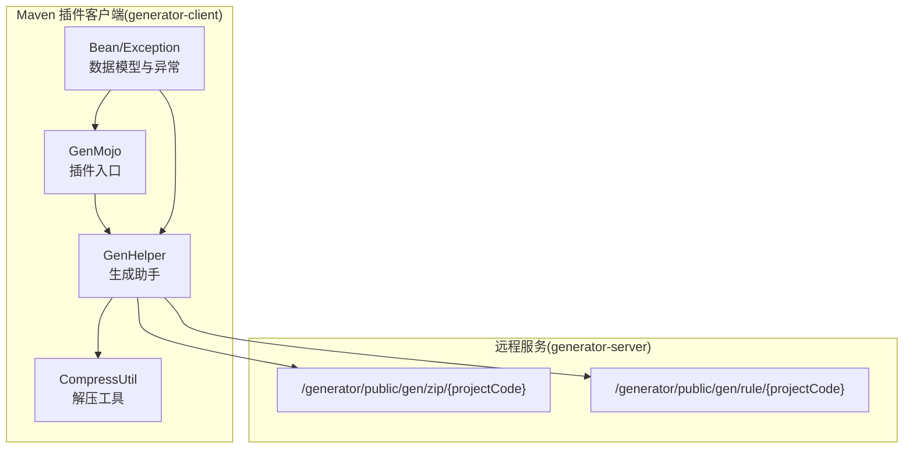
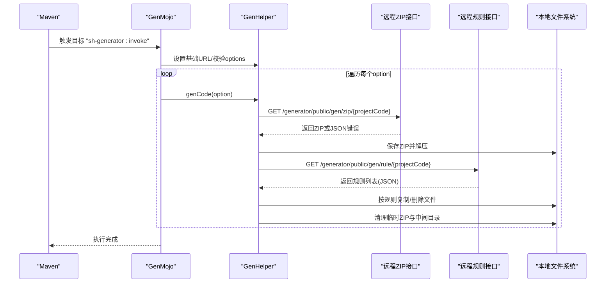
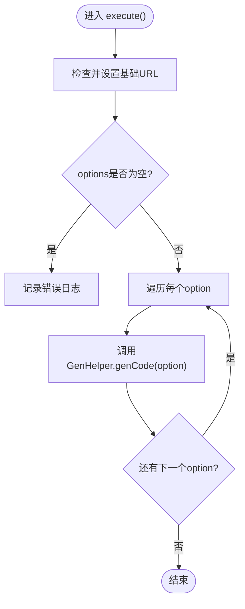
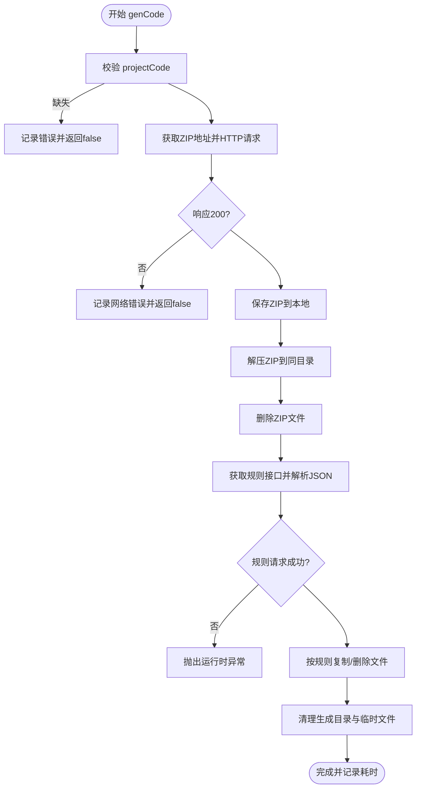
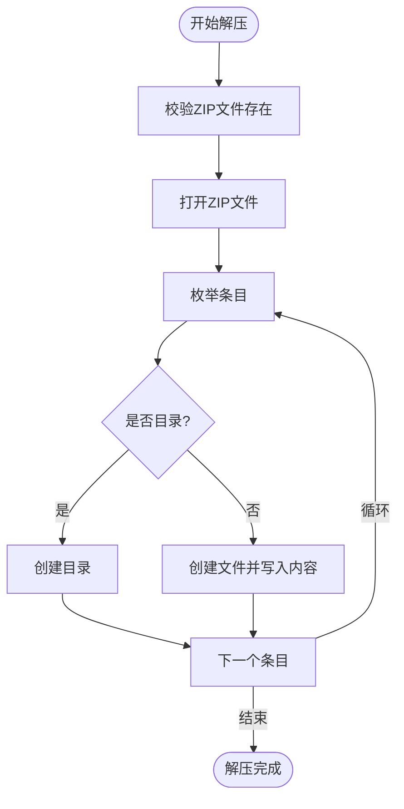
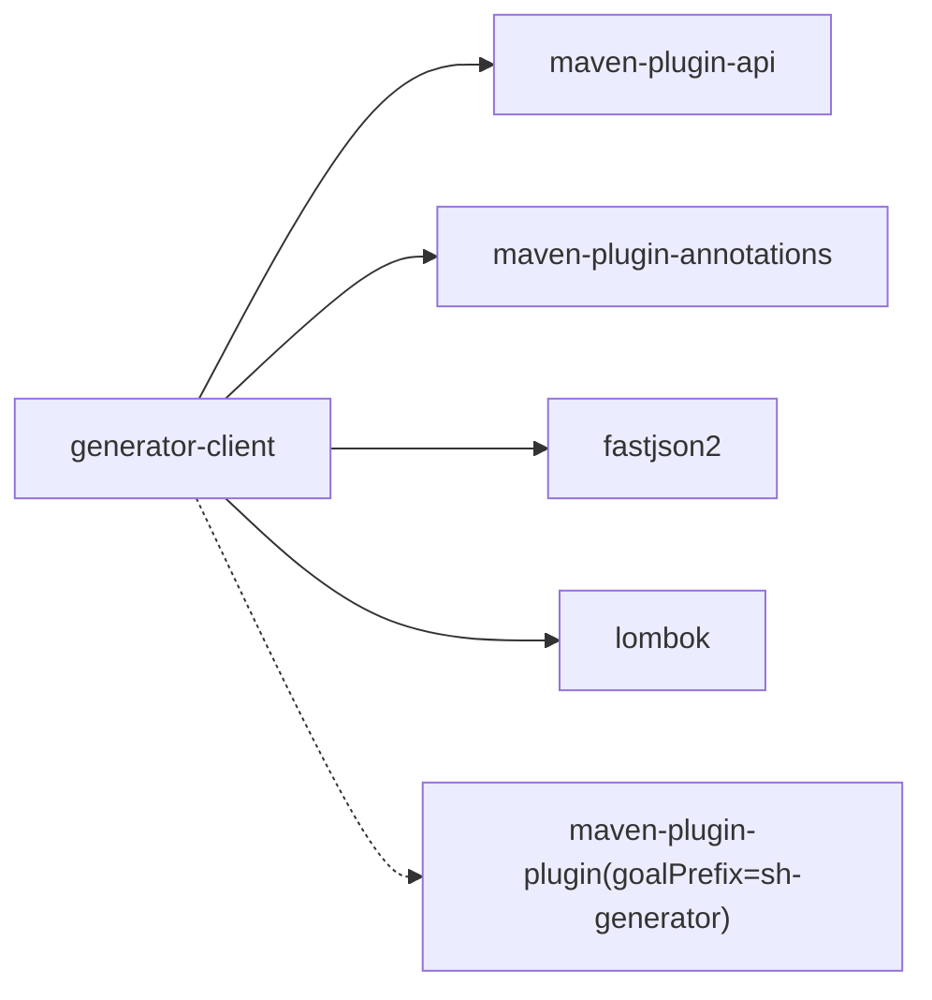

# Maven插件客户端

<cite>
**本文引用的文件**
- [pom.xml](file://generator-client/pom.xml)
- [GenMojo.java](file://generator-client/src/main/java/com/wkclz/generator/client/GenMojo.java)
- [GenHelper.java](file://generator-client/src/main/java/com/wkclz/generator/client/helper/GenHelper.java)
- [CompressUtil.java](file://generator-client/src/main/java/com/wkclz/generator/client/utils/CompressUtil.java)
- [GenResult.java](file://generator-client/src/main/java/com/wkclz/generator/client/bean/GenResult.java)
- [GenTaskInfo.java](file://generator-client/src/main/java/com/wkclz/generator/client/bean/GenTaskInfo.java)
- [GenException.java](file://generator-client/src/main/java/com/wkclz/generator/client/exception/GenException.java)
- [pom.xml](file://pom.xml)
</cite>

## 目录
1. [简介](#简介)
2. [项目结构](#项目结构)
3. [核心组件](#核心组件)
4. [架构总览](#架构总览)
5. [详细组件分析](#详细组件分析)
6. [依赖关系分析](#依赖关系分析)
7. [性能考虑](#性能考虑)
8. [故障排查指南](#故障排查指南)
9. [结论](#结论)
10. [附录](#附录)

## 简介
本文件面向 SH-Generator Maven 插件客户端，系统性阐述其工作原理、生命周期管理、入口点 GenMojo 的实现机制、参数配置选项、与远程代码生成服务的通信协议与数据传输格式、完整的配置示例与使用场景、执行流程（从参数解析到代码生成再到结果处理）、常见问题排查以及性能优化建议。该插件通过 Maven 生命周期阶段触发，调用远程服务获取压缩包与生成规则，本地解压并按规则进行文件替换，最终完成代码生成。

## 项目结构
- generator-client：Maven 插件模块，打包类型为 maven-plugin，包含插件入口、工具类、数据模型与异常定义。
- generator-server：远程代码生成服务端，提供 ZIP 包下载与生成规则查询接口。
- generator-server-starter：服务端启动模块（非本文重点）。
- generator-ui：前端界面（非本文重点）。
- 根 pom：聚合模块，统一版本与编译属性。

图表来源
- [GenMojo.java:15-42](file://generator-client/src/main/java/com/wkclz/generator/client/GenMojo.java#L15-L42)
- [GenHelper.java:258-271](file://generator-client/src/main/java/com/wkclz/generator/client/helper/GenHelper.java#L258-L271)
- [CompressUtil.java:33-79](file://generator-client/src/main/java/com/wkclz/generator/client/utils/CompressUtil.java#L33-L79)

章节来源
- [pom.xml:1-35](file://pom.xml#L1-L35)
- [generator-client/pom.xml:1-75](file://generator-client/pom.xml#L1-L75)

## 核心组件
- 插件入口 GenMojo：声明插件目标名称、默认生命周期阶段、参数注入，并在执行时设置基础 URL、校验 options 参数、逐项触发生成。
- 生成助手 GenHelper：负责远程请求 ZIP 与规则、下载与保存、解压、替换策略、清理临时文件等全流程控制。
- 解压工具 CompressUtil：封装 ZIP 文件解压逻辑，确保目录与文件正确创建。
- 数据模型与异常：GenResult 统一响应结构，GenTaskInfo 描述生成任务规则，GenException 提供统一异常包装。
- Maven 插件配置：声明 maven-plugin-api、maven-plugin-annotations、fastjson2、lombok 等依赖，配置 maven-plugin-plugin goalPrefix 为 sh-generator。

章节来源
- [GenMojo.java:15-42](file://generator-client/src/main/java/com/wkclz/generator/client/GenMojo.java#L15-L42)
- [GenHelper.java:21-303](file://generator-client/src/main/java/com/wkclz/generator/client/helper/GenHelper.java#L21-L303)
- [CompressUtil.java:21-82](file://generator-client/src/main/java/com/wkclz/generator/client/utils/CompressUtil.java#L21-L82)
- [GenResult.java:9-21](file://generator-client/src/main/java/com/wkclz/generator/client/bean/GenResult.java#L9-L21)
- [GenTaskInfo.java:5-19](file://generator-client/src/main/java/com/wkclz/generator/client/bean/GenTaskInfo.java#L5-L19)
- [GenException.java:6-21](file://generator-client/src/main/java/com/wkclz/generator/client/exception/GenException.java#L6-L21)
- [generator-client/pom.xml:16-75](file://generator-client/pom.xml#L16-L75)

## 架构总览
插件在 Maven 生命周期的 PACKAGE 阶段被触发，接收用户配置的 URL 与 options 列表，依次调用远程服务获取 ZIP 与规则，本地解压并根据规则进行文件复制或删除，最后清理临时文件。

图表来源
- [GenMojo.java:27-40](file://generator-client/src/main/java/com/wkclz/generator/client/GenMojo.java#L27-L40)
- [GenHelper.java:40-108](file://generator-client/src/main/java/com/wkclz/generator/client/helper/GenHelper.java#L40-L108)
- [GenHelper.java:258-271](file://generator-client/src/main/java/com/wkclz/generator/client/helper/GenHelper.java#L258-L271)

## 详细组件分析

### 插件入口 GenMojo
- 目标与生命周期：目标名为 invoke，默认绑定到 PACKAGE 生命周期阶段，支持聚合模式。
- 参数注入：
  - url：远程服务基础 URL，若提供则设置到 GenHelper 中。
  - options：必填的项目标识集合，逐个触发生成。
  - args：通过 property 注入的额外参数字符串（当前实现未直接使用）。
- 执行流程：
  - 校验并设置基础 URL。
  - 校验 options 是否为空，为空则记录错误日志。
  - 遍历 options，逐个调用 GenHelper.genCode(option, log)。

图表来源
- [GenMojo.java:27-40](file://generator-client/src/main/java/com/wkclz/generator/client/GenMojo.java#L27-L40)

章节来源
- [GenMojo.java:15-42](file://generator-client/src/main/java/com/wkclz/generator/client/GenMojo.java#L15-L42)

### 生成助手 GenHelper
- 全局状态：
  - BASE_URL：远程服务基础地址，默认值指向生产环境地址。
  - PROJECT_CODE：当前生成的项目标识。
- 主流程：
  - 参数校验：PROJECT_CODE 必须存在。
  - 获取 ZIP 地址并发起 HTTP 请求，设置超时与 UA；若响应非 200 或返回 JSON，则记录错误。
  - 保存 ZIP 至用户目录 tmp/gen/，解析 Content-Disposition 获取文件名。
  - 解压 ZIP 到同目录，删除压缩文件。
  - 获取规则：调用规则接口，解析 JSON，封装为 GenResult，校验成功标志后转为 GenTaskInfo 列表。
  - 替换策略：遍历规则，按开关与路径规则复制或删除文件；对 ../ 进行路径修正；特殊文件 Example.java 直接删除。
  - 清理：删除生成目录与临时 ZIP。
  - 记录耗时。
- 异常处理：IO/URI 异常统一包装为 GenException.error；规则查询失败与网络错误抛出运行时异常。
- 工具方法：
  - getGenZipAddr/getGenRule：拼接远程接口地址。
  - setBaseUrl：动态设置基础 URL。
  - getSavePath：解析保存路径与文件名。
  - readInputStream：从输入流读取字节。
  - delFile：递归删除文件/目录。

图表来源
- [GenHelper.java:40-108](file://generator-client/src/main/java/com/wkclz/generator/client/helper/GenHelper.java#L40-L108)
- [GenHelper.java:160-201](file://generator-client/src/main/java/com/wkclz/generator/client/helper/GenHelper.java#L160-L201)
- [GenHelper.java:203-256](file://generator-client/src/main/java/com/wkclz/generator/client/helper/GenHelper.java#L203-L256)

章节来源
- [GenHelper.java:21-303](file://generator-client/src/main/java/com/wkclz/generator/client/helper/GenHelper.java#L21-L303)

### 解压工具 CompressUtil
- 功能：解压 ZIP 文件至指定目录，自动创建目录与文件，缓冲区大小固定。
- 异常：解压失败抛出运行时异常，文件创建失败抛出 GenException.error。

图表来源
- [CompressUtil.java:33-79](file://generator-client/src/main/java/com/wkclz/generator/client/utils/CompressUtil.java#L33-L79)

章节来源
- [CompressUtil.java:21-82](file://generator-client/src/main/java/com/wkclz/generator/client/utils/CompressUtil.java#L21-L82)

### 数据模型与异常
- GenResult<T>：统一响应结构，包含 code、msg、data 与 isSuccess 判定。
- GenTaskInfo：描述单个生成任务的规则字段（项目编码、模板编码/键、任务名、开关、文件后缀、基路径、包路径等）。
- GenException：统一异常包装，提供 error 工厂方法。

章节来源
- [GenResult.java:9-21](file://generator-client/src/main/java/com/wkclz/generator/client/bean/GenResult.java#L9-L21)
- [GenTaskInfo.java:5-19](file://generator-client/src/main/java/com/wkclz/generator/client/bean/GenTaskInfo.java#L5-L19)
- [GenException.java:6-21](file://generator-client/src/main/java/com/wkclz/generator/client/exception/GenException.java#L6-L21)

## 依赖关系分析
- Maven 插件 API：maven-plugin-api、maven-plugin-annotations。
- 序列化：fastjson2。
- 工具：lombok（简化 POJO）。
- 编译与插件：maven-compiler-plugin、maven-plugin-plugin（goalPrefix 设为 sh-generator）。

图表来源
- [generator-client/pom.xml:16-75](file://generator-client/pom.xml#L16-L75)

章节来源
- [generator-client/pom.xml:16-75](file://generator-client/pom.xml#L16-L75)
- [pom.xml:20-24](file://pom.xml#L20-L24)

## 性能考虑
- 网络请求：
  - 连接超时设置为 3 秒，建议在稳定网络环境下可适当放宽以提升成功率。
  - Content-Type 与 UA 设置有助于服务端识别与限流策略适配。
- IO 与解压：
  - 固定缓冲区大小，建议在大体积 ZIP 时评估内存占用与磁盘 IO。
  - 解压后立即删除 ZIP，避免磁盘空间压力。
- 文件操作：
  - 批量复制/删除前先判断存在性，减少无效 IO。
  - 路径替换（../ → parent/）避免路径逃逸带来的额外处理成本。
- 日志与监控：
  - 记录耗时有助于定位瓶颈；建议在 CI 环境中结合构建时间趋势分析。

[本节为通用性能建议，无需特定文件引用]

## 故障排查指南
- 未发现可用配置：
  - 现象：options 为空导致记录错误日志。
  - 处理：确保在插件配置中提供有效的 projectCode 列表。
- 网络请求错误：
  - 现象：响应码非 200 或返回 JSON 错误。
  - 处理：检查基础 URL 与网络连通性；确认 projectCode 正确；查看服务端返回的错误消息。
- 规则查询失败：
  - 现象：规则接口返回非 200 或 GenResult 非成功状态。
  - 处理：确认项目规则已配置；检查服务端接口可用性。
- 解压失败：
  - 现象：ZIP 文件损坏或权限不足。
  - 处理：检查磁盘空间与写权限；重新触发生成。
- 文件复制/删除异常：
  - 现象：目标文件被占用或权限不足。
  - 处理：关闭 IDE/编辑器占用；确保工作目录可写；必要时以管理员权限运行。

章节来源
- [GenMojo.java:34-36](file://generator-client/src/main/java/com/wkclz/generator/client/GenMojo.java#L34-L36)
- [GenHelper.java:61-74](file://generator-client/src/main/java/com/wkclz/generator/client/helper/GenHelper.java#L61-L74)
- [GenHelper.java:175-198](file://generator-client/src/main/java/com/wkclz/generator/client/helper/GenHelper.java#L175-L198)
- [CompressUtil.java:36-38](file://generator-client/src/main/java/com/wkclz/generator/client/utils/CompressUtil.java#L36-L38)

## 结论
SH-Generator Maven 插件客户端通过简洁的入口与稳健的辅助逻辑，实现了从远程服务拉取 ZIP 与规则、本地解压与替换的完整链路。其参数设计与生命周期绑定使得在构建流程中易于集成；通过统一的响应模型与异常包装提升了可观测性与可维护性。建议在 CI 环境中结合网络与磁盘资源规划，持续监控生成耗时与稳定性。

[本节为总结性内容，无需特定文件引用]

## 附录

### 插件目标与生命周期
- 目标名称：invoke
- 默认生命周期阶段：PACKAGE
- 聚合模式：支持

章节来源
- [GenMojo.java:15](file://generator-client/src/main/java/com/wkclz/generator/client/GenMojo.java#L15)

### 参数配置选项
- url：远程服务基础 URL（可选，用于覆盖默认值）
- options：必填的项目标识列表（必填）
- args：通过 property 注入的额外参数字符串（当前实现未直接使用）

章节来源
- [GenMojo.java:18-25](file://generator-client/src/main/java/com/wkclz/generator/client/GenMojo.java#L18-L25)

### 远程服务通信协议与数据传输
- ZIP 下载接口
  - 方法：GET
  - 路径：/generator/public/gen/zip/{projectCode}
  - 响应：二进制 ZIP 或 JSON 错误
  - 头部：Content-Disposition 用于解析文件名
- 规则查询接口
  - 方法：GET
  - 路径：/generator/public/gen/rule/{projectCode}
  - 响应：JSON，包含 GenResult 结构与 GenTaskInfo 数组
- 请求头
  - User-Agent：sh-generator
  - Content-Type：application/json（规则接口）
- 响应校验
  - ZIP：响应码 200 且 Content-Type 不为 application/json
  - 规则：GenResult.success 为真

章节来源
- [GenHelper.java:50-74](file://generator-client/src/main/java/com/wkclz/generator/client/helper/GenHelper.java#L50-L74)
- [GenHelper.java:168-190](file://generator-client/src/main/java/com/wkclz/generator/client/helper/GenHelper.java#L168-L190)
- [GenResult.java:16-18](file://generator-client/src/main/java/com/wkclz/generator/client/bean/GenResult.java#L16-L18)
- [GenTaskInfo.java:7-17](file://generator-client/src/main/java/com/wkclz/generator/client/bean/GenTaskInfo.java#L7-L17)

### 执行流程（从参数解析到结果处理）
- 参数解析：url（可选）、options（必填）、args（可选）。
- 基础 URL 设置：若提供 url 则更新全局 BASE_URL。
- 生成循环：遍历 options，逐个执行生成。
- ZIP 获取与保存：解析 Content-Disposition 获取文件名，保存至 tmp/gen/。
- 解压与清理：解压后删除 ZIP 文件。
- 规则获取与应用：解析规则 JSON，按规则复制/删除文件。
- 最终清理：删除生成目录与临时文件，记录总耗时。

章节来源
- [GenMojo.java:27-40](file://generator-client/src/main/java/com/wkclz/generator/client/GenMojo.java#L27-L40)
- [GenHelper.java:40-108](file://generator-client/src/main/java/com/wkclz/generator/client/helper/GenHelper.java#L40-L108)

### 使用场景与最佳实践
- 在构建流程中集成：
  - 将插件绑定到 PACKAGE 阶段，确保在打包前完成代码生成。
  - 在 CI 环境中预热网络与磁盘，减少首次生成耗时。
- 配置最佳实践：
  - 明确提供 options 列表，避免空配置导致失败。
  - 在私有网络或内网环境中，优先使用稳定的内网域名作为 url。
  - 对于大体积项目，建议拆分为多个 projectCode，分批生成以降低单次压力。
- 路径与规则：
  - 注意 ../ 路径的替换逻辑，确保生成路径与目标工程一致。
  - 对于 MBG 自动生成的 Example.java 等特例文件，保持删除策略以避免冲突。

[本节为通用实践建议，无需特定文件引用]