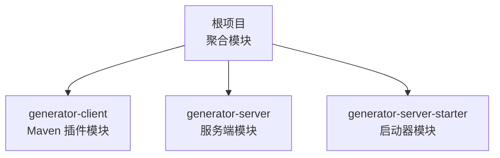
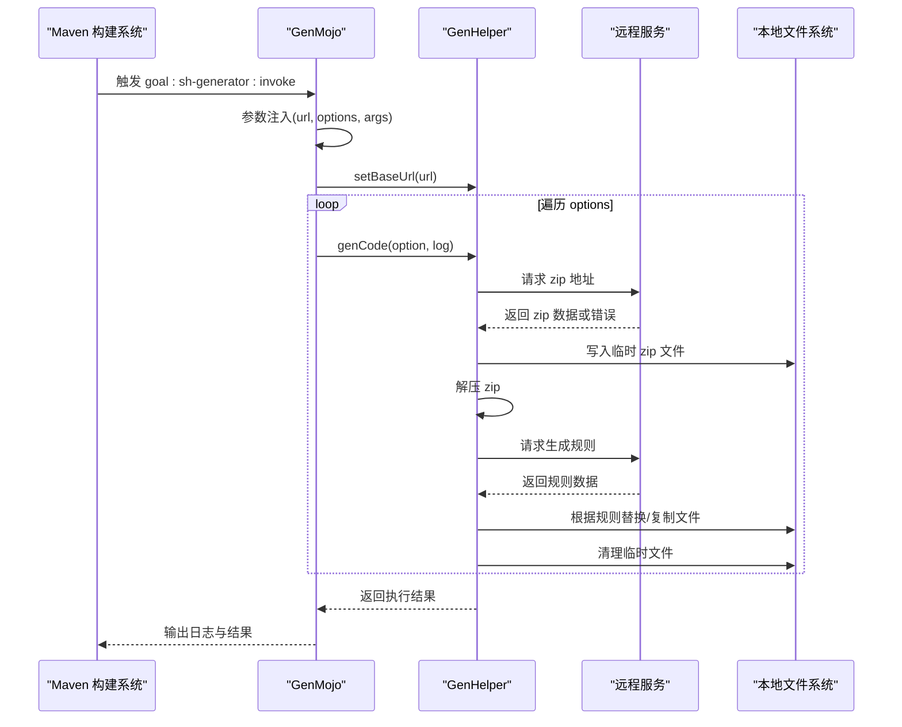
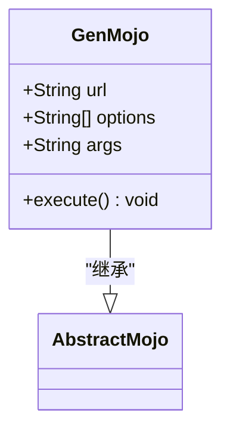
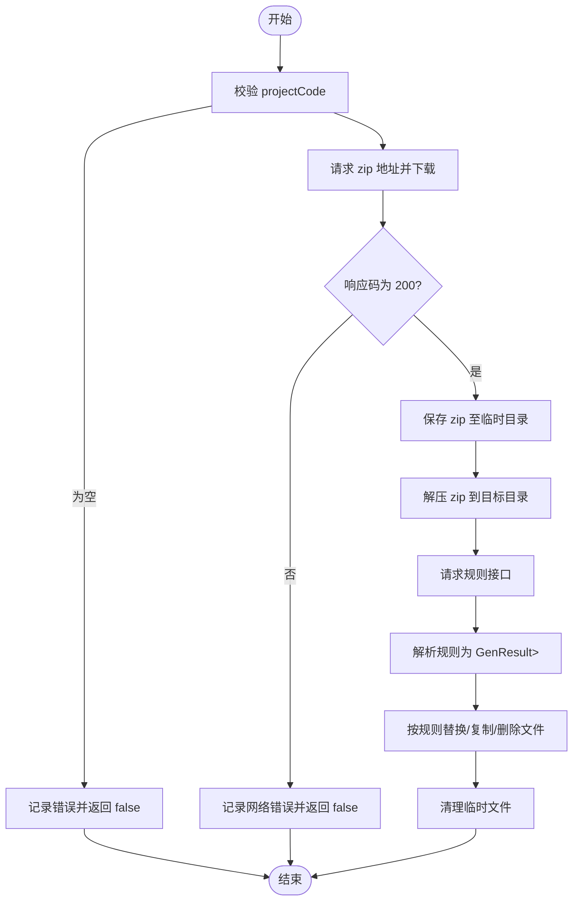
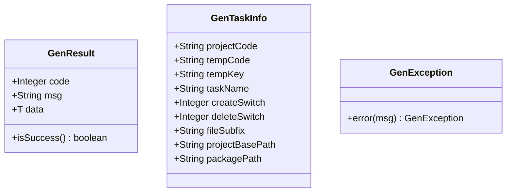
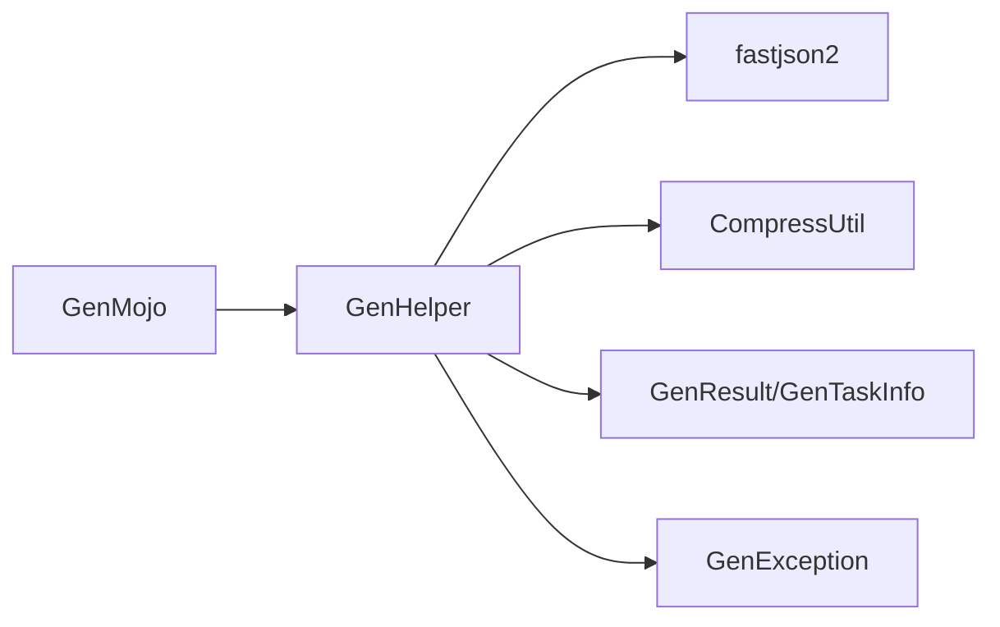

# 插件架构设计

<cite>
**本文引用的文件列表**
- [GenMojo.java](file://generator-client/src/main/java/com/wkclz/generator/client/GenMojo.java)
- [GenHelper.java](file://generator-client/src/main/java/com/wkclz/generator/client/helper/GenHelper.java)
- [GenResult.java](file://generator-client/src/main/java/com/wkclz/generator/client/bean/GenResult.java)
- [GenTaskInfo.java](file://generator-client/src/main/java/com/wkclz/generator/client/bean/GenTaskInfo.java)
- [GenException.java](file://generator-client/src/main/java/com/wkclz/generator/client/exception/GenException.java)
- [CompressUtil.java](file://generator-client/src/main/java/com/wkclz/generator/client/utils/CompressUtil.java)
- [pom.xml（generator-client）](file://generator-client/pom.xml)
- [pom.xml（根项目）](file://pom.xml)
</cite>

## 目录
1. [简介](#简介)
2. [项目结构](#项目结构)
3. [核心组件](#核心组件)
4. [架构总览](#架构总览)
5. [详细组件分析](#详细组件分析)
6. [依赖关系分析](#依赖关系分析)
7. [性能考量](#性能考量)
8. [故障排查指南](#故障排查指南)
9. [结论](#结论)
10. [附录](#附录)

## 简介
本技术文档围绕 SH-Generator 的 Maven 插件架构展开，重点解析 generator-client 模块中的插件入口点 GenMojo 的实现机制，包括：
- @Mojo 注解配置、生命周期阶段设置与参数注入机制
- 继承体系与 AbstractMojo 基类的作用
- GenHelper 辅助类的设计理念与工具方法实现
- 插件执行流程：从 Maven 生命周期触发到代码生成完成的全过程
- 插件与 Maven 构建系统的集成方式及“约定优于配置”的设计原则

## 项目结构
该仓库采用多模块聚合结构，其中 generator-client 为 Maven 插件模块，负责提供 Maven goal 并与远程服务交互以完成代码生成任务。根 POM 聚合了 server、server-starter 和 client 三个子模块。

图表来源
- [pom.xml（根项目）:18-24](file://pom.xml#L18-L24)

章节来源
- [pom.xml（根项目）:18-24](file://pom.xml#L18-L24)

## 核心组件
- GenMojo：Maven 插件入口点，声明 goal 名称、默认生命周期阶段与参数注入策略，并在执行时委托 GenHelper 完成实际工作。
- GenHelper：封装远程调用、下载压缩包、解压、替换与清理等完整流程的工具类。
- Bean 与异常：GenResult、GenTaskInfo 提供数据契约；GenException 提供统一异常处理。
- CompressUtil：提供 ZIP 文件解压能力，支持目录与文件的递归创建与拷贝。
- generator-client/pom.xml：定义插件打包类型、依赖、编译配置与 maven-plugin-plugin 插件目标前缀。

章节来源
- [GenMojo.java:15-42](file://generator-client/src/main/java/com/wkclz/generator/client/GenMojo.java#L15-L42)
- [GenHelper.java:21-303](file://generator-client/src/main/java/com/wkclz/generator/client/helper/GenHelper.java#L21-L303)
- [GenResult.java:9-21](file://generator-client/src/main/java/com/wkclz/generator/client/bean/GenResult.java#L9-L21)
- [GenTaskInfo.java:5-19](file://generator-client/src/main/java/com/wkclz/generator/client/bean/GenTaskInfo.java#L5-L19)
- [GenException.java:6-21](file://generator-client/src/main/java/com/wkclz/generator/client/exception/GenException.java#L6-L21)
- [CompressUtil.java:21-82](file://generator-client/src/main/java/com/wkclz/generator/client/utils/CompressUtil.java#L21-L82)
- [pom.xml（generator-client）:14-75](file://generator-client/pom.xml#L14-L75)

## 架构总览
下图展示了从 Maven 生命周期触发到代码生成完成的整体架构与数据流。

图表来源
- [GenMojo.java:27-40](file://generator-client/src/main/java/com/wkclz/generator/client/GenMojo.java#L27-L40)
- [GenHelper.java:40-108](file://generator-client/src/main/java/com/wkclz/generator/client/helper/GenHelper.java#L40-L108)

## 详细组件分析

### GenMojo：Maven 插件入口点
- 入口类：com.wkclz.generator.client.GenMojo
- 目标名称与生命周期：通过 @Mojo(name = "invoke", defaultPhase = LifecyclePhase.PACKAGE, aggregator = true) 声明 goal 名称为 invoke，默认绑定到 PACKAGE 生命周期阶段，并启用聚合模式。
- 参数注入：
  - url：用于覆盖远程服务基础地址
  - options：字符串列表，代表一次执行需要处理的项目编码集合
  - args：通过 property = "args" 注入，便于命令行传参
- 执行逻辑：
  - 若提供了 url，则设置全局基础地址
  - 校验 options 是否为空，否则记录错误
  - 遍历 options，逐项调用 GenHelper.genCode(...) 完成生成

图表来源
- [GenMojo.java:15-42](file://generator-client/src/main/java/com/wkclz/generator/client/GenMojo.java#L15-L42)

章节来源
- [GenMojo.java:15-42](file://generator-client/src/main/java/com/wkclz/generator/client/GenMojo.java#L15-L42)

### GenHelper：远程代码生成与文件操作
- 设计理念：
  - 单一职责：集中处理远程调用、下载、解压、规则解析与文件替换
  - 约定优于配置：默认基础地址、临时目录、规则接口路径均内置，减少用户配置
  - 异常统一：通过 GenException 抛出运行时异常，便于上层捕获
- 关键方法与流程：
  - genCode(Log log)：主流程
    - 校验 projectCode
    - 获取 zip 下载地址并发起 HTTP 请求
    - 校验响应码与 Content-Type，若返回 JSON 错误则记录错误并终止
    - 写入临时 zip 文件，解压至本地目录
    - 获取规则接口并解析为 GenResult<List<GenTaskInfo>>
    - 根据规则进行替换/复制/删除操作
    - 清理临时文件
  - getSavePath(HttpURLConnection, Log)：根据响应头 Content-Disposition 推断文件名，确保目录存在
  - getRule(String, Log)：请求规则接口，解析为 GenResult 并提取规则列表
  - replaceCode(List<GenTaskInfo>, String, Log)：按规则在目标路径复制/删除文件
  - setBaseUrl(String)：动态设置远程基础地址
  - delFile(...)：递归删除文件或目录

图表来源
- [GenHelper.java:40-108](file://generator-client/src/main/java/com/wkclz/generator/client/helper/GenHelper.java#L40-L108)
- [GenHelper.java:160-201](file://generator-client/src/main/java/com/wkclz/generator/client/helper/GenHelper.java#L160-L201)
- [GenHelper.java:203-256](file://generator-client/src/main/java/com/wkclz/generator/client/helper/GenHelper.java#L203-L256)

章节来源
- [GenHelper.java:21-303](file://generator-client/src/main/java/com/wkclz/generator/client/helper/GenHelper.java#L21-L303)

### Bean 与异常模型
- GenResult<T>：通用响应模型，包含 code、msg、data 字段，并提供 isSuccess() 判定
- GenTaskInfo：生成任务规则实体，包含项目编码、模板编码、开关控制、包路径等字段
- GenException：统一异常包装类，提供 error(...) 工厂方法

图表来源
- [GenResult.java:9-21](file://generator-client/src/main/java/com/wkclz/generator/client/bean/GenResult.java#L9-L21)
- [GenTaskInfo.java:5-19](file://generator-client/src/main/java/com/wkclz/generator/client/bean/GenTaskInfo.java#L5-L19)
- [GenException.java:6-21](file://generator-client/src/main/java/com/wkclz/generator/client/exception/GenException.java#L6-L21)

章节来源
- [GenResult.java:9-21](file://generator-client/src/main/java/com/wkclz/generator/client/bean/GenResult.java#L9-L21)
- [GenTaskInfo.java:5-19](file://generator-client/src/main/java/com/wkclz/generator/client/bean/GenTaskInfo.java#L5-L19)
- [GenException.java:6-21](file://generator-client/src/main/java/com/wkclz/generator/client/exception/GenException.java#L6-L21)

### CompressUtil：ZIP 解压工具
- 功能：解压 zip 文件，自动创建目录与文件，按条目顺序读取并写入
- 异常：使用 GenException.error(...) 包装创建文件失败等异常

章节来源
- [CompressUtil.java:21-82](file://generator-client/src/main/java/com/wkclz/generator/client/utils/CompressUtil.java#L21-L82)

### 插件与 Maven 构建系统的集成
- 插件打包类型：generator-client/pom.xml 中 packaging 设置为 maven-plugin，表明这是一个 Maven 插件模块
- 目标前缀：通过 maven-plugin-plugin 配置 goalPrefix 为 sh-generator，因此最终 goal 名称为 sh-generator:invoke
- 编译配置：使用 maven-compiler-plugin 指定 Java 版本
- 依赖：maven-plugin-api、maven-plugin-annotations（provided）、fastjson2、lombok

章节来源
- [pom.xml（generator-client）:14-75](file://generator-client/pom.xml#L14-L75)

## 依赖关系分析
- GenMojo 依赖 AbstractMojo（来自 maven-plugin-api）与 GenHelper
- GenHelper 依赖：
  - fastjson2：JSON 解析
  - CompressUtil：ZIP 解压
  - GenResult、GenTaskInfo：远程响应与规则模型
  - GenException：异常包装
- 插件模块依赖链路清晰，耦合度低，职责明确

图表来源
- [GenMojo.java:3-8](file://generator-client/src/main/java/com/wkclz/generator/client/GenMojo.java#L3-L8)
- [GenHelper.java:3-9](file://generator-client/src/main/java/com/wkclz/generator/client/helper/GenHelper.java#L3-L9)
- [pom.xml（generator-client）:16-38](file://generator-client/pom.xml#L16-L38)

章节来源
- [GenMojo.java:3-8](file://generator-client/src/main/java/com/wkclz/generator/client/GenMojo.java#L3-L8)
- [GenHelper.java:3-9](file://generator-client/src/main/java/com/wkclz/generator/client/helper/GenHelper.java#L3-L9)
- [pom.xml（generator-client）:16-38](file://generator-client/pom.xml#L16-L38)

## 性能考量
- 网络请求超时：HTTP 连接设置连接超时，避免长时间阻塞
- 流式读取：readInputStream 使用缓冲区按块读取，降低内存占用
- 解压效率：CompressUtil 使用固定缓冲区大小，逐条目处理，避免一次性加载整个 zip
- 日志输出：关键步骤输出耗时统计，便于定位性能瓶颈
- 建议优化：
  - 可考虑并发下载多个 zip 或分批处理 options
  - 规则解析可缓存，避免重复请求
  - 大文件传输可增加断点续传或进度回调

## 故障排查指南
- 常见问题与定位：
  - 未发现可用配置：检查 options 是否为空或未正确传入
  - 网络请求错误：检查远程服务地址、防火墙与代理设置
  - ZIP 解压失败：确认磁盘空间、权限与 zip 文件完整性
  - 规则解析失败：检查远程规则接口返回格式是否符合 GenResult
- 日志建议：
  - 在关键节点输出详细日志，如下载地址、保存路径、规则数量、替换文件数
  - 记录异常堆栈以便快速定位

章节来源
- [GenMojo.java:34-36](file://generator-client/src/main/java/com/wkclz/generator/client/GenMojo.java#L34-L36)
- [GenHelper.java:62-74](file://generator-client/src/main/java/com/wkclz/generator/client/helper/GenHelper.java#L62-L74)
- [GenHelper.java:196-198](file://generator-client/src/main/java/com/wkclz/generator/client/helper/GenHelper.java#L196-L198)

## 结论
SH-Generator Maven 插件通过简洁的入口类 GenMojo 与强大的辅助类 GenHelper 实现了“约定优于配置”的设计理念。插件在 PACKAGE 生命周期阶段被触发，通过参数注入接收远程地址与项目编码列表，借助远程服务返回的 zip 包与规则，完成本地代码生成、替换与清理。整体架构职责清晰、扩展性强，适合在企业级项目中作为标准化的代码生成工具。

## 附录
- 命令行示例（基于 goalPrefix 与参数注入）：
  - mvn sh-generator:invoke -Durl=https://your.api.com -Doptions=["PROJ-A","PROJ-B"] -Dargs="..."
- 最佳实践：
  - 将远程地址与项目编码纳入 CI/CD 环境变量，避免硬编码
  - 在团队内统一规则命名与包路径规范，提升替换准确性
  - 定期验证远程接口稳定性与返回格式一致性