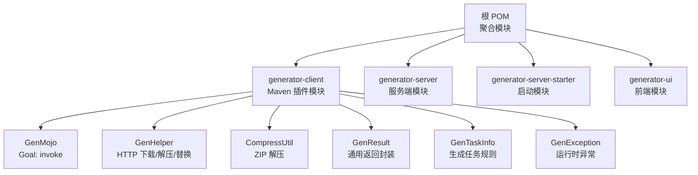
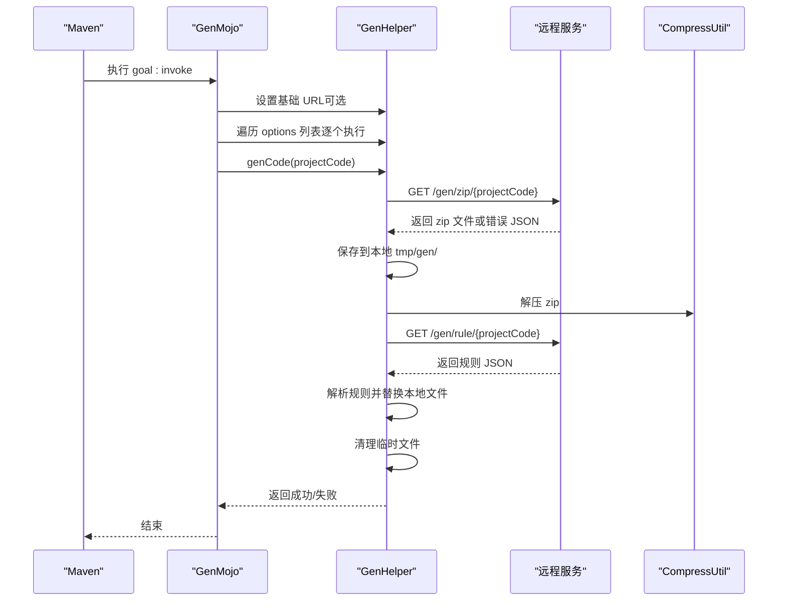
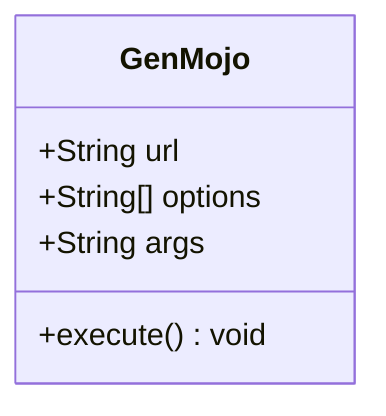
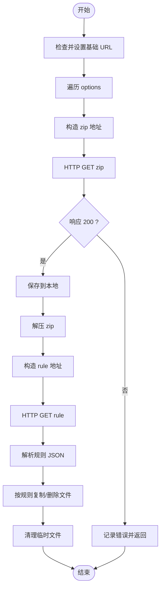
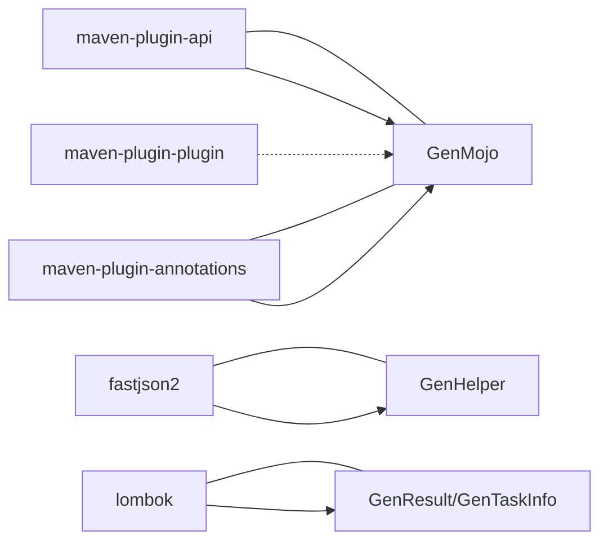

# 插件配置与使用

<cite>
**本文引用的文件**
- [pom.xml](file://pom.xml)
- [generator-client/pom.xml](file://generator-client/pom.xml)
- [generator-client/src/main/java/com/wkclz/generator/client/GenMojo.java](file://generator-client/src/main/java/com/wkclz/generator/client/GenMojo.java)
- [generator-client/src/main/java/com/wkclz/generator/client/helper/GenHelper.java](file://generator-client/src/main/java/com/wkclz/generator/client/helper/GenHelper.java)
- [generator-client/src/main/java/com/wkclz/generator/client/utils/CompressUtil.java](file://generator-client/src/main/java/com/wkclz/generator/client/utils/CompressUtil.java)
- [generator-client/src/main/java/com/wkclz/generator/client/bean/GenResult.java](file://generator-client/src/main/java/com/wkclz/generator/client/bean/GenResult.java)
- [generator-client/src/main/java/com/wkclz/generator/client/bean/GenTaskInfo.java](file://generator-client/src/main/java/com/wkclz/generator/client/bean/GenTaskInfo.java)
- [generator-client/src/main/java/com/wkclz/generator/client/exception/GenException.java](file://generator-client/src/main/java/com/wkclz/generator/client/exception/GenException.java)
- [README.md](file://README.md)
</cite>

## 目录
1. [简介](#简介)
2. [项目结构](#项目结构)
3. [核心组件](#核心组件)
4. [架构总览](#架构总览)
5. [详细组件分析](#详细组件分析)
6. [依赖分析](#依赖分析)
7. [性能考虑](#性能考虑)
8. [故障排查指南](#故障排查指南)
9. [结论](#结论)
10. [附录](#附录)

## 简介
本指南面向需要在 Maven 工程中使用 SH-Generator Maven 插件的开发者，提供从插件安装、pom.xml 中的插件声明、参数配置、执行绑定到实际使用场景的完整说明。插件通过调用远程服务接口，拉取项目生成规则与打包产物，自动下载、解压、替换并清理临时文件，最终将生成的代码同步至本地工程。

## 项目结构
SH-Generator 采用多模块组织，其中与 Maven 插件直接相关的是 generator-client 模块，它定义了 Maven Mojo（Goal）以及与远程服务交互的客户端逻辑。

图表来源
- [pom.xml:1-35](file://pom.xml#L1-L35)
- [generator-client/pom.xml:1-75](file://generator-client/pom.xml#L1-L75)
- [generator-client/src/main/java/com/wkclz/generator/client/GenMojo.java:1-42](file://generator-client/src/main/java/com/wkclz/generator/client/GenMojo.java#L1-L42)
- [generator-client/src/main/java/com/wkclz/generator/client/helper/GenHelper.java:1-303](file://generator-client/src/main/java/com/wkclz/generator/client/helper/GenHelper.java#L1-L303)
- [generator-client/src/main/java/com/wkclz/generator/client/utils/CompressUtil.java:1-82](file://generator-client/src/main/java/com/wkclz/generator/client/utils/CompressUtil.java#L1-L82)
- [generator-client/src/main/java/com/wkclz/generator/client/bean/GenResult.java:1-21](file://generator-client/src/main/java/com/wkclz/generator/client/bean/GenResult.java#L1-L21)
- [generator-client/src/main/java/com/wkclz/generator/client/bean/GenTaskInfo.java:1-19](file://generator-client/src/main/java/com/wkclz/generator/client/bean/GenTaskInfo.java#L1-L19)
- [generator-client/src/main/java/com/wkclz/generator/client/exception/GenException.java:1-21](file://generator-client/src/main/java/com/wkclz/generator/client/exception/GenException.java#L1-L21)

章节来源
- [pom.xml:1-35](file://pom.xml#L1-L35)
- [README.md:1-3](file://README.md#L1-L3)

## 核心组件
- 插件目标（Goal）：invoke
  - 默认生命周期阶段：package
  - 是否聚合执行：是
- 参数
  - url：远程服务基础地址，可选，用于覆盖默认地址
  - options：必填，字符串列表，每个元素代表一个“项目代码”，用于触发一次或多次生成
  - args：可通过命令行属性传入额外参数（由插件注解支持）

章节来源
- [generator-client/src/main/java/com/wkclz/generator/client/GenMojo.java:15-42](file://generator-client/src/main/java/com/wkclz/generator/client/GenMojo.java#L15-L42)
- [generator-client/pom.xml:63-71](file://generator-client/pom.xml#L63-L71)

## 架构总览
插件在 Maven 生命周期中以 package 阶段为目标执行，调用远程服务获取生成规则与打包文件，随后在本地进行解压与替换操作。

图表来源
- [generator-client/src/main/java/com/wkclz/generator/client/GenMojo.java:27-40](file://generator-client/src/main/java/com/wkclz/generator/client/GenMojo.java#L27-L40)
- [generator-client/src/main/java/com/wkclz/generator/client/helper/GenHelper.java:40-108](file://generator-client/src/main/java/com/wkclz/generator/client/helper/GenHelper.java#L40-L108)
- [generator-client/src/main/java/com/wkclz/generator/client/utils/CompressUtil.java:33-79](file://generator-client/src/main/java/com/wkclz/generator/client/utils/CompressUtil.java#L33-L79)

## 详细组件分析

### 组件一：GenMojo（Maven 插件目标）
- 角色：作为 Maven 插件入口，接收配置参数并驱动生成流程
- 关键行为
  - 读取 url 并设置远程基础地址
  - 校验 options 列表是否为空
  - 依次对每个项目代码执行生成
- 生命周期绑定
  - 默认 phase：package
  - 支持聚合执行（aggregator=true）

图表来源
- [generator-client/src/main/java/com/wkclz/generator/client/GenMojo.java:15-42](file://generator-client/src/main/java/com/wkclz/generator/client/GenMojo.java#L15-L42)

章节来源
- [generator-client/src/main/java/com/wkclz/generator/client/GenMojo.java:15-42](file://generator-client/src/main/java/com/wkclz/generator/client/GenMojo.java#L15-L42)

### 组件二：GenHelper（远程交互与本地处理）
- 角色：负责与远程服务通信、下载产物、解压、解析规则并执行替换
- 关键流程
  - 生成 zip 下载地址与规则地址
  - 发起 HTTP 请求，校验响应状态与内容类型
  - 保存到本地 tmp/gen/，解压并删除压缩包
  - 读取规则列表，按规则决定复制/删除文件
  - 清理临时生成目录
- 异常处理
  - 网络错误、JSON 错误、IO 异常均转换为运行时异常

图表来源
- [generator-client/src/main/java/com/wkclz/generator/client/helper/GenHelper.java:40-108](file://generator-client/src/main/java/com/wkclz/generator/client/helper/GenHelper.java#L40-L108)
- [generator-client/src/main/java/com/wkclz/generator/client/helper/GenHelper.java:159-201](file://generator-client/src/main/java/com/wkclz/generator/client/helper/GenHelper.java#L159-L201)
- [generator-client/src/main/java/com/wkclz/generator/client/utils/CompressUtil.java:33-79](file://generator-client/src/main/java/com/wkclz/generator/client/utils/CompressUtil.java#L33-L79)

章节来源
- [generator-client/src/main/java/com/wkclz/generator/client/helper/GenHelper.java:21-108](file://generator-client/src/main/java/com/wkclz/generator/client/helper/GenHelper.java#L21-L108)
- [generator-client/src/main/java/com/wkclz/generator/client/bean/GenResult.java:10-20](file://generator-client/src/main/java/com/wkclz/generator/client/bean/GenResult.java#L10-L20)
- [generator-client/src/main/java/com/wkclz/generator/client/bean/GenTaskInfo.java:6-18](file://generator-client/src/main/java/com/wkclz/generator/client/bean/GenTaskInfo.java#L6-L18)

### 组件三：CompressUtil（ZIP 解压）
- 角色：提供 ZIP 文件解压能力，确保目录与文件正确创建
- 关键点
  - 使用缓冲区读取与写出
  - 严格检查父目录存在性
  - 异常统一包装为运行时异常

章节来源
- [generator-client/src/main/java/com/wkclz/generator/client/utils/CompressUtil.java:21-82](file://generator-client/src/main/java/com/wkclz/generator/client/utils/CompressUtil.java#L21-L82)

### 组件四：数据模型与异常
- GenResult：通用返回封装，包含状态码、消息与数据，并提供成功判断
- GenTaskInfo：生成任务规则对象，包含项目基路径、包路径、开关等字段
- GenException：运行时异常封装

章节来源
- [generator-client/src/main/java/com/wkclz/generator/client/bean/GenResult.java:10-20](file://generator-client/src/main/java/com/wkclz/generator/client/bean/GenResult.java#L10-L20)
- [generator-client/src/main/java/com/wkclz/generator/client/bean/GenTaskInfo.java:6-18](file://generator-client/src/main/java/com/wkclz/generator/client/bean/GenTaskInfo.java#L6-L18)
- [generator-client/src/main/java/com/wkclz/generator/client/exception/GenException.java:6-20](file://generator-client/src/main/java/com/wkclz/generator/client/exception/GenException.java#L6-L20)

## 依赖分析
- 插件模块依赖
  - maven-plugin-api：提供 Mojo 基类与注解支持
  - maven-plugin-annotations：提供注解处理器与元数据生成
  - fastjson2：序列化/反序列化 JSON
  - lombok：简化 POJO
- 插件构建配置
  - maven-plugin-plugin：生成插件描述元数据，goalPrefix 设为 sh-generator
  - maven-compiler-plugin：指定编译目标版本
  - maven-source-plugin：打包源码

图表来源
- [generator-client/pom.xml:16-38](file://generator-client/pom.xml#L16-L38)
- [generator-client/pom.xml:63-71](file://generator-client/pom.xml#L63-L71)

章节来源
- [generator-client/pom.xml:16-38](file://generator-client/pom.xml#L16-L38)
- [generator-client/pom.xml:41-73](file://generator-client/pom.xml#L41-L73)

## 性能考虑
- 网络超时与重试
  - HTTP 连接设置了较短的连接超时时间，适合在内网或低延迟环境使用
  - 建议在网络不稳定时增加重试策略或调整基础 URL 指向就近服务
- IO 与磁盘
  - 临时文件保存在用户目录下的 tmp/gen/，注意磁盘空间与权限
  - 解压过程使用固定缓冲区，避免大文件导致内存峰值过高
- 生成规则解析
  - 规则 JSON 的解析与遍历在本地完成，建议控制规则数量与文件规模
- 并发与批量
  - options 列表会顺序执行，若需并行可在外层脚本或 CI 层面拆分任务

## 故障排查指南
- 常见问题与定位
  - 未发现可用的配置：options 为空或未设置
    - 现象：插件记录错误并提前退出
    - 处理：确保在插件配置中提供至少一个项目代码
  - 网络请求错误：HTTP 响应非 200 或返回 JSON 错误
    - 现象：记录网络错误或代码生成异常
    - 处理：检查基础 URL 与网络连通性，确认项目代码有效
  - 项目代码为空：projectCode 为空
    - 现象：记录错误并返回失败
    - 处理：确保 options 中的项目代码非空
  - 解压失败：ZIP 文件损坏或权限不足
    - 现象：抛出运行时异常
    - 处理：检查磁盘空间、权限与网络稳定性
- 日志与调试
  - 插件会在执行过程中输出关键步骤的日志，便于定位问题
  - 建议开启 Maven 的详细日志级别以获取更多信息

章节来源
- [generator-client/src/main/java/com/wkclz/generator/client/GenMojo.java:34-36](file://generator-client/src/main/java/com/wkclz/generator/client/GenMojo.java#L34-L36)
- [generator-client/src/main/java/com/wkclz/generator/client/helper/GenHelper.java:56-74](file://generator-client/src/main/java/com/wkclz/generator/client/helper/GenHelper.java#L56-L74)
- [generator-client/src/main/java/com/wkclz/generator/client/helper/GenHelper.java:43-46](file://generator-client/src/main/java/com/wkclz/generator/client/helper/GenHelper.java#L43-L46)
- [generator-client/src/main/java/com/wkclz/generator/client/utils/CompressUtil.java:36-38](file://generator-client/src/main/java/com/wkclz/generator/client/utils/CompressUtil.java#L36-L38)

## 结论
SH-Generator Maven 插件通过简洁的参数与明确的生命周期绑定，实现了“远程规则 + 本地替换”的代码生成模式。合理配置 url 与 options，结合 CI/CD 的批量执行，可在多项目场景中高效落地。建议在生产环境中关注网络稳定性、磁盘空间与权限，并根据团队规范对生成结果进行二次校验。

## 附录

### A. 在 pom.xml 中声明与绑定插件
- 插件坐标与版本
  - groupId：com.wkclz.generator
  - artifactId：generator-client
  - packaging：maven-plugin
- 插件声明要点
  - goalPrefix：sh-generator（由构建配置指定）
  - 目标：invoke
  - 生命周期阶段：package（默认）
  - 聚合执行：true（适用于多模块工程）
- 示例参考
  - 插件声明与构建配置：[generator-client/pom.xml:41-73](file://generator-client/pom.xml#L41-L73)
  - 目标与参数注解：[generator-client/src/main/java/com/wkclz/generator/client/GenMojo.java:15-26](file://generator-client/src/main/java/com/wkclz/generator/client/GenMojo.java#L15-L26)

章节来源
- [generator-client/pom.xml:41-73](file://generator-client/pom.xml#L41-L73)
- [generator-client/src/main/java/com/wkclz/generator/client/GenMojo.java:15-26](file://generator-client/src/main/java/com/wkclz/generator/client/GenMojo.java#L15-L26)

### B. 参数详解与取值范围
- url
  - 类型：字符串
  - 作用：覆盖默认远程服务基础地址
  - 取值范围：合法的 HTTP/HTTPS URL
  - 优先级：高于默认地址
- options
  - 类型：字符串列表
  - 作用：每个元素代表一个“项目代码”，用于触发一次或多次生成
  - 取值范围：非空字符串，通常为服务端定义的项目标识
  - 必填性：必填，否则插件会记录错误
- args
  - 类型：字符串
  - 作用：通过命令行属性传入额外参数（由注解支持）
  - 取值范围：任意字符串

章节来源
- [generator-client/src/main/java/com/wkclz/generator/client/GenMojo.java:18-25](file://generator-client/src/main/java/com/wkclz/generator/client/GenMojo.java#L18-L25)

### C. 使用场景与最佳实践
- 单项目生成
  - 在插件配置中提供一个项目代码，执行一次生成
  - 适合新模块或小项目的快速初始化
- 批量项目生成
  - 在 options 中提供多个项目代码，插件将顺序执行
  - 适合多模块工程的统一初始化
- 条件生成
  - 通过远程规则控制是否创建/删除文件，实现按需生成
  - 建议在 CI 中结合分支/标签策略，仅对目标模块执行生成
- 生命周期绑定
  - 默认绑定到 package 阶段，适合在打包前完成代码生成
  - 如需在其他阶段执行，可在插件配置中调整 phase

章节来源
- [generator-client/src/main/java/com/wkclz/generator/client/GenMojo.java:15-42](file://generator-client/src/main/java/com/wkclz/generator/client/GenMojo.java#L15-L42)
- [generator-client/src/main/java/com/wkclz/generator/client/helper/GenHelper.java:203-256](file://generator-client/src/main/java/com/wkclz/generator/client/helper/GenHelper.java#L203-L256)

### D. 与其他 Maven 插件的集成示例
- 与 maven-compiler-plugin 集成
  - 保持编译版本一致，避免生成代码与编译目标不兼容
- 与 maven-resources-plugin 集成
  - 在生成后对资源目录进行过滤或拷贝，确保生成代码被纳入构建
- 与 maven-antrun-plugin 集成
  - 在生成完成后执行额外的脚本或校验任务
- 与 maven-enforcer-plugin 集成
  - 在生成前后执行规则检查，确保生成质量

章节来源
- [generator-client/pom.xml:57-61](file://generator-client/pom.xml#L57-L61)