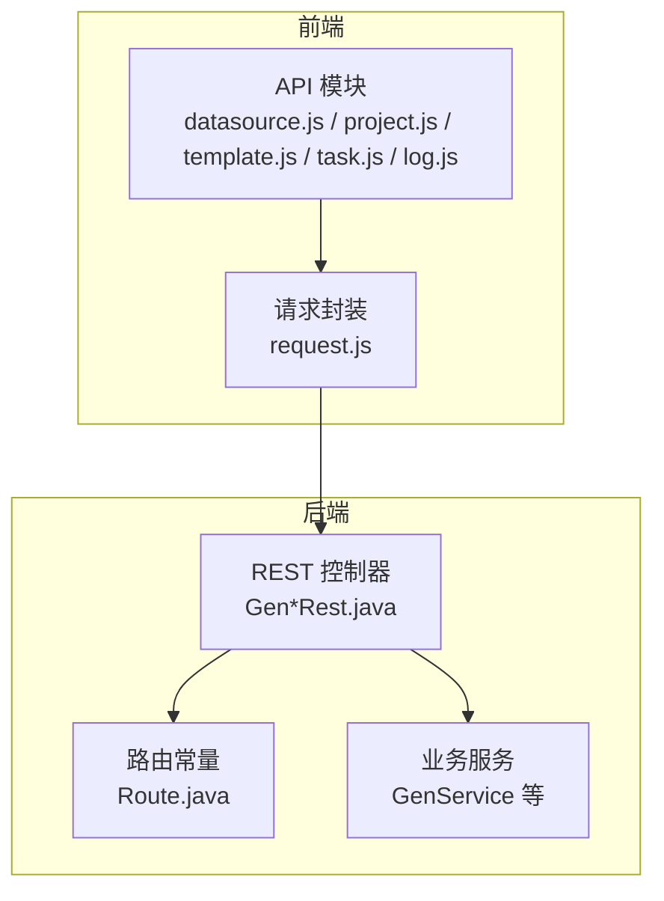
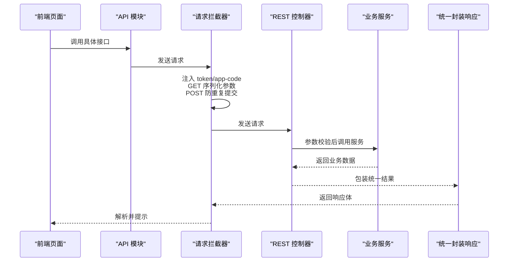
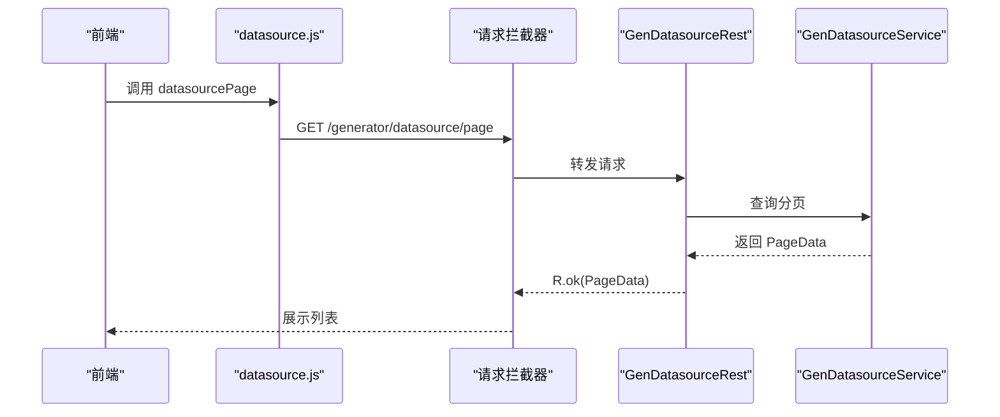
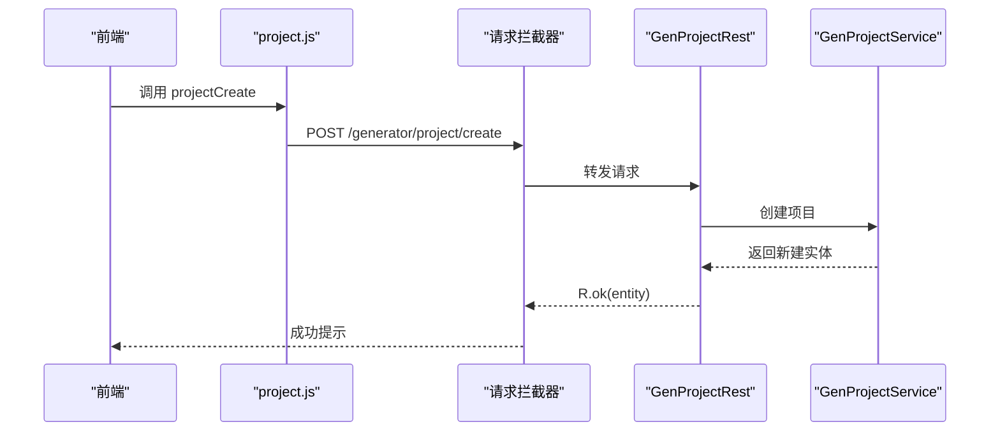
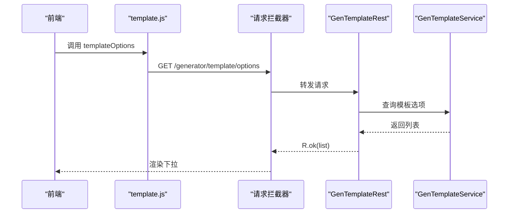
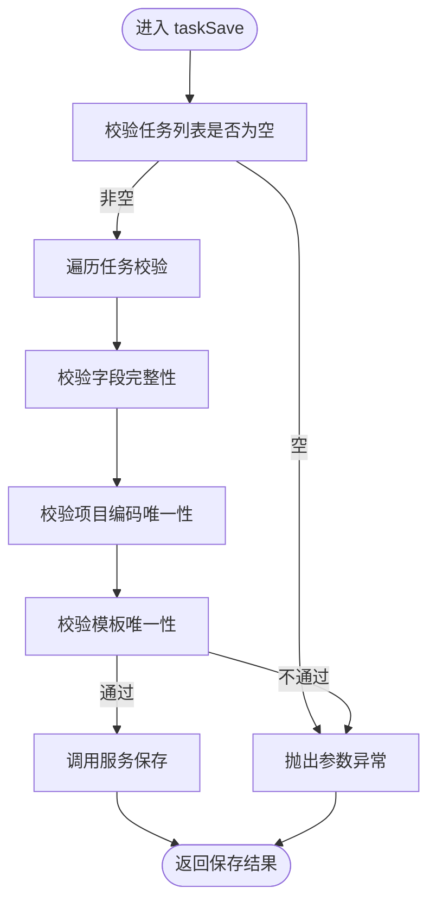
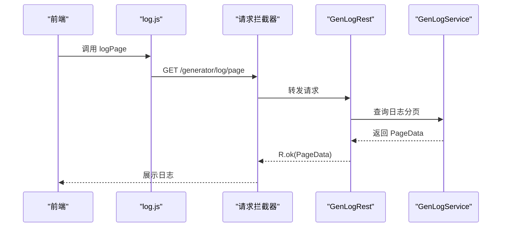
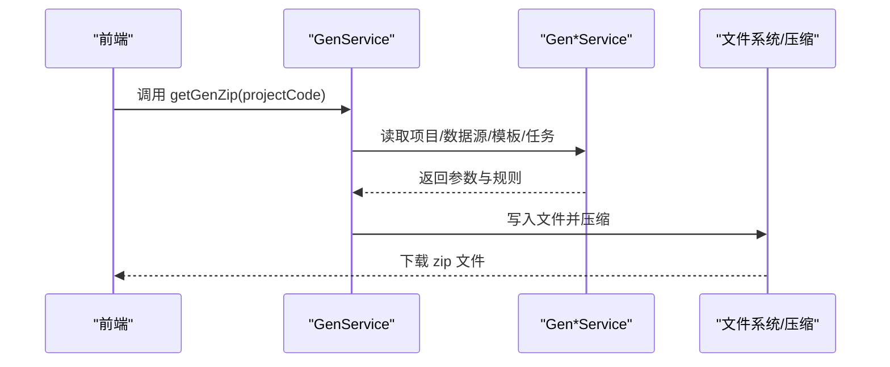
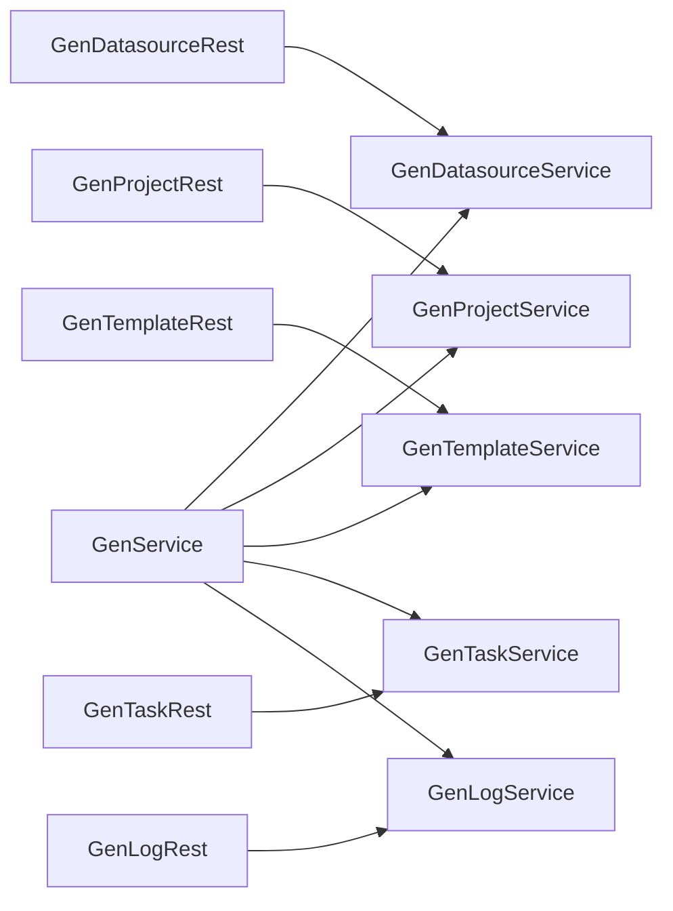

# API接口层

<cite>
**本文引用的文件**
- [Route.java](file://generator-server/src/main/java/com/wkclz/generator/server/Route.java)
- [GenDatasourceRest.java](file://generator-server/src/main/java/com/wkclz/generator/server/rest/GenDatasourceRest.java)
- [GenProjectRest.java](file://generator-server/src/main/java/com/wkclz/generator/server/rest/GenProjectRest.java)
- [GenTemplateRest.java](file://generator-server/src/main/java/com/wkclz/generator/server/rest/GenTemplateRest.java)
- [GenTaskRest.java](file://generator-server/src/main/java/com/wkclz/generator/server/rest/GenTaskRest.java)
- [GenLogRest.java](file://generator-server/src/main/java/com/wkclz/generator/server/rest/GenLogRest.java)
- [GenService.java](file://generator-server/src/main/java/com/wkclz/generator/server/service/GenService.java)
- [request.js](file://generator-ui/src/utils/request.js)
- [datasource.js](file://generator-ui/src/api/datasource.js)
- [project.js](file://generator-ui/src/api/project.js)
- [template.js](file://generator-ui/src/api/template.js)
- [task.js](file://generator-ui/src/api/task.js)
- [log.js](file://generator-ui/src/api/log.js)
- [errorCode.js](file://generator-ui/src/utils/errorCode.js)
- [GenDatasource.java](file://generator-server/src/main/java/com/wkclz/generator/server/bean/entity/GenDatasource.java)
</cite>

## 目录
1. [引言](#引言)
2. [项目结构](#项目结构)
3. [核心组件](#核心组件)
4. [架构总览](#架构总览)
5. [详细组件分析](#详细组件分析)
6. [依赖分析](#依赖分析)
7. [性能考虑](#性能考虑)
8. [故障排查指南](#故障排查指南)
9. [结论](#结论)
10. [附录：接口使用与集成指南](#附录接口使用与集成指南)

## 引言
本文件聚焦于 SH-Generator 的 API 接口层，系统化梳理服务端 REST 控制器、统一响应包装、前端请求拦截与响应处理策略，并给出各业务模块（数据源、项目、模板、任务、日志）的接口设计规范与最佳实践。同时提供错误处理、异常管理、缓存与性能优化建议，以及可直接落地的接口使用示例与集成指南。

## 项目结构
- 服务端控制器位于 generator-server 模块，采用统一前缀路由与模块化接口常量定义，便于前后端协作与扩展。
- 前端通过 axios 封装的请求工具完成拦截、重试控制、重复提交防护、错误提示与下载能力。
- 代码生成流程由服务端统一编排，结合模板引擎与压缩工具输出产物。

图表来源
- [Route.java:1-89](file://generator-server/src/main/java/com/wkclz/generator/server/Route.java#L1-L89)
- [GenDatasourceRest.java:1-83](file://generator-server/src/main/java/com/wkclz/generator/server/rest/GenDatasourceRest.java#L1-L83)
- [GenProjectRest.java:1-79](file://generator-server/src/main/java/com/wkclz/generator/server/rest/GenProjectRest.java#L1-L79)
- [GenTemplateRest.java:1-82](file://generator-server/src/main/java/com/wkclz/generator/server/rest/GenTemplateRest.java#L1-L82)
- [GenTaskRest.java:1-75](file://generator-server/src/main/java/com/wkclz/generator/server/rest/GenTaskRest.java#L1-L75)
- [GenLogRest.java:1-35](file://generator-server/src/main/java/com/wkclz/generator/server/rest/GenLogRest.java#L1-L35)
- [GenService.java:1-231](file://generator-server/src/main/java/com/wkclz/generator/server/service/GenService.java#L1-L231)
- [request.js:1-155](file://generator-ui/src/utils/request.js#L1-L155)

章节来源
- [Route.java:1-89](file://generator-server/src/main/java/com/wkclz/generator/server/Route.java#L1-L89)
- [request.js:1-155](file://generator-ui/src/utils/request.js#L1-L155)

## 核心组件
- 统一路由常量：集中定义模块前缀与各接口路径，确保前后端一致。
- REST 控制器：按模块划分，提供分页、详情、新增、修改、删除、选项等标准 CRUD 接口。
- 统一响应包装：后端以统一结果对象承载业务数据或错误码；前端拦截器解析并提示。
- 请求拦截器：注入令牌与应用标识，GET 参数序列化，POST 防重复提交，下载场景处理。
- 错误码映射：前端根据后端返回码展示友好提示。

章节来源
- [Route.java:1-89](file://generator-server/src/main/java/com/wkclz/generator/server/Route.java#L1-L89)
- [GenDatasourceRest.java:1-83](file://generator-server/src/main/java/com/wkclz/generator/server/rest/GenDatasourceRest.java#L1-L83)
- [GenProjectRest.java:1-79](file://generator-server/src/main/java/com/wkclz/generator/server/rest/GenProjectRest.java#L1-L79)
- [GenTemplateRest.java:1-82](file://generator-server/src/main/java/com/wkclz/generator/server/rest/GenTemplateRest.java#L1-L82)
- [GenTaskRest.java:1-75](file://generator-server/src/main/java/com/wkclz/generator/server/rest/GenTaskRest.java#L1-L75)
- [GenLogRest.java:1-35](file://generator-server/src/main/java/com/wkclz/generator/server/rest/GenLogRest.java#L1-L35)
- [request.js:1-155](file://generator-ui/src/utils/request.js#L1-L155)
- [errorCode.js:1-7](file://generator-ui/src/utils/errorCode.js#L1-L7)

## 架构总览
后端采用 Spring MVC 控制器层，统一前缀路由，控制器仅负责参数校验、调用服务层并返回统一封装结果；前端通过 axios 拦截器统一注入头部、参数处理、重复提交防护与错误提示；代码生成流程在服务层编排，结合模板引擎与压缩工具输出产物。

图表来源
- [request.js:1-155](file://generator-ui/src/utils/request.js#L1-L155)
- [GenDatasourceRest.java:1-83](file://generator-server/src/main/java/com/wkclz/generator/server/rest/GenDatasourceRest.java#L1-L83)
- [GenProjectRest.java:1-79](file://generator-server/src/main/java/com/wkclz/generator/server/rest/GenProjectRest.java#L1-L79)
- [GenTemplateRest.java:1-82](file://generator-server/src/main/java/com/wkclz/generator/server/rest/GenTemplateRest.java#L1-L82)
- [GenTaskRest.java:1-75](file://generator-server/src/main/java/com/wkclz/generator/server/rest/GenTaskRest.java#L1-L75)
- [GenLogRest.java:1-35](file://generator-server/src/main/java/com/wkclz/generator/server/rest/GenLogRest.java#L1-L35)

## 详细组件分析

### 统一路由与接口规范
- 模块前缀：所有接口统一前缀，便于版本化与多模块扩展。
- 接口命名：按“模块+动作”语义化命名，如分页、详情、新增、修改、删除、选项等。
- 公共生成接口：提供模型数据、规则、压缩包下载等公共能力。

章节来源
- [Route.java:1-89](file://generator-server/src/main/java/com/wkclz/generator/server/Route.java#L1-L89)

### 数据源管理接口
- 分页查询：支持按实体条件分页。
- 详情查询：必填主键，返回实体（敏感字段脱敏）。
- 新增/修改：参数校验，自动填充用户标识；修改需携带版本号。
- 删除：必填主键。
- 选项：返回可用数据源列表。

图表来源
- [datasource.js:1-33](file://generator-ui/src/api/datasource.js#L1-L33)
- [GenDatasourceRest.java:1-83](file://generator-server/src/main/java/com/wkclz/generator/server/rest/GenDatasourceRest.java#L1-L83)

章节来源
- [GenDatasourceRest.java:1-83](file://generator-server/src/main/java/com/wkclz/generator/server/rest/GenDatasourceRest.java#L1-L83)
- [datasource.js:1-33](file://generator-ui/src/api/datasource.js#L1-L33)

### 项目配置接口
- 分页、详情、新增、修改、删除、复制。
- 新增/修改时自动填充用户标识；修改需携带版本号。
- 复制：基于主键复制项目配置。

图表来源
- [project.js:1-34](file://generator-ui/src/api/project.js#L1-L34)
- [GenProjectRest.java:1-79](file://generator-server/src/main/java/com/wkclz/generator/server/rest/GenProjectRest.java#L1-L79)

章节来源
- [GenProjectRest.java:1-79](file://generator-server/src/main/java/com/wkclz/generator/server/rest/GenProjectRest.java#L1-L79)
- [project.js:1-34](file://generator-ui/src/api/project.js#L1-L34)

### 模板管理接口
- 分页、详情、新增、修改、删除、选项。
- 新增/修改时自动填充用户标识；修改需携带版本号。
- 选项：返回可用模板列表。

图表来源
- [template.js:1-33](file://generator-ui/src/api/template.js#L1-L33)
- [GenTemplateRest.java:1-82](file://generator-server/src/main/java/com/wkclz/generator/server/rest/GenTemplateRest.java#L1-L82)

章节来源
- [GenTemplateRest.java:1-82](file://generator-server/src/main/java/com/wkclz/generator/server/rest/GenTemplateRest.java#L1-L82)
- [template.js:1-33](file://generator-ui/src/api/template.js#L1-L33)

### 任务调度接口
- 列表：按项目编码查询任务集合。
- 保存：批量保存任务，包含重复模板校验与项目一致性校验。
- 删除：按主键删除。

图表来源
- [GenTaskRest.java:1-75](file://generator-server/src/main/java/com/wkclz/generator/server/rest/GenTaskRest.java#L1-L75)

章节来源
- [GenTaskRest.java:1-75](file://generator-server/src/main/java/com/wkclz/generator/server/rest/GenTaskRest.java#L1-L75)
- [task.js:1-13](file://generator-ui/src/api/task.js#L1-L13)

### 日志管理接口
- 分页、详情。
- 支持按条件查询生成日志。

图表来源
- [log.js:1-14](file://generator-ui/src/api/log.js#L1-L14)
- [GenLogRest.java:1-35](file://generator-server/src/main/java/com/wkclz/generator/server/rest/GenLogRest.java#L1-L35)

章节来源
- [GenLogRest.java:1-35](file://generator-server/src/main/java/com/wkclz/generator/server/rest/GenLogRest.java#L1-L35)
- [log.js:1-14](file://generator-ui/src/api/log.js#L1-L14)

### 代码生成接口（公共）
- 模型数据：按项目编码返回可生成的表与字段参数。
- 规则：返回项目对应的生成规则（任务列表）。
- 压缩包：生成代码并打包下载。

图表来源
- [GenService.java:1-231](file://generator-server/src/main/java/com/wkclz/generator/server/service/GenService.java#L1-L231)

章节来源
- [GenService.java:1-231](file://generator-server/src/main/java/com/wkclz/generator/server/service/GenService.java#L1-L231)

## 依赖分析
- 控制器依赖服务层与路由常量，保持职责清晰。
- 前端 API 模块依赖请求封装，统一行为。
- 代码生成链路依赖模板引擎与压缩工具，输出产物到临时目录并下载。

图表来源
- [GenDatasourceRest.java:1-83](file://generator-server/src/main/java/com/wkclz/generator/server/rest/GenDatasourceRest.java#L1-L83)
- [GenProjectRest.java:1-79](file://generator-server/src/main/java/com/wkclz/generator/server/rest/GenProjectRest.java#L1-L79)
- [GenTemplateRest.java:1-82](file://generator-server/src/main/java/com/wkclz/generator/server/rest/GenTemplateRest.java#L1-L82)
- [GenTaskRest.java:1-75](file://generator-server/src/main/java/com/wkclz/generator/server/rest/GenTaskRest.java#L1-L75)
- [GenLogRest.java:1-35](file://generator-server/src/main/java/com/wkclz/generator/server/rest/GenLogRest.java#L1-L35)
- [GenService.java:1-231](file://generator-server/src/main/java/com/wkclz/generator/server/service/GenService.java#L1-L231)

## 性能考虑
- 请求去抖与重复提交：前端拦截器对 POST/PUT 请求进行防重复提交，避免重复触发。
- GET 参数序列化：避免多余查询参数导致缓存失效。
- 二进制下载优化：针对大体积压缩包下载，前端使用 Blob 与文件下载库，减少内存峰值。
- 代码生成：服务端生成文件与压缩过程尽量使用流式写入，避免一次性加载至内存。
- 缓存策略建议：
  - 前端：对高频查询（如模板选项、数据源选项）增加本地缓存与失效时间。
  - 后端：对只读查询（如分页、详情）可引入 Redis 缓存热点数据，注意版本号或时间戳失效。
  - 生成产物：临时目录清理策略，定期清理过期生成目录，避免磁盘占用。

[本节为通用性能建议，无需特定文件引用]

## 故障排查指南
- 认证失败（401）：前端弹窗引导重新登录，确认 token 与 app-code 注入。
- 服务器内部错误（500）：前端统一错误提示，后端查看日志定位异常。
- 参数校验失败：后端控制器与服务层均进行参数校验，前端拦截器也会阻止重复提交。
- 下载失败：确认后端响应头与 Content-Type 设置正确，前端 Blob 校验通过后再下载。

章节来源
- [request.js:1-155](file://generator-ui/src/utils/request.js#L1-L155)
- [errorCode.js:1-7](file://generator-ui/src/utils/errorCode.js#L1-L7)

## 结论
本接口层通过统一路由与规范化的 CRUD 动作，配合前后端拦截器与统一封装响应，实现了高内聚、低耦合的 API 设计。结合代码生成链路与缓存、性能优化建议，可在保证稳定性的同时提升用户体验与系统吞吐。

[本节为总结性内容，无需特定文件引用]

## 附录：接口使用与集成指南

### 前端集成步骤
- 安装依赖：确保 axios、element-plus、file-saver、cache 插件可用。
- 配置基础地址：在环境变量中配置 baseApi 与 appCode。
- 导入 API 模块：按模块导入 datasource.js、project.js、template.js、task.js、log.js。
- 使用拦截器：请求拦截器自动注入 token 与 app-code，处理重复提交与 GET 参数序列化。

章节来源
- [request.js:1-155](file://generator-ui/src/utils/request.js#L1-L155)
- [datasource.js:1-33](file://generator-ui/src/api/datasource.js#L1-L33)
- [project.js:1-34](file://generator-ui/src/api/project.js#L1-L34)
- [template.js:1-33](file://generator-ui/src/api/template.js#L1-L33)
- [task.js:1-13](file://generator-ui/src/api/task.js#L1-L13)
- [log.js:1-14](file://generator-ui/src/api/log.js#L1-L14)

### 接口调用示例（路径参考）
- 数据源
  - 新增：POST /generator/datasource/create
  - 分页：GET /generator/datasource/page
  - 修改：POST /generator/datasource/update
  - 删除：POST /generator/datasource/remove
  - 详情：GET /generator/datasource/detail
  - 选项：GET /generator/datasource/options
- 项目
  - 新增：POST /generator/project/create
  - 分页：GET /generator/project/page
  - 修改：POST /generator/project/update
  - 删除：POST /generator/project/remove
  - 复制：POST /generator/project/copy
  - 详情：GET /generator/project/detail
- 模板
  - 新增：POST /generator/template/create
  - 分页：GET /generator/template/page
  - 修改：POST /generator/template/update
  - 删除：POST /generator/template/remove
  - 详情：GET /generator/template/detail
  - 选项：GET /generator/template/options
- 任务
  - 列表：GET /generator/task/list
  - 保存：POST /generator/task/save
  - 删除：POST /generator/task/remove
- 日志
  - 分页：GET /generator/log/page
  - 详情：GET /generator/log/detail
- 代码生成（公共）
  - 模型数据：GET /generator/public/gen/data/{projectCode}
  - 规则：GET /generator/public/gen/rule/{projectCode}
  - 压缩包：GET /generator/public/gen/zip/{projectCode}

章节来源
- [Route.java:1-89](file://generator-server/src/main/java/com/wkclz/generator/server/Route.java#L1-L89)
- [GenDatasourceRest.java:1-83](file://generator-server/src/main/java/com/wkclz/generator/server/rest/GenDatasourceRest.java#L1-L83)
- [GenProjectRest.java:1-79](file://generator-server/src/main/java/com/wkclz/generator/server/rest/GenProjectRest.java#L1-L79)
- [GenTemplateRest.java:1-82](file://generator-server/src/main/java/com/wkclz/generator/server/rest/GenTemplateRest.java#L1-L82)
- [GenTaskRest.java:1-75](file://generator-server/src/main/java/com/wkclz/generator/server/rest/GenTaskRest.java#L1-L75)
- [GenLogRest.java:1-35](file://generator-server/src/main/java/com/wkclz/generator/server/rest/GenLogRest.java#L1-L35)
- [GenService.java:1-231](file://generator-server/src/main/java/com/wkclz/generator/server/service/GenService.java#L1-L231)

### 最佳实践清单
- 参数校验：前后端共同校验，控制器与服务层分别进行业务与字段校验。
- 统一响应：后端返回统一封装结果，前端按 code 分支处理。
- 错误提示：使用 errorCode 映射与 Element Plus 提示组件统一风格。
- 下载流程：后端设置正确的 Content-Disposition 与长度，前端使用 Blob 与文件下载库。
- 重复提交：POST/PUT 默认启用防重复提交，必要时可通过请求头关闭。
- 版本控制：修改接口必须携带版本号，避免并发覆盖。

章节来源
- [GenDatasourceRest.java:1-83](file://generator-server/src/main/java/com/wkclz/generator/server/rest/GenDatasourceRest.java#L1-L83)
- [GenProjectRest.java:1-79](file://generator-server/src/main/java/com/wkclz/generator/server/rest/GenProjectRest.java#L1-L79)
- [GenTemplateRest.java:1-82](file://generator-server/src/main/java/com/wkclz/generator/server/rest/GenTemplateRest.java#L1-L82)
- [GenTaskRest.java:1-75](file://generator-server/src/main/java/com/wkclz/generator/server/rest/GenTaskRest.java#L1-L75)
- [GenLogRest.java:1-35](file://generator-server/src/main/java/com/wkclz/generator/server/rest/GenLogRest.java#L1-L35)
- [request.js:1-155](file://generator-ui/src/utils/request.js#L1-L155)
- [errorCode.js:1-7](file://generator-ui/src/utils/errorCode.js#L1-L7)