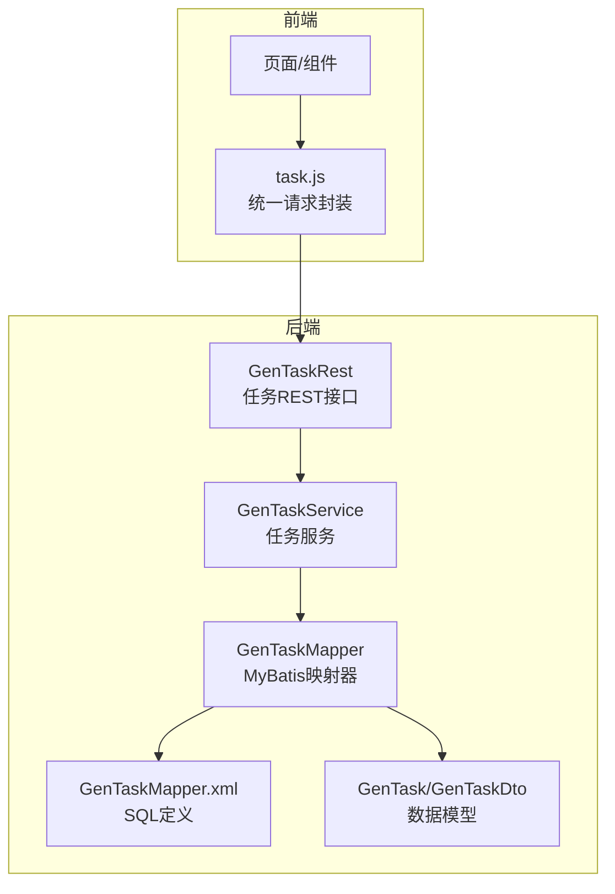
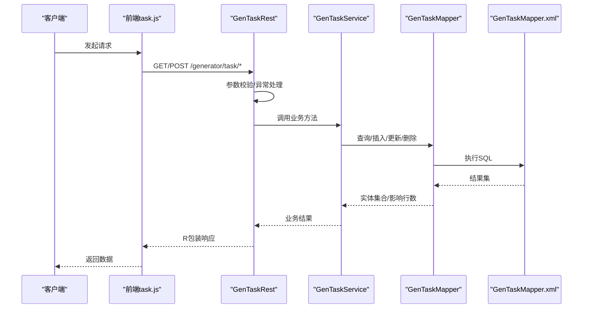
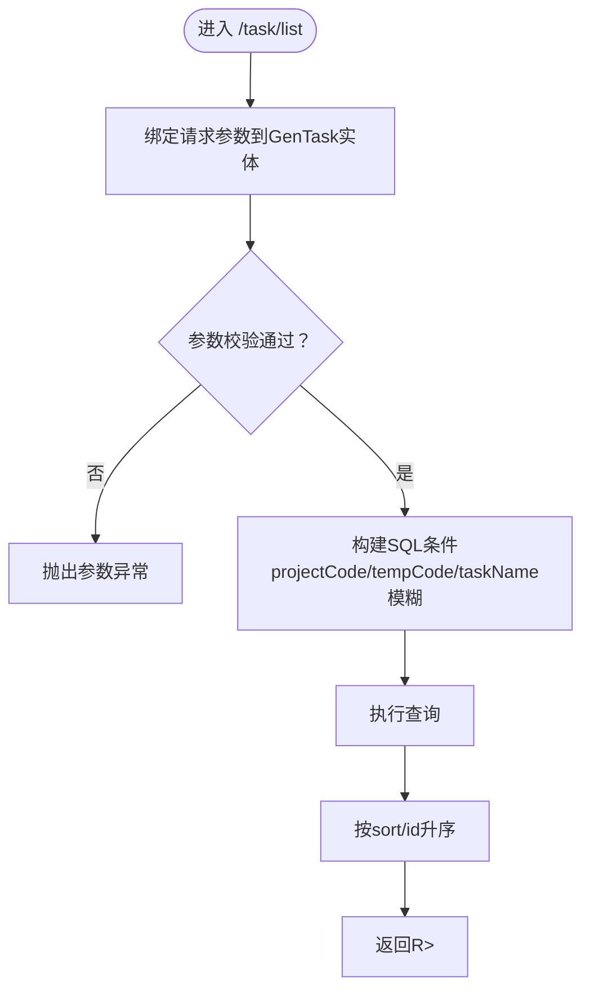
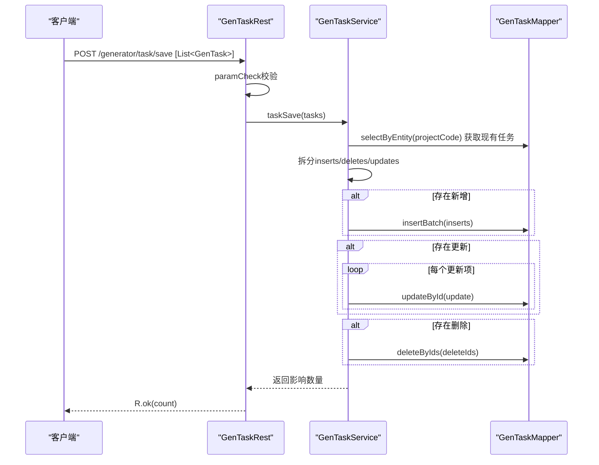
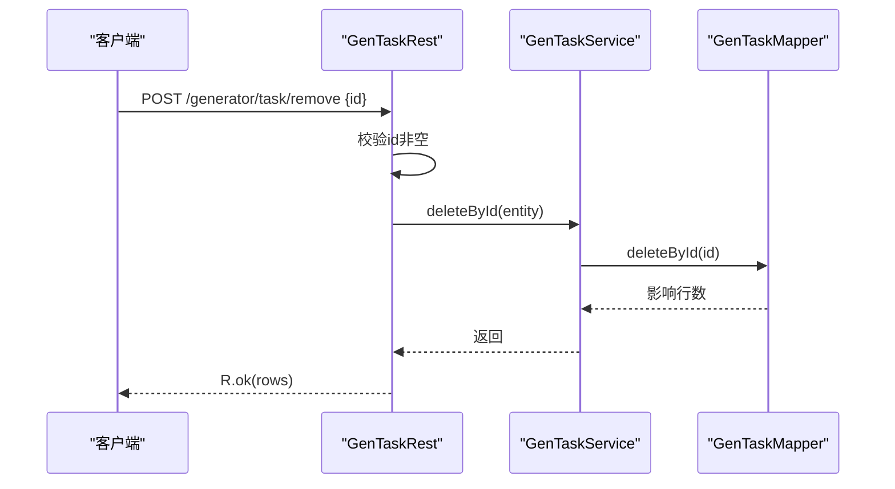
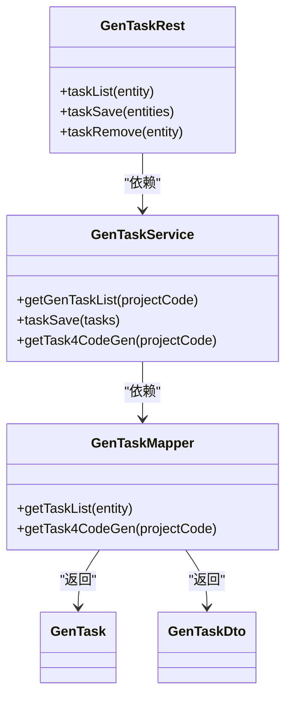

# 任务调度API

<cite>
**本文引用的文件**
- [GenTaskRest.java](file://generator-server/src/main/java/com/wkclz/generator/server/rest/GenTaskRest.java)
- [GenTaskService.java](file://generator-server/src/main/java/com/wkclz/generator/server/service/GenTaskService.java)
- [GenTaskMapper.java](file://generator-server/src/main/java/com/wkclz/generator/server/mapper/GenTaskMapper.java)
- [GenTaskMapper.xml](file://generator-server/src/main/resources/mapper/GenTaskMapper.xml)
- [GenTask.java](file://generator-server/src/main/java/com/wkclz/generator/server/bean/entity/GenTask.java)
- [GenTaskDto.java](file://generator-server/src/main/java/com/wkclz/generator/server/bean/dto/GenTaskDto.java)
- [Route.java](file://generator-server/src/main/java/com/wkclz/generator/server/Route.java)
- [task.js](file://generator-ui/src/api/task.js)
- [GenService.java](file://generator-server/src/main/java/com/wkclz/generator/server/service/GenService.java)
</cite>

## 目录
1. [简介](#简介)
2. [项目结构](#项目结构)
3. [核心组件](#核心组件)
4. [架构总览](#架构总览)
5. [详细组件分析](#详细组件分析)
6. [依赖关系分析](#依赖关系分析)
7. [性能考量](#性能考量)
8. [故障排查指南](#故障排查指南)
9. [结论](#结论)
10. [附录：API调用示例与错误处理](#附录api调用示例与错误处理)

## 简介
本文件面向SH-Generator的任务调度API，系统性梳理任务列表查询、筛选条件、保存与更新、删除与批量操作、状态监控与进度查询、调度规则配置与定时执行等能力，并提供调用示例与错误处理策略。该系统采用前后端分离架构，后端基于Spring Boot + MyBatis，前端通过统一请求封装对接后端路由。

## 项目结构
围绕任务调度API的关键模块如下：
- 控制层：任务REST接口，负责接收请求、参数校验与返回结果包装
- 服务层：任务业务逻辑，包括列表查询、保存合并（新增/更新/删除）、按项目导出规则等
- 数据访问层：MyBatis映射器，提供SQL查询与聚合
- 数据模型：实体与DTO，承载任务元数据与导出规则所需字段
- 前端API封装：统一的HTTP请求方法，便于在页面中直接调用

图表来源
- [GenTaskRest.java:1-75](file://generator-server/src/main/java/com/wkclz/generator/server/rest/GenTaskRest.java#L1-L75)
- [GenTaskService.java:1-114](file://generator-server/src/main/java/com/wkclz/generator/server/service/GenTaskService.java#L1-L114)
- [GenTaskMapper.java:1-20](file://generator-server/src/main/java/com/wkclz/generator/server/mapper/GenTaskMapper.java#L1-L20)
- [GenTaskMapper.xml:1-62](file://generator-server/src/main/resources/mapper/GenTaskMapper.xml#L1-L62)
- [GenTask.java:1-124](file://generator-server/src/main/java/com/wkclz/generator/server/bean/entity/GenTask.java#L1-L124)
- [GenTaskDto.java:1-38](file://generator-server/src/main/java/com/wkclz/generator/server/bean/dto/GenTaskDto.java#L1-L38)
- [task.js:1-13](file://generator-ui/src/api/task.js#L1-L13)

章节来源
- [GenTaskRest.java:1-75](file://generator-server/src/main/java/com/wkclz/generator/server/rest/GenTaskRest.java#L1-L75)
- [GenTaskService.java:1-114](file://generator-server/src/main/java/com/wkclz/generator/server/service/GenTaskService.java#L1-L114)
- [GenTaskMapper.java:1-20](file://generator-server/src/main/java/com/wkclz/generator/server/mapper/GenTaskMapper.java#L1-L20)
- [GenTaskMapper.xml:1-62](file://generator-server/src/main/resources/mapper/GenTaskMapper.xml#L1-L62)
- [GenTask.java:1-124](file://generator-server/src/main/java/com/wkclz/generator/server/bean/entity/GenTask.java#L1-L124)
- [GenTaskDto.java:1-38](file://generator-server/src/main/java/com/wkclz/generator/server/bean/dto/GenTaskDto.java#L1-L38)
- [task.js:1-13](file://generator-ui/src/api/task.js#L1-L13)

## 核心组件
- 任务REST接口：提供任务列表查询、批量保存、单条删除等能力；内置参数校验与异常处理
- 任务服务：实现“全量替换式”的保存策略（新增、更新、删除同步），并支持按项目导出规则查询
- 任务映射器与XML：定义列表查询、模糊匹配、排序、以及导出规则查询的SQL
- 任务实体与DTO：承载任务元数据（用户、项目、模板、开关、路径、描述等）及导出规则所需字段
- 前端API封装：统一暴露GET/POST方法，便于页面直接调用

章节来源
- [GenTaskRest.java:25-71](file://generator-server/src/main/java/com/wkclz/generator/server/rest/GenTaskRest.java#L25-L71)
- [GenTaskService.java:20-110](file://generator-server/src/main/java/com/wkclz/generator/server/service/GenTaskService.java#L20-L110)
- [GenTaskMapper.java:14-16](file://generator-server/src/main/java/com/wkclz/generator/server/mapper/GenTaskMapper.java#L14-L16)
- [GenTaskMapper.xml:5-58](file://generator-server/src/main/resources/mapper/GenTaskMapper.xml#L5-L58)
- [GenTask.java:21-96](file://generator-server/src/main/java/com/wkclz/generator/server/bean/entity/GenTask.java#L21-L96)
- [GenTaskDto.java:15-36](file://generator-server/src/main/java/com/wkclz/generator/server/bean/dto/GenTaskDto.java#L15-L36)
- [task.js:4-12](file://generator-ui/src/api/task.js#L4-L12)

## 架构总览
任务调度API遵循经典的三层架构：控制层负责协议与参数，服务层负责业务编排，持久层负责数据读写。前端通过统一请求封装调用后端路由，后端通过映射器执行SQL，最终返回R包装的结果。

图表来源
- [GenTaskRest.java:25-71](file://generator-server/src/main/java/com/wkclz/generator/server/rest/GenTaskRest.java#L25-L71)
- [GenTaskService.java:20-110](file://generator-server/src/main/java/com/wkclz/generator/server/service/GenTaskService.java#L20-L110)
- [GenTaskMapper.java:14-16](file://generator-server/src/main/java/com/wkclz/generator/server/mapper/GenTaskMapper.java#L14-L16)
- [GenTaskMapper.xml:5-58](file://generator-server/src/main/resources/mapper/GenTaskMapper.xml#L5-L58)

## 详细组件分析

### 任务列表查询与筛选
- 接口路径：GET /generator/task/list
- 请求参数：GenTask实体（支持userCode、projectCode、tempCode、taskName模糊匹配）
- SQL行为：按项目过滤，支持多条件动态拼接，模糊匹配任务名称，按sort与id升序
- 返回值：R包装的列表，包含任务基础信息

图表来源
- [GenTaskRest.java:25-30](file://generator-server/src/main/java/com/wkclz/generator/server/rest/GenTaskRest.java#L25-L30)
- [GenTaskMapper.xml:26-35](file://generator-server/src/main/resources/mapper/GenTaskMapper.xml#L26-L35)

章节来源
- [Route.java:57-57](file://generator-server/src/main/java/com/wkclz/generator/server/Route.java#L57-L57)
- [GenTaskRest.java:25-30](file://generator-server/src/main/java/com/wkclz/generator/server/rest/GenTaskRest.java#L25-L30)
- [GenTaskMapper.xml:5-35](file://generator-server/src/main/resources/mapper/GenTaskMapper.xml#L5-L35)

### 任务保存与更新（批量）
- 接口路径：POST /generator/task/save
- 请求体：List<GenTask>
- 保存策略：全量替换式
  - 读取当前项目下已存在的任务集合
  - 对比前端传入的任务集合，拆分为新增、删除、更新三类
  - 分别执行批量插入、逐条更新、按主键批量删除
- 参数校验：
  - 非空校验：任务列表非空、每个任务必须包含projectCode、taskName、tempCode
  - 一致性校验：同一请求仅允许一个项目编码；每个模板编码唯一
  - 新增时自动填充用户编码（从会话上下文）

图表来源
- [GenTaskRest.java:32-71](file://generator-server/src/main/java/com/wkclz/generator/server/rest/GenTaskRest.java#L32-L71)
- [GenTaskService.java:27-105](file://generator-server/src/main/java/com/wkclz/generator/server/service/GenTaskService.java#L27-L105)
- [GenTaskMapper.java:14-16](file://generator-server/src/main/java/com/wkclz/generator/server/mapper/GenTaskMapper.java#L14-L16)

章节来源
- [GenTaskRest.java:32-71](file://generator-server/src/main/java/com/wkclz/generator/server/rest/GenTaskRest.java#L32-L71)
- [GenTaskService.java:27-105](file://generator-server/src/main/java/com/wkclz/generator/server/service/GenTaskService.java#L27-L105)

### 任务删除与批量操作
- 单条删除接口：POST /generator/task/remove
- 请求体：GenTask（需包含id）
- 服务层：根据id删除，返回受影响行数
- 注意：批量删除以“多条删除请求”方式实现，即多次调用单条删除接口

图表来源
- [GenTaskRest.java:39-44](file://generator-server/src/main/java/com/wkclz/generator/server/rest/GenTaskRest.java#L39-L44)
- [GenTaskService.java:27-105](file://generator-server/src/main/java/com/wkclz/generator/server/service/GenTaskService.java#L27-L105)

章节来源
- [Route.java:61-61](file://generator-server/src/main/java/com/wkclz/generator/server/Route.java#L61-L61)
- [GenTaskRest.java:39-44](file://generator-server/src/main/java/com/wkclz/generator/server/rest/GenTaskRest.java#L39-L44)

### 任务状态监控与进度查询
- 当前实现：后端未提供专门的状态监控与进度查询接口
- 代码生成流程中的日志记录：
  - 生成开始与结束时间记录于GenLog
  - 可通过日志接口进行查询与展示
- 建议：如需实时进度，可在服务层引入任务状态表与进度队列，并在生成流程中写入进度事件

章节来源
- [GenService.java:72-90](file://generator-server/src/main/java/com/wkclz/generator/server/service/GenService.java#L72-L90)

### 调度规则配置与定时执行
- 规则配置：任务实体包含createSwitch、deleteSwitch、projectBasePath、packagePath、sort等字段，用于控制生成行为与顺序
- 定时执行：当前未发现定时调度实现
- 建议：结合任务规则与外部调度框架（如Quartz或Spring Scheduled），按任务排序与开关状态定时触发生成

章节来源
- [GenTask.java:48-73](file://generator-server/src/main/java/com/wkclz/generator/server/bean/entity/GenTask.java#L48-L73)
- [GenTaskMapper.xml:38-58](file://generator-server/src/main/resources/mapper/GenTaskMapper.xml#L38-L58)

## 依赖关系分析
- 控制层依赖服务层；服务层依赖映射器；映射器依赖XML SQL；实体与DTO作为数据载体贯穿各层
- 前端通过task.js封装统一调用后端路由

图表来源
- [GenTaskRest.java:1-75](file://generator-server/src/main/java/com/wkclz/generator/server/rest/GenTaskRest.java#L1-L75)
- [GenTaskService.java:1-114](file://generator-server/src/main/java/com/wkclz/generator/server/service/GenTaskService.java#L1-L114)
- [GenTaskMapper.java:1-20](file://generator-server/src/main/java/com/wkclz/generator/server/mapper/GenTaskMapper.java#L1-L20)
- [GenTask.java:1-124](file://generator-server/src/main/java/com/wkclz/generator/server/bean/entity/GenTask.java#L1-L124)
- [GenTaskDto.java:1-38](file://generator-server/src/main/java/com/wkclz/generator/server/bean/dto/GenTaskDto.java#L1-L38)

## 性能考量
- 批量操作：服务层对新增、更新、删除分别执行批量/逐条操作，避免重复扫描
- SQL优化：列表查询支持多条件动态拼接与排序，建议在projectCode、tempCode上建立索引
- 内存占用：全量替换策略在任务规模较大时可能产生较多中间集合，建议限制单次提交任务数量

## 故障排查指南
- 参数校验异常
  - 任务列表为空、缺少必要字段、跨项目/模板冲突
  - 建议：前端在提交前进行字段校验，后端抛出ValidationException
- 主键缺失异常
  - 更新场景缺少id或版本号
  - 建议：确保编辑态携带id，避免误判为新增
- 数据库异常
  - 插入/更新/删除失败通常由唯一约束或外键约束导致
  - 建议：检查项目编码、模板编码、用户编码的一致性
- 前端调用问题
  - 确认请求URL与方法正确，参数命名与后端一致

章节来源
- [GenTaskRest.java:47-71](file://generator-server/src/main/java/com/wkclz/generator/server/rest/GenTaskRest.java#L47-L71)
- [GenTaskService.java:27-105](file://generator-server/src/main/java/com/wkclz/generator/server/service/GenTaskService.java#L27-L105)

## 结论
任务调度API提供了完整的任务生命周期管理能力：列表查询与筛选、批量保存与更新、单条删除。服务层采用“全量替换式”策略，确保前后端任务集合一致性。当前未提供专门的状态监控与定时执行接口，建议后续扩展以满足复杂场景需求。

## 附录：API调用示例与错误处理

- 任务列表查询
  - 方法：GET
  - 路径：/generator/task/list
  - 参数：projectCode（必填），userCode（可选），tempCode（可选），taskName（可选，模糊匹配）
  - 返回：R<List<GenTask>>
  - 前端封装参考：[task.js:4-6](file://generator-ui/src/api/task.js#L4-L6)

- 任务保存（批量）
  - 方法：POST
  - 路径：/generator/task/save
  - 请求体：List<GenTask>（每项需包含projectCode、taskName、tempCode；新增时自动填充用户编码）
  - 返回：R<Integer>（影响的任务数量）
  - 前端封装参考：[task.js:9-11](file://generator-ui/src/api/task.js#L9-L11)

- 任务删除
  - 方法：POST
  - 路径：/generator/task/remove
  - 请求体：GenTask（需包含id）
  - 返回：R<Integer>（受影响行数）

- 错误处理策略
  - 参数校验：使用断言与自定义验证异常，明确提示缺失字段
  - 主键校验：更新场景要求id与版本信息
  - 数据一致性：跨项目/模板唯一性校验，避免脏数据
  - 前端建议：在提交前进行字段与格式校验，减少无效请求

章节来源
- [Route.java:57-61](file://generator-server/src/main/java/com/wkclz/generator/server/Route.java#L57-L61)
- [GenTaskRest.java:25-71](file://generator-server/src/main/java/com/wkclz/generator/server/rest/GenTaskRest.java#L25-L71)
- [task.js:4-12](file://generator-ui/src/api/task.js#L4-L12)