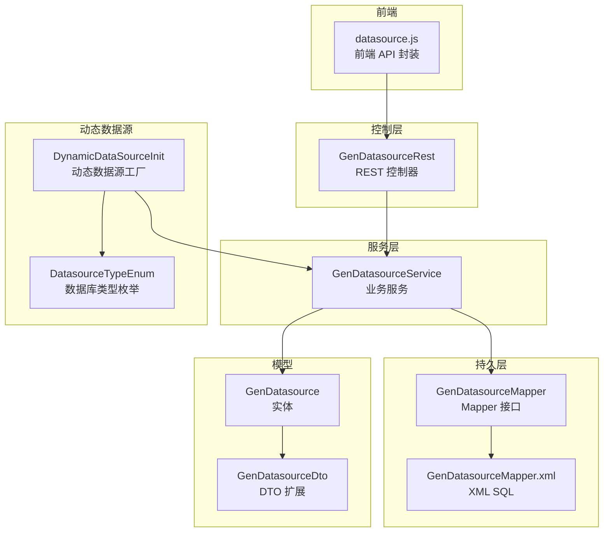
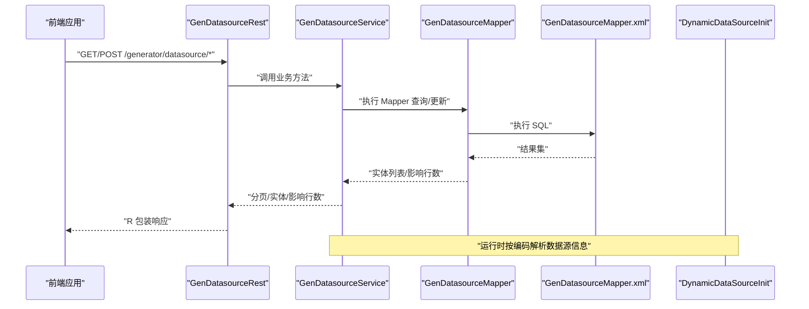
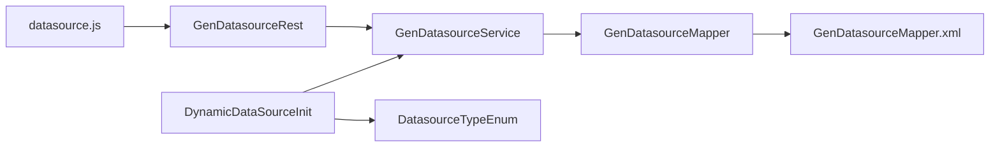
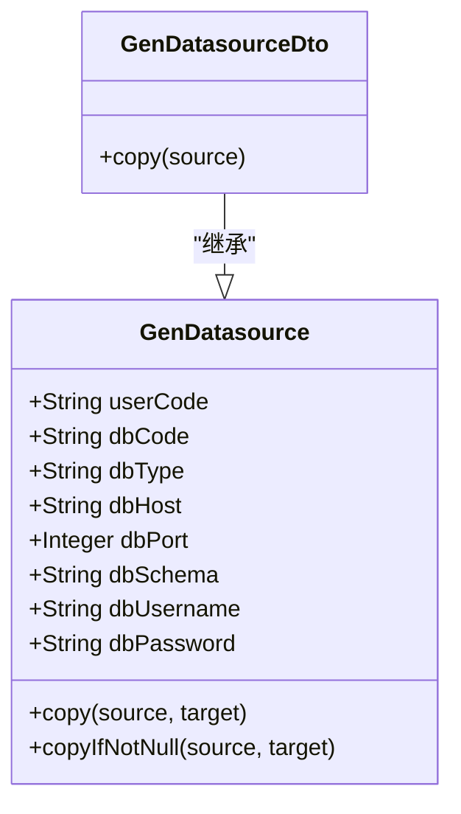
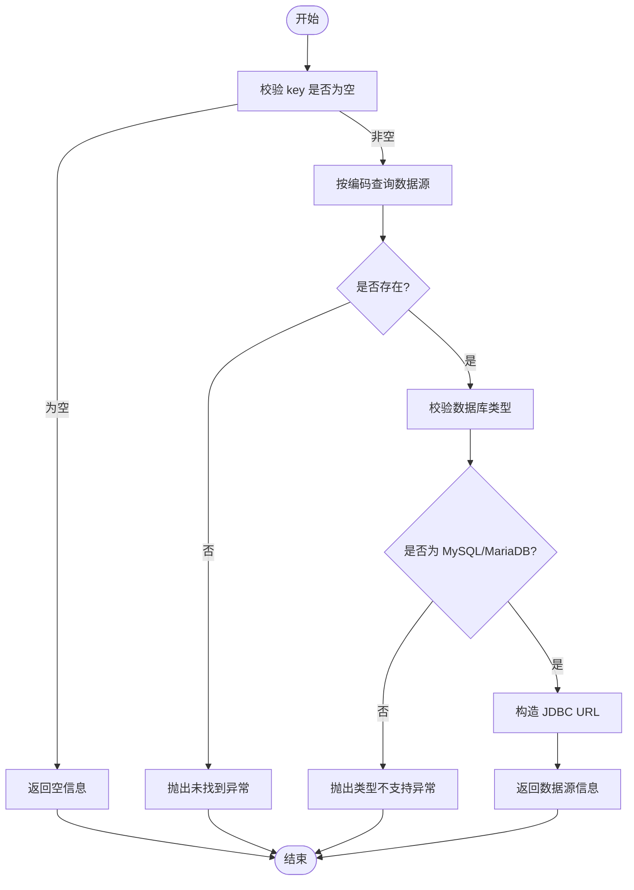

# 数据源管理API

<cite>
**本文引用的文件**
- [GenDatasourceRest.java](file://generator-server/src/main/java/com/wkclz/generator/server/rest/GenDatasourceRest.java)
- [GenDatasourceService.java](file://generator-server/src/main/java/com/wkclz/generator/server/service/GenDatasourceService.java)
- [GenDatasourceMapper.java](file://generator-server/src/main/java/com/wkclz/generator/server/mapper/GenDatasourceMapper.java)
- [GenDatasourceMapper.xml](file://generator-server/src/main/resources/mapper/GenDatasourceMapper.xml)
- [GenDatasource.java](file://generator-server/src/main/java/com/wkclz/generator/server/bean/entity/GenDatasource.java)
- [GenDatasourceDto.java](file://generator-server/src/main/java/com/wkclz/generator/server/bean/dto/GenDatasourceDto.java)
- [Route.java](file://generator-server/src/main/java/com/wkclz/generator/server/Route.java)
- [DynamicDataSourceInit.java](file://generator-server/src/main/java/com/wkclz/generator/server/helper/DynamicDataSourceInit.java)
- [DatasourceTypeEnum.java](file://generator-server/src/main/java/com/wkclz/generator/server/bean/enums/DatasourceTypeEnum.java)
- [datasource.js](file://generator-ui/src/api/datasource.js)
</cite>

## 目录
1. [简介](#简介)
2. [项目结构](#项目结构)
3. [核心组件](#核心组件)
4. [架构总览](#架构总览)
5. [详细组件分析](#详细组件分析)
6. [依赖分析](#依赖分析)
7. [性能考虑](#性能考虑)
8. [故障排查指南](#故障排查指南)
9. [结论](#结论)
10. [附录](#附录)

## 简介
本文件面向 SH-Generator 的“数据源管理 API”，系统性梳理数据源的 CRUD 接口、分页查询与参数校验、动态数据源解析与连接能力，并给出前后端对接示例与集成指引。当前实现聚焦 MySQL/MariaDB 类型的数据源动态加载，其他类型数据库暂未开放。

## 项目结构
围绕数据源管理的关键模块分布如下：
- 控制层：REST 接口定义与路由映射
- 服务层：业务逻辑、参数校验、分页封装
- 持久层：MyBatis 映射器与 XML SQL
- 实体与 DTO：数据模型与转换
- 动态数据源：运行时按编码解析真实数据源
- 前端 API 封装：统一请求方法

图表来源
- [GenDatasourceRest.java:1-83](file://generator-server/src/main/java/com/wkclz/generator/server/rest/GenDatasourceRest.java#L1-L83)
- [GenDatasourceService.java:1-59](file://generator-server/src/main/java/com/wkclz/generator/server/service/GenDatasourceService.java#L1-L59)
- [GenDatasourceMapper.java:1-17](file://generator-server/src/main/java/com/wkclz/generator/server/mapper/GenDatasourceMapper.java#L1-L17)
- [GenDatasourceMapper.xml:1-59](file://generator-server/src/main/resources/mapper/GenDatasourceMapper.xml#L1-L59)
- [GenDatasource.java:1-116](file://generator-server/src/main/java/com/wkclz/generator/server/bean/entity/GenDatasource.java#L1-L116)
- [GenDatasourceDto.java:1-32](file://generator-server/src/main/java/com/wkclz/generator/server/bean/dto/GenDatasourceDto.java#L1-L32)
- [DynamicDataSourceInit.java:1-61](file://generator-server/src/main/java/com/wkclz/generator/server/helper/DynamicDataSourceInit.java#L1-L61)
- [DatasourceTypeEnum.java:1-57](file://generator-server/src/main/java/com/wkclz/generator/server/bean/enums/DatasourceTypeEnum.java#L1-L57)
- [datasource.js:1-33](file://generator-ui/src/api/datasource.js#L1-L33)

章节来源
- [Route.java:1-89](file://generator-server/src/main/java/com/wkclz/generator/server/Route.java#L1-L89)

## 核心组件
- REST 控制器：提供数据源分页、详情、新增、修改、删除、选项等接口；内置参数校验与敏感字段脱敏返回。
- 服务层：封装分页查询、选项查询、新增/修改、按编码获取数据源；修改时保留密码字段（避免覆盖）。
- 持久层：基于 MyBatis 的通用 Mapper，提供列表与选项查询 SQL。
- 实体与 DTO：定义数据源字段与拷贝工具方法。
- 动态数据源：根据数据源编码解析真实数据源信息，限定 MySQL/MariaDB 类型。

章节来源
- [GenDatasourceRest.java:1-83](file://generator-server/src/main/java/com/wkclz/generator/server/rest/GenDatasourceRest.java#L1-L83)
- [GenDatasourceService.java:1-59](file://generator-server/src/main/java/com/wkclz/generator/server/service/GenDatasourceService.java#L1-L59)
- [GenDatasourceMapper.java:1-17](file://generator-server/src/main/java/com/wkclz/generator/server/mapper/GenDatasourceMapper.java#L1-L17)
- [GenDatasourceMapper.xml:1-59](file://generator-server/src/main/resources/mapper/GenDatasourceMapper.xml#L1-L59)
- [GenDatasource.java:1-116](file://generator-server/src/main/java/com/wkclz/generator/server/bean/entity/GenDatasource.java#L1-L116)
- [GenDatasourceDto.java:1-32](file://generator-server/src/main/java/com/wkclz/generator/server/bean/dto/GenDatasourceDto.java#L1-L32)
- [DynamicDataSourceInit.java:1-61](file://generator-server/src/main/java/com/wkclz/generator/server/helper/DynamicDataSourceInit.java#L1-L61)
- [DatasourceTypeEnum.java:1-57](file://generator-server/src/main/java/com/wkclz/generator/server/bean/enums/DatasourceTypeEnum.java#L1-L57)

## 架构总览
数据源管理 API 的调用链路如下：

图表来源
- [GenDatasourceRest.java:1-83](file://generator-server/src/main/java/com/wkclz/generator/server/rest/GenDatasourceRest.java#L1-L83)
- [GenDatasourceService.java:1-59](file://generator-server/src/main/java/com/wkclz/generator/server/service/GenDatasourceService.java#L1-L59)
- [GenDatasourceMapper.java:1-17](file://generator-server/src/main/java/com/wkclz/generator/server/mapper/GenDatasourceMapper.java#L1-L17)
- [GenDatasourceMapper.xml:1-59](file://generator-server/src/main/resources/mapper/GenDatasourceMapper.xml#L1-L59)
- [DynamicDataSourceInit.java:1-61](file://generator-server/src/main/java/com/wkclz/generator/server/helper/DynamicDataSourceInit.java#L1-L61)

## 详细组件分析

### REST 控制器：数据源接口
- 分页查询：GET /generator/datasource/page，返回分页包装对象。
- 详情查询：GET /generator/datasource/detail，返回实体并清除敏感字段。
- 新增：POST /generator/datasource/create，参数校验后入库。
- 修改：POST /generator/datasource/update，参数校验后更新，保留原密码。
- 删除：POST /generator/datasource/remove，校验主键后删除。
- 选项查询：GET /generator/datasource/options，返回可选数据源列表。

参数校验要点：
- 新增时设置用户编码并校验必填字段。
- 修改时校验编码、主键、版本号与必填字段。
- 详情与删除均要求主键非空。

章节来源
- [GenDatasourceRest.java:24-81](file://generator-server/src/main/java/com/wkclz/generator/server/rest/GenDatasourceRest.java#L24-L81)
- [Route.java:14-25](file://generator-server/src/main/java/com/wkclz/generator/server/Route.java#L14-L25)

### 服务层：业务逻辑与分页
- 分页查询：基于 PageQuery.page 封装分页结果。
- 选项查询：返回可用数据源集合。
- 新增/删除：委托基础服务完成插入与删除。
- 修改：先查询存在性，再进行选择性属性拷贝，避免覆盖密码字段。
- 按编码获取：校验编码非空，查询单条记录，不存在抛出校验异常。

章节来源
- [GenDatasourceService.java:19-54](file://generator-server/src/main/java/com/wkclz/generator/server/service/GenDatasourceService.java#L19-L54)

### 持久层：SQL 与条件查询
- 列表查询：支持按编码、类型、主机、模式、用户编码模糊/精确过滤，排序规则固定。
- 选项查询：返回必要字段集合，支持按类型与用户编码过滤。
- SQL 片段：使用 MyBatis 动态标签拼接条件，避免冗余查询。

章节来源
- [GenDatasourceMapper.java:12-14](file://generator-server/src/main/java/com/wkclz/generator/server/mapper/GenDatasourceMapper.java#L12-L14)
- [GenDatasourceMapper.xml:5-55](file://generator-server/src/main/resources/mapper/GenDatasourceMapper.xml#L5-L55)

### 实体与 DTO：数据模型
- 实体 GenDatasource：定义用户编码、数据源编码、数据库类型、主机、端口、模式、用户名、密码等字段及拷贝工具。
- DTO GenDatasourceDto：继承实体，提供实体到 DTO 的拷贝方法，便于扩展。

章节来源
- [GenDatasource.java:24-67](file://generator-server/src/main/java/com/wkclz/generator/server/bean/entity/GenDatasource.java#L24-L67)
- [GenDatasourceDto.java:25-29](file://generator-server/src/main/java/com/wkclz/generator/server/bean/dto/GenDatasourceDto.java#L25-L29)

### 动态数据源：运行时解析
- 工厂接口实现：根据数据源编码加载 GenDatasource，校验类型是否为 MySQL 或 MariaDB。
- JDBC URL 构造：基于主机、端口、模式拼接标准 MySQL 连接串。
- 凭据处理：用户名与密码直接取自实体，注释部分预留加密解密逻辑。

章节来源
- [DynamicDataSourceInit.java:24-57](file://generator-server/src/main/java/com/wkclz/generator/server/helper/DynamicDataSourceInit.java#L24-L57)
- [DatasourceTypeEnum.java:15-24](file://generator-server/src/main/java/com/wkclz/generator/server/bean/enums/DatasourceTypeEnum.java#L15-L24)

### 前端 API 封装
- 提供新增、分页、修改、详情、删除、选项六个方法，统一使用相对路径与请求封装库。

章节来源
- [datasource.js:4-31](file://generator-ui/src/api/datasource.js#L4-L31)

## 依赖分析
- 控制器依赖服务层，服务层依赖 Mapper，Mapper 依赖 XML SQL。
- 动态数据源工厂依赖服务层以按编码查询数据源，并依赖枚举类型进行类型校验。
- 前端 API 封装依赖控制器暴露的路由。

图表来源
- [GenDatasourceRest.java:1-83](file://generator-server/src/main/java/com/wkclz/generator/server/rest/GenDatasourceRest.java#L1-L83)
- [GenDatasourceService.java:1-59](file://generator-server/src/main/java/com/wkclz/generator/server/service/GenDatasourceService.java#L1-L59)
- [GenDatasourceMapper.java:1-17](file://generator-server/src/main/java/com/wkclz/generator/server/mapper/GenDatasourceMapper.java#L1-L17)
- [GenDatasourceMapper.xml:1-59](file://generator-server/src/main/resources/mapper/GenDatasourceMapper.xml#L1-L59)
- [DynamicDataSourceInit.java:1-61](file://generator-server/src/main/java/com/wkclz/generator/server/helper/DynamicDataSourceInit.java#L1-L61)
- [DatasourceTypeEnum.java:1-57](file://generator-server/src/main/java/com/wkclz/generator/server/bean/enums/DatasourceTypeEnum.java#L1-L57)
- [datasource.js:1-33](file://generator-ui/src/api/datasource.js#L1-L33)

## 性能考虑
- 分页查询：服务层使用 PageQuery.page 封装，SQL 使用固定排序字段，有利于索引利用与分页稳定。
- 条件过滤：XML 中采用动态标签拼接条件，建议在高频查询字段上建立合适索引（如 db_code、db_type、user_code）。
- 敏感字段处理：详情返回前清空密码字段，避免在响应中泄露。
- 动态数据源：按编码解析一次，建议在业务侧缓存常用数据源信息，减少重复查询。

章节来源
- [GenDatasourceService.java:19-25](file://generator-server/src/main/java/com/wkclz/generator/server/service/GenDatasourceService.java#L19-L25)
- [GenDatasourceRest.java:34-35](file://generator-server/src/main/java/com/wkclz/generator/server/rest/GenDatasourceRest.java#L34-L35)
- [GenDatasourceMapper.xml:24-34](file://generator-server/src/main/resources/mapper/GenDatasourceMapper.xml#L24-L34)

## 故障排查指南
- 参数缺失：新增/修改时若缺少必填字段，将触发参数校验异常；请检查请求体字段完整性。
- 主键缺失：详情/删除接口要求 id 非空，否则返回参数错误。
- 数据不存在：修改时若目标数据源不存在，将抛出校验异常；请确认 id 与版本号。
- 编码错误：按编码获取数据源时若不存在，将提示编码错误。
- 类型不支持：动态数据源工厂仅支持 MySQL/MariaDB，其他类型将被拒绝。
- 响应格式：所有接口返回统一封装对象，前端可依据 code/msg 判断结果。

章节来源
- [GenDatasourceRest.java:67-81](file://generator-server/src/main/java/com/wkclz/generator/server/rest/GenDatasourceRest.java#L67-L81)
- [GenDatasourceService.java:32-53](file://generator-server/src/main/java/com/wkclz/generator/server/service/GenDatasourceService.java#L32-L53)
- [DynamicDataSourceInit.java:34-40](file://generator-server/src/main/java/com/wkclz/generator/server/helper/DynamicDataSourceInit.java#L34-L40)

## 结论
数据源管理 API 采用清晰的分层架构，REST 控制器负责接口与参数校验，服务层封装业务与分页，持久层提供灵活的条件查询。动态数据源工厂确保运行时可按编码解析真实数据源，当前支持 MySQL/MariaDB。建议在生产环境中结合索引优化与缓存策略提升性能，并严格遵循参数校验与错误码约定。

## 附录

### 接口定义与调用示例

- 分页查询
  - 方法：GET
  - 路径：/generator/datasource/page
  - 请求参数：支持按编码、类型、主机、模式、用户编码过滤
  - 返回：分页包装对象
  - 前端封装：[datasourcePage:9-11](file://generator-ui/src/api/datasource.js#L9-L11)

- 详情查询
  - 方法：GET
  - 路径：/generator/datasource/detail
  - 请求参数：id（必填）
  - 返回：实体（密码字段已清理）
  - 前端封装：[datasourceDetail:18-21](file://generator-ui/src/api/datasource.js#L18-L21)

- 新增
  - 方法：POST
  - 路径：/generator/datasource/create
  - 请求体：实体（含 dbType/dbHost/dbPort/dbSchema/dbUsername/dbPassword 等）
  - 返回：影响行数
  - 前端封装：[datasourceCreate:3-6](file://generator-ui/src/api/datasource.js#L3-L6)

- 修改
  - 方法：POST
  - 路径：/generator/datasource/update
  - 请求体：实体（含 id/version/dbCode 等）
  - 返回：影响行数
  - 前端封装：[datasourceUpdate:13-16](file://generator-ui/src/api/datasource.js#L13-L16)

- 删除
  - 方法：POST
  - 路径：/generator/datasource/remove
  - 请求体：实体（含 id）
  - 返回：影响行数
  - 前端封装：[datasourceRemove:23-26](file://generator-ui/src/api/datasource.js#L23-L26)

- 选项查询
  - 方法：GET
  - 路径：/generator/datasource/options
  - 请求参数：可选类型与用户编码
  - 返回：数据源选项列表
  - 前端封装：[datasourceOptions:28-31](file://generator-ui/src/api/datasource.js#L28-L31)

章节来源
- [Route.java:14-25](file://generator-server/src/main/java/com/wkclz/generator/server/Route.java#L14-L25)
- [datasource.js:3-31](file://generator-ui/src/api/datasource.js#L3-L31)

### 数据模型类图

图表来源
- [GenDatasource.java:19-116](file://generator-server/src/main/java/com/wkclz/generator/server/bean/entity/GenDatasource.java#L19-L116)
- [GenDatasourceDto.java:15-30](file://generator-server/src/main/java/com/wkclz/generator/server/bean/dto/GenDatasourceDto.java#L15-L30)

### 动态数据源流程图

图表来源
- [DynamicDataSourceInit.java:24-57](file://generator-server/src/main/java/com/wkclz/generator/server/helper/DynamicDataSourceInit.java#L24-L57)
- [DatasourceTypeEnum.java:15-24](file://generator-server/src/main/java/com/wkclz/generator/server/bean/enums/DatasourceTypeEnum.java#L15-L24)