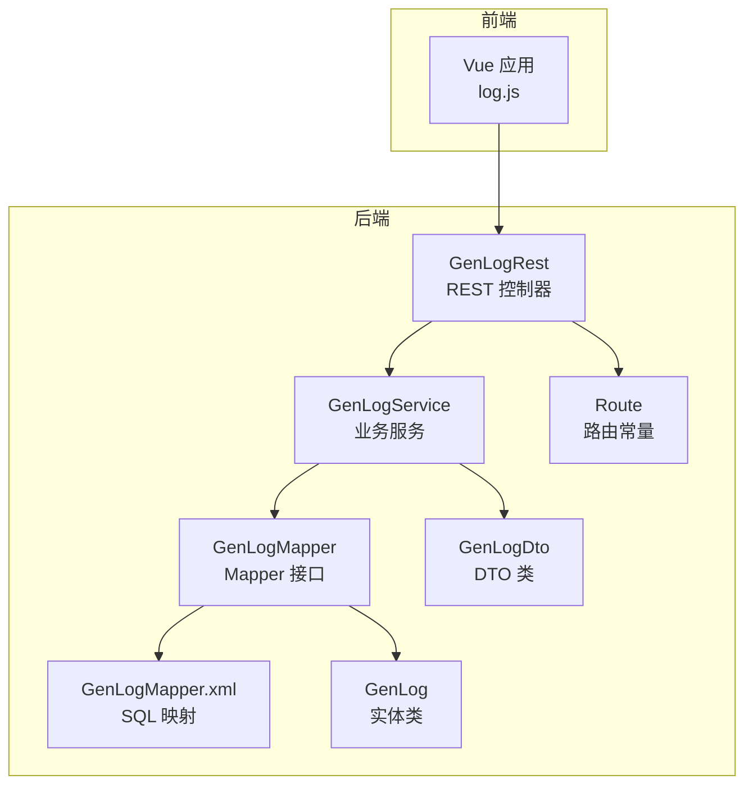
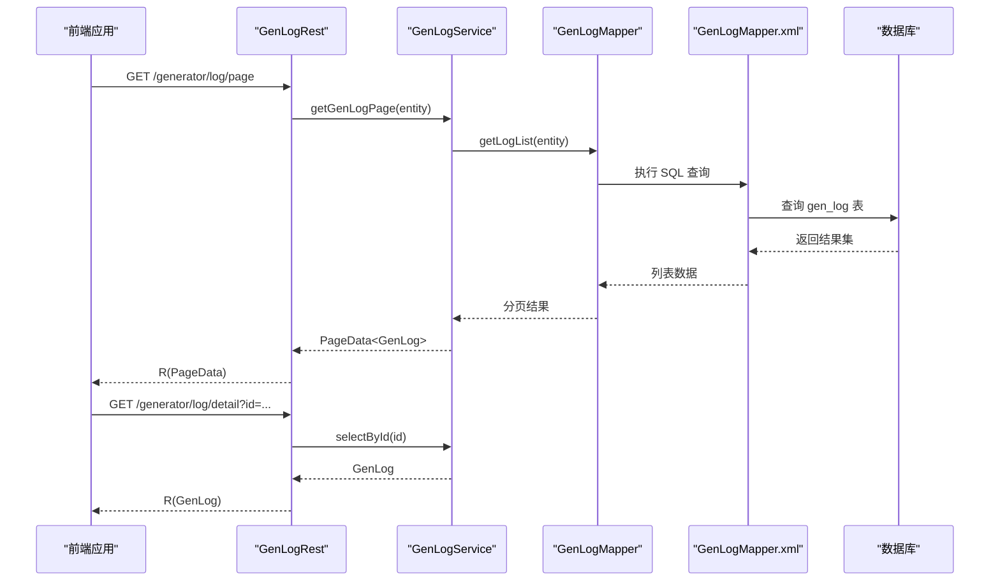
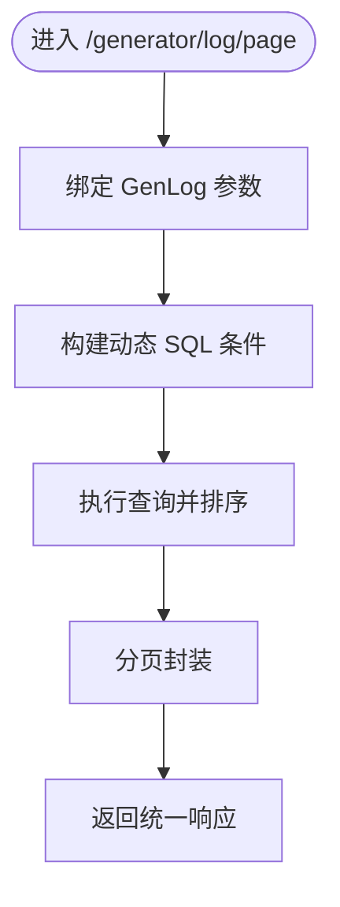
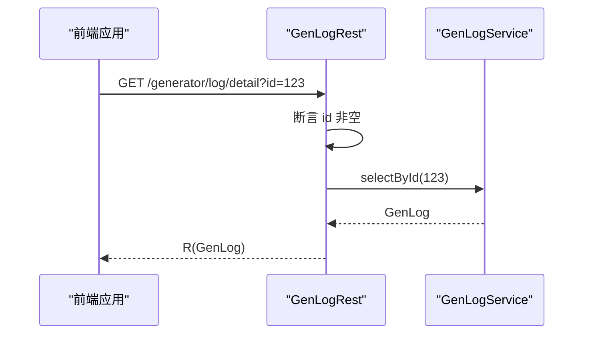
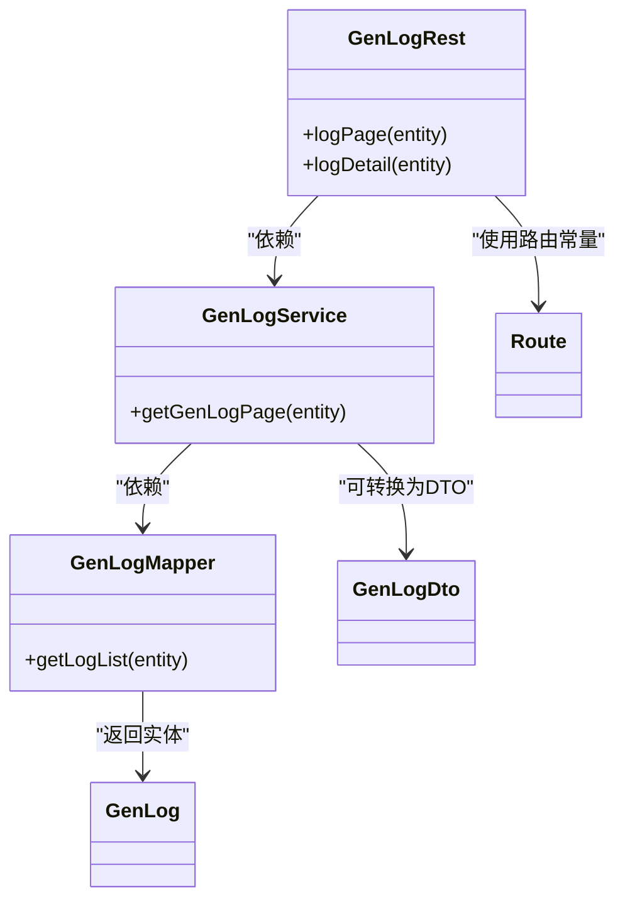

# 日志管理API

<cite>
**本文引用的文件**
- [GenLogRest.java](file://generator-server/src/main/java/com/wkclz/generator/server/rest/GenLogRest.java)
- [GenLogService.java](file://generator-server/src/main/java/com/wkclz/generator/server/service/GenLogService.java)
- [GenLogMapper.java](file://generator-server/src/main/java/com/wkclz/generator/server/mapper/GenLogMapper.java)
- [GenLogMapper.xml](file://generator-server/src/main/resources/mapper/GenLogMapper.xml)
- [GenLog.java](file://generator-server/src/main/java/com/wkclz/generator/server/bean/entity/GenLog.java)
- [GenLogDto.java](file://generator-server/src/main/java/com/wkclz/generator/server/bean/dto/GenLogDto.java)
- [Route.java](file://generator-server/src/main/java/com/wkclz/generator/server/Route.java)
- [log.js](file://generator-ui/src/api/log.js)
- [logging.md](file://docs/standards/logging.md)
</cite>

## 目录
1. [简介](#简介)
2. [项目结构](#项目结构)
3. [核心组件](#核心组件)
4. [架构总览](#架构总览)
5. [详细组件分析](#详细组件分析)
6. [依赖分析](#依赖分析)
7. [性能考虑](#性能考虑)
8. [故障排查指南](#故障排查指南)
9. [结论](#结论)
10. [附录](#附录)

## 简介
本技术文档围绕 SH-Generator 的“日志管理API”展开，重点覆盖以下方面：
- 日志分页查询与过滤条件的设计与实现
- 日志详情查看与搜索能力
- 生成记录管理与统计分析的API现状与扩展建议
- 日志导出与批量操作的可行性与实现思路
- 日志存储策略与性能优化方案
- 日志API的调用示例与集成指南

当前仓库中已实现的日志API包括：日志分页查询与日志详情查看；尚未提供日志搜索、统计分析、导出与批量操作等接口。本文将基于现有代码进行深入分析，并给出扩展与优化建议。

## 项目结构
日志管理API位于后端服务模块，采用标准的分层架构：
- 表现层（REST）：对外暴露HTTP接口
- 业务层（Service）：封装分页查询与单条记录查询逻辑
- 数据访问层（Mapper/MyBatis XML）：执行SQL查询与过滤
- 数据模型（Entity/DTO）：承载日志实体与传输对象

图表来源
- [GenLogRest.java:1-35](file://generator-server/src/main/java/com/wkclz/generator/server/rest/GenLogRest.java#L1-L35)
- [GenLogService.java:1-18](file://generator-server/src/main/java/com/wkclz/generator/server/service/GenLogService.java#L1-L18)
- [GenLogMapper.java:1-15](file://generator-server/src/main/java/com/wkclz/generator/server/mapper/GenLogMapper.java#L1-L15)
- [GenLogMapper.xml:1-36](file://generator-server/src/main/resources/mapper/GenLogMapper.xml#L1-L36)
- [GenLog.java:1-100](file://generator-server/src/main/java/com/wkclz/generator/server/bean/entity/GenLog.java#L1-L100)
- [GenLogDto.java:1-32](file://generator-server/src/main/java/com/wkclz/generator/server/bean/dto/GenLogDto.java#L1-L32)
- [Route.java:1-89](file://generator-server/src/main/java/com/wkclz/generator/server/Route.java#L1-L89)

章节来源
- [GenLogRest.java:1-35](file://generator-server/src/main/java/com/wkclz/generator/server/rest/GenLogRest.java#L1-L35)
- [Route.java:63-67](file://generator-server/src/main/java/com/wkclz/generator/server/Route.java#L63-L67)

## 核心组件
- REST 控制器：提供日志分页与详情两个接口，参数绑定到实体类，返回统一响应包装。
- 业务服务：封装分页查询，委托给分页工具执行。
- Mapper/XML：定义SQL查询，支持多条件动态过滤与排序。
- 实体与DTO：描述日志字段，提供拷贝方法便于实体与DTO转换。

章节来源
- [GenLogRest.java:21-32](file://generator-server/src/main/java/com/wkclz/generator/server/rest/GenLogRest.java#L21-L32)
- [GenLogService.java:13-15](file://generator-server/src/main/java/com/wkclz/generator/server/service/GenLogService.java#L13-L15)
- [GenLogMapper.java:12-12](file://generator-server/src/main/java/com/wkclz/generator/server/mapper/GenLogMapper.java#L12-L12)
- [GenLogMapper.xml:5-32](file://generator-server/src/main/resources/mapper/GenLogMapper.xml#L5-L32)
- [GenLog.java:24-55](file://generator-server/src/main/java/com/wkclz/generator/server/bean/entity/GenLog.java#L24-L55)
- [GenLogDto.java:25-29](file://generator-server/src/main/java/com/wkclz/generator/server/bean/dto/GenLogDto.java#L25-L29)

## 架构总览
下图展示从前端到后端的数据流与控制流：

图表来源
- [GenLogRest.java:21-32](file://generator-server/src/main/java/com/wkclz/generator/server/rest/GenLogRest.java#L21-L32)
- [GenLogService.java:13-15](file://generator-server/src/main/java/com/wkclz/generator/server/service/GenLogService.java#L13-L15)
- [GenLogMapper.java:12-12](file://generator-server/src/main/java/com/wkclz/generator/server/mapper/GenLogMapper.java#L12-L12)
- [GenLogMapper.xml:5-32](file://generator-server/src/main/resources/mapper/GenLogMapper.xml#L5-L32)

## 详细组件分析

### 日志分页查询
- 接口设计
  - 方法：GET
  - 路由：/generator/log/page
  - 参数：绑定 GenLog 实体，支持用户编码、项目编码、授权码、起止时间范围等过滤
  - 返回：统一响应包裹分页数据
- 处理逻辑
  - 控制器接收请求参数并校验
  - 业务服务调用分页工具，传入实体与Mapper查询方法
  - Mapper通过XML映射执行SQL，动态拼接WHERE条件
  - 默认按主键倒序排序，保证最新记录优先
- 过滤条件
  - userCode：用户编码
  - projectCode：项目编码
  - authCode：授权码
  - timeFrom/timeTo：创建时间范围
- 性能要点
  - 建议对 create_time、user_code、project_code、auth_code 等常用过滤字段建立索引
  - 合理设置分页大小，避免超大页码导致慢查询

图表来源
- [GenLogRest.java:21-25](file://generator-server/src/main/java/com/wkclz/generator/server/rest/GenLogRest.java#L21-L25)
- [GenLogService.java:13-15](file://generator-server/src/main/java/com/wkclz/generator/server/service/GenLogService.java#L13-L15)
- [GenLogMapper.xml:23-31](file://generator-server/src/main/resources/mapper/GenLogMapper.xml#L23-L31)

章节来源
- [GenLogRest.java:21-25](file://generator-server/src/main/java/com/wkclz/generator/server/rest/GenLogRest.java#L21-L25)
- [GenLogService.java:13-15](file://generator-server/src/main/java/com/wkclz/generator/server/service/GenLogService.java#L13-L15)
- [GenLogMapper.xml:23-31](file://generator-server/src/main/resources/mapper/GenLogMapper.xml#L23-L31)

### 日志详情查看
- 接口设计
  - 方法：GET
  - 路由：/generator/log/detail
  - 参数：id（必填）
  - 返回：统一响应包裹单条日志
- 处理逻辑
  - 控制器校验 id 非空
  - 业务服务根据 id 查询单条记录
  - 返回实体对象

图表来源
- [GenLogRest.java:27-32](file://generator-server/src/main/java/com/wkclz/generator/server/rest/GenLogRest.java#L27-L32)
- [GenLogService.java:10-17](file://generator-server/src/main/java/com/wkclz/generator/server/service/GenLogService.java#L10-L17)

章节来源
- [GenLogRest.java:27-32](file://generator-server/src/main/java/com/wkclz/generator/server/rest/GenLogRest.java#L27-L32)
- [GenLogService.java:10-17](file://generator-server/src/main/java/com/wkclz/generator/server/service/GenLogService.java#L10-L17)

### 日志搜索功能（扩展建议）
当前未提供专门的“搜索”接口，可通过以下方式扩展：
- 在控制器新增 GET /generator/log/search，参数支持关键字、时间范围、状态等
- 在 Mapper 中增加 LIKE 或全文检索（如需要）
- 在 XML 中添加动态条件，结合分页返回
- 建议对高频搜索字段建立索引，必要时引入搜索引擎（如Elasticsearch）

### 生成记录管理与统计分析（扩展建议）
- 记录管理
  - 当前仅提供分页与详情，建议补充：删除、批量删除、重导出等
  - 删除可采用软删除策略，配合 deleted 字段与路由常量扩展
- 统计分析
  - 提供按日/周/月维度的生成次数、耗时分布、失败率等指标
  - 建议新增统计接口与报表页面，前端通过图表组件展示

### 日志导出与批量操作（扩展建议）
- 导出
  - 新增导出接口，支持 CSV/Excel 格式，按筛选条件导出
  - 建议异步导出并提供下载链接
- 批量操作
  - 批量删除、批量状态更新等
  - 前端提供全选/反选与批量操作按钮

## 依赖分析
- 控制器依赖业务服务
- 业务服务依赖 Mapper 与分页工具
- Mapper 依赖 MyBatis XML 映射
- 实体与 DTO 用于数据传输与转换

图表来源
- [GenLogRest.java:1-35](file://generator-server/src/main/java/com/wkclz/generator/server/rest/GenLogRest.java#L1-L35)
- [GenLogService.java:1-18](file://generator-server/src/main/java/com/wkclz/generator/server/service/GenLogService.java#L1-L18)
- [GenLogMapper.java:1-15](file://generator-server/src/main/java/com/wkclz/generator/server/mapper/GenLogMapper.java#L1-L15)
- [GenLog.java:1-100](file://generator-server/src/main/java/com/wkclz/generator/server/bean/entity/GenLog.java#L1-L100)
- [GenLogDto.java:1-32](file://generator-server/src/main/java/com/wkclz/generator/server/bean/dto/GenLogDto.java#L1-L32)
- [Route.java:63-67](file://generator-server/src/main/java/com/wkclz/generator/server/Route.java#L63-L67)

章节来源
- [GenLogRest.java:1-35](file://generator-server/src/main/java/com/wkclz/generator/server/rest/GenLogRest.java#L1-L35)
- [GenLogService.java:1-18](file://generator-server/src/main/java/com/wkclz/generator/server/service/GenLogService.java#L1-L18)
- [GenLogMapper.java:1-15](file://generator-server/src/main/java/com/wkclz/generator/server/mapper/GenLogMapper.java#L1-L15)
- [GenLog.java:1-100](file://generator-server/src/main/java/com/wkclz/generator/server/bean/entity/GenLog.java#L1-L100)
- [GenLogDto.java:1-32](file://generator-server/src/main/java/com/wkclz/generator/server/bean/dto/GenLogDto.java#L1-L32)
- [Route.java:63-67](file://generator-server/src/main/java/com/wkclz/generator/server/Route.java#L63-L67)

## 性能考虑
- 数据库层面
  - 为过滤字段（user_code、project_code、auth_code、create_time）建立复合索引或单独索引
  - 对大结果集分页查询，避免使用 OFFSET 过大导致的性能问题
- 缓存策略
  - 对热点日志详情可做缓存，降低数据库压力
- 分页与排序
  - 默认按主键倒序，有利于快速定位最新记录
- 日志规范与存储
  - 参考项目日志规范，统一格式与级别，避免冗余日志
  - 建议按日期切分存储，定期清理过期日志

章节来源
- [GenLogMapper.xml:23-31](file://generator-server/src/main/resources/mapper/GenLogMapper.xml#L23-L31)
- [logging.md:77-89](file://docs/standards/logging.md#L77-L89)

## 故障排查指南
- 参数校验
  - 详情接口要求 id 非空，否则返回参数缺失提示
- 常见问题
  - 过滤条件无效：确认参数名称与实体字段一致
  - 分页结果异常：检查分页大小与排序字段
  - SQL 性能差：确认索引是否存在，必要时优化查询条件
- 建议
  - 增加接口级日志与链路追踪，便于定位问题
  - 对高频接口增加限流与熔断保护

章节来源
- [GenLogRest.java:28-30](file://generator-server/src/main/java/com/wkclz/generator/server/rest/GenLogRest.java#L28-L30)

## 结论
当前日志管理API已具备基础的分页查询与详情查看能力，满足日常运维与审计需求。为进一步提升可用性与可维护性，建议：
- 新增日志搜索、统计分析、导出与批量操作接口
- 完善索引与缓存策略，优化查询性能
- 规范日志采集与存储，保障生产环境稳定性

## 附录

### API 接口定义
- 日志分页查询
  - 方法：GET
  - 路由：/generator/log/page
  - 参数：userCode、projectCode、authCode、timeFrom、timeTo、分页参数
  - 返回：统一响应包裹分页数据
- 日志详情查看
  - 方法：GET
  - 路由：/generator/log/detail
  - 参数：id（必填）
  - 返回：统一响应包裹单条日志

章节来源
- [Route.java:63-67](file://generator-server/src/main/java/com/wkclz/generator/server/Route.java#L63-L67)
- [GenLogRest.java:21-32](file://generator-server/src/main/java/com/wkclz/generator/server/rest/GenLogRest.java#L21-L32)

### 前端调用示例
- 分页查询
  - 使用 log.js 的 logPage 方法，传入过滤参数与分页参数
- 详情查看
  - 使用 log.js 的 logDetail 方法，传入 id

章节来源
- [log.js:8-11](file://generator-ui/src/api/log.js#L8-L11)

### 集成指南
- 前端
  - 在页面中调用 log.js 的方法，处理返回数据并渲染表格
  - 对分页参数与过滤条件进行校验与格式化
- 后端
  - 如需扩展搜索、统计、导出等功能，遵循现有分层结构新增控制器、服务与Mapper
  - 保持统一响应格式与路由常量命名规范

章节来源
- [GenLogRest.java:1-35](file://generator-server/src/main/java/com/wkclz/generator/server/rest/GenLogRest.java#L1-L35)
- [Route.java:63-67](file://generator-server/src/main/java/com/wkclz/generator/server/Route.java#L63-L67)