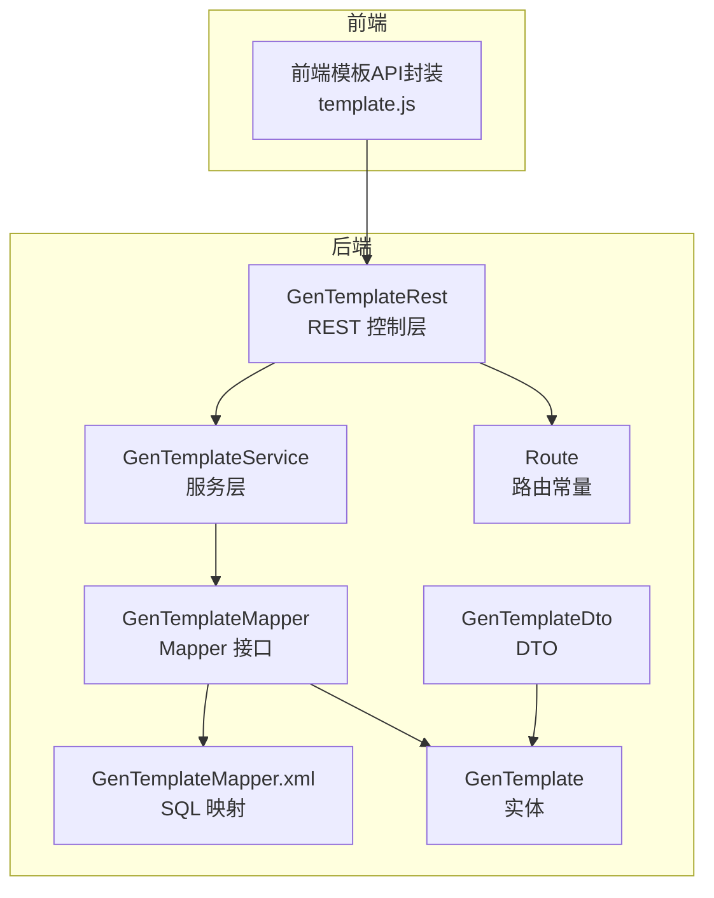
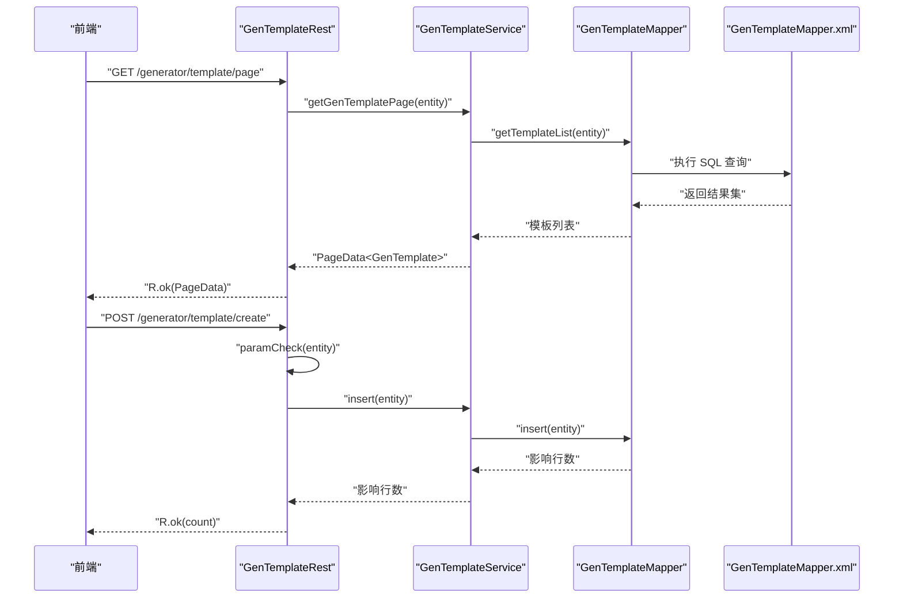
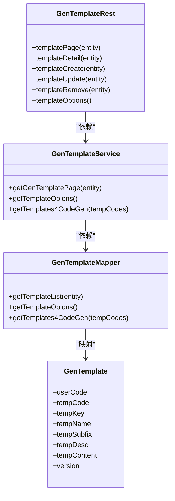

# 模板管理API

<cite>
**本文引用的文件**
- [GenTemplateRest.java](file://generator-server/src/main/java/com/wkclz/generator/server/rest/GenTemplateRest.java)
- [GenTemplateService.java](file://generator-server/src/main/java/com/wkclz/generator/server/service/GenTemplateService.java)
- [GenTemplateMapper.java](file://generator-server/src/main/java/com/wkclz/generator/server/mapper/GenTemplateMapper.java)
- [GenTemplateMapper.xml](file://generator-server/src/main/resources/mapper/GenTemplateMapper.xml)
- [GenTemplate.java](file://generator-server/src/main/java/com/wkclz/generator/server/bean/entity/GenTemplate.java)
- [GenTemplateDto.java](file://generator-server/src/main/java/com/wkclz/generator/server/bean/dto/GenTemplateDto.java)
- [Route.java](file://generator-server/src/main/java/com/wkclz/generator/server/Route.java)
- [template.js](file://generator-ui/src/api/template.js)
</cite>

## 目录
1. [简介](#简介)
2. [项目结构](#项目结构)
3. [核心组件](#核心组件)
4. [架构总览](#架构总览)
5. [详细组件分析](#详细组件分析)
6. [依赖关系分析](#依赖关系分析)
7. [性能考虑](#性能考虑)
8. [故障排查指南](#故障排查指南)
9. [结论](#结论)
10. [附录](#附录)

## 简介
本文件面向 SH-Generator 的“模板管理API”，系统化梳理模板 CRUD、分类与选项查询、模板内容与版本控制、模板预览与渲染测试、模板导入导出与批量操作的接口设计与实现要点，并提供调用示例与集成最佳实践。该系统采用标准的分层架构：REST 控制层、服务层、数据访问层，配合前端 API 封装，形成完整的模板生命周期管理能力。

## 项目结构
围绕模板管理的关键文件分布如下：
- 控制层：REST 接口定义与路由映射
- 服务层：模板业务逻辑与分页查询
- 数据访问层：MyBatis Mapper 与 XML 映射
- 数据模型：实体与 DTO
- 前端封装：统一的 HTTP 请求封装

图表来源
- [GenTemplateRest.java:1-82](file://generator-server/src/main/java/com/wkclz/generator/server/rest/GenTemplateRest.java#L1-L82)
- [GenTemplateService.java:1-34](file://generator-server/src/main/java/com/wkclz/generator/server/service/GenTemplateService.java#L1-L34)
- [GenTemplateMapper.java:1-19](file://generator-server/src/main/java/com/wkclz/generator/server/mapper/GenTemplateMapper.java#L1-L19)
- [GenTemplateMapper.xml:1-73](file://generator-server/src/main/resources/mapper/GenTemplateMapper.xml#L1-L73)
- [GenTemplate.java:1-108](file://generator-server/src/main/java/com/wkclz/generator/server/bean/entity/GenTemplate.java#L1-L108)
- [GenTemplateDto.java:1-32](file://generator-server/src/main/java/com/wkclz/generator/server/bean/dto/GenTemplateDto.java#L1-L32)
- [Route.java:1-89](file://generator-server/src/main/java/com/wkclz/generator/server/Route.java#L1-L89)
- [template.js:1-33](file://generator-ui/src/api/template.js#L1-L33)

章节来源
- [GenTemplateRest.java:1-82](file://generator-server/src/main/java/com/wkclz/generator/server/rest/GenTemplateRest.java#L1-L82)
- [Route.java:1-89](file://generator-server/src/main/java/com/wkclz/generator/server/Route.java#L1-L89)

## 核心组件
- REST 控制层：提供模板分页、详情、新增、修改、删除、选项查询等接口；内置参数校验与版本校验逻辑。
- 服务层：封装分页查询、选项查询、按编码集合获取模板等业务方法。
- 数据访问层：定义模板列表、选项、按编码集合查询的 SQL；支持条件过滤与排序。
- 数据模型：实体包含用户编码、模板编码、模板键、名称、后缀、描述、内容、排序、审计字段与版本号；提供拷贝工具方法。
- 前端封装：统一的 HTTP 请求封装，便于 UI 组件调用。

章节来源
- [GenTemplateRest.java:25-81](file://generator-server/src/main/java/com/wkclz/generator/server/rest/GenTemplateRest.java#L25-L81)
- [GenTemplateService.java:16-31](file://generator-server/src/main/java/com/wkclz/generator/server/service/GenTemplateService.java#L16-L31)
- [GenTemplateMapper.java:13-16](file://generator-server/src/main/java/com/wkclz/generator/server/mapper/GenTemplateMapper.java#L13-L16)
- [GenTemplateMapper.xml:6-68](file://generator-server/src/main/resources/mapper/GenTemplateMapper.xml#L6-L68)
- [GenTemplate.java:24-61](file://generator-server/src/main/java/com/wkclz/generator/server/bean/entity/GenTemplate.java#L24-L61)
- [template.js:4-31](file://generator-ui/src/api/template.js#L4-L31)

## 架构总览
模板管理API遵循典型的三层架构：前端通过 HTTP 请求调用后端 REST 接口，控制器接收请求并进行参数校验，随后委派给服务层执行业务逻辑，服务层通过 Mapper 访问数据库，最终返回响应。

图表来源
- [GenTemplateRest.java:25-57](file://generator-server/src/main/java/com/wkclz/generator/server/rest/GenTemplateRest.java#L25-L57)
- [GenTemplateService.java:16-18](file://generator-server/src/main/java/com/wkclz/generator/server/service/GenTemplateService.java#L16-L18)
- [GenTemplateMapper.java:13-13](file://generator-server/src/main/java/com/wkclz/generator/server/mapper/GenTemplateMapper.java#L13-L13)
- [GenTemplateMapper.xml:6-33](file://generator-server/src/main/resources/mapper/GenTemplateMapper.xml#L6-L33)

## 详细组件分析

### REST 控制层（GenTemplateRest）
- 接口清单与语义
  - 分页查询：GET /generator/template/page，基于实体条件过滤与排序，返回分页数据。
  - 详情查询：GET /generator/template/detail，要求传入主键，返回单条模板。
  - 新增模板：POST /generator/template/create，请求体为模板实体，内置参数校验。
  - 修改模板：POST /generator/template/update，请求体为模板实体，内置参数校验与版本校验。
  - 删除模板：POST /generator/template/remove，请求体包含主键，支持单条删除。
  - 模板选项：GET /generator/template/options，返回可用模板的简要列表（编码、键、名称、后缀、描述）。
- 参数校验与版本控制
  - 新增时自动注入当前用户编码；修改时校验模板编码、主键、版本号均非空。
  - 关键字段校验：模板键、模板名称、文件后缀、模板内容均非空。
- 返回格式
  - 统一使用 R 包裹，成功返回 R.ok(...)，失败由全局异常处理。

章节来源
- [GenTemplateRest.java:25-81](file://generator-server/src/main/java/com/wkclz/generator/server/rest/GenTemplateRest.java#L25-L81)
- [Route.java:28-39](file://generator-server/src/main/java/com/wkclz/generator/server/Route.java#L28-L39)

### 服务层（GenTemplateService）
- 分页查询：基于 PageQuery.page 调用 Mapper 的 getTemplateList，实现分页与排序。
- 选项查询：返回模板选项列表，仅包含必要字段。
- 代码生成用模板：根据模板编码集合批量查询模板内容，用于后续渲染。

章节来源
- [GenTemplateService.java:16-31](file://generator-server/src/main/java/com/wkclz/generator/server/service/GenTemplateService.java#L16-L31)

### 数据访问层（GenTemplateMapper + XML）
- 列表查询（带条件过滤与排序）
  - 支持按模板编码、模板键、模板名称模糊匹配，按用户编码精确过滤。
  - 排序规则：先按 sort 升序，再按 id 降序。
- 选项查询
  - 返回模板编码、键、名称、后缀、描述，用于前端选择器或下拉框。
- 代码生成用模板
  - 根据模板编码集合查询模板内容与后缀，用于渲染输出文件。

章节来源
- [GenTemplateMapper.java:13-16](file://generator-server/src/main/java/com/wkclz/generator/server/mapper/GenTemplateMapper.java#L13-L16)
- [GenTemplateMapper.xml:6-68](file://generator-server/src/main/resources/mapper/GenTemplateMapper.xml#L6-L68)

### 数据模型（GenTemplate 与 GenTemplateDto）
- 实体字段
  - 用户编码、模板编码、模板键、模板名称、文件后缀、描述、内容、排序、审计字段、版本号。
- 工具方法
  - 提供完整拷贝与按非空字段拷贝的方法，便于更新与持久化。
- DTO
  - 继承实体，提供从实体到 DTO 的拷贝方法，便于扩展响应字段。

章节来源
- [GenTemplate.java:24-104](file://generator-server/src/main/java/com/wkclz/generator/server/bean/entity/GenTemplate.java#L24-L104)
- [GenTemplateDto.java:25-29](file://generator-server/src/main/java/com/wkclz/generator/server/bean/dto/GenTemplateDto.java#L25-L29)

### 前端封装（template.js）
- 封装了模板详情、新增、分页、选项、删除、修改等常用请求方法，便于 UI 组件复用。
- 建议在 UI 中统一通过该封装发起请求，保证一致性与可维护性。

章节来源
- [template.js:4-31](file://generator-ui/src/api/template.js#L4-L31)

### 模板分类管理与选项查询
- 分类维度
  - 模板编码、模板键、模板名称、用户编码等均可作为筛选条件，支持模糊匹配与精确匹配。
- 选项查询
  - 返回模板选项列表，便于前端构建选择器或下拉框，减少传输体积。

章节来源
- [GenTemplateRest.java:59-63](file://generator-server/src/main/java/com/wkclz/generator/server/rest/GenTemplateRest.java#L59-L63)
- [GenTemplateMapper.xml:37-51](file://generator-server/src/main/resources/mapper/GenTemplateMapper.xml#L37-L51)

### 模板内容管理与版本控制
- 内容管理
  - 模板内容存储于模板实体的文本字段中，支持编辑与更新。
- 版本控制
  - 实体包含版本号字段；控制器在修改时进行版本校验，避免并发覆盖。
  - 建议在 UI 中展示版本号并在更新时传递最新版本，确保安全更新。

章节来源
- [GenTemplateRest.java:66-78](file://generator-server/src/main/java/com/wkclz/generator/server/rest/GenTemplateRest.java#L66-L78)
- [GenTemplate.java:25-61](file://generator-server/src/main/java/com/wkclz/generator/server/bean/entity/GenTemplate.java#L25-L61)

### 模板预览与渲染测试
- 预览机制
  - 可通过“模板选项”接口获取模板编码与内容，结合前端编辑器进行实时预览。
- 渲染测试
  - 使用“代码生成用模板”接口按模板编码集合批量获取模板内容与后缀，模拟渲染流程，验证模板语法与输出格式。

章节来源
- [GenTemplateRest.java:59-63](file://generator-server/src/main/java/com/wkclz/generator/server/rest/GenTemplateRest.java#L59-L63)
- [GenTemplateMapper.java:16-16](file://generator-server/src/main/java/com/wkclz/generator/server/mapper/GenTemplateMapper.java#L16-L16)

### 模板导入导出与批量操作
- 导入
  - 建议通过“新增模板”接口批量导入：逐条构造模板实体并调用新增接口。
- 导出
  - 通过“分页查询”或“模板选项”接口获取模板列表，前端汇总后导出为 JSON/CSV。
- 批量删除
  - 当前控制器未提供批量删除接口，建议在服务层扩展批量删除方法，并在控制器暴露对应接口。

章节来源
- [GenTemplateRest.java:52-57](file://generator-server/src/main/java/com/wkclz/generator/server/rest/GenTemplateRest.java#L52-L57)
- [GenTemplateService.java:16-23](file://generator-server/src/main/java/com/wkclz/generator/server/service/GenTemplateService.java#L16-L23)

### 接口调用示例与集成最佳实践
- 分页查询
  - 方法：GET /generator/template/page
  - 参数：模板编码、模板键、模板名称、用户编码（可选）
  - 返回：分页数据
- 详情查询
  - 方法：GET /generator/template/detail
  - 参数：主键 id（必填）
  - 返回：单条模板
- 新增模板
  - 方法：POST /generator/template/create
  - 请求体：模板实体（模板键、模板名称、文件后缀、模板内容等必填）
  - 返回：影响行数
- 修改模板
  - 方法：POST /generator/template/update
  - 请求体：模板实体（包含主键与版本号）
  - 返回：影响行数
- 删除模板
  - 方法：POST /generator/template/remove
  - 请求体：主键 id
  - 返回：影响行数
- 模板选项
  - 方法：GET /generator/template/options
  - 返回：模板选项列表

最佳实践
- 前端统一使用 template.js 封装的请求方法，保证一致的错误处理与加载状态。
- 修改模板时务必传递最新版本号，避免并发覆盖。
- 导入模板时建议先进行内容校验与语法检查，再批量提交。
- 导出模板时保留模板编码与关键元数据，便于迁移与备份。

章节来源
- [template.js:4-31](file://generator-ui/src/api/template.js#L4-L31)
- [GenTemplateRest.java:25-63](file://generator-server/src/main/java/com/wkclz/generator/server/rest/GenTemplateRest.java#L25-L63)

## 依赖关系分析
- 控制层依赖服务层；服务层依赖 Mapper；Mapper 依赖 XML SQL；实体与 DTO 为数据载体。
- 路由常量集中管理 REST 路径，便于统一维护与扩展。

图表来源
- [GenTemplateRest.java:21-22](file://generator-server/src/main/java/com/wkclz/generator/server/rest/GenTemplateRest.java#L21-L22)
- [GenTemplateService.java:14-23](file://generator-server/src/main/java/com/wkclz/generator/server/service/GenTemplateService.java#L14-L23)
- [GenTemplateMapper.java:11-16](file://generator-server/src/main/java/com/wkclz/generator/server/mapper/GenTemplateMapper.java#L11-L16)
- [GenTemplate.java:24-61](file://generator-server/src/main/java/com/wkclz/generator/server/bean/entity/GenTemplate.java#L24-L61)

## 性能考虑
- 分页查询
  - 使用 PageQuery.page 实现分页，建议前端设置合理的每页大小，避免一次性加载过多数据。
- SQL 过滤
  - 列表查询支持多条件过滤，建议在高频查询字段上建立索引以提升性能。
- 排序策略
  - 默认按 sort 升序、id 降序，有利于稳定排序与热点数据展示。
- 选项查询
  - 选项查询仅返回必要字段，减少网络传输与解析开销。

## 故障排查指南
- 参数缺失
  - 新增或修改时若缺少模板键、模板名称、文件后缀、模板内容等关键字段，将触发参数校验失败。
- 主键缺失
  - 详情查询与删除接口要求主键非空，否则抛出参数错误。
- 版本冲突
  - 修改接口要求版本号非空，避免并发更新导致的数据覆盖。
- SQL 条件
  - 列表查询的 LIKE 条件可能影响索引使用，建议对高基数字段建立合适索引。

章节来源
- [GenTemplateRest.java:33-78](file://generator-server/src/main/java/com/wkclz/generator/server/rest/GenTemplateRest.java#L33-L78)
- [GenTemplateMapper.xml:24-32](file://generator-server/src/main/resources/mapper/GenTemplateMapper.xml#L24-L32)

## 结论
模板管理API以清晰的分层架构实现了模板的全生命周期管理：从 CRUD 到分类与选项查询，再到内容与版本控制、预览与渲染测试，以及导入导出与批量操作的扩展路径。通过统一的参数校验、版本控制与前端封装，系统具备良好的安全性、可维护性与易用性。建议在后续迭代中补充批量删除与更丰富的导入导出能力，进一步完善模板生态。

## 附录
- 路由常量参考
  - 模板相关路由集中在 Route 接口中，便于统一管理与扩展。
- 前端封装参考
  - template.js 提供了模板管理常用接口的封装，建议在 UI 中统一使用。

章节来源
- [Route.java:28-39](file://generator-server/src/main/java/com/wkclz/generator/server/Route.java#L28-L39)
- [template.js:4-31](file://generator-ui/src/api/template.js#L4-L31)