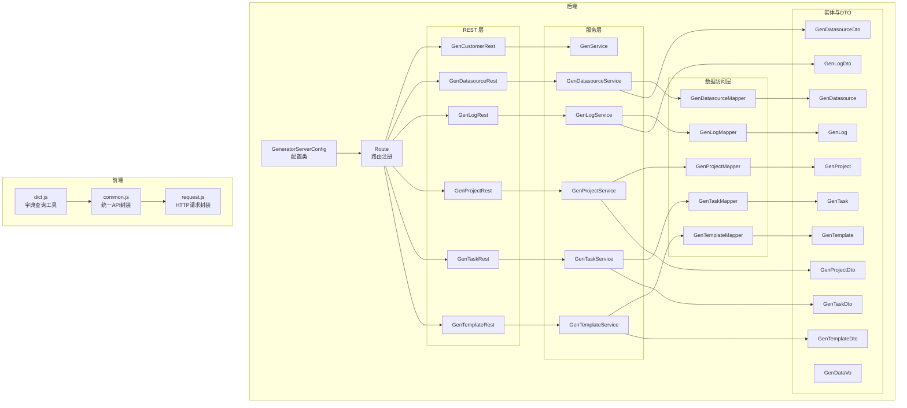
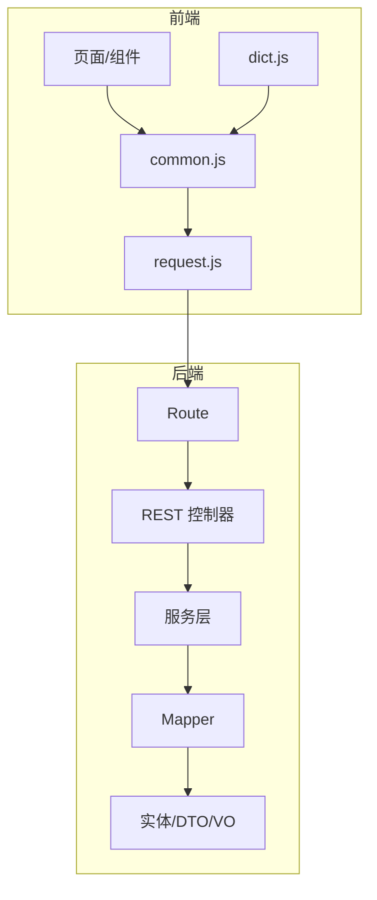
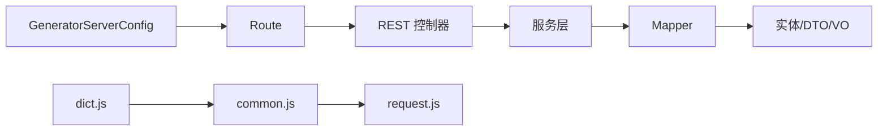
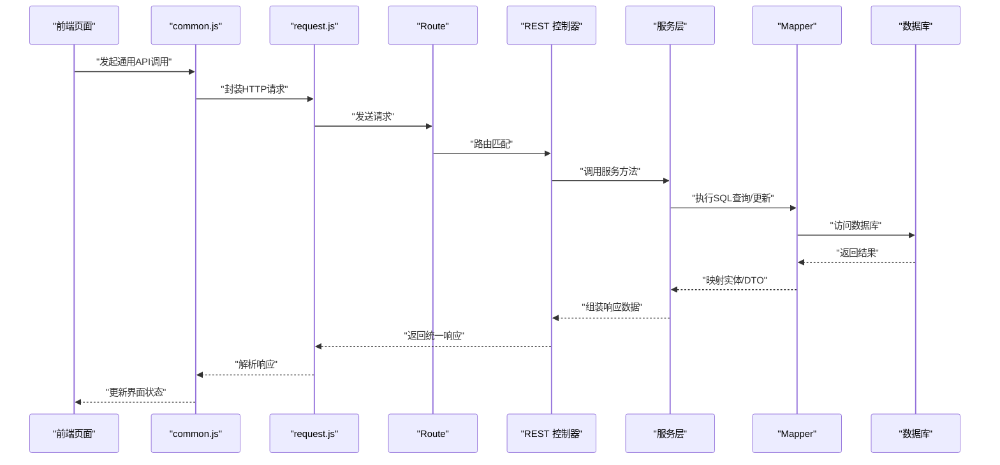

# 通用API接口

<cite>
**本文档引用的文件**
- [Route.java](file://generator-server/src/main/java/com/wkclz/generator/server/Route.java)
- [GeneratorServerConfig.java](file://generator-server/src/main/java/com/wkclz/generator/server/GeneratorServerConfig.java)
- [GenCustomerRest.java](file://generator-server/src/main/java/com/wkclz/generator/server/rest/GenCustomerRest.java)
- [GenDatasourceRest.java](file://generator-server/src/main/java/com/wkclz/generator/server/rest/GenDatasourceRest.java)
- [GenLogRest.java](file://generator-server/src/main/java/com/wkclz/generator/server/rest/GenLogRest.java)
- [GenProjectRest.java](file://generator-server/src/main/java/com/wkclz/generator/server/rest/GenProjectRest.java)
- [GenTaskRest.java](file://generator-server/src/main/java/com/wkclz/generator/server/rest/GenTaskRest.java)
- [GenTemplateRest.java](file://generator-server/src/main/java/com/wkclz/generator/server/rest/GenTemplateRest.java)
- [GenDatasourceService.java](file://generator-server/src/main/java/com/wkclz/generator/server/service/GenDatasourceService.java)
- [GenLogService.java](file://generator-server/src/main/java/com/wkclz/generator/server/service/GenLogService.java)
- [GenProjectService.java](file://generator-server/src/main/java/com/wkclz/generator/server/service/GenProjectService.java)
- [GenService.java](file://generator-server/src/main/java/com/wkclz/generator/server/service/GenService.java)
- [GenTaskService.java](file://generator-server/src/main/java/com/wkclz/generator/server/service/GenTaskService.java)
- [GenTemplateService.java](file://generator-server/src/main/java/com/wkclz/generator/server/service/GenTemplateService.java)
- [GenDatasourceMapper.java](file://generator-server/src/main/java/com/wkclz/generator/server/mapper/GenDatasourceMapper.java)
- [GenLogMapper.java](file://generator-server/src/main/java/com/wkclz/generator/server/mapper/GenLogMapper.java)
- [GenProjectMapper.java](file://generator-server/src/main/java/com/wkclz/generator/server/mapper/GenProjectMapper.java)
- [GenTaskMapper.java](file://generator-server/src/main/java/com/wkclz/generator/server/mapper/GenTaskMapper.java)
- [GenTemplateMapper.java](file://generator-server/src/main/java/com/wkclz/generator/server/mapper/GenTemplateMapper.java)
- [GenDatasourceDto.java](file://generator-server/src/main/java/com/wkclz/generator/server/bean/dto/GenDatasourceDto.java)
- [GenLogDto.java](file://generator-server/src/main/java/com/wkclz/generator/server/bean/dto/GenLogDto.java)
- [GenProjectDto.java](file://generator-server/src/main/java/com/wkclz/generator/server/bean/dto/GenProjectDto.java)
- [GenTaskDto.java](file://generator-server/src/main/java/com/wkclz/generator/server/bean/dto/GenTaskDto.java)
- [GenTemplateDto.java](file://generator-server/src/main/java/com/wkclz/generator/server/bean/dto/GenTemplateDto.java)
- [GenDatasource.java](file://generator-server/src/main/java/com/wkclz/generator/server/bean/entity/GenDatasource.java)
- [GenLog.java](file://generator-server/src/main/java/com/wkclz/generator/server/bean/entity/GenLog.java)
- [GenProject.java](file://generator-server/src/main/java/com/wkclz/generator/server/bean/entity/GenProject.java)
- [GenTask.java](file://generator-server/src/main/java/com/wkclz/generator/server/bean/entity/GenTask.java)
- [GenTemplate.java](file://generator-server/src/main/java/com/wkclz/generator/server/bean/entity/GenTemplate.java)
- [GenDataVo.java](file://generator-server/src/main/java/com/wkclz/generator/server/bean/vo/GenDataVo.java)
- [DynamicDataSourceInit.java](file://generator-server/src/main/java/com/wkclz/generator/server/helper/DynamicDataSourceInit.java)
- [GenParamHFetchelper.java](file://generator-server/src/main/java/com/wkclz/generator/server/helper/GenParamHFetchelper.java)
- [common.js](file://generator-ui/src/api/common.js)
- [dict.js](file://generator-ui/src/utils/dict.js)
- [request.js](file://generator-ui/src/utils/request.js)
- [application.yml](file://generator-server-starter/src/main/resources/config/application.yml)
</cite>

## 目录
1. [引言](#引言)
2. [项目结构](#项目结构)
3. [核心组件](#核心组件)
4. [架构总览](#架构总览)
5. [详细组件分析](#详细组件分析)
6. [依赖关系分析](#依赖关系分析)
7. [性能考虑](#性能考虑)
8. [故障排查指南](#故障排查指南)
9. [结论](#结论)
10. [附录](#附录)

## 引言
本文件聚焦于 SH-Generator 的通用 API 接口设计与实现，系统性阐述通用接口的理念、统一规范、公共字典查询机制、在系统中的作用与重要性，并提供调用示例、参数说明、错误处理策略以及缓存与性能优化方案。通过前后端分离的架构，后端以 REST 风格暴露通用数据访问能力，前端通过统一的请求封装与字典管理模块进行调用。

## 项目结构
后端采用 Spring Boot 工程，REST 控制器位于 server 模块的 rest 包中，服务层位于 service 包，数据访问层位于 mapper 包，配置与路由定义在 Route 与 GeneratorServerConfig 中；前端位于 generator-ui，通过 common.js、dict.js、request.js 统一处理 API 请求与字典查询。

图表来源
- [Route.java](file://generator-server/src/main/java/com/wkclz/generator/server/Route.java)
- [GeneratorServerConfig.java](file://generator-server/src/main/java/com/wkclz/generator/server/GeneratorServerConfig.java)
- [GenCustomerRest.java](file://generator-server/src/main/java/com/wkclz/generator/server/rest/GenCustomerRest.java)
- [GenDatasourceRest.java](file://generator-server/src/main/java/com/wkclz/generator/server/rest/GenDatasourceRest.java)
- [GenLogRest.java](file://generator-server/src/main/java/com/wkclz/generator/server/rest/GenLogRest.java)
- [GenProjectRest.java](file://generator-server/src/main/java/com/wkclz/generator/server/rest/GenProjectRest.java)
- [GenTaskRest.java](file://generator-server/src/main/java/com/wkclz/generator/server/rest/GenTaskRest.java)
- [GenTemplateRest.java](file://generator-server/src/main/java/com/wkclz/generator/server/rest/GenTemplateRest.java)
- [GenDatasourceService.java](file://generator-server/src/main/java/com/wkclz/generator/server/service/GenDatasourceService.java)
- [GenLogService.java](file://generator-server/src/main/java/com/wkclz/generator/server/service/GenLogService.java)
- [GenProjectService.java](file://generator-server/src/main/java/com/wkclz/generator/server/service/GenProjectService.java)
- [GenTaskService.java](file://generator-server/src/main/java/com/wkclz/generator/server/service/GenTaskService.java)
- [GenTemplateService.java](file://generator-server/src/main/java/com/wkclz/generator/server/service/GenTemplateService.java)
- [GenDatasourceMapper.java](file://generator-server/src/main/java/com/wkclz/generator/server/mapper/GenDatasourceMapper.java)
- [GenLogMapper.java](file://generator-server/src/main/java/com/wkclz/generator/server/mapper/GenLogMapper.java)
- [GenProjectMapper.java](file://generator-server/src/main/java/com/wkclz/generator/server/mapper/GenProjectMapper.java)
- [GenTaskMapper.java](file://generator-server/src/main/java/com/wkclz/generator/server/mapper/GenTaskMapper.java)
- [GenTemplateMapper.java](file://generator-server/src/main/java/com/wkclz/generator/server/mapper/GenTemplateMapper.java)
- [GenDatasourceDto.java](file://generator-server/src/main/java/com/wkclz/generator/server/bean/dto/GenDatasourceDto.java)
- [GenLogDto.java](file://generator-server/src/main/java/com/wkclz/generator/server/bean/dto/GenLogDto.java)
- [GenProjectDto.java](file://generator-server/src/main/java/com/wkclz/generator/server/bean/dto/GenProjectDto.java)
- [GenTaskDto.java](file://generator-server/src/main/java/com/wkclz/generator/server/bean/dto/GenTaskDto.java)
- [GenTemplateDto.java](file://generator-server/src/main/java/com/wkclz/generator/server/bean/dto/GenTemplateDto.java)
- [GenDatasource.java](file://generator-server/src/main/java/com/wkclz/generator/server/bean/entity/GenDatasource.java)
- [GenLog.java](file://generator-server/src/main/java/com/wkclz/generator/server/bean/entity/GenLog.java)
- [GenProject.java](file://generator-server/src/main/java/com/wkclz/generator/server/bean/entity/GenProject.java)
- [GenTask.java](file://generator-server/src/main/java/com/wkclz/generator/server/bean/entity/GenTask.java)
- [GenTemplate.java](file://generator-server/src/main/java/com/wkclz/generator/server/bean/entity/GenTemplate.java)
- [GenDataVo.java](file://generator-server/src/main/java/com/wkclz/generator/server/bean/vo/GenDataVo.java)
- [common.js](file://generator-ui/src/api/common.js)
- [dict.js](file://generator-ui/src/utils/dict.js)
- [request.js](file://generator-ui/src/utils/request.js)

章节来源
- [Route.java](file://generator-server/src/main/java/com/wkclz/generator/server/Route.java)
- [GeneratorServerConfig.java](file://generator-server/src/main/java/com/wkclz/generator/server/GeneratorServerConfig.java)
- [common.js](file://generator-ui/src/api/common.js)
- [dict.js](file://generator-ui/src/utils/dict.js)
- [request.js](file://generator-ui/src/utils/request.js)

## 核心组件
- 路由与配置：Route 负责 REST 路由注册，GeneratorServerConfig 提供全局配置能力（如跨域、静态资源等），二者共同确保通用 API 的统一入口与规范。
- REST 控制器：每个业务领域（客户、数据源、日志、项目、任务、模板）均提供独立的 Rest 控制器，遵循统一的命名与返回结构，便于前端统一处理。
- 服务层：对应各控制器的服务类负责业务编排、参数校验、调用 Mapper 完成持久化或查询。
- 数据访问层：MyBatis Mapper 封装 SQL 查询与更新，配合实体与 DTO 完成数据传输。
- 前端统一封装：common.js 与 request.js 提供统一的 HTTP 请求封装，dict.js 提供公共字典查询能力，形成“通用 API”在前端的统一入口。

章节来源
- [Route.java](file://generator-server/src/main/java/com/wkclz/generator/server/Route.java)
- [GeneratorServerConfig.java](file://generator-server/src/main/java/com/wkclz/generator/server/GeneratorServerConfig.java)
- [GenCustomerRest.java](file://generator-server/src/main/java/com/wkclz/generator/server/rest/GenCustomerRest.java)
- [GenDatasourceRest.java](file://generator-server/src/main/java/com/wkclz/generator/server/rest/GenDatasourceRest.java)
- [GenLogRest.java](file://generator-server/src/main/java/com/wkclz/generator/server/rest/GenLogRest.java)
- [GenProjectRest.java](file://generator-server/src/main/java/com/wkclz/generator/server/rest/GenProjectRest.java)
- [GenTaskRest.java](file://generator-server/src/main/java/com/wkclz/generator/server/rest/GenTaskRest.java)
- [GenTemplateRest.java](file://generator-server/src/main/java/com/wkclz/generator/server/rest/GenTemplateRest.java)
- [GenDatasourceService.java](file://generator-server/src/main/java/com/wkclz/generator/server/service/GenDatasourceService.java)
- [GenLogService.java](file://generator-server/src/main/java/com/wkclz/generator/server/service/GenLogService.java)
- [GenProjectService.java](file://generator-server/src/main/java/com/wkclz/generator/server/service/GenProjectService.java)
- [GenTaskService.java](file://generator-server/src/main/java/com/wkclz/generator/server/service/GenTaskService.java)
- [GenTemplateService.java](file://generator-server/src/main/java/com/wkclz/generator/server/service/GenTemplateService.java)
- [GenDatasourceMapper.java](file://generator-server/src/main/java/com/wkclz/generator/server/mapper/GenDatasourceMapper.java)
- [GenLogMapper.java](file://generator-server/src/main/java/com/wkclz/generator/server/mapper/GenLogMapper.java)
- [GenProjectMapper.java](file://generator-server/src/main/java/com/wkclz/generator/server/mapper/GenProjectMapper.java)
- [GenTaskMapper.java](file://generator-server/src/main/java/com/wkclz/generator/server/mapper/GenTaskMapper.java)
- [GenTemplateMapper.java](file://generator-server/src/main/java/com/wkclz/generator/server/mapper/GenTemplateMapper.java)
- [common.js](file://generator-ui/src/api/common.js)
- [dict.js](file://generator-ui/src/utils/dict.js)
- [request.js](file://generator-ui/src/utils/request.js)

## 架构总览
通用 API 的整体架构围绕“路由—控制器—服务—数据访问—前端封装”的分层设计展开。后端通过 Route 注册 REST 路由，控制器接收请求并调用服务层，服务层协调 Mapper 完成数据库操作，最终通过统一的数据传输对象返回给前端。前端通过 common.js 与 request.js 统一封装请求，dict.js 提供字典查询能力，形成前后端一致的“通用 API”体验。

图表来源
- [Route.java](file://generator-server/src/main/java/com/wkclz/generator/server/Route.java)
- [GenCustomerRest.java](file://generator-server/src/main/java/com/wkclz/generator/server/rest/GenCustomerRest.java)
- [GenDatasourceRest.java](file://generator-server/src/main/java/com/wkclz/generator/server/rest/GenDatasourceRest.java)
- [GenLogRest.java](file://generator-server/src/main/java/com/wkclz/generator/server/rest/GenLogRest.java)
- [GenProjectRest.java](file://generator-server/src/main/java/com/wkclz/generator/server/rest/GenProjectRest.java)
- [GenTaskRest.java](file://generator-server/src/main/java/com/wkclz/generator/server/rest/GenTaskRest.java)
- [GenTemplateRest.java](file://generator-server/src/main/java/com/wkclz/generator/server/rest/GenTemplateRest.java)
- [GenDatasourceService.java](file://generator-server/src/main/java/com/wkclz/generator/server/service/GenDatasourceService.java)
- [GenLogService.java](file://generator-server/src/main/java/com/wkclz/generator/server/service/GenLogService.java)
- [GenProjectService.java](file://generator-server/src/main/java/com/wkclz/generator/server/service/GenProjectService.java)
- [GenTaskService.java](file://generator-server/src/main/java/com/wkclz/generator/server/service/GenTaskService.java)
- [GenTemplateService.java](file://generator-server/src/main/java/com/wkclz/generator/server/service/GenTemplateService.java)
- [GenDatasourceMapper.java](file://generator-server/src/main/java/com/wkclz/generator/server/mapper/GenDatasourceMapper.java)
- [GenLogMapper.java](file://generator-server/src/main/java/com/wkclz/generator/server/mapper/GenLogMapper.java)
- [GenProjectMapper.java](file://generator-server/src/main/java/com/wkclz/generator/server/mapper/GenProjectMapper.java)
- [GenTaskMapper.java](file://generator-server/src/main/java/com/wkclz/generator/server/mapper/GenTaskMapper.java)
- [GenTemplateMapper.java](file://generator-server/src/main/java/com/wkclz/generator/server/mapper/GenTemplateMapper.java)
- [common.js](file://generator-ui/src/api/common.js)
- [dict.js](file://generator-ui/src/utils/dict.js)
- [request.js](file://generator-ui/src/utils/request.js)

## 详细组件分析

### 公共字典查询接口
- 设计理念：前端通过 dict.js 提供统一的字典查询能力，避免重复请求与分散逻辑，提升用户体验与开发效率。
- 实现机制：dict.js 基于 common.js 的 API 封装，内部维护字典缓存，按类型与键值进行查询，支持异步加载与本地缓存。
- 使用方法：在页面或组件中调用字典查询函数，传入字典类型与键值，即可获得对应的标签或描述信息。
- 调用示例（路径参考）：
  - [dict.js](file://generator-ui/src/utils/dict.js)
  - [common.js](file://generator-ui/src/api/common.js)
- 参数说明：
  - 类型：字典类型标识符（字符串）
  - 键值：具体键值（字符串或数字）
  - 返回：字典项的标签或描述文本
- 错误处理：当字典不存在或网络异常时，返回默认占位符或抛出可捕获的错误，前端应进行友好提示。

章节来源
- [dict.js](file://generator-ui/src/utils/dict.js)
- [common.js](file://generator-ui/src/api/common.js)

### 通用接口统一规范
- 统一入口：Route 负责 REST 路由注册，所有通用接口遵循统一的前缀与命名规范，便于前端统一管理。
- 统一响应：控制器返回结构保持一致，包含状态码、消息与数据体，前端可统一解析与展示。
- 统一鉴权：通过 GeneratorServerConfig 配置全局拦截器或过滤器，实现统一的认证与授权策略。
- 统一异常：服务层与控制器层对异常进行集中处理，返回标准化错误信息，前端据此进行提示与重试。

章节来源
- [Route.java](file://generator-server/src/main/java/com/wkclz/generator/server/Route.java)
- [GeneratorServerConfig.java](file://generator-server/src/main/java/com/wkclz/generator/server/GeneratorServerConfig.java)

### 数据源相关接口
- 控制器：GenDatasourceRest 提供数据源的增删改查与列表查询等通用操作。
- 服务：GenDatasourceService 负责参数校验、业务规则处理与调用 Mapper。
- 数据访问：GenDatasourceMapper 对应 GenDatasource 与 GenDatasourceDto，完成数据持久化。
- 调用示例（路径参考）：
  - [GenDatasourceRest.java](file://generator-server/src/main/java/com/wkclz/generator/server/rest/GenDatasourceRest.java)
  - [GenDatasourceService.java](file://generator-server/src/main/java/com/wkclz/generator/server/service/GenDatasourceService.java)
  - [GenDatasourceMapper.java](file://generator-server/src/main/java/com/wkclz/generator/server/mapper/GenDatasourceMapper.java)
  - [GenDatasourceDto.java](file://generator-server/src/main/java/com/wkclz/generator/server/bean/dto/GenDatasourceDto.java)
  - [GenDatasource.java](file://generator-server/src/main/java/com/wkclz/generator/server/bean/entity/GenDatasource.java)

章节来源
- [GenDatasourceRest.java](file://generator-server/src/main/java/com/wkclz/generator/server/rest/GenDatasourceRest.java)
- [GenDatasourceService.java](file://generator-server/src/main/java/com/wkclz/generator/server/service/GenDatasourceService.java)
- [GenDatasourceMapper.java](file://generator-server/src/main/java/com/wkclz/generator/server/mapper/GenDatasourceMapper.java)
- [GenDatasourceDto.java](file://generator-server/src/main/java/com/wkclz/generator/server/bean/dto/GenDatasourceDto.java)
- [GenDatasource.java](file://generator-server/src/main/java/com/wkclz/generator/server/bean/entity/GenDatasource.java)

### 日志相关接口
- 控制器：GenLogRest 提供日志的查询与分页列表等通用操作。
- 服务：GenLogService 负责日志查询与统计逻辑。
- 数据访问：GenLogMapper 对应 GenLog 与 GenLogDto。
- 调用示例（路径参考）：
  - [GenLogRest.java](file://generator-server/src/main/java/com/wkclz/generator/server/rest/GenLogRest.java)
  - [GenLogService.java](file://generator-server/src/main/java/com/wkclz/generator/server/service/GenLogService.java)
  - [GenLogMapper.java](file://generator-server/src/main/java/com/wkclz/generator/server/mapper/GenLogMapper.java)
  - [GenLogDto.java](file://generator-server/src/main/java/com/wkclz/generator/server/bean/dto/GenLogDto.java)
  - [GenLog.java](file://generator-server/src/main/java/com/wkclz/generator/server/bean/entity/GenLog.java)

章节来源
- [GenLogRest.java](file://generator-server/src/main/java/com/wkclz/generator/server/rest/GenLogRest.java)
- [GenLogService.java](file://generator-server/src/main/java/com/wkclz/generator/server/service/GenLogService.java)
- [GenLogMapper.java](file://generator-server/src/main/java/com/wkclz/generator/server/mapper/GenLogMapper.java)
- [GenLogDto.java](file://generator-server/src/main/java/com/wkclz/generator/server/bean/dto/GenLogDto.java)
- [GenLog.java](file://generator-server/src/main/java/com/wkclz/generator/server/bean/entity/GenLog.java)

### 项目相关接口
- 控制器：GenProjectRest 提供项目的增删改查与列表查询等通用操作。
- 服务：GenProjectService 负责项目业务逻辑与数据校验。
- 数据访问：GenProjectMapper 对应 GenProject 与 GenProjectDto。
- 调用示例（路径参考）：
  - [GenProjectRest.java](file://generator-server/src/main/java/com/wkclz/generator/server/rest/GenProjectRest.java)
  - [GenProjectService.java](file://generator-server/src/main/java/com/wkclz/generator/server/service/GenProjectService.java)
  - [GenProjectMapper.java](file://generator-server/src/main/java/com/wkclz/generator/server/mapper/GenProjectMapper.java)
  - [GenProjectDto.java](file://generator-server/src/main/java/com/wkclz/generator/server/bean/dto/GenProjectDto.java)
  - [GenProject.java](file://generator-server/src/main/java/com/wkclz/generator/server/bean/entity/GenProject.java)

章节来源
- [GenProjectRest.java](file://generator-server/src/main/java/com/wkclz/generator/server/rest/GenProjectRest.java)
- [GenProjectService.java](file://generator-server/src/main/java/com/wkclz/generator/server/service/GenProjectService.java)
- [GenProjectMapper.java](file://generator-server/src/main/java/com/wkclz/generator/server/mapper/GenProjectMapper.java)
- [GenProjectDto.java](file://generator-server/src/main/java/com/wkclz/generator/server/bean/dto/GenProjectDto.java)
- [GenProject.java](file://generator-server/src/main/java/com/wkclz/generator/server/bean/entity/GenProject.java)

### 任务相关接口
- 控制器：GenTaskRest 提供任务的增删改查与执行调度等通用操作。
- 服务：GenTaskService 负责任务生命周期管理与调度逻辑。
- 数据访问：GenTaskMapper 对应 GenTask 与 GenTaskDto。
- 调用示例（路径参考）：
  - [GenTaskRest.java](file://generator-server/src/main/java/com/wkclz/generator/server/rest/GenTaskRest.java)
  - [GenTaskService.java](file://generator-server/src/main/java/com/wkclz/generator/server/service/GenTaskService.java)
  - [GenTaskMapper.java](file://generator-server/src/main/java/com/wkclz/generator/server/mapper/GenTaskMapper.java)
  - [GenTaskDto.java](file://generator-server/src/main/java/com/wkclz/generator/server/bean/dto/GenTaskDto.java)
  - [GenTask.java](file://generator-server/src/main/java/com/wkclz/generator/server/bean/entity/GenTask.java)

章节来源
- [GenTaskRest.java](file://generator-server/src/main/java/com/wkclz/generator/server/rest/GenTaskRest.java)
- [GenTaskService.java](file://generator-server/src/main/java/com/wkclz/generator/server/service/GenTaskService.java)
- [GenTaskMapper.java](file://generator-server/src/main/java/com/wkclz/generator/server/mapper/GenTaskMapper.java)
- [GenTaskDto.java](file://generator-server/src/main/java/com/wkclz/generator/server/bean/dto/GenTaskDto.java)
- [GenTask.java](file://generator-server/src/main/java/com/wkclz/generator/server/bean/entity/GenTask.java)

### 模板相关接口
- 控制器：GenTemplateRest 提供模板的增删改查与列表查询等通用操作。
- 服务：GenTemplateService 负责模板业务逻辑与渲染参数处理。
- 数据访问：GenTemplateMapper 对应 GenTemplate 与 GenTemplateDto。
- 调用示例（路径参考）：
  - [GenTemplateRest.java](file://generator-server/src/main/java/com/wkclz/generator/server/rest/GenTemplateRest.java)
  - [GenTemplateService.java](file://generator-server/src/main/java/com/wkclz/generator/server/service/GenTemplateService.java)
  - [GenTemplateMapper.java](file://generator-server/src/main/java/com/wkclz/generator/server/mapper/GenTemplateMapper.java)
  - [GenTemplateDto.java](file://generator-server/src/main/java/com/wkclz/generator/server/bean/dto/GenTemplateDto.java)
  - [GenTemplate.java](file://generator-server/src/main/java/com/wkclz/generator/server/bean/entity/GenTemplate.java)

章节来源
- [GenTemplateRest.java](file://generator-server/src/main/java/com/wkclz/generator/server/rest/GenTemplateRest.java)
- [GenTemplateService.java](file://generator-server/src/main/java/com/wkclz/generator/server/service/GenTemplateService.java)
- [GenTemplateMapper.java](file://generator-server/src/main/java/com/wkclz/generator/server/mapper/GenTemplateMapper.java)
- [GenTemplateDto.java](file://generator-server/src/main/java/com/wkclz/generator/server/bean/dto/GenTemplateDto.java)
- [GenTemplate.java](file://generator-server/src/main/java/com/wkclz/generator/server/bean/entity/GenTemplate.java)

### 通用数据查询与参数处理
- 通用查询：GenService 提供通用的数据查询与分页能力，支持多表关联与复杂条件组合。
- 参数处理：GenParamHFetchelper 负责参数提取与校验，确保输入参数符合业务约束。
- 动态数据源：DynamicDataSourceInit 支持运行时切换数据源，满足多租户或多库场景下的通用查询需求。
- 调用示例（路径参考）：
  - [GenService.java](file://generator-server/src/main/java/com/wkclz/generator/server/service/GenService.java)
  - [GenParamHFetchelper.java](file://generator-server/src/main/java/com/wkclz/generator/server/helper/GenParamHFetchelper.java)
  - [DynamicDataSourceInit.java](file://generator-server/src/main/java/com/wkclz/generator/server/helper/DynamicDataSourceInit.java)
  - [GenDataVo.java](file://generator-server/src/main/java/com/wkclz/generator/server/bean/vo/GenDataVo.java)

章节来源
- [GenService.java](file://generator-server/src/main/java/com/wkclz/generator/server/service/GenService.java)
- [GenParamHFetchelper.java](file://generator-server/src/main/java/com/wkclz/generator/server/helper/GenParamHFetchelper.java)
- [DynamicDataSourceInit.java](file://generator-server/src/main/java/com/wkclz/generator/server/helper/DynamicDataSourceInit.java)
- [GenDataVo.java](file://generator-server/src/main/java/com/wkclz/generator/server/bean/vo/GenDataVo.java)

## 依赖关系分析
- 控制器到服务：REST 控制器直接依赖对应的服务类，形成清晰的职责边界。
- 服务到数据访问：服务层依赖 Mapper 完成数据库操作，Mapper 依赖实体与 DTO 进行数据映射。
- 前端到后端：common.js 与 request.js 统一封装 HTTP 请求，dict.js 统一字典查询，减少重复代码与提高一致性。
- 配置与路由：Route 与 GeneratorServerConfig 提供全局配置与路由注册，保证通用 API 的统一入口与规范。

图表来源
- [Route.java](file://generator-server/src/main/java/com/wkclz/generator/server/Route.java)
- [GeneratorServerConfig.java](file://generator-server/src/main/java/com/wkclz/generator/server/GeneratorServerConfig.java)
- [GenCustomerRest.java](file://generator-server/src/main/java/com/wkclz/generator/server/rest/GenCustomerRest.java)
- [GenDatasourceRest.java](file://generator-server/src/main/java/com/wkclz/generator/server/rest/GenDatasourceRest.java)
- [GenLogRest.java](file://generator-server/src/main/java/com/wkclz/generator/server/rest/GenLogRest.java)
- [GenProjectRest.java](file://generator-server/src/main/java/com/wkclz/generator/server/rest/GenProjectRest.java)
- [GenTaskRest.java](file://generator-server/src/main/java/com/wkclz/generator/server/rest/GenTaskRest.java)
- [GenTemplateRest.java](file://generator-server/src/main/java/com/wkclz/generator/server/rest/GenTemplateRest.java)
- [GenDatasourceService.java](file://generator-server/src/main/java/com/wkclz/generator/server/service/GenDatasourceService.java)
- [GenLogService.java](file://generator-server/src/main/java/com/wkclz/generator/server/service/GenLogService.java)
- [GenProjectService.java](file://generator-server/src/main/java/com/wkclz/generator/server/service/GenProjectService.java)
- [GenTaskService.java](file://generator-server/src/main/java/com/wkclz/generator/server/service/GenTaskService.java)
- [GenTemplateService.java](file://generator-server/src/main/java/com/wkclz/generator/server/service/GenTemplateService.java)
- [GenDatasourceMapper.java](file://generator-server/src/main/java/com/wkclz/generator/server/mapper/GenDatasourceMapper.java)
- [GenLogMapper.java](file://generator-server/src/main/java/com/wkclz/generator/server/mapper/GenLogMapper.java)
- [GenProjectMapper.java](file://generator-server/src/main/java/com/wkclz/generator/server/mapper/GenProjectMapper.java)
- [GenTaskMapper.java](file://generator-server/src/main/java/com/wkclz/generator/server/mapper/GenTaskMapper.java)
- [GenTemplateMapper.java](file://generator-server/src/main/java/com/wkclz/generator/server/mapper/GenTemplateMapper.java)
- [common.js](file://generator-ui/src/api/common.js)
- [dict.js](file://generator-ui/src/utils/dict.js)
- [request.js](file://generator-ui/src/utils/request.js)

章节来源
- [Route.java](file://generator-server/src/main/java/com/wkclz/generator/server/Route.java)
- [GeneratorServerConfig.java](file://generator-server/src/main/java/com/wkclz/generator/server/GeneratorServerConfig.java)
- [common.js](file://generator-ui/src/api/common.js)
- [dict.js](file://generator-ui/src/utils/dict.js)
- [request.js](file://generator-ui/src/utils/request.js)

## 性能考虑
- 缓存策略：前端 dict.js 内部维护字典缓存，避免重复请求；后端可在服务层增加缓存注解或本地缓存，降低数据库压力。
- 分页与批量：通用查询接口建议使用分页参数，避免一次性返回大量数据；批量操作时采用批处理与事务控制，提升吞吐量。
- 连接池与超时：合理配置数据库连接池大小与超时时间，避免长事务与阻塞；对高并发场景启用异步处理与限流策略。
- 压缩与传输：客户端可启用 Gzip 压缩，减少网络传输开销；对大文本或二进制数据采用分片上传与断点续传。
- 动态数据源：通过 DynamicDataSourceInit 切换数据源时，注意连接复用与资源释放，避免内存泄漏。

章节来源
- [dict.js](file://generator-ui/src/utils/dict.js)
- [GenService.java](file://generator-server/src/main/java/com/wkclz/generator/server/service/GenService.java)
- [DynamicDataSourceInit.java](file://generator-server/src/main/java/com/wkclz/generator/server/helper/DynamicDataSourceInit.java)
- [application.yml](file://generator-server-starter/src/main/resources/config/application.yml)

## 故障排查指南
- 前端请求失败：检查 common.js 与 request.js 的封装是否正确，确认网络状态与跨域配置；查看浏览器开发者工具的 Network 面板定位问题。
- 字典查询异常：确认 dict.js 的类型与键值是否正确，检查后端是否返回了对应字典项；若无缓存，尝试刷新页面重新加载。
- 服务层异常：查看服务类的日志输出，定位参数校验失败或业务规则冲突；必要时开启调试模式逐步排查。
- 数据访问异常：检查 Mapper 的 SQL 语句与实体映射关系，确认数据库连接与权限；对慢查询进行索引优化与 SQL 调优。
- 配置问题：核对 GeneratorServerConfig 与 Route 的配置项，确保路由前缀与拦截器生效；检查 application.yml 中的数据库与缓存配置。

章节来源
- [common.js](file://generator-ui/src/api/common.js)
- [dict.js](file://generator-ui/src/utils/dict.js)
- [request.js](file://generator-ui/src/utils/request.js)
- [GenDatasourceService.java](file://generator-server/src/main/java/com/wkclz/generator/server/service/GenDatasourceService.java)
- [GenLogService.java](file://generator-server/src/main/java/com/wkclz/generator/server/service/GenLogService.java)
- [GenProjectService.java](file://generator-server/src/main/java/com/wkclz/generator/server/service/GenProjectService.java)
- [GenTaskService.java](file://generator-server/src/main/java/com/wkclz/generator/server/service/GenTaskService.java)
- [GenTemplateService.java](file://generator-server/src/main/java/com/wkclz/generator/server/service/GenTemplateService.java)
- [GenDatasourceMapper.java](file://generator-server/src/main/java/com/wkclz/generator/server/mapper/GenDatasourceMapper.java)
- [GenLogMapper.java](file://generator-server/src/main/java/com/wkclz/generator/server/mapper/GenLogMapper.java)
- [GenProjectMapper.java](file://generator-server/src/main/java/com/wkclz/generator/server/mapper/GenProjectMapper.java)
- [GenTaskMapper.java](file://generator-server/src/main/java/com/wkclz/generator/server/mapper/GenTaskMapper.java)
- [GenTemplateMapper.java](file://generator-server/src/main/java/com/wkclz/generator/server/mapper/GenTemplateMapper.java)
- [GeneratorServerConfig.java](file://generator-server/src/main/java/com/wkclz/generator/server/GeneratorServerConfig.java)
- [Route.java](file://generator-server/src/main/java/com/wkclz/generator/server/Route.java)
- [application.yml](file://generator-server-starter/src/main/resources/config/application.yml)

## 结论
通用 API 接口通过统一的路由、控制器、服务与前端封装，实现了跨业务领域的数据访问与字典查询能力。其设计理念强调一致性、可扩展性与易用性，结合缓存与性能优化策略，能够有效支撑复杂业务场景下的高效开发与稳定运行。建议在后续迭代中持续完善异常处理、监控告警与自动化测试，进一步提升系统的可靠性与可观测性。

## 附录
- 调用流程示意（概念图）

