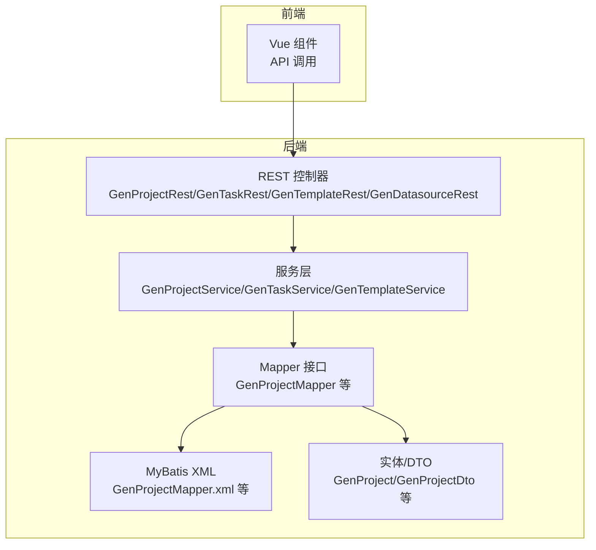
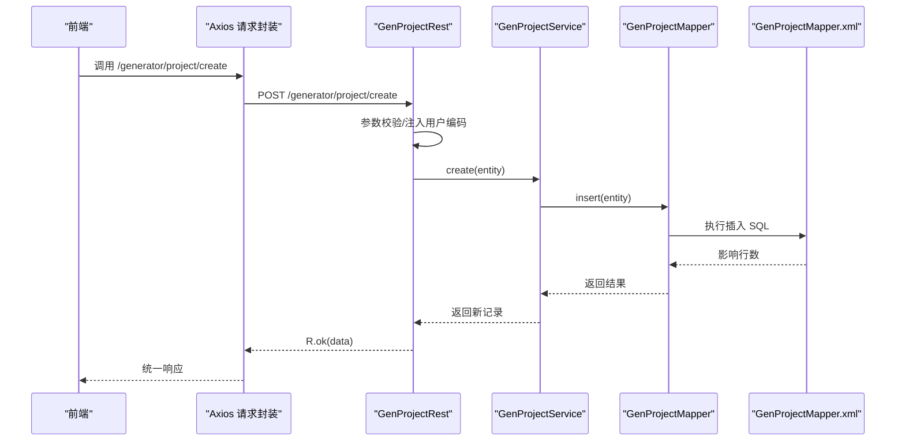
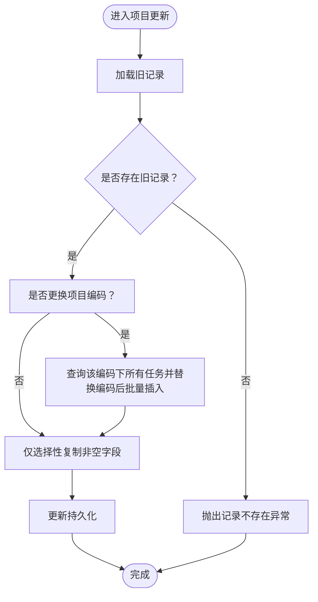
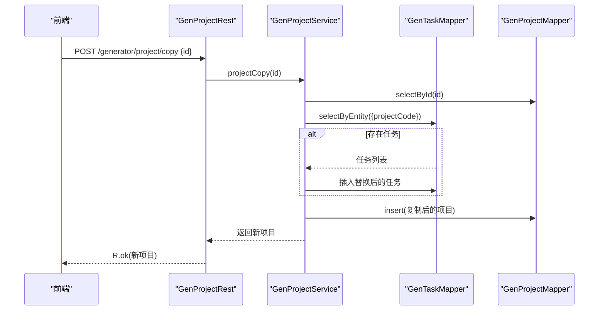
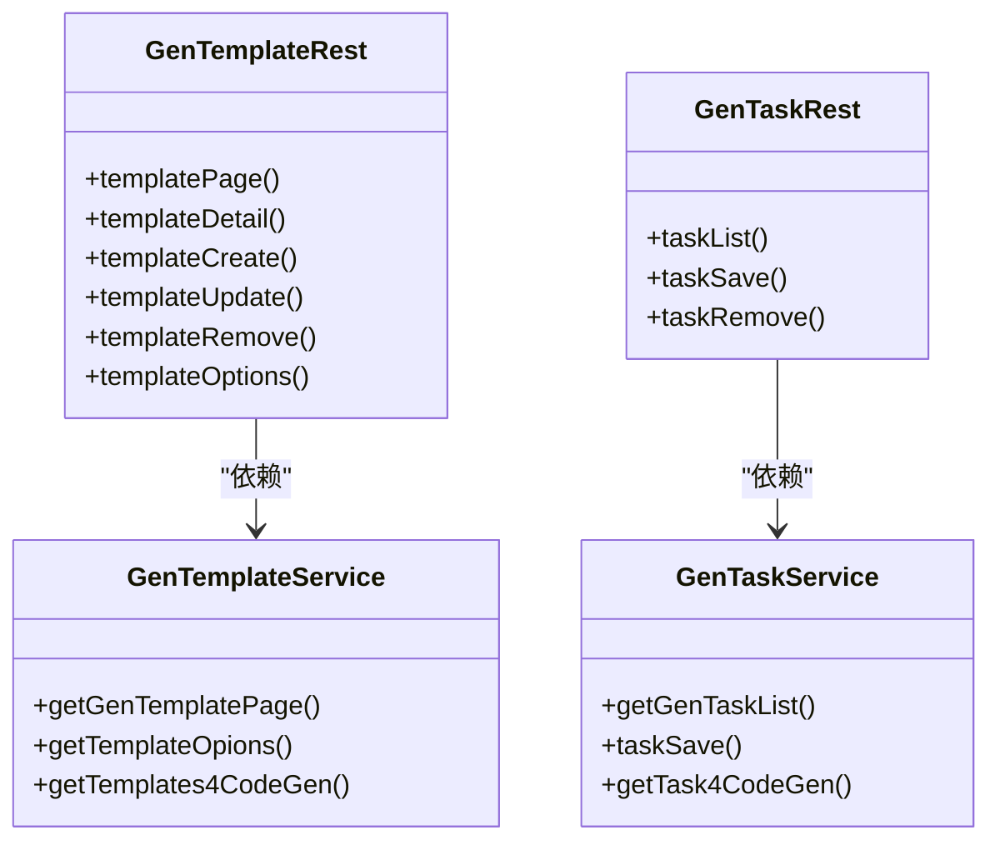
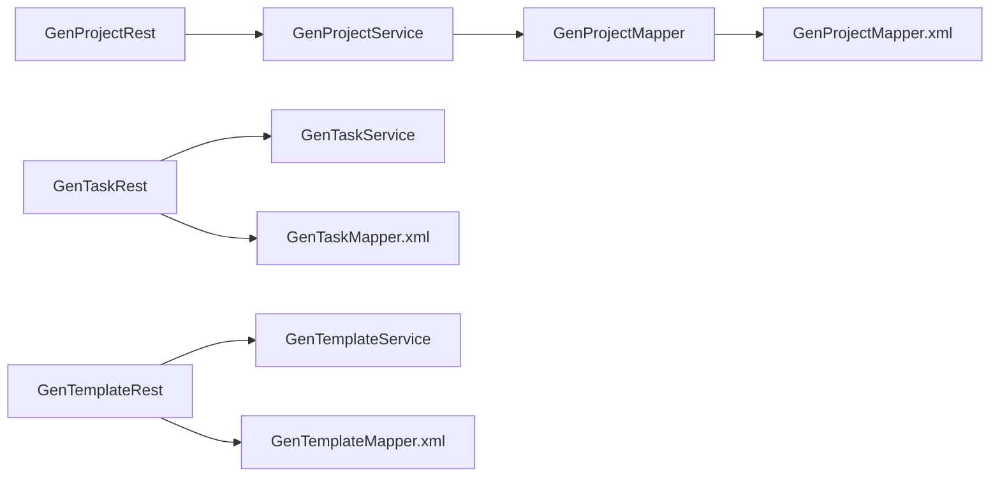

# 项目配置API

<cite>
**本文引用的文件**
- [GenProjectRest.java](file://generator-server/src/main/java/com/wkclz/generator/server/rest/GenProjectRest.java)
- [GenProjectService.java](file://generator-server/src/main/java/com/wkclz/generator/server/service/GenProjectService.java)
- [GenProjectMapper.java](file://generator-server/src/main/java/com/wkclz/generator/server/mapper/GenProjectMapper.java)
- [GenProject.java](file://generator-server/src/main/java/com/wkclz/generator/server/bean/entity/GenProject.java)
- [GenProjectDto.java](file://generator-server/src/main/java/com/wkclz/generator/server/bean/dto/GenProjectDto.java)
- [Route.java](file://generator-server/src/main/java/com/wkclz/generator/server/Route.java)
- [GenProjectMapper.xml](file://generator-server/src/main/resources/mapper/GenProjectMapper.xml)
- [GenTaskService.java](file://generator-server/src/main/java/com/wkclz/generator/server/service/GenTaskService.java)
- [GenTemplateService.java](file://generator-server/src/main/java/com/wkclz/generator/server/service/GenTemplateService.java)
- [GenTaskRest.java](file://generator-server/src/main/java/com/wkclz/generator/server/rest/GenTaskRest.java)
- [GenTemplateRest.java](file://generator-server/src/main/java/com/wkclz/generator/server/rest/GenTemplateRest.java)
- [GenDatasourceRest.java](file://generator-server/src/main/java/com/wkclz/generator/server/rest/GenDatasourceRest.java)
- [project.js](file://generator-ui/src/api/project.js)
- [request.js](file://generator-ui/src/utils/request.js)
- [application.yml](file://generator-server-starter/src/main/resources/config/application.yml)
</cite>

## 目录
1. [简介](#简介)
2. [项目结构](#项目结构)
3. [核心组件](#核心组件)
4. [架构总览](#架构总览)
5. [详细组件分析](#详细组件分析)
6. [依赖关系分析](#依赖关系分析)
7. [性能考量](#性能考量)
8. [故障排查指南](#故障排查指南)
9. [结论](#结论)
10. [附录：接口调用示例与最佳实践](#附录接口调用示例与最佳实践)

## 简介
本文件面向 SH-Generator 的“项目配置API”，系统性梳理项目 CRUD 接口设计、业务逻辑与数据流；深入解析项目复制功能的实现机制与使用场景；阐述项目详情查询与配置校验流程；说明项目模板关联与依赖管理的 API 设计；并给出权限控制与安全注意事项及具体接口调用示例与最佳实践。

## 项目结构
后端采用 Spring Boot + MyBatis 架构，按领域分层组织：
- 控制层（REST）：负责路由映射与请求参数校验
- 服务层（Service）：封装业务逻辑与事务控制
- 数据访问层（Mapper/XML）：SQL 映射与分页查询
- 领域模型（Entity/DTO）：数据结构与转换
- 前端 API 封装：统一请求与响应处理

图表来源
- [GenProjectRest.java:1-79](file://generator-server/src/main/java/com/wkclz/generator/server/rest/GenProjectRest.java#L1-L79)
- [GenProjectService.java:1-134](file://generator-server/src/main/java/com/wkclz/generator/server/service/GenProjectService.java#L1-L134)
- [GenProjectMapper.java:1-15](file://generator-server/src/main/java/com/wkclz/generator/server/mapper/GenProjectMapper.java#L1-L15)
- [GenProjectMapper.xml:1-38](file://generator-server/src/main/resources/mapper/GenProjectMapper.xml#L1-L38)
- [GenProject.java:1-108](file://generator-server/src/main/java/com/wkclz/generator/server/bean/entity/GenProject.java#L1-L108)
- [GenProjectDto.java:1-32](file://generator-server/src/main/java/com/wkclz/generator/server/bean/dto/GenProjectDto.java#L1-L32)

章节来源
- [Route.java:1-89](file://generator-server/src/main/java/com/wkclz/generator/server/Route.java#L1-L89)
- [application.yml:1-52](file://generator-server-starter/src/main/resources/config/application.yml#L1-L52)

## 核心组件
- 项目控制器：提供项目分页、详情、新增、修改、删除、复制接口
- 项目服务：封装分页查询、去重校验、复制逻辑、更新时模板任务迁移
- 项目 Mapper/XML：基于条件的动态查询与排序
- 任务服务：批量保存任务、差异计算与事务落库
- 模板服务：模板分页、选项、按需加载模板
- 数据源控制器：数据源分页、详情、新增、修改、删除、选项
- 前端 API：统一封装 /generator 前缀下的项目相关请求

章节来源
- [GenProjectRest.java:1-79](file://generator-server/src/main/java/com/wkclz/generator/server/rest/GenProjectRest.java#L1-L79)
- [GenProjectService.java:1-134](file://generator-server/src/main/java/com/wkclz/generator/server/service/GenProjectService.java#L1-L134)
- [GenProjectMapper.java:1-15](file://generator-server/src/main/java/com/wkclz/generator/server/mapper/GenProjectMapper.java#L1-L15)
- [GenProjectMapper.xml:1-38](file://generator-server/src/main/resources/mapper/GenProjectMapper.xml#L1-L38)
- [GenTaskService.java:1-114](file://generator-server/src/main/java/com/wkclz/generator/server/service/GenTaskService.java#L1-L114)
- [GenTemplateService.java:1-34](file://generator-server/src/main/java/com/wkclz/generator/server/service/GenTemplateService.java#L1-L34)
- [GenDatasourceRest.java:1-83](file://generator-server/src/main/java/com/wkclz/generator/server/rest/GenDatasourceRest.java#L1-L83)
- [project.js:1-34](file://generator-ui/src/api/project.js#L1-L34)
- [request.js:1-155](file://generator-ui/src/utils/request.js#L1-L155)

## 架构总览
下图展示“项目配置API”的端到端交互：前端通过统一请求工具发起 /generator 前缀请求，REST 层接收并做参数校验，随后调用服务层执行业务逻辑，服务层通过 Mapper 访问数据库，最终返回统一响应。

图表来源
- [project.js:18-21](file://generator-ui/src/api/project.js#L18-L21)
- [request.js:1-155](file://generator-ui/src/utils/request.js#L1-L155)
- [GenProjectRest.java:35-40](file://generator-server/src/main/java/com/wkclz/generator/server/rest/GenProjectRest.java#L35-L40)
- [GenProjectService.java:36-43](file://generator-server/src/main/java/com/wkclz/generator/server/service/GenProjectService.java#L36-L43)
- [GenProjectMapper.java:1-15](file://generator-server/src/main/java/com/wkclz/generator/server/mapper/GenProjectMapper.java#L1-L15)
- [GenProjectMapper.xml:1-38](file://generator-server/src/main/resources/mapper/GenProjectMapper.xml#L1-L38)

## 详细组件分析

### 项目配置 CRUD 接口设计与业务逻辑
- 接口清单与路由前缀
  - 分页：GET /generator/project/page
  - 详情：GET /generator/project/detail
  - 新增：POST /generator/project/create
  - 修改：POST /generator/project/update
  - 删除：POST /generator/project/remove
  - 复制：POST /generator/project/copy
- 参数校验与默认值
  - 新增时自动注入用户编码；必填字段包括数据库编码、模块名、项目名称等
  - 更新时要求携带版本号与项目编码等
- 业务逻辑要点
  - 去重校验：当传入项目编码时，若数据库已存在且非当前记录，则抛出重复异常
  - 更新策略：支持仅更新非空字段；当更换项目编码时，同步迁移该编码下的任务记录
  - 复制策略：生成新的项目编码，复制该项目的所有任务并写入新编码，同时重命名项目名称

图表来源
- [GenProjectService.java:45-68](file://generator-server/src/main/java/com/wkclz/generator/server/service/GenProjectService.java#L45-L68)
- [GenProjectService.java:54-63](file://generator-server/src/main/java/com/wkclz/generator/server/service/GenProjectService.java#L54-L63)

章节来源
- [GenProjectRest.java:22-54](file://generator-server/src/main/java/com/wkclz/generator/server/rest/GenProjectRest.java#L22-L54)
- [GenProjectRest.java:64-75](file://generator-server/src/main/java/com/wkclz/generator/server/rest/GenProjectRest.java#L64-L75)
- [GenProjectService.java:36-68](file://generator-server/src/main/java/com/wkclz/generator/server/service/GenProjectService.java#L36-L68)
- [GenProjectService.java:112-131](file://generator-server/src/main/java/com/wkclz/generator/server/service/GenProjectService.java#L112-L131)
- [GenProjectMapper.xml:24-30](file://generator-server/src/main/resources/mapper/GenProjectMapper.xml#L24-L30)

### 项目复制功能实现机制与使用场景
- 实现机制
  - 读取原项目记录，生成新的项目编码
  - 查询该编码下的全部任务，将任务中的项目编码替换为新编码后批量插入
  - 将原项目复制为新项目，新项目名称前缀带“复制自”
- 使用场景
  - 快速克隆现有项目配置，用于不同环境或模块的复用
  - 在模板或任务发生调整后，保留原始配置的同时进行对比与迭代

图表来源
- [GenProjectRest.java:56-61](file://generator-server/src/main/java/com/wkclz/generator/server/rest/GenProjectRest.java#L56-L61)
- [GenProjectService.java:72-93](file://generator-server/src/main/java/com/wkclz/generator/server/service/GenProjectService.java#L72-L93)
- [GenTaskService.java:27-105](file://generator-server/src/main/java/com/wkclz/generator/server/service/GenTaskService.java#L27-L105)

章节来源
- [GenProjectRest.java:56-61](file://generator-server/src/main/java/com/wkclz/generator/server/rest/GenProjectRest.java#L56-L61)
- [GenProjectService.java:72-93](file://generator-server/src/main/java/com/wkclz/generator/server/service/GenProjectService.java#L72-L93)

### 项目详情查询与配置验证
- 详情查询
  - GET /generator/project/detail 支持按 id 或其他条件查询
  - 返回实体对象，包含项目基础信息
- 配置验证
  - 新增/更新时对关键字段进行非空校验
  - 唯一性校验：当传入项目编码时，确保全局唯一
  - 版本号校验：更新时必须携带版本号，避免并发覆盖

章节来源
- [GenProjectRest.java:28-33](file://generator-server/src/main/java/com/wkclz/generator/server/rest/GenProjectRest.java#L28-L33)
- [GenProjectRest.java:64-75](file://generator-server/src/main/java/com/wkclz/generator/server/rest/GenProjectRest.java#L64-L75)
- [GenProjectService.java:112-131](file://generator-server/src/main/java/com/wkclz/generator/server/service/GenProjectService.java#L112-L131)

### 项目模板关联与依赖管理
- 模板相关接口
  - 模板分页、详情、新增、修改、删除、选项
  - 选项接口用于前端渲染可选模板列表
- 任务与模板的绑定
  - 任务保存接口支持批量保存，内部进行新增/更新/删除的差异计算
  - 单次操作限定同一项目编码，且每个模板在任务列表中唯一
- 生成时的模板加载
  - 可按模板编码集合加载模板内容，供代码生成使用

图表来源
- [GenTemplateRest.java:1-82](file://generator-server/src/main/java/com/wkclz/generator/server/rest/GenTemplateRest.java#L1-L82)
- [GenTemplateService.java:1-34](file://generator-server/src/main/java/com/wkclz/generator/server/service/GenTemplateService.java#L1-L34)
- [GenTaskRest.java:1-75](file://generator-server/src/main/java/com/wkclz/generator/server/rest/GenTaskRest.java#L1-L75)
- [GenTaskService.java:1-114](file://generator-server/src/main/java/com/wkclz/generator/server/service/GenTaskService.java#L1-L114)

章节来源
- [GenTemplateRest.java:25-63](file://generator-server/src/main/java/com/wkclz/generator/server/rest/GenTemplateRest.java#L25-L63)
- [GenTaskRest.java:25-44](file://generator-server/src/main/java/com/wkclz/generator/server/rest/GenTaskRest.java#L25-L44)
- [GenTaskService.java:27-105](file://generator-server/src/main/java/com/wkclz/generator/server/service/GenTaskService.java#L27-L105)
- [GenTemplateService.java:16-31](file://generator-server/src/main/java/com/wkclz/generator/server/service/GenTemplateService.java#L16-L31)

### 权限控制与安全考虑
- 会话与令牌
  - 请求头注入 token 与 app-code，用于后端鉴权
  - 前端统一拦截器处理重复提交、超时、401 重登等
- 字段安全
  - 数据源详情返回时移除敏感字段（如密码），避免泄露
- 并发与一致性
  - 更新时要求携带版本号，防止乐观锁冲突
  - 事务包裹批量任务保存，保证新增/更新/删除原子性

章节来源
- [request.js:26-73](file://generator-ui/src/utils/request.js#L26-L73)
- [request.js:75-125](file://generator-ui/src/utils/request.js#L75-L125)
- [GenDatasourceRest.java:30-36](file://generator-server/src/main/java/com/wkclz/generator/server/rest/GenDatasourceRest.java#L30-L36)
- [GenTaskRest.java:56-57](file://generator-server/src/main/java/com/wkclz/generator/server/rest/GenTaskRest.java#L56-L57)
- [GenProjectRest.java:69-70](file://generator-server/src/main/java/com/wkclz/generator/server/rest/GenProjectRest.java#L69-L70)

## 依赖关系分析
- 控制器依赖服务层，服务层依赖 Mapper 接口，Mapper 通过 XML 定义 SQL
- 项目服务依赖任务 Mapper 进行复制与更新时的任务迁移
- 前端通过统一请求封装与后端交互，路由前缀统一为 /generator

图表来源
- [GenProjectRest.java:1-79](file://generator-server/src/main/java/com/wkclz/generator/server/rest/GenProjectRest.java#L1-L79)
- [GenProjectService.java:1-134](file://generator-server/src/main/java/com/wkclz/generator/server/service/GenProjectService.java#L1-L134)
- [GenProjectMapper.java:1-15](file://generator-server/src/main/java/com/wkclz/generator/server/mapper/GenProjectMapper.java#L1-L15)
- [GenProjectMapper.xml:1-38](file://generator-server/src/main/resources/mapper/GenProjectMapper.xml#L1-L38)
- [GenTaskRest.java:1-75](file://generator-server/src/main/java/com/wkclz/generator/server/rest/GenTaskRest.java#L1-L75)
- [GenTemplateRest.java:1-82](file://generator-server/src/main/java/com/wkclz/generator/server/rest/GenTemplateRest.java#L1-L82)

章节来源
- [Route.java:41-53](file://generator-server/src/main/java/com/wkclz/generator/server/Route.java#L41-L53)

## 性能考量
- 分页查询：后端使用分页查询，前端传入条件（项目编码/模块名/项目名/用户/数据库）进行过滤，SQL 中使用 LIKE 与排序，建议在高频字段上建立索引
- 批量任务保存：通过差异计算减少数据库往返，建议控制单次任务数量，避免过大批次导致内存与事务压力
- 复制操作：复制任务时批量插入，注意数据库批量写入性能与事务回滚成本

## 故障排查指南
- 常见错误码与处理
  - 401 会话失效：前端弹窗引导重新登录
  - 500 服务器错误：统一错误提示与日志定位
  - 601 参数校验失败：检查必填字段与格式
- 参数校验异常
  - 缺少 id、版本号、项目编码、模板编码等关键字段
  - 更新时未携带版本号或 id
- 业务异常
  - 记录不存在、记录重复、一次只能操作一个项目、模板在任务中重复

章节来源
- [request.js:85-96](file://generator-ui/src/utils/request.js#L85-L96)
- [GenProjectRest.java:30-31](file://generator-server/src/main/java/com/wkclz/generator/server/rest/GenProjectRest.java#L30-L31)
- [GenProjectRest.java:49-52](file://generator-server/src/main/java/com/wkclz/generator/server/rest/GenProjectRest.java#L49-L52)
- [GenProjectRest.java:68-70](file://generator-server/src/main/java/com/wkclz/generator/server/rest/GenProjectRest.java#L68-L70)
- [GenTaskRest.java:47-71](file://generator-server/src/main/java/com/wkclz/generator/server/rest/GenTaskRest.java#L47-L71)
- [GenTemplateRest.java:66-78](file://generator-server/src/main/java/com/wkclz/generator/server/rest/GenTemplateRest.java#L66-L78)

## 结论
项目配置API以清晰的分层架构实现了完整的 CRUD、复制与模板关联能力，并通过参数校验、唯一性约束、版本号控制与事务保障，确保了数据一致性与安全性。前端统一请求封装提供了良好的错误处理与用户体验。建议在生产环境中配合索引优化、批量大小控制与会话安全策略，持续提升稳定性与性能。

## 附录：接口调用示例与最佳实践
- 前端调用示例（基于封装）
  - 新增项目：调用 projectCreate，传入项目基础信息与模板任务列表
  - 更新项目：调用 projectUpdate，携带版本号与变更字段
  - 删除项目：调用 projectRemove，传入 id
  - 复制项目：调用 projectCopy，传入 id
  - 详情查询：调用 projectDetail，传入 id 或项目编码
  - 分页查询：调用 projectPage，传入筛选条件
- 最佳实践
  - 新增时尽量让后端生成项目编码，避免冲突
  - 更新时务必携带版本号，避免并发覆盖
  - 批量保存任务前先校验模板唯一性与项目一致性
  - 密码等敏感字段在返回体中应被屏蔽
  - 对高频查询字段建立数据库索引，优化分页性能

章节来源
- [project.js:1-34](file://generator-ui/src/api/project.js#L1-L34)
- [request.js:1-155](file://generator-ui/src/utils/request.js#L1-L155)
- [GenProjectRest.java:35-61](file://generator-server/src/main/java/com/wkclz/generator/server/rest/GenProjectRest.java#L35-L61)
- [GenTaskRest.java:32-37](file://generator-server/src/main/java/com/wkclz/generator/server/rest/GenTaskRest.java#L32-L37)
- [GenDatasourceRest.java:38-57](file://generator-server/src/main/java/com/wkclz/generator/server/rest/GenDatasourceRest.java#L38-L57)