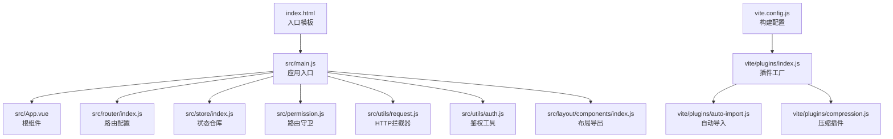
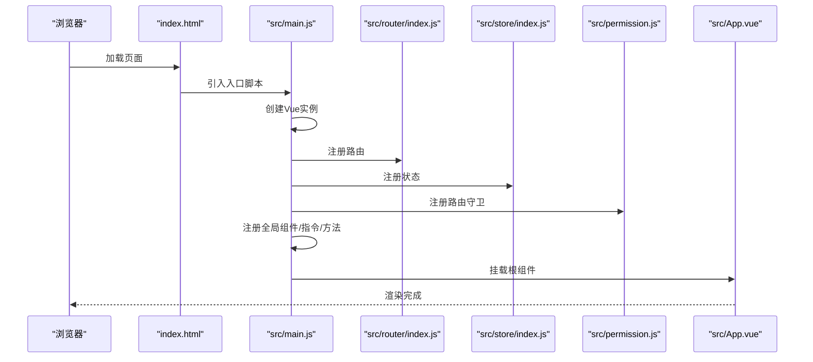
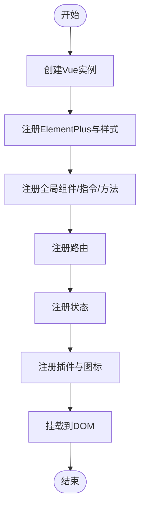
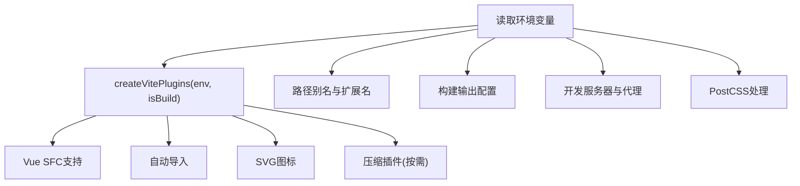
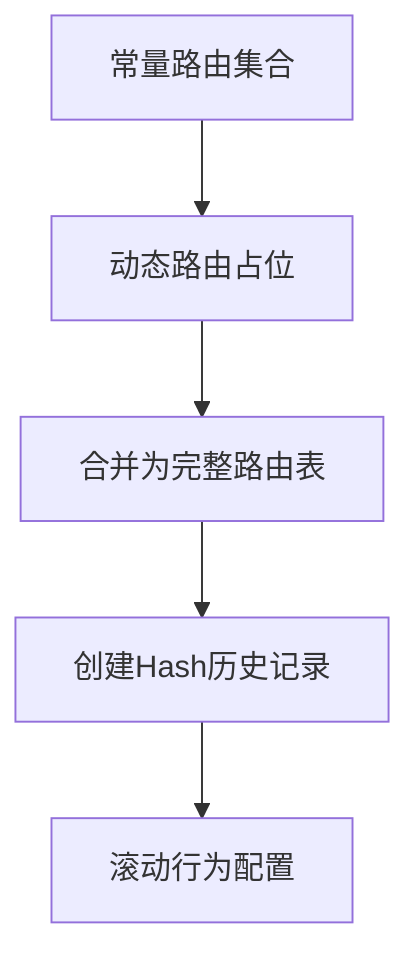
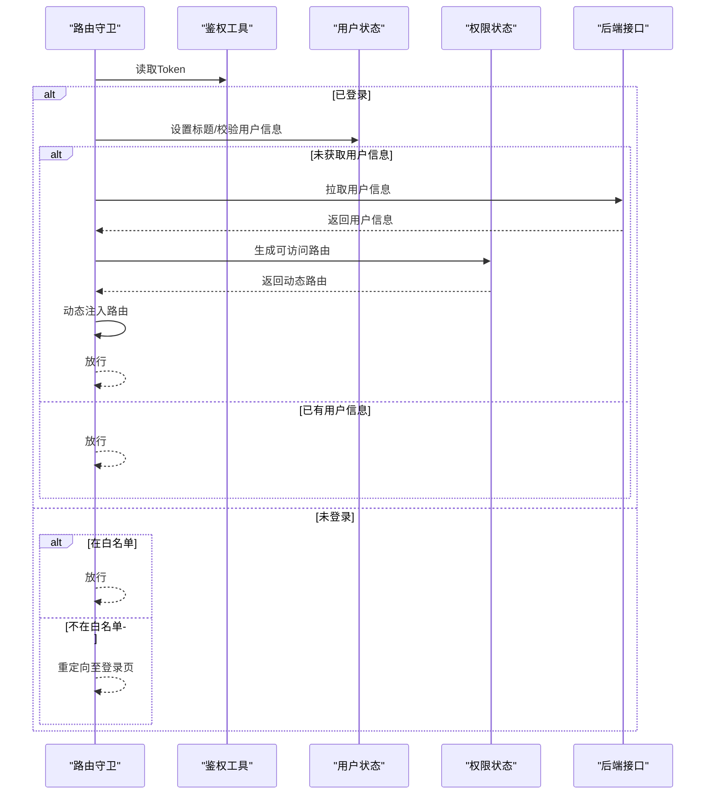
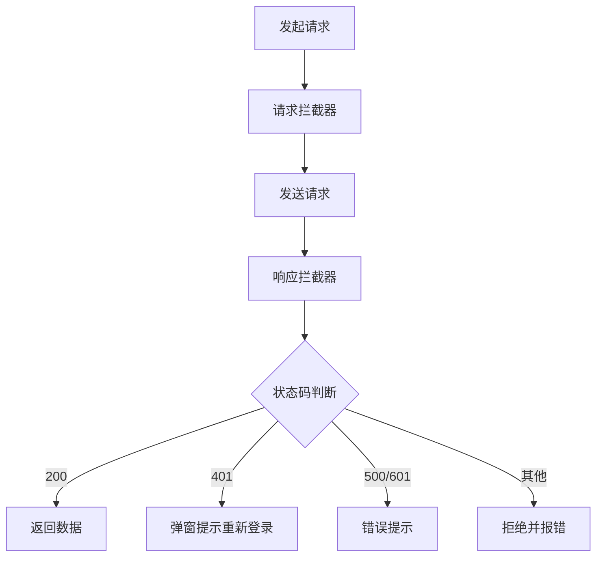
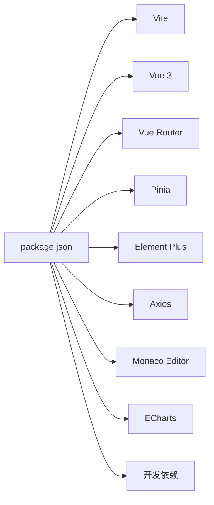

# Vue 3应用结构

<cite>
**本文引用的文件**
- [main.js](file://generator-ui/src/main.js)
- [vite.config.js](file://generator-ui/vite.config.js)
- [package.json](file://generator-ui/package.json)
- [index.html](file://generator-ui/index.html)
- [plugins/index.js](file://generator-ui/vite/plugins/index.js)
- [auto-import.js](file://generator-ui/vite/plugins/auto-import.js)
- [compression.js](file://generator-ui/vite/plugins/compression.js)
- [router/index.js](file://generator-ui/src/router/index.js)
- [store/index.js](file://generator-ui/src/store/index.js)
- [permission.js](file://generator-ui/src/permission.js)
- [request.js](file://generator-ui/src/utils/request.js)
- [auth.js](file://generator-ui/src/utils/auth.js)
- [App.vue](file://generator-ui/src/App.vue)
- [layout/components/index.js](file://generator-ui/src/layout/components/index.js)
- [env.js](file://generator-ui/env.js)
</cite>

## 目录
1. [简介](#简介)
2. [项目结构](#项目结构)
3. [核心组件](#核心组件)
4. [架构总览](#架构总览)
5. [详细组件分析](#详细组件分析)
6. [依赖分析](#依赖分析)
7. [性能考虑](#性能考虑)
8. [故障排查指南](#故障排查指南)
9. [结论](#结论)
10. [附录](#附录)

## 简介
本文件面向 SH-Generator 的前端 Vue 3 应用，围绕应用入口配置与初始化流程（main.js）、Vite 构建配置（vite.config.js）以及整体目录结构与模块化组织策略展开，提供可操作的架构解读、最佳实践与排障建议。读者无需深入源码即可理解应用启动、路由守卫、状态管理、HTTP 请求拦截与构建优化等关键环节。

## 项目结构
generator-ui 采用“按功能域划分”的模块化组织方式，入口文件位于 src/main.js，通过路由、状态管理、指令与插件体系完成应用装配；构建配置集中在 vite.config.js，并通过插件工厂统一注入开发与生产阶段能力；运行时通过 index.html 引入入口脚本并挂载到 DOM。

图表来源
- [index.html:1-216](file://generator-ui/index.html#L1-L216)
- [main.js:1-105](file://generator-ui/src/main.js#L1-L105)
- [App.vue:1-16](file://generator-ui/src/App.vue#L1-L16)
- [router/index.js:1-86](file://generator-ui/src/router/index.js#L1-L86)
- [store/index.js:1-3](file://generator-ui/src/store/index.js#L1-L3)
- [permission.js:1-74](file://generator-ui/src/permission.js#L1-L74)
- [request.js:1-155](file://generator-ui/src/utils/request.js#L1-L155)
- [auth.js:1-14](file://generator-ui/src/utils/auth.js#L1-L14)
- [layout/components/index.js:1-5](file://generator-ui/src/layout/components/index.js#L1-L5)
- [vite.config.js:1-72](file://generator-ui/vite.config.js#L1-L72)
- [plugins/index.js:1-16](file://generator-ui/vite/plugins/index.js#L1-L16)
- [auto-import.js:1-13](file://generator-ui/vite/plugins/auto-import.js#L1-L13)
- [compression.js:1-26](file://generator-ui/vite/plugins/compression.js#L1-L26)

章节来源
- [index.html:1-216](file://generator-ui/index.html#L1-L216)
- [main.js:1-105](file://generator-ui/src/main.js#L1-L105)
- [vite.config.js:1-72](file://generator-ui/vite.config.js#L1-L72)

## 核心组件
- 应用入口与初始化：负责创建 Vue 实例、注册 Element Plus、全局组件与指令、全局方法、插件与路由/状态，最终挂载到 DOM。
- 路由系统：采用 hash 模式，定义常量路由与动态路由占位，结合权限守卫实现按需加载。
- 状态管理：基于 Pinia 的轻量状态容器，集中管理应用设置、用户信息与权限。
- 权限控制：前置守卫根据 Token 与白名单策略决定放行或重定向至登录页。
- HTTP 客户端：基于 Axios 的二次封装，内置请求/响应拦截、重复提交防护、错误提示与下载能力。
- 构建插件：通过插件工厂统一注入 Vue SFC 支持、自动导入、SVG 图标、Gzip/Brotli 压缩等能力。

章节来源
- [main.js:1-105](file://generator-ui/src/main.js#L1-L105)
- [router/index.js:1-86](file://generator-ui/src/router/index.js#L1-L86)
- [store/index.js:1-3](file://generator-ui/src/store/index.js#L1-L3)
- [permission.js:1-74](file://generator-ui/src/permission.js#L1-L74)
- [request.js:1-155](file://generator-ui/src/utils/request.js#L1-L155)

## 架构总览
下图展示了从浏览器加载到应用就绪的关键交互：HTML 加载入口脚本，main.js 初始化应用，随后加载路由、状态、权限与工具模块，最后渲染根组件。

图表来源
- [index.html:212-212](file://generator-ui/index.html#L212-L212)
- [main.js:64-104](file://generator-ui/src/main.js#L64-L104)
- [router/index.js:74-83](file://generator-ui/src/router/index.js#L74-L83)
- [store/index.js:1-3](file://generator-ui/src/store/index.js#L1-L3)
- [permission.js:20-69](file://generator-ui/src/permission.js#L20-L69)
- [App.vue:1-16](file://generator-ui/src/App.vue#L1-L16)

## 详细组件分析

### 应用入口与初始化（main.js）
- Vue 实例创建与挂载：通过 createApp(App) 创建实例，随后挂载到 #app。
- 插件与库集成：引入 Element Plus（含中文字体与暗色变量）、全局样式、SVG 图标注册、自定义指令与插件系统。
- 全局组件与方法：批量注册业务组件与工具方法（如字典、日期、树形处理等），挂载到全局属性以供任意组件使用。
- 路由与状态：按序 use 路由与状态，确保守卫与组件生命周期内可用。
- 国际化与主题：设置 Element Plus 语言与默认尺寸，初始化主题样式。

图表来源
- [main.js:64-104](file://generator-ui/src/main.js#L64-L104)

章节来源
- [main.js:1-105](file://generator-ui/src/main.js#L1-L105)

### Vite 构建配置（vite.config.js）
- 基础路径与解析：设置 base 与路径别名（~、@），声明支持的扩展名。
- 插件系统：通过 createVitePlugins(env, isBuild) 统一注入 Vue、自动导入、SVG 图标与压缩插件。
- 构建输出：开启 inline 源码映射用于开发，生产关闭；Rollup 输出命名策略统一；警告阈值提升。
- 开发服务器：本地端口、主机、自动打开浏览器；配置 /api 代理到后端服务。
- CSS 处理：移除 charset 规则，避免重复声明。

图表来源
- [vite.config.js:6-71](file://generator-ui/vite.config.js#L6-L71)
- [plugins/index.js:8-15](file://generator-ui/vite/plugins/index.js#L8-L15)

章节来源
- [vite.config.js:1-72](file://generator-ui/vite.config.js#L1-L72)
- [plugins/index.js:1-16](file://generator-ui/vite/plugins/index.js#L1-L16)
- [auto-import.js:1-13](file://generator-ui/vite/plugins/auto-import.js#L1-L13)
- [compression.js:1-26](file://generator-ui/vite/plugins/compression.js#L1-L26)

### 路由系统（router/index.js）
- 常量路由：包含登录、重定向、404/401、用户中心等基础路由。
- 动态路由：预留占位，配合权限模块按需生成并注入。
- 历史模式：使用 hash 模式，利于静态部署。
- 滚动行为：提供滚动到顶部的默认行为。

图表来源
- [router/index.js:28-83](file://generator-ui/src/router/index.js#L28-L83)

章节来源
- [router/index.js:1-86](file://generator-ui/src/router/index.js#L1-L86)

### 权限控制（permission.js）
- 白名单：免登录路由集合。
- 前置守卫：检测 Token，设置标题，拉取用户信息与权限，动态注入可访问路由，处理 401 场景并弹窗提示重新登录。
- 进度条：NProgress 控制加载状态。
- 结束钩子：完成后关闭进度条。

图表来源
- [permission.js:20-69](file://generator-ui/src/permission.js#L20-L69)
- [auth.js:1-14](file://generator-ui/src/utils/auth.js#L1-L14)

章节来源
- [permission.js:1-74](file://generator-ui/src/permission.js#L1-L74)
- [auth.js:1-14](file://generator-ui/src/utils/auth.js#L1-L14)

### HTTP 客户端（utils/request.js）
- 基础配置：baseURL 来自环境变量，超时时间、请求头默认值。
- 请求拦截：Token 注入、GET 参数序列化、POST/PUT 防重复提交（基于会话缓存）。
- 响应拦截：状态码映射、错误消息提示、401 重新登录弹窗、超时/网络异常处理。
- 下载能力：支持 Blob 下载与错误提示。

图表来源
- [request.js:17-125](file://generator-ui/src/utils/request.js#L17-L125)
- [env.js:1-40](file://generator-ui/env.js#L1-L40)

章节来源
- [request.js:1-155](file://generator-ui/src/utils/request.js#L1-L155)
- [env.js:1-40](file://generator-ui/env.js#L1-L40)

### 状态管理（store/index.js）
- 仓库初始化：创建 Pinia 实例并导出，作为全局状态容器。

章节来源
- [store/index.js:1-3](file://generator-ui/src/store/index.js#L1-L3)

### 根组件与布局（App.vue 与 layout/components/index.js）
- 根组件：通过 router-view 渲染视图，挂载时初始化主题样式。
- 布局导出：统一导出常用布局组件，便于页面复用。

章节来源
- [App.vue:1-16](file://generator-ui/src/App.vue#L1-L16)
- [layout/components/index.js:1-5](file://generator-ui/src/layout/components/index.js#L1-L5)

## 依赖分析
- 运行时依赖：Vue 3、Vue Router、Pinia、Element Plus、Axios、Monaco Editor、ECharts 等。
- 开发依赖：Vite、@vitejs/plugin-vue、unplugin-auto-import、vite-plugin-compression、vite-plugin-svg-icons 等。
- 脚本命令：dev、build、build:stage、preview。

图表来源
- [package.json:1-53](file://generator-ui/package.json#L1-L53)

章节来源
- [package.json:1-53](file://generator-ui/package.json#L1-L53)

## 性能考虑
- 构建优化
  - 按需启用压缩插件（Gzip/Brotli），降低传输体积。
  - Rollup 输出命名带哈希，有利于长期缓存与增量更新。
  - 提升 chunkSizeWarningLimit，避免过大包触发告警。
- 运行时优化
  - 使用自动导入减少样板代码，提高开发效率。
  - 将全局样式与图标按需引入，避免首屏冗余。
  - 合理拆分路由与组件，利用路由懒加载与 keep-alive 缓存。
- 网络与安全
  - 请求拦截器内置防重复提交，避免大体积请求重复提交。
  - 401 重新登录弹窗，保障会话有效性。
  - 明确的错误码映射与统一提示，提升用户体验。

## 故障排查指南
- 登录后无法跳转或白屏
  - 检查路由守卫中的 Token 读取与用户信息拉取逻辑。
  - 确认动态路由注入是否成功，是否存在非法路径。
- 接口 401 或频繁要求重新登录
  - 查看响应拦截器对 401 的处理与弹窗逻辑。
  - 核对鉴权工具的 Token 存储与过期策略。
- 代理不生效或跨域
  - 确认 /api 代理目标与 changeOrigin、rewrite 配置。
  - 检查后端 CORS 与网关策略。
- 构建产物体积过大
  - 检查是否启用压缩插件，确认 Rollup 输出命名策略。
  - 分析第三方库是否按需引入，避免全量打包。

章节来源
- [permission.js:20-69](file://generator-ui/src/permission.js#L20-L69)
- [request.js:98-125](file://generator-ui/src/utils/request.js#L98-L125)
- [auth.js:1-14](file://generator-ui/src/utils/auth.js#L1-L14)
- [vite.config.js:45-52](file://generator-ui/vite.config.js#L45-L52)
- [compression.js:1-26](file://generator-ui/vite/plugins/compression.js#L1-L26)

## 结论
本项目以 main.js 为核心入口，结合路由守卫、状态管理与 HTTP 拦截器形成完整的运行时闭环；通过 Vite 插件工厂与构建配置实现开发与生产的高效协同。遵循模块化与按需加载的原则，既保证了开发体验，也兼顾了运行时性能与可维护性。

## 附录
- 环境变量与 API 基址：通过 env.js 动态识别环境并注入 baseApi，便于多环境切换与本地 Mock。
- 入口模板：index.html 中引入入口脚本并提供基础样式与加载动画。

章节来源
- [env.js:1-40](file://generator-ui/env.js#L1-L40)
- [index.html:1-216](file://generator-ui/index.html#L1-L216)