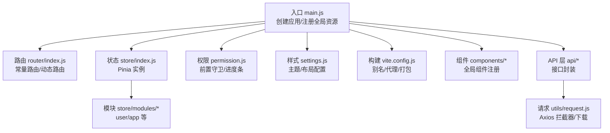
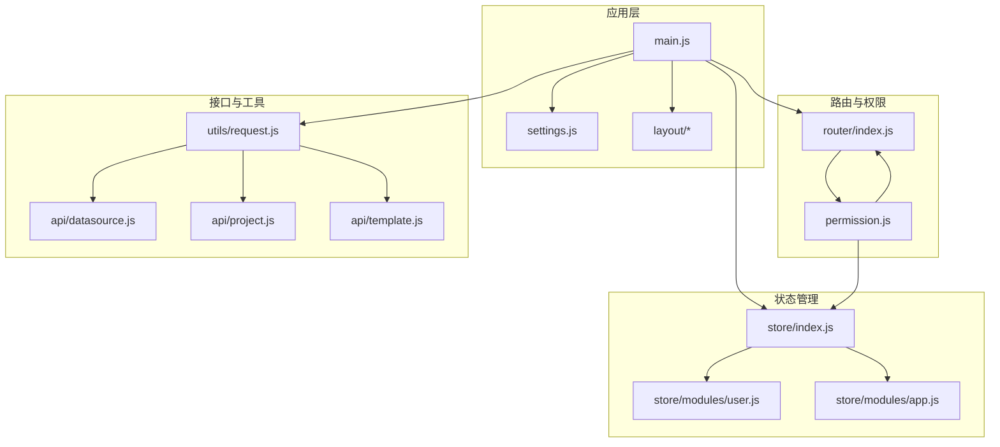
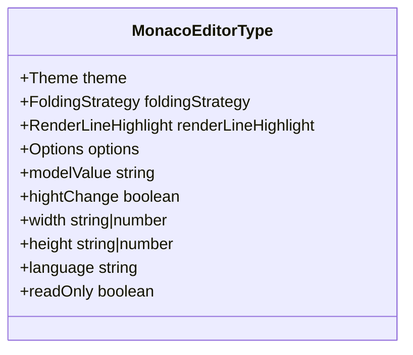
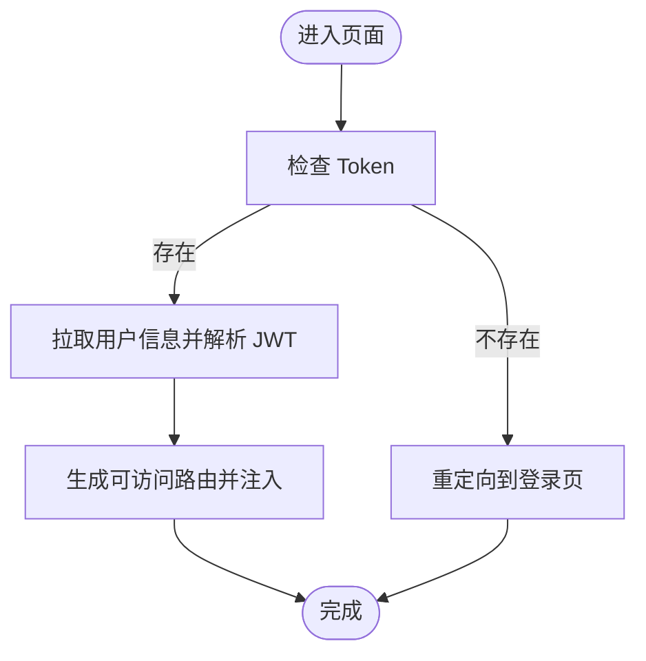
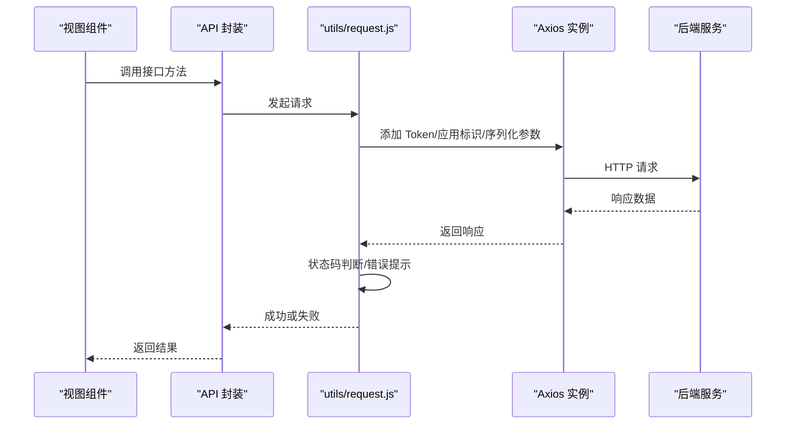
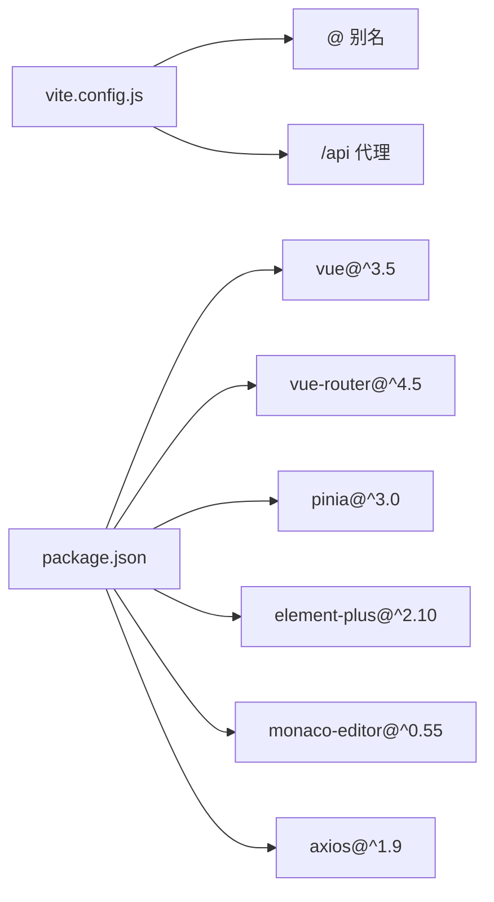

# 前端界面架构

<cite>
**本文引用的文件**
- [main.js](file://generator-ui/src/main.js)
- [package.json](file://generator-ui/package.json)
- [vite.config.js](file://generator-ui/vite.config.js)
- [settings.js](file://generator-ui/src/settings.js)
- [router/index.js](file://generator-ui/src/router/index.js)
- [store/index.js](file://generator-ui/src/store/index.js)
- [utils/request.js](file://generator-ui/src/utils/request.js)
- [permission.js](file://generator-ui/src/permission.js)
- [components/MonacoEditor/MonacoEditorType.ts](file://generator-ui/src/components/MonacoEditor/MonacoEditorType.ts)
- [layout/components/index.js](file://generator-ui/src/layout/components/index.js)
- [store/modules/user.js](file://generator-ui/src/store/modules/user.js)
- [store/modules/app.js](file://generator-ui/src/store/modules/app.js)
- [api/datasource.js](file://generator-ui/src/api/datasource.js)
- [api/project.js](file://generator-ui/src/api/project.js)
- [api/template.js](file://generator-ui/src/api/template.js)
</cite>

## 目录
1. [引言](#引言)
2. [项目结构](#项目结构)
3. [核心组件](#核心组件)
4. [架构总览](#架构总览)
5. [详细组件分析](#详细组件分析)
6. [依赖关系分析](#依赖关系分析)
7. [性能考虑](#性能考虑)
8. [故障排查指南](#故障排查指南)
9. [结论](#结论)
10. [附录](#附录)

## 引言
本文件面向 SH-Generator 前端界面，系统性梳理 Vue 3 应用的整体架构与组件层次，覆盖应用入口配置、路由设计、状态管理策略、核心 UI 组件（含 Monaco 编辑器、表格、表单等）、API 接口层（请求/响应拦截与错误处理）、以及组件通信与复用策略。目标是帮助开发者快速理解并高效扩展前端能力。

## 项目结构
- 构建与运行：基于 Vite 6，通过脚本管理开发、构建与预览；代理配置指向后端服务。
- 依赖管理：使用 Vue 3.5、Element Plus、Pinia、Vue Router、Monaco Editor 等生态库。
- 目录组织：采用按功能域划分的结构，包含 API、组件、布局、插件、路由、状态管理、工具函数等。

图示来源
- [main.js:1-105](file://generator-ui/src/main.js#L1-L105)
- [router/index.js:1-86](file://generator-ui/src/router/index.js#L1-L86)
- [store/index.js:1-3](file://generator-ui/src/store/index.js#L1-L3)
- [permission.js:1-74](file://generator-ui/src/permission.js#L1-L74)
- [settings.js:1-60](file://generator-ui/src/settings.js#L1-L60)
- [vite.config.js:1-72](file://generator-ui/vite.config.js#L1-L72)
- [utils/request.js:1-155](file://generator-ui/src/utils/request.js#L1-L155)
- [api/datasource.js:1-33](file://generator-ui/src/api/datasource.js#L1-L33)
- [api/project.js:1-34](file://generator-ui/src/api/project.js#L1-L34)
- [api/template.js:1-33](file://generator-ui/src/api/template.js#L1-L33)

章节来源
- [main.js:1-105](file://generator-ui/src/main.js#L1-L105)
- [package.json:1-53](file://generator-ui/package.json#L1-L53)
- [vite.config.js:1-72](file://generator-ui/vite.config.js#L1-L72)
- [settings.js:1-60](file://generator-ui/src/settings.js#L1-L60)

## 核心组件
- 应用入口与全局装配
  - 创建 Vue 应用，安装路由、状态、插件、指令与 Element Plus，并注册大量全局组件与全局方法，统一 UI 规范与交互体验。
  - SVG 图标系统与自定义组件（分页、富文本、上传、字典标签、表格设置、布局切分等）集中注册，便于视图层直接使用。
- 路由体系
  - 定义常量路由（登录、404、重定向、401 等），动态路由预留为空数组，后续根据权限动态注入。
  - 提供滚动行为控制，保证页面切换时的用户体验。
- 权限与导航
  - 基于 NProgress 的加载进度条，结合 Token 校验与用户信息拉取，实现登录态校验与路由守卫。
  - 白名单机制支持免登录访问，其余路由统一跳转至登录页并携带重定向地址。
- 状态管理
  - Pinia 实例集中导出，模块化组织用户、应用、权限、标签页、设置等状态，支持本地存储持久化。
- API 与请求层
  - Axios 实例封装，统一设置基础 URL、超时、请求头；实现请求去重、GET 参数序列化、响应状态码映射、错误提示与自动登出。
  - 提供通用下载方法，支持 Blob 下载与错误提示。
- 主题与布局
  - 通过 settings.js 控制标题、侧边栏主题、导航模式、固定头部、Logo、动态标题与版权等全局配置。

章节来源
- [main.js:1-105](file://generator-ui/src/main.js#L1-L105)
- [router/index.js:1-86](file://generator-ui/src/router/index.js#L1-L86)
- [permission.js:1-74](file://generator-ui/src/permission.js#L1-L74)
- [store/index.js:1-3](file://generator-ui/src/store/index.js#L1-L3)
- [store/modules/user.js:1-92](file://generator-ui/src/store/modules/user.js#L1-L92)
- [store/modules/app.js:1-45](file://generator-ui/src/store/modules/app.js#L1-L45)
- [utils/request.js:1-155](file://generator-ui/src/utils/request.js#L1-L155)
- [settings.js:1-60](file://generator-ui/src/settings.js#L1-L60)

## 架构总览
下图展示了从入口到各子系统的交互关系，体现“入口装配—路由—权限—状态—API—UI 组件”的主干流程。

图示来源
- [main.js:1-105](file://generator-ui/src/main.js#L1-L105)
- [router/index.js:1-86](file://generator-ui/src/router/index.js#L1-L86)
- [permission.js:1-74](file://generator-ui/src/permission.js#L1-L74)
- [store/index.js:1-3](file://generator-ui/src/store/index.js#L1-L3)
- [store/modules/user.js:1-92](file://generator-ui/src/store/modules/user.js#L1-L92)
- [store/modules/app.js:1-45](file://generator-ui/src/store/modules/app.js#L1-L45)
- [utils/request.js:1-155](file://generator-ui/src/utils/request.js#L1-L155)
- [api/datasource.js:1-33](file://generator-ui/src/api/datasource.js#L1-L33)
- [api/project.js:1-34](file://generator-ui/src/api/project.js#L1-L34)
- [api/template.js:1-33](file://generator-ui/src/api/template.js#L1-L33)

## 详细组件分析

### Monaco 编辑器组件
- 设计理念
  - 以 TypeScript 定义 Props 类型与默认值，确保语言、主题、尺寸、只读、占位符、折叠策略、行高亮、迷你地图等配置可组合、可扩展。
  - 通过 v-model 双向绑定 modelValue，支持宽度/高度自适应布局，满足多场景编辑需求。
- 关键点
  - 主题校验与默认值收敛，避免非法值导致渲染异常。
  - 选项对象提供默认配置，便于二次开发时按需覆盖。
- 复杂度与性能
  - 单次渲染复杂度与语言/主题/行数相关；建议在大文档场景开启最小化渲染与禁用迷你地图以优化性能。

图示来源
- [components/MonacoEditor/MonacoEditorType.ts:1-76](file://generator-ui/src/components/MonacoEditor/MonacoEditorType.ts#L1-L76)

章节来源
- [components/MonacoEditor/MonacoEditorType.ts:1-76](file://generator-ui/src/components/MonacoEditor/MonacoEditorType.ts#L1-L76)

### 表格与表单相关组件
- 全局组件注册
  - 分页组件、右侧工具栏、富文本编辑器、文件/图片上传与预览、字典标签、表格设置、表单提示、标签提示、布局切分等均在入口集中注册，降低视图层引入成本。
- 设计要点
  - 组件职责单一，通过 props 与事件解耦，便于在不同页面复用。
  - 表格列配置、分页参数、上传回调等通过统一接口对接 API 层。

章节来源
- [main.js:76-88](file://generator-ui/src/main.js#L76-L88)

### 布局与导航
- 布局组件导出
  - AppMain、Navbar、Settings、TagsView 等通过统一入口导出，便于布局容器按需组合。
- 导航配置
  - settings.js 提供导航模式、侧边栏主题、固定头部、Logo、动态标题等开关，支持运行时调整。

章节来源
- [layout/components/index.js:1-5](file://generator-ui/src/layout/components/index.js#L1-L5)
- [settings.js:1-60](file://generator-ui/src/settings.js#L1-L60)

### 状态管理（Pinia）
- 模块化组织
  - 用户模块：登录、获取用户信息、退出登录；基于 JWT 解析填充用户资料。
  - 应用模块：侧边栏状态、设备类型、全局尺寸；支持本地存储持久化。
- 状态持久化
  - 侧边栏开关与全局尺寸读写 localStorage，刷新后保持用户偏好。

图示来源
- [store/modules/user.js:1-92](file://generator-ui/src/store/modules/user.js#L1-L92)
- [store/modules/app.js:1-45](file://generator-ui/src/store/modules/app.js#L1-L45)
- [permission.js:20-68](file://generator-ui/src/permission.js#L20-L68)

章节来源
- [store/modules/user.js:1-92](file://generator-ui/src/store/modules/user.js#L1-L92)
- [store/modules/app.js:1-45](file://generator-ui/src/store/modules/app.js#L1-L45)

### API 接口层（请求/响应拦截与错误处理）
- 请求拦截
  - 自动附加 Token 与应用标识；对 GET 请求进行 params 序列化；POST/PUT 增加重试防护（基于会话缓存的请求对象比较）。
- 响应拦截
  - 二进制数据直接透传；非 200 状态码统一弹窗提示；401 自动触发重新登录确认与登出流程。
- 下载能力
  - 通用下载方法支持 Blob 校验与文件保存，失败时统一提示。

图示来源
- [utils/request.js:17-125](file://generator-ui/src/utils/request.js#L17-L125)
- [api/datasource.js:1-33](file://generator-ui/src/api/datasource.js#L1-L33)
- [api/project.js:1-34](file://generator-ui/src/api/project.js#L1-L34)
- [api/template.js:1-33](file://generator-ui/src/api/template.js#L1-L33)

章节来源
- [utils/request.js:1-155](file://generator-ui/src/utils/request.js#L1-L155)
- [api/datasource.js:1-33](file://generator-ui/src/api/datasource.js#L1-L33)
- [api/project.js:1-34](file://generator-ui/src/api/project.js#L1-L34)
- [api/template.js:1-33](file://generator-ui/src/api/template.js#L1-L33)

### 组件通信与复用策略
- 全局注册与按需导入
  - 入口集中注册常用 UI 组件，减少重复导入；同时保留按需导入以控制首屏体积。
- 插件与指令
  - 插件系统统一挂载弹窗、缓存、下载等能力；指令系统提供权限与通用行为扩展。
- 布局与容器
  - 通过布局组件导出与 settings.js 配置，形成一致的主题与导航风格，提升复用效率。

章节来源
- [main.js:15-27](file://generator-ui/src/main.js#L15-L27)
- [main.js:76-95](file://generator-ui/src/main.js#L76-L95)
- [layout/components/index.js:1-5](file://generator-ui/src/layout/components/index.js#L1-L5)
- [settings.js:1-60](file://generator-ui/src/settings.js#L1-L60)

## 依赖关系分析
- 构建与运行
  - Vite 配置提供路径别名、代理、打包输出与 CSS 后处理；开发服务器代理 /api 到后端。
- 依赖清单
  - Vue 3、Element Plus、Vue Router、Pinia、Monaco Editor、Axios、NProgress、ECharts、SplitPanes 等。
- 环境变量
  - 通过 env.js 与 Vite 环境变量注入 baseApi 与 appCode，贯穿请求层与设置层。

图示来源
- [vite.config.js:12-53](file://generator-ui/vite.config.js#L12-L53)
- [package.json:18-38](file://generator-ui/package.json#L18-L38)

章节来源
- [vite.config.js:1-72](file://generator-ui/vite.config.js#L1-L72)
- [package.json:1-53](file://generator-ui/package.json#L1-L53)

## 性能考虑
- 资源加载
  - 合理拆分与懒加载路由组件，避免一次性加载过多页面。
  - 使用按需导入与 Tree Shaking，减少首屏体积。
- 请求优化
  - 对大体积请求启用去重逻辑，避免重复提交；合理设置超时与错误重试策略。
- 渲染优化
  - Monaco 编辑器在大文档场景建议关闭迷你地图与行高亮，降低渲染压力。
- 打包与缓存
  - 生产环境关闭 SourceMap，启用压缩插件；静态资源命名带哈希，利于浏览器缓存。

## 故障排查指南
- 登录态失效
  - 401 错误会触发重新登录确认对话框；确认后执行登出并跳转首页。
- 请求超时/网络异常
  - 统一弹窗提示“后端接口连接异常/请求超时/接口异常”，便于定位问题。
- 重复提交
  - POST/PUT 请求在短时间内重复提交会被拦截并提示“数据正在处理，请勿重复提交”。
- 下载失败
  - Blob 校验失败或后端返回非二进制数据时，统一提示错误并关闭加载遮罩。

章节来源
- [utils/request.js:98-125](file://generator-ui/src/utils/request.js#L98-L125)
- [utils/request.js:127-152](file://generator-ui/src/utils/request.js#L127-L152)
- [permission.js:59-68](file://generator-ui/src/permission.js#L59-L68)

## 结论
本前端架构以 Vue 3 为核心，结合 Element Plus、Pinia、Monaco Editor 与 Axios，构建了清晰的入口装配、路由与权限、状态管理、API 封装与 UI 组件体系。通过模块化与全局注册策略，实现了高内聚、低耦合与强复用。建议在后续迭代中持续完善动态路由注入、国际化与主题切换、以及 Monaco 编辑器的大文档性能优化。

## 附录
- 开发与构建
  - 开发：npm run dev
  - 预览：npm run preview
  - 构建：npm run build / npm run build:stage
- 代理说明
  - 本地开发时，/api 前缀请求将被代理到 http://localhost:8080，便于前后端联调。

章节来源
- [package.json:8-12](file://generator-ui/package.json#L8-L12)
- [vite.config.js:45-52](file://generator-ui/vite.config.js#L45-L52)