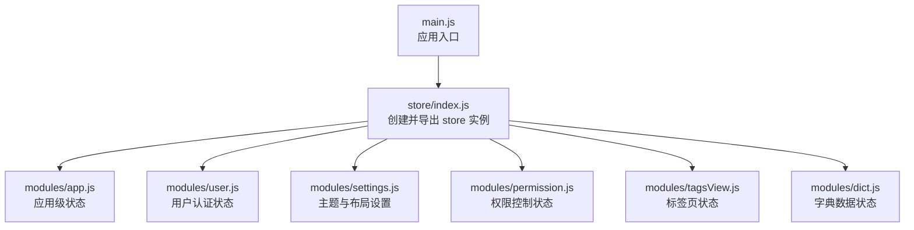
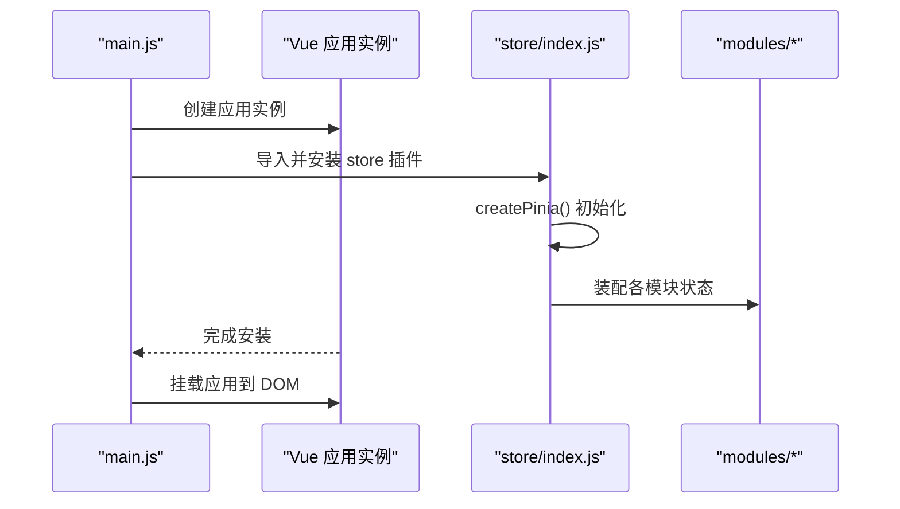
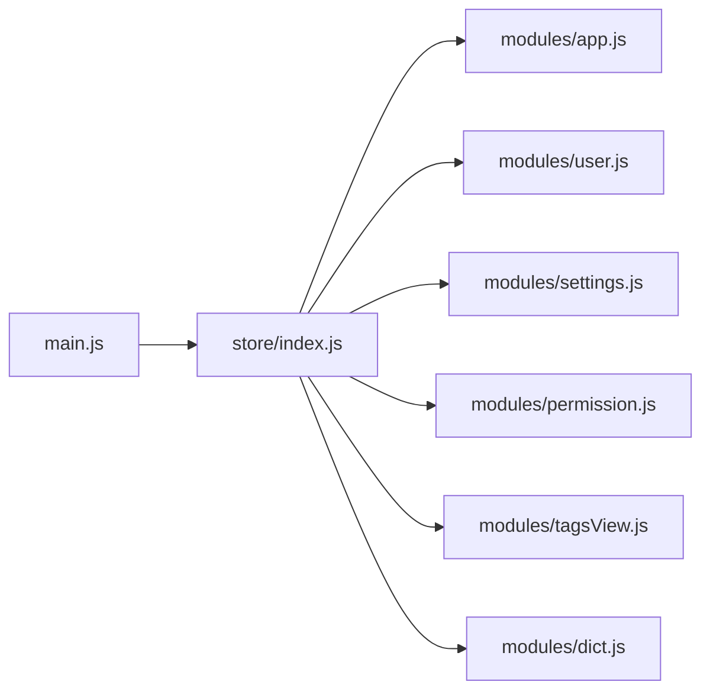

# Pinia Store架构设计

<cite>
**本文档引用的文件**
- [generator-ui/src/store/index.js](file://generator-ui/src/store/index.js)
- [generator-ui/src/main.js](file://generator-ui/src/main.js)
- [generator-ui/src/store/modules/app.js](file://generator-ui/src/store/modules/app.js)
- [generator-ui/src/store/modules/user.js](file://generator-ui/src/store/modules/user.js)
- [generator-ui/src/store/modules/settings.js](file://generator-ui/src/store/modules/settings.js)
- [generator-ui/src/store/modules/permission.js](file://generator-ui/src/store/modules/permission.js)
- [generator-ui/src/store/modules/tagsView.js](file://generator-ui/src/store/modules/tagsView.js)
- [generator-ui/src/store/modules/dict.js](file://generator-ui/src/store/modules/dict.js)
</cite>

## 目录
1. [引言](#引言)
2. [项目结构](#项目结构)
3. [核心组件](#核心组件)
4. [架构总览](#架构总览)
5. [详细组件分析](#详细组件分析)
6. [依赖关系分析](#依赖关系分析)
7. [性能考虑](#性能考虑)
8. [故障排除指南](#故障排除指南)
9. [结论](#结论)

## 引言
本文件针对 SH-Generator 项目中基于 Vue 3 的 Pinia 状态管理架构进行系统性技术文档整理。内容涵盖 Pinia 选型原因与优势、整体架构设计（createPinia 初始化、插件系统、全局状态管理模式）、核心概念（state/getters/actions）设计理念、最佳实践、与 Vue 3 组合式 API 的集成方式以及响应式状态管理机制。同时提供具体代码示例路径，帮助开发者正确使用 Pinia 进行状态管理。

## 项目结构
在 generator-ui 前端工程中，Pinia 状态管理采用模块化组织方式：
- store 根入口负责创建并导出 store 实例
- modules 子目录按功能域划分多个独立模块（如 app、user、settings、permission、tagsView、dict）
- 主应用通过 main.js 安装 store 插件，使所有组件可访问全局状态

**图表来源**
- [generator-ui/src/main.js](file://generator-ui/src/main.js)
- [generator-ui/src/store/index.js](file://generator-ui/src/store/index.js)
- [generator-ui/src/store/modules/app.js](file://generator-ui/src/store/modules/app.js)
- [generator-ui/src/store/modules/user.js](file://generator-ui/src/store/modules/user.js)
- [generator-ui/src/store/modules/settings.js](file://generator-ui/src/store/modules/settings.js)
- [generator-ui/src/store/modules/permission.js](file://generator-ui/src/store/modules/permission.js)
- [generator-ui/src/store/modules/tagsView.js](file://generator-ui/src/store/modules/tagsView.js)
- [generator-ui/src/store/modules/dict.js](file://generator-ui/src/store/modules/dict.js)

**章节来源**
- [generator-ui/src/store/index.js](file://generator-ui/src/store/index.js)
- [generator-ui/src/main.js](file://generator-ui/src/main.js)

## 核心组件
本节从架构层面解析 Pinia 在项目中的角色与职责：
- store 根入口：集中初始化 createPinia，便于后续扩展插件或中间件
- 模块化 store：将业务状态拆分为独立模块，提升可维护性与可测试性
- 全局安装：在 main.js 中调用 app.use(store)，使全局组件具备响应式状态能力

关键点：
- Pinia 作为轻量、类型安全、模块化且与 Composition API 协同良好的状态管理方案
- 通过模块化避免全局状态臃肿，支持按需加载与热更新
- 与 Vue 3 响应式系统深度集成，无需手动追踪依赖

**章节来源**
- [generator-ui/src/store/index.js](file://generator-ui/src/store/index.js)
- [generator-ui/src/main.js](file://generator-ui/src/main.js)

## 架构总览
下图展示了应用启动时 Pinia 的初始化流程与模块装配过程：

**图表来源**
- [generator-ui/src/main.js](file://generator-ui/src/main.js)
- [generator-ui/src/store/index.js](file://generator-ui/src/store/index.js)

## 详细组件分析

### store 根入口（createPinia 与导出）
- 职责：创建并导出全局 store 实例，为后续插件与模块提供统一容器
- 设计要点：保持最小化初始化逻辑，便于扩展 devtools、持久化等插件

参考路径：
- [generator-ui/src/store/index.js](file://generator-ui/src/store/index.js)

**章节来源**
- [generator-ui/src/store/index.js](file://generator-ui/src/store/index.js)

### 模块化 store 设计
- 模块划分原则：按业务域拆分（应用、用户、设置、权限、标签页、字典）
- 模块内部结构：每个模块包含 state、getters、actions，遵循单一职责
- 通信方式：模块间不直接互相依赖，通过 actions 或外部 API 调用间接交互

参考路径：
- [generator-ui/src/store/modules/app.js](file://generator-ui/src/store/modules/app.js)
- [generator-ui/src/store/modules/user.js](file://generator-ui/src/store/modules/user.js)
- [generator-ui/src/store/modules/settings.js](file://generator-ui/src/store/modules/settings.js)
- [generator-ui/src/store/modules/permission.js](file://generator-ui/src/store/modules/permission.js)
- [generator-ui/src/store/modules/tagsView.js](file://generator-ui/src/store/modules/tagsView.js)
- [generator-ui/src/store/modules/dict.js](file://generator-ui/src/store/modules/dict.js)

**章节来源**
- [generator-ui/src/store/modules/app.js](file://generator-ui/src/store/modules/app.js)
- [generator-ui/src/store/modules/user.js](file://generator-ui/src/store/modules/user.js)
- [generator-ui/src/store/modules/settings.js](file://generator-ui/src/store/modules/settings.js)
- [generator-ui/src/store/modules/permission.js](file://generator-ui/src/store/modules/permission.js)
- [generator-ui/src/store/modules/tagsView.js](file://generator-ui/src/store/modules/tagsView.js)
- [generator-ui/src/store/modules/dict.js](file://generator-ui/src/store/modules/dict.js)

### 核心概念：state/getters/actions
- state：模块内共享的数据源，建议以函数形式返回对象，确保 SSR 安全
- getters：基于 state 派生的只读计算值，支持缓存与依赖追踪
- actions：修改 state 的唯一途径，支持同步与异步操作，便于日志与调试

参考路径：
- [generator-ui/src/store/modules/user.js](file://generator-ui/src/store/modules/user.js)
- [generator-ui/src/store/modules/settings.js](file://generator-ui/src/store/modules/settings.js)

**章节来源**
- [generator-ui/src/store/modules/user.js](file://generator-ui/src/store/modules/user.js)
- [generator-ui/src/store/modules/settings.js](file://generator-ui/src/store/modules/settings.js)

### 与 Vue 3 组合式 API 集成
- 在组件中通过组合式 API 访问 store：useStore 获取模块实例，响应式绑定 state
- 在模板中直接使用 getters 与响应式数据，减少样板代码
- 在逻辑层通过 actions 触发状态变更，保持视图与状态的一致性

参考路径：
- [generator-ui/src/main.js](file://generator-ui/src/main.js)

**章节来源**
- [generator-ui/src/main.js](file://generator-ui/src/main.js)

### 响应式状态管理机制
- Pinia 与 Vue 3 响应式系统无缝衔接，state 变更自动触发依赖组件重渲染
- getters 作为派生数据，具备依赖收集与缓存特性，避免重复计算
- actions 提供统一的状态修改入口，便于调试与时间旅行

参考路径：
- [generator-ui/src/store/index.js](file://generator-ui/src/store/index.js)
- [generator-ui/src/store/modules/app.js](file://generator-ui/src/store/modules/app.js)

**章节来源**
- [generator-ui/src/store/index.js](file://generator-ui/src/store/index.js)
- [generator-ui/src/store/modules/app.js](file://generator-ui/src/store/modules/app.js)

## 依赖关系分析
- 入口依赖：main.js 依赖 store/index.js；store/index.js 依赖各模块文件
- 模块依赖：模块之间无直接相互依赖，通过 actions 或外部接口交互
- 外部依赖：项目使用 Vue 3 与 Element Plus，store 与 UI 组件解耦

**图表来源**
- [generator-ui/src/main.js](file://generator-ui/src/main.js)
- [generator-ui/src/store/index.js](file://generator-ui/src/store/index.js)
- [generator-ui/src/store/modules/app.js](file://generator-ui/src/store/modules/app.js)
- [generator-ui/src/store/modules/user.js](file://generator-ui/src/store/modules/user.js)
- [generator-ui/src/store/modules/settings.js](file://generator-ui/src/store/modules/settings.js)
- [generator-ui/src/store/modules/permission.js](file://generator-ui/src/store/modules/permission.js)
- [generator-ui/src/store/modules/tagsView.js](file://generator-ui/src/store/modules/tagsView.js)
- [generator-ui/src/store/modules/dict.js](file://generator-ui/src/store/modules/dict.js)

**章节来源**
- [generator-ui/src/main.js](file://generator-ui/src/main.js)
- [generator-ui/src/store/index.js](file://generator-ui/src/store/index.js)

## 性能考虑
- 模块化拆分降低单体状态复杂度，提升开发与维护效率
- getters 缓存与依赖追踪减少不必要的重渲染
- 将重型计算放入 getters 或异步 actions，避免在模板中执行复杂逻辑
- 合理使用响应式包装，避免深层嵌套导致的性能问题

## 故障排除指南
- 症状：页面不更新或状态未生效
  - 排查：确认 actions 是否正确提交、是否在组件中使用了正确的响应式绑定
  - 参考路径：[generator-ui/src/store/modules/user.js](file://generator-ui/src/store/modules/user.js)
- 症状：模块间数据不同步
  - 排查：避免直接修改其他模块 state，改用 actions 或外部 API 触发
  - 参考路径：[generator-ui/src/store/modules/permission.js](file://generator-ui/src/store/modules/permission.js)
- 症状：SSR 场景异常
  - 排查：确保 state 以函数形式返回，避免共享可变状态
  - 参考路径：[generator-ui/src/store/modules/app.js](file://generator-ui/src/store/modules/app.js)

**章节来源**
- [generator-ui/src/store/modules/user.js](file://generator-ui/src/store/modules/user.js)
- [generator-ui/src/store/modules/permission.js](file://generator-ui/src/store/modules/permission.js)
- [generator-ui/src/store/modules/app.js](file://generator-ui/src/store/modules/app.js)

## 结论
SH-Generator 的 Pinia 架构通过最小化的根入口与清晰的模块化设计，实现了高内聚、低耦合的状态管理。结合 Vue 3 组合式 API，开发者可以以声明式方式高效构建响应式界面。建议在实际开发中遵循模块边界、统一通过 actions 修改状态、利用 getters 缓存派生数据，并在 SSR 场景下注意 state 初始化的安全性。