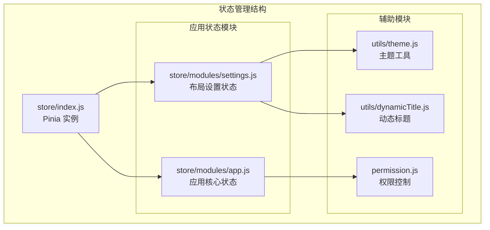
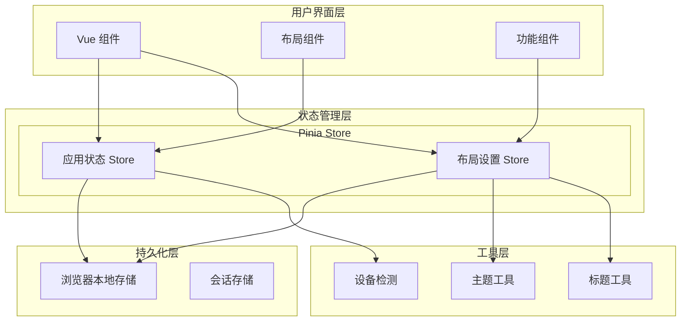
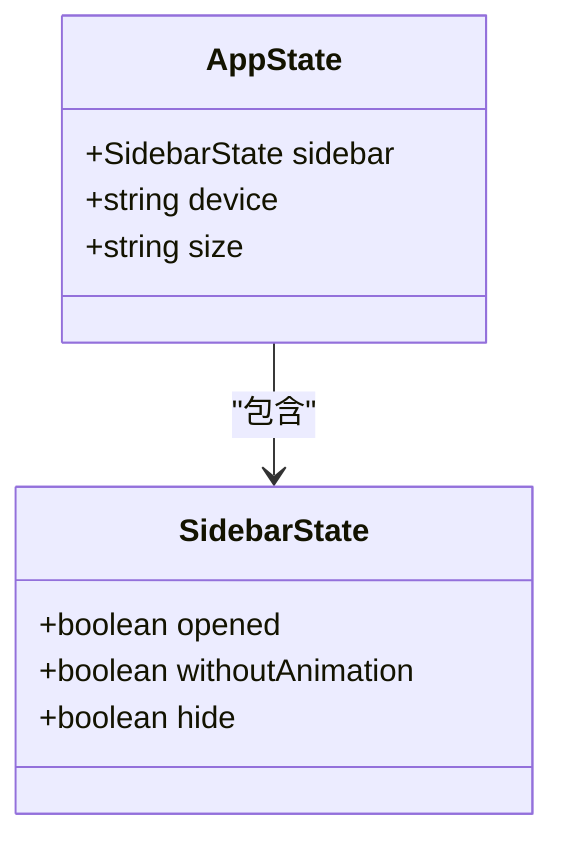
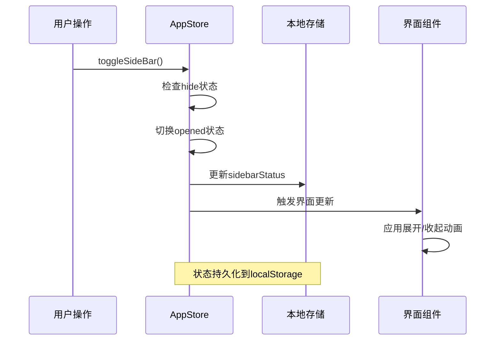
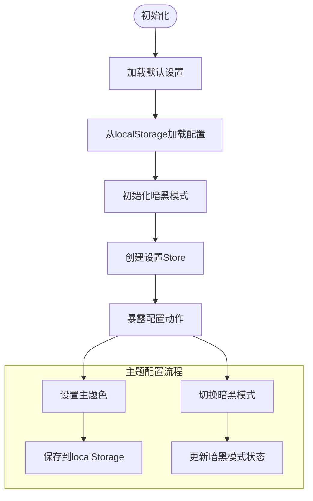
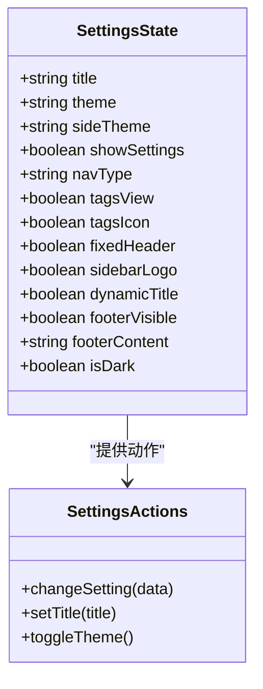
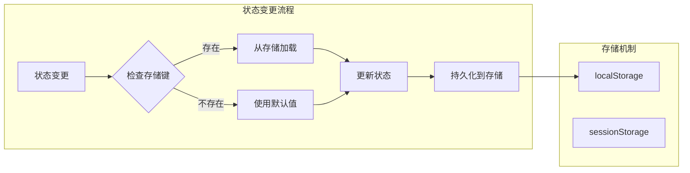
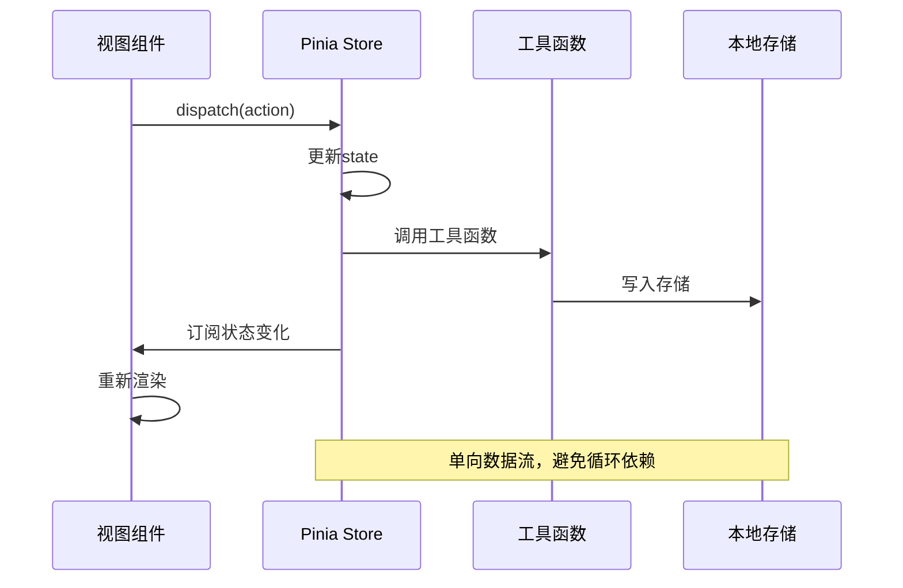

# 应用状态模块

<cite>
**本文档引用的文件**
- [app.js](file://generator-ui/src/store/modules/app.js)
- [settings.js](file://generator-ui/src/store/modules/settings.js)
- [index.js](file://generator-ui/src/store/index.js)
- [settings.js](file://generator-ui/src/settings.js)
- [dynamicTitle.js](file://generator-ui/src/utils/dynamicTitle.js)
- [theme.js](file://generator-ui/src/utils/theme.js)
- [permission.js](file://generator-ui/src/permission.js)
- [main.js](file://generator-ui/src/main.js)
</cite>

## 目录
1. [简介](#简介)
2. [项目结构](#项目结构)
3. [核心组件](#核心组件)
4. [架构概览](#架构概览)
5. [详细组件分析](#详细组件分析)
6. [依赖关系分析](#依赖关系分析)
7. [性能考虑](#性能考虑)
8. [故障排除指南](#故障排除指南)
9. [结论](#结论)

## 简介

SH-Generator 的应用状态模块是基于 Pinia 状态管理库构建的前端状态管理系统。该模块负责管理应用程序的核心状态，包括侧边栏状态、设备类型、界面尺寸、主题配置、布局设置等关键功能。

本模块采用模块化设计，将不同的状态域分离到独立的 store 模块中，实现了高内聚、低耦合的状态管理架构。通过本地存储持久化机制，确保用户偏好的状态在页面刷新后得以保持。

## 项目结构

应用状态模块位于 generator-ui/src/store 目录下，采用分层组织结构：



**图表来源**
- [index.js:1-3](file://generator-ui/src/store/index.js#L1-L3)
- [app.js:1-45](file://generator-ui/src/store/modules/app.js#L1-L45)
- [settings.js:1-52](file://generator-ui/src/store/modules/settings.js#L1-L52)

**章节来源**
- [index.js:1-3](file://generator-ui/src/store/index.js#L1-L3)
- [app.js:1-45](file://generator-ui/src/store/modules/app.js#L1-L45)
- [settings.js:1-52](file://generator-ui/src/store/modules/settings.js#L1-L52)

## 核心组件

### 应用状态模块 (app.js)

应用状态模块管理应用程序的核心交互状态，主要包括：

- **侧边栏状态管理**：控制侧边栏的展开/收起、动画效果、隐藏状态
- **设备类型检测**：识别桌面端、移动端等不同设备类型
- **界面尺寸设置**：支持多种界面尺寸选项
- **状态持久化**：自动保存用户偏好设置到本地存储

### 布局设置模块 (settings.js)

布局设置模块专注于界面外观和布局配置：

- **主题系统**：支持明暗主题切换、自定义主题色
- **导航配置**：顶部导航、侧边栏导航等布局模式
- **功能开关**：标签页显示、固定头部、侧边栏Logo等
- **动态标题**：根据路由动态更新页面标题

**章节来源**
- [app.js:1-45](file://generator-ui/src/store/modules/app.js#L1-L45)
- [settings.js:1-52](file://generator-ui/src/store/modules/settings.js#L1-L52)

## 架构概览

应用状态模块采用分层架构设计，实现了清晰的关注点分离：



**图表来源**
- [app.js:1-45](file://generator-ui/src/store/modules/app.js#L1-L45)
- [settings.js:1-52](file://generator-ui/src/store/modules/settings.js#L1-L52)
- [index.js:1-3](file://generator-ui/src/store/index.js#L1-L3)

## 详细组件分析

### 应用状态模块深度解析

#### 状态结构设计

应用状态模块定义了以下核心状态：



**图表来源**
- [app.js:4-12](file://generator-ui/src/store/modules/app.js#L4-L12)

#### 侧边栏状态管理机制

侧边栏状态管理实现了完整的生命周期控制：



**图表来源**
- [app.js:14-25](file://generator-ui/src/store/modules/app.js#L14-L25)

#### 动作方法详解

应用状态模块提供了以下核心动作方法：

| 方法名 | 参数 | 功能描述 | 状态变更 |
|--------|------|----------|----------|
| toggleSideBar | withoutAnimation: boolean | 切换侧边栏展开状态 | sidebar.opened, sidebar.withoutAnimation |
| closeSideBar | options: object | 关闭侧边栏 | sidebar.opened=false, sidebar.withoutAnimation |
| toggleDevice | device: string | 切换设备类型 | device |
| setSize | size: string | 设置界面尺寸 | size, localStorage |
| toggleSideBarHide | status: boolean | 切换侧边栏隐藏状态 | sidebar.hide |

**章节来源**
- [app.js:13-41](file://generator-ui/src/store/modules/app.js#L13-L41)

### 布局设置模块深度解析

#### 主题系统架构

布局设置模块集成了现代化的主题系统：



**图表来源**
- [settings.js:10-29](file://generator-ui/src/store/modules/settings.js#L10-L29)

#### 配置项管理机制

布局设置模块支持动态配置管理：



**图表来源**
- [settings.js:15-29](file://generator-ui/src/store/modules/settings.js#L15-L29)
- [settings.js:30-48](file://generator-ui/src/store/modules/settings.js#L30-L48)

**章节来源**
- [settings.js:1-52](file://generator-ui/src/store/modules/settings.js#L1-L52)

### 状态持久化策略

#### 本地存储实现

应用状态模块采用了智能的本地存储策略：

| 状态项 | 存储位置 | 初始化逻辑 | 更新时机 |
|--------|----------|------------|----------|
| sidebarStatus | localStorage | 读取现有值或默认true | toggleSideBar, closeSideBar |
| size | localStorage | 读取现有值或默认'default' | setSize |
| layout-setting | localStorage | 解析JSON配置或空字符串 | changeSetting |

#### 持久化流程图



**图表来源**
- [app.js:6-11](file://generator-ui/src/store/modules/app.js#L6-L11)
- [settings.js:10-10](file://generator-ui/src/store/modules/settings.js#L10-L10)

**章节来源**
- [app.js:6-11](file://generator-ui/src/store/modules/app.js#L6-L11)
- [settings.js:10-10](file://generator-ui/src/store/modules/settings.js#L10-L10)

## 依赖关系分析

### 模块间依赖关系

```mermaid
graph TB
subgraph "外部依赖"
Pinia[Pinia]
VueUse[@vueuse/core]
ElementPlus[Element Plus]
end
subgraph "内部模块"
AppStore[app.js]
SettingsStore[settings.js]
Main[main.js]
Permission[permission.js]
end
subgraph "工具模块"
ThemeUtils[theme.js]
DynamicTitle[dynamicTitle.js]
SettingsConfig[settings.js]
end
Pinia --> AppStore
Pinia --> SettingsStore
VueUse --> SettingsStore
ElementPlus --> SettingsStore
Main --> AppStore
Main --> SettingsStore
Permission --> AppStore
SettingsStore --> ThemeUtils
SettingsStore --> DynamicTitle
SettingsStore --> SettingsConfig
```

**图表来源**
- [settings.js:1-6](file://generator-ui/src/store/modules/settings.js#L1-L6)
- [main.js](file://generator-ui/src/main.js)
- [permission.js](file://generator-ui/src/permission.js)

### 状态流依赖

应用状态模块的状态流遵循单向数据流原则：



**图表来源**
- [app.js:13-41](file://generator-ui/src/store/modules/app.js#L13-L41)
- [settings.js:30-48](file://generator-ui/src/store/modules/settings.js#L30-L48)

**章节来源**
- [settings.js:1-6](file://generator-ui/src/store/modules/settings.js#L1-L6)
- [main.js](file://generator-ui/src/main.js)

## 性能考虑

### 状态更新优化

应用状态模块采用了多项性能优化策略：

1. **懒加载机制**：仅在需要时初始化状态
2. **防抖处理**：对频繁的状态更新进行节流
3. **内存管理**：及时清理不再使用的状态引用
4. **计算属性缓存**：利用Vue的响应式系统缓存计算结果

### 存储访问优化

- **批量写入**：减少localStorage的写入次数
- **条件更新**：仅在状态实际改变时才更新存储
- **异步处理**：避免阻塞主线程的存储操作

## 故障排除指南

### 常见问题及解决方案

#### 侧边栏状态异常

**问题现象**：侧边栏状态与预期不符

**可能原因**：
- localStorage 数据损坏
- 多个实例状态冲突
- 浏览器兼容性问题

**解决步骤**：
1. 清除浏览器localStorage中的sidebarStatus键
2. 检查是否有多个应用实例同时运行
3. 验证浏览器对localStorage的支持

#### 主题切换失效

**问题现象**：主题切换后样式未更新

**可能原因**：
- CSS变量未正确更新
- 缓存的样式表未刷新
- 主题配置格式错误

**解决步骤**：
1. 检查主题配置的十六进制格式
2. 清除浏览器CSS缓存
3. 验证主题工具函数的执行

#### 状态持久化失败

**问题现象**：页面刷新后状态丢失

**可能原因**：
- 浏览器禁用了localStorage
- 存储空间不足
- JSON序列化错误

**解决步骤**：
1. 检查浏览器开发者工具的Application面板
2. 验证localStorage可用空间
3. 检查JSON配置的正确性

**章节来源**
- [app.js:6-24](file://generator-ui/src/store/modules/app.js#L6-L24)
- [settings.js:10-29](file://generator-ui/src/store/modules/settings.js#L10-L29)

## 结论

SH-Generator 的应用状态模块通过精心设计的架构实现了高效、可维护的状态管理。模块化的状态设计、完善的持久化机制、以及清晰的依赖关系，共同构成了一个健壮的应用状态管理体系。

该模块的主要优势包括：

1. **模块化设计**：将不同类型的状态分离到独立的模块中
2. **持久化支持**：自动保存用户偏好设置
3. **响应式更新**：实时反映状态变化
4. **性能优化**：采用多种优化策略提升性能
5. **易于扩展**：清晰的接口设计便于功能扩展

通过遵循本文档的最佳实践，开发者可以有效地使用和扩展应用状态模块，为用户提供一致且流畅的使用体验。