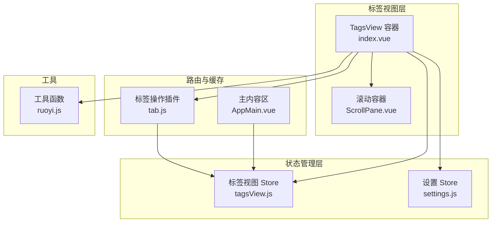
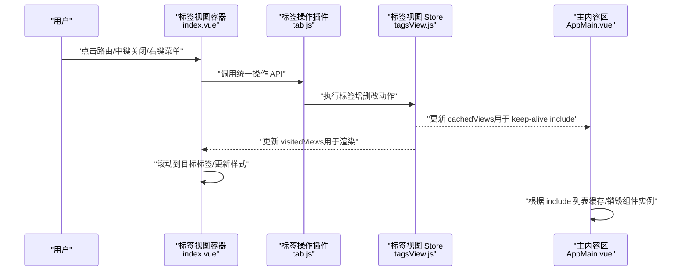
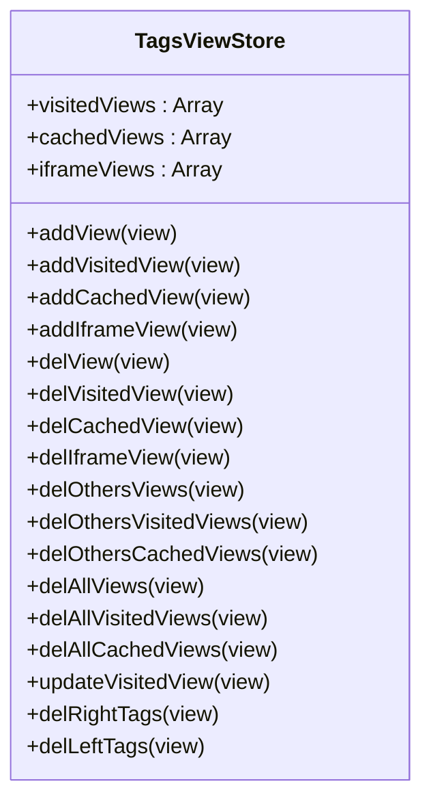
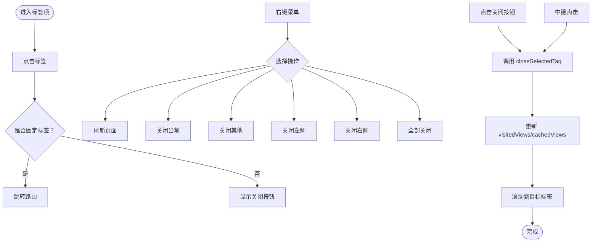
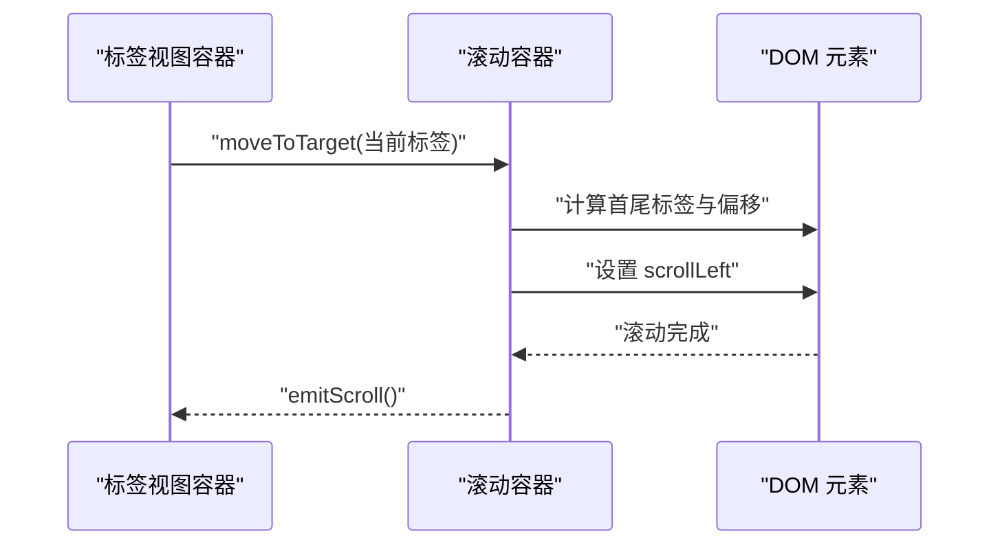
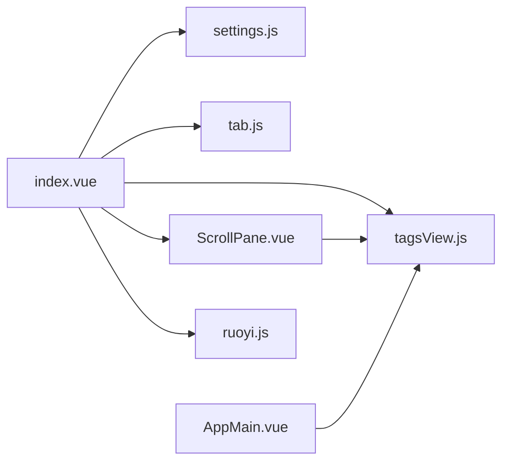

# 标签视图模块

<cite>
**本文档引用的文件**
- [tagsView.js](file://generator-ui/src/store/modules/tagsView.js)
- [index.vue](file://generator-ui/src/layout/components/TagsView/index.vue)
- [ScrollPane.vue](file://generator-ui/src/layout/components/TagsView/ScrollPane.vue)
- [tab.js](file://generator-ui/src/plugins/tab.js)
- [AppMain.vue](file://generator-ui/src/layout/components/AppMain.vue)
- [ruoyi.js](file://generator-ui/src/utils/ruoyi.js)
- [settings.js](file://generator-ui/src/store/modules/settings.js)
- [index.vue](file://generator-ui/src/layout/index.vue)
- [index.js](file://generator-ui/src/store/index.js)
</cite>

## 目录
1. [简介](#简介)
2. [项目结构](#项目结构)
3. [核心组件](#核心组件)
4. [架构总览](#架构总览)
5. [详细组件分析](#详细组件分析)
6. [依赖关系分析](#依赖关系分析)
7. [性能考虑](#性能考虑)
8. [故障排查指南](#故障排查指南)
9. [结论](#结论)
10. [附录](#附录)

## 简介
本文件聚焦 SH-Generator 前端的标签视图模块（tagsView），系统性阐述其在多页面标签管理中的作用与实现细节。内容涵盖标签页的添加、关闭、刷新与缓存机制；标签页状态持久化策略；滚动、右键菜单与快捷操作的交互状态管理；标签页数量限制与内存优化策略；以及标签页状态与路由的联动方案，并提供使用示例与用户体验优化建议。

## 项目结构
标签视图模块由以下关键部分组成：
- 状态管理：Pinia Store 中的 tagsView 模块，维护已访问页、缓存页与 iframe 页集合
- 视图组件：TagsView 容器组件负责渲染标签项、处理交互事件与菜单展示
- 滚动容器：ScrollPane 提供横向滚动与目标标签定位能力
- 插件接口：tab.js 提供统一的标签页操作入口（刷新、关闭、打开等）
- 路由集成：AppMain 通过 keep-alive 的 include 属性与 tagsView 缓存联动
- 工具方法：ruoyi.js 提供路径规范化等辅助函数

图表来源
- [index.vue:1-371](file://generator-ui/src/layout/components/TagsView/index.vue#L1-L371)
- [ScrollPane.vue:1-107](file://generator-ui/src/layout/components/TagsView/ScrollPane.vue#L1-L107)
- [tagsView.js:1-183](file://generator-ui/src/store/modules/tagsView.js#L1-L183)
- [settings.js:1-30](file://generator-ui/src/store/modules/settings.js#L1-L30)
- [AppMain.vue:1-120](file://generator-ui/src/layout/components/AppMain.vue#L1-L120)
- [tab.js:1-72](file://generator-ui/src/plugins/tab.js#L1-L72)
- [ruoyi.js:213-223](file://generator-ui/src/utils/ruoyi.js#L213-L223)

章节来源
- [index.vue:1-371](file://generator-ui/src/layout/components/TagsView/index.vue#L1-L371)
- [ScrollPane.vue:1-107](file://generator-ui/src/layout/components/TagsView/ScrollPane.vue#L1-L107)
- [tagsView.js:1-183](file://generator-ui/src/store/modules/tagsView.js#L1-L183)
- [settings.js:1-30](file://generator-ui/src/store/modules/settings.js#L1-L30)
- [AppMain.vue:1-120](file://generator-ui/src/layout/components/AppMain.vue#L1-L120)
- [tab.js:1-72](file://generator-ui/src/plugins/tab.js#L1-L72)
- [ruoyi.js:213-223](file://generator-ui/src/utils/ruoyi.js#L213-L223)

## 核心组件
- 标签视图 Store（tagsView.js）：维护 visitedViews、cachedViews、iframeViews 三个集合，提供增删改查与批量清理等动作
- 标签视图容器（index.vue）：渲染标签项、绑定点击/中键关闭、右键菜单、滚动联动与主题样式
- 滚动容器（ScrollPane.vue）：横向滚动与目标标签自动定位
- 标签操作插件（tab.js）：对外暴露统一的标签页操作 API，内部委派给 Store
- 主内容区（AppMain.vue）：通过 keep-alive 的 include 与 cachedViews 实现缓存联动
- 设置 Store（settings.js）：控制标签图标显示、标签视图开关等用户偏好

章节来源
- [tagsView.js:1-183](file://generator-ui/src/store/modules/tagsView.js#L1-L183)
- [index.vue:1-371](file://generator-ui/src/layout/components/TagsView/index.vue#L1-L371)
- [ScrollPane.vue:1-107](file://generator-ui/src/layout/components/TagsView/ScrollPane.vue#L1-L107)
- [tab.js:1-72](file://generator-ui/src/plugins/tab.js#L1-L72)
- [AppMain.vue:1-120](file://generator-ui/src/layout/components/AppMain.vue#L1-L120)
- [settings.js:1-30](file://generator-ui/src/store/modules/settings.js#L1-L30)

## 架构总览
标签视图模块围绕“状态驱动 + 组件协作”的模式构建：
- 状态驱动：tagsView Store 是唯一真相来源，所有标签页行为最终落回到对状态的修改
- 组件协作：TagsView 容器负责 UI 与交互；ScrollPane 负责滚动；AppMain 负责缓存；tab.js 提供外部 API
- 路由联动：路由变化触发标签添加与滚动定位；关闭标签后根据最新列表进行路由回退

图表来源
- [index.vue:151-185](file://generator-ui/src/layout/components/TagsView/index.vue#L151-L185)
- [tab.js:32-44](file://generator-ui/src/plugins/tab.js#L32-L44)
- [tagsView.js:36-70](file://generator-ui/src/store/modules/tagsView.js#L36-L70)
- [AppMain.vue:1-40](file://generator-ui/src/layout/components/AppMain.vue#L1-L40)

## 详细组件分析

### 标签视图 Store（tagsView.js）
职责与数据结构
- visitedViews：已访问的路由对象集合，包含 path、fullPath、title、meta 等
- cachedViews：需要缓存的组件名称集合（基于路由 name）
- iframeViews：iframe 类型标签集合（用于外链或特殊场景）

关键动作
- 添加：addView 同步添加到 visitedViews 与 cachedViews；addVisitedView/addCachedView 可单独调用
- 删除：delView 删除 visited 与 cached；delVisitedView/delCachedView 单独删除；支持关闭左右侧、关闭其他、全部关闭
- 更新：updateVisitedView 支持更新标题与查询参数
- 辅助：addIframeView/delIframeView 管理 iframe 标签

复杂度与性能
- 查找与去重：基于 path/name 的线性查找，整体 O(n)
- 过滤与裁剪：批量删除采用过滤与切片，避免频繁 splice 导致的多次重排

图表来源
- [tagsView.js:1-183](file://generator-ui/src/store/modules/tagsView.js#L1-L183)

章节来源
- [tagsView.js:1-183](file://generator-ui/src/store/modules/tagsView.js#L1-L183)

### 标签视图容器（index.vue）
功能要点
- 渲染：遍历 visitedViews，结合路由高亮与图标显示
- 交互：点击切换路由、中键关闭非固定标签、右键菜单
- 滚动：调用 ScrollPane moveToTarget 自动滚动到目标标签
- 联动：监听路由变化，自动添加标签并更新 fullPath

右键菜单能力
- 刷新页面、关闭当前、关闭其他、关闭左侧、关闭右侧、全部关闭

图表来源
- [index.vue:172-233](file://generator-ui/src/layout/components/TagsView/index.vue#L172-L233)
- [tab.js:32-60](file://generator-ui/src/plugins/tab.js#L32-L60)

章节来源
- [index.vue:1-371](file://generator-ui/src/layout/components/TagsView/index.vue#L1-L371)

### 滚动容器（ScrollPane.vue）
功能要点
- 横向滚动：监听 wheel 事件，平滑滚动
- 目标定位：根据当前标签计算前后标签位置，自动滚动到可视区域
- 事件绑定：挂载时绑定 scroll 监听，卸载时移除

图表来源
- [ScrollPane.vue:42-87](file://generator-ui/src/layout/components/TagsView/ScrollPane.vue#L42-L87)

章节来源
- [ScrollPane.vue:1-107](file://generator-ui/src/layout/components/TagsView/ScrollPane.vue#L1-L107)

### 标签操作插件（tab.js）
对外 API
- refreshPage：刷新当前页（通过删除缓存后重定向）
- closePage/closeAllPage/closeOtherPage/closeLeftPage/closeRightPage：关闭指定或范围内的标签
- openPage/updatePage：新增或更新标签

实现机制
- 统一委派：所有操作最终调用 tagsView Store 的对应动作
- 路由回退：关闭后根据最新 visitedViews 决定回退路由

章节来源
- [tab.js:1-72](file://generator-ui/src/plugins/tab.js#L1-L72)

### 与路由和缓存的联动（AppMain.vue）
- keep-alive include：根据 cachedViews 动态控制组件缓存
- iframe 场景：当路由 meta.link 为真时，记录到 iframeViews 并在刷新/关闭时同步处理

章节来源
- [AppMain.vue:1-40](file://generator-ui/src/layout/components/AppMain.vue#L1-L40)

### 路径规范化工具（ruoyi.js）
- getNormalPath：将重复斜杠归一化，去除末尾斜杠，保证路径一致性

章节来源
- [ruoyi.js:213-223](file://generator-ui/src/utils/ruoyi.js#L213-L223)

## 依赖关系分析
- 组件耦合
  - index.vue 依赖 tagsView Store、settings Store、tab 插件与 ScrollPane
  - ScrollPane 依赖 tagsView Store 获取 visitedViews 以计算滚动
  - AppMain 依赖 tagsView Store 的 cachedViews 控制 keep-alive
- 外部依赖
  - Element Plus 的滚动条组件用于横向滚动
  - Vue Router 用于路由跳转与当前路由信息获取

图表来源
- [index.vue:46-66](file://generator-ui/src/layout/components/TagsView/index.vue#L46-L66)
- [ScrollPane.vue:12-18](file://generator-ui/src/layout/components/TagsView/ScrollPane.vue#L12-L18)
- [AppMain.vue:1-40](file://generator-ui/src/layout/components/AppMain.vue#L1-L40)
- [tagsView.js:1-10](file://generator-ui/src/store/modules/tagsView.js#L1-L10)
- [settings.js:1-30](file://generator-ui/src/store/modules/settings.js#L1-L30)
- [ruoyi.js:213-223](file://generator-ui/src/utils/ruoyi.js#L213-L223)

章节来源
- [index.vue:46-66](file://generator-ui/src/layout/components/TagsView/index.vue#L46-L66)
- [ScrollPane.vue:12-18](file://generator-ui/src/layout/components/TagsView/ScrollPane.vue#L12-L18)
- [AppMain.vue:1-40](file://generator-ui/src/layout/components/AppMain.vue#L1-L40)
- [tagsView.js:1-10](file://generator-ui/src/store/modules/tagsView.js#L1-L10)
- [settings.js:1-30](file://generator-ui/src/store/modules/settings.js#L1-L30)
- [ruoyi.js:213-223](file://generator-ui/src/utils/ruoyi.js#L213-L223)

## 性能考虑
- 状态更新批量化：批量删除（关闭其他/左右侧/全部）采用过滤与切片，减少多次 splice 带来的重排成本
- 滚动定位：仅在必要时计算前后标签偏移，避免频繁 DOM 查询
- 缓存控制：通过 keep-alive include 精准控制缓存，降低内存占用
- 事件解绑：滚动容器在卸载时移除 scroll 监听，防止内存泄漏
- 路由回退：关闭标签后优先回退到最后一个标签，避免无效导航

## 故障排查指南
常见问题与定位
- 标签无法关闭
  - 检查是否为固定标签（meta.affix）；中键关闭仅对非固定标签生效
  - 确认 tab.js 是否正确调用 delView/delLeftTags/delRightTags
- 刷新无效
  - 确认 refreshPage 是否成功删除缓存并重定向
  - 检查路由组件是否正确响应重定向
- 滚动异常
  - 确认 moveToTarget 计算的前后标签索引是否存在
  - 检查 DOM 查询是否返回有效元素
- 缓存未生效
  - 检查路由 meta.noCache 是否为真；为真则不会加入 cachedViews
  - 确认 AppMain 的 keep-alive include 是否包含对应组件名

章节来源
- [index.vue:172-185](file://generator-ui/src/layout/components/TagsView/index.vue#L172-L185)
- [tab.js:6-24](file://generator-ui/src/plugins/tab.js#L6-L24)
- [ScrollPane.vue:42-87](file://generator-ui/src/layout/components/TagsView/ScrollPane.vue#L42-L87)
- [tagsView.js:30-35](file://generator-ui/src/store/modules/tagsView.js#L30-L35)
- [AppMain.vue:1-40](file://generator-ui/src/layout/components/AppMain.vue#L1-L40)

## 结论
标签视图模块通过清晰的状态管理与组件协作，实现了稳定高效的多标签页体验。其设计兼顾了易用性与性能，适合在复杂业务场景下扩展与维护。建议在后续迭代中进一步完善标签页数量上限与自动回收策略，以提升极端场景下的稳定性。

## 附录

### 使用示例
- 新增标签
  - 在路由守卫或业务逻辑中调用 tab.openPage(title, url, params)，随后 push 对应路由
- 刷新当前标签
  - 调用 tab.refreshPage()，内部会删除缓存并重定向
- 关闭当前标签
  - 调用 tab.closePage()，若无剩余标签则回退首页
- 关闭左侧/右侧/其他标签
  - 分别调用 tab.closeLeftPage()/closeRightPage()/closeOtherPage()

章节来源
- [tab.js:62-70](file://generator-ui/src/plugins/tab.js#L62-L70)
- [index.vue:172-208](file://generator-ui/src/layout/components/TagsView/index.vue#L172-L208)

### 用户体验优化建议
- 固定标签：将常用首页或关键页面标记为固定标签，避免误删
- 图标增强：为重要标签配置 meta.icon，提升识别效率
- 快捷键：可扩展 Ctrl+W 关闭当前、Ctrl+Shift+T 重新打开最近关闭标签等快捷键
- 滚动提示：在标签过长时提供滚动方向提示或吸附效果
- 主题适配：根据主题色动态调整激活标签的视觉反馈