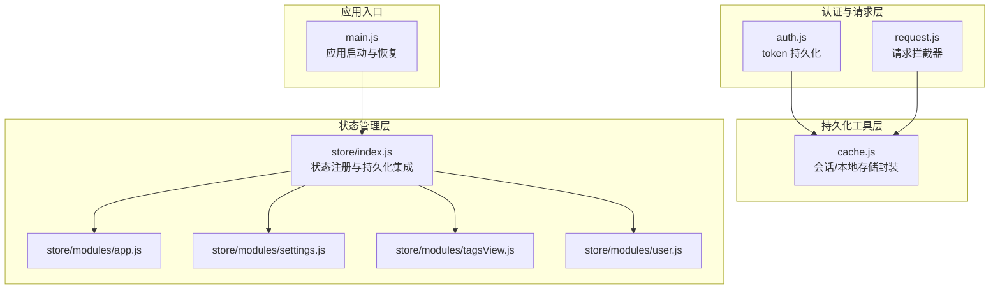
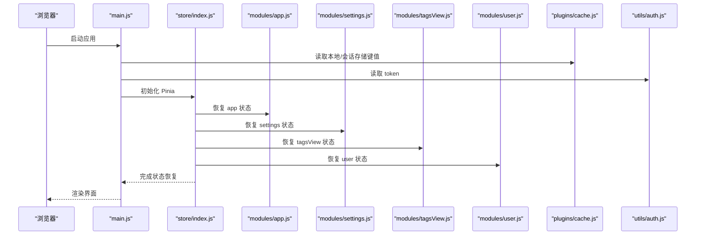
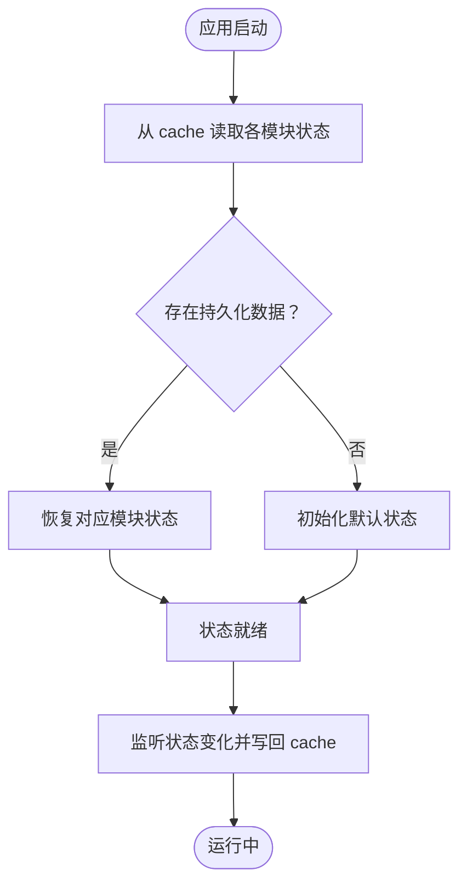
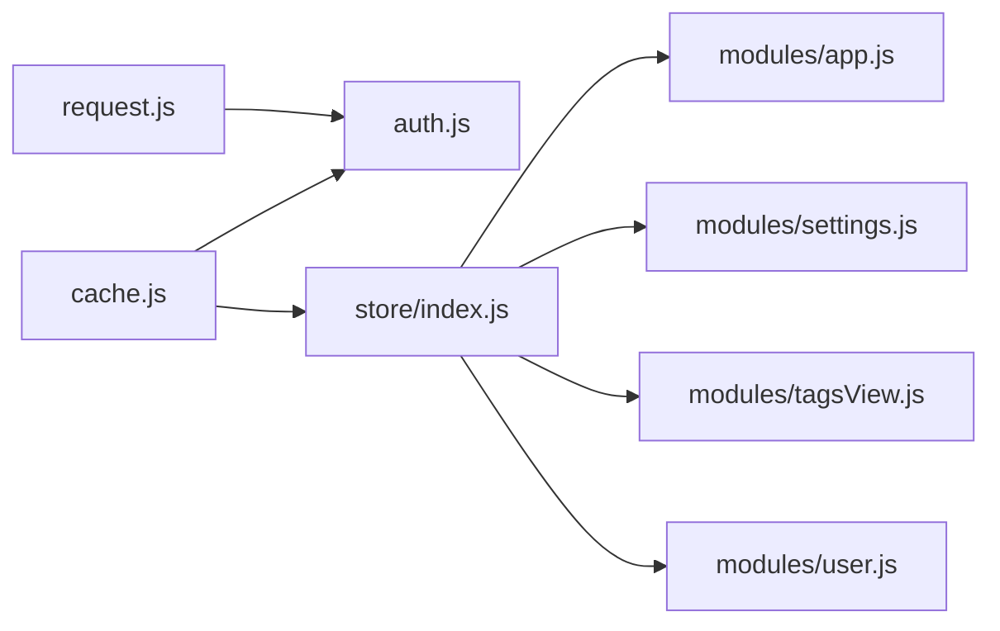

# 状态持久化

<cite>
**本文引用的文件**
- [cache.js](file://generator-ui/src/plugins/cache.js)
- [auth.js](file://generator-ui/src/utils/auth.js)
- [app.js](file://generator-ui/src/store/modules/app.js)
- [settings.js](file://generator-ui/src/store/modules/settings.js)
- [tagsView.js](file://generator-ui/src/store/modules/tagsView.js)
- [user.js](file://generator-ui/src/store/modules/user.js)
- [index.js](file://generator-ui/src/store/index.js)
- [main.js](file://generator-ui/src/main.js)
- [auth.js](file://generator-ui/src/plugins/auth.js)
- [request.js](file://generator-ui/src/utils/request.js)
</cite>

## 目录
1. [引言](#引言)
2. [项目结构](#项目结构)
3. [核心组件](#核心组件)
4. [架构总览](#架构总览)
5. [详细组件分析](#详细组件分析)
6. [依赖关系分析](#依赖关系分析)
7. [性能考量](#性能考量)
8. [故障排查指南](#故障排查指南)
9. [结论](#结论)
10. [附录](#附录)

## 引言
本文件聚焦于 SH-Generator 的前端状态持久化机制，系统性梳理 localStorage 与 sessionStorage 在状态持久化中的应用策略，明确需要持久化的状态范围、持久化时机与策略选择，阐述序列化与反序列化实现方式，并给出状态恢复与初始化流程、数据版本兼容与迁移建议、清理与内存管理最佳实践，以及可操作的调试技巧。

## 项目结构
本项目的前端状态持久化主要分布在以下位置：
- 持久化工具层：提供统一的本地/会话存储封装（cache.js）
- 认证令牌持久化：基于 localStorage 存储 token（auth.js）
- 状态管理层：使用 Pinia Store 组织业务状态（store/modules 下各模块）
- 应用入口与插件：在应用启动时进行状态恢复与初始化（main.js、store/index.js）

图表来源
- [cache.js:1-79](file://generator-ui/src/plugins/cache.js#L1-L79)
- [auth.js:1-13](file://generator-ui/src/utils/auth.js#L1-L13)
- [index.js](file://generator-ui/src/store/index.js)
- [app.js](file://generator-ui/src/store/modules/app.js)
- [settings.js](file://generator-ui/src/store/modules/settings.js)
- [tagsView.js:1-139](file://generator-ui/src/store/modules/tagsView.js#L1-L139)
- [user.js](file://generator-ui/src/store/modules/user.js)
- [main.js](file://generator-ui/src/main.js)

章节来源
- [cache.js:1-79](file://generator-ui/src/plugins/cache.js#L1-L79)
- [auth.js:1-13](file://generator-ui/src/utils/auth.js#L1-L13)
- [index.js](file://generator-ui/src/store/index.js)
- [main.js](file://generator-ui/src/main.js)

## 核心组件
- 本地/会话存储封装（cache.js）：提供统一的 set/get/setJSON/getJSON/remove 接口，分别封装 localStorage 与 sessionStorage，屏蔽浏览器兼容性差异。
- 认证令牌持久化（auth.js）：通过 localStorage 持久化 token，确保页面刷新后仍可保持登录态。
- Pinia Store 模块：app、settings、tagsView、user 等模块定义了应用状态；结合 store/index.js 实现持久化集成。
- 应用入口（main.js）：在应用启动阶段执行状态恢复与初始化逻辑。

章节来源
- [cache.js:1-79](file://generator-ui/src/plugins/cache.js#L1-L79)
- [auth.js:1-13](file://generator-ui/src/utils/auth.js#L1-L13)
- [index.js](file://generator-ui/src/store/index.js)
- [main.js](file://generator-ui/src/main.js)

## 架构总览
下图展示从应用启动到状态恢复的关键流程，包括持久化工具调用、认证令牌读取、Pinia 状态恢复与初始化。

图表来源
- [main.js](file://generator-ui/src/main.js)
- [index.js](file://generator-ui/src/store/index.js)
- [app.js](file://generator-ui/src/store/modules/app.js)
- [settings.js](file://generator-ui/src/store/modules/settings.js)
- [tagsView.js:1-139](file://generator-ui/src/store/modules/tagsView.js#L1-L139)
- [user.js](file://generator-ui/src/store/modules/user.js)
- [cache.js:1-79](file://generator-ui/src/plugins/cache.js#L1-L79)
- [auth.js:1-13](file://generator-ui/src/utils/auth.js#L1-L13)

## 详细组件分析

### 本地/会话存储封装（cache.js）
- 设计目标：为 localStorage 与 sessionStorage 提供一致的 API，支持字符串与 JSON 对象的读写，以及删除操作。
- 关键点：
  - 包装 sessionStorage 与 localStorage 的 setItem/getItem/removeItem，避免直接依赖全局对象。
  - 提供 setJSON/getJSON 将对象自动序列化/反序列化，简化调用方逻辑。
  - 对空值与不支持环境进行防御式处理。
- 使用建议：
  - 仅对可序列化数据使用 JSON 方法；避免存储循环引用或不可序列化类型。
  - 对大对象优先考虑压缩策略（如需），并在读取后及时释放中间变量以降低内存占用。

章节来源
- [cache.js:1-79](file://generator-ui/src/plugins/cache.js#L1-L79)

### 认证令牌持久化（auth.js）
- 设计目标：将 token 持久化到 localStorage，确保刷新后仍可恢复登录态。
- 关键点：
  - 通过常量 tokenKey 统一管理键名，便于集中维护。
  - 提供获取、设置、移除方法，与请求拦截器配合完成鉴权。
- 使用建议：
  - 严格区分 token 的存储介质（localStorage vs sessionStorage）。token 属于长期身份标识，适合持久化。
  - 在退出登录时同步清除 token，防止残留。

章节来源
- [auth.js:1-13](file://generator-ui/src/utils/auth.js#L1-L13)

### Pinia Store 模块与持久化集成
- app 模块：通常保存应用级配置与运行参数，适合持久化以提升用户体验。
- settings 模块：主题、布局等用户偏好设置，适合持久化。
- tagsView 模块：标签页访问历史与缓存列表，适合持久化以便恢复浏览上下文。
- user 模块：用户信息与权限，涉及敏感信息，应谨慎持久化，必要时采用短期会话存储。
- 集成方式：在 store/index.js 中引入 cache 工具，在模块初始化时读取持久化状态，在状态变更时写回存储。

图表来源
- [index.js](file://generator-ui/src/store/index.js)
- [app.js](file://generator-ui/src/store/modules/app.js)
- [settings.js](file://generator-ui/src/store/modules/settings.js)
- [tagsView.js:1-139](file://generator-ui/src/store/modules/tagsView.js#L1-L139)
- [user.js](file://generator-ui/src/store/modules/user.js)
- [cache.js:1-79](file://generator-ui/src/plugins/cache.js#L1-L79)

章节来源
- [index.js](file://generator-ui/src/store/index.js)
- [app.js](file://generator-ui/src/store/modules/app.js)
- [settings.js](file://generator-ui/src/store/modules/settings.js)
- [tagsView.js:1-139](file://generator-ui/src/store/modules/tagsView.js#L1-L139)
- [user.js](file://generator-ui/src/store/modules/user.js)

### 状态序列化与反序列化
- 字符串存储：适用于简单值（如 token、开关标志位）。
- JSON 存储：适用于对象与数组，通过 setJSON/getJSON 自动完成序列化/反序列化。
- 注意事项：
  - 避免存储函数、Symbol、undefined、Date 对象等不可直接序列化的类型；如确需存储，先转换为可序列化格式。
  - 大对象建议分段存储或压缩后再持久化，减少存储体积与读写开销。

章节来源
- [cache.js:19-30](file://generator-ui/src/plugins/cache.js#L19-L30)
- [cache.js:53-64](file://generator-ui/src/plugins/cache.js#L53-L64)

### 状态恢复与初始化
- 恢复流程：应用启动时，按模块顺序从 cache 读取持久化数据，若存在则恢复，否则使用默认值初始化。
- 初始化策略：默认值应与模块初始 state 保持一致，保证类型与结构正确。
- 写回策略：在状态变更时触发写回，避免频繁写入可采用节流/防抖策略。

章节来源
- [index.js](file://generator-ui/src/store/index.js)
- [main.js](file://generator-ui/src/main.js)

### 数据版本兼容与迁移
- 版本标记：为持久化数据增加版本号字段，用于识别数据结构版本。
- 迁移策略：
  - 新增字段：提供默认值，保证旧数据可用。
  - 删除字段：在迁移时安全剔除，避免报错。
  - 结构变更：提供映射函数，将旧结构转换为新结构。
- 建议：迁移逻辑放在应用启动早期执行，完成后更新版本号，避免重复迁移。

章节来源
- [cache.js:1-79](file://generator-ui/src/plugins/cache.js#L1-L79)
- [index.js](file://generator-ui/src/store/index.js)

### 状态清理与内存管理
- 清理策略：
  - 退出登录时清除 token 与用户相关状态。
  - 页面卸载前清理临时状态与事件监听。
  - 对不再使用的缓存键定期清理，避免无限增长。
- 内存优化：
  - 大对象分片存储或延迟加载。
  - 及时释放对 DOM 或全局对象的引用。
  - 避免在持久化数据中存放大型二进制数据。

章节来源
- [auth.js:11-13](file://generator-ui/src/utils/auth.js#L11-L13)
- [cache.js:31-33](file://generator-ui/src/plugins/cache.js#L31-L33)
- [cache.js:65-67](file://generator-ui/src/plugins/cache.js#L65-L67)

## 依赖关系分析
- cache.js 被多个模块依赖，作为统一的持久化抽象层。
- auth.js 与 request.js 协作，通过拦截器注入 token。
- store/index.js 作为状态中心，协调各模块的持久化与恢复。

图表来源
- [cache.js:1-79](file://generator-ui/src/plugins/cache.js#L1-L79)
- [auth.js:1-13](file://generator-ui/src/utils/auth.js#L1-L13)
- [request.js](file://generator-ui/src/utils/request.js)
- [index.js](file://generator-ui/src/store/index.js)
- [app.js](file://generator-ui/src/store/modules/app.js)
- [settings.js](file://generator-ui/src/store/modules/settings.js)
- [tagsView.js:1-139](file://generator-ui/src/store/modules/tagsView.js#L1-L139)
- [user.js](file://generator-ui/src/store/modules/user.js)

章节来源
- [cache.js:1-79](file://generator-ui/src/plugins/cache.js#L1-L79)
- [auth.js:1-13](file://generator-ui/src/utils/auth.js#L1-L13)
- [request.js](file://generator-ui/src/utils/request.js)
- [index.js](file://generator-ui/src/store/index.js)

## 性能考量
- 读写频率控制：对高频状态变更采用批量写入或去抖策略，减少存储压力。
- 数据大小控制：避免在持久化数据中存放大体积内容；必要时拆分或压缩。
- 并发一致性：在多标签页场景下，注意 storage 事件的处理，避免竞态条件。
- 内存占用：及时清理无效键，避免缓存膨胀导致内存压力。

## 故障排查指南
- 常见问题：
  - 浏览器禁用存储：检查 sessionStorage/localStorage 是否可用，必要时降级为内存存储。
  - 数据损坏：对 JSON 解析失败进行捕获与回退，使用默认值重建状态。
  - 版本不匹配：当读取到旧版数据结构时，执行迁移逻辑并更新版本号。
  - token 异常：在请求拦截器中检测 token 有效性，异常时清空并跳转登录。
- 调试技巧：
  - 使用浏览器开发者工具的 Application 面板查看 localStorage/sessionStorage。
  - 在持久化前后打印关键状态快照，定位异常点。
  - 为 cache.js 的 setJSON/getJSON 添加 try/catch 包裹，记录错误日志。

章节来源
- [cache.js:19-30](file://generator-ui/src/plugins/cache.js#L19-L30)
- [cache.js:53-64](file://generator-ui/src/plugins/cache.js#L53-L64)
- [auth.js:1-13](file://generator-ui/src/utils/auth.js#L1-L13)
- [request.js](file://generator-ui/src/utils/request.js)

## 结论
SH-Generator 的状态持久化以 cache.js 为核心抽象，结合 localStorage 与 sessionStorage 分别承载长期与短期状态，通过 Pinia Store 实现模块化管理与恢复。遵循“按需持久化、版本化迁移、及时清理”的原则，可在保证体验的同时兼顾性能与稳定性。建议在实际落地时补充版本号与迁移脚本，并在关键路径加入容错与降级策略。

## 附录
- 最佳实践清单：
  - 明确区分 localStorage 与 sessionStorage 的适用场景。
  - 对所有持久化数据进行序列化/反序列化封装，统一处理异常。
  - 为每个模块提供默认状态，确保首次运行与迁移后的正确初始化。
  - 在应用启动阶段集中执行状态恢复，避免分散初始化带来的副作用。
  - 定期清理过期与冗余键，监控存储容量与读写性能。