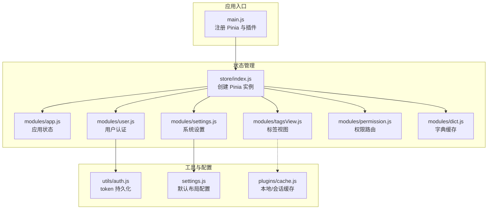
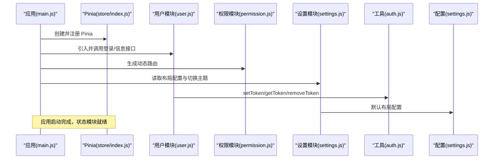
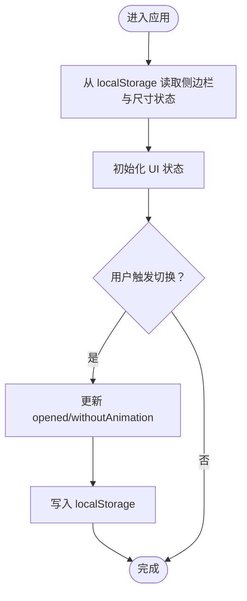
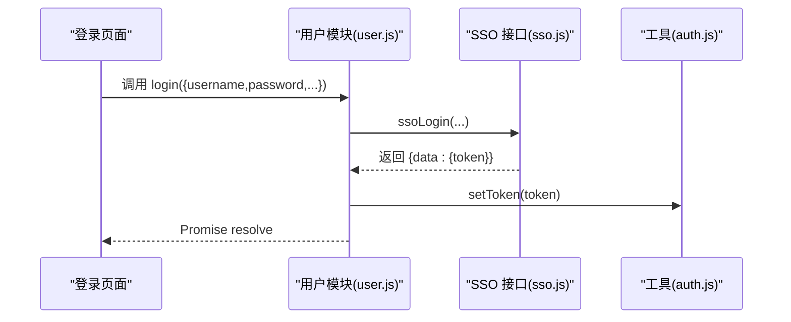
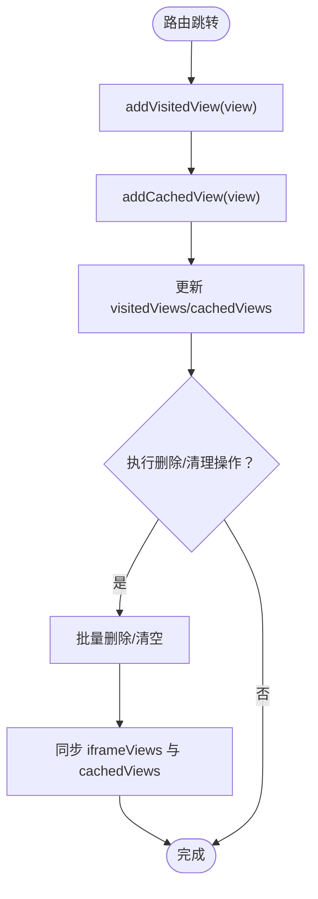
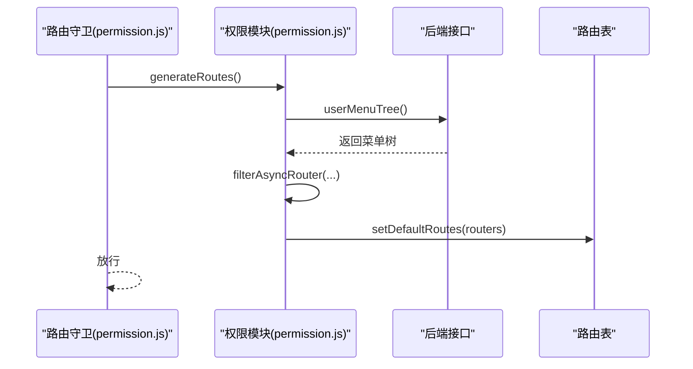
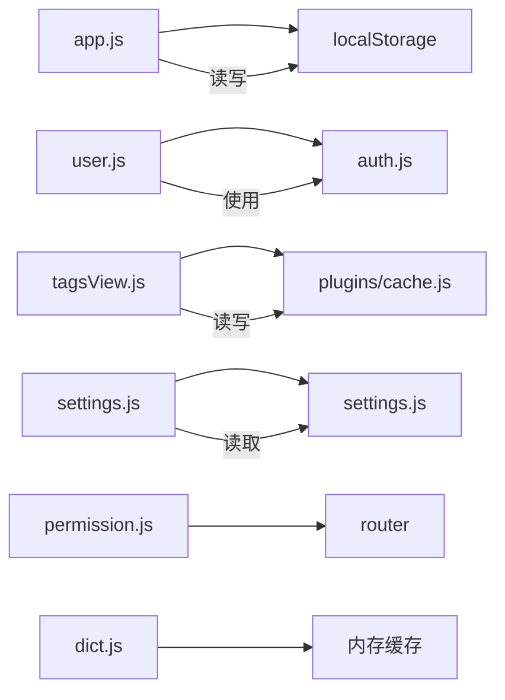

# 状态管理

<cite>
**本文引用的文件**
- [store/index.js](file://generator-ui/src/store/index.js)
- [store/modules/app.js](file://generator-ui/src/store/modules/app.js)
- [store/modules/user.js](file://generator-ui/src/store/modules/user.js)
- [store/modules/tagsView.js](file://generator-ui/src/store/modules/tagsView.js)
- [store/modules/settings.js](file://generator-ui/src/store/modules/settings.js)
- [store/modules/permission.js](file://generator-ui/src/store/modules/permission.js)
- [store/modules/dict.js](file://generator-ui/src/store/modules/dict.js)
- [main.js](file://generator-ui/src/main.js)
- [utils/auth.js](file://generator-ui/src/utils/auth.js)
- [settings.js](file://generator-ui/src/settings.js)
- [plugins/cache.js](file://generator-ui/src/plugins/cache.js)
- [permission.js](file://generator-ui/src/permission.js)
- [plugins/auth.js](file://generator-ui/src/plugins/auth.js)
- [utils/dynamicTitle.js](file://generator-ui/src/utils/dynamicTitle.js)
- [plugins/tab.js](file://generator-ui/src/plugins/tab.js)
</cite>

## 目录
1. [简介](#简介)
2. [项目结构](#项目结构)
3. [核心组件](#核心组件)
4. [架构总览](#架构总览)
5. [详细组件分析](#详细组件分析)
6. [依赖关系分析](#依赖关系分析)
7. [性能考量](#性能考量)
8. [故障排查指南](#故障排查指南)
9. [结论](#结论)
10. [附录](#附录)

## 简介
本文件面向 SH-Generator 的前端状态管理，基于 Pinia 实现，围绕“模块化、可维护性、可扩展性”设计目标，系统梳理了应用状态(app)、用户认证(user)、标签视图(tagsView)、系统设置(settings)、权限(permission)与字典(dict)六大模块的职责边界、数据流与持久化策略，并给出最佳实践、调试技巧与性能优化建议。读者无需深入源码即可理解各模块如何协同工作。

## 项目结构
- 状态入口：在应用入口中注册 Pinia，并在根组件中注入 store。
- 模块组织：store/modules 下按功能拆分模块，每个模块导出一个命名的 store 函数，便于按需引入与组合。
- 工具与配置：通过 utils/auth.js 提供 token 存取；通过 settings.js 提供默认布局配置；通过 plugins/cache.js 提供本地/会话缓存封装。



图表来源
- [main.js:1-105](file://generator-ui/src/main.js#L1-L105)
- [store/index.js:1-3](file://generator-ui/src/store/index.js#L1-L3)
- [store/modules/app.js:1-45](file://generator-ui/src/store/modules/app.js#L1-L45)
- [store/modules/user.js:1-92](file://generator-ui/src/store/modules/user.js#L1-L92)
- [store/modules/tagsView.js:1-183](file://generator-ui/src/store/modules/tagsView.js#L1-L183)
- [store/modules/settings.js:1-52](file://generator-ui/src/store/modules/settings.js#L1-L52)
- [store/modules/permission.js:1-118](file://generator-ui/src/store/modules/permission.js#L1-L118)
- [store/modules/dict.js:1-58](file://generator-ui/src/store/modules/dict.js#L1-L58)
- [utils/auth.js:1-14](file://generator-ui/src/utils/auth.js#L1-L14)
- [settings.js:1-60](file://generator-ui/src/settings.js#L1-L60)
- [plugins/cache.js:1-80](file://generator-ui/src/plugins/cache.js#L1-L80)

章节来源
- [main.js:1-105](file://generator-ui/src/main.js#L1-L105)
- [store/index.js:1-3](file://generator-ui/src/store/index.js#L1-L3)

## 核心组件
- Pinia 实例：在 store/index.js 中创建并导出，作为全局状态容器。
- 应用状态(app)：管理侧边栏开关、设备类型、界面尺寸等基础 UI 状态，并与 localStorage 同步。
- 用户认证(user)：负责登录、获取用户信息、登出流程，结合 SSO 接口与 token 持久化。
- 标签视图(tagsView)：维护访问历史、缓存集合与 iframe 视图列表，支持增删改查与批量清理。
- 系统设置(settings)：管理主题、导航模式、标签页、固定头、侧栏 Logo、动态标题等布局与外观配置，并与 localStorage 同步。
- 权限(permission)：根据后端返回的菜单树生成动态路由，支持权限过滤与组件懒加载。
- 字典(dict)：提供键值对字典的增删清空能力，用于页面渲染与业务逻辑中的临时数据缓存。

章节来源
- [store/index.js:1-3](file://generator-ui/src/store/index.js#L1-L3)
- [store/modules/app.js:1-45](file://generator-ui/src/store/modules/app.js#L1-L45)
- [store/modules/user.js:1-92](file://generator-ui/src/store/modules/user.js#L1-L92)
- [store/modules/tagsView.js:1-183](file://generator-ui/src/store/modules/tagsView.js#L1-L183)
- [store/modules/settings.js:1-52](file://generator-ui/src/store/modules/settings.js#L1-L52)
- [store/modules/permission.js:1-118](file://generator-ui/src/store/modules/permission.js#L1-L118)
- [store/modules/dict.js:1-58](file://generator-ui/src/store/modules/dict.js#L1-L58)

## 架构总览
下图展示了应用启动时 Pinia 初始化、模块装配以及与工具/配置的交互关系。



图表来源
- [main.js:1-105](file://generator-ui/src/main.js#L1-L105)
- [store/index.js:1-3](file://generator-ui/src/store/index.js#L1-L3)
- [store/modules/user.js:1-92](file://generator-ui/src/store/modules/user.js#L1-L92)
- [store/modules/permission.js:1-118](file://generator-ui/src/store/modules/permission.js#L1-L118)
- [store/modules/settings.js:1-52](file://generator-ui/src/store/modules/settings.js#L1-L52)
- [utils/auth.js:1-14](file://generator-ui/src/utils/auth.js#L1-L14)
- [settings.js:1-60](file://generator-ui/src/settings.js#L1-L60)

## 详细组件分析

### 应用状态模块(app)
- 职责：控制侧边栏展开/收起、设备类型、界面尺寸等基础 UI 状态，并与 localStorage 同步，保证刷新后状态一致。
- 关键点：
  - 侧边栏状态来自 localStorage 初始化，避免每次刷新丢失。
  - 尺寸变化写回 localStorage，影响 Element Plus 全局尺寸。
  - 提供隐藏侧边栏的开关，用于响应式场景或全屏模式。
- 最佳实践：
  - 在路由守卫或布局组件中统一调用 toggleSideBar/closeSideBar，避免分散逻辑。
  - 对于动画相关状态 withoutAnimation，仅在需要无动画切换时传入。



图表来源
- [store/modules/app.js:1-45](file://generator-ui/src/store/modules/app.js#L1-L45)

章节来源
- [store/modules/app.js:1-45](file://generator-ui/src/store/modules/app.js#L1-L45)

### 用户认证模块(user)
- 职责：登录、获取用户信息、登出；与 SSO 接口对接；通过 tokenKey 持久化令牌。
- 关键点：
  - 登录返回 Promise，便于在表单中统一处理成功/失败。
  - 获取用户信息解析 JWT payload，填充用户资料。
  - 登出调用后端接口并清除本地 token。
- 最佳实践：
  - 在路由守卫中优先调用 getInfo，确保权限与标题同步。
  - 登录成功后立即设置 token，再进行路由跳转。
  - 对异常 token 格式进行显式校验与错误提示。



图表来源
- [store/modules/user.js:1-92](file://generator-ui/src/store/modules/user.js#L1-L92)
- [utils/auth.js:1-14](file://generator-ui/src/utils/auth.js#L1-L14)

章节来源
- [store/modules/user.js:1-92](file://generator-ui/src/store/modules/user.js#L1-L92)
- [utils/auth.js:1-14](file://generator-ui/src/utils/auth.js#L1-L14)

### 标签视图模块(tagsView)
- 职责：维护访问历史 visitedViews、缓存集合 cachedViews、iframe 视图 iframeViews；提供增删改查与批量清理能力。
- 关键点：
  - addView 内部同时维护 visited 与 cached，避免状态不同步。
  - 支持保留固定页签(affix)、按左右区间删除、清空非固定页签等复杂操作。
  - 删除时同步清理 cached 与 iframe 视图，防止内存泄漏。
- 最佳实践：
  - 在路由跳转时统一调用 addView/updateVisitedView，确保标题与缓存一致。
  - 批量清理前先确认 affix 固定项，避免误删。



图表来源
- [store/modules/tagsView.js:1-183](file://generator-ui/src/store/modules/tagsView.js#L1-L183)

章节来源
- [store/modules/tagsView.js:1-183](file://generator-ui/src/store/modules/tagsView.js#L1-L183)

### 系统设置模块(settings)
- 职责：管理主题、导航模式、标签页、固定头、侧栏 Logo、动态标题、暗黑模式等布局配置；与 localStorage 同步。
- 关键点：
  - 从默认配置与 localStorage 合并初始化，保证首次加载与用户偏好一致。
  - changeSetting 支持运行时动态修改任意配置项。
  - toggleTheme 切换 isDark 并联动 @vueuse/core 的 useDark/useToggle。
- 最佳实践：
  - 在设置面板中统一通过 changeSetting 修改，避免分散赋值。
  - 动态标题通过 useDynamicTitle 更新浏览器标题，保持一致性。

```mermaid
sequenceDiagram
participant Panel as "设置面板"
participant Set as "设置模块(settings.js)"
participant Theme as "@vueuse/core"
participant Title as "动态标题"
Panel->>Set : changeSetting({key,value})
Set->>Set : this[key] = value
Panel->>Set : toggleTheme()
Set->>Theme : toggleDark()
Set->>Title : useDynamicTitle()
```

图表来源
- [store/modules/settings.js:1-52](file://generator-ui/src/store/modules/settings.js#L1-L52)
- [utils/dynamicTitle.js:1-20](file://generator-ui/src/utils/dynamicTitle.js#L1-L20)

章节来源
- [store/modules/settings.js:1-52](file://generator-ui/src/store/modules/settings.js#L1-L52)
- [settings.js:1-60](file://generator-ui/src/settings.js#L1-L60)
- [utils/dynamicTitle.js:1-20](file://generator-ui/src/utils/dynamicTitle.js#L1-L20)

### 权限模块(permission)
- 职责：拉取后端菜单树，转换为前端路由，支持权限过滤与组件懒加载。
- 关键点：
  - generateRoutes 返回 Promise，便于在路由守卫中等待权限加载完成。
  - filterAsyncRouter 将字符串组件映射为真实组件，支持 Layout/ParentView/InnerLink 特殊处理。
  - filterDynamicRoutes 根据角色/权限数组进行细粒度过滤。
- 最佳实践：
  - 在路由守卫中先 generateRoutes，再放行到目标路由。
  - 对需要缓存的路由设置 meta.noCache=false，避免重复渲染。



图表来源
- [store/modules/permission.js:1-118](file://generator-ui/src/store/modules/permission.js#L1-L118)
- [permission.js:1-20](file://generator-ui/src/permission.js#L1-L20)

章节来源
- [store/modules/permission.js:1-118](file://generator-ui/src/store/modules/permission.js#L1-L118)
- [permission.js:1-20](file://generator-ui/src/permission.js#L1-L20)

### 字典模块(dict)
- 职责：提供键值对字典的增删清空能力，用于页面渲染与业务逻辑中的临时数据缓存。
- 关键点：
  - getDict/setDict/removeDict/cleanDict 提供基本 CRUD。
  - 适合短期缓存，不涉及持久化。
- 最佳实践：
  - 与远程字典服务配合使用，避免重复请求。
  - 在组件卸载时按需清理，避免内存累积。

章节来源
- [store/modules/dict.js:1-58](file://generator-ui/src/store/modules/dict.js#L1-L58)

## 依赖关系分析
- 模块内聚：各模块职责清晰，app/settings 负责 UI 状态与布局；user/permission 负责认证与路由；tagsView 负责标签页生命周期；dict 提供轻量缓存。
- 外部依赖：
  - utils/auth.js：token 持久化。
  - settings.js：默认布局配置。
  - plugins/cache.js：本地/会话缓存封装。
- 耦合控制：
  - 用户模块与权限模块通过路由守卫与工具函数解耦。
  - 设置模块与动态标题通过工具函数解耦。



图表来源
- [store/modules/app.js:1-45](file://generator-ui/src/store/modules/app.js#L1-L45)
- [store/modules/user.js:1-92](file://generator-ui/src/store/modules/user.js#L1-L92)
- [store/modules/tagsView.js:1-183](file://generator-ui/src/store/modules/tagsView.js#L1-L183)
- [store/modules/settings.js:1-52](file://generator-ui/src/store/modules/settings.js#L1-L52)
- [store/modules/permission.js:1-118](file://generator-ui/src/store/modules/permission.js#L1-L118)
- [store/modules/dict.js:1-58](file://generator-ui/src/store/modules/dict.js#L1-L58)
- [utils/auth.js:1-14](file://generator-ui/src/utils/auth.js#L1-L14)
- [settings.js:1-60](file://generator-ui/src/settings.js#L1-L60)
- [plugins/cache.js:1-80](file://generator-ui/src/plugins/cache.js#L1-L80)

章节来源
- [store/modules/app.js:1-45](file://generator-ui/src/store/modules/app.js#L1-L45)
- [store/modules/user.js:1-92](file://generator-ui/src/store/modules/user.js#L1-L92)
- [store/modules/tagsView.js:1-183](file://generator-ui/src/store/modules/tagsView.js#L1-L183)
- [store/modules/settings.js:1-52](file://generator-ui/src/store/modules/settings.js#L1-L52)
- [store/modules/permission.js:1-118](file://generator-ui/src/store/modules/permission.js#L1-L118)
- [store/modules/dict.js:1-58](file://generator-ui/src/store/modules/dict.js#L1-L58)
- [utils/auth.js:1-14](file://generator-ui/src/utils/auth.js#L1-L14)
- [settings.js:1-60](file://generator-ui/src/settings.js#L1-L60)
- [plugins/cache.js:1-80](file://generator-ui/src/plugins/cache.js#L1-L80)

## 性能考量
- 状态粒度：将高频变更与低频配置分离，减少不必要的响应式开销。
- 缓存策略：
  - localStorage 用于持久化布局与 UI 状态，避免每次刷新重算。
  - sessionStorage 用于会话级临时数据，如表单草稿。
  - 内存字典用于短期渲染数据，避免网络请求抖动。
- 路由与组件：
  - 动态路由仅在登录后生成一次，后续复用。
  - 标签页缓存仅针对非 noCache 的路由，避免过度缓存导致内存压力。
- 主题与标题：
  - 暗黑模式切换通过 VueUse 的响应式开关，避免频繁 DOM 变更。
  - 动态标题仅在必要时更新，减少浏览器重绘。

## 故障排查指南
- 登录后无法获取用户信息
  - 检查 token 是否正确写入 localStorage。
  - 校验 JWT 结构是否为三段式。
  - 查看后端返回的 payload 字段是否包含预期用户信息。
- 侧边栏状态不生效
  - 确认 localStorage 中是否存在 sidebarStatus 键。
  - 检查 toggleSideBar/closeSideBar 是否被调用。
- 标签页异常
  - 确认 addView 是否同时更新 visited 与 cached。
  - 批量删除后 cached 是否同步清理。
- 布局设置不持久
  - 检查 changeSetting 是否写入 localStorage。
  - 确认页面刷新后是否从 localStorage 合并初始化。
- 权限路由无效
  - 确认 generateRoutes 是否在路由守卫中等待完成。
  - 检查 filterAsyncRouter 是否正确映射组件名。

章节来源
- [store/modules/user.js:1-92](file://generator-ui/src/store/modules/user.js#L1-L92)
- [store/modules/app.js:1-45](file://generator-ui/src/store/modules/app.js#L1-L45)
- [store/modules/tagsView.js:1-183](file://generator-ui/src/store/modules/tagsView.js#L1-L183)
- [store/modules/settings.js:1-52](file://generator-ui/src/store/modules/settings.js#L1-L52)
- [store/modules/permission.js:1-118](file://generator-ui/src/store/modules/permission.js#L1-L118)

## 结论
该状态管理体系以 Pinia 为核心，采用模块化设计，职责清晰、耦合可控。通过 localStorage 与工具函数实现关键状态的持久化与跨模块共享，结合动态路由与标签页缓存，满足多页面应用的复杂交互需求。遵循本文的最佳实践与调试建议，可在保证开发效率的同时提升系统的稳定性与性能。

## 附录
- 使用指南
  - 在组件中引入对应模块：例如导入 useUserStore、useSettingsStore、useTagsViewStore。
  - 在路由守卫中调用 generateRoutes 完成权限初始化。
  - 在登录成功后调用 getInfo，确保用户信息与标题同步。
- 示例参考路径
  - [登录流程:18-34](file://generator-ui/src/store/modules/user.js#L18-L34)
  - [获取用户信息:36-75](file://generator-ui/src/store/modules/user.js#L36-L75)
  - [设置布局配置:32-37](file://generator-ui/src/store/modules/settings.js#L32-L37)
  - [动态路由生成:35-44](file://generator-ui/src/store/modules/permission.js#L35-L44)
  - [标签页增删改:10-178](file://generator-ui/src/store/modules/tagsView.js#L10-L178)