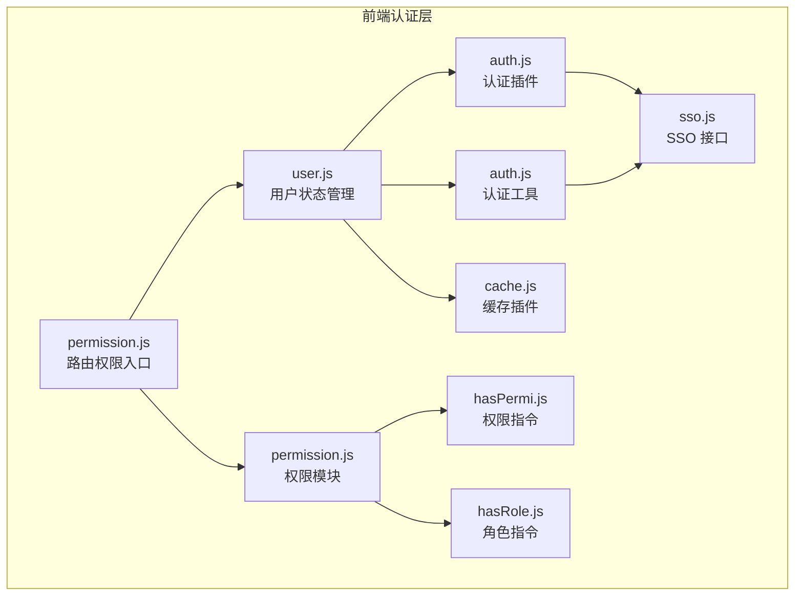
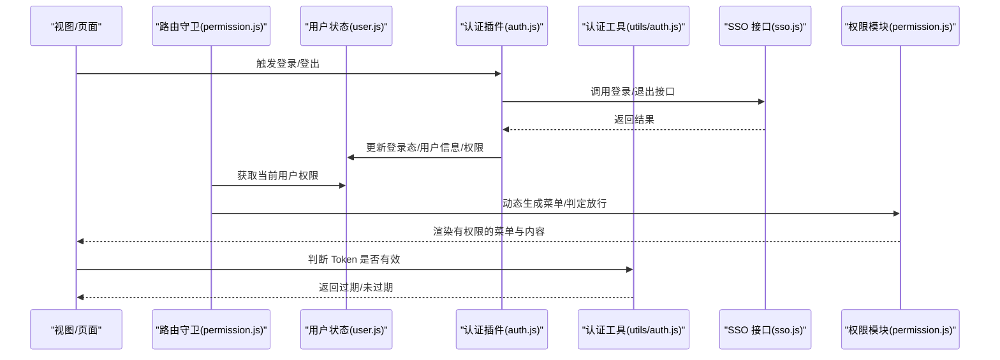
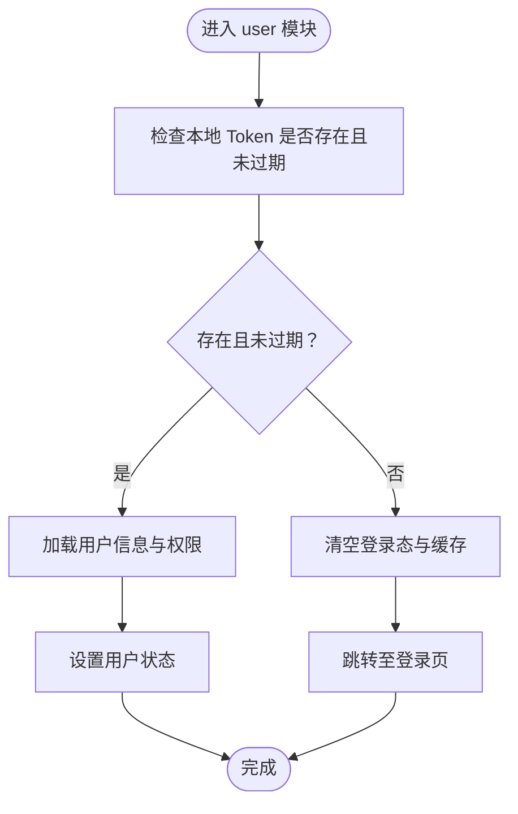
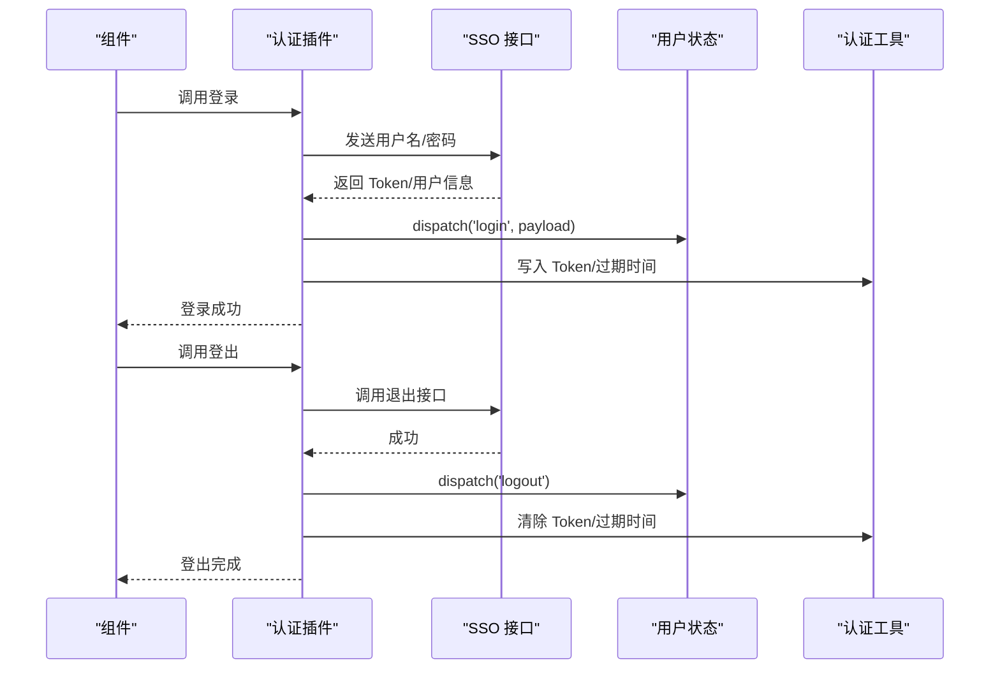
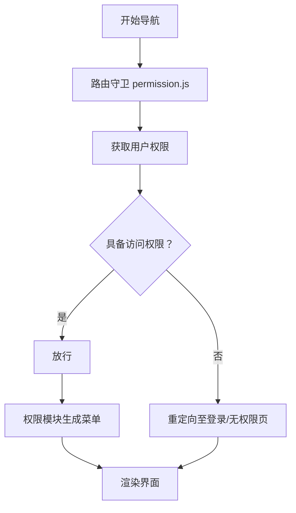
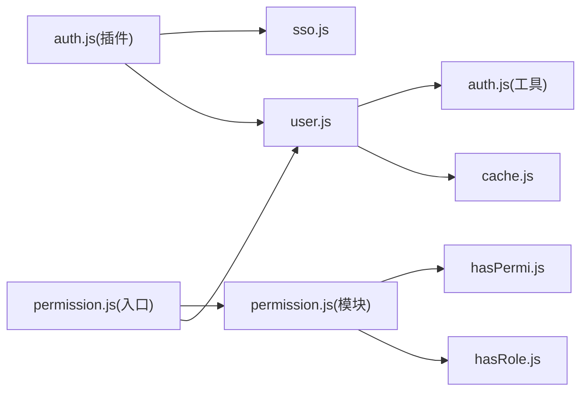

# 用户认证模块

<cite>
**本文档引用的文件**
- [user.js](file://generator-ui/src/store/modules/user.js)
- [auth.js（插件）](file://generator-ui/src/plugins/auth.js)
- [auth.js（工具）](file://generator-ui/src/utils/auth.js)
- [cache.js](file://generator-ui/src/plugins/cache.js)
- [permission.js（入口）](file://generator-ui/src/permission.js)
- [permission.js（模块）](file://generator-ui/src/store/modules/permission.js)
- [permission.js（工具）](file://generator-ui/src/utils/permission.js)
- [hasPermi.js](file://generator-ui/src/directive/permission/hasPermi.js)
- [hasRole.js](file://generator-ui/src/directive/permission/hasRole.js)
- [sso.js](file://generator-ui/src/api/sso.js)
</cite>

## 目录
1. [简介](#简介)
2. [项目结构](#项目结构)
3. [核心组件](#核心组件)
4. [架构总览](#架构总览)
5. [详细组件分析](#详细组件分析)
6. [依赖关系分析](#依赖关系分析)
7. [性能考虑](#性能考虑)
8. [故障排除指南](#故障排除指南)
9. [结论](#结论)

## 简介
本文件聚焦于 SH-Generator 的用户认证与授权子系统，围绕前端状态管理中的 user 模块展开，系统性阐述以下主题：
- 登录状态管理与 Token 生命周期（存储、刷新）
- 用户信息缓存策略
- 权限角色管理与菜单动态生成
- 登录/登出流程的状态管理实现
- 会话过期与自动登出机制
- 安全相关的状态管理最佳实践与错误处理策略
- 提供可定位到源码的示例路径与使用场景

## 项目结构
认证相关能力主要分布在前端工程 generator-ui 中，核心文件包括：
- 用户状态管理：store/modules/user.js
- 认证插件与工具：plugins/auth.js、utils/auth.js
- 权限与路由守卫：permission.js（入口）、store/modules/permission.js、utils/permission.js
- 权限指令：directive/permission/hasPermi.js、hasRole.js
- 缓存插件：plugins/cache.js
- 单点登录接口：api/sso.js

图表来源
- [user.js:1-200](file://generator-ui/src/store/modules/user.js#L1-L200)
- [permission.js（入口）:1-120](file://generator-ui/src/permission.js#L1-L120)
- [permission.js（模块）:1-200](file://generator-ui/src/store/modules/permission.js#L1-L200)
- [auth.js（插件）:1-120](file://generator-ui/src/plugins/auth.js#L1-L120)
- [auth.js（工具）:1-120](file://generator-ui/src/utils/auth.js#L1-L120)
- [cache.js:1-120](file://generator-ui/src/plugins/cache.js#L1-L120)
- [hasPermi.js:1-120](file://generator-ui/src/directive/permission/hasPermi.js#L1-L120)
- [hasRole.js:1-120](file://generator-ui/src/directive/permission/hasRole.js#L1-L120)
- [sso.js:1-200](file://generator-ui/src/api/sso.js#L1-L200)

章节来源
- [user.js:1-200](file://generator-ui/src/store/modules/user.js#L1-L200)
- [permission.js（入口）:1-120](file://generator-ui/src/permission.js#L1-L120)
- [permission.js（模块）:1-200](file://generator-ui/src/store/modules/permission.js#L1-L200)
- [auth.js（插件）:1-120](file://generator-ui/src/plugins/auth.js#L1-L120)
- [auth.js（工具）:1-120](file://generator-ui/src/utils/auth.js#L1-L120)
- [cache.js:1-120](file://generator-ui/src/plugins/cache.js#L1-L120)
- [hasPermi.js:1-120](file://generator-ui/src/directive/permission/hasPermi.js#L1-L120)
- [hasRole.js:1-120](file://generator-ui/src/directive/permission/hasRole.js#L1-L120)
- [sso.js:1-200](file://generator-ui/src/api/sso.js#L1-L200)

## 核心组件
- 用户状态管理（user.js）
  - 负责登录态、用户信息、Token 存储与刷新、角色/权限集合等状态的集中管理
  - 提供登录、登出、获取用户信息、更新权限等动作
- 认证插件与工具（plugins/auth.js、utils/auth.js）
  - 插件：封装与后端交互的认证流程（如登录、退出），并与状态管理联动
  - 工具：提供 Token 读写、过期判断、清除本地存储等通用方法
- 权限与路由（permission.js 入口与模块；store/modules/permission.js；utils/permission.js）
  - 路由守卫：在导航前根据用户权限决定放行或拦截
  - 权限模块：维护菜单树、按钮权限、角色集合等
  - 权限工具：辅助判断是否拥有某权限或角色
- 权限指令（directive/permission/hasPermi.js、hasRole.js）
  - 在模板层面按权限/角色控制元素显示
- 缓存插件（plugins/cache.js）
  - 统一的本地缓存接口，用于持久化用户信息、菜单、权限等
- SSO 接口（api/sso.js）
  - 提供单点登录相关 API 调用，作为认证数据来源

章节来源
- [user.js:1-200](file://generator-ui/src/store/modules/user.js#L1-L200)
- [auth.js（插件）:1-120](file://generator-ui/src/plugins/auth.js#L1-L120)
- [auth.js（工具）:1-120](file://generator-ui/src/utils/auth.js#L1-L120)
- [permission.js（入口）:1-120](file://generator-ui/src/permission.js#L1-L120)
- [permission.js（模块）:1-200](file://generator-ui/src/store/modules/permission.js#L1-L200)
- [permission.js（工具）:1-120](file://generator-ui/src/utils/permission.js#L1-L120)
- [hasPermi.js:1-120](file://generator-ui/src/directive/permission/hasPermi.js#L1-L120)
- [hasRole.js:1-120](file://generator-ui/src/directive/permission/hasRole.js#L1-L120)
- [cache.js:1-120](file://generator-ui/src/plugins/cache.js#L1-L120)
- [sso.js:1-200](file://generator-ui/src/api/sso.js#L1-L200)

## 架构总览
下图展示从用户操作到状态更新、权限校验与界面渲染的整体流程。

图表来源
- [permission.js（入口）:1-120](file://generator-ui/src/permission.js#L1-L120)
- [user.js:1-200](file://generator-ui/src/store/modules/user.js#L1-L200)
- [auth.js（插件）:1-120](file://generator-ui/src/plugins/auth.js#L1-L120)
- [auth.js（工具）:1-120](file://generator-ui/src/utils/auth.js#L1-L120)
- [sso.js:1-200](file://generator-ui/src/api/sso.js#L1-L200)
- [permission.js（模块）:1-200](file://generator-ui/src/store/modules/permission.js#L1-L200)

## 详细组件分析

### 用户状态管理（user.js）
职责与关键点
- 登录态与用户信息：保存用户基本信息、角色列表、权限集合
- Token 生命周期：记录 Token、过期时间；提供刷新与清理
- 动作分发：login/logout/getInfo/updatePermission 等
- 与缓存联动：通过 cache 插件持久化关键字段

图表来源
- [user.js:1-200](file://generator-ui/src/store/modules/user.js#L1-L200)
- [auth.js（工具）:1-120](file://generator-ui/src/utils/auth.js#L1-L120)
- [cache.js:1-120](file://generator-ui/src/plugins/cache.js#L1-L120)

章节来源
- [user.js:1-200](file://generator-ui/src/store/modules/user.js#L1-L200)

### 认证插件与工具（plugins/auth.js、utils/auth.js）
职责与关键点
- 插件：封装登录/登出请求，调用后端 SSO 接口，并与 user 模块联动更新状态
- 工具：提供 Token 读写、过期判断、清除本地存储、获取用户标识等

图表来源
- [auth.js（插件）:1-120](file://generator-ui/src/plugins/auth.js#L1-L120)
- [auth.js（工具）:1-120](file://generator-ui/src/utils/auth.js#L1-L120)
- [sso.js:1-200](file://generator-ui/src/api/sso.js#L1-L200)
- [user.js:1-200](file://generator-ui/src/store/modules/user.js#L1-L200)

章节来源
- [auth.js（插件）:1-120](file://generator-ui/src/plugins/auth.js#L1-L120)
- [auth.js（工具）:1-120](file://generator-ui/src/utils/auth.js#L1-L120)
- [sso.js:1-200](file://generator-ui/src/api/sso.js#L1-L200)

### 权限与路由（permission.js 入口与模块；store/modules/permission.js；utils/permission.js）
职责与关键点
- 路由守卫：在导航前根据用户权限决定放行或重定向至登录/无权限页
- 权限模块：维护菜单树、按钮权限、角色集合；支持动态生成菜单
- 权限工具：提供 hasPermi/hasRole 辅助函数，供指令与业务使用

图表来源
- [permission.js（入口）:1-120](file://generator-ui/src/permission.js#L1-L120)
- [permission.js（模块）:1-200](file://generator-ui/src/store/modules/permission.js#L1-L200)
- [permission.js（工具）:1-120](file://generator-ui/src/utils/permission.js#L1-L120)

章节来源
- [permission.js（入口）:1-120](file://generator-ui/src/permission.js#L1-L120)
- [permission.js（模块）:1-200](file://generator-ui/src/store/modules/permission.js#L1-L200)
- [permission.js（工具）:1-120](file://generator-ui/src/utils/permission.js#L1-L120)

### 权限指令（directive/permission/hasPermi.js、hasRole.js）
职责与关键点
- 在模板层面按权限/角色控制元素显示，避免重复在组件中做权限判断
- 与权限模块配合，确保界面元素与后端一致

章节来源
- [hasPermi.js:1-120](file://generator-ui/src/directive/permission/hasPermi.js#L1-L120)
- [hasRole.js:1-120](file://generator-ui/src/directive/permission/hasRole.js#L1-L120)

### 缓存插件（plugins/cache.js）
职责与关键点
- 统一的本地缓存接口，用于持久化用户信息、菜单、权限等
- 与 user 模块协同，在登录时写入、登出时清理

章节来源
- [cache.js:1-120](file://generator-ui/src/plugins/cache.js#L1-L120)

### SSO 接口（api/sso.js）
职责与关键点
- 提供登录、登出、获取用户信息等接口调用
- 作为认证插件与权限模块的数据来源

章节来源
- [sso.js:1-200](file://generator-ui/src/api/sso.js#L1-L200)

## 依赖关系分析
- user 模块依赖认证工具与缓存插件进行 Token 管理与持久化
- 认证插件依赖 SSO 接口完成后端交互
- 路由守卫依赖用户状态与权限模块进行放行决策
- 权限指令依赖权限工具与权限模块进行界面控制

图表来源
- [user.js:1-200](file://generator-ui/src/store/modules/user.js#L1-L200)
- [auth.js（插件）:1-120](file://generator-ui/src/plugins/auth.js#L1-L120)
- [auth.js（工具）:1-120](file://generator-ui/src/utils/auth.js#L1-L120)
- [cache.js:1-120](file://generator-ui/src/plugins/cache.js#L1-L120)
- [permission.js（入口）:1-120](file://generator-ui/src/permission.js#L1-L120)
- [permission.js（模块）:1-200](file://generator-ui/src/store/modules/permission.js#L1-L200)
- [hasPermi.js:1-120](file://generator-ui/src/directive/permission/hasPermi.js#L1-L120)
- [hasRole.js:1-120](file://generator-ui/src/directive/permission/hasRole.js#L1-L120)
- [sso.js:1-200](file://generator-ui/src/api/sso.js#L1-L200)

章节来源
- [user.js:1-200](file://generator-ui/src/store/modules/user.js#L1-L200)
- [auth.js（插件）:1-120](file://generator-ui/src/plugins/auth.js#L1-L120)
- [auth.js（工具）:1-120](file://generator-ui/src/utils/auth.js#L1-L120)
- [cache.js:1-120](file://generator-ui/src/plugins/cache.js#L1-L120)
- [permission.js（入口）:1-120](file://generator-ui/src/permission.js#L1-L120)
- [permission.js（模块）:1-200](file://generator-ui/src/store/modules/permission.js#L1-L200)
- [permission.js（工具）:1-120](file://generator-ui/src/utils/permission.js#L1-L120)
- [hasPermi.js:1-120](file://generator-ui/src/directive/permission/hasPermi.js#L1-L120)
- [hasRole.js:1-120](file://generator-ui/src/directive/permission/hasRole.js#L1-L120)
- [sso.js:1-200](file://generator-ui/src/api/sso.js#L1-L200)

## 性能考虑
- 避免频繁读写本地存储：通过缓存插件统一管理，减少 IO 开销
- 权限计算与菜单生成：仅在用户信息变更或权限变化时触发，避免重复渲染
- Token 过期检测：在请求前统一校验，减少无效网络请求
- 指令级权限控制：在模板层面过滤不可见元素，降低运行时判断成本

## 故障排除指南
常见问题与排查步骤
- 登录后无法进入受保护页面
  - 检查路由守卫是否正确读取用户权限
  - 参考路径：[permission.js（入口）:1-120](file://generator-ui/src/permission.js#L1-L120)
- 页面出现 401/403
  - 检查 Token 是否过期或被清除
  - 参考路径：[auth.js（工具）:1-120](file://generator-ui/src/utils/auth.js#L1-L120)
- 登出后仍可访问受保护页面
  - 确认登出流程是否调用了清理 Token 与用户状态
  - 参考路径：[auth.js（插件）:1-120](file://generator-ui/src/plugins/auth.js#L1-L120)，[user.js:1-200](file://generator-ui/src/store/modules/user.js#L1-L200)
- 菜单未按权限动态生成
  - 检查权限模块是否在登录后更新了菜单树
  - 参考路径：[permission.js（模块）:1-200](file://generator-ui/src/store/modules/permission.js#L1-L200)
- 按钮/元素未按权限隐藏
  - 检查权限指令是否正确绑定权限值
  - 参考路径：[hasPermi.js:1-120](file://generator-ui/src/directive/permission/hasPermi.js#L1-L120)，[hasRole.js:1-120](file://generator-ui/src/directive/permission/hasRole.js#L1-L120)

章节来源
- [permission.js（入口）:1-120](file://generator-ui/src/permission.js#L1-L120)
- [auth.js（工具）:1-120](file://generator-ui/src/utils/auth.js#L1-L120)
- [auth.js（插件）:1-120](file://generator-ui/src/plugins/auth.js#L1-L120)
- [user.js:1-200](file://generator-ui/src/store/modules/user.js#L1-L200)
- [permission.js（模块）:1-200](file://generator-ui/src/store/modules/permission.js#L1-L200)
- [hasPermi.js:1-120](file://generator-ui/src/directive/permission/hasPermi.js#L1-L120)
- [hasRole.js:1-120](file://generator-ui/src/directive/permission/hasRole.js#L1-L120)

## 结论
本认证模块以 user 状态为核心，结合认证插件、权限模块与路由守卫，实现了完整的登录态管理、权限控制与菜单动态生成。通过缓存插件与认证工具，保证了 Token 生命周期与本地存储的一致性。建议在实际使用中遵循“先校验 Token，再发起请求”的原则，并在权限变更时及时更新用户状态与菜单树，确保用户体验与安全性。