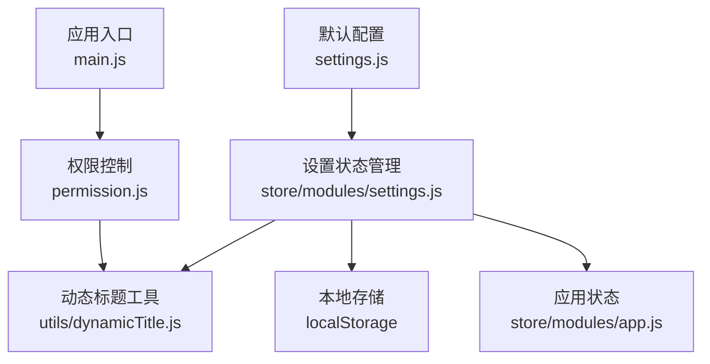
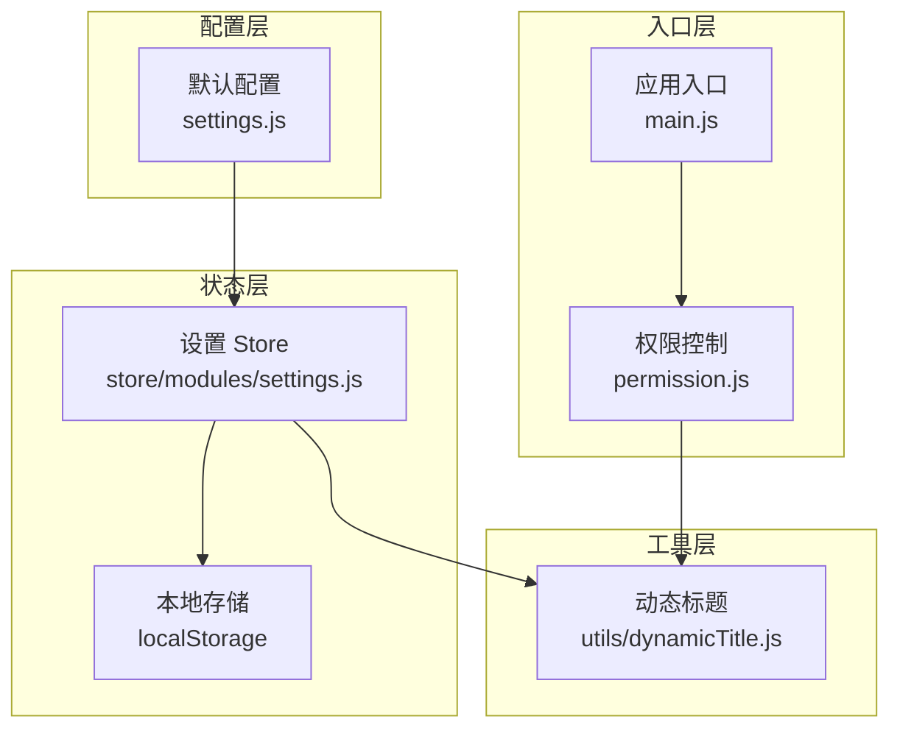
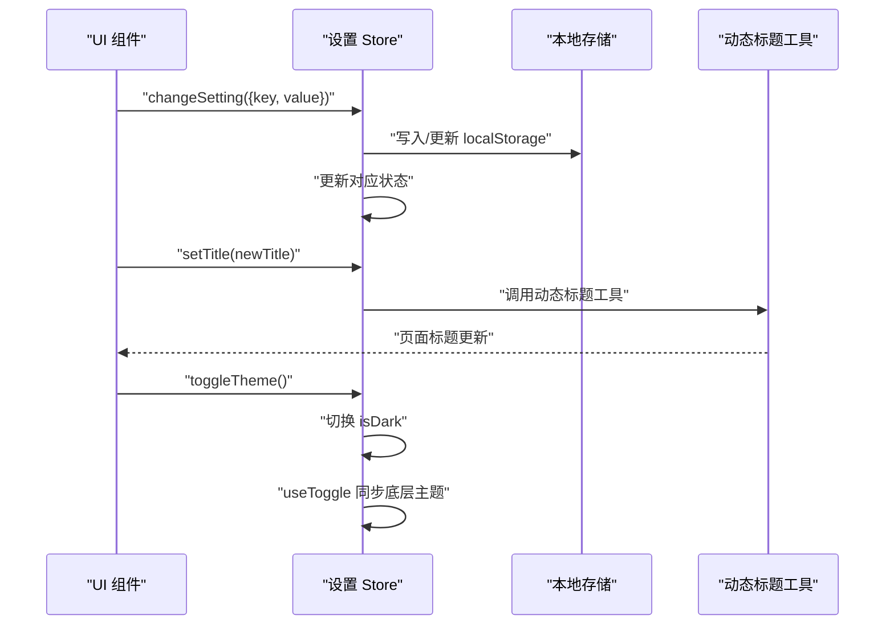
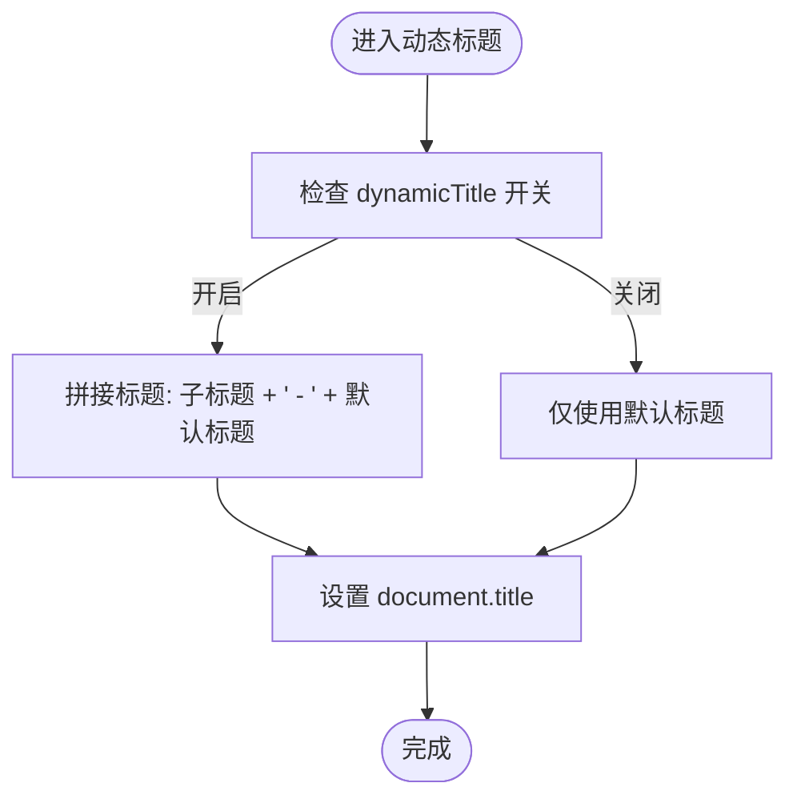
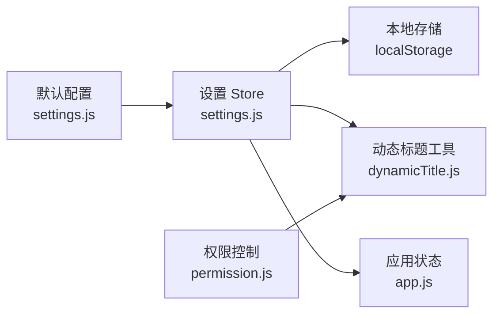

# 系统设置模块

<cite>
**本文档引用的文件**
- [settings.js](file://generator-ui/src/settings.js)
- [settings.js](file://generator-ui/src/store/modules/settings.js)
- [dynamicTitle.js](file://generator-ui/src/utils/dynamicTitle.js)
- [index.js](file://generator-ui/src/store/index.js)
- [main.js](file://generator-ui/src/main.js)
- [permission.js](file://generator-ui/src/permission.js)
- [app.js](file://generator-ui/src/store/modules/app.js)
</cite>

## 目录
1. [简介](#简介)
2. [项目结构](#项目结构)
3. [核心组件](#核心组件)
4. [架构总览](#架构总览)
5. [详细组件分析](#详细组件分析)
6. [依赖关系分析](#依赖关系分析)
7. [性能考虑](#性能考虑)
8. [故障排除指南](#故障排除指南)
9. [结论](#结论)
10. [附录](#附录)

## 简介
本文件针对 SH-Generator 的系统设置模块进行深入技术文档编写，重点阐述 settings 模块在系统配置管理中的核心地位，涵盖系统主题、布局设置、语言配置等全局设置的状态管理机制；详细说明设置项的默认值处理、用户偏好存储与本地持久化、实时生效机制；提供设置项的验证规则与数据类型转换策略；包含设置重置、导入导出功能的实现方案建议；阐述设置状态与 UI 组件的双向绑定机制，并给出具体配置示例与扩展开发指南。

## 项目结构
系统设置模块主要由以下部分组成：
- 默认配置：定义全局默认设置项，包括网页标题、侧边栏主题、导航模式、标签页、固定头部、Logo、动态标题、页脚可见性与内容等。
- 设置状态管理：基于 Pinia 的 settings store，负责状态初始化、变更、持久化到 localStorage、与工具函数联动。
- 动态标题：根据设置动态拼接页面标题，确保与默认标题保持一致格式。
- 权限与入口：在应用启动与路由切换时，通过权限控制与动态标题工具更新页面标题。

**图表来源**
- [settings.js:1-59](file://generator-ui/src/settings.js#L1-L59)
- [settings.js:1-51](file://generator-ui/src/store/modules/settings.js#L1-L51)
- [dynamicTitle.js:1-12](file://generator-ui/src/utils/dynamicTitle.js#L1-L12)
- [permission.js:1-30](file://generator-ui/src/permission.js#L1-L30)
- [app.js:1-200](file://generator-ui/src/store/modules/app.js#L1-L200)

**章节来源**
- [settings.js:1-59](file://generator-ui/src/settings.js#L1-L59)
- [settings.js:1-51](file://generator-ui/src/store/modules/settings.js#L1-L51)
- [dynamicTitle.js:1-12](file://generator-ui/src/utils/dynamicTitle.js#L1-L12)
- [permission.js:1-30](file://generator-ui/src/permission.js#L1-L30)
- [app.js:1-200](file://generator-ui/src/store/modules/app.js#L1-L200)

## 核心组件
- 默认配置模块：集中定义所有可配置项的默认值，作为全局配置源，保证各组件与状态管理的一致性。
- 设置 Store：封装状态与动作，负责从 localStorage 恢复用户偏好、响应变更、触发主题与标题更新。
- 动态标题工具：根据当前设置与默认标题生成最终页面标题，支持“动态标题”开关。
- 权限与入口：在路由切换时自动设置页面标题，确保标题与当前页面语义一致。

**章节来源**
- [settings.js:1-59](file://generator-ui/src/settings.js#L1-L59)
- [settings.js:1-51](file://generator-ui/src/store/modules/settings.js#L1-L51)
- [dynamicTitle.js:1-12](file://generator-ui/src/utils/dynamicTitle.js#L1-L12)
- [permission.js:1-30](file://generator-ui/src/permission.js#L1-L30)

## 架构总览
系统设置模块采用“默认配置 + 状态管理 + 工具函数”的分层设计：
- 默认配置层：提供统一的默认值，避免硬编码分散在各处。
- 状态管理层：以 Pinia store 为核心，负责状态初始化、变更与持久化。
- 工具函数层：与设置联动，如动态标题、主题切换等。
- 入口与权限层：在应用生命周期中注入设置逻辑，确保标题与主题随设置变化而实时生效。

**图表来源**
- [settings.js:1-59](file://generator-ui/src/settings.js#L1-L59)
- [settings.js:1-51](file://generator-ui/src/store/modules/settings.js#L1-L51)
- [dynamicTitle.js:1-12](file://generator-ui/src/utils/dynamicTitle.js#L1-L12)
- [permission.js:1-30](file://generator-ui/src/permission.js#L1-L30)
- [main.js:1-200](file://generator-ui/src/main.js#L1-L200)

## 详细组件分析

### 默认配置模块（settings.js）
- 职责：集中定义系统全局默认设置项，包括网页标题、侧边栏主题、是否显示系统布局配置、菜单导航模式、标签页显示与图标、固定头部、Logo、动态标题、页脚可见性与内容等。
- 设计原则：单一职责、易于扩展、与 UI 布局组件解耦。
- 关键点：提供稳定默认值，供设置 Store 初始化与 UI 组件直接引用。

**章节来源**
- [settings.js:1-59](file://generator-ui/src/settings.js#L1-L59)

### 设置状态管理（store/modules/settings.js）
- 状态初始化：
  - 从 localStorage 恢复用户偏好，若不存在则回退到默认配置。
  - 使用 VueUse 的 useDark 与 useToggle 实现暗黑模式状态与切换。
- 变更与持久化：
  - changeSetting 接受 {key, value} 结构，仅对已存在属性进行赋值，避免无效字段污染。
  - setTitle 动作在设置标题后调用动态标题工具，确保标题即时生效。
  - toggleTheme 切换 isDark 并通过 useToggle 同步底层主题状态。
- 与工具联动：
  - 动态标题工具根据 settingsStore.dynamicTitle 与 settingsStore.title 自动拼接默认标题。
  - 权限控制在路由切换时调用 setTitle，确保页面标题与 meta.title 一致。

**图表来源**
- [settings.js:30-47](file://generator-ui/src/store/modules/settings.js#L30-L47)
- [dynamicTitle.js:1-12](file://generator-ui/src/utils/dynamicTitle.js#L1-L12)
- [permission.js:1-30](file://generator-ui/src/permission.js#L1-L30)

**章节来源**
- [settings.js:1-51](file://generator-ui/src/store/modules/settings.js#L1-L51)
- [dynamicTitle.js:1-12](file://generator-ui/src/utils/dynamicTitle.js#L1-L12)
- [permission.js:1-30](file://generator-ui/src/permission.js#L1-L30)

### 动态标题工具（utils/dynamicTitle.js）
- 功能：根据 settingsStore.dynamicTitle 与 settingsStore.title，将默认标题拼接到页面标题末尾，形成“子标题 - 默认标题”的格式。
- 触发时机：在 setTitle 动作或路由切换时被调用，确保标题与当前页面语义一致。
- 注意事项：当 dynamicTitle 关闭时，仅使用默认标题。

**图表来源**
- [dynamicTitle.js:1-12](file://generator-ui/src/utils/dynamicTitle.js#L1-L12)

**章节来源**
- [dynamicTitle.js:1-12](file://generator-ui/src/utils/dynamicTitle.js#L1-L12)

### 权限与入口集成（permission.js、main.js）
- 在路由切换时，若 meta.title 存在，则调用设置 Store 的 setTitle，确保页面标题与路由语义一致。
- 应用入口负责挂载与初始化，确保设置 Store 在应用启动前可用。

**章节来源**
- [permission.js:1-30](file://generator-ui/src/permission.js#L1-L30)
- [main.js:1-200](file://generator-ui/src/main.js#L1-L200)

## 依赖关系分析
- 默认配置与设置 Store：设置 Store 以默认配置为基准，优先从 localStorage 恢复用户偏好，再回退到默认值。
- 设置 Store 与动态标题工具：当标题或动态标题开关发生变化时，动态标题工具会重新计算并设置 document.title。
- 设置 Store 与权限控制：权限控制在路由切换时调用 setTitle，确保标题与当前页面一致。
- 设置 Store 与应用状态：与 app store 协同，共同维护应用整体状态一致性。

**图表来源**
- [settings.js:1-59](file://generator-ui/src/settings.js#L1-L59)
- [settings.js:1-51](file://generator-ui/src/store/modules/settings.js#L1-L51)
- [dynamicTitle.js:1-12](file://generator-ui/src/utils/dynamicTitle.js#L1-L12)
- [permission.js:1-30](file://generator-ui/src/permission.js#L1-L30)
- [app.js:1-200](file://generator-ui/src/store/modules/app.js#L1-L200)

**章节来源**
- [settings.js:1-59](file://generator-ui/src/settings.js#L1-L59)
- [settings.js:1-51](file://generator-ui/src/store/modules/settings.js#L1-L51)
- [dynamicTitle.js:1-12](file://generator-ui/src/utils/dynamicTitle.js#L1-L12)
- [permission.js:1-30](file://generator-ui/src/permission.js#L1-L30)
- [app.js:1-200](file://generator-ui/src/store/modules/app.js#L1-L200)

## 性能考虑
- 状态最小化更新：changeSetting 仅对已存在属性进行赋值，避免不必要的响应式开销。
- 本地存储批量读取：初始化时一次性读取 localStorage，减少多次 IO。
- 主题切换轻量级：使用 VueUse 的 useDark/useToggle，底层通过 class 或 CSS 变量切换，避免全量重绘。
- 动态标题按需更新：仅在标题或开关变化时触发，避免频繁 DOM 更新。

## 故障排除指南
- 标题未更新：
  - 检查是否正确调用 setTitle，确认 dynamicTitle 开关状态。
  - 确认动态标题工具是否被调用。
- 主题切换无效：
  - 检查 isDark 状态是否变化，确认 useToggle 是否同步到底层主题系统。
- 设置未持久化：
  - 检查 localStorage 中是否存在 layout-setting 键，确认 changeSetting 是否正确写入。
- 页面标题异常：
  - 检查 meta.title 与默认标题拼接逻辑，确认动态标题工具执行顺序。

**章节来源**
- [settings.js:30-47](file://generator-ui/src/store/modules/settings.js#L30-L47)
- [dynamicTitle.js:1-12](file://generator-ui/src/utils/dynamicTitle.js#L1-L12)
- [permission.js:1-30](file://generator-ui/src/permission.js#L1-L30)

## 结论
系统设置模块通过“默认配置 + Pinia 状态管理 + 工具函数”的架构，实现了全局设置的统一管理与实时生效。其设计具备良好的扩展性与可维护性，能够满足主题、布局、标题等多维度配置需求，并为后续的语言配置、复杂校验与导入导出能力提供了清晰的扩展路径。

## 附录

### 配置项与默认值说明
- 网页标题：来自默认配置，用于动态标题拼接。
- 侧边栏主题：深色/浅色主题标识，影响侧边栏外观。
- 是否显示系统布局配置：控制设置面板是否展示。
- 菜单导航模式：左侧、混合、顶部三种导航模式。
- 标签页显示与图标：控制标签页与图标显示。
- 固定头部与 Logo：控制头部固定与 Logo 展示。
- 动态标题：控制是否启用“子标题 - 默认标题”的拼接。
- 页脚可见性与内容：控制页脚显示与内容。

**章节来源**
- [settings.js:1-59](file://generator-ui/src/settings.js#L1-L59)

### 数据类型与验证规则
- 数据类型：布尔值（如显示开关）、数值（如导航模式）、字符串（如标题、颜色）。
- 验证策略：
  - changeSetting 仅对已存在属性进行赋值，避免无效字段。
  - 导航模式应限定在预设枚举范围内（如 1、2、3），可在 UI 层或 store 动作中增加范围校验。
  - 颜色值建议限制为合法十六进制颜色码，可在 action 中增加正则校验。
  - 标题长度与字符集建议限制，防止 XSS 与过长标题导致 UI 异常。

**章节来源**
- [settings.js:30-47](file://generator-ui/src/store/modules/settings.js#L30-L47)

### 实时生效机制
- 设置 Store 在变更时立即更新状态，并通过工具函数（如动态标题）即时反映到 UI。
- 主题切换通过 useDark/useToggle 实时同步到底层样式系统。
- 路由切换时通过权限控制自动设置页面标题，确保标题与当前页面一致。

**章节来源**
- [settings.js:30-47](file://generator-ui/src/store/modules/settings.js#L30-L47)
- [dynamicTitle.js:1-12](file://generator-ui/src/utils/dynamicTitle.js#L1-L12)
- [permission.js:1-30](file://generator-ui/src/permission.js#L1-L30)

### 双向绑定机制
- UI 组件通过 v-model 或事件绑定修改设置项，调用 changeSetting 或对应动作（如 setTitle/toggleTheme）。
- 设置 Store 将变更写入 localStorage，实现持久化；同时通过工具函数驱动 UI 实时更新。
- 建议在 UI 层为每个设置项提供对应的 v-model 绑定与校验提示，提升用户体验。

**章节来源**
- [settings.js:30-47](file://generator-ui/src/store/modules/settings.js#L30-L47)

### 扩展开发指南
- 新增设置项：
  - 在默认配置中添加新键值与默认值。
  - 在设置 Store 的 state 中声明新状态，并在初始化时从 localStorage 恢复或回退默认值。
  - 如涉及 UI 组件，新增对应表单项并在 changeSetting 中处理。
- 导入导出功能：
  - 导出：将当前 localStorage 中的 layout-setting 序列化为 JSON 字符串，提供下载。
  - 导入：解析上传的 JSON 文件，校验结构与类型，合并到当前设置并写回 localStorage。
  - 建议提供“重置为默认值”选项，清空 localStorage 对应键并回退到默认配置。
- 语言配置：
  - 建议引入 i18n 支持，将语言设置纳入 settings store，并在 UI 中提供语言选择器。
  - 语言切换后，结合动态标题与 UI 文案更新，确保界面与标题同步变化。

**章节来源**
- [settings.js:1-59](file://generator-ui/src/settings.js#L1-L59)
- [settings.js:1-51](file://generator-ui/src/store/modules/settings.js#L1-L51)