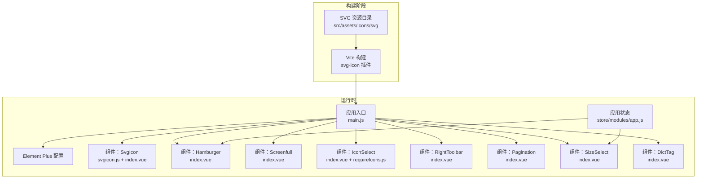
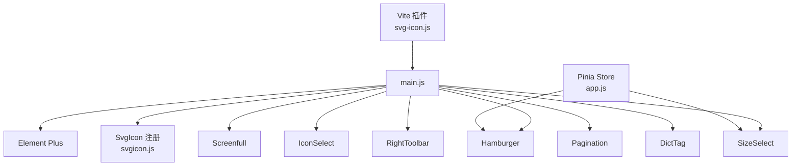
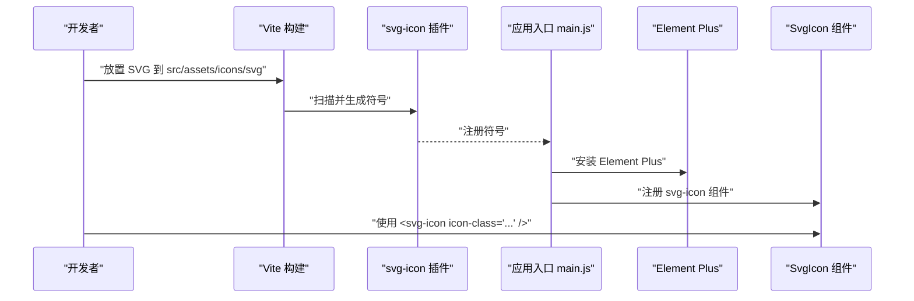
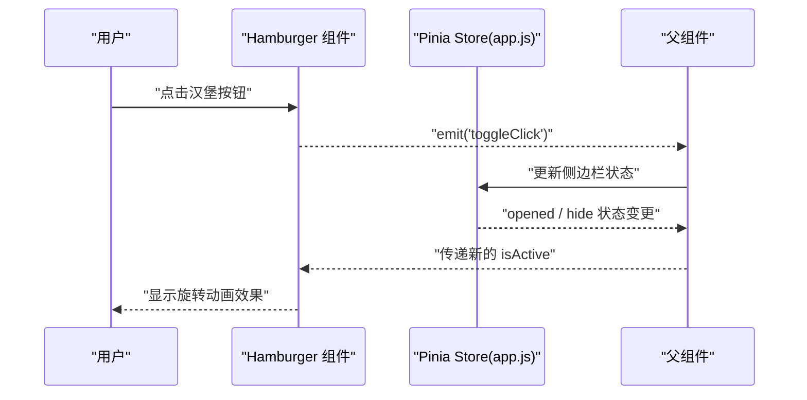
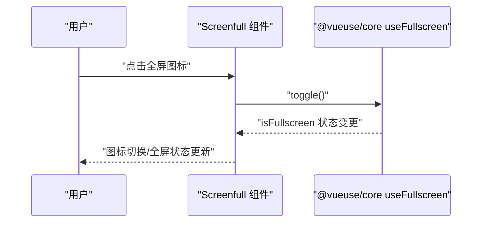
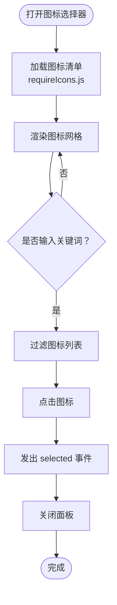
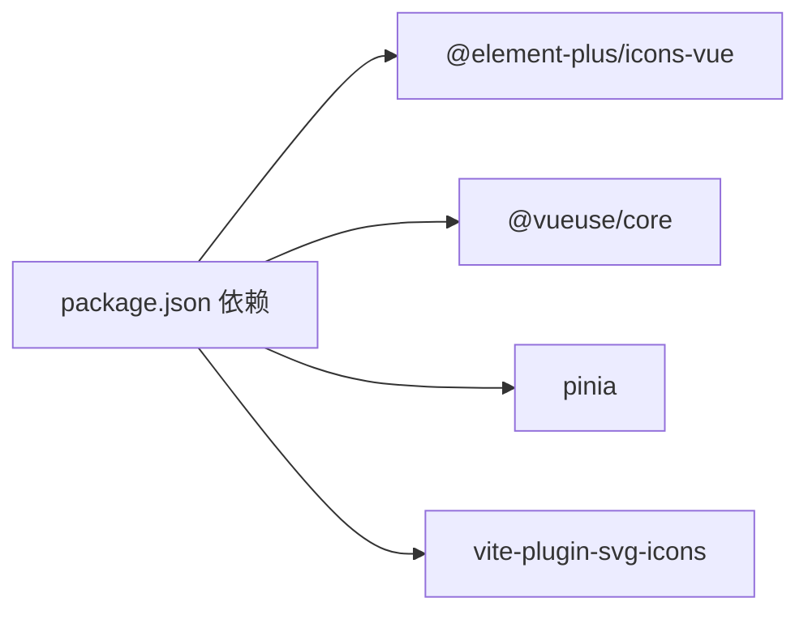

# 工具组件

<cite>
**本文引用的文件**
- [svgicon.js](file://generator-ui/src/components/SvgIcon/svgicon.js)
- [index.vue（汉堡菜单）](file://generator-ui/src/components/Hamburger/index.vue)
- [index.vue（全屏）](file://generator-ui/src/components/Screenfull/index.vue)
- [requireIcons.js](file://generator-ui/src/components/IconSelect/requireIcons.js)
- [index.vue（图标选择器）](file://generator-ui/src/components/IconSelect/index.vue)
- [svg-icon.js](file://generator-ui/vite/plugins/svg-icon.js)
- [index.vue（右上角工具栏）](file://generator-ui/src/components/RightToolbar/index.vue)
- [index.vue（分页）](file://generator-ui/src/components/Pagination/index.vue)
- [index.vue（尺寸选择）](file://generator-ui/src/components/SizeSelect/index.vue)
- [index.vue（字典标签）](file://generator-ui/src/components/DictTag/index.vue)
- [app.js（应用状态）](file://generator-ui/src/store/modules/app.js)
- [main.js](file://generator-ui/src/main.js)
- [package.json](file://generator-ui/package.json)
</cite>

## 目录
1. [简介](#简介)
2. [项目结构](#项目结构)
3. [核心组件](#核心组件)
4. [架构总览](#架构总览)
5. [详细组件分析](#详细组件分析)
6. [依赖关系分析](#依赖关系分析)
7. [性能考量](#性能考量)
8. [故障排查指南](#故障排查指南)
9. [结论](#结论)
10. [附录：使用与集成示例](#附录使用与集成示例)

## 简介
本文件面向 SH-Generator 的前端工具组件，重点覆盖以下能力：
- SVG 图标组件：图标库集成、动态加载与样式定制
- 汉堡菜单组件：展开/收起动画、状态管理与移动端适配
- 全屏组件：全屏切换、兼容性处理与事件监听机制
- 其他常用工具组件：分页、尺寸选择、字典标签、右上角工具栏等的配置、样式覆盖与交互行为说明
- 提供使用场景与集成示例，帮助开发者快速落地

## 项目结构
围绕工具组件的关键目录与文件如下：
- 组件层：各工具组件位于 generator-ui/src/components 下，如 SvgIcon、Hamburger、Screenfull、IconSelect、RightToolbar、Pagination、SizeSelect、DictTag 等
- 构建插件：Vite 插件用于 SVG 图标的自动注入与符号化
- 应用入口：main.js 中注册全局组件、插件与 Element Plus 默认配置
- 状态管理：Pinia Store 中的 app 模块负责侧边栏、设备与尺寸等状态

图示来源
- [svg-icon.js:1-11](file://generator-ui/vite/plugins/svg-icon.js#L1-L11)
- [main.js:19-93](file://generator-ui/src/main.js#L19-L93)
- [app.js（应用状态）:1-45](file://generator-ui/src/store/modules/app.js#L1-L45)

章节来源
- [main.js:19-93](file://generator-ui/src/main.js#L19-L93)
- [svg-icon.js:1-11](file://generator-ui/vite/plugins/svg-icon.js#L1-L11)

## 核心组件
- SVG 图标组件：通过 Element Plus 图标库与 Vite 插件实现图标注册与按需注入；支持自定义 SVG 图标资源与样式覆盖
- 汉堡菜单组件：基于原生 SVG 路径绘制，结合状态管理实现旋转动画与点击事件
- 全屏组件：基于 @vueuse/core 的 useFullscreen 实现跨浏览器全屏切换
- 右上角工具栏：提供搜索显隐、刷新、列显隐等常用操作
- 分页组件：封装 Element Plus 分页，支持移动端页码数量自适应与滚动定位
- 尺寸选择：通过 Pinia 管理界面尺寸并触发页面刷新
- 字典标签：根据字典配置渲染标签或纯文本，支持未匹配值展示

章节来源
- [svgicon.js:1-11](file://generator-ui/src/components/SvgIcon/svgicon.js#L1-L11)
- [index.vue（汉堡菜单）:1-43](file://generator-ui/src/components/Hamburger/index.vue#L1-L43)
- [index.vue（全屏）:1-22](file://generator-ui/src/components/Screenfull/index.vue#L1-L22)
- [index.vue（右上角工具栏）:1-182](file://generator-ui/src/components/RightToolbar/index.vue#L1-L182)
- [index.vue（分页）:1-105](file://generator-ui/src/components/Pagination/index.vue#L1-L105)
- [index.vue（尺寸选择）:1-45](file://generator-ui/src/components/SizeSelect/index.vue#L1-L45)
- [index.vue（字典标签）:1-87](file://generator-ui/src/components/DictTag/index.vue#L1-L87)

## 架构总览
下图展示了工具组件在运行时的交互关系与依赖：

图示来源
- [main.js:19-93](file://generator-ui/src/main.js#L19-L93)
- [svgicon.js:1-11](file://generator-ui/src/components/SvgIcon/svgicon.js#L1-L11)
- [svg-icon.js:1-11](file://generator-ui/vite/plugins/svg-icon.js#L1-L11)
- [app.js（应用状态）:1-45](file://generator-ui/src/store/modules/app.js#L1-L45)

## 详细组件分析

### SVG 图标组件（图标库集成、动态加载与样式定制）
- 图标库集成
  - 通过 Element Plus 图标库批量注册图标组件，便于在模板中直接使用
- 动态加载
  - Vite 插件扫描指定目录下的 SVG 文件，生成符号 ID 并注入到运行时
  - 图标选择器组件通过模块化导入收集本地 SVG 名称，形成可用图标清单
- 样式定制
  - 通过全局样式与 scoped 样式控制图标尺寸、颜色与对齐方式
  - 支持 className 与 icon-class 属性以实现更灵活的样式覆盖

图示来源
- [svg-icon.js:1-11](file://generator-ui/vite/plugins/svg-icon.js#L1-L11)
- [main.js:19-93](file://generator-ui/src/main.js#L19-L93)
- [requireIcons.js:1-8](file://generator-ui/src/components/IconSelect/requireIcons.js#L1-L8)

章节来源
- [svgicon.js:1-11](file://generator-ui/src/components/SvgIcon/svgicon.js#L1-L11)
- [requireIcons.js:1-8](file://generator-ui/src/components/IconSelect/requireIcons.js#L1-L8)
- [svg-icon.js:1-11](file://generator-ui/vite/plugins/svg-icon.js#L1-L11)
- [main.js:19-93](file://generator-ui/src/main.js#L19-L93)

### 汉堡菜单组件（展开/收起动画、状态管理与移动端适配）
- 展开/收起动画
  - 通过布尔属性控制 SVG 的激活类名，配合 CSS 旋转实现 180° 动画
- 状态管理
  - 组件内部不维护状态，通过父组件传递 isActive 并在点击时发出事件
  - 应用状态模块负责侧边栏开关与设备类型，便于统一控制
- 移动端适配
  - 通过父组件在不同设备下传递合适的 isActive 值，保证交互一致性

图示来源
- [index.vue（汉堡菜单）:17-29](file://generator-ui/src/components/Hamburger/index.vue#L17-L29)
- [app.js（应用状态）:13-40](file://generator-ui/src/store/modules/app.js#L13-L40)

章节来源
- [index.vue（汉堡菜单）:1-43](file://generator-ui/src/components/Hamburger/index.vue#L1-L43)
- [app.js（应用状态）:1-45](file://generator-ui/src/store/modules/app.js#L1-L45)

### 全屏组件（全屏切换、兼容性处理与事件监听机制）
- 全屏切换
  - 基于 @vueuse/core 的 useFullscreen，自动处理进入/退出全屏
  - 图标随状态动态切换，提升可发现性
- 兼容性处理
  - 通过 useFullscreen 内置的浏览器差异处理，屏蔽平台差异
- 事件监听机制
  - 组件暴露 toggle 方法，供外部调用；无需手动绑定 DOM 事件

图示来源
- [index.vue（全屏）:7-11](file://generator-ui/src/components/Screenfull/index.vue#L7-L11)
- [package.json:18-38](file://generator-ui/package.json#L18-L38)

章节来源
- [index.vue（全屏）:1-22](file://generator-ui/src/components/Screenfull/index.vue#L1-L22)
- [package.json:18-38](file://generator-ui/package.json#L18-L38)

### 图标选择器组件（动态加载与筛选）
- 动态加载
  - 通过模块化导入收集本地 SVG 名称，形成图标清单
- 筛选与选择
  - 支持输入框实时过滤；点击图标后向外发出选中事件
- 样式覆盖
  - 通过 scoped 样式控制列表高度、网格布局与悬停态

图示来源
- [index.vue（图标选择器）:26-59](file://generator-ui/src/components/IconSelect/index.vue#L26-L59)
- [requireIcons.js:1-8](file://generator-ui/src/components/IconSelect/requireIcons.js#L1-L8)

章节来源
- [index.vue（图标选择器）:1-111](file://generator-ui/src/components/IconSelect/index.vue#L1-L111)
- [requireIcons.js:1-8](file://generator-ui/src/components/IconSelect/requireIcons.js#L1-L8)

### 右上角工具栏组件（搜索显隐、刷新、列显隐）
- 搜索显隐：根据属性控制显示/隐藏，并通过事件通知父组件
- 刷新：触发查询事件
- 列显隐：支持两种模式
  - transfer：使用穿梭框进行列显隐切换
  - checkbox：使用下拉多选进行列显隐切换
- 样式覆盖：通过 scoped 与深度选择器覆盖 Element Plus 组件样式

章节来源
- [index.vue（右上角工具栏）:1-182](file://generator-ui/src/components/RightToolbar/index.vue#L1-L182)

### 分页组件（移动端自适应与滚动定位）
- 移动端自适应：根据屏幕宽度动态调整页码按钮数量
- 滚动定位：切换页码或页数时自动滚动至顶部，优化阅读体验
- 事件与双向绑定：对外暴露分页参数变更事件，便于父组件响应

章节来源
- [index.vue（分页）:1-105](file://generator-ui/src/components/Pagination/index.vue#L1-L105)

### 尺寸选择组件（状态持久化与页面刷新）
- 状态持久化：通过 Pinia Store 记录当前尺寸，并写入本地存储
- 页面刷新：切换尺寸后触发页面刷新，确保全局样式一致

章节来源
- [index.vue（尺寸选择）:1-45](file://generator-ui/src/components/SizeSelect/index.vue#L1-L45)
- [app.js（应用状态）:1-45](file://generator-ui/src/store/modules/app.js#L1-L45)

### 字典标签组件（标签渲染与未匹配值展示）
- 标签渲染：根据字典配置渲染标签或普通文本
- 未匹配值：当存在未匹配值时，可选择展示原始值，避免信息丢失

章节来源
- [index.vue（字典标签）:1-87](file://generator-ui/src/components/DictTag/index.vue#L1-L87)

## 依赖关系分析
- 运行时依赖
  - Element Plus：提供 UI 组件与主题
  - @vueuse/core：提供 useFullscreen 等组合式工具
  - pinia：提供状态管理
- 构建期依赖
  - vite-plugin-svg-icons：自动注入 SVG 符号
- 组件间耦合
  - 汉堡菜单与全屏组件均依赖应用状态模块与 Element Plus
  - 图标选择器依赖本地 SVG 资源与 SvgIcon 组件
  - 右上角工具栏与分页组件依赖 Element Plus 的分页与下拉组件

图示来源
- [package.json:18-48](file://generator-ui/package.json#L18-L48)

章节来源
- [package.json:18-48](file://generator-ui/package.json#L18-L48)

## 性能考量
- SVG 图标
  - 使用 Vite 插件集中注入，减少请求次数；建议在生产环境开启压缩
- 全屏组件
  - useFullscreen 为轻量组合式函数，无额外开销；注意避免频繁切换导致的重排
- 分页组件
  - 移动端页码数量自适应可降低渲染压力；合理设置 autoScroll 的触发频率
- 状态管理
  - 将尺寸与侧边栏状态持久化到本地存储，减少初始化成本

## 故障排查指南
- 图标不显示
  - 检查 SVG 文件是否放置在正确目录
  - 确认 Vite 插件已启用并配置了正确的符号 ID
  - 在运行时确认已注册 svg-icon 组件
- 全屏无效
  - 确认浏览器允许触发全屏（通常需要用户手势）
  - 检查 useFullscreen 的返回值与状态变更
- 汉堡菜单无响应
  - 确认父组件正确传递 isActive 并处理 toggleClick 事件
  - 检查应用状态模块的侧边栏开关逻辑
- 尺寸切换后样式异常
  - 确认 Pinia Store 中的 size 已持久化并触发页面刷新

章节来源
- [svg-icon.js:1-11](file://generator-ui/vite/plugins/svg-icon.js#L1-L11)
- [main.js:19-93](file://generator-ui/src/main.js#L19-L93)
- [index.vue（全屏）:7-11](file://generator-ui/src/components/Screenfull/index.vue#L7-L11)
- [index.vue（汉堡菜单）:17-29](file://generator-ui/src/components/Hamburger/index.vue#L17-L29)
- [app.js（应用状态）:13-40](file://generator-ui/src/store/modules/app.js#L13-L40)
- [index.vue（尺寸选择）:32-36](file://generator-ui/src/components/SizeSelect/index.vue#L32-L36)

## 结论
本项目工具组件围绕 SVG 图标生态、导航与全屏控制、表格辅助与布局尺寸等关键场景进行了系统化封装。通过 Vite 插件与 Element Plus 的结合，实现了高效的图标加载与一致的交互体验；借助 @vueuse/core 与 Pinia，提供了跨浏览器与状态持久化的基础能力。建议在实际业务中优先采用这些组件，以降低重复开发成本并提升一致性。

## 附录：使用与集成示例
- SVG 图标
  - 在模板中使用 <svg-icon icon-class="..." /> 即可渲染图标
  - 如需新增图标，将 SVG 放入 src/assets/icons/svg 目录并重启开发服务器
- 汉堡菜单
  - 在父组件中维护 isActive，并监听 toggleClick 事件以控制侧边栏
- 全屏
  - 在需要全屏的区域包裹 Screenfull 组件，点击即可切换
- 右上角工具栏
  - 在表格上方引入 RightToolbar，按需配置搜索显隐与列显隐模式
- 分页
  - 传入 total、page、limit 等参数，监听 pagination 事件以刷新数据
- 尺寸选择
  - 在设置面板中引入 SizeSelect，切换后页面会自动刷新
- 字典标签
  - 传入 options 与 value，未匹配值可选择展示原始值

章节来源
- [index.vue（图标选择器）:1-111](file://generator-ui/src/components/IconSelect/index.vue#L1-L111)
- [index.vue（汉堡菜单）:1-43](file://generator-ui/src/components/Hamburger/index.vue#L1-L43)
- [index.vue（全屏）:1-22](file://generator-ui/src/components/Screenfull/index.vue#L1-L22)
- [index.vue（右上角工具栏）:1-182](file://generator-ui/src/components/RightToolbar/index.vue#L1-L182)
- [index.vue（分页）:1-105](file://generator-ui/src/components/Pagination/index.vue#L1-L105)
- [index.vue（尺寸选择）:1-45](file://generator-ui/src/components/SizeSelect/index.vue#L1-L45)
- [index.vue（字典标签）:1-87](file://generator-ui/src/components/DictTag/index.vue#L1-L87)