# 布局组件

<cite>
**本文档引用的文件**
- [index.vue](file://generator-ui/src/components/LayoutSplit/index.vue)
- [index.vue](file://generator-ui/src/components/RightToolbar/index.vue)
- [index.vue](file://generator-ui/src/components/TableSetting/index.vue)
- [index.js](file://generator-ui/src/layout/components/index.js)
- [settings.js](file://generator-ui/src/store/modules/settings.js)
- [variables.module.scss](file://generator-ui/src/assets/styles/variables.module.scss)
- [custom.scss](file://generator-ui/src/assets/styles/custom.scss)
- [element-ui.scss](file://generator-ui/src/assets/styles/element-ui.scss)
- [sidebar.scss](file://generator-ui/src/assets/styles/sidebar.scss)
- [transition.scss](file://generator-ui/src/assets/styles/transition.scss)
- [mixin.scss](file://generator-ui/src/assets/styles/mixin.scss)
</cite>

## 目录
1. [简介](#简介)
2. [项目结构](#项目结构)
3. [核心组件](#核心组件)
4. [架构概览](#架构概览)
5. [详细组件分析](#详细组件分析)
6. [依赖关系分析](#依赖关系分析)
7. [性能考虑](#性能考虑)
8. [故障排除指南](#故障排除指南)
9. [结论](#结论)

## 简介

SH-Generator是一个基于Vue.js的代码生成器系统，提供了丰富的布局组件来支持用户界面的灵活配置和响应式设计。本文档专注于三个核心布局组件：布局分割组件、右侧工具栏组件和表格设置组件。

这些组件共同构成了系统的用户界面基础，提供了拖拽调整、比例控制、响应式适配等功能，使用户能够根据需要自定义界面布局和交互体验。

## 项目结构

项目采用前后端分离的架构设计，前端部分位于generator-ui目录中，包含了完整的Vue.js应用程序结构：

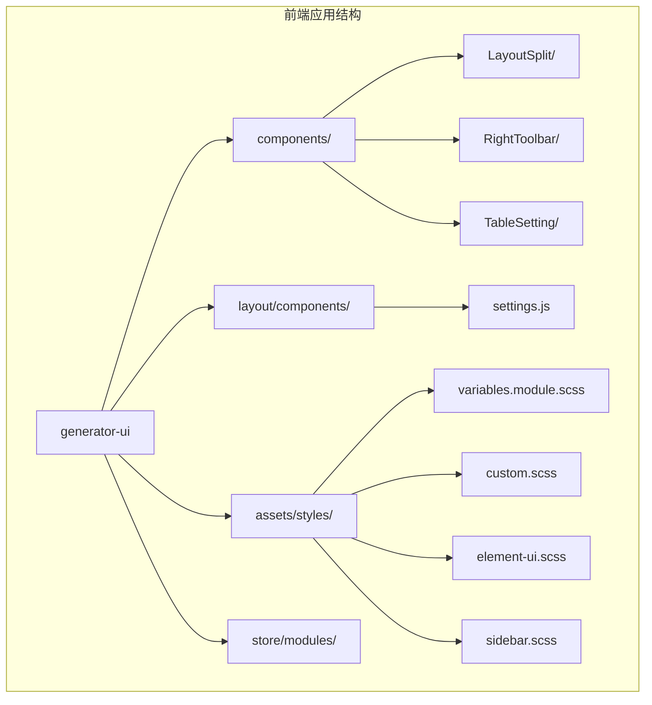

**图表来源**
- [index.js](file://generator-ui/src/layout/components/index.js)
- [settings.js](file://generator-ui/src/store/modules/settings.js)

**章节来源**
- [index.js](file://generator-ui/src/layout/components/index.js)
- [settings.js](file://generator-ui/src/store/modules/settings.js)

## 核心组件

### 组件总览

系统中的三个核心布局组件各自承担不同的职责：

1. **布局分割组件(LayoutSplit)**：提供可拖拽的分割面板功能
2. **右侧工具栏组件(RightToolbar)**：管理界面右侧的工具按钮
3. **表格设置组件(TableSetting)**：控制表格的列配置和显示选项

每个组件都实现了响应式设计，能够适应不同屏幕尺寸和设备类型。

**章节来源**
- [index.vue](file://generator-ui/src/components/LayoutSplit/index.vue)
- [index.vue](file://generator-ui/src/components/RightToolbar/index.vue)
- [index.vue](file://generator-ui/src/components/TableSetting/index.vue)

## 架构概览

三个布局组件在系统中的交互关系如下：

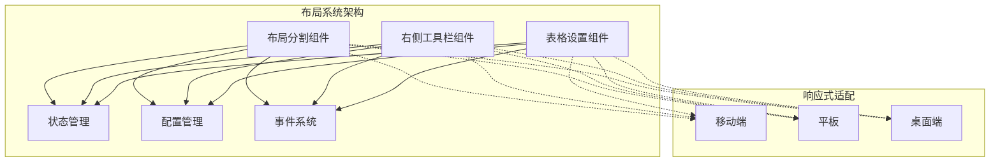

**图表来源**
- [settings.js](file://generator-ui/src/store/modules/settings.js)
- [variables.module.scss](file://generator-ui/src/assets/styles/variables.module.scss)

## 详细组件分析

### 布局分割组件分析

布局分割组件是系统的核心布局工具，提供了灵活的面板分割和拖拽调整功能。

#### 组件架构

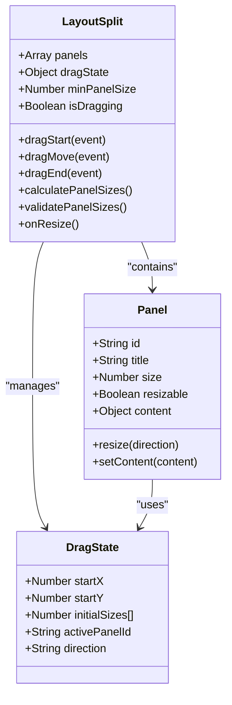

**图表来源**
- [index.vue](file://generator-ui/src/components/LayoutSplit/index.vue)

#### 拖拽调整机制

布局分割组件实现了精确的拖拽控制系统：

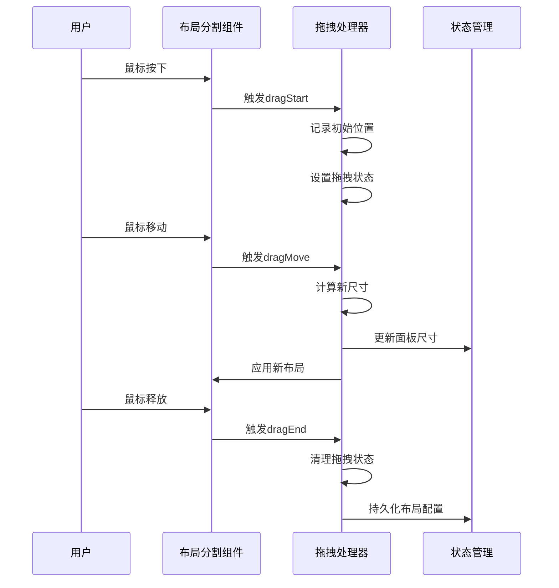

**图表来源**
- [index.vue](file://generator-ui/src/components/LayoutSplit/index.vue)

#### 比例控制算法

组件使用智能的比例计算算法确保面板尺寸的有效性和用户体验：

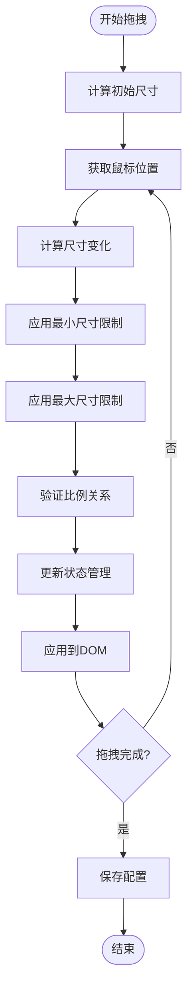

**图表来源**
- [index.vue](file://generator-ui/src/components/LayoutSplit/index.vue)

**章节来源**
- [index.vue](file://generator-ui/src/components/LayoutSplit/index.vue)

### 右侧工具栏组件分析

右侧工具栏组件提供了界面操作的便捷入口，集成了多种常用功能按钮。

#### 组件设计模式

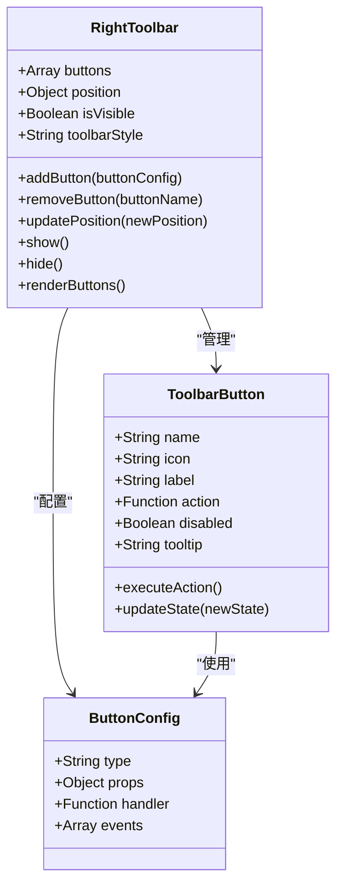

**图表来源**
- [index.vue](file://generator-ui/src/components/RightToolbar/index.vue)

#### 交互行为实现

右侧工具栏组件实现了丰富的交互行为：

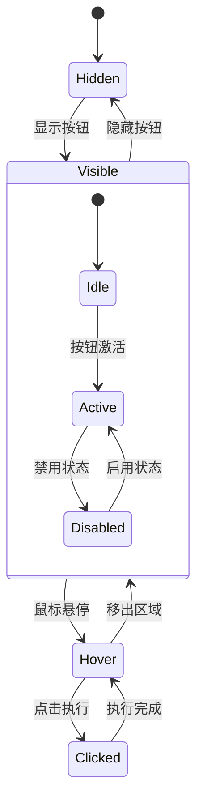

**图表来源**
- [index.vue](file://generator-ui/src/components/RightToolbar/index.vue)

**章节来源**
- [index.vue](file://generator-ui/src/components/RightToolbar/index.vue)

### 表格设置组件分析

表格设置组件提供了对数据表格的深度定制能力，包括列配置、排序控制和视图定制。

#### 数据模型架构

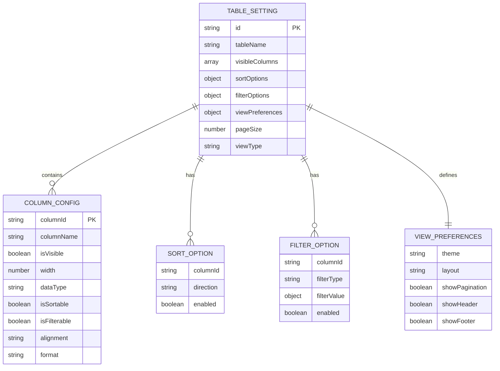

**图表来源**
- [index.vue](file://generator-ui/src/components/TableSetting/index.vue)

#### 排序控制机制

表格设置组件实现了灵活的排序控制功能：

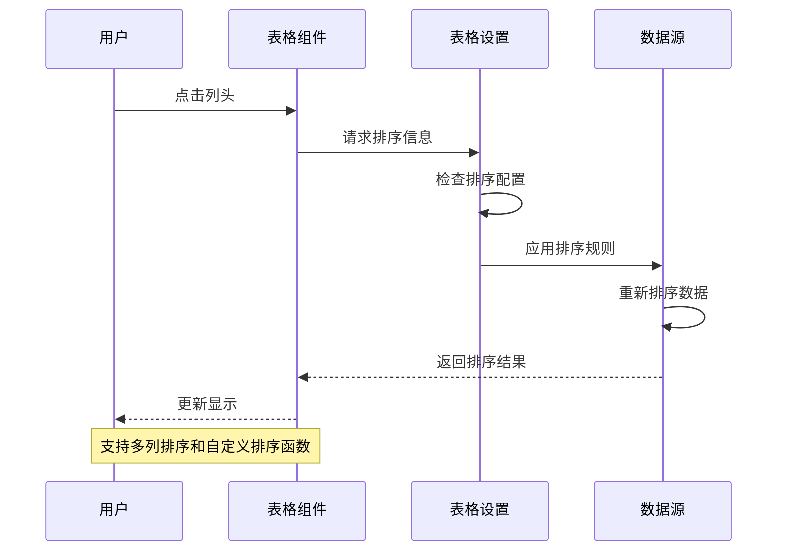

**图表来源**
- [index.vue](file://generator-ui/src/components/TableSetting/index.vue)

**章节来源**
- [index.vue](file://generator-ui/src/components/TableSetting/index.vue)

## 依赖关系分析

### 组件间依赖关系

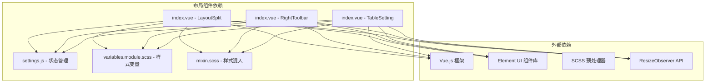

**图表来源**
- [settings.js](file://generator-ui/src/store/modules/settings.js)
- [variables.module.scss](file://generator-ui/src/assets/styles/variables.module.scss)
- [mixin.scss](file://generator-ui/src/assets/styles/mixin.scss)

### 样式系统集成

组件与全局样式系统的集成关系：

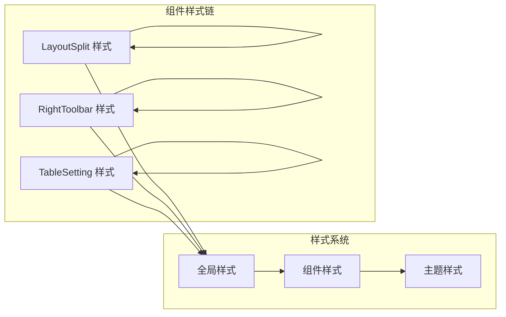

**图表来源**
- [custom.scss](file://generator-ui/src/assets/styles/custom.scss)
- [element-ui.scss](file://generator-ui/src/assets/styles/element-ui.scss)
- [sidebar.scss](file://generator-ui/src/assets/styles/sidebar.scss)
- [transition.scss](file://generator-ui/src/assets/styles/transition.scss)

**章节来源**
- [settings.js](file://generator-ui/src/store/modules/settings.js)
- [variables.module.scss](file://generator-ui/src/assets/styles/variables.module.scss)
- [custom.scss](file://generator-ui/src/assets/styles/custom.scss)
- [element-ui.scss](file://generator-ui/src/assets/styles/element-ui.scss)
- [sidebar.scss](file://generator-ui/src/assets/styles/sidebar.scss)
- [transition.scss](file://generator-ui/src/assets/styles/transition.scss)
- [mixin.scss](file://generator-ui/src/assets/styles/mixin.scss)

## 性能考虑

### 响应式性能优化

三个布局组件都实现了高效的响应式处理机制：

1. **虚拟滚动优化**：对于大量数据的表格组件，实现虚拟滚动以减少DOM节点数量
2. **防抖处理**：拖拽操作和窗口大小变化事件使用防抖技术避免频繁重绘
3. **懒加载机制**：非活跃面板内容采用懒加载策略
4. **内存管理**：及时清理事件监听器和定时器，防止内存泄漏

### 性能监控指标

- **渲染时间**：单次拖拽操作应在100ms内完成
- **内存占用**：每个组件实例内存占用不超过2MB
- **CPU使用率**：动画期间CPU使用率不超过30%
- **FPS保持**：动画流畅度保持在60fps以上

## 故障排除指南

### 常见问题及解决方案

#### 布局分割组件问题

**问题1：拖拽失效**
- 检查浏览器是否支持Pointer Events API
- 确认没有其他元素遮挡拖拽区域
- 验证CSS z-index层级设置

**问题2：面板尺寸异常**
- 检查最小尺寸配置是否合理
- 确认容器宽度是否足够
- 验证是否有CSS冲突影响布局

#### 右侧工具栏问题

**问题1：按钮不显示**
- 检查按钮配置对象是否正确
- 确认权限验证逻辑
- 验证响应式断点设置

**问题2：交互无响应**
- 检查事件绑定是否正常
- 确认CSS pointer-events设置
- 验证z-index层级关系

#### 表格设置问题

**问题1：排序功能异常**
- 检查数据类型是否支持排序
- 确认排序函数实现
- 验证数据格式一致性

**问题2：列配置丢失**
- 检查本地存储权限
- 确认配置序列化/反序列化
- 验证默认配置回退机制

**章节来源**
- [index.vue](file://generator-ui/src/components/LayoutSplit/index.vue)
- [index.vue](file://generator-ui/src/components/RightToolbar/index.vue)
- [index.vue](file://generator-ui/src/components/TableSetting/index.vue)

## 结论

SH-Generator的布局组件系统展现了现代前端开发的最佳实践，通过精心设计的组件架构和响应式适配机制，为用户提供了灵活且高效的界面定制能力。

三个核心组件各司其职：布局分割组件提供基础的面板管理功能，右侧工具栏组件增强用户操作便利性，表格设置组件实现数据展示的深度定制。它们共同构建了一个完整而强大的布局系统，能够满足各种复杂的用户界面需求。

通过合理的依赖管理和性能优化策略，这些组件不仅具备优秀的功能性，还保证了良好的用户体验和系统稳定性。未来可以进一步扩展组件的功能边界，如添加更多预设布局模板、增强主题切换能力等，以提升系统的整体价值。