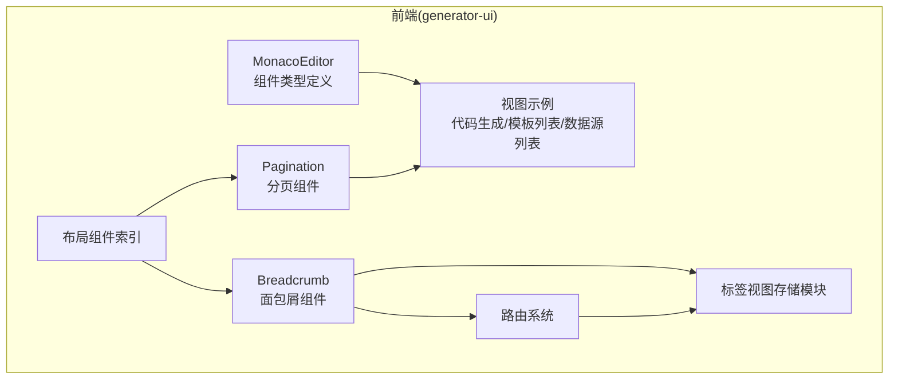
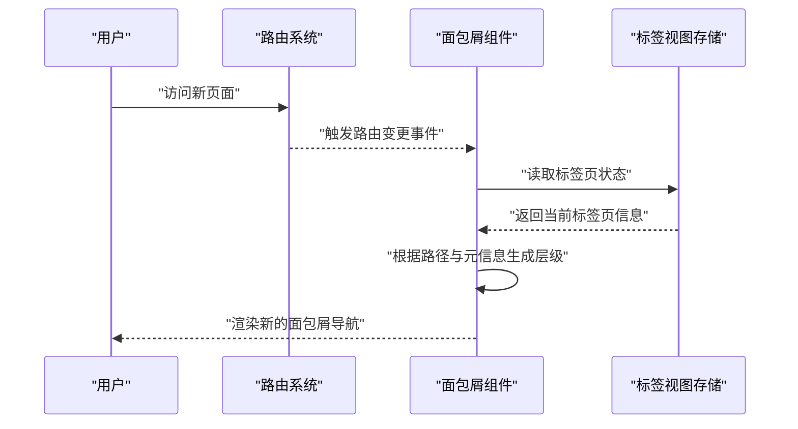
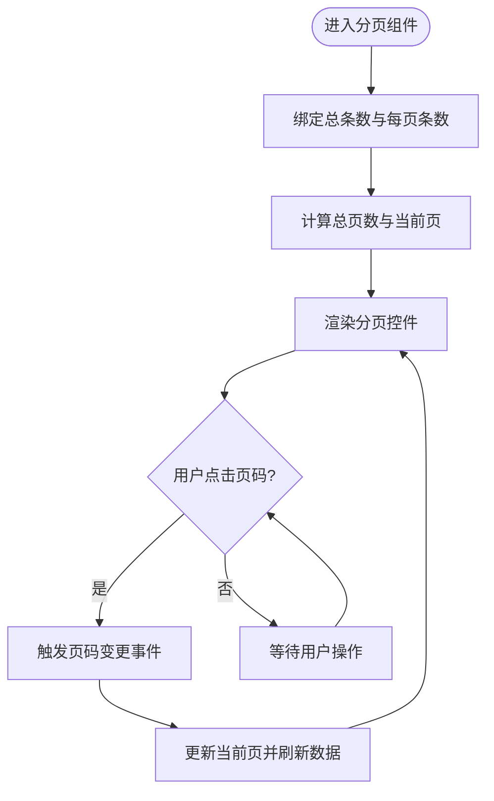
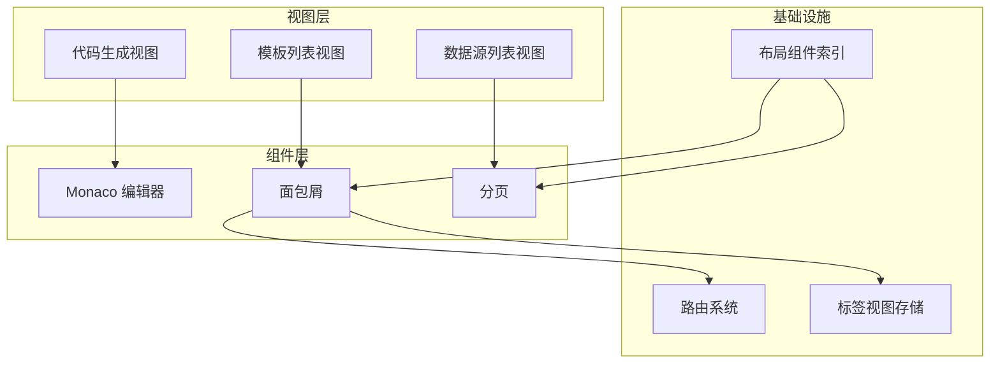
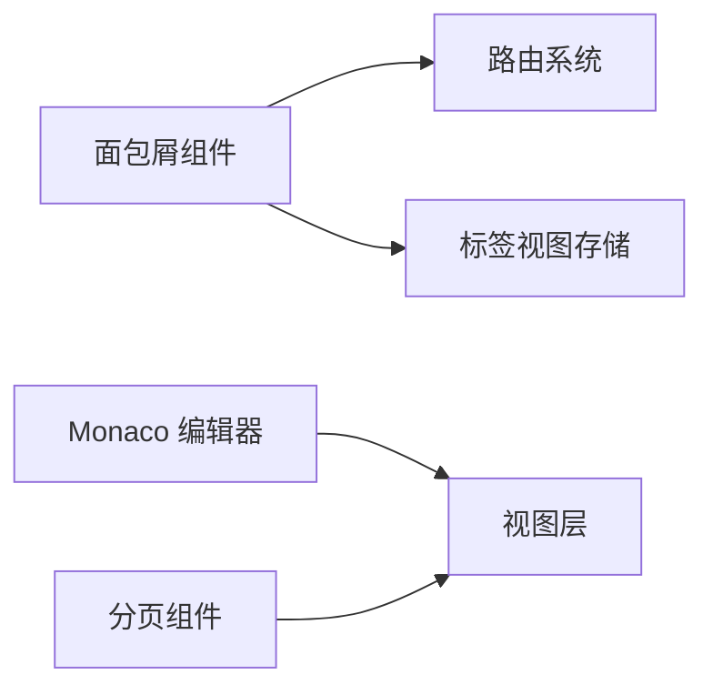

# 核心组件

<cite>
**本文引用的文件**
- [MonacoEditorType.ts](file://generator-ui/src/components/MonacoEditor/MonacoEditorType.ts)
- [transition.scss](file://generator-ui/src/assets/styles/transition.scss)
- [render.js](file://generator-ui/src/utils/generator/render.js)
- [Breadcrumb 组件入口](file://generator-ui/src/components/Breadcrumb/index.vue)
- [Pagination 组件入口](file://generator-ui/src/components/Pagination/index.vue)
- [路由配置](file://generator-ui/src/router/index.js)
- [标签视图存储模块](file://generator-ui/src/store/modules/tagsView.js)
- [布局组件索引](file://generator-ui/src/layout/components/index.js)
- [Monaco 编辑器使用示例（视图）](file://generator-ui/src/views/codegen/project/index.vue)
- [分页使用示例（视图）](file://generator-ui/src/views/config/datasource/components/DatasourceList.vue)
- [面包屑使用示例（视图）](file://generator-ui/src/views/config/template/components/TemplateList.vue)
</cite>

## 目录
1. [简介](#简介)
2. [项目结构](#项目结构)
3. [核心组件](#核心组件)
4. [架构总览](#架构总览)
5. [详细组件分析](#详细组件分析)
6. [依赖分析](#依赖分析)
7. [性能考虑](#性能考虑)
8. [故障排查指南](#故障排查指南)
9. [结论](#结论)
10. [附录](#附录)

## 简介
本章节面向 SH-Generator 的前端核心组件，聚焦以下三类组件的类型定义、配置选项与使用方法：
- Monaco 编辑器：涵盖语言模式、主题、只读、占位符、折叠策略、行高亮、字体大小、小地图、滚动行为等配置项及属性校验。
- 导航面包屑：说明层级结构、与路由系统的集成以及动态更新机制。
- 分页组件：阐述数据绑定、页面切换与样式定制能力。

同时提供各组件的完整 API 文档、属性配置与事件处理方法，并给出实际使用示例与集成指南，帮助开发者快速上手并在项目中稳定应用。

## 项目结构
本项目采用前后端分离架构，核心前端位于 generator-ui 目录。核心组件主要分布在 src/components 下，配合路由、状态管理与工具函数共同完成页面渲染与交互。

**图表来源**
- [MonacoEditorType.ts:1-75](file://generator-ui/src/components/MonacoEditor/MonacoEditorType.ts#L1-L75)
- [Breadcrumb 组件入口](file://generator-ui/src/components/Breadcrumb/index.vue)
- [Pagination 组件入口](file://generator-ui/src/components/Pagination/index.vue)
- [路由配置](file://generator-ui/src/router/index.js)
- [标签视图存储模块](file://generator-ui/src/store/modules/tagsView.js)
- [布局组件索引](file://generator-ui/src/layout/components/index.js)
- [Monaco 编辑器使用示例（视图）](file://generator-ui/src/views/codegen/project/index.vue)
- [分页使用示例（视图）](file://generator-ui/src/views/config/datasource/components/DatasourceList.vue)
- [面包屑使用示例（视图）](file://generator-ui/src/views/config/template/components/TemplateList.vue)

**章节来源**
- [MonacoEditorType.ts:1-75](file://generator-ui/src/components/MonacoEditor/MonacoEditorType.ts#L1-L75)
- [Breadcrumb 组件入口](file://generator-ui/src/components/Breadcrumb/index.vue)
- [Pagination 组件入口](file://generator-ui/src/components/Pagination/index.vue)
- [路由配置](file://generator-ui/src/router/index.js)
- [标签视图存储模块](file://generator-ui/src/store/modules/tagsView.js)
- [布局组件索引](file://generator-ui/src/layout/components/index.js)

## 核心组件
本节对三大核心组件进行深入解析，覆盖类型定义、配置项、属性与事件、使用示例与最佳实践。

### Monaco 编辑器组件
- 类型定义与主题枚举
  - 主题类型：支持 vs、vs-dark、hc-black、hc-light。
  - 折叠策略：支持 auto、indentation。
  - 行高亮：支持 all、line、none、gutter。
- 配置对象 Options
  - 布局自适应、折叠策略、行高亮、行号显示、占位符、小地图开关、字体大小、滚动行为、边框显示等。
- 属性 editorProps
  - v-model 值、内容变更检测、宽度/高度、语言、只读、主题、options。
  - 主题属性具备校验逻辑，确保传入合法值。
- 使用建议
  - 在复杂模板或代码生成场景中，建议开启行号与行高亮以提升可读性；在只读展示场景中启用只读模式。
  - 小地图默认关闭，避免占用空间；如需预览结构可按需开启。
  - 占位符用于引导用户输入，建议结合业务语境设置提示文案。

**章节来源**
- [MonacoEditorType.ts:1-75](file://generator-ui/src/components/MonacoEditor/MonacoEditorType.ts#L1-L75)

### 导航面包屑组件
- 结构与职责
  - 面包屑组件负责根据当前路由路径生成层级导航，提供层级跳转与视觉反馈。
- 路由集成
  - 通过路由元信息中的标题字段与路径匹配，动态构建层级链路。
  - 与标签视图存储模块联动，实现标签页与面包屑的同步更新。
- 动态更新机制
  - 当路由变化时，组件监听路由变更并重新计算层级；标签页切换也会触发面包屑刷新。
- 过渡动画
  - 提供基于 transition.scss 的进入/离开动画，增强用户体验。

**图表来源**
- [Breadcrumb 组件入口](file://generator-ui/src/components/Breadcrumb/index.vue)
- [路由配置](file://generator-ui/src/router/index.js)
- [标签视图存储模块](file://generator-ui/src/store/modules/tagsView.js)
- [transition.scss:31-49](file://generator-ui/src/assets/styles/transition.scss#L31-L49)

**章节来源**
- [Breadcrumb 组件入口](file://generator-ui/src/components/Breadcrumb/index.vue)
- [路由配置](file://generator-ui/src/router/index.js)
- [标签视图存储模块](file://generator-ui/src/store/modules/tagsView.js)
- [transition.scss:31-49](file://generator-ui/src/assets/styles/transition.scss#L31-L49)

### 分页组件
- 数据绑定
  - 支持通过属性绑定总条数与每页条数，自动计算总页数与当前页。
- 页面切换
  - 提供页码变更事件，便于与后端接口或本地数据源联动。
- 样式定制
  - 通过外部样式类或内联样式实现主题适配与尺寸调整。
- 典型用法
  - 在列表页面中与表格组件配合，实现大数据量的高效浏览与筛选。

**图表来源**
- [Pagination 组件入口](file://generator-ui/src/components/Pagination/index.vue)

**章节来源**
- [Pagination 组件入口](file://generator-ui/src/components/Pagination/index.vue)

## 架构总览
下图展示了核心组件在前端架构中的位置与交互关系，以及与路由、状态管理的协作方式。

**图表来源**
- [Monaco 编辑器使用示例（视图）](file://generator-ui/src/views/codegen/project/index.vue)
- [面包屑使用示例（视图）](file://generator-ui/src/views/config/template/components/TemplateList.vue)
- [分页使用示例（视图）](file://generator-ui/src/views/config/datasource/components/DatasourceList.vue)
- [Breadcrumb 组件入口](file://generator-ui/src/components/Breadcrumb/index.vue)
- [Pagination 组件入口](file://generator-ui/src/components/Pagination/index.vue)
- [路由配置](file://generator-ui/src/router/index.js)
- [标签视图存储模块](file://generator-ui/src/store/modules/tagsView.js)
- [布局组件索引](file://generator-ui/src/layout/components/index.js)

## 详细组件分析

### Monaco 编辑器组件 API 与使用
- 类型定义与主题
  - 主题类型：vs、vs-dark、hc-black、hc-light。
  - 折叠策略：auto、indentation。
  - 行高亮：all、line、none、gutter。
- 配置项 Options
  - automaticLayout：是否自动布局。
  - foldingStrategy：折叠策略。
  - renderLineHighlight：行高亮模式。
  - selectOnLineNumbers：是否显示行号。
  - placeholder：占位符文本。
  - minimap.enabled：是否启用小地图。
  - fontSize：字体大小。
  - scrollBeyondLastLine：是否允许滚动到最后一行之后。
  - overviewRulerBorder：滚动条边框显示。
- 属性 editorProps
  - modelValue：双向绑定的编辑器内容。
  - hightChange：内容变更检测开关。
  - width/height：容器宽高。
  - language：语言模式，默认 javascript。
  - readOnly：是否只读。
  - theme：主题，默认 vs-dark。
  - options：编辑器配置对象，默认值包含上述各项合理缺省。
- 事件
  - 内容变更事件：通过 v-model 与原生 change/input 事件实现双向同步。
  - 布局变化事件：automaticLayout 开启时自动响应窗口变化。
- 使用示例与集成
  - 在代码生成页面中作为模板编辑区使用，结合语言模式与主题提升开发体验。
  - 在模板管理页面中作为只读展示区，仅展示不编辑。

**章节来源**
- [MonacoEditorType.ts:1-75](file://generator-ui/src/components/MonacoEditor/MonacoEditorType.ts#L1-L75)
- [Monaco 编辑器使用示例（视图）](file://generator-ui/src/views/codegen/project/index.vue)

### 面包屑组件 API 与使用
- 层级结构
  - 根据路由路径逐级生成层级节点，最后一个节点为当前页面标题。
- 路由集成
  - 读取路由元信息中的标题字段，结合路径生成层级链路。
- 动态更新
  - 监听路由变化与标签页切换，实时刷新层级结构。
- 样式与过渡
  - 使用 transition.scss 中的 breadcrumb 相关类实现进入/离开动画。
- 使用示例与集成
  - 在配置类页面中作为主导航辅助，帮助用户快速定位当前位置。
  - 与标签页联动，保证多标签场景下的导航一致性。

**章节来源**
- [Breadcrumb 组件入口](file://generator-ui/src/components/Breadcrumb/index.vue)
- [路由配置](file://generator-ui/src/router/index.js)
- [标签视图存储模块](file://generator-ui/src/store/modules/tagsView.js)
- [transition.scss:31-49](file://generator-ui/src/assets/styles/transition.scss#L31-L49)
- [面包屑使用示例（视图）](file://generator-ui/src/views/config/template/components/TemplateList.vue)

### 分页组件 API 与使用
- 数据绑定
  - total：总条数。
  - page-size：每页条数。
  - current-page：当前页码。
- 页面切换
  - @current-change：页码变更事件回调。
- 样式定制
  - 通过外部样式类或内联样式控制尺寸、颜色与间距。
- 使用示例与集成
  - 在数据源列表页面中与表格组件配合，实现大数据量的分页浏览。
  - 在日志查询、模板管理等列表页面中复用该组件。

**章节来源**
- [Pagination 组件入口](file://generator-ui/src/components/Pagination/index.vue)
- [分页使用示例（视图）](file://generator-ui/src/views/config/datasource/components/DatasourceList.vue)

## 依赖分析
- 组件耦合
  - 面包屑组件与路由系统、标签视图存储存在直接依赖，确保层级与标签页状态一致。
  - Monaco 编辑器组件与视图层存在使用耦合，但无运行时依赖，便于复用。
  - 分页组件与视图层存在使用耦合，通过事件与属性实现解耦。
- 外部依赖
  - 路由系统提供元信息与路径信息，是面包屑动态生成的基础。
  - 状态管理模块提供标签页状态，保障多标签场景下的导航一致性。
- 潜在风险
  - 若路由元信息缺失或命名不规范，可能导致面包屑层级异常。
  - 分页组件若未正确绑定 total 或 pageSize，会导致页码计算错误。

**图表来源**
- [Breadcrumb 组件入口](file://generator-ui/src/components/Breadcrumb/index.vue)
- [Pagination 组件入口](file://generator-ui/src/components/Pagination/index.vue)
- [路由配置](file://generator-ui/src/router/index.js)
- [标签视图存储模块](file://generator-ui/src/store/modules/tagsView.js)

**章节来源**
- [Breadcrumb 组件入口](file://generator-ui/src/components/Breadcrumb/index.vue)
- [Pagination 组件入口](file://generator-ui/src/components/Pagination/index.vue)
- [路由配置](file://generator-ui/src/router/index.js)
- [标签视图存储模块](file://generator-ui/src/store/modules/tagsView.js)

## 性能考虑
- Monaco 编辑器
  - 合理设置 automaticLayout 与 fontSize，避免频繁重排。
  - 在大文件场景中谨慎开启小地图与行高亮，减少渲染开销。
  - 使用 v-model 时注意内容变更频率，必要时加入防抖。
- 面包屑
  - 路由层级不宜过深，避免过多 DOM 节点导致渲染压力。
  - 利用过渡动画时注意动画时长与缓动函数，避免卡顿。
- 分页
  - 大数据量场景下优先服务端分页，减少前端渲染负担。
  - 控制每页条数上限，避免一次性渲染过多元素。

## 故障排查指南
- 面包屑不显示或层级错误
  - 检查路由元信息是否包含标题字段。
  - 确认标签页存储模块是否正确维护当前标签页状态。
- 分页异常
  - 确认 total、page-size、current-page 是否正确绑定。
  - 检查 @current-change 事件是否正确处理页码变更。
- Monaco 编辑器主题或语言无效
  - 确认 theme 与 language 属性传值是否在允许范围内。
  - 检查 options 中的配置项是否被意外覆盖。

**章节来源**
- [Breadcrumb 组件入口](file://generator-ui/src/components/Breadcrumb/index.vue)
- [Pagination 组件入口](file://generator-ui/src/components/Pagination/index.vue)
- [MonacoEditorType.ts:1-75](file://generator-ui/src/components/MonacoEditor/MonacoEditorType.ts#L1-L75)

## 结论
本文围绕 SH-Generator 的三大核心组件提供了从类型定义、配置选项到使用示例与集成指南的完整技术文档。通过明确的 API 定义与最佳实践，开发者可以快速在项目中稳定地应用这些组件，并在复杂场景中灵活扩展其能力。建议在后续迭代中持续关注组件的性能优化与可维护性，确保在大规模数据与多标签场景下的流畅体验。

## 附录
- 组件渲染通用机制参考
  - 渲染器通过配置对象动态生成组件树，统一处理 props、attrs、style 与插槽，便于组件化与可配置化。

**章节来源**
- [render.js:108-156](file://generator-ui/src/utils/generator/render.js#L108-L156)