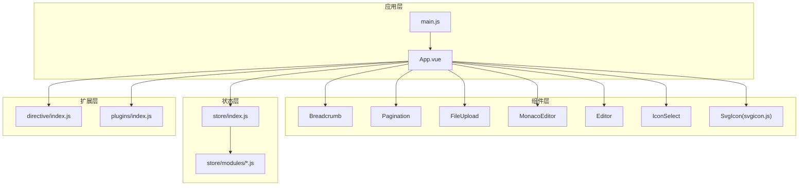
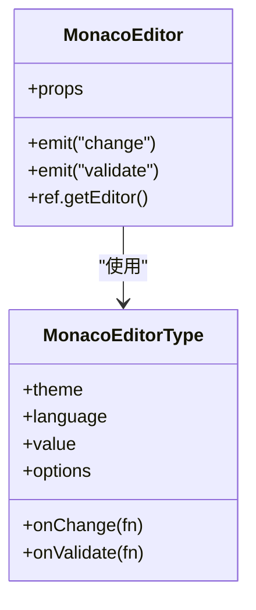
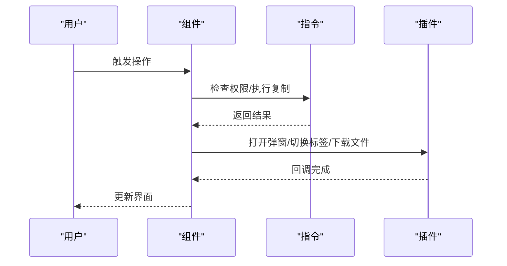
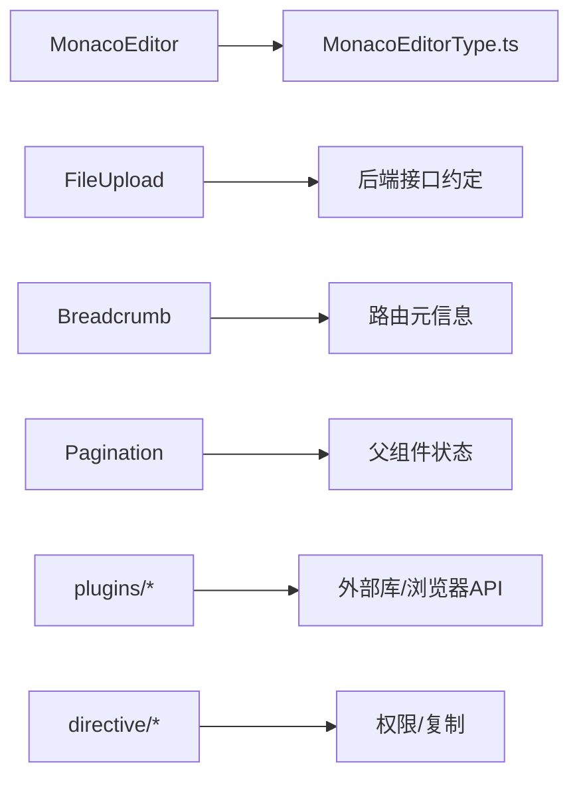

# 组件系统

<cite>
**本文引用的文件**
- [App.vue](file://generator-ui/src/App.vue)
- [main.js](file://generator-ui/src/main.js)
- [index.vue](file://generator-ui/src/components/Breadcrumb/index.vue)
- [MonacoEditorType.ts](file://generator-ui/src/components/MonacoEditor/MonacoEditorType.ts)
- [index.vue](file://generator-ui/src/components/MonacoEditor/index.vue)
- [index.vue](file://generator-ui/src/components/Pagination/index.vue)
- [index.vue](file://generator-ui/src/components/FileUpload/index.vue)
- [index.vue](file://generator-ui/src/components/Editor/index.vue)
- [index.vue](file://generator-ui/src/components/IconSelect/index.vue)
- [svgicon.js](file://generator-ui/src/components/SvgIcon/svgicon.js)
- [index.js](file://generator-ui/src/directive/index.js)
- [hasPermi.js](file://generator-ui/src/directive/permission/hasPermi.js)
- [hasRole.js](file://generator-ui/src/directive/permission/hasRole.js)
- [copyText.js](file://generator-ui/src/directive/common/copyText.js)
- [index.js](file://generator-ui/src/plugins/index.js)
- [modal.js](file://generator-ui/src/plugins/modal.js)
- [tab.js](file://generator-ui/src/plugins/tab.js)
- [cache.js](file://generator-ui/src/plugins/cache.js)
- [download.js](file://generator-ui/src/plugins/download.js)
- [auth.js](file://generator-ui/src/plugins/auth.js)
- [index.js](file://generator-ui/src/store/index.js)
- [app.js](file://generator-ui/src/store/modules/app.js)
- [settings.js](file://generator-ui/src/store/modules/settings.js)
- [permission.js](file://generator-ui/src/store/modules/permission.js)
- [tagsView.js](file://generator-ui/src/store/modules/tagsView.js)
- [user.js](file://generator-ui/src/store/modules/user.js)
- [dict.js](file://generator-ui/src/store/modules/dict.js)
- [index.scss](file://generator-ui/src/assets/styles/index.scss)
- [variables.module.scss](file://generator-ui/src/assets/styles/variables.module.scss)
- [element-ui.scss](file://generator-ui/src/assets/styles/element-ui.scss)
- [ruoyi.scss](file://generator-ui/src/assets/styles/ruoyi.scss)
- [mixin.scss](file://generator-ui/src/assets/styles/mixin.scss)
- [transition.scss](file://generator-ui/src/assets/styles/transition.scss)
- [sidebar.scss](file://generator-ui/src/assets/styles/sidebar.scss)
- [btn.scss](file://generator-ui/src/assets/styles/btn.scss)
- [vite.config.js](file://generator-ui/vite.config.js)
- [package.json](file://generator-ui/package.json)
</cite>

## 目录
1. [简介](#简介)
2. [项目结构](#项目结构)
3. [核心组件](#核心组件)
4. [架构总览](#架构总览)
5. [详细组件分析](#详细组件分析)
6. [依赖关系分析](#依赖关系分析)
7. [性能考虑](#性能考虑)
8. [故障排查指南](#故障排查指南)
9. [结论](#结论)
10. [附录](#附录)

## 简介
本文件面向 SH-Generator 的前端组件系统，围绕通用 UI 组件与 Monaco 编辑器组件展开，系统性梳理设计理念、数据流、通信机制（props/事件/插槽）、复用策略与最佳实践，并提供可操作的使用示例与集成指南。重点覆盖：
- 导航面包屑：页面路径级联展示与交互
- 分页组件：列表数据分页渲染与状态管理
- 文件上传：本地选择、预览、删除与后端交互
- Monaco 编辑器：类型定义、主题与语言模式、事件回调
- 指令与插件：权限指令、全局弹窗、标签页、缓存与下载工具
- 样式体系：模块化 SCSS、主题变量与 Element UI 覆盖

## 项目结构
前端位于 generator-ui，采用 Vite 构建，核心入口为 main.js，应用挂载于 App.vue。组件集中于 src/components，按功能域拆分；指令与插件分别在 directive 与 plugins；状态管理在 store；样式在 assets/styles。

```mermaid
graph TB
A["main.js<br/>应用入口"] --> B["App.vue<br/>根组件"]
A --> C["store/index.js<br/>状态中心"]
A --> D["plugins/index.js<br/>插件注册"]
A --> E["directive/index.js<br/>指令注册"]
B --> F["components/Breadcrumb/index.vue<br/>面包屑"]
B --> G["components/Pagination/index.vue<br/>分页"]
B --> H["components/FileUpload/index.vue<br/>文件上传"]
B --> I["components/MonacoEditor/index.vue<br/>Monaco 编辑器"]
B --> J["components/Editor/index.vue<br/>富文本编辑器"]
B --> K["components/IconSelect/index.vue<br/>图标选择"]
B --> L["components/SvgIcon/svgicon.js<br/>SVG 图标库"]
C --> M["store/modules/*.js<br/>模块化状态"]
D --> N["plugins/modal.js<br/>弹窗"]
D --> O["plugins/tab.js<br/>标签页"]
D --> P["plugins/cache.js<br/>缓存"]
D --> Q["plugins/download.js<br/>下载"]
D --> R["plugins/auth.js<br/>鉴权"]
E --> S["directive/permission/*<br/>权限指令"]
E --> T["directive/common/*<br/>通用指令"]
```

图表来源
- [main.js](file://generator-ui/src/main.js)
- [App.vue](file://generator-ui/src/App.vue)
- [index.js](file://generator-ui/src/store/index.js)
- [index.js](file://generator-ui/src/plugins/index.js)
- [index.js](file://generator-ui/src/directive/index.js)
- [index.vue](file://generator-ui/src/components/Breadcrumb/index.vue)
- [index.vue](file://generator-ui/src/components/Pagination/index.vue)
- [index.vue](file://generator-ui/src/components/FileUpload/index.vue)
- [index.vue](file://generator-ui/src/components/MonacoEditor/index.vue)
- [index.vue](file://generator-ui/src/components/Editor/index.vue)
- [index.vue](file://generator-ui/src/components/IconSelect/index.vue)
- [svgicon.js](file://generator-ui/src/components/SvgIcon/svgicon.js)

章节来源
- [main.js](file://generator-ui/src/main.js)
- [App.vue](file://generator-ui/src/App.vue)
- [index.js](file://generator-ui/src/store/index.js)
- [index.js](file://generator-ui/src/plugins/index.js)
- [index.js](file://generator-ui/src/directive/index.js)

## 核心组件
- 面包屑（Breadcrumb）：根据路由层级生成导航路径，支持点击跳转与高亮当前页。
- 分页（Pagination）：基于总数与每页条数计算页码，支持快速跳转与页码切换。
- 文件上传（FileUpload）：支持多文件选择、拖拽上传、缩略图预览、删除与进度反馈。
- Monaco 编辑器（MonacoEditor）：提供类型安全的配置接口、主题与语言模式、内容变更与校验回调。
- 富文本编辑器（Editor）：基于第三方库封装，提供基础富文本能力。
- 图标选择（IconSelect）：内置 SVG 图标库，支持搜索与选择。
- 指令与插件：权限指令（hasPermi、hasRole）、复制指令、全局弹窗、标签页、缓存与下载工具。
- 样式体系：模块化 SCSS、主题变量、Element UI 样式覆盖与过渡动画。

章节来源
- [index.vue](file://generator-ui/src/components/Breadcrumb/index.vue)
- [index.vue](file://generator-ui/src/components/Pagination/index.vue)
- [index.vue](file://generator-ui/src/components/FileUpload/index.vue)
- [index.vue](file://generator-ui/src/components/MonacoEditor/index.vue)
- [MonacoEditorType.ts](file://generator-ui/src/components/MonacoEditor/MonacoEditorType.ts)
- [index.vue](file://generator-ui/src/components/Editor/index.vue)
- [index.vue](file://generator-ui/src/components/IconSelect/index.vue)
- [svgicon.js](file://generator-ui/src/components/SvgIcon/svgicon.js)
- [index.js](file://generator-ui/src/directive/index.js)
- [hasPermi.js](file://generator-ui/src/directive/permission/hasPermi.js)
- [hasRole.js](file://generator-ui/src/directive/permission/hasRole.js)
- [copyText.js](file://generator-ui/src/directive/common/copyText.js)
- [index.js](file://generator-ui/src/plugins/index.js)
- [modal.js](file://generator-ui/src/plugins/modal.js)
- [tab.js](file://generator-ui/src/plugins/tab.js)
- [cache.js](file://generator-ui/src/plugins/cache.js)
- [download.js](file://generator-ui/src/plugins/download.js)
- [auth.js](file://generator-ui/src/plugins/auth.js)
- [index.scss](file://generator-ui/src/assets/styles/index.scss)
- [variables.module.scss](file://generator-ui/src/assets/styles/variables.module.scss)
- [element-ui.scss](file://generator-ui/src/assets/styles/element-ui.scss)
- [ruoyi.scss](file://generator-ui/src/assets/styles/ruoyi.scss)
- [mixin.scss](file://generator-ui/src/assets/styles/mixin.scss)
- [transition.scss](file://generator-ui/src/assets/styles/transition.scss)
- [sidebar.scss](file://generator-ui/src/assets/styles/sidebar.scss)
- [btn.scss](file://generator-ui/src/assets/styles/btn.scss)

## 架构总览
组件系统以 Vue 应用为中心，通过插件与指令扩展能力，Store 提供跨组件共享状态，样式模块化组织。Monaco 编辑器作为重型组件，通过类型定义确保配置安全，同时与事件回调解耦业务逻辑。

图表来源
- [main.js](file://generator-ui/src/main.js)
- [App.vue](file://generator-ui/src/App.vue)
- [index.vue](file://generator-ui/src/components/Breadcrumb/index.vue)
- [index.vue](file://generator-ui/src/components/Pagination/index.vue)
- [index.vue](file://generator-ui/src/components/FileUpload/index.vue)
- [index.vue](file://generator-ui/src/components/MonacoEditor/index.vue)
- [index.vue](file://generator-ui/src/components/Editor/index.vue)
- [index.vue](file://generator-ui/src/components/IconSelect/index.vue)
- [svgicon.js](file://generator-ui/src/components/SvgIcon/svgicon.js)
- [index.js](file://generator-ui/src/store/index.js)
- [index.js](file://generator-ui/src/directive/index.js)
- [index.js](file://generator-ui/src/plugins/index.js)

## 详细组件分析

### 面包屑组件（Breadcrumb）
- 功能特性
  - 基于路由 meta.name 渲染层级路径
  - 支持点击跳转到上一级或指定路由
  - 自动高亮当前页
- 数据与状态
  - 读取路由元信息，动态生成路径数组
  - 可结合 store 的 tagsView 模块维护标签页历史
- 事件与交互
  - 点击项触发路由跳转
  - 可通过插槽自定义分隔符或节点内容
- 最佳实践
  - 在路由 meta 中统一设置 name，保证文案一致性
  - 对外暴露可选 props 控制是否显示首页入口

章节来源
- [index.vue](file://generator-ui/src/components/Breadcrumb/index.vue)
- [tagsView.js](file://generator-ui/src/store/modules/tagsView.js)

### 分页组件（Pagination）
- 功能特性
  - 接收 total 与每页数量，自动计算页码范围
  - 支持快速跳转至指定页
  - 触发页码变化事件，便于父组件刷新数据
- 数据与状态
  - 内部维护当前页码与页码范围
  - 与父组件通过事件解耦
- 事件与交互
  - change 事件返回页码与大小
  - 可通过插槽自定义页码按钮与跳转输入框
- 最佳实践
  - 将 total 与 page 参数从父组件传入
  - 结合 loading 状态避免重复请求

章节来源
- [index.vue](file://generator-ui/src/components/Pagination/index.vue)

### 文件上传组件（FileUpload）
- 功能特性
  - 多文件选择与拖拽上传
  - 预览缩略图（图片）、视频封面
  - 删除已上传文件
  - 进度反馈与错误提示
- 数据与状态
  - 维护文件列表与上传状态
  - 与后端 API 约定字段名（如 file、name、url）
- 事件与交互
  - 完成时触发成功事件，携带结果数组
  - 删除时触发删除事件，携带索引或文件对象
- 最佳实践
  - 限制文件类型与大小
  - 使用缓存记录临时文件，提升体验

章节来源
- [index.vue](file://generator-ui/src/components/FileUpload/index.vue)

### Monaco 编辑器组件（MonacoEditor）
- 类型定义与配置
  - 通过 TypeScript 模块导出配置接口，约束主题、语言、回调等字段
  - 支持只读、自动补全、语法高亮、行号、分割视图等
- 使用方法
  - 通过 props 传入初始值与配置
  - 监听内容变化事件，进行实时保存或校验
  - 通过 ref 调用编辑器实例方法（如 setModelMarkers、getSelection）
- 事件与插槽
  - change/onDidChangeModelContent：内容变更
  - onValidate：校验回调
  - 通过插槽扩展右键菜单或工具栏
- 最佳实践
  - 将语言与主题配置抽离为常量，便于复用
  - 在大型模板场景下启用分割视图与只读对比

图表来源
- [MonacoEditorType.ts](file://generator-ui/src/components/MonacoEditor/MonacoEditorType.ts)
- [index.vue](file://generator-ui/src/components/MonacoEditor/index.vue)

章节来源
- [MonacoEditorType.ts](file://generator-ui/src/components/MonacoEditor/MonacoEditorType.ts)
- [index.vue](file://generator-ui/src/components/MonacoEditor/index.vue)

### 富文本编辑器组件（Editor）
- 功能特性
  - 基于第三方库封装，提供常用格式化按钮
  - 支持图片上传、表格、代码块等
- 使用方法
  - 通过 v-model 或受控方式绑定内容
  - 监听 change 事件同步到父组件
- 最佳实践
  - 与表单校验结合，提供必填与长度限制

章节来源
- [index.vue](file://generator-ui/src/components/Editor/index.vue)

### 图标选择组件（IconSelect）
- 功能特性
  - 内置 SVG 图标库，支持搜索过滤
  - 点击选择图标并回填到表单
- 使用方法
  - 通过 props 传入默认图标与禁用状态
  - 通过事件返回选中图标名称
- 最佳实践
  - 与表单联动，提供清除按钮

章节来源
- [index.vue](file://generator-ui/src/components/IconSelect/index.vue)
- [svgicon.js](file://generator-ui/src/components/SvgIcon/svgicon.js)

### 指令与插件
- 权限指令
  - hasPermi：基于权限标识控制元素显示
  - hasRole：基于角色标识控制元素显示
- 通用指令
  - copyText：一键复制文本到剪贴板
- 插件
  - modal：全局弹窗封装
  - tab：标签页管理
  - cache：本地缓存
  - download：文件下载
  - auth：鉴权辅助

图表来源
- [index.js](file://generator-ui/src/directive/index.js)
- [hasPermi.js](file://generator-ui/src/directive/permission/hasPermi.js)
- [hasRole.js](file://generator-ui/src/directive/permission/hasRole.js)
- [copyText.js](file://generator-ui/src/directive/common/copyText.js)
- [index.js](file://generator-ui/src/plugins/index.js)
- [modal.js](file://generator-ui/src/plugins/modal.js)
- [tab.js](file://generator-ui/src/plugins/tab.js)
- [cache.js](file://generator-ui/src/plugins/cache.js)
- [download.js](file://generator-ui/src/plugins/download.js)
- [auth.js](file://generator-ui/src/plugins/auth.js)

章节来源
- [index.js](file://generator-ui/src/directive/index.js)
- [hasPermi.js](file://generator-ui/src/directive/permission/hasPermi.js)
- [hasRole.js](file://generator-ui/src/directive/permission/hasRole.js)
- [copyText.js](file://generator-ui/src/directive/common/copyText.js)
- [index.js](file://generator-ui/src/plugins/index.js)
- [modal.js](file://generator-ui/src/plugins/modal.js)
- [tab.js](file://generator-ui/src/plugins/tab.js)
- [cache.js](file://generator-ui/src/plugins/cache.js)
- [download.js](file://generator-ui/src/plugins/download.js)
- [auth.js](file://generator-ui/src/plugins/auth.js)

## 依赖关系分析
- 组件间依赖
  - 面包屑依赖路由元信息与标签页状态
  - 分页依赖父组件传入的数据总量与分页参数
  - 文件上传依赖后端接口约定字段
  - Monaco 编辑器依赖类型定义与主题/语言配置
- 外部依赖
  - Vite 构建工具与插件生态
  - Element UI 样式覆盖与主题变量
  - 第三方编辑器与图标库

图表来源
- [MonacoEditorType.ts](file://generator-ui/src/components/MonacoEditor/MonacoEditorType.ts)
- [index.vue](file://generator-ui/src/components/FileUpload/index.vue)
- [index.vue](file://generator-ui/src/components/Breadcrumb/index.vue)
- [index.vue](file://generator-ui/src/components/Pagination/index.vue)
- [index.js](file://generator-ui/src/plugins/index.js)
- [index.js](file://generator-ui/src/directive/index.js)

章节来源
- [MonacoEditorType.ts](file://generator-ui/src/components/MonacoEditor/MonacoEditorType.ts)
- [index.vue](file://generator-ui/src/components/FileUpload/index.vue)
- [index.vue](file://generator-ui/src/components/Breadcrumb/index.vue)
- [index.vue](file://generator-ui/src/components/Pagination/index.vue)
- [index.js](file://generator-ui/src/plugins/index.js)
- [index.js](file://generator-ui/src/directive/index.js)

## 性能考虑
- 组件懒加载与按需引入：对重型组件（如 Monaco 编辑器）采用异步加载，减少首屏体积
- 列表渲染优化：分页组件仅渲染当前页数据，避免一次性渲染大量节点
- 缓存策略：利用缓存插件存储临时文件与用户偏好
- 样式隔离：模块化 SCSS 与 CSS 变量，避免全局污染
- 指令与插件：权限指令与复制指令尽量轻量化，避免频繁 DOM 查询

## 故障排查指南
- 面包屑不显示或跳转异常
  - 检查路由 meta.name 是否正确设置
  - 确认 tagsView 模块是否同步当前路由
- 分页无效或页码错乱
  - 确认父组件传入 total 与 page 参数
  - 检查 change 事件处理逻辑
- 文件上传失败
  - 核对接口字段名与后端约定一致
  - 查看网络面板与错误提示
- Monaco 编辑器无响应
  - 检查主题与语言配置是否正确
  - 确认事件回调未被覆盖
- 权限指令不生效
  - 核对 hasPermi/hasRole 的参数与用户权限/角色匹配
- 复制指令异常
  - 检查浏览器兼容性与剪贴板权限

章节来源
- [index.vue](file://generator-ui/src/components/Breadcrumb/index.vue)
- [index.vue](file://generator-ui/src/components/Pagination/index.vue)
- [index.vue](file://generator-ui/src/components/FileUpload/index.vue)
- [index.vue](file://generator-ui/src/components/MonacoEditor/index.vue)
- [hasPermi.js](file://generator-ui/src/directive/permission/hasPermi.js)
- [hasRole.js](file://generator-ui/src/directive/permission/hasRole.js)
- [copyText.js](file://generator-ui/src/directive/common/copyText.js)

## 结论
SH-Generator 的组件系统以模块化、可复用为核心设计目标，通过类型定义与指令/插件增强能力边界，配合状态管理与样式体系形成完整的前端基础设施。Monaco 编辑器作为关键组件，在类型约束与事件回调层面提供了良好的扩展性与安全性。建议在实际项目中遵循本文的最佳实践，持续优化性能与可维护性。

## 附录
- 快速集成步骤
  - 在 main.js 注册插件与指令
  - 在 App.vue 引入组件并传入必要 props
  - 为重型组件（如 Monaco）按需加载
  - 使用 store 管理跨组件共享状态
- 常用配置参考
  - 主题与语言：在 Monaco 编辑器中统一管理
  - 样式变量：通过 variables.module.scss 与 Element UI 覆盖
  - 权限控制：通过 hasPermi/hasRole 指令快速实现

章节来源
- [main.js](file://generator-ui/src/main.js)
- [App.vue](file://generator-ui/src/App.vue)
- [index.js](file://generator-ui/src/plugins/index.js)
- [index.js](file://generator-ui/src/directive/index.js)
- [variables.module.scss](file://generator-ui/src/assets/styles/variables.module.scss)
- [element-ui.scss](file://generator-ui/src/assets/styles/element-ui.scss)
- [MonacoEditorType.ts](file://generator-ui/src/components/MonacoEditor/MonacoEditorType.ts)