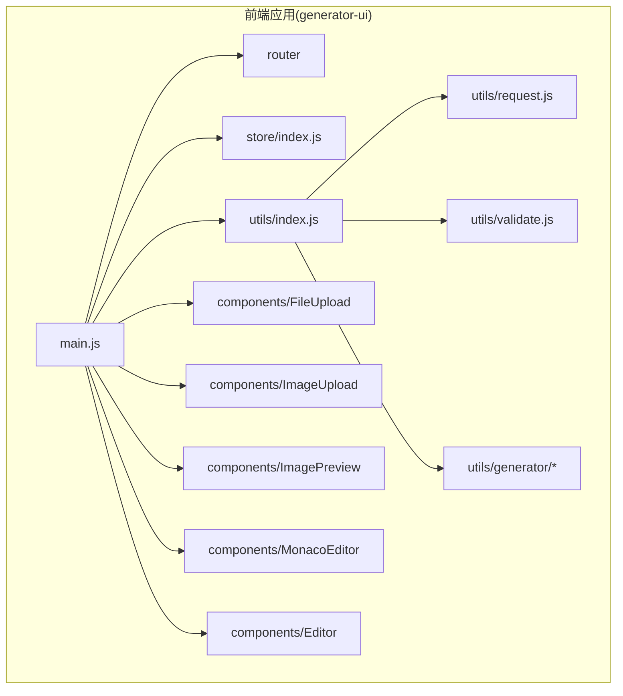
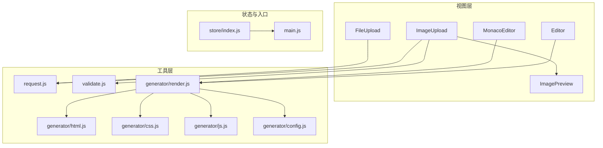
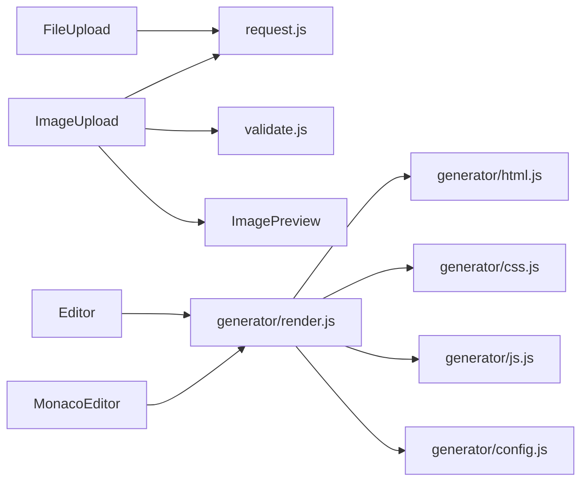

# 表单组件

<cite>
**本文引用的文件**
- [FileUpload 组件](file://generator-ui/src/components/FileUpload)
- [ImageUpload 组件](file://generator-ui/src/components/ImageUpload)
- [ImagePreview 组件](file://generator-ui/src/components/ImagePreview)
- [MonacoEditor 组件](file://generator-ui/src/components/MonacoEditor)
- [MonacoEditorType.ts](file://generator-ui/src/components/MonacoEditor/MonacoEditorType.ts)
- [Editor 组件](file://generator-ui/src/components/Editor)
- [项目入口 main.js](file://generator-ui/src/main.js)
- [路由配置 router](file://generator-ui/src/router)
- [状态管理 store](file://generator-ui/src/store/index.js)
- [通用工具 utils/index.js](file://generator-ui/src/utils/index.js)
- [请求封装 utils/request.js](file://generator-ui/src/utils/request.js)
- [验证工具 utils/validate.js](file://generator-ui/src/utils/validate.js)
- [代码生成器工具 utils/generator/render.js](file://generator-ui/src/utils/generator/render.js)
- [代码生成器工具 utils/generator/html.js](file://generator-ui/src/utils/generator/html.js)
- [代码生成器工具 utils/generator/css.js](file://generator-ui/src/utils/generator/css.js)
- [代码生成器工具 utils/generator/js.js](file://generator-ui/src/utils/generator/js.js)
- [代码生成器工具 utils/generator/config.js](file://generator-ui/src/utils/generator/config.js)
- [代码生成器工具 utils/generator/drawingDefault.js](file://generator-ui/src/utils/generator/drawingDefault.js)
</cite>

## 目录
1. [简介](#简介)
2. [项目结构](#项目结构)
3. [核心组件](#核心组件)
4. [架构总览](#架构总览)
5. [详细组件分析](#详细组件分析)
6. [依赖关系分析](#依赖关系分析)
7. [性能考虑](#性能考虑)
8. [故障排查指南](#故障排查指南)
9. [结论](#结论)
10. [附录](#附录)

## 简介
本文件聚焦 SH-Generator 的表单相关组件，围绕以下目标展开：文件上传组件（文件类型限制、大小控制、进度显示与错误处理）、图片上传组件（预览、裁剪与格式转换）、富文本编辑器组件（内容渲染、工具栏配置与数据绑定）。文档同时提供组件配置参数、回调与事件监听方法、完整使用示例与最佳实践建议，帮助开发者快速集成与稳定运行。

## 项目结构
- 前端位于 generator-ui，采用 Vue 技术栈与 Vite 构建，组件集中于 src/components。
- 代码生成器相关工具位于 utils/generator 下，用于渲染 HTML/CSS/JS 与配置项。
- 入口文件 main.js 负责应用初始化；router 与 store 提供路由与状态管理能力。

图表来源
- [项目入口 main.js](file://generator-ui/src/main.js)
- [路由配置 router](file://generator-ui/src/router)
- [状态管理 store](file://generator-ui/src/store/index.js)
- [通用工具 utils/index.js](file://generator-ui/src/utils/index.js)
- [请求封装 utils/request.js](file://generator-ui/src/utils/request.js)
- [验证工具 utils/validate.js](file://generator-ui/src/utils/validate.js)
- [代码生成器工具 utils/generator/render.js](file://generator-ui/src/utils/generator/render.js)
- [代码生成器工具 utils/generator/html.js](file://generator-ui/src/utils/generator/html.js)
- [代码生成器工具 utils/generator/css.js](file://generator-ui/src/utils/generator/css.js)
- [代码生成器工具 utils/generator/js.js](file://generator-ui/src/utils/generator/js.js)
- [代码生成器工具 utils/generator/config.js](file://generator-ui/src/utils/generator/config.js)
- [代码生成器工具 utils/generator/drawingDefault.js](file://generator-ui/src/utils/generator/drawingDefault.js)
- [FileUpload 组件](file://generator-ui/src/components/FileUpload)
- [ImageUpload 组件](file://generator-ui/src/components/ImageUpload)
- [ImagePreview 组件](file://generator-ui/src/components/ImagePreview)
- [MonacoEditor 组件](file://generator-ui/src/components/MonacoEditor)
- [Editor 组件](file://generator-ui/src/components/Editor)

章节来源
- [项目入口 main.js](file://generator-ui/src/main.js)
- [路由配置 router](file://generator-ui/src/router)
- [状态管理 store](file://generator-ui/src/store/index.js)
- [通用工具 utils/index.js](file://generator-ui/src/utils/index.js)
- [请求封装 utils/request.js](file://generator-ui/src/utils/request.js)
- [验证工具 utils/validate.js](file://generator-ui/src/utils/validate.js)
- [代码生成器工具 utils/generator/render.js](file://generator-ui/src/utils/generator/render.js)
- [代码生成器工具 utils/generator/html.js](file://generator-ui/src/utils/generator/html.js)
- [代码生成器工具 utils/generator/css.js](file://generator-ui/src/utils/generator/css.js)
- [代码生成器工具 utils/generator/js.js](file://generator-ui/src/utils/generator/js.js)
- [代码生成器工具 utils/generator/config.js](file://generator-ui/src/utils/generator/config.js)
- [代码生成器工具 utils/generator/drawingDefault.js](file://generator-ui/src/utils/generator/drawingDefault.js)
- [FileUpload 组件](file://generator-ui/src/components/FileUpload)
- [ImageUpload 组件](file://generator-ui/src/components/ImageUpload)
- [ImagePreview 组件](file://generator-ui/src/components/ImagePreview)
- [MonacoEditor 组件](file://generator-ui/src/components/MonacoEditor)
- [Editor 组件](file://generator-ui/src/components/Editor)

## 核心组件
- 文件上传组件：负责文件选择、类型与大小校验、上传进度展示与错误提示。
- 图片上传组件：支持图片预览、可选裁剪与格式转换，并通过预览组件进行二次确认。
- 富文本编辑器组件：提供内容渲染、工具栏配置与双向数据绑定，适配代码生成场景。

章节来源
- [FileUpload 组件](file://generator-ui/src/components/FileUpload)
- [ImageUpload 组件](file://generator-ui/src/components/ImageUpload)
- [ImagePreview 组件](file://generator-ui/src/components/ImagePreview)
- [MonacoEditor 组件](file://generator-ui/src/components/MonacoEditor)
- [Editor 组件](file://generator-ui/src/components/Editor)

## 架构总览
下图展示了表单组件在应用中的位置与交互关系：组件通过工具层完成请求、校验与渲染，状态管理贯穿全局。

图表来源
- [请求封装 utils/request.js](file://generator-ui/src/utils/request.js)
- [验证工具 utils/validate.js](file://generator-ui/src/utils/validate.js)
- [代码生成器工具 utils/generator/render.js](file://generator-ui/src/utils/generator/render.js)
- [代码生成器工具 utils/generator/html.js](file://generator-ui/src/utils/generator/html.js)
- [代码生成器工具 utils/generator/css.js](file://generator-ui/src/utils/generator/css.js)
- [代码生成器工具 utils/generator/js.js](file://generator-ui/src/utils/generator/js.js)
- [代码生成器工具 utils/generator/config.js](file://generator-ui/src/utils/generator/config.js)
- [状态管理 store](file://generator-ui/src/store/index.js)
- [项目入口 main.js](file://generator-ui/src/main.js)
- [FileUpload 组件](file://generator-ui/src/components/FileUpload)
- [ImageUpload 组件](file://generator-ui/src/components/ImageUpload)
- [ImagePreview 组件](file://generator-ui/src/components/ImagePreview)
- [MonacoEditor 组件](file://generator-ui/src/components/MonacoEditor)
- [Editor 组件](file://generator-ui/src/components/Editor)

## 详细组件分析

### 文件上传组件（FileUpload）
- 功能要点
  - 文件类型限制：通过白名单或黑名单策略控制允许的 MIME 类型或扩展名集合。
  - 大小控制：对单个文件与总大小进行阈值限制，超限则阻断上传并提示。
  - 进度显示：基于上传请求的进度事件，实时更新百分比与速度。
  - 错误处理：捕获网络异常、服务端错误码、格式与大小校验失败等，统一提示与回退。
- 配置参数（示意）
  - accept: 允许的文件类型集合
  - maxSize: 单文件最大字节
  - maxTotalSize: 总大小上限
  - multiple: 是否多选
  - uploadUrl: 上传接口地址
  - headers: 请求头（如鉴权令牌）
- 回调与事件
  - onBeforeUpload(file): 上传前钩子，可返回 Promise 控制是否继续
  - onProgress(percent, file): 进度回调
  - onSuccess(response, file): 成功回调
  - onError(error, file): 失败回调
  - onExceed(): 超出大小或数量限制时触发
- 使用示例（路径参考）
  - 在业务页面引入组件后，传入上述参数并绑定回调，即可实现完整的上传流程。
- 最佳实践
  - 服务端与客户端一致的校验策略，避免绕过。
  - 对大文件采用分片或断点续传（如需）。
  - 合理设置并发与重试策略，提升稳定性。

章节来源
- [FileUpload 组件](file://generator-ui/src/components/FileUpload)
- [请求封装 utils/request.js](file://generator-ui/src/utils/request.js)
- [验证工具 utils/validate.js](file://generator-ui/src/utils/validate.js)

### 图片上传组件（ImageUpload）
- 功能要点
  - 预览：选择图片后即时预览，支持缩放与旋转。
  - 裁剪：可选内置裁剪器，限定比例与尺寸，输出标准规格图片。
  - 格式转换：在上传前将图片转为目标格式（如 JPEG/PNG），并控制质量。
- 配置参数（示意）
  - accept: 图片类型白名单（如 image/jpeg, image/png）
  - maxSize: 单张图片大小上限
  - crop: 是否启用裁剪，以及裁剪规则（宽高比、最小尺寸）
  - quality: 转换质量（0-1）
  - preview: 是否开启预览
  - uploadUrl: 上传接口
- 回调与事件
  - onPreview(imageUrl): 打开预览时触发
  - onCrop(croppedBlob): 完成裁剪后的回调
  - onConverted(convertedBlob): 转换后的回调
  - onSuccess(response, file): 上传成功
  - onError(error): 上传失败
- 与 ImagePreview 的协作
  - 上传成功后可将预览地址传递给 ImagePreview，便于二次确认与放大查看。
- 使用示例（路径参考）
  - 在表单字段中嵌入 ImageUpload，结合裁剪与转换配置，确保图片符合规范后再提交。
- 最佳实践
  - 优先在客户端做压缩与格式转换，减轻服务端压力。
  - 对敏感信息（如 EXIF）进行清理（如需）。

章节来源
- [ImageUpload 组件](file://generator-ui/src/components/ImageUpload)
- [ImagePreview 组件](file://generator-ui/src/components/ImagePreview)
- [验证工具 utils/validate.js](file://generator-ui/src/utils/validate.js)
- [请求封装 utils/request.js](file://generator-ui/src/utils/request.js)

### 富文本编辑器组件（Editor）
- 内容渲染
  - 支持 Markdown/HTML 混排渲染，按需启用语法高亮与数学公式。
  - 可配置渲染引擎（如 marked 或自定义），保证一致性。
- 工具栏配置
  - 常用按钮：加粗、斜体、标题、列表、链接、图片、代码块、预览等。
  - 自定义按钮：通过插件扩展，满足特定业务需求。
- 数据绑定
  - v-model 双向绑定，支持受控与非受控模式。
  - change/onInput 事件同步内容变更，便于实时保存或校验。
- 使用示例（路径参考）
  - 在模板中声明组件并绑定 value，监听 change 事件以持久化或触发校验。
- 最佳实践
  - 对粘贴内容进行净化，防止注入风险。
  - 渲染性能优化：长文分页或虚拟滚动（如需）。

章节来源
- [Editor 组件](file://generator-ui/src/components/Editor)
- [代码生成器工具 utils/generator/render.js](file://generator-ui/src/utils/generator/render.js)

### 代码生成器编辑器（MonacoEditor）
- 角色定位
  - 面向代码生成场景的高性能编辑器，支持语法高亮、智能提示与格式化。
- 关键能力
  - 语言模式：根据模板类型自动切换语言（如 JavaScript、TypeScript、HTML、CSS、SQL）。
  - 主题与字体：可配置主题与字号，适配不同用户偏好。
  - 快捷键与命令：内置常用快捷键，支持自定义命令扩展。
- 类型约束
  - 通过 TypeScript 接口定义编辑器行为与配置项，降低集成成本。
- 使用示例（路径参考）
  - 在生成任务页面中，将模板内容加载到编辑器，用户可直接编辑并导出结果。
- 最佳实践
  - 对模板内容进行版本管理与差异对比。
  - 编辑器性能：大文件分段加载或延迟初始化。

章节来源
- [MonacoEditor 组件](file://generator-ui/src/components/MonacoEditor)
- [MonacoEditorType.ts](file://generator-ui/src/components/MonacoEditor/MonacoEditorType.ts)
- [代码生成器工具 utils/generator/html.js](file://generator-ui/src/utils/generator/html.js)
- [代码生成器工具 utils/generator/css.js](file://generator-ui/src/utils/generator/css.js)
- [代码生成器工具 utils/generator/js.js](file://generator-ui/src/utils/generator/js.js)
- [代码生成器工具 utils/generator/config.js](file://generator-ui/src/utils/generator/config.js)

## 依赖关系分析
- 组件间耦合
  - ImageUpload 与 ImagePreview 存在弱耦合：前者负责上传与转换，后者负责展示。
  - Editor 与 MonacoEditor 分别面向不同场景：Editor 更偏向富文本，MonacoEditor 更偏向代码。
- 外部依赖
  - request.js 提供统一请求封装，validate.js 提供校验工具，二者被多个组件复用。
  - generator/* 工具链为渲染与生成提供支撑，与编辑器类组件紧密关联。
- 循环依赖
  - 当前结构未见明显循环依赖，模块职责清晰。

图表来源
- [请求封装 utils/request.js](file://generator-ui/src/utils/request.js)
- [验证工具 utils/validate.js](file://generator-ui/src/utils/validate.js)
- [代码生成器工具 utils/generator/render.js](file://generator-ui/src/utils/generator/render.js)
- [代码生成器工具 utils/generator/html.js](file://generator-ui/src/utils/generator/html.js)
- [代码生成器工具 utils/generator/css.js](file://generator-ui/src/utils/generator/css.js)
- [代码生成器工具 utils/generator/js.js](file://generator-ui/src/utils/generator/js.js)
- [代码生成器工具 utils/generator/config.js](file://generator-ui/src/utils/generator/config.js)
- [FileUpload 组件](file://generator-ui/src/components/FileUpload)
- [ImageUpload 组件](file://generator-ui/src/components/ImageUpload)
- [ImagePreview 组件](file://generator-ui/src/components/ImagePreview)
- [Editor 组件](file://generator-ui/src/components/Editor)
- [MonacoEditor 组件](file://generator-ui/src/components/MonacoEditor)

章节来源
- [请求封装 utils/request.js](file://generator-ui/src/utils/request.js)
- [验证工具 utils/validate.js](file://generator-ui/src/utils/validate.js)
- [代码生成器工具 utils/generator/render.js](file://generator-ui/src/utils/generator/render.js)
- [代码生成器工具 utils/generator/html.js](file://generator-ui/src/utils/generator/html.js)
- [代码生成器工具 utils/generator/css.js](file://generator-ui/src/utils/generator/css.js)
- [代码生成器工具 utils/generator/js.js](file://generator-ui/src/utils/generator/js.js)
- [代码生成器工具 utils/generator/config.js](file://generator-ui/src/utils/generator/config.js)
- [FileUpload 组件](file://generator-ui/src/components/FileUpload)
- [ImageUpload 组件](file://generator-ui/src/components/ImageUpload)
- [ImagePreview 组件](file://generator-ui/src/components/ImagePreview)
- [Editor 组件](file://generator-ui/src/components/Editor)
- [MonacoEditor 组件](file://generator-ui/src/components/MonacoEditor)

## 性能考虑
- 上传性能
  - 小文件直传，大文件采用分片与断点续传；合理设置并发数与超时时间。
  - 客户端压缩与格式转换，减少带宽占用。
- 渲染性能
  - 富文本与代码编辑器内容较长时，采用懒加载与虚拟滚动优化。
  - 渲染引擎缓存与增量更新，避免全量重绘。
- 状态管理
  - 将上传进度与错误状态放入 store，统一调度与去重。

## 故障排查指南
- 文件上传常见问题
  - 类型不匹配：检查 accept 配置与服务端白名单是否一致。
  - 超大小：确认客户端与服务端阈值一致，避免误判。
  - 进度异常：检查请求拦截器与响应头 Content-Length。
- 图片上传常见问题
  - 预览失败：确认图片 URL 可访问与跨域策略。
  - 裁剪无效：检查裁剪参数与浏览器兼容性。
  - 转换失败：确认图片格式与质量参数范围。
- 富文本与代码编辑器
  - 渲染错乱：检查渲染引擎配置与 DOM 安全策略。
  - 输入卡顿：排查事件监听频率与防抖策略。

章节来源
- [请求封装 utils/request.js](file://generator-ui/src/utils/request.js)
- [验证工具 utils/validate.js](file://generator-ui/src/utils/validate.js)
- [代码生成器工具 utils/generator/render.js](file://generator-ui/src/utils/generator/render.js)
- [FileUpload 组件](file://generator-ui/src/components/FileUpload)
- [ImageUpload 组件](file://generator-ui/src/components/ImageUpload)
- [Editor 组件](file://generator-ui/src/components/Editor)
- [MonacoEditor 组件](file://generator-ui/src/components/MonacoEditor)

## 结论
本文档系统梳理了 SH-Generator 的表单组件体系，重点覆盖文件上传、图片上传与富文本/代码编辑器的关键能力与最佳实践。通过明确的配置参数、回调与事件模型，以及与工具层的协同关系，开发者可以高效集成并稳定运行这些组件，满足代码生成与表单场景的多样化需求。

## 附录
- 使用示例路径参考
  - 文件上传：在业务表单中引入 FileUpload 并绑定回调，参考组件与请求封装。
  - 图片上传：在图片字段中引入 ImageUpload，配置裁剪与转换，参考组件与预览组件。
  - 富文本编辑器：在模板编辑页引入 Editor 或 MonacoEditor，绑定数据与事件，参考渲染工具链。
- 最佳实践清单
  - 前后端一致的校验策略
  - 合理的并发与重试
  - 客户端压缩与格式转换
  - 渲染与输入性能优化
  - 统一的状态管理与错误提示