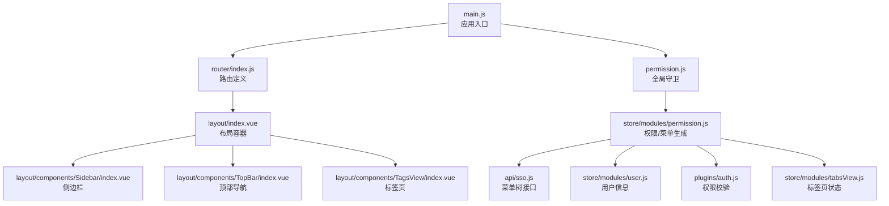
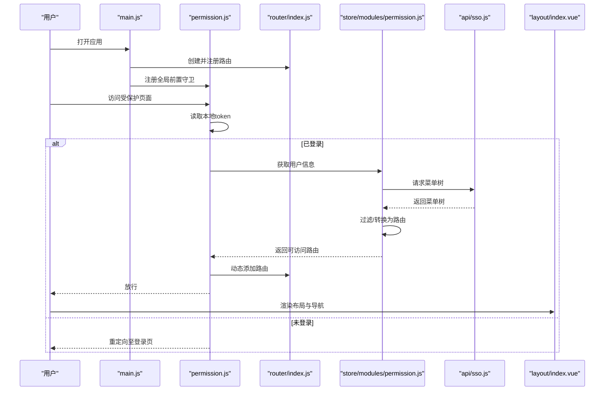
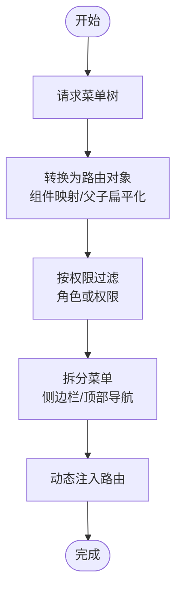
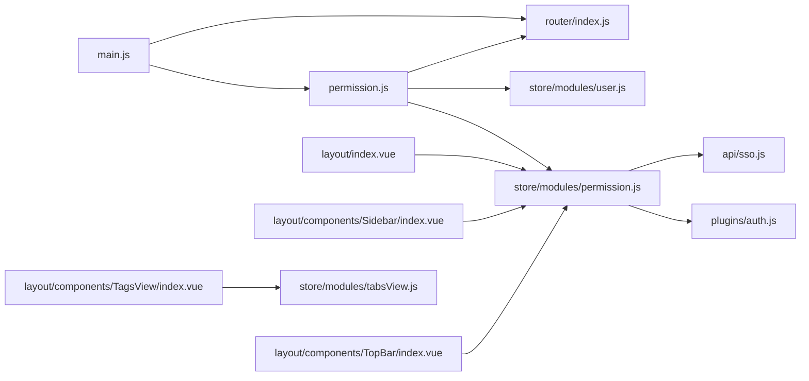

# 路由与导航

<cite>
**本文引用的文件**
- [router/index.js](file://generator-ui/src/router/index.js)
- [permission.js](file://generator-ui/src/permission.js)
- [main.js](file://generator-ui/src/main.js)
- [layout/index.vue](file://generator-ui/src/layout/index.vue)
- [layout/components/index.js](file://generator-ui/src/layout/components/index.js)
- [layout/components/Sidebar/index.vue](file://generator-ui/src/layout/components/Sidebar/index.vue)
- [layout/components/TopBar/index.vue](file://generator-ui/src/layout/components/TopBar/index.vue)
- [layout/components/TagsView/index.vue](file://generator-ui/src/layout/components/TagsView/index.vue)
- [store/modules/permission.js](file://generator-ui/src/store/modules/permission.js)
- [store/modules/user.js](file://generator-ui/src/store/modules/user.js)
- [store/modules/tabsView.js](file://generator-ui/src/store/modules/tabsView.js)
- [plugins/auth.js](file://generator-ui/src/plugins/auth.js)
- [utils/auth.js](file://generator-ui/src/utils/auth.js)
- [api/sso.js](file://generator-ui/src/api/sso.js)
- [views/codegen/project/index.vue](file://generator-ui/src/views/codegen/project/index.vue)
</cite>

## 目录
1. [简介](#简介)
2. [项目结构](#项目结构)
3. [核心组件](#核心组件)
4. [架构总览](#架构总览)
5. [详细组件分析](#详细组件分析)
6. [依赖关系分析](#依赖关系分析)
7. [性能考虑](#性能考虑)
8. [故障排查指南](#故障排查指南)
9. [结论](#结论)
10. [附录：路由配置与导航使用示例](#附录路由配置与导航使用示例)

## 简介
本文件面向 SH-Generator 的前端路由与导航体系，系统性解析 Vue Router 的配置与路由守卫机制，阐明布局系统（顶部导航栏、侧边栏、标签页）的架构与交互，详解权限控制与菜单生成流程，给出路由懒加载与性能优化策略，并总结导航状态管理与用户体验优化的最佳实践。

## 项目结构
围绕路由与导航的关键目录与文件如下：
- 路由定义与滚动行为：router/index.js
- 全局前置守卫与进度条：permission.js
- 应用入口注册路由与状态：main.js
- 布局容器与三大导航组件：layout/index.vue、layout/components/Sidebar/index.vue、layout/components/TopBar/index.vue、layout/components/TagsView/index.vue
- 权限与菜单生成：store/modules/permission.js
- 用户与权限数据：store/modules/user.js、plugins/auth.js、api/sso.js
- 标签页状态：store/modules/tabsView.js
- 令牌与本地存储：utils/auth.js
- 示例视图：views/codegen/project/index.vue

图表来源
- [main.js:1-105](file://generator-ui/src/main.js#L1-L105)
- [router/index.js:1-86](file://generator-ui/src/router/index.js#L1-L86)
- [permission.js:1-74](file://generator-ui/src/permission.js#L1-L74)
- [layout/index.vue:1-117](file://generator-ui/src/layout/index.vue#L1-L117)
- [layout/components/Sidebar/index.vue:1-105](file://generator-ui/src/layout/components/Sidebar/index.vue#L1-L105)
- [layout/components/TopBar/index.vue:1-100](file://generator-ui/src/layout/components/TopBar/index.vue#L1-L100)
- [layout/components/TagsView/index.vue:1-371](file://generator-ui/src/layout/components/TagsView/index.vue#L1-L371)
- [store/modules/permission.js:1-118](file://generator-ui/src/store/modules/permission.js#L1-L118)
- [api/sso.js:1-27](file://generator-ui/src/api/sso.js#L1-L27)
- [store/modules/user.js:1-92](file://generator-ui/src/store/modules/user.js#L1-L92)
- [plugins/auth.js:1-61](file://generator-ui/src/plugins/auth.js#L1-L61)
- [store/modules/tabsView.js:1-183](file://generator-ui/src/store/modules/tabsView.js#L1-L183)

章节来源
- [router/index.js:1-86](file://generator-ui/src/router/index.js#L1-L86)
- [permission.js:1-74](file://generator-ui/src/permission.js#L1-L74)
- [main.js:1-105](file://generator-ui/src/main.js#L1-L105)

## 核心组件
- 路由器与常量/动态路由
  - 常量路由：登录、重定向、404/401、用户中心等公共页面
  - 动态路由：空数组占位，运行时按权限注入
  - 滚动行为：支持恢复滚动位置或回到顶部
- 权限与菜单生成
  - 从后端获取菜单树，转换为路由对象，过滤无权限路由
  - 将菜单树拆分为侧边栏与顶部导航可用的数据源
- 布局容器
  - 容器根据设备切换侧边栏与标签页显示
  - 主区域渲染 AppMain，顶部渲染 Navbar 与 TagsView
- 侧边栏
  - 基于 Element Plus Menu 渲染，支持折叠、主题色、激活高亮
- 顶部导航
  - 水平菜单，根据窗口宽度动态显示“更多菜单”
- 标签页
  - 记录访问历史，支持刷新、关闭、左右侧批量关闭、全部关闭
  - 支持图标与标题，活跃标签高亮

章节来源
- [router/index.js:27-86](file://generator-ui/src/router/index.js#L27-L86)
- [store/modules/permission.js:35-118](file://generator-ui/src/store/modules/permission.js#L35-L118)
- [layout/index.vue:1-117](file://generator-ui/src/layout/index.vue#L1-L117)
- [layout/components/Sidebar/index.vue:1-105](file://generator-ui/src/layout/components/Sidebar/index.vue#L1-L105)
- [layout/components/TopBar/index.vue:1-100](file://generator-ui/src/layout/components/TopBar/index.vue#L1-L100)
- [layout/components/TagsView/index.vue:1-371](file://generator-ui/src/layout/components/TagsView/index.vue#L1-L371)

## 架构总览
整体流程：应用启动 -> 注册路由与守卫 -> 用户登录 -> 拉取用户信息 -> 请求菜单树 -> 生成可访问路由 -> 动态注入 -> 渲染布局与导航 -> 标签页记录与状态管理。

图表来源
- [main.js:24](file://generator-ui/src/main.js#L24)
- [permission.js:20-69](file://generator-ui/src/permission.js#L20-L69)
- [router/index.js:74-86](file://generator-ui/src/router/index.js#L74-L86)
- [store/modules/permission.js:35-44](file://generator-ui/src/store/modules/permission.js#L35-L44)
- [api/sso.js:19-21](file://generator-ui/src/api/sso.js#L19-L21)
- [layout/index.vue:1-117](file://generator-ui/src/layout/index.vue#L1-L117)

## 详细组件分析

### 路由器与路由配置
- 历史模式：使用哈希历史
- 常量路由：包含登录、重定向、404/401、用户中心等
- 动态路由：预留空数组，运行时注入
- 滚动行为：优先恢复上次滚动位置，否则回到顶部

章节来源
- [router/index.js:74-86](file://generator-ui/src/router/index.js#L74-L86)

### 全局前置守卫与导航拦截
- 白名单：登录、注册
- 令牌存在：设置页面标题、判断是否已拉取用户信息；若未拉取则拉取并生成路由，再放行
- 令牌不存在：非白名单一律重定向至登录页
- 进度条：每次导航开始/结束均控制进度条

章节来源
- [permission.js:14-69](file://generator-ui/src/permission.js#L14-L69)

### 布局容器与导航组件
- 布局容器：响应式控制侧边栏与标签页显示，固定头部宽度计算
- 侧边栏：根据权限路由渲染菜单，支持折叠、主题色、激活高亮
- 顶部导航：水平菜单，动态显示“更多菜单”，根据窗口宽度自适应
- 标签页：记录访问历史，支持右键上下文菜单与快捷操作

章节来源
- [layout/index.vue:1-117](file://generator-ui/src/layout/index.vue#L1-L117)
- [layout/components/Sidebar/index.vue:1-105](file://generator-ui/src/layout/components/Sidebar/index.vue#L1-L105)
- [layout/components/TopBar/index.vue:1-100](file://generator-ui/src/layout/components/TopBar/index.vue#L1-L100)
- [layout/components/TagsView/index.vue:1-371](file://generator-ui/src/layout/components/TagsView/index.vue#L1-L371)

### 权限控制与菜单生成
- 菜单树来源：调用后端接口获取
- 路由转换：将组件字符串映射为实际组件（Layout、ParentView、InnerLink 或动态导入）
- 权限过滤：支持按角色或权限进行 OR 过滤
- 菜单拆分：生成侧边栏与顶部导航可用的路由集合

图表来源
- [store/modules/permission.js:35-118](file://generator-ui/src/store/modules/permission.js#L35-L118)
- [api/sso.js:19-21](file://generator-ui/src/api/sso.js#L19-L21)

章节来源
- [store/modules/permission.js:1-118](file://generator-ui/src/store/modules/permission.js#L1-L118)
- [plugins/auth.js:1-61](file://generator-ui/src/plugins/auth.js#L1-L61)
- [store/modules/user.js:1-92](file://generator-ui/src/store/modules/user.js#L1-L92)

### 标签页状态管理
- 访问历史：记录 visitedViews，支持 affix 固定标签
- 缓存策略：noCache 控制是否缓存组件
- 操作能力：刷新、关闭当前、关闭其他、关闭左侧/右侧、全部关闭
- 视图联动：与路由跳转、iframe 视图协同

章节来源
- [store/modules/tabsView.js:1-183](file://generator-ui/src/store/modules/tabsView.js#L1-L183)
- [layout/components/TagsView/index.vue:1-371](file://generator-ui/src/layout/components/TagsView/index.vue#L1-L371)

### 示例视图与导航集成
- 示例页面展示了表格、分页、弹窗等常用控件，体现与布局、导航的完整集成

章节来源
- [views/codegen/project/index.vue:1-155](file://generator-ui/src/views/codegen/project/index.vue#L1-L155)

## 依赖关系分析
- main.js 依赖 router 与 permission，负责应用初始化与全局守卫注册
- permission.js 依赖路由实例、用户与权限 Store、SSO 接口
- permission store 依赖路由定义、菜单树接口、权限插件与组件映射
- layout 组件依赖 permission store 与 settings store 提供的主题与设备状态

图表来源
- [main.js:1-105](file://generator-ui/src/main.js#L1-L105)
- [permission.js:1-74](file://generator-ui/src/permission.js#L1-L74)
- [router/index.js:1-86](file://generator-ui/src/router/index.js#L1-L86)
- [store/modules/permission.js:1-118](file://generator-ui/src/store/modules/permission.js#L1-L118)
- [store/modules/user.js:1-92](file://generator-ui/src/store/modules/user.js#L1-L92)
- [store/modules/tabsView.js:1-183](file://generator-ui/src/store/modules/tabsView.js#L1-L183)
- [api/sso.js:1-27](file://generator-ui/src/api/sso.js#L1-L27)
- [plugins/auth.js:1-61](file://generator-ui/src/plugins/auth.js#L1-L61)
- [layout/index.vue:1-117](file://generator-ui/src/layout/index.vue#L1-L117)
- [layout/components/Sidebar/index.vue:1-105](file://generator-ui/src/layout/components/Sidebar/index.vue#L1-L105)
- [layout/components/TopBar/index.vue:1-100](file://generator-ui/src/layout/components/TopBar/index.vue#L1-L100)
- [layout/components/TagsView/index.vue:1-371](file://generator-ui/src/layout/components/TagsView/index.vue#L1-L371)

## 性能考虑
- 路由懒加载
  - 使用动态导入按需加载视图组件，减少首屏体积
  - 组件映射通过约定路径与 import.meta.glob 实现
- KeepAlive 缓存
  - 通过路由 meta.noCache 控制是否缓存组件
  - 标签页缓存策略与 noCache 协同
- 进度条与滚动
  - 导航进度条避免长时间空白
  - 滚动位置恢复提升连续浏览体验
- 主题与响应式
  - 基于 CSS 变量的主题切换，减少重绘
  - 移动端自适应与侧边栏折叠降低渲染压力

章节来源
- [router/index.js:106-115](file://generator-ui/src/router/index.js#L106-L115)
- [store/modules/tabsView.js:30-35](file://generator-ui/src/store/modules/tabsView.js#L30-L35)
- [layout/index.vue:41-54](file://generator-ui/src/layout/index.vue#L41-L54)

## 故障排查指南
- 登录后循环重定向
  - 检查白名单匹配与路由注入逻辑
  - 确认用户信息拉取成功后再注入路由
- 无权限页面无法访问
  - 核对后端返回菜单树与权限标识
  - 确认权限过滤函数 hasPermiOr/hasRoleOr 生效
- 标签页异常
  - 检查 affix 标签与 noCache 配置
  - 确认路由 meta.title 与图标配置
- 侧边栏/顶部导航不显示
  - 确认菜单树 children 展开与 component 映射
  - 检查 hidden 与 alwaysShow 配置

章节来源
- [permission.js:20-69](file://generator-ui/src/permission.js#L20-L69)
- [store/modules/permission.js:89-104](file://generator-ui/src/store/modules/permission.js#L89-L104)
- [layout/components/TagsView/index.vue:140-149](file://generator-ui/src/layout/components/TagsView/index.vue#L140-L149)
- [layout/components/Sidebar/index.vue:16-22](file://generator-ui/src/layout/components/Sidebar/index.vue#L16-L22)

## 结论
本路由与导航体系以 Vue Router 为核心，结合全局守卫、权限 Store 与菜单树接口，实现了灵活的权限控制与动态路由注入；布局容器与三大导航组件提供了完整的用户体验；配合懒加载、缓存与进度条等策略，兼顾了性能与交互流畅性。建议在后续迭代中持续优化菜单树结构与权限模型，增强错误边界与可观测性。

## 附录：路由配置与导航使用示例
- 路由配置要点
  - 常量路由用于公共页面与兜底
  - 动态路由通过权限生成并注入
  - 路由 meta 中配置标题、图标、缓存与激活菜单
- 导航组件使用
  - 侧边栏：绑定 permission.store.sidebarRouters
  - 顶部导航：根据窗口宽度动态显示“更多菜单”
  - 标签页：监听路由变化自动添加，支持右键菜单与快捷操作
- 示例页面
  - 项目管理页面展示了表格、分页、弹窗等与布局的集成方式

章节来源
- [router/index.js:18-25](file://generator-ui/src/router/index.js#L18-L25)
- [layout/components/Sidebar/index.vue:16-22](file://generator-ui/src/layout/components/Sidebar/index.vue#L16-L22)
- [layout/components/TopBar/index.vue:37-42](file://generator-ui/src/layout/components/TopBar/index.vue#L37-L42)
- [layout/components/TagsView/index.vue:68-71](file://generator-ui/src/layout/components/TagsView/index.vue#L68-L71)
- [views/codegen/project/index.vue:1-155](file://generator-ui/src/views/codegen/project/index.vue#L1-L155)