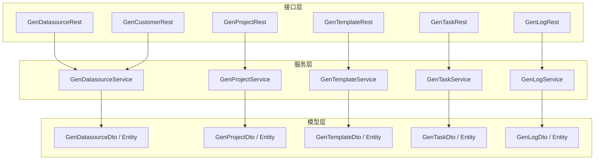
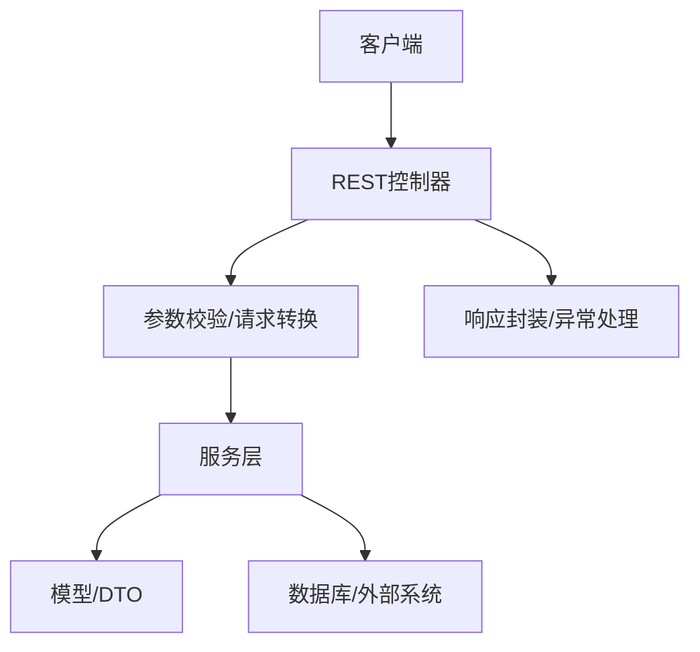
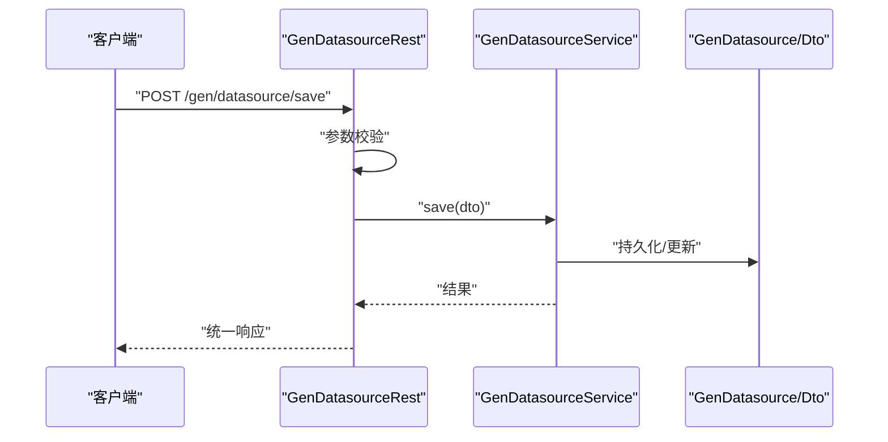
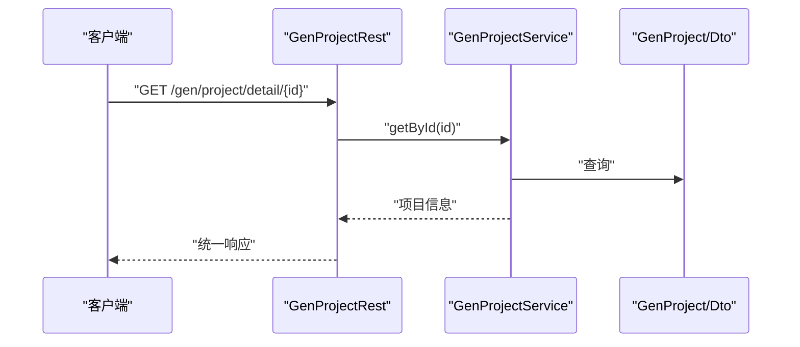
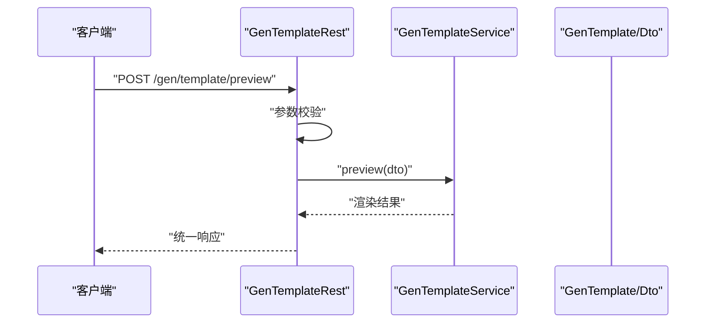
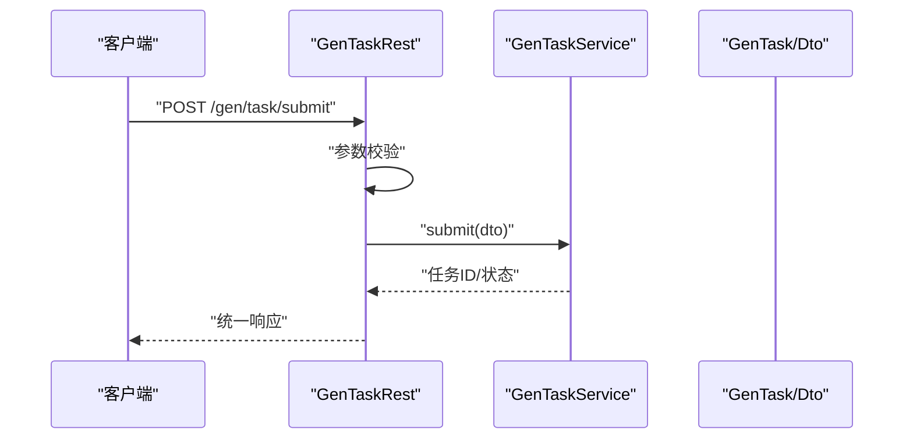
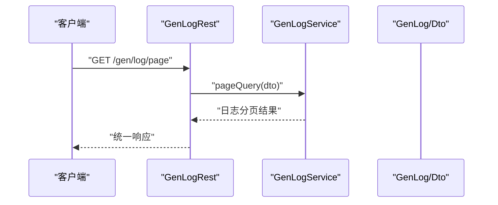
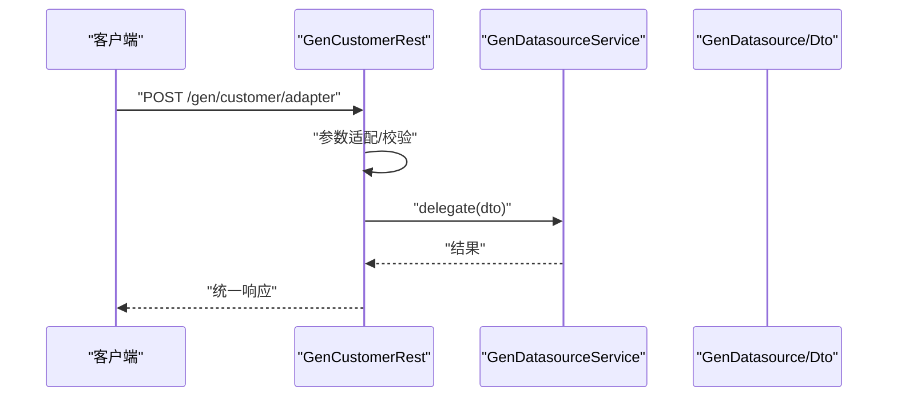
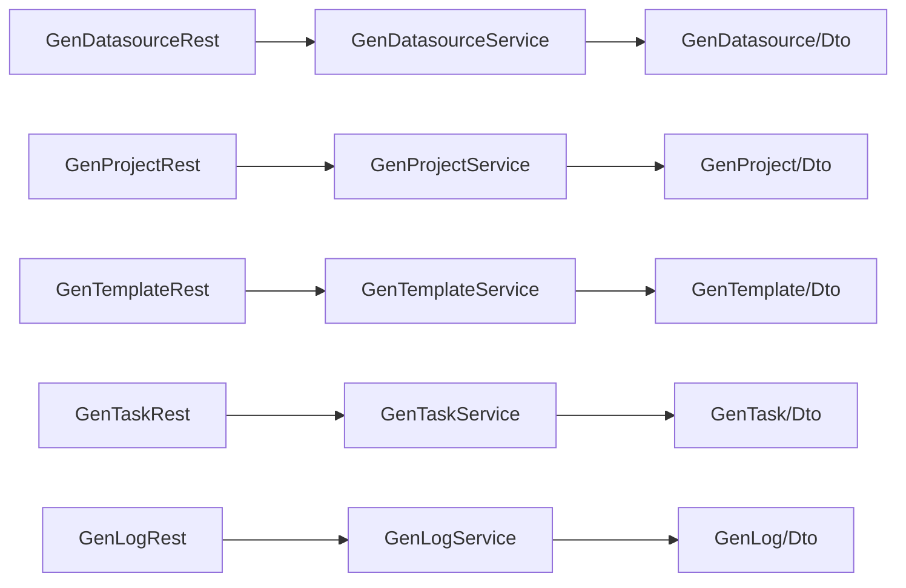

# REST接口层

<cite>
**本文档引用的文件**
- [GenDatasourceRest.java](file://generator-server/src/main/java/com/wkclz/generator/server/rest/GenDatasourceRest.java)
- [GenProjectRest.java](file://generator-server/src/main/java/com/wkclz/generator/server/rest/GenProjectRest.java)
- [GenTemplateRest.java](file://generator-server/src/main/java/com/wkclz/generator/server/rest/GenTemplateRest.java)
- [GenTaskRest.java](file://generator-server/src/main/java/com/wkclz/generator/server/rest/GenTaskRest.java)
- [GenLogRest.java](file://generator-server/src/main/java/com/wkclz/generator/server/rest/GenLogRest.java)
- [GenCustomerRest.java](file://generator-server/src/main/java/com/wkclz/generator/server/rest/GenCustomerRest.java)
- [GenDatasourceDto.java](file://generator-server/src/main/java/com/wkclz/generator/server/bean/dto/GenDatasourceDto.java)
- [GenProjectDto.java](file://generator-server/src/main/java/com/wkclz/generator/server/bean/dto/GenProjectDto.java)
- [GenTemplateDto.java](file://generator-server/src/main/java/com/wkclz/generator/server/bean/dto/GenTemplateDto.java)
- [GenTaskDto.java](file://generator-server/src/main/java/com/wkclz/generator/server/bean/dto/GenTaskDto.java)
- [GenLogDto.java](file://generator-server/src/main/java/com/wkclz/generator/server/bean/dto/GenLogDto.java)
- [GenDatasource.java](file://generator-server/src/main/java/com/wkclz/generator/server/bean/entity/GenDatasource.java)
- [GenProject.java](file://generator-server/src/main/java/com/wkclz/generator/server/bean/entity/GenProject.java)
- [GenTemplate.java](file://generator-server/src/main/java/com/wkclz/generator/server/bean/entity/GenTemplate.java)
- [GenTask.java](file://generator-server/src/main/java/com/wkclz/generator/server/bean/entity/GenTask.java)
- [GenLog.java](file://generator-server/src/main/java/com/wkclz/generator/server/bean/entity/GenLog.java)
- [GenDatasourceService.java](file://generator-server/src/main/java/com/wkclz/generator/server/service/GenDatasourceService.java)
- [GenProjectService.java](file://generator-server/src/main/java/com/wkclz/generator/server/service/GenProjectService.java)
- [GenTemplateService.java](file://generator-server/src/main/java/com/wkclz/generator/server/service/GenTemplateService.java)
- [GenTaskService.java](file://generator-server/src/main/java/com/wkclz/generator/server/service/GenTaskService.java)
- [GenLogService.java](file://generator-server/src/main/java/com/wkclz/generator/server/service/GenLogService.java)
- [Route.java](file://generator-server/src/main/java/com/wkclz/generator/server/Route.java)
- [application.yml](file://generator-server-starter/src/main/resources/config/application.yml)
</cite>

## 目录
1. [简介](#简介)
2. [项目结构](#项目结构)
3. [核心组件](#核心组件)
4. [架构总览](#架构总览)
5. [详细组件分析](#详细组件分析)
6. [依赖关系分析](#依赖关系分析)
7. [性能考虑](#性能考虑)
8. [故障排除指南](#故障排除指南)
9. [结论](#结论)

## 简介
本文件面向SH-Generator的REST接口层，系统性梳理RESTful API的设计原则与实现规范，覆盖HTTP方法选择、URL路径设计与资源命名约定；并逐项说明各REST控制器（数据源、项目、模板、任务、日志、客户）的职责边界与接口规范，包括请求参数验证、响应数据格式化与错误处理机制。同时提供安全性考量（权限验证、CSRF防护、数据校验）、最佳实践与性能优化建议，帮助开发者与使用者高效、安全地集成与使用该接口层。

## 项目结构
- 接口层位于 generator-server 模块的 rest 包中，每个领域对应一个REST控制器类，统一通过服务层完成业务逻辑。
- DTO/Entity模型位于 bean 子包下，分别用于接口传输与持久化映射。
- 路由配置位于 Route 类中，集中定义了各控制器的路由前缀与路径规则。
- 配置文件位于 generator-server-starter 的 application.yml 中，包含基础运行参数与环境配置。

**图表来源**
- [GenDatasourceRest.java](file://generator-server/src/main/java/com/wkclz/generator/server/rest/GenDatasourceRest.java)
- [GenProjectRest.java](file://generator-server/src/main/java/com/wkclz/generator/server/rest/GenProjectRest.java)
- [GenTemplateRest.java](file://generator-server/src/main/java/com/wkclz/generator/server/rest/GenTemplateRest.java)
- [GenTaskRest.java](file://generator-server/src/main/java/com/wkclz/generator/server/rest/GenTaskRest.java)
- [GenLogRest.java](file://generator-server/src/main/java/com/wkclz/generator/server/rest/GenLogRest.java)
- [GenCustomerRest.java](file://generator-server/src/main/java/com/wkclz/generator/server/rest/GenCustomerRest.java)

**章节来源**
- [Route.java](file://generator-server/src/main/java/com/wkclz/generator/server/Route.java)
- [application.yml](file://generator-server-starter/src/main/resources/config/application.yml)

## 核心组件
- REST控制器：负责接收HTTP请求、参数校验、调用服务层、封装响应与异常处理。
- 服务层：封装业务逻辑，协调数据访问与外部依赖。
- DTO/Entity：DTO用于接口传输，Entity用于数据库映射，二者在控制器与服务层之间传递。
- 路由配置：集中定义各控制器的路由前缀与路径，确保URL风格一致、可预测。

关键职责划分：
- 数据源管理：提供数据源的增删改查、连接测试、分页查询等能力。
- 项目配置：维护项目元信息、生成参数、模板关联等。
- 模板管理：支持模板的增删改查、版本控制与预览能力。
- 任务调度：提交生成任务、查询执行状态、触发定时任务。
- 日志查询：按条件筛选生成日志、导出日志记录。
- 客户接口：面向外部客户的统一入口或适配层。

**章节来源**
- [GenDatasourceRest.java](file://generator-server/src/main/java/com/wkclz/generator/server/rest/GenDatasourceRest.java)
- [GenProjectRest.java](file://generator-server/src/main/java/com/wkclz/generator/server/rest/GenProjectRest.java)
- [GenTemplateRest.java](file://generator-server/src/main/java/com/wkclz/generator/server/rest/GenTemplateRest.java)
- [GenTaskRest.java](file://generator-server/src/main/java/com/wkclz/generator/server/rest/GenTaskRest.java)
- [GenLogRest.java](file://generator-server/src/main/java/com/wkclz/generator/server/rest/GenLogRest.java)
- [GenCustomerRest.java](file://generator-server/src/main/java/com/wkclz/generator/server/rest/GenCustomerRest.java)

## 架构总览
接口层采用典型的分层架构：REST控制器 -> 服务层 -> 数据访问层。控制器仅负责协议与参数处理，服务层承载业务规则，实体与DTO隔离接口与存储细节。路由前缀统一，便于扩展与维护。

[此图为概念性架构示意，不直接映射具体源码文件，故无“图表来源”标注]

## 详细组件分析

### 数据源管理接口（GenDatasourceRest）
- 资源命名：/gen/datasource
- 主要方法与用途：
  - 新增/更新：保存数据源配置，含连接参数与类型校验
  - 删除：按ID删除数据源
  - 列表/分页：支持条件过滤与分页返回
  - 连接测试：验证数据源连通性
- 请求参数：
  - 使用GenDatasourceDto进行传输，包含数据源名称、类型、JDBC地址、认证信息等字段
- 响应格式：
  - 统一包装结果对象，包含状态码、消息与数据载体
- 错误处理：
  - 参数缺失或格式错误时返回明确提示
  - 连接失败时返回相应错误码与原因
- 安全性：
  - 敏感信息（如密码）需脱敏展示与传输
  - 建议启用鉴权与HTTPS

**图表来源**
- [GenDatasourceRest.java](file://generator-server/src/main/java/com/wkclz/generator/server/rest/GenDatasourceRest.java)
- [GenDatasourceService.java](file://generator-server/src/main/java/com/wkclz/generator/server/service/GenDatasourceService.java)
- [GenDatasourceDto.java](file://generator-server/src/main/java/com/wkclz/generator/server/bean/dto/GenDatasourceDto.java)
- [GenDatasource.java](file://generator-server/src/main/java/com/wkclz/generator/server/bean/entity/GenDatasource.java)

**章节来源**
- [GenDatasourceRest.java](file://generator-server/src/main/java/com/wkclz/generator/server/rest/GenDatasourceRest.java)
- [GenDatasourceDto.java](file://generator-server/src/main/java/com/wkclz/generator/server/bean/dto/GenDatasourceDto.java)
- [GenDatasource.java](file://generator-server/src/main/java/com/wkclz/generator/server/bean/entity/GenDatasource.java)

### 项目配置接口（GenProjectRest）
- 资源命名：/gen/project
- 主要方法与用途：
  - 新增/更新：保存项目基本信息与生成参数
  - 删除：按ID删除项目
  - 列表/分页：支持按项目名等条件过滤
  - 查询详情：按ID获取项目完整信息
- 请求参数：
  - GenProjectDto包含项目标识、模板ID、输出路径、包信息等
- 响应格式：
  - 统一包装，包含数据列表或单个对象
- 错误处理：
  - 必填字段缺失时返回提示
  - 模板不存在或无效时给出明确错误

**图表来源**
- [GenProjectRest.java](file://generator-server/src/main/java/com/wkclz/generator/server/rest/GenProjectRest.java)
- [GenProjectService.java](file://generator-server/src/main/java/com/wkclz/generator/server/service/GenProjectService.java)
- [GenProjectDto.java](file://generator-server/src/main/java/com/wkclz/generator/server/bean/dto/GenProjectDto.java)
- [GenProject.java](file://generator-server/src/main/java/com/wkclz/generator/server/bean/entity/GenProject.java)

**章节来源**
- [GenProjectRest.java](file://generator-server/src/main/java/com/wkclz/generator/server/rest/GenProjectRest.java)
- [GenProjectDto.java](file://generator-server/src/main/java/com/wkclz/generator/server/bean/dto/GenProjectDto.java)
- [GenProject.java](file://generator-server/src/main/java/com/wkclz/generator/server/bean/entity/GenProject.java)

### 模板管理接口（GenTemplateRest）
- 资源命名：/gen/template
- 主要方法与用途：
  - 新增/更新：保存模板内容与元信息
  - 删除：按ID删除模板
  - 列表/分页：支持按模板名过滤
  - 预览：渲染模板以验证语法与变量
- 请求参数：
  - GenTemplateDto包含模板名、内容、描述等
- 响应格式：
  - 返回模板列表、单个模板或渲染结果
- 错误处理：
  - 模板内容语法错误时返回解析失败信息
  - 重名或非法字符时提示

**图表来源**
- [GenTemplateRest.java](file://generator-server/src/main/java/com/wkclz/generator/server/rest/GenTemplateRest.java)
- [GenTemplateService.java](file://generator-server/src/main/java/com/wkclz/generator/server/service/GenTemplateService.java)
- [GenTemplateDto.java](file://generator-server/src/main/java/com/wkclz/generator/server/bean/dto/GenTemplateDto.java)
- [GenTemplate.java](file://generator-server/src/main/java/com/wkclz/generator/server/bean/entity/GenTemplate.java)

**章节来源**
- [GenTemplateRest.java](file://generator-server/src/main/java/com/wkclz/generator/server/rest/GenTemplateRest.java)
- [GenTemplateDto.java](file://generator-server/src/main/java/com/wkclz/generator/server/bean/dto/GenTemplateDto.java)
- [GenTemplate.java](file://generator-server/src/main/java/com/wkclz/generator/server/bean/entity/GenTemplate.java)

### 任务调度接口（GenTaskRest）
- 资源命名：/gen/task
- 主要方法与用途：
  - 提交任务：根据项目与模板提交生成任务
  - 查询任务：按ID查询任务状态与结果
  - 列表/分页：按时间、状态等条件筛选
  - 触发定时任务：基于Cron表达式触发
- 请求参数：
  - GenTaskDto包含项目ID、模板ID、执行参数等
- 响应格式：
  - 返回任务状态、进度、结果链接或下载地址
- 错误处理：
  - 项目/模板不存在、参数缺失、并发冲突等情况均返回明确错误

**图表来源**
- [GenTaskRest.java](file://generator-server/src/main/java/com/wkclz/generator/server/rest/GenTaskRest.java)
- [GenTaskService.java](file://generator-server/src/main/java/com/wkclz/generator/server/service/GenTaskService.java)
- [GenTaskDto.java](file://generator-server/src/main/java/com/wkclz/generator/server/bean/dto/GenTaskDto.java)
- [GenTask.java](file://generator-server/src/main/java/com/wkclz/generator/server/bean/entity/GenTask.java)

**章节来源**
- [GenTaskRest.java](file://generator-server/src/main/java/com/wkclz/generator/server/rest/GenTaskRest.java)
- [GenTaskDto.java](file://generator-server/src/main/java/com/wkclz/generator/server/bean/dto/GenTaskDto.java)
- [GenTask.java](file://generator-server/src/main/java/com/wkclz/generator/server/bean/entity/GenTask.java)

### 日志查询接口（GenLogRest）
- 资源命名：/gen/log
- 主要方法与用途：
  - 分页查询：按时间范围、任务ID、状态等条件筛选
  - 导出日志：支持CSV/Excel格式导出
  - 详情查看：按ID查看日志明细
- 请求参数：
  - GenLogDto包含查询条件与分页参数
- 响应格式：
  - 返回日志列表、单条日志或下载链接
- 错误处理：
  - 时间范围非法、任务ID不存在等情况返回提示

**图表来源**
- [GenLogRest.java](file://generator-server/src/main/java/com/wkclz/generator/server/rest/GenLogRest.java)
- [GenLogService.java](file://generator-server/src/main/java/com/wkclz/generator/server/service/GenLogService.java)
- [GenLogDto.java](file://generator-server/src/main/java/com/wkclz/generator/server/bean/dto/GenLogDto.java)
- [GenLog.java](file://generator-server/src/main/java/com/wkclz/generator/server/bean/entity/GenLog.java)

**章节来源**
- [GenLogRest.java](file://generator-server/src/main/java/com/wkclz/generator/server/rest/GenLogRest.java)
- [GenLogDto.java](file://generator-server/src/main/java/com/wkclz/generator/server/bean/dto/GenLogDto.java)
- [GenLog.java](file://generator-server/src/main/java/com/wkclz/generator/server/bean/entity/GenLog.java)

### 客户接口（GenCustomerRest）
- 资源命名：/gen/customer
- 主要方法与用途：
  - 统一入口：对外部客户暴露简化接口或适配第三方系统
  - 参数透传：将客户请求转换为内部标准DTO并委派给对应服务
- 请求参数：
  - 根据具体场景传入客户ID、业务参数等
- 响应格式：
  - 统一包装，便于前端与第三方系统消费
- 错误处理：
  - 客户不存在、参数不匹配等情况返回明确错误

**图表来源**
- [GenCustomerRest.java](file://generator-server/src/main/java/com/wkclz/generator/server/rest/GenCustomerRest.java)
- [GenDatasourceService.java](file://generator-server/src/main/java/com/wkclz/generator/server/service/GenDatasourceService.java)
- [GenDatasourceDto.java](file://generator-server/src/main/java/com/wkclz/generator/server/bean/dto/GenDatasourceDto.java)

**章节来源**
- [GenCustomerRest.java](file://generator-server/src/main/java/com/wkclz/generator/server/rest/GenCustomerRest.java)
- [GenDatasourceDto.java](file://generator-server/src/main/java/com/wkclz/generator/server/bean/dto/GenDatasourceDto.java)

## 依赖关系分析
- 控制器到服务层：每个REST控制器依赖对应服务接口，遵循单一职责与依赖倒置原则
- 服务到模型：服务层通过DTO与Entity进行数据传递，避免直接暴露持久化细节
- 路由集中管理：Route类统一定义前缀与路径，减少重复与歧义
- 外部依赖：通过配置文件application.yml集中管理运行参数

**图表来源**
- [GenDatasourceRest.java](file://generator-server/src/main/java/com/wkclz/generator/server/rest/GenDatasourceRest.java)
- [GenProjectRest.java](file://generator-server/src/main/java/com/wkclz/generator/server/rest/GenProjectRest.java)
- [GenTemplateRest.java](file://generator-server/src/main/java/com/wkclz/generator/server/rest/GenTemplateRest.java)
- [GenTaskRest.java](file://generator-server/src/main/java/com/wkclz/generator/server/rest/GenTaskRest.java)
- [GenLogRest.java](file://generator-server/src/main/java/com/wkclz/generator/server/rest/GenLogRest.java)
- [GenDatasourceService.java](file://generator-server/src/main/java/com/wkclz/generator/server/service/GenDatasourceService.java)
- [GenProjectService.java](file://generator-server/src/main/java/com/wkclz/generator/server/service/GenProjectService.java)
- [GenTemplateService.java](file://generator-server/src/main/java/com/wkclz/generator/server/service/GenTemplateService.java)
- [GenTaskService.java](file://generator-server/src/main/java/com/wkclz/generator/server/service/GenTaskService.java)
- [GenLogService.java](file://generator-server/src/main/java/com/wkclz/generator/server/service/GenLogService.java)

**章节来源**
- [Route.java](file://generator-server/src/main/java/com/wkclz/generator/server/Route.java)
- [application.yml](file://generator-server-starter/src/main/resources/config/application.yml)

## 性能考虑
- 分页查询：对列表接口统一采用分页参数，避免一次性返回大量数据
- 缓存策略：对只读配置与模板内容可引入缓存，降低数据库压力
- 并发控制：任务提交与状态查询需保证幂等与一致性
- 压缩传输：大文件下载可采用压缩传输，减少带宽占用
- 异步处理：耗时操作（如日志导出、模板渲染）建议异步化并提供状态轮询

[本节为通用性能建议，无需特定文件引用]

## 故障排除指南
- 参数校验失败：检查必填字段是否缺失、格式是否正确
- 权限不足：确认已登录且具备相应角色/权限
- 数据库异常：检查连接参数、网络连通性与事务配置
- 任务执行失败：查看日志详情与模板变量是否正确
- 超时问题：适当增加超时阈值或拆分批量请求

**章节来源**
- [GenDatasourceRest.java](file://generator-server/src/main/java/com/wkclz/generator/server/rest/GenDatasourceRest.java)
- [GenLogRest.java](file://generator-server/src/main/java/com/wkclz/generator/server/rest/GenLogRest.java)

## 结论
本REST接口层遵循RESTful设计原则，通过清晰的资源命名、统一的响应格式与严格的参数校验，实现了数据源、项目、模板、任务与日志的全链路管理。配合路由集中管理与服务层解耦，具备良好的可维护性与扩展性。建议在生产环境中完善鉴权体系、接入监控与日志追踪，并持续优化分页与异步处理能力以提升整体性能与用户体验。