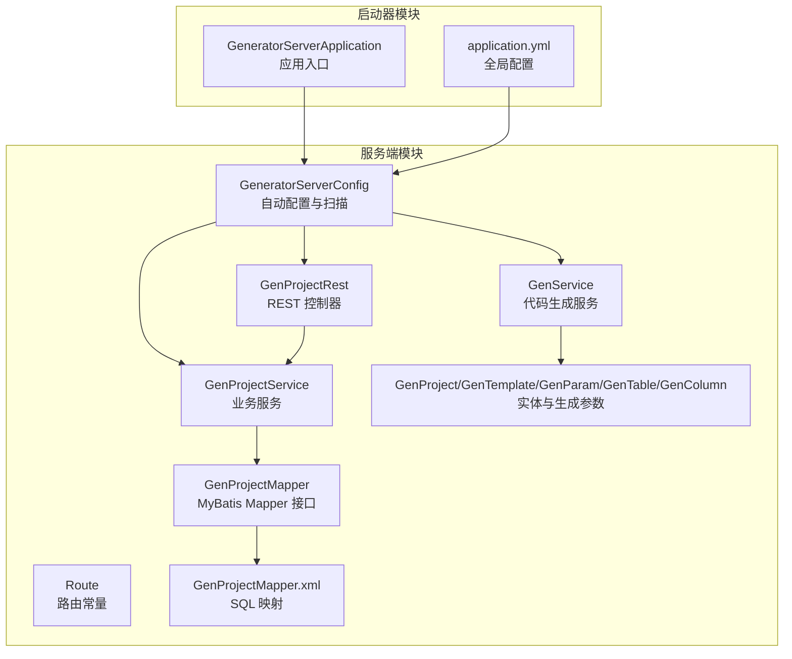
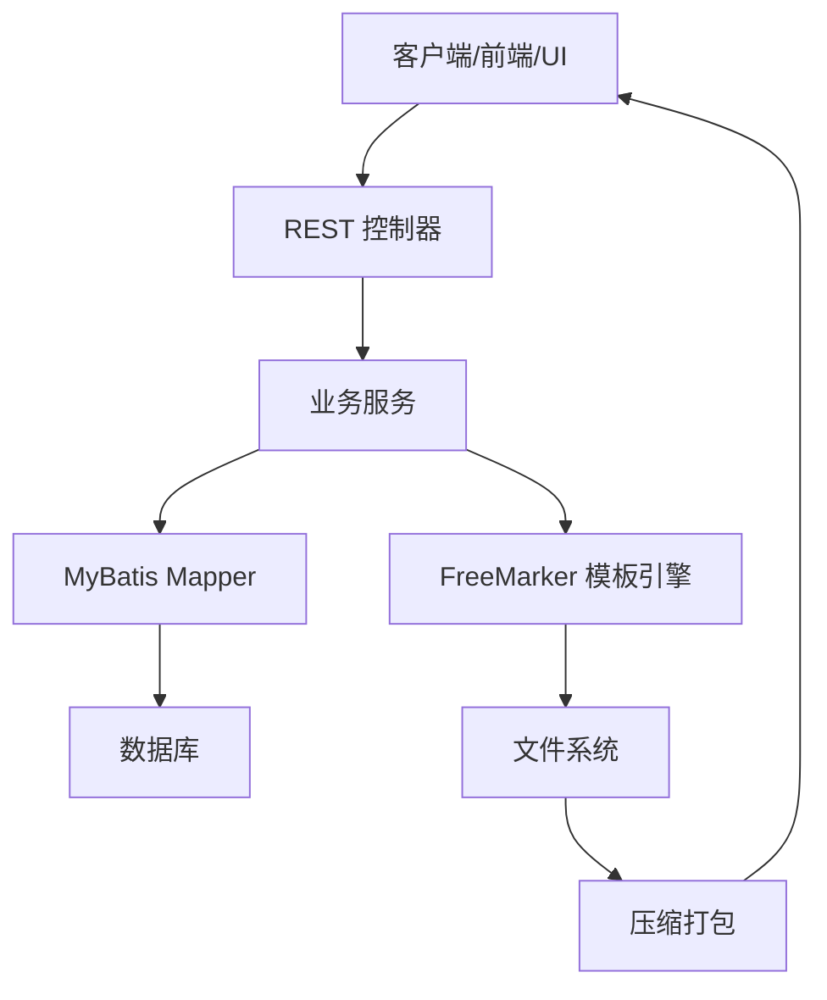
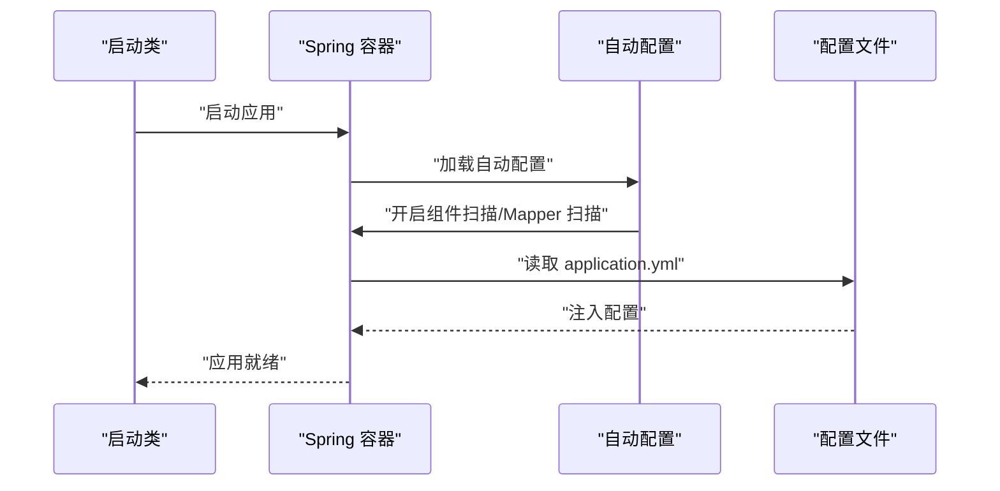
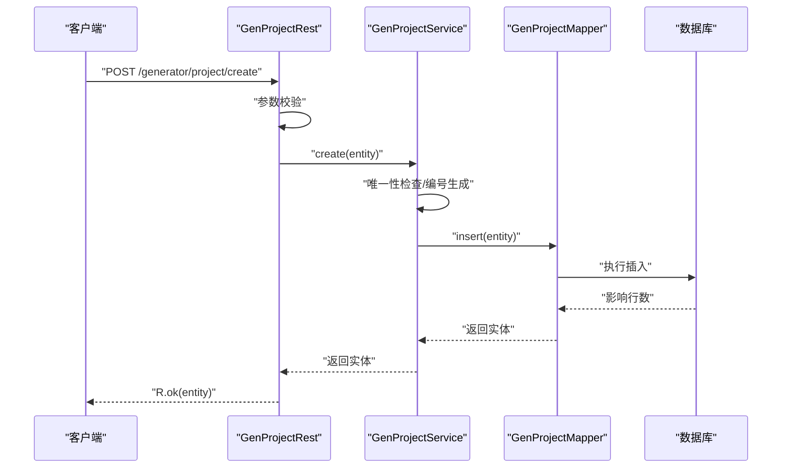
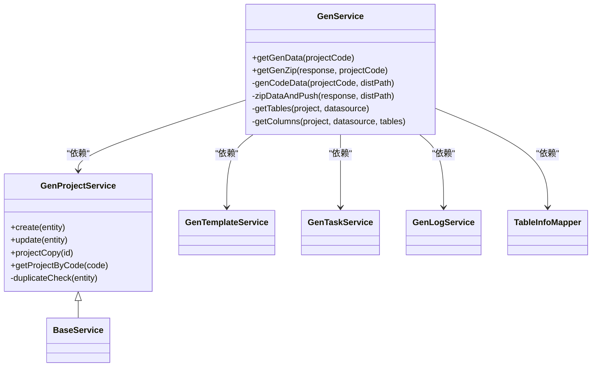
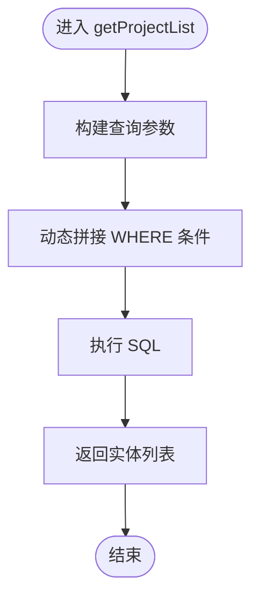
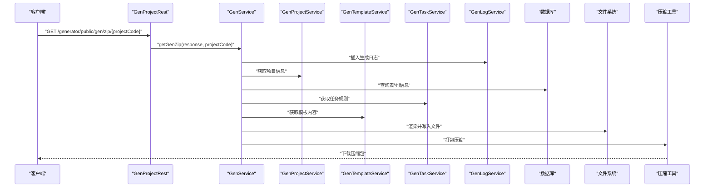
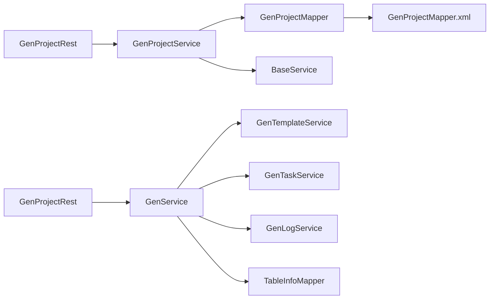

# 后端服务架构

<cite>
**本文引用的文件**
- [GeneratorServerApplication.java](file://generator-server-starter/src/main/java/com/wkclz/generator/server/starter/GeneratorServerApplication.java)
- [application.yml](file://generator-server-starter/src/main/resources/config/application.yml)
- [GeneratorServerConfig.java](file://generator-server/src/main/java/com/wkclz/generator/server/GeneratorServerConfig.java)
- [Route.java](file://generator-server/src/main/java/com/wkclz/generator/server/Route.java)
- [org.springframework.boot.autoconfigure.AutoConfiguration.imports](file://generator-server/src/main/resources/META-INF/spring/org.springframework.boot.autoconfigure.AutoConfiguration.imports)
- [GenService.java](file://generator-server/src/main/java/com/wkclz/generator/server/service/GenService.java)
- [GenProjectRest.java](file://generator-server/src/main/java/com/wkclz/generator/server/rest/GenProjectRest.java)
- [GenProjectService.java](file://generator-server/src/main/java/com/wkclz/generator/server/service/GenProjectService.java)
- [GenProject.java](file://generator-server/src/main/java/com/wkclz/generator/server/bean/entity/GenProject.java)
- [GenTemplate.java](file://generator-server/src/main/java/com/wkclz/generator/server/bean/entity/GenTemplate.java)
- [GenProjectMapper.java](file://generator-server/src/main/java/com/wkclz/generator/server/mapper/GenProjectMapper.java)
- [GenProjectMapper.xml](file://generator-server/src/main/resources/mapper/GenProjectMapper.xml)
- [GenParam.java](file://generator-server/src/main/java/com/wkclz/generator/server/bean/gen/GenParam.java)
- [GenTable.java](file://generator-server/src/main/java/com/wkclz/generator/server/bean/gen/GenTable.java)
- [GenColumn.java](file://generator-server/src/main/java/com/wkclz/generator/server/bean/gen/GenColumn.java)
</cite>

## 目录
1. [引言](#引言)
2. [项目结构](#项目结构)
3. [核心组件](#核心组件)
4. [架构总览](#架构总览)
5. [详细组件分析](#详细组件分析)
6. [依赖关系分析](#依赖关系分析)
7. [性能考虑](#性能考虑)
8. [故障排查指南](#故障排查指南)
9. [结论](#结论)
10. [附录](#附录)

## 引言
本技术文档面向 SH-Generator 后端服务，系统化阐述 Spring Boot 应用的启动与配置机制、服务层设计与业务逻辑、REST API 设计规范与接口文档、数据访问层 MyBatis 配置与数据库操作规范，以及完整的代码生成流程（从数据源连接、模板渲染到文件输出）。文档旨在帮助开发者快速理解系统架构、掌握开发与运维要点，并为后续扩展提供清晰指引。

## 项目结构
后端采用多模块结构：启动器模块负责应用入口与基础配置；服务端模块承载业务域、服务层、数据访问层与资源文件；客户端模块提供 Maven 插件能力；UI 模块提供前端界面。后端服务核心位于 generator-server 及其启动器 generator-server-starter。

- 启动器模块
  - 应用入口类：[GeneratorServerApplication.java](file://generator-server-starter/src/main/java/com/wkclz/generator/server/starter/GeneratorServerApplication.java)
  - 全局配置：[application.yml](file://generator-server-starter/src/main/resources/config/application.yml)
- 服务端模块
  - 自动配置与扫描：[GeneratorServerConfig.java](file://generator-server/src/main/java/com/wkclz/generator/server/GeneratorServerConfig.java)
  - 路由常量：[Route.java](file://generator-server/src/main/java/com/wkclz/generator/server/Route.java)
  - 自动注册：[org.springframework.boot.autoconfigure.AutoConfiguration.imports](file://generator-server/src/main/resources/META-INF/spring/org.springframework.boot.autoconfigure.AutoConfiguration.imports)
  - 服务层与业务：[GenService.java](file://generator-server/src/main/java/com/wkclz/generator/server/service/GenService.java)、[GenProjectService.java](file://generator-server/src/main/java/com/wkclz/generator/server/service/GenProjectService.java)
  - 控制器示例：[GenProjectRest.java](file://generator-server/src/main/java/com/wkclz/generator/server/rest/GenProjectRest.java)
  - 实体与生成参数：[GenProject.java](file://generator-server/src/main/java/com/wkclz/generator/server/bean/entity/GenProject.java)、[GenTemplate.java](file://generator-server/src/main/java/com/wkclz/generator/server/bean/entity/GenTemplate.java)、[GenParam.java](file://generator-server/src/main/java/com/wkclz/generator/server/bean/gen/GenParam.java)、[GenTable.java](file://generator-server/src/main/java/com/wkclz/generator/server/bean/gen/GenTable.java)、[GenColumn.java](file://generator-server/src/main/java/com/wkclz/generator/server/bean/gen/GenColumn.java)
  - 数据访问层：[GenProjectMapper.java](file://generator-server/src/main/java/com/wkclz/generator/server/mapper/GenProjectMapper.java)、[GenProjectMapper.xml](file://generator-server/src/main/resources/mapper/GenProjectMapper.xml)

**图表来源**
- [GeneratorServerApplication.java:1-16](file://generator-server-starter/src/main/java/com/wkclz/generator/server/starter/GeneratorServerApplication.java#L1-L16)
- [application.yml:1-52](file://generator-server-starter/src/main/resources/config/application.yml#L1-L52)
- [GeneratorServerConfig.java:1-14](file://generator-server/src/main/java/com/wkclz/generator/server/GeneratorServerConfig.java#L1-L14)
- [Route.java:1-89](file://generator-server/src/main/java/com/wkclz/generator/server/Route.java#L1-L89)
- [GenProjectRest.java:1-79](file://generator-server/src/main/java/com/wkclz/generator/server/rest/GenProjectRest.java#L1-L79)
- [GenProjectService.java:1-134](file://generator-server/src/main/java/com/wkclz/generator/server/service/GenProjectService.java#L1-L134)
- [GenService.java:1-231](file://generator-server/src/main/java/com/wkclz/generator/server/service/GenService.java#L1-L231)
- [GenProjectMapper.java:1-15](file://generator-server/src/main/java/com/wkclz/generator/server/mapper/GenProjectMapper.java#L1-L15)
- [GenProjectMapper.xml:1-38](file://generator-server/src/main/resources/mapper/GenProjectMapper.xml#L1-L38)
- [GenProject.java:1-108](file://generator-server/src/main/java/com/wkclz/generator/server/bean/entity/GenProject.java#L1-L108)
- [GenTemplate.java:1-108](file://generator-server/src/main/java/com/wkclz/generator/server/bean/entity/GenTemplate.java#L1-L108)
- [GenParam.java:1-33](file://generator-server/src/main/java/com/wkclz/generator/server/bean/gen/GenParam.java#L1-L33)
- [GenTable.java:1-30](file://generator-server/src/main/java/com/wkclz/generator/server/bean/gen/GenTable.java#L1-L30)
- [GenColumn.java:1-39](file://generator-server/src/main/java/com/wkclz/generator/server/bean/gen/GenColumn.java#L1-L39)

**章节来源**
- [GeneratorServerApplication.java:1-16](file://generator-server-starter/src/main/java/com/wkclz/generator/server/starter/GeneratorServerApplication.java#L1-L16)
- [application.yml:1-52](file://generator-server-starter/src/main/resources/config/application.yml#L1-L52)
- [GeneratorServerConfig.java:1-14](file://generator-server/src/main/java/com/wkclz/generator/server/GeneratorServerConfig.java#L1-L14)
- [Route.java:1-89](file://generator-server/src/main/java/com/wkclz/generator/server/Route.java#L1-L89)

## 核心组件
- 应用入口与自动配置
  - 启动类负责引导 Spring Boot 应用启动。
  - 自动配置类启用组件扫描与 Mapper 扫描，确保服务与数据访问层被正确装配。
- 路由常量
  - 统一路由前缀与各模块接口路径，便于集中管理与维护。
- REST 控制器
  - 示例控制器提供项目 CRUD 与复制等接口，统一返回包装结构。
- 服务层
  - 业务服务封装数据校验、唯一性检查与关联数据处理。
  - 代码生成服务负责数据采集、模板渲染与产物打包。
- 数据访问层
  - Mapper 接口与 XML 映射文件分离职责，支持动态 SQL 与分页查询。
- 实体与生成参数
  - 实体定义字段约束与拷贝工具方法；生成参数封装表结构、列集合与包路径等。

**章节来源**
- [GenProjectRest.java:1-79](file://generator-server/src/main/java/com/wkclz/generator/server/rest/GenProjectRest.java#L1-L79)
- [GenProjectService.java:1-134](file://generator-server/src/main/java/com/wkclz/generator/server/service/GenProjectService.java#L1-L134)
- [GenService.java:1-231](file://generator-server/src/main/java/com/wkclz/generator/server/service/GenService.java#L1-L231)
- [GenProjectMapper.java:1-15](file://generator-server/src/main/java/com/wkclz/generator/server/mapper/GenProjectMapper.java#L1-L15)
- [GenProjectMapper.xml:1-38](file://generator-server/src/main/resources/mapper/GenProjectMapper.xml#L1-L38)
- [GenProject.java:1-108](file://generator-server/src/main/java/com/wkclz/generator/server/bean/entity/GenProject.java#L1-L108)
- [GenTemplate.java:1-108](file://generator-server/src/main/java/com/wkclz/generator/server/bean/entity/GenTemplate.java#L1-L108)
- [GenParam.java:1-33](file://generator-server/src/main/java/com/wkclz/generator/server/bean/gen/GenParam.java#L1-L33)
- [GenTable.java:1-30](file://generator-server/src/main/java/com/wkclz/generator/server/bean/gen/GenTable.java#L1-L30)
- [GenColumn.java:1-39](file://generator-server/src/main/java/com/wkclz/generator/server/bean/gen/GenColumn.java#L1-L39)

## 架构总览
后端采用“控制器-服务-数据访问-模板引擎”的分层架构。控制器接收请求并进行参数校验，服务层完成业务编排与数据处理，数据访问层通过 MyBatis 进行数据库交互，模板引擎负责将参数渲染为代码文件，最终打包下载。

**图表来源**
- [GenProjectRest.java:1-79](file://generator-server/src/main/java/com/wkclz/generator/server/rest/GenProjectRest.java#L1-L79)
- [GenProjectService.java:1-134](file://generator-server/src/main/java/com/wkclz/generator/server/service/GenProjectService.java#L1-L134)
- [GenService.java:1-231](file://generator-server/src/main/java/com/wkclz/generator/server/service/GenService.java#L1-L231)
- [GenProjectMapper.java:1-15](file://generator-server/src/main/java/com/wkclz/generator/server/mapper/GenProjectMapper.java#L1-L15)
- [GenProjectMapper.xml:1-38](file://generator-server/src/main/resources/mapper/GenProjectMapper.xml#L1-L38)

## 详细组件分析

### 启动流程与配置机制
- 启动类
  - 应用入口类使用标准 Spring Boot 注解，通过静态主方法启动应用。
- 自动配置
  - 自动配置类启用组件扫描与 Mapper 扫描，确保服务与数据访问层被纳入容器。
  - 自动注册文件声明加载该自动配置类，保证运行时生效。
- 全局配置
  - 端口、数据源驱动、Jackson 默认属性、MyBatis 映射位置、分页插件与 Actuator 监控端点等集中配置。

**图表来源**
- [GeneratorServerApplication.java:1-16](file://generator-server-starter/src/main/java/com/wkclz/generator/server/starter/GeneratorServerApplication.java#L1-L16)
- [GeneratorServerConfig.java:1-14](file://generator-server/src/main/java/com/wkclz/generator/server/GeneratorServerConfig.java#L1-L14)
- [org.springframework.boot.autoconfigure.AutoConfiguration.imports:1-2](file://generator-server/src/main/resources/META-INF/spring/org.springframework.boot.autoconfigure.AutoConfiguration.imports#L1-L2)
- [application.yml:1-52](file://generator-server-starter/src/main/resources/config/application.yml#L1-L52)

**章节来源**
- [GeneratorServerApplication.java:1-16](file://generator-server-starter/src/main/java/com/wkclz/generator/server/starter/GeneratorServerApplication.java#L1-L16)
- [GeneratorServerConfig.java:1-14](file://generator-server/src/main/java/com/wkclz/generator/server/GeneratorServerConfig.java#L1-L14)
- [org.springframework.boot.autoconfigure.AutoConfiguration.imports:1-2](file://generator-server/src/main/resources/META-INF/spring/org.springframework.boot.autoconfigure.AutoConfiguration.imports#L1-L2)
- [application.yml:1-52](file://generator-server-starter/src/main/resources/config/application.yml#L1-L52)

### REST API 设计规范与接口文档
- 路由前缀与模块划分
  - 统一前缀与模块常量，便于接口聚合与版本演进。
- 返回约定
  - 统一使用包装结果结构，包含业务状态与数据载体。
- 参数校验
  - 控制器侧进行必填项与 ID 校验，服务层补充业务规则校验。
- 接口示例（项目模块）
  - GET /generator/project/page：分页查询
  - GET /generator/project/detail：详情查询
  - POST /generator/project/create：新增
  - POST /generator/project/update：修改
  - POST /generator/project/remove：删除
  - POST /generator/project/copy：复制

**图表来源**
- [GenProjectRest.java:1-79](file://generator-server/src/main/java/com/wkclz/generator/server/rest/GenProjectRest.java#L1-L79)
- [GenProjectService.java:1-134](file://generator-server/src/main/java/com/wkclz/generator/server/service/GenProjectService.java#L1-L134)
- [GenProjectMapper.java:1-15](file://generator-server/src/main/java/com/wkclz/generator/server/mapper/GenProjectMapper.java#L1-L15)
- [GenProjectMapper.xml:1-38](file://generator-server/src/main/resources/mapper/GenProjectMapper.xml#L1-L38)

**章节来源**
- [Route.java:1-89](file://generator-server/src/main/java/com/wkclz/generator/server/Route.java#L1-L89)
- [GenProjectRest.java:1-79](file://generator-server/src/main/java/com/wkclz/generator/server/rest/GenProjectRest.java#L1-L79)
- [GenProjectService.java:1-134](file://generator-server/src/main/java/com/wkclz/generator/server/service/GenProjectService.java#L1-L134)

### 服务层设计模式与业务逻辑
- 通用基类与分页
  - 业务服务继承通用基类，复用分页查询与通用 CRUD 方法。
- 业务编排
  - 在新增/更新/复制等场景中，进行唯一性校验、编号生成与关联数据迁移。
- 代码生成服务
  - 采集项目、数据源、表与列信息，结合任务规则与模板内容，按包路径生成文件并打包下载。

**图表来源**
- [GenProjectService.java:1-134](file://generator-server/src/main/java/com/wkclz/generator/server/service/GenProjectService.java#L1-L134)
- [GenService.java:1-231](file://generator-server/src/main/java/com/wkclz/generator/server/service/GenService.java#L1-L231)

**章节来源**
- [GenProjectService.java:1-134](file://generator-server/src/main/java/com/wkclz/generator/server/service/GenProjectService.java#L1-L134)
- [GenService.java:1-231](file://generator-server/src/main/java/com/wkclz/generator/server/service/GenService.java#L1-L231)

### 数据访问层 MyBatis 配置与数据库操作规范
- 配置要点
  - Mapper 扫描路径、驼峰映射、分页插件方言与参数等集中于配置文件。
- Mapper 接口与 XML
  - 接口定义方法签名，XML 中编写 SQL 与动态条件，实现解耦与可维护性。
- 动态 SQL
  - 使用条件标签拼接查询条件，支持模糊匹配与排序组合。
- 分页查询
  - 通过通用分页查询工具与分页插件实现分页能力。

**图表来源**
- [GenProjectMapper.xml:1-38](file://generator-server/src/main/resources/mapper/GenProjectMapper.xml#L1-L38)

**章节来源**
- [application.yml:1-52](file://generator-server-starter/src/main/resources/config/application.yml#L1-L52)
- [GenProjectMapper.java:1-15](file://generator-server/src/main/java/com/wkclz/generator/server/mapper/GenProjectMapper.java#L1-L15)
- [GenProjectMapper.xml:1-38](file://generator-server/src/main/resources/mapper/GenProjectMapper.xml#L1-L38)

### 代码生成流程详解
- 流程概览
  - 获取项目与数据源 → 采集表与列 → 生成参数模型 → 加载模板 → 渲染输出 → 打包下载。
- 关键步骤
  - 生成参数：根据项目与任务规则，组装表结构、列集合与包路径。
  - 模板渲染：使用模板引擎将参数映射到模板内容，生成目标文件。
  - 文件输出：写入文件系统，按包路径组织目录。
  - 压缩下载：将临时目录打包为压缩包并返回给客户端。

**图表来源**
- [GenProjectRest.java:1-79](file://generator-server/src/main/java/com/wkclz/generator/server/rest/GenProjectRest.java#L1-L79)
- [GenService.java:1-231](file://generator-server/src/main/java/com/wkclz/generator/server/service/GenService.java#L1-L231)
- [GenProjectService.java:1-134](file://generator-server/src/main/java/com/wkclz/generator/server/service/GenProjectService.java#L1-L134)
- [GenProjectMapper.java:1-15](file://generator-server/src/main/java/com/wkclz/generator/server/mapper/GenProjectMapper.java#L1-L15)
- [GenProjectMapper.xml:1-38](file://generator-server/src/main/resources/mapper/GenProjectMapper.xml#L1-L38)

**章节来源**
- [GenService.java:1-231](file://generator-server/src/main/java/com/wkclz/generator/server/service/GenService.java#L1-L231)
- [GenParam.java:1-33](file://generator-server/src/main/java/com/wkclz/generator/server/bean/gen/GenParam.java#L1-L33)
- [GenTable.java:1-30](file://generator-server/src/main/java/com/wkclz/generator/server/bean/gen/GenTable.java#L1-L30)
- [GenColumn.java:1-39](file://generator-server/src/main/java/com/wkclz/generator/server/bean/gen/GenColumn.java#L1-L39)

## 依赖关系分析
- 组件耦合
  - 控制器依赖服务层；服务层依赖 Mapper 与第三方工具；代码生成服务依赖多个业务服务与模板引擎。
- 外部依赖
  - MyBatis、分页插件、模板引擎、压缩工具等作为运行期依赖。
- 自动装配
  - 通过自动配置类与注册文件，确保组件扫描与 Mapper 扫描生效。

**图表来源**
- [GenProjectRest.java:1-79](file://generator-server/src/main/java/com/wkclz/generator/server/rest/GenProjectRest.java#L1-L79)
- [GenProjectService.java:1-134](file://generator-server/src/main/java/com/wkclz/generator/server/service/GenProjectService.java#L1-L134)
- [GenProjectMapper.java:1-15](file://generator-server/src/main/java/com/wkclz/generator/server/mapper/GenProjectMapper.java#L1-L15)
- [GenProjectMapper.xml:1-38](file://generator-server/src/main/resources/mapper/GenProjectMapper.xml#L1-L38)
- [GenService.java:1-231](file://generator-server/src/main/java/com/wkclz/generator/server/service/GenService.java#L1-L231)

**章节来源**
- [GenProjectRest.java:1-79](file://generator-server/src/main/java/com/wkclz/generator/server/rest/GenProjectRest.java#L1-L79)
- [GenProjectService.java:1-134](file://generator-server/src/main/java/com/wkclz/generator/server/service/GenProjectService.java#L1-L134)
- [GenProjectMapper.java:1-15](file://generator-server/src/main/java/com/wkclz/generator/server/mapper/GenProjectMapper.java#L1-L15)
- [GenProjectMapper.xml:1-38](file://generator-server/src/main/resources/mapper/GenProjectMapper.xml#L1-L38)
- [GenService.java:1-231](file://generator-server/src/main/java/com/wkclz/generator/server/service/GenService.java#L1-L231)

## 性能考虑
- 数据访问优化
  - 合理使用索引与条件过滤，避免全表扫描；对高频查询建立复合索引。
  - 分页查询配合分页插件，限制单页数量，避免超大数据集一次性返回。
- 代码生成优化
  - 批量读取表与列信息，减少数据库往返；模板渲染尽量避免复杂计算。
  - 生成文件写入采用流式输出，及时 flush 并关闭资源，降低内存占用。
- 缓存与并发
  - 对只读配置与模板内容可引入缓存；注意并发写入与压缩包清理策略。
- 监控与可观测性
  - 开启 Actuator 端点，监控健康状态与指标，定位性能瓶颈。

## 故障排查指南
- 启动失败
  - 检查自动配置是否生效与组件扫描范围；确认配置文件路径与格式。
- 数据访问异常
  - 核对 Mapper 扫描路径与命名空间；检查 SQL 语法与参数绑定。
- 代码生成异常
  - 检查模板内容与参数映射；关注文件写入权限与磁盘空间；查看日志定位具体文件。
- 接口返回异常
  - 核对控制器参数校验与服务层业务校验；确认返回包装结构与状态码。

**章节来源**
- [application.yml:1-52](file://generator-server-starter/src/main/resources/config/application.yml#L1-L52)
- [GenProjectMapper.xml:1-38](file://generator-server/src/main/resources/mapper/GenProjectMapper.xml#L1-L38)
- [GenService.java:1-231](file://generator-server/src/main/java/com/wkclz/generator/server/service/GenService.java#L1-L231)
- [GenProjectRest.java:1-79](file://generator-server/src/main/java/com/wkclz/generator/server/rest/GenProjectRest.java#L1-L79)

## 结论
本后端服务以 Spring Boot 为基础，结合 MyBatis 与模板引擎，实现了从数据源采集到代码生成与打包下载的完整链路。通过清晰的分层设计、统一的路由与返回规范、完善的业务校验与异常处理，系统具备良好的可维护性与扩展性。建议在生产环境中进一步完善缓存策略、监控告警与安全加固，持续提升稳定性与性能表现。

## 附录
- 路由常量一览
  - 数据源：分页、详情、新增、修改、删除、选项
  - 模板：分页、详情、新增、修改、删除、选项
  - 项目：分页、详情、新增、修改、删除、复制
  - 任务：列表、保存、删除
  - 日志：分页、详情
  - 代码生成：模型数据、压缩包、生成规则
- 实体字段说明
  - 项目实体包含项目编码、用户编码、数据库编码、表前缀、模块名、项目名称与描述等。
  - 模板实体包含模板编码、模板键、模板名称、文件后缀、描述与模板内容等。
- 生成参数模型
  - 包含包路径映射、表结构、全量列、业务列、列表列、查询列、新增列与更新列等。

**章节来源**
- [Route.java:1-89](file://generator-server/src/main/java/com/wkclz/generator/server/Route.java#L1-L89)
- [GenProject.java:1-108](file://generator-server/src/main/java/com/wkclz/generator/server/bean/entity/GenProject.java#L1-L108)
- [GenTemplate.java:1-108](file://generator-server/src/main/java/com/wkclz/generator/server/bean/entity/GenTemplate.java#L1-L108)
- [GenParam.java:1-33](file://generator-server/src/main/java/com/wkclz/generator/server/bean/gen/GenParam.java#L1-L33)
- [GenTable.java:1-30](file://generator-server/src/main/java/com/wkclz/generator/server/bean/gen/GenTable.java#L1-L30)
- [GenColumn.java:1-39](file://generator-server/src/main/java/com/wkclz/generator/server/bean/gen/GenColumn.java#L1-L39)