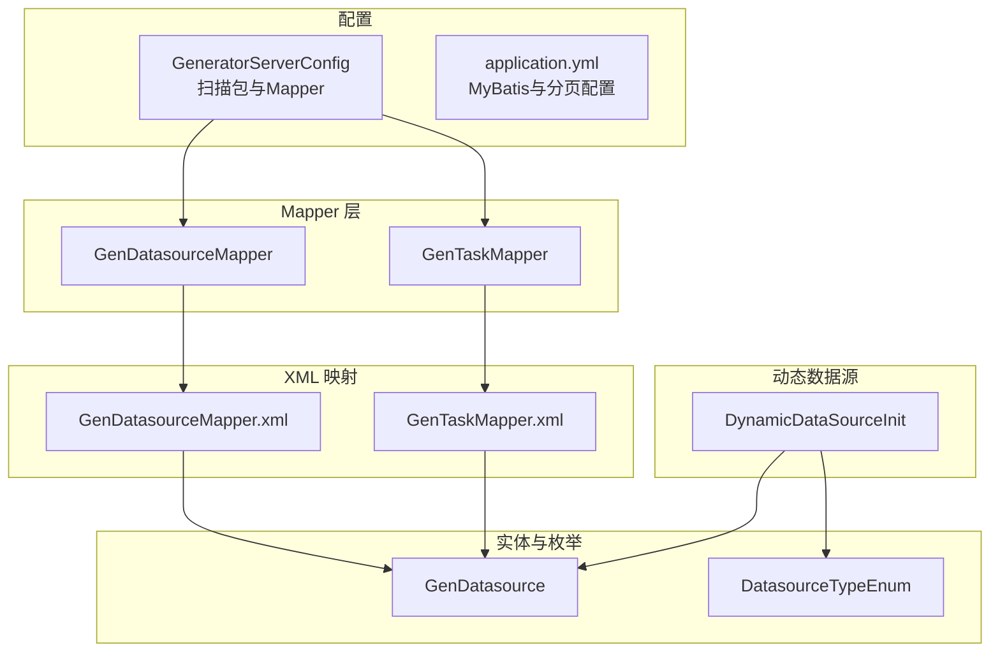
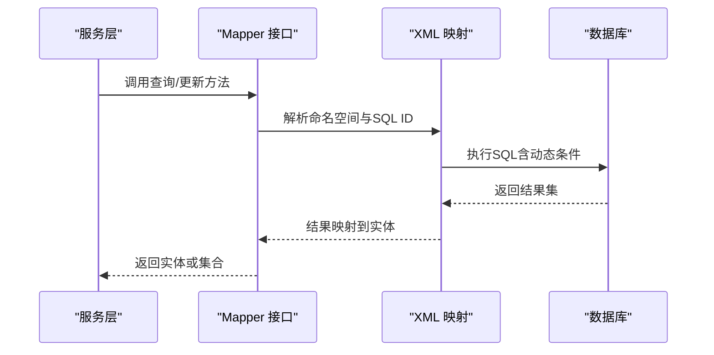
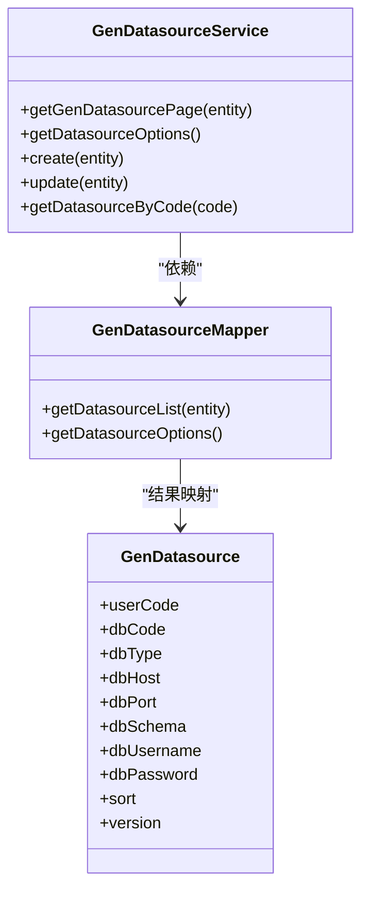
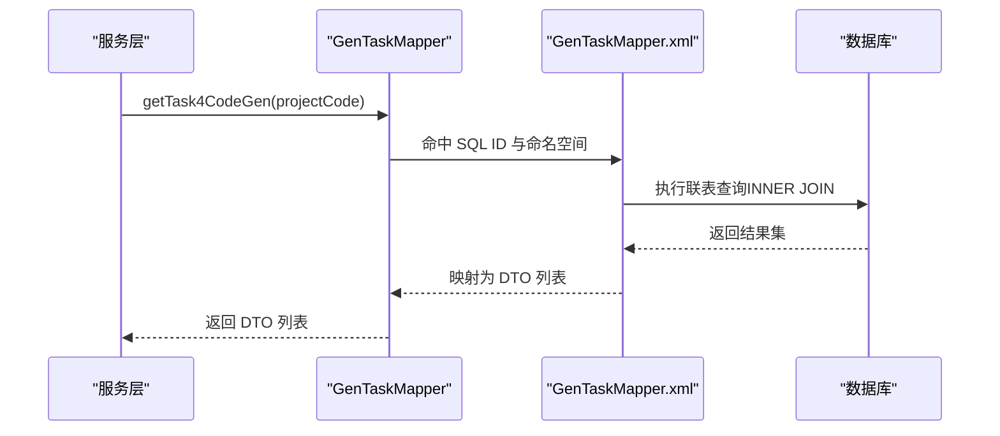
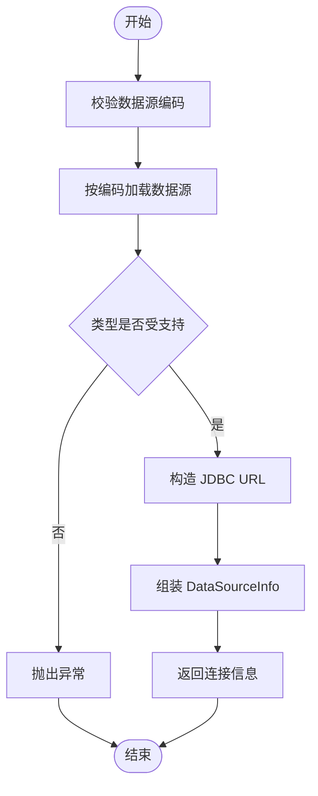
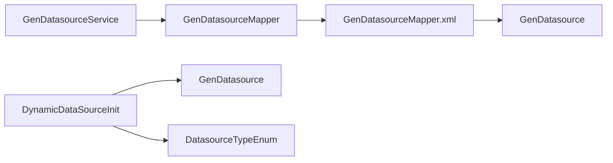

# 数据访问层

<cite>
**本文引用的文件**
- [GenDatasourceMapper.java](file://generator-server/src/main/java/com/wkclz/generator/server/mapper/GenDatasourceMapper.java)
- [GenDatasourceMapper.xml](file://generator-server/src/main/resources/mapper/GenDatasourceMapper.xml)
- [GenDatasourceService.java](file://generator-server/src/main/java/com/wkclz/generator/server/service/GenDatasourceService.java)
- [GenDatasource.java](file://generator-server/src/main/java/com/wkclz/generator/server/bean/entity/GenDatasource.java)
- [GenTaskMapper.java](file://generator-server/src/main/java/com/wkclz/generator/server/mapper/GenTaskMapper.java)
- [GenTaskMapper.xml](file://generator-server/src/main/resources/mapper/GenTaskMapper.xml)
- [GeneratorServerConfig.java](file://generator-server/src/main/java/com/wkclz/generator/server/GeneratorServerConfig.java)
- [application.yml](file://generator-server-starter/src/main/resources/config/application.yml)
- [DynamicDataSourceInit.java](file://generator-server/src/main/java/com/wkclz/generator/server/helper/DynamicDataSourceInit.java)
- [DatasourceTypeEnum.java](file://generator-server/src/main/java/com/wkclz/generator/server/bean/enums/DatasourceTypeEnum.java)
- [GenDatasourceRest.java](file://generator-server/src/main/java/com/wkclz/generator/server/rest/GenDatasourceRest.java)
</cite>

## 目录
1. [简介](#简介)
2. [项目结构](#项目结构)
3. [核心组件](#核心组件)
4. [架构总览](#架构总览)
5. [详细组件分析](#详细组件分析)
6. [依赖分析](#依赖分析)
7. [性能考虑](#性能考虑)
8. [故障排查指南](#故障排查指南)
9. [结论](#结论)
10. [附录](#附录)

## 简介
本文件面向 SH-Generator 的数据访问层（DAO），系统性梳理 MyBatis 在本项目中的配置与使用方式，涵盖 Mapper 接口设计、XML 映射文件结构、动态 SQL 编写、CRUD 实现与性能优化策略；同时解析复杂查询、联表操作与条件筛选逻辑，说明事务管理机制（基于 Spring 声明式事务）、最佳实践（懒加载、二级缓存、批量操作）及具体查询示例与调优建议。

## 项目结构
数据访问层主要由以下部分组成：
- 配置层：Spring Boot 自动装配与 MyBatis 扫描配置
- Mapper 接口层：定义数据访问契约，继承通用基类以获得常用 CRUD 能力
- XML 映射层：定义 SQL 语句、动态条件与结果映射
- 实体与枚举：承载字段元信息与业务枚举
- 动态数据源：按需构建目标数据源连接信息
- 服务层：封装分页、校验与业务流程

图表来源
- [GeneratorServerConfig.java:1-14](file://generator-server/src/main/java/com/wkclz/generator/server/GeneratorServerConfig.java#L1-L14)
- [application.yml:14-26](file://generator-server-starter/src/main/resources/config/application.yml#L14-L26)
- [GenDatasourceMapper.java:1-17](file://generator-server/src/main/java/com/wkclz/generator/server/mapper/GenDatasourceMapper.java#L1-L17)
- [GenTaskMapper.java:1-20](file://generator-server/src/main/java/com/wkclz/generator/server/mapper/GenTaskMapper.java#L1-L20)
- [GenDatasourceMapper.xml:1-59](file://generator-server/src/main/resources/mapper/GenDatasourceMapper.xml#L1-L59)
- [GenTaskMapper.xml:1-62](file://generator-server/src/main/resources/mapper/GenTaskMapper.xml#L1-L62)
- [GenDatasource.java:1-116](file://generator-server/src/main/java/com/wkclz/generator/server/bean/entity/GenDatasource.java#L1-L116)
- [DatasourceTypeEnum.java:1-56](file://generator-server/src/main/java/com/wkclz/generator/server/bean/enums/DatasourceTypeEnum.java#L1-L56)
- [DynamicDataSourceInit.java:1-60](file://generator-server/src/main/java/com/wkclz/generator/server/helper/DynamicDataSourceInit.java#L1-L60)

章节来源
- [GeneratorServerConfig.java:1-14](file://generator-server/src/main/java/com/wkclz/generator/server/GeneratorServerConfig.java#L1-L14)
- [application.yml:14-26](file://generator-server-starter/src/main/resources/config/application.yml#L14-L26)

## 核心组件
- Mapper 接口：定义数据访问方法，继承通用基类以复用增删改查能力，并提供自定义查询（如分页列表、选项列表、联表查询等）
- XML 映射：通过命名空间绑定接口，使用动态 SQL 构建条件查询、排序与联表
- 服务层：封装分页查询、参数校验、乐观锁版本控制与业务流程
- 实体类：承载字段与注解，用于字段描述与属性拷贝
- 动态数据源：根据数据源编码动态构造连接信息，支持 MySQL/MariaDB 类型

章节来源
- [GenDatasourceMapper.java:1-17](file://generator-server/src/main/java/com/wkclz/generator/server/mapper/GenDatasourceMapper.java#L1-L17)
- [GenTaskMapper.java:1-20](file://generator-server/src/main/java/com/wkclz/generator/server/mapper/GenTaskMapper.java#L1-L20)
- [GenDatasourceMapper.xml:1-59](file://generator-server/src/main/resources/mapper/GenDatasourceMapper.xml#L1-L59)
- [GenTaskMapper.xml:1-62](file://generator-server/src/main/resources/mapper/GenTaskMapper.xml#L1-L62)
- [GenDatasourceService.java:1-59](file://generator-server/src/main/java/com/wkclz/generator/server/service/GenDatasourceService.java#L1-L59)
- [GenDatasource.java:1-116](file://generator-server/src/main/java/com/wkclz/generator/server/bean/entity/GenDatasource.java#L1-L116)
- [DynamicDataSourceInit.java:1-60](file://generator-server/src/main/java/com/wkclz/generator/server/helper/DynamicDataSourceInit.java#L1-L60)

## 架构总览
数据访问层采用“接口 + XML 映射”的 MyBatis 模式，结合 Spring 组件扫描与自动配置完成初始化。服务层通过注入 Mapper 完成数据读写，动态数据源工厂在运行时按数据源编码解析并构造连接信息。

图表来源
- [GenDatasourceMapper.java:1-17](file://generator-server/src/main/java/com/wkclz/generator/server/mapper/GenDatasourceMapper.java#L1-L17)
- [GenDatasourceMapper.xml:1-59](file://generator-server/src/main/resources/mapper/GenDatasourceMapper.xml#L1-L59)
- [GenTaskMapper.java:1-20](file://generator-server/src/main/java/com/wkclz/generator/server/mapper/GenTaskMapper.java#L1-L20)
- [GenTaskMapper.xml:1-62](file://generator-server/src/main/resources/mapper/GenTaskMapper.xml#L1-L62)

## 详细组件分析

### GenDatasource 数据访问组件
- 设计原则与命名规范
  - Mapper 接口以“实体名 + Mapper”命名，方法名遵循“动词 + 实体名”或“动词 + 场景”，如 getDatasourceList、getDatasourceOptions
  - XML 中 id 与接口方法一一对应，命名保持一致
  - 使用动态 SQL 条件拼接，避免全量字段硬编码
- CRUD 实现要点
  - 基础 CRUD：继承通用基类后可直接使用 insert、updateById、deleteById、selectById、selectOneByEntity 等
  - 查询扩展：提供分页列表与选项列表查询，分别用于列表展示与下拉选择
  - 版本控制：更新时对非空字段进行选择性更新，结合版本号进行并发保护
- 复杂查询与条件筛选
  - 支持多字段模糊匹配与精确匹配组合
  - 支持排序规则（如 sort 升序、id 降序）
- 性能优化建议
  - 仅查询必要字段，避免 SELECT *
  - 对高频过滤字段建立索引
  - 控制分页大小，避免一次性返回过多记录

图表来源
- [GenDatasourceMapper.java:1-17](file://generator-server/src/main/java/com/wkclz/generator/server/mapper/GenDatasourceMapper.java#L1-L17)
- [GenDatasourceService.java:1-59](file://generator-server/src/main/java/com/wkclz/generator/server/service/GenDatasourceService.java#L1-L59)
- [GenDatasource.java:1-116](file://generator-server/src/main/java/com/wkclz/generator/server/bean/entity/GenDatasource.java#L1-L116)

章节来源
- [GenDatasourceMapper.java:1-17](file://generator-server/src/main/java/com/wkclz/generator/server/mapper/GenDatasourceMapper.java#L1-L17)
- [GenDatasourceMapper.xml:5-34](file://generator-server/src/main/resources/mapper/GenDatasourceMapper.xml#L5-L34)
- [GenDatasourceService.java:19-54](file://generator-server/src/main/java/com/wkclz/generator/server/service/GenDatasourceService.java#L19-L54)
- [GenDatasource.java:24-67](file://generator-server/src/main/java/com/wkclz/generator/server/bean/entity/GenDatasource.java#L24-L67)

### GenTask 数据访问组件
- 设计原则与命名规范
  - 提供任务列表查询与代码生成专用的联表查询
  - DTO 与 Entity 分离，避免跨模块污染
- 联表查询与条件筛选
  - INNER JOIN 连接模板表，按项目编码过滤
  - 支持用户编码、项目编码、模板编码、任务名模糊匹配
- 性能优化建议
  - 仅投影需要字段，减少网络与内存开销
  - 对频繁过滤字段建立复合索引
  - 控制联表查询返回行数，配合分页

图表来源
- [GenTaskMapper.java:16](file://generator-server/src/main/java/com/wkclz/generator/server/mapper/GenTaskMapper.java#L16)
- [GenTaskMapper.xml:38-58](file://generator-server/src/main/resources/mapper/GenTaskMapper.xml#L38-L58)

章节来源
- [GenTaskMapper.java:14-16](file://generator-server/src/main/java/com/wkclz/generator/server/mapper/GenTaskMapper.java#L14-L16)
- [GenTaskMapper.xml:5-35](file://generator-server/src/main/resources/mapper/GenTaskMapper.xml#L5-L35)
- [GenTaskMapper.xml:38-58](file://generator-server/src/main/resources/mapper/GenTaskMapper.xml#L38-L58)

### 动态数据源与事务管理
- 动态数据源
  - 通过实现动态数据源工厂接口，按数据源编码获取连接信息
  - 校验数据库类型，限定支持范围（MySQL/MariaDB）
  - 构造 JDBC URL、用户名与密码，返回 DataSourceInfo
- 事务管理
  - 本项目未显式声明事务注解，但服务层使用 Spring 管理，默认采用声明式事务
  - 建议在服务层对写操作（新增、修改、删除）使用 @Transactional，明确传播行为与异常回滚策略

图表来源
- [DynamicDataSourceInit.java:24-57](file://generator-server/src/main/java/com/wkclz/generator/server/helper/DynamicDataSourceInit.java#L24-L57)
- [DatasourceTypeEnum.java:15-19](file://generator-server/src/main/java/com/wkclz/generator/server/bean/enums/DatasourceTypeEnum.java#L15-L19)

章节来源
- [DynamicDataSourceInit.java:1-60](file://generator-server/src/main/java/com/wkclz/generator/server/helper/DynamicDataSourceInit.java#L1-L60)
- [DatasourceTypeEnum.java:1-56](file://generator-server/src/main/java/com/wkclz/generator/server/bean/enums/DatasourceTypeEnum.java#L1-L56)

## 依赖分析
- 组件耦合
  - 服务层依赖 Mapper 接口，Mapper 依赖 XML 映射
  - 动态数据源依赖实体与枚举进行类型校验
- 外部依赖
  - MyBatis：Mapper 扫描、XML 映射、分页插件
  - Spring：组件扫描、事务管理、自动配置
- 可能的循环依赖
  - 当前结构清晰，未见循环依赖迹象

图表来源
- [GenDatasourceService.java:17](file://generator-server/src/main/java/com/wkclz/generator/server/service/GenDatasourceService.java#L17)
- [GenDatasourceMapper.java:10](file://generator-server/src/main/java/com/wkclz/generator/server/mapper/GenDatasourceMapper.java#L10)
- [GenDatasourceMapper.xml:3](file://generator-server/src/main/resources/mapper/GenDatasourceMapper.xml#L3)
- [GenDatasource.java:19](file://generator-server/src/main/java/com/wkclz/generator/server/bean/entity/GenDatasource.java#L19)
- [DynamicDataSourceInit.java:19-20](file://generator-server/src/main/java/com/wkclz/generator/server/helper/DynamicDataSourceInit.java#L19-L20)
- [DatasourceTypeEnum.java:13-24](file://generator-server/src/main/java/com/wkclz/generator/server/bean/enums/DatasourceTypeEnum.java#L13-L24)

章节来源
- [GenDatasourceService.java:1-59](file://generator-server/src/main/java/com/wkclz/generator/server/service/GenDatasourceService.java#L1-L59)
- [GenDatasourceMapper.java:1-17](file://generator-server/src/main/java/com/wkclz/generator/server/mapper/GenDatasourceMapper.java#L1-L17)
- [GenDatasourceMapper.xml:1-59](file://generator-server/src/main/resources/mapper/GenDatasourceMapper.xml#L1-L59)
- [GenDatasource.java:1-116](file://generator-server/src/main/java/com/wkclz/generator/server/bean/entity/GenDatasource.java#L1-L116)
- [DynamicDataSourceInit.java:1-60](file://generator-server/src/main/java/com/wkclz/generator/server/helper/DynamicDataSourceInit.java#L1-L60)
- [DatasourceTypeEnum.java:1-56](file://generator-server/src/main/java/com/wkclz/generator/server/bean/enums/DatasourceTypeEnum.java#L1-L56)

## 性能考虑
- 字段选择与映射
  - 仅查询必要字段，避免 SELECT *，降低网络与反序列化成本
  - 开启驼峰映射，减少字段命名不一致带来的映射开销
- 动态 SQL 与索引
  - 将高频过滤条件（如编码、名称、用户编码）建立索引
  - 避免在 WHERE 子句中对字段进行函数运算，导致索引失效
- 分页与排序
  - 使用分页插件限制单页数量，避免大结果集
  - 对排序字段建立合适索引，避免文件排序
- 批量操作
  - 写操作尽量合并为批处理，减少往返次数
  - 使用 JDBC 批处理或 MyBatis 批执行器（视框架版本而定）
- 缓存策略
  - 一级缓存：默认开启，按 SqlSession 生命周期管理
  - 二级缓存：按 Mapper 命名空间启用，适用于只读或低频更新场景
  - 懒加载：对关联对象启用延迟加载，减少不必要的 JOIN
- 连接池与超时
  - 合理设置连接池大小与超时时间，避免资源争用
  - 对长查询设置超时，防止阻塞

## 故障排查指南
- 参数校验与异常
  - 更新时对主键与版本号进行非空校验，避免并发冲突
  - 新增/更新时对必填字段进行校验，确保数据完整性
- 数据源类型校验
  - 动态数据源工厂对数据库类型进行白名单校验，不支持的类型直接抛错
- 日志与监控
  - 可选开启 MyBatis 日志输出，定位慢 SQL
  - 关注分页参数传递与 SQL 生成情况，避免误传导致全表扫描

章节来源
- [GenDatasourceService.java:33-39](file://generator-server/src/main/java/com/wkclz/generator/server/service/GenDatasourceService.java#L33-L39)
- [GenDatasourceRest.java:73-81](file://generator-server/src/main/java/com/wkclz/generator/server/rest/GenDatasourceRest.java#L73-L81)
- [DynamicDataSourceInit.java:34-40](file://generator-server/src/main/java/com/wkclz/generator/server/helper/DynamicDataSourceInit.java#L34-L40)
- [application.yml:18](file://generator-server-starter/src/main/resources/config/application.yml#L18)

## 结论
本项目数据访问层以 MyBatis 为核心，采用“接口 + XML 映射 + 服务层封装”的模式，具备良好的可维护性与扩展性。通过动态数据源与枚举类型约束，实现了灵活且安全的多数据源接入。建议在服务层补充事务注解、完善二级缓存与批量操作策略，并持续优化动态 SQL 与索引设计，以进一步提升性能与稳定性。

## 附录

### MyBatis 配置要点
- Mapper 扫描路径：通过自动配置类扫描指定包
- XML 映射位置：classpath*:mapper/**/*.xml
- 驼峰映射：开启下划线到驼峰的自动映射
- 分页插件：方言为 MySQL，合理分页参数

章节来源
- [GeneratorServerConfig.java:9](file://generator-server/src/main/java/com/wkclz/generator/server/GeneratorServerConfig.java#L9)
- [application.yml:14-26](file://generator-server-starter/src/main/resources/config/application.yml#L14-L26)

### 最佳实践清单
- 接口命名与职责单一，方法粒度适中
- 动态 SQL 条件优先使用 if 测试，避免冗余 AND/OR
- 查询投影最小化，仅保留前端所需字段
- 对高频过滤字段建立索引，避免全表扫描
- 服务层写操作使用事务注解，明确回滚规则
- 启用二级缓存时注意数据一致性与失效策略
- 批量插入/更新使用批处理，减少网络往返