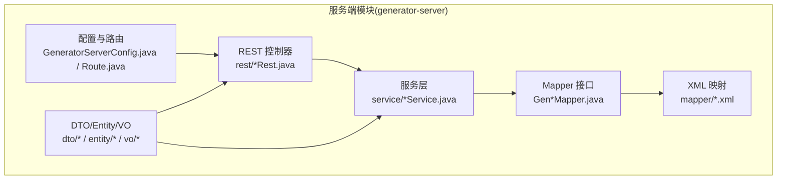
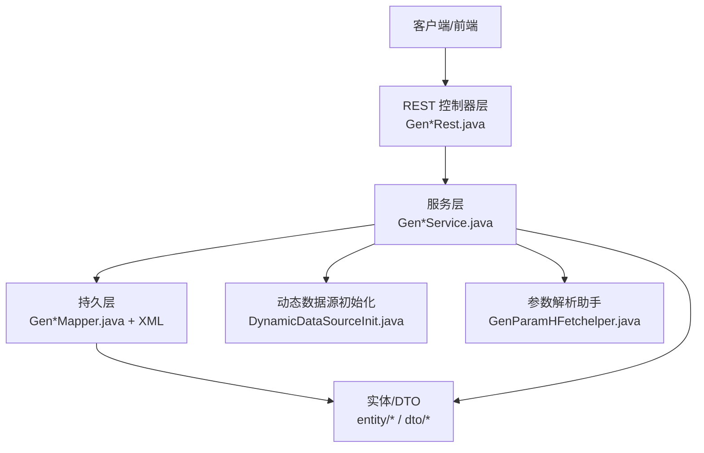
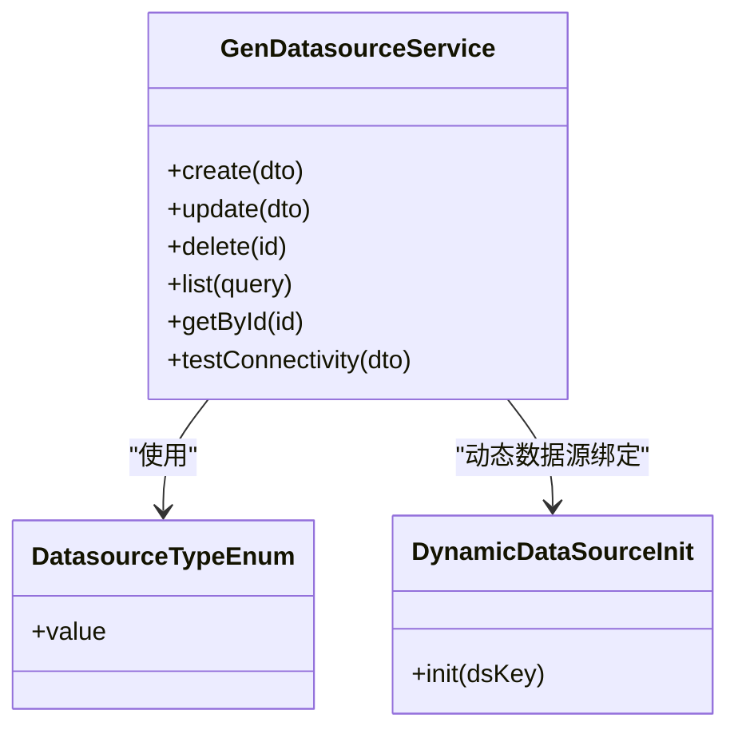
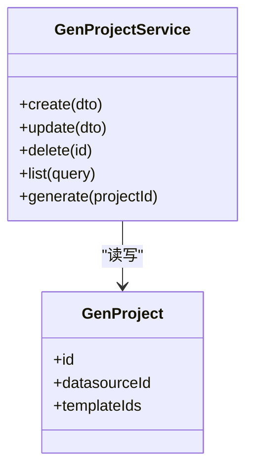
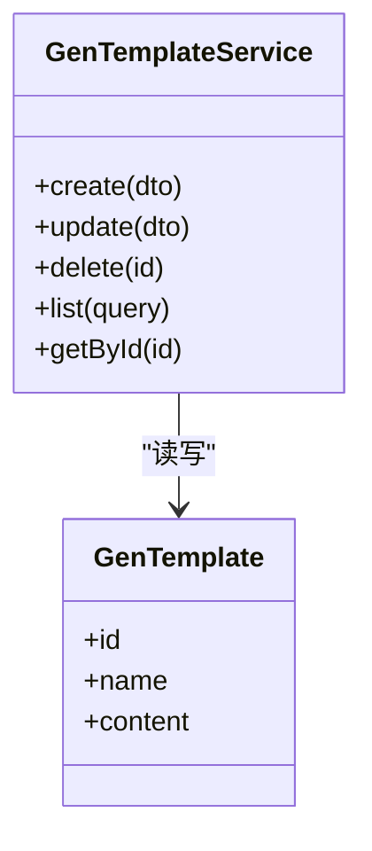
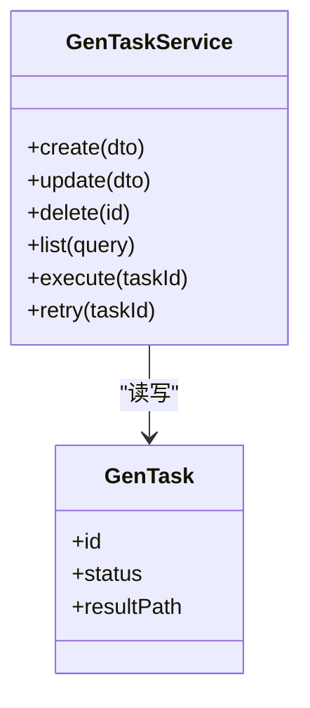
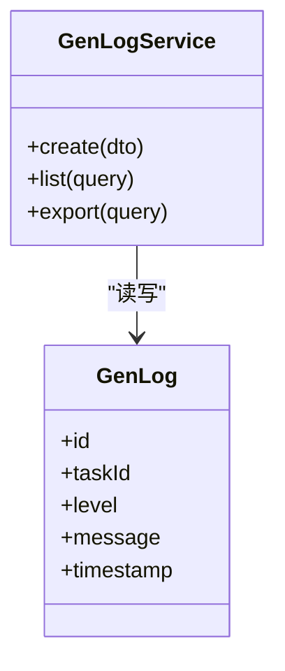
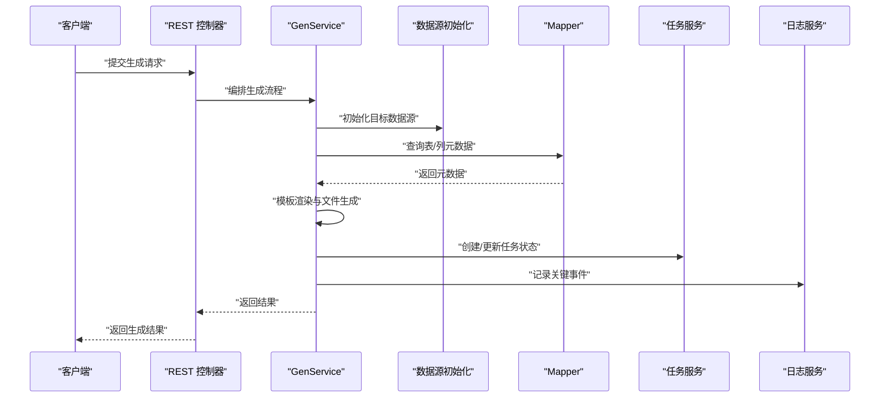
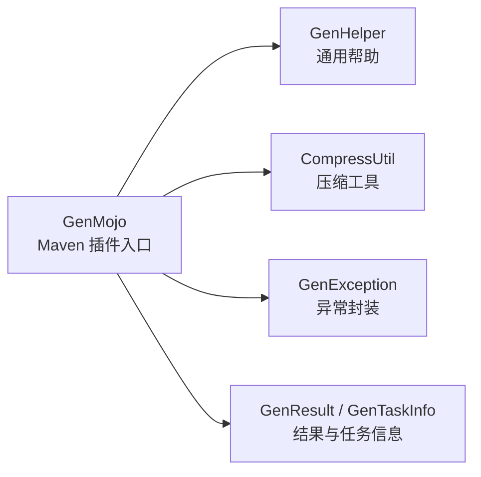
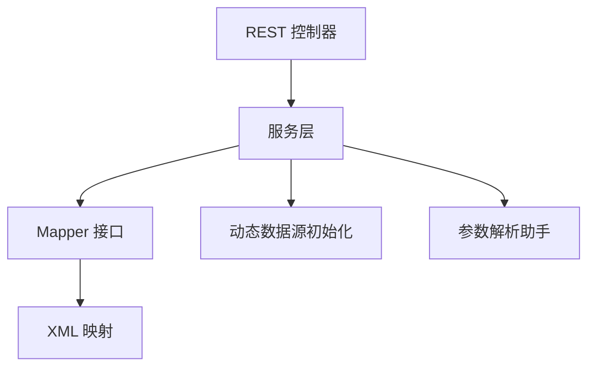

# 服务层设计

<cite>
**本文引用的文件**
- [GeneratorServerConfig.java](file://generator-server/src/main/java/com/wkclz/generator/server/GeneratorServerConfig.java)
- [Route.java](file://generator-server/src/main/java/com/wkclz/generator/server/Route.java)
- [GenDatasourceService.java](file://generator-server/src/main/java/com/wkclz/generator/server/service/GenDatasourceService.java)
- [GenLogService.java](file://generator-server/src/main/java/com/wkclz/generator/server/service/GenLogService.java)
- [GenProjectService.java](file://generator-server/src/main/java/com/wkclz/generator/server/service/GenProjectService.java)
- [GenService.java](file://generator-server/src/main/java/com/wkclz/generator/server/service/GenService.java)
- [GenTaskService.java](file://generator-server/src/main/java/com/wkclz/generator/server/service/GenTaskService.java)
- [GenTemplateService.java](file://generator-server/src/main/java/com/wkclz/generator/server/service/GenTemplateService.java)
- [GenDatasourceRest.java](file://generator-server/src/main/java/com/wkclz/generator/server/rest/GenDatasourceRest.java)
- [GenLogRest.java](file://generator-server/src/main/java/com/wkclz/generator/server/rest/GenLogRest.java)
- [GenProjectRest.java](file://generator-server/src/main/java/com/wkclz/generator/server/rest/GenProjectRest.java)
- [GenTaskRest.java](file://generator-server/src/main/java/com/wkclz/generator/server/rest/GenTaskRest.java)
- [GenTemplateRest.java](file://generator-server/src/main/java/com/wkclz/generator/server/rest/GenTemplateRest.java)
- [GenDatasourceMapper.java](file://generator-server/src/main/java/com/wkclz/generator/server/mapper/GenDatasourceMapper.java)
- [GenLogMapper.java](file://generator-server/src/main/java/com/wkclz/generator/server/mapper/GenLogMapper.java)
- [GenProjectMapper.java](file://generator-server/src/main/java/com/wkclz/generator/server/mapper/GenProjectMapper.java)
- [GenTaskMapper.java](file://generator-server/src/main/java/com/wkclz/generator/server/mapper/GenTaskMapper.java)
- [GenTemplateMapper.java](file://generator-server/src/main/java/com/wkclz/generator/server/mapper/GenTemplateMapper.java)
- [GenDatasource.java](file://generator-server/src/main/java/com/wkclz/generator/server/bean/entity/GenDatasource.java)
- [GenLog.java](file://generator-server/src/main/java/com/wkclz/generator/server/bean/entity/GenLog.java)
- [GenProject.java](file://generator-server/src/main/java/com/wkclz/generator/server/bean/entity/GenProject.java)
- [GenTask.java](file://generator-server/src/main/java/com/wkclz/generator/server/bean/entity/GenTask.java)
- [GenTemplate.java](file://generator-server/src/main/java/com/wkclz/generator/server/bean/entity/GenTemplate.java)
- [GenDatasourceDto.java](file://generator-server/src/main/java/com/wkclz/generator/server/bean/dto/GenDatasourceDto.java)
- [GenLogDto.java](file://generator-server/src/main/java/com/wkclz/generator/server/bean/dto/GenLogDto.java)
- [GenProjectDto.java](file://generator-server/src/main/java/com/wkclz/generator/server/bean/dto/GenProjectDto.java)
- [GenTaskDto.java](file://generator-server/src/main/java/com/wkclz/generator/server/bean/dto/GenTaskDto.java)
- [GenTemplateDto.java](file://generator-server/src/main/java/com/wkclz/generator/server/bean/dto/GenTemplateDto.java)
- [DatasourceTypeEnum.java](file://generator-server/src/main/java/com/wkclz/generator/server/bean/enums/DatasourceTypeEnum.java)
- [DynamicDataSourceInit.java](file://generator-server/src/main/java/com/wkclz/generator/server/helper/DynamicDataSourceInit.java)
- [GenParamHFetchelper.java](file://generator-server/src/main/java/com/wkclz/generator/server/helper/GenParamHFetchelper.java)
- [GenMojo.java](file://generator-client/src/main/java/com/wkclz/generator/client/GenMojo.java)
- [GenHelper.java](file://generator-client/src/main/java/com/wkclz/generator/client/helper/GenHelper.java)
- [GenException.java](file://generator-client/src/main/java/com/wkclz/generator/client/exception/GenException.java)
- [CompressUtil.java](file://generator-client/src/main/java/com/wkclz/generator/client/utils/CompressUtil.java)
- [GenResult.java](file://generator-client/src/main/java/com/wkclz/generator/client/bean/GenResult.java)
- [GenTaskInfo.java](file://generator-client/src/main/java/com/wkclz/generator/client/bean/GenTaskInfo.java)
</cite>

## 目录
1. [引言](#引言)
2. [项目结构](#项目结构)
3. [核心组件](#核心组件)
4. [架构总览](#架构总览)
5. [详细组件分析](#详细组件分析)
6. [依赖分析](#依赖分析)
7. [性能考虑](#性能考虑)
8. [故障排查指南](#故障排查指南)
9. [结论](#结论)
10. [附录](#附录)

## 引言
本文件面向 SH-Generator 的服务层，系统性梳理其整体架构与业务实现，重点覆盖以下方面：
- 服务层职责划分：数据源、项目、模板、任务、日志五大服务如何协同完成代码生成闭环
- 核心算法与流程：数据获取、模板渲染、文件生成的关键步骤与控制流
- 业务规则与异常处理：参数校验、事务边界、错误传播策略
- 设计模式与工程化：依赖注入、AOP 切面（通过配置与拦截器体现）、分层解耦
- 接口使用与最佳实践：REST 接口调用建议、客户端集成要点

## 项目结构
服务层位于 generator-server 模块，采用“领域模型 + Mapper + Service + REST”的分层组织方式，并通过 Spring Boot 自动装配与 MyBatis XML 映射支撑持久化。

图表来源
- [GeneratorServerConfig.java](file://generator-server/src/main/java/com/wkclz/generator/server/GeneratorServerConfig.java)
- [Route.java](file://generator-server/src/main/java/com/wkclz/generator/server/Route.java)
- [GenDatasourceMapper.java](file://generator-server/src/main/java/com/wkclz/generator/server/mapper/GenDatasourceMapper.java)
- [GenLogMapper.java](file://generator-server/src/main/java/com/wkclz/generator/server/mapper/GenLogMapper.java)
- [GenProjectMapper.java](file://generator-server/src/main/java/com/wkclz/generator/server/mapper/GenProjectMapper.java)
- [GenTaskMapper.java](file://generator-server/src/main/java/com/wkclz/generator/server/mapper/GenTaskMapper.java)
- [GenTemplateMapper.java](file://generator-server/src/main/java/com/wkclz/generator/server/mapper/GenTemplateMapper.java)

章节来源
- [GeneratorServerConfig.java](file://generator-server/src/main/java/com/wkclz/generator/server/GeneratorServerConfig.java)
- [Route.java](file://generator-server/src/main/java/com/wkclz/generator/server/Route.java)

## 核心组件
服务层围绕五大领域对象构建：GenDatasource（数据源）、GenProject（项目）、GenTemplate（模板）、GenTask（任务）、GenLog（日志）。每个领域均配套 DTO、Entity、Mapper、Service、REST 控制器，形成完整的 CRUD 与业务编排能力。

- 数据模型与枚举
  - 实体：GenDatasource、GenProject、GenTemplate、GenTask、GenLog
  - DTO：GenDatasourceDto、GenProjectDto、GenTemplateDto、GenTaskDto、GenLogDto
  - 枚举：DatasourceTypeEnum（数据源类型）
- 服务接口
  - GenDatasourceService、GenProjectService、GenTemplateService、GenTaskService、GenLogService、GenService（通用生成入口）
- REST 控制器
  - GenDatasourceRest、GenProjectRest、GenTemplateRest、GenTaskRest、GenLogRest

章节来源
- [GenDatasource.java](file://generator-server/src/main/java/com/wkclz/generator/server/bean/entity/GenDatasource.java)
- [GenProject.java](file://generator-server/src/main/java/com/wkclz/generator/server/bean/entity/GenProject.java)
- [GenTemplate.java](file://generator-server/src/main/java/com/wkclz/generator/server/bean/entity/GenTemplate.java)
- [GenTask.java](file://generator-server/src/main/java/com/wkclz/generator/server/bean/entity/GenTask.java)
- [GenLog.java](file://generator-server/src/main/java/com/wkclz/generator/server/bean/entity/GenLog.java)
- [GenDatasourceDto.java](file://generator-server/src/main/java/com/wkclz/generator/server/bean/dto/GenDatasourceDto.java)
- [GenProjectDto.java](file://generator-server/src/main/java/com/wkclz/generator/server/bean/dto/GenProjectDto.java)
- [GenTemplateDto.java](file://generator-server/src/main/java/com/wkclz/generator/server/bean/dto/GenTemplateDto.java)
- [GenTaskDto.java](file://generator-server/src/main/java/com/wkclz/generator/server/bean/dto/GenTaskDto.java)
- [GenLogDto.java](file://generator-server/src/main/java/com/wkclz/generator/server/bean/dto/GenLogDto.java)
- [DatasourceTypeEnum.java](file://generator-server/src/main/java/com/wkclz/generator/server/bean/enums/DatasourceTypeEnum.java)

## 架构总览
服务层遵循“控制器-服务-持久层”三层架构，结合动态数据源初始化与参数解析辅助工具，实现多数据源、多模板、多任务的统一生成调度。

图表来源
- [GenDatasourceRest.java](file://generator-server/src/main/java/com/wkclz/generator/server/rest/GenDatasourceRest.java)
- [GenProjectRest.java](file://generator-server/src/main/java/com/wkclz/generator/server/rest/GenProjectRest.java)
- [GenTemplateRest.java](file://generator-server/src/main/java/com/wkclz/generator/server/rest/GenTemplateRest.java)
- [GenTaskRest.java](file://generator-server/src/main/java/com/wkclz/generator/server/rest/GenTaskRest.java)
- [GenLogRest.java](file://generator-server/src/main/java/com/wkclz/generator/server/rest/GenLogRest.java)
- [GenDatasourceService.java](file://generator-server/src/main/java/com/wkclz/generator/server/service/GenDatasourceService.java)
- [GenProjectService.java](file://generator-server/src/main/java/com/wkclz/generator/server/service/GenProjectService.java)
- [GenTemplateService.java](file://generator-server/src/main/java/com/wkclz/generator/server/service/GenTemplateService.java)
- [GenTaskService.java](file://generator-server/src/main/java/com/wkclz/generator/server/service/GenTaskService.java)
- [GenLogService.java](file://generator-server/src/main/java/com/wkclz/generator/server/service/GenLogService.java)
- [GenDatasourceMapper.java](file://generator-server/src/main/java/com/wkclz/generator/server/mapper/GenDatasourceMapper.java)
- [GenProjectMapper.java](file://generator-server/src/main/java/com/wkclz/generator/server/mapper/GenProjectMapper.java)
- [GenTemplateMapper.java](file://generator-server/src/main/java/com/wkclz/generator/server/mapper/GenTemplateMapper.java)
- [GenTaskMapper.java](file://generator-server/src/main/java/com/wkclz/generator/server/mapper/GenTaskMapper.java)
- [GenLogMapper.java](file://generator-server/src/main/java/com/wkclz/generator/server/mapper/GenLogMapper.java)
- [DynamicDataSourceInit.java](file://generator-server/src/main/java/com/wkclz/generator/server/helper/DynamicDataSourceInit.java)
- [GenParamHFetchelper.java](file://generator-server/src/main/java/com/wkclz/generator/server/helper/GenParamHFetchelper.java)

## 详细组件分析

### 数据源服务（GenDatasourceService）
职责
- 管理数据库连接信息与类型枚举，支持动态切换数据源
- 提供数据源的增删改查与连通性校验
- 为项目与任务服务提供数据源元数据

实现要点
- 基于枚举定义数据源类型，约束输入合法性
- 通过动态数据源初始化组件在运行时绑定目标数据源
- 在服务层进行必要的参数校验与异常封装

图表来源
- [GenDatasourceService.java](file://generator-server/src/main/java/com/wkclz/generator/server/service/GenDatasourceService.java)
- [DatasourceTypeEnum.java](file://generator-server/src/main/java/com/wkclz/generator/server/bean/enums/DatasourceTypeEnum.java)
- [DynamicDataSourceInit.java](file://generator-server/src/main/java/com/wkclz/generator/server/helper/DynamicDataSourceInit.java)

章节来源
- [GenDatasourceService.java](file://generator-server/src/main/java/com/wkclz/generator/server/service/GenDatasourceService.java)
- [DatasourceTypeEnum.java](file://generator-server/src/main/java/com/wkclz/generator/server/bean/enums/DatasourceTypeEnum.java)
- [DynamicDataSourceInit.java](file://generator-server/src/main/java/com/wkclz/generator/server/helper/DynamicDataSourceInit.java)

### 项目服务（GenProjectService）
职责
- 维护代码生成项目配置，关联数据源与模板
- 校验项目参数，确保生成上下文完整
- 协调任务服务创建与调度生成任务

实现要点
- 以 DTO 驱动的参数校验，避免脏数据进入生成流程
- 与数据源服务协作，按项目配置选择数据源
- 与模板服务协作，加载模板集合用于后续渲染

图表来源
- [GenProjectService.java](file://generator-server/src/main/java/com/wkclz/generator/server/service/GenProjectService.java)
- [GenProject.java](file://generator-server/src/main/java/com/wkclz/generator/server/bean/entity/GenProject.java)

章节来源
- [GenProjectService.java](file://generator-server/src/main/java/com/wkclz/generator/server/service/GenProjectService.java)
- [GenProject.java](file://generator-server/src/main/java/com/wkclz/generator/server/bean/entity/GenProject.java)

### 模板服务（GenTemplateService）
职责
- 管理模板资源与版本，提供模板检索与渲染所需的数据
- 支持模板的增删改查与预览能力

实现要点
- 以 DTO 封装模板元信息，便于跨层传递
- 与生成服务配合，提供渲染上下文

图表来源
- [GenTemplateService.java](file://generator-server/src/main/java/com/wkclz/generator/server/service/GenTemplateService.java)
- [GenTemplate.java](file://generator-server/src/main/java/com/wkclz/generator/server/bean/entity/GenTemplate.java)

章节来源
- [GenTemplateService.java](file://generator-server/src/main/java/com/wkclz/generator/server/service/GenTemplateService.java)
- [GenTemplate.java](file://generator-server/src/main/java/com/wkclz/generator/server/bean/entity/GenTemplate.java)

### 任务服务（GenTaskService）
职责
- 调度与执行代码生成任务，协调数据源、模板与输出
- 记录任务状态与日志，支持重试与回滚

实现要点
- 以 DTO 驱动的任务编排，保证输入参数一致性
- 与日志服务协作，记录生成过程中的关键事件

图表来源
- [GenTaskService.java](file://generator-server/src/main/java/com/wkclz/generator/server/service/GenTaskService.java)
- [GenTask.java](file://generator-server/src/main/java/com/wkclz/generator/server/bean/entity/GenTask.java)

章节来源
- [GenTaskService.java](file://generator-server/src/main/java/com/wkclz/generator/server/service/GenTaskService.java)
- [GenTask.java](file://generator-server/src/main/java/com/wkclz/generator/server/bean/entity/GenTask.java)

### 日志服务（GenLogService）
职责
- 记录生成过程中的事件、错误与性能指标
- 提供查询与导出能力，支撑问题定位与审计

实现要点
- 以 DTO 封装日志条目，便于检索与展示
- 与任务服务联动，按任务维度聚合日志

图表来源
- [GenLogService.java](file://generator-server/src/main/java/com/wkclz/generator/server/service/GenLogService.java)
- [GenLog.java](file://generator-server/src/main/java/com/wkclz/generator/server/bean/entity/GenLog.java)

章节来源
- [GenLogService.java](file://generator-server/src/main/java/com/wkclz/generator/server/service/GenLogService.java)
- [GenLog.java](file://generator-server/src/main/java/com/wkclz/generator/server/bean/entity/GenLog.java)

### 通用生成服务（GenService）
职责
- 作为生成流程的编排者，协调数据源、模板、任务与日志
- 执行核心算法：数据获取 → 模板渲染 → 文件生成 → 结果归档

实现要点
- 参数解析与校验由参数助手完成，降低重复逻辑
- 动态数据源初始化确保在正确数据源上执行 SQL 元数据采集
- 通过任务服务推进状态流转，日志服务记录关键节点

图表来源
- [GenService.java](file://generator-server/src/main/java/com/wkclz/generator/server/service/GenService.java)
- [DynamicDataSourceInit.java](file://generator-server/src/main/java/com/wkclz/generator/server/helper/DynamicDataSourceInit.java)
- [GenParamHFetchelper.java](file://generator-server/src/main/java/com/wkclz/generator/server/helper/GenParamHFetchelper.java)
- [GenTaskService.java](file://generator-server/src/main/java/com/wkclz/generator/server/service/GenTaskService.java)
- [GenLogService.java](file://generator-server/src/main/java/com/wkclz/generator/server/service/GenLogService.java)

章节来源
- [GenService.java](file://generator-server/src/main/java/com/wkclz/generator/server/service/GenService.java)
- [DynamicDataSourceInit.java](file://generator-server/src/main/java/com/wkclz/generator/server/helper/DynamicDataSourceInit.java)
- [GenParamHFetchelper.java](file://generator-server/src/main/java/com/wkclz/generator/server/helper/GenParamHFetchelper.java)

### 客户端集成（generator-client）
职责
- 提供 Maven 插件入口与工具类，简化本地或 CI 环境下的代码生成
- 封装压缩与异常处理，保障输出质量

实现要点
- Maven 插件入口负责收集参数、触发服务端生成并下载产物
- 工具类提供压缩与通用帮助方法
- 异常体系统一抛出，便于上层捕获与提示

图表来源
- [GenMojo.java](file://generator-client/src/main/java/com/wkclz/generator/client/GenMojo.java)
- [GenHelper.java](file://generator-client/src/main/java/com/wkclz/generator/client/helper/GenHelper.java)
- [CompressUtil.java](file://generator-client/src/main/java/com/wkclz/generator/client/utils/CompressUtil.java)
- [GenException.java](file://generator-client/src/main/java/com/wkclz/generator/client/exception/GenException.java)
- [GenResult.java](file://generator-client/src/main/java/com/wkclz/generator/client/bean/GenResult.java)
- [GenTaskInfo.java](file://generator-client/src/main/java/com/wkclz/generator/client/bean/GenTaskInfo.java)

章节来源
- [GenMojo.java](file://generator-client/src/main/java/com/wkclz/generator/client/GenMojo.java)
- [GenHelper.java](file://generator-client/src/main/java/com/wkclz/generator/client/helper/GenHelper.java)
- [CompressUtil.java](file://generator-client/src/main/java/com/wkclz/generator/client/utils/CompressUtil.java)
- [GenException.java](file://generator-client/src/main/java/com/wkclz/generator/client/exception/GenException.java)
- [GenResult.java](file://generator-client/src/main/java/com/wkclz/generator/client/bean/GenResult.java)
- [GenTaskInfo.java](file://generator-client/src/main/java/com/wkclz/generator/client/bean/GenTaskInfo.java)

## 依赖分析
服务层内部依赖清晰，遵循“控制器 → 服务 → 持久层”的单向依赖；同时通过动态数据源与参数助手实现横切关注点的解耦。

图表来源
- [GenDatasourceRest.java](file://generator-server/src/main/java/com/wkclz/generator/server/rest/GenDatasourceRest.java)
- [GenProjectRest.java](file://generator-server/src/main/java/com/wkclz/generator/server/rest/GenProjectRest.java)
- [GenTemplateRest.java](file://generator-server/src/main/java/com/wkclz/generator/server/rest/GenTemplateRest.java)
- [GenTaskRest.java](file://generator-server/src/main/java/com/wkclz/generator/server/rest/GenTaskRest.java)
- [GenLogRest.java](file://generator-server/src/main/java/com/wkclz/generator/server/rest/GenLogRest.java)
- [GenDatasourceService.java](file://generator-server/src/main/java/com/wkclz/generator/server/service/GenDatasourceService.java)
- [GenProjectService.java](file://generator-server/src/main/java/com/wkclz/generator/server/service/GenProjectService.java)
- [GenTemplateService.java](file://generator-server/src/main/java/com/wkclz/generator/server/service/GenTemplateService.java)
- [GenTaskService.java](file://generator-server/src/main/java/com/wkclz/generator/server/service/GenTaskService.java)
- [GenLogService.java](file://generator-server/src/main/java/com/wkclz/generator/server/service/GenLogService.java)
- [DynamicDataSourceInit.java](file://generator-server/src/main/java/com/wkclz/generator/server/helper/DynamicDataSourceInit.java)
- [GenParamHFetchelper.java](file://generator-server/src/main/java/com/wkclz/generator/server/helper/GenParamHFetchelper.java)

章节来源
- [GenDatasourceService.java](file://generator-server/src/main/java/com/wkclz/generator/server/service/GenDatasourceService.java)
- [GenProjectService.java](file://generator-server/src/main/java/com/wkclz/generator/server/service/GenProjectService.java)
- [GenTemplateService.java](file://generator-server/src/main/java/com/wkclz/generator/server/service/GenTemplateService.java)
- [GenTaskService.java](file://generator-server/src/main/java/com/wkclz/generator/server/service/GenTaskService.java)
- [GenLogService.java](file://generator-server/src/main/java/com/wkclz/generator/server/service/GenLogService.java)
- [DynamicDataSourceInit.java](file://generator-server/src/main/java/com/wkclz/generator/server/helper/DynamicDataSourceInit.java)
- [GenParamHFetchelper.java](file://generator-server/src/main/java/com/wkclz/generator/server/helper/GenParamHFetchelper.java)

## 性能考虑
- 连接池与数据源切换
  - 使用动态数据源初始化组件在任务执行前绑定目标数据源，减少不必要的连接建立成本
- 查询优化
  - Mapper 层通过 XML 映射精确查询，避免 N+1 问题；对高频查询增加索引与缓存
- 渲染与压缩
  - 模板渲染尽量复用上下文对象，避免重复计算；输出阶段采用压缩工具减少体积
- 并发与限流
  - 任务服务应限制并发度，防止资源争用；对高耗时操作采用异步队列

## 故障排查指南
- 常见异常与处理
  - 参数非法：通过 DTO 校验与参数助手提前拦截，避免进入生成流程
  - 数据源不可达：在数据源服务中进行连通性测试，失败时抛出自定义异常并记录日志
  - 渲染失败：捕获模板渲染异常，记录上下文与堆栈，回滚任务状态
  - IO 错误：文件生成失败时，清理临时文件并通知日志服务
- 日志与追踪
  - 使用日志服务记录关键节点与错误详情，支持按任务 ID 聚合查询
- 事务与一致性
  - 对涉及多表写入的操作采用事务管理，失败时回滚；对幂等性场景引入去重键

章节来源
- [GenException.java](file://generator-client/src/main/java/com/wkclz/generator/client/exception/GenException.java)
- [GenLogService.java](file://generator-server/src/main/java/com/wkclz/generator/server/service/GenLogService.java)
- [GenDatasourceService.java](file://generator-server/src/main/java/com/wkclz/generator/server/service/GenDatasourceService.java)

## 结论
服务层通过清晰的领域划分与严格的分层解耦，实现了从数据源到模板再到任务与日志的完整生成链路。借助动态数据源与参数助手，系统具备良好的扩展性与可维护性。建议在生产环境中进一步完善监控埋点、限流与重试策略，持续提升稳定性与可观测性。

## 附录
- 接口使用示例（REST）
  - 创建数据源：POST /gen/datasource
  - 创建项目：POST /gen/project
  - 创建模板：POST /gen/template
  - 创建任务：POST /gen/task
  - 触发生成：POST /gen/generate
  - 查询日志：GET /gen/log/list
- 最佳实践
  - 使用 DTO 驱动参数传递，确保字段约束一致
  - 在服务层集中处理异常与事务，保持控制器简洁
  - 对高耗时操作采用异步与分片策略，避免阻塞主线程
  - 为每个任务分配唯一标识，贯穿日志与结果追踪