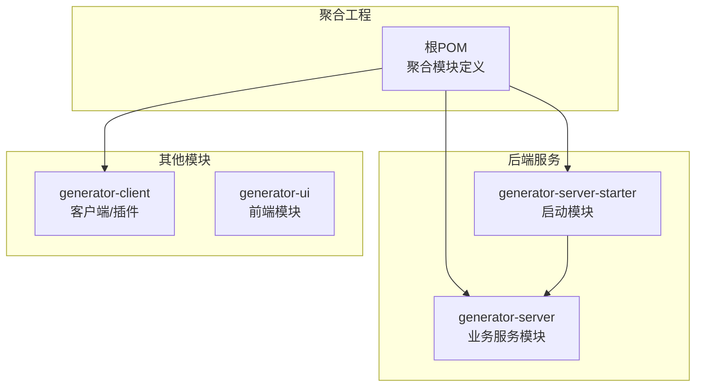
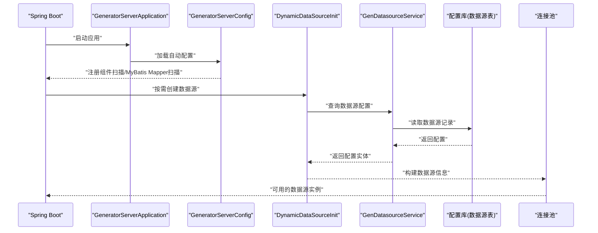
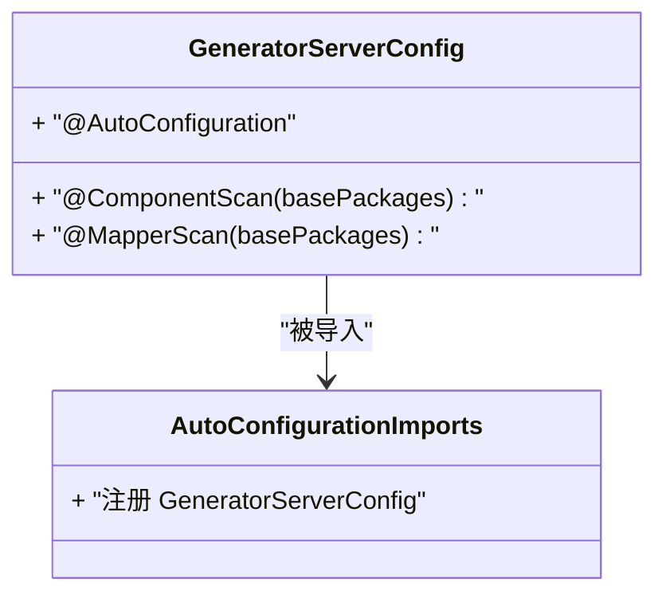
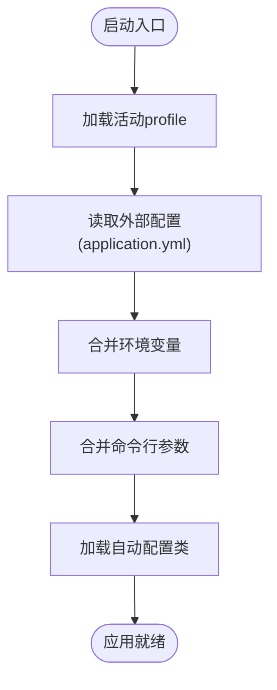
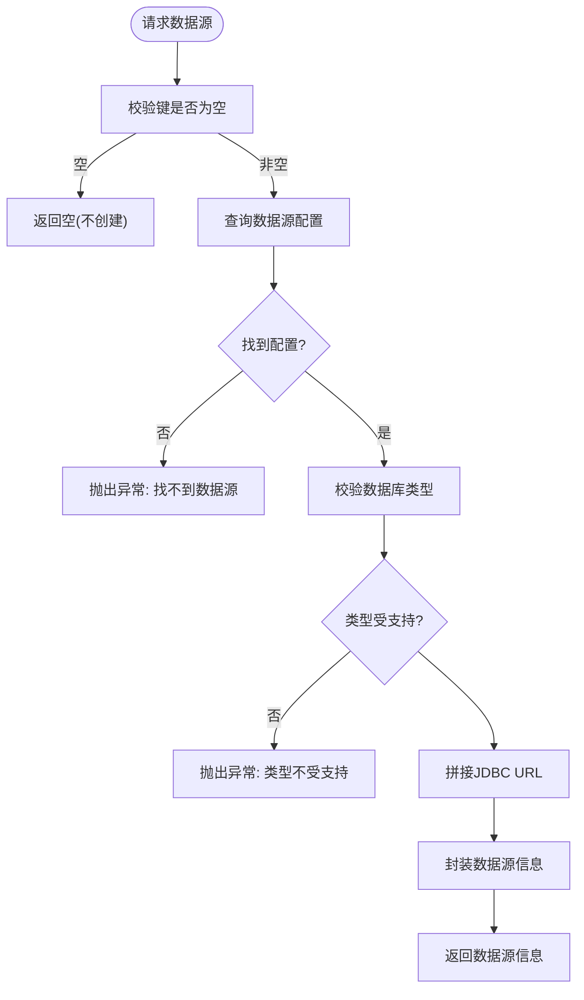
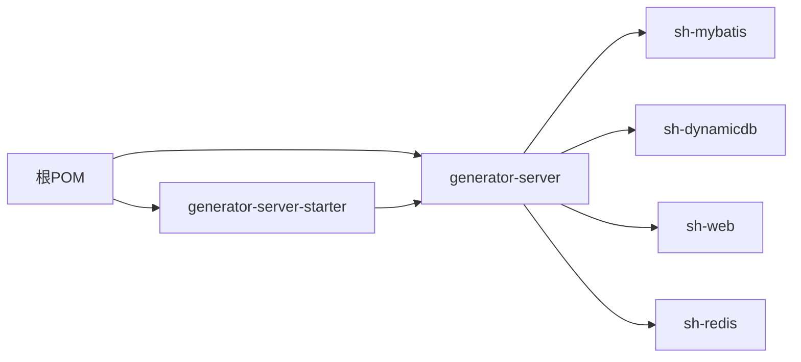

# 配置管理

<cite>
**本文引用的文件**
- [application.yml](file://generator-server-starter/src/main/resources/config/application.yml)
- [GeneratorServerApplication.java](file://generator-server-starter/src/main/java/com/wkclz/generator/server/starter/GeneratorServerApplication.java)
- [GeneratorServerConfig.java](file://generator-server/src/main/java/com/wkclz/generator/server/GeneratorServerConfig.java)
- [org.springframework.boot.autoconfigure.AutoConfiguration.imports](file://generator-server/src/main/resources/META-INF/spring/org.springframework.boot.autoconfigure.AutoConfiguration.imports)
- [DynamicDataSourceInit.java](file://generator-server/src/main/java/com/wkclz/generator/server/helper/DynamicDataSourceInit.java)
- [GenDatasourceService.java](file://generator-server/src/main/java/com/wkclz/generator/server/service/GenDatasourceService.java)
- [GenDatasource.java](file://generator-server/src/main/java/com/wkclz/generator/server/bean/entity/GenDatasource.java)
- [DatasourceTypeEnum.java](file://generator-server/src/main/java/com/wkclz/generator/server/bean/enums/DatasourceTypeEnum.java)
- [pom.xml（根工程）](file://pom.xml)
- [pom.xml（generator-server）](file://generator-server/pom.xml)
- [pom.xml（generator-server-starter）](file://generator-server-starter/pom.xml)
</cite>

## 目录
1. [引言](#引言)
2. [项目结构](#项目结构)
3. [核心组件](#核心组件)
4. [架构总览](#架构总览)
5. [组件详解](#组件详解)
6. [依赖关系分析](#依赖关系分析)
7. [性能与稳定性考量](#性能与稳定性考量)
8. [故障排查指南](#故障排查指南)
9. [结论](#结论)
10. [附录：配置清单与最佳实践](#附录配置清单与最佳实践)

## 引言
本文件面向SH-Generator配置管理系统，系统性梳理Spring Boot自动配置与组件扫描机制、应用启动流程与配置加载顺序；重点阐述动态数据源初始化机制的实现原理与配置方式（含多数据源选择与连接池管理），并给出系统配置项的作用与配置方法（数据库连接、模板引擎、文件存储等）。同时提供配置文件结构说明、参数含义解释、配置加密与敏感信息保护建议、热更新机制设计思路以及常见问题排查路径。

## 项目结构
项目采用多模块聚合结构，核心模块与职责如下：
- generator-server：业务服务模块，包含自动配置类、数据源动态工厂、实体与服务层、Mapper与REST接口等。
- generator-server-starter：启动模块，打包可执行应用，内置默认配置与启动入口。
- generator-client：Maven插件/客户端模块，用于代码生成任务的触发与打包。
- generator-ui：前端模块（非本次配置主题重点，但与后端配置联动）。

图表来源
- [pom.xml（根工程）:20-24](file://pom.xml#L20-L24)
- [pom.xml（generator-server）:1-58](file://generator-server/pom.xml#L1-L58)
- [pom.xml（generator-server-starter）:1-52](file://generator-server-starter/pom.xml#L1-L52)

章节来源
- [pom.xml（根工程）:20-24](file://pom.xml#L20-L24)
- [pom.xml（generator-server）:14-40](file://generator-server/pom.xml#L14-L40)
- [pom.xml（generator-server-starter）:15-26](file://generator-server-starter/pom.xml#L15-L26)

## 核心组件
- 自动配置与组件扫描
  - 通过自定义自动配置类启用组件扫描与MyBatis Mapper扫描，确保业务包下的服务、控制器、Mapper被容器管理。
- 动态数据源工厂
  - 实现框架提供的动态数据源工厂接口，按数据源编码从数据库加载配置，构造数据源信息对象。
- 数据源实体与枚举
  - 定义数据源实体字段与数据库类型枚举，支撑动态数据源初始化与类型校验。
- 启动入口与配置加载
  - 启动类负责应用引导；启动模块提供默认配置文件，支持profile激活与外部化配置覆盖。

章节来源
- [GeneratorServerConfig.java:7-11](file://generator-server/src/main/java/com/wkclz/generator/server/GeneratorServerConfig.java#L7-L11)
- [org.springframework.boot.autoconfigure.AutoConfiguration.imports:1-1](file://generator-server/src/main/resources/META-INF/spring/org.springframework.boot.autoconfigure.AutoConfiguration.imports#L1-L1)
- [DynamicDataSourceInit.java:17-58](file://generator-server/src/main/java/com/wkclz/generator/server/helper/DynamicDataSourceInit.java#L17-L58)
- [GenDatasource.java:17-67](file://generator-server/src/main/java/com/wkclz/generator/server/bean/entity/GenDatasource.java#L17-L67)
- [DatasourceTypeEnum.java:13-24](file://generator-server/src/main/java/com/wkclz/generator/server/bean/enums/DatasourceTypeEnum.java#L13-L24)
- [GeneratorServerApplication.java:6-11](file://generator-server-starter/src/main/java/com/wkclz/generator/server/starter/GeneratorServerApplication.java#L6-L11)
- [application.yml:1-52](file://generator-server-starter/src/main/resources/config/application.yml#L1-L52)

## 架构总览
下图展示从启动到动态数据源初始化的关键交互：

图表来源
- [GeneratorServerApplication.java:6-11](file://generator-server-starter/src/main/java/com/wkclz/generator/server/starter/GeneratorServerApplication.java#L6-L11)
- [GeneratorServerConfig.java:7-11](file://generator-server/src/main/java/com/wkclz/generator/server/GeneratorServerConfig.java#L7-L11)
- [org.springframework.boot.autoconfigure.AutoConfiguration.imports:1-1](file://generator-server/src/main/resources/META-INF/spring/org.springframework.boot.autoconfigure.AutoConfiguration.imports#L1-L1)
- [DynamicDataSourceInit.java:23-57](file://generator-server/src/main/java/com/wkclz/generator/server/helper/DynamicDataSourceInit.java#L23-L57)
- [GenDatasourceService.java:45-54](file://generator-server/src/main/java/com/wkclz/generator/server/service/GenDatasourceService.java#L45-L54)

## 组件详解

### Spring Boot自动配置与组件扫描
- 自动配置类通过注解声明组件扫描与Mapper扫描范围，确保业务包内的Bean被纳入容器。
- 通过META-INF自动配置导入文件显式注册该自动配置类，保证Spring Boot在启动时加载。

图表来源
- [GeneratorServerConfig.java:7-11](file://generator-server/src/main/java/com/wkclz/generator/server/GeneratorServerConfig.java#L7-L11)
- [org.springframework.boot.autoconfigure.AutoConfiguration.imports:1-1](file://generator-server/src/main/resources/META-INF/spring/org.springframework.boot.autoconfigure.AutoConfiguration.imports#L1-L1)

章节来源
- [GeneratorServerConfig.java:7-11](file://generator-server/src/main/java/com/wkclz/generator/server/GeneratorServerConfig.java#L7-L11)
- [org.springframework.boot.autoconfigure.AutoConfiguration.imports:1-1](file://generator-server/src/main/resources/META-INF/spring/org.springframework.boot.autoconfigure.AutoConfiguration.imports#L1-L1)

### 应用启动流程与配置加载顺序
- 启动入口：启动类负责引导Spring Boot应用。
- 配置加载顺序（简述）：命令行参数 > 环境变量 > 外部配置文件（如application.yml）> 默认属性。
- profile激活：可通过配置文件或环境变量指定活动profile，以加载对应配置片段。

图表来源
- [GeneratorServerApplication.java:6-11](file://generator-server-starter/src/main/java/com/wkclz/generator/server/starter/GeneratorServerApplication.java#L6-L11)
- [application.yml:7-8](file://generator-server-starter/src/main/resources/config/application.yml#L7-L8)

章节来源
- [GeneratorServerApplication.java:6-11](file://generator-server-starter/src/main/java/com/wkclz/generator/server/starter/GeneratorServerApplication.java#L6-L11)
- [application.yml:1-52](file://generator-server-starter/src/main/resources/config/application.yml#L1-L52)

### 动态数据源初始化机制
- 触发时机：当需要访问某个数据源时，由动态数据源工厂按“键”（通常为数据源编码）创建数据源。
- 初始化流程：
  - 校验键是否为空；
  - 通过服务层查询对应数据源配置；
  - 校验数据库类型是否受支持；
  - 拼接JDBC URL；
  - 封装数据源信息对象返回给上层连接池。

图表来源
- [DynamicDataSourceInit.java:23-57](file://generator-server/src/main/java/com/wkclz/generator/server/helper/DynamicDataSourceInit.java#L23-L57)
- [GenDatasourceService.java:45-54](file://generator-server/src/main/java/com/wkclz/generator/server/service/GenDatasourceService.java#L45-L54)
- [GenDatasource.java:34-67](file://generator-server/src/main/java/com/wkclz/generator/server/bean/entity/GenDatasource.java#L34-L67)
- [DatasourceTypeEnum.java:13-24](file://generator-server/src/main/java/com/wkclz/generator/server/bean/enums/DatasourceTypeEnum.java#L13-L24)

章节来源
- [DynamicDataSourceInit.java:17-58](file://generator-server/src/main/java/com/wkclz/generator/server/helper/DynamicDataSourceInit.java#L17-L58)
- [GenDatasourceService.java:17-58](file://generator-server/src/main/java/com/wkclz/generator/server/service/GenDatasourceService.java#L17-L58)
- [GenDatasource.java:17-116](file://generator-server/src/main/java/com/wkclz/generator/server/bean/entity/GenDatasource.java#L17-L116)
- [DatasourceTypeEnum.java:13-56](file://generator-server/src/main/java/com/wkclz/generator/server/bean/enums/DatasourceTypeEnum.java#L13-L56)

### 数据源实体与类型枚举
- 实体字段涵盖用户、编码、类型、主机、端口、库名、用户名、密码等，支撑动态数据源初始化。
- 类型枚举定义了受支持的数据库类型及驱动类名映射，用于运行期校验与后续扩展。

章节来源
- [GenDatasource.java:17-116](file://generator-server/src/main/java/com/wkclz/generator/server/bean/entity/GenDatasource.java#L17-L116)
- [DatasourceTypeEnum.java:13-56](file://generator-server/src/main/java/com/wkclz/generator/server/bean/enums/DatasourceTypeEnum.java#L13-L56)

### 配置文件结构与参数说明
- 服务器端口与应用名：server.port、spring.application.name。
- Profile激活：spring.profiles.active。
- 数据源驱动：spring.datasource.driver-class-name。
- Jackson默认属性策略：spring.jackson.default-property-inclusion。
- MyBatis映射文件位置与命名策略：mybatis.mapper-locations、mybatis.configuration.map-underscore-to-camel-case。
- 分页插件：pagehelper.*。
- Actuator健康监控：management.endpoints.web.exposure.include、management.server.*、management.metrics.tags.application、management.endpoint.health.showDetails、management.endpoint.restart.enabled等。

章节来源
- [application.yml:1-52](file://generator-server-starter/src/main/resources/config/application.yml#L1-L52)

## 依赖关系分析
- 启动模块依赖业务模块，打包为可执行应用。
- 业务模块依赖框架与工具库（如sh-mybatis、sh-dynamicdb、sh-web、sh-redis等）。
- 通过父POM统一版本与编译参数。

图表来源
- [pom.xml（根工程）:20-24](file://pom.xml#L20-L24)
- [pom.xml（generator-server）:14-38](file://generator-server/pom.xml#L14-L38)
- [pom.xml（generator-server-starter）:15-26](file://generator-server-starter/pom.xml#L15-L26)

章节来源
- [pom.xml（根工程）:20-24](file://pom.xml#L20-L24)
- [pom.xml（generator-server）:14-38](file://generator-server/pom.xml#L14-L38)
- [pom.xml（generator-server-starter）:15-26](file://generator-server-starter/pom.xml#L15-L26)

## 性能与稳定性考量
- 连接池管理
  - 建议在动态数据源工厂返回的数据源信息中设置合理的连接池参数（如最小/最大连接数、超时、空闲检测等），并在上层统一接入连接池组件。
- 缓存与预热
  - 对常用数据源配置进行缓存，避免频繁查询配置库；应用启动时对热点数据源进行预热。
- 监控与告警
  - 利用Actuator暴露健康检查与指标，结合外部监控平台进行告警。
- 配置变更
  - 对于连接池参数等静态配置，建议通过配置中心支持热更新；对于数据源元信息变更，建议通过管理界面进行灰度发布与回滚。

[本节为通用指导，无需列出具体文件来源]

## 故障排查指南
- 启动失败
  - 检查启动类所在模块是否正确打包为可执行jar；确认自动配置导入文件是否存在且内容正确。
- 数据源初始化失败
  - 校验数据源编码是否正确；确认数据库类型是否受支持；核对主机、端口、库名、用户名、密码是否完整且正确。
- 连接异常
  - 检查JDBC URL拼接逻辑与网络连通性；确认驱动类名与数据库版本兼容。
- 配置未生效
  - 确认profile是否正确激活；检查环境变量与外部配置文件优先级；验证配置项拼写与层级。

章节来源
- [org.springframework.boot.autoconfigure.AutoConfiguration.imports:1-1](file://generator-server/src/main/resources/META-INF/spring/org.springframework.boot.autoconfigure.AutoConfiguration.imports#L1-L1)
- [DynamicDataSourceInit.java:23-57](file://generator-server/src/main/java/com/wkclz/generator/server/helper/DynamicDataSourceInit.java#L23-L57)
- [GenDatasourceService.java:45-54](file://generator-server/src/main/java/com/wkclz/generator/server/service/GenDatasourceService.java#L45-L54)
- [application.yml:7-8](file://generator-server-starter/src/main/resources/config/application.yml#L7-L8)

## 结论
本系统通过自定义自动配置与组件扫描，结合动态数据源工厂实现了灵活的多数据源能力。启动流程清晰，配置加载顺序明确，配合Actuator与连接池可实现可观测与高性能。建议在生产环境中完善配置中心与安全加固，并建立完善的变更与回滚机制。

[本节为总结性内容，无需列出具体文件来源]

## 附录：配置清单与最佳实践

### 配置项清单与含义
- 服务器与应用
  - server.port：HTTP服务端口。
  - spring.application.name：应用名，用于指标标签等。
  - spring.profiles.active：活动profile。
- 数据源
  - spring.datasource.driver-class-name：JDBC驱动类名。
- JSON序列化
  - spring.jackson.default-property-inclusion：属性包含策略。
- MyBatis
  - mybatis.mapper-locations：XML映射文件位置。
  - mybatis.configuration.map-underscore-to-camel-case：命名策略。
- 分页插件
  - pagehelper.*：分页插件相关参数。
- Actuator
  - management.endpoints.web.exposure.include：暴露的端点。
  - management.server.port/base-path/ssl：独立管理端口与安全。
  - management.metrics.tags.application：指标标签。
  - management.endpoint.health.showDetails/restart.enabled：健康检查与重启能力。

章节来源
- [application.yml:1-52](file://generator-server-starter/src/main/resources/config/application.yml#L1-L52)

### 最佳实践
- 配置加密与敏感信息保护
  - 密码等敏感字段建议在存储前加密，运行时解密；或通过配置中心密文存储与解密代理。
- 热更新机制
  - 对连接池参数与业务开关通过配置中心支持热刷新；对数据源元信息变更采用灰度发布与回滚策略。
- 日志与审计
  - 记录数据源切换与初始化日志，便于问题定位与审计追踪。
- 安全加固
  - 限制Actuator端点访问；启用HTTPS与认证；最小权限原则管理数据库账号。

[本节为通用指导，无需列出具体文件来源]