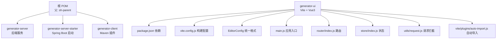
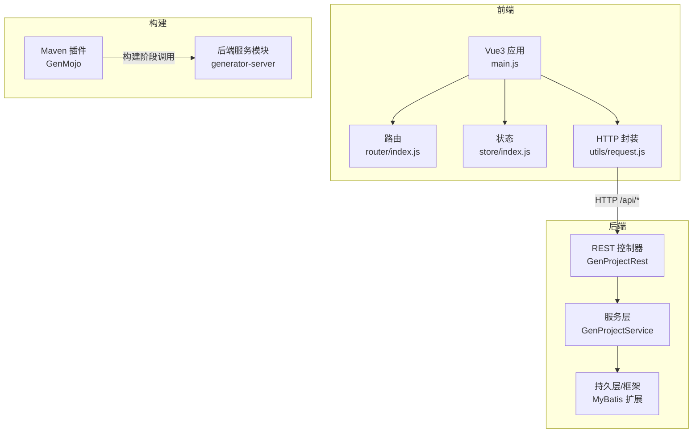
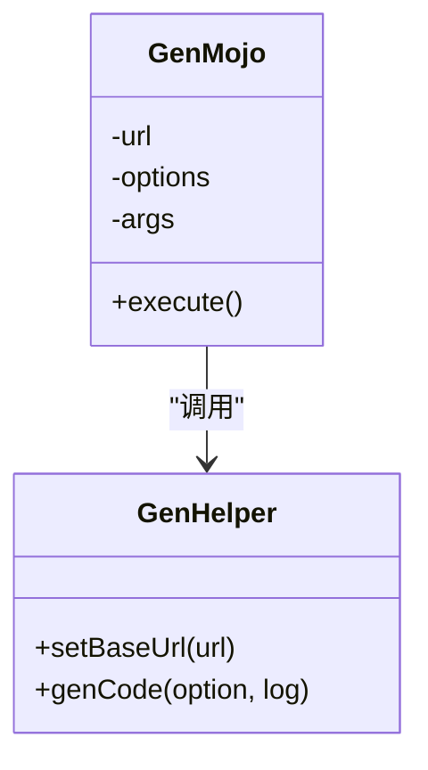
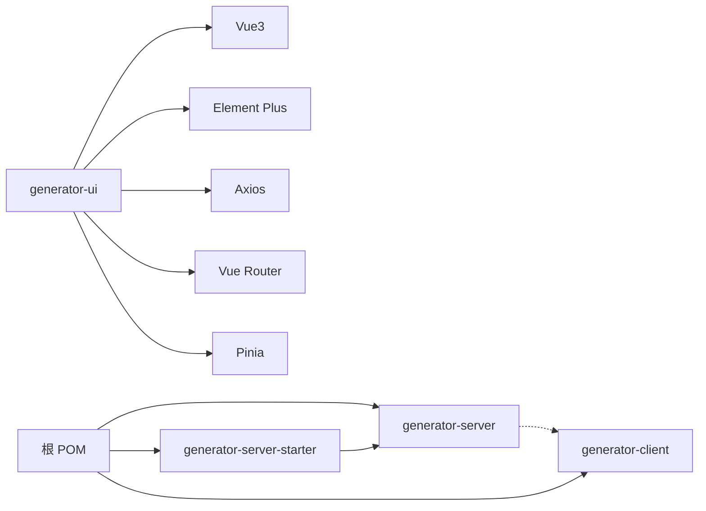

# 代码规范

<cite>
**本文引用的文件**
- [pom.xml](file://pom.xml)
- [generator-client/pom.xml](file://generator-client/pom.xml)
- [generator-server/pom.xml](file://generator-server/pom.xml)
- [generator-server-starter/pom.xml](file://generator-server-starter/pom.xml)
- [generator-client/src/main/java/com/wkclz/generator/client/GenMojo.java](file://generator-client/src/main/java/com/wkclz/generator/client/GenMojo.java)
- [generator-server/src/main/java/com/wkclz/generator/server/rest/GenProjectRest.java](file://generator-server/src/main/java/com/wkclz/generator/server/rest/GenProjectRest.java)
- [generator-server/src/main/java/com/wkclz/generator/server/service/GenProjectService.java](file://generator-server/src/main/java/com/wkclz/generator/server/service/GenProjectService.java)
- [generator-ui/package.json](file://generator-ui/package.json)
- [generator-ui/vite.config.js](file://generator-ui/vite.config.js)
- [generator-ui/.editorconfig](file://generator-ui/.editorconfig)
- [generator-ui/src/main.js](file://generator-ui/src/main.js)
- [generator-ui/src/utils/request.js](file://generator-ui/src/utils/request.js)
- [generator-ui/src/router/index.js](file://generator-ui/src/router/index.js)
- [generator-ui/src/store/index.js](file://generator-ui/src/store/index.js)
- [generator-ui/vite/plugins/auto-import.js](file://generator-ui/vite/plugins/auto-import.js)
</cite>

## 目录
1. [引言](#引言)
2. [项目结构](#项目结构)
3. [核心组件](#核心组件)
4. [架构总览](#架构总览)
5. [详细组件分析](#详细组件分析)
6. [依赖分析](#依赖分析)
7. [性能考虑](#性能考虑)
8. [故障排查指南](#故障排查指南)
9. [结论](#结论)
10. [附录](#附录)

## 引言
本规范旨在统一 SH-Generator 项目的 Java 后端、Vue.js 前端、Maven 插件与 Git 提交流程，确保代码一致性、可维护性与可扩展性。内容涵盖命名约定、代码格式化、注释与异常处理、前端编码与样式、Maven 插件开发、Git 提交规范以及代码质量工具的配置与使用建议。

## 项目结构
项目采用多模块 Maven 结构，包含后端服务模块、启动模块与 Maven 插件客户端模块；前端采用 Vite + Vue3 + Element Plus 技术栈，并通过 EditorConfig 统一基础格式。

图表来源
- [pom.xml:1-35](file://pom.xml#L1-L35)
- [generator-server/pom.xml:1-58](file://generator-server/pom.xml#L1-L58)
- [generator-server-starter/pom.xml:1-52](file://generator-server-starter/pom.xml#L1-L52)
- [generator-client/pom.xml:1-75](file://generator-client/pom.xml#L1-L75)
- [generator-ui/package.json:1-53](file://generator-ui/package.json#L1-L53)
- [generator-ui/vite.config.js:1-72](file://generator-ui/vite.config.js#L1-L72)
- [generator-ui/.editorconfig:1-10](file://generator-ui/.editorconfig#L1-L10)
- [generator-ui/src/main.js:1-105](file://generator-ui/src/main.js#L1-L105)
- [generator-ui/src/router/index.js:1-86](file://generator-ui/src/router/index.js#L1-L86)
- [generator-ui/src/store/index.js:1-3](file://generator-ui/src/store/index.js#L1-L3)
- [generator-ui/src/utils/request.js:1-155](file://generator-ui/src/utils/request.js#L1-L155)
- [generator-ui/vite/plugins/auto-import.js:1-13](file://generator-ui/vite/plugins/auto-import.js#L1-L13)

章节来源
- [pom.xml:1-35](file://pom.xml#L1-L35)
- [generator-server/pom.xml:1-58](file://generator-server/pom.xml#L1-L58)
- [generator-server-starter/pom.xml:1-52](file://generator-server-starter/pom.xml#L1-L52)
- [generator-client/pom.xml:1-75](file://generator-client/pom.xml#L1-L75)
- [generator-ui/package.json:1-53](file://generator-ui/package.json#L1-L53)
- [generator-ui/vite.config.js:1-72](file://generator-ui/vite.config.js#L1-L72)
- [generator-ui/.editorconfig:1-10](file://generator-ui/.editorconfig#L1-L10)

## 核心组件
- 后端 REST 控制器与服务层：遵循统一响应体与参数校验，使用 Spring MVC 与 MyBatis 扩展。
- Maven 插件：基于 maven-plugin-api 与注解处理器，提供聚合打包阶段的任务执行。
- 前端应用：基于 Vue3 Composition API、Element Plus、Pinia、Vue Router，具备请求拦截与错误处理机制。

章节来源
- [generator-server/src/main/java/com/wkclz/generator/server/rest/GenProjectRest.java:1-79](file://generator-server/src/main/java/com/wkclz/generator/server/rest/GenProjectRest.java#L1-L79)
- [generator-server/src/main/java/com/wkclz/generator/server/service/GenProjectService.java:1-134](file://generator-server/src/main/java/com/wkclz/generator/server/service/GenProjectService.java#L1-L134)
- [generator-client/src/main/java/com/wkclz/generator/client/GenMojo.java:1-42](file://generator-client/src/main/java/com/wkclz/generator/client/GenMojo.java#L1-L42)
- [generator-ui/src/main.js:1-105](file://generator-ui/src/main.js#L1-L105)
- [generator-ui/src/utils/request.js:1-155](file://generator-ui/src/utils/request.js#L1-L155)

## 架构总览
整体采用前后端分离架构：前端通过代理访问后端 API；后端提供 REST 接口；Maven 插件在构建阶段调用后端生成代码。

图表来源
- [generator-ui/src/main.js:1-105](file://generator-ui/src/main.js#L1-L105)
- [generator-ui/src/router/index.js:1-86](file://generator-ui/src/router/index.js#L1-L86)
- [generator-ui/src/store/index.js:1-3](file://generator-ui/src/store/index.js#L1-L3)
- [generator-ui/src/utils/request.js:1-155](file://generator-ui/src/utils/request.js#L1-L155)
- [generator-server/src/main/java/com/wkclz/generator/server/rest/GenProjectRest.java:1-79](file://generator-server/src/main/java/com/wkclz/generator/server/rest/GenProjectRest.java#L1-L79)
- [generator-server/src/main/java/com/wkclz/generator/server/service/GenProjectService.java:1-134](file://generator-server/src/main/java/com/wkclz/generator/server/service/GenProjectService.java#L1-L134)
- [generator-client/src/main/java/com/wkclz/generator/client/GenMojo.java:1-42](file://generator-client/src/main/java/com/wkclz/generator/client/GenMojo.java#L1-L42)

## 详细组件分析

### Java 后端代码规范
- 命名约定
  - 类名：采用帕斯卡命名法，如 Rest 控制器以“Rest”结尾，服务类以“Service”结尾。
  - 方法名：采用驼峰命名法，尽量语义明确，避免缩写。
  - 包名：采用反向域名风格，如 com.wkclz.generator.server。
- 代码格式化
  - 统一使用 EditorConfig，确保缩进、换行、字符集一致。
- 注释规范
  - 类与方法需提供清晰注释，说明职责与关键逻辑。
  - 参数与返回值需标注用途与约束。
- 异常处理
  - 使用统一响应体与断言校验，结合业务异常与参数异常类型，保证错误信息一致。
  - 控制器层对参数进行前置校验，服务层进行业务校验与幂等处理。

章节来源
- [generator-server/src/main/java/com/wkclz/generator/server/rest/GenProjectRest.java:1-79](file://generator-server/src/main/java/com/wkclz/generator/server/rest/GenProjectRest.java#L1-L79)
- [generator-server/src/main/java/com/wkclz/generator/server/service/GenProjectService.java:1-134](file://generator-server/src/main/java/com/wkclz/generator/server/service/GenProjectService.java#L1-L134)
- [.editorconfig:1-10](file://generator-ui/.editorconfig#L1-L10)

### Vue.js 前端代码规范
- 组件命名
  - 组件文件采用帕斯卡命名法，如 Pagination、SvgIcon。
  - 全局注册组件时保持一致的命名风格。
- 样式规范
  - 使用 SCSS，遵循模块化与主题变量，避免全局污染。
  - 统一通过 EditorConfig 保证缩进与换行。
- JavaScript 编码标准
  - 使用 Composition API，保持逻辑内聚。
  - Axios 封装统一拦截器，集中处理错误与状态码。
- TypeScript 使用规范
  - 当前项目未启用 TS，建议在新增模块时逐步引入 ts 定义与类型约束。

章节来源
- [generator-ui/src/main.js:1-105](file://generator-ui/src/main.js#L1-L105)
- [generator-ui/src/utils/request.js:1-155](file://generator-ui/src/utils/request.js#L1-L155)
- [generator-ui/src/router/index.js:1-86](file://generator-ui/src/router/index.js#L1-L86)
- [generator-ui/src/store/index.js:1-3](file://generator-ui/src/store/index.js#L1-L3)
- [generator-ui/.editorconfig:1-10](file://generator-ui/.editorconfig#L1-L10)

### Maven 插件开发规范
- Mojo 类编写
  - 使用注解声明 goal 名称、生命周期阶段与聚合行为。
  - 参数通过注解注入，避免硬编码。
- 参数配置规范
  - 通过 POM 中的 maven-plugin-plugin 配置 goalPrefix，便于调用。
- 插件生命周期管理
  - 在后端模块中以插件形式调用，配置 options 与目标参数。

图表来源
- [generator-client/src/main/java/com/wkclz/generator/client/GenMojo.java:1-42](file://generator-client/src/main/java/com/wkclz/generator/client/GenMojo.java#L1-L42)

章节来源
- [generator-client/src/main/java/com/wkclz/generator/client/GenMojo.java:1-42](file://generator-client/src/main/java/com/wkclz/generator/client/GenMojo.java#L1-L42)
- [generator-client/pom.xml:40-75](file://generator-client/pom.xml#L40-L75)
- [generator-server/pom.xml:42-58](file://generator-server/pom.xml#L42-L58)

### Git 提交规范
- 提交信息格式
  - 类型(scope): 概述
  - 详细说明（可选）
  - 关联 Issue（可选）
- 分支管理策略
  - develop：日常开发
  - feature/*：新功能
  - release/*：发布准备
  - hotfix/*：紧急修复
- 代码审查流程
  - 提交 Pull Request，至少一名开发者审核
  - 通过 CI 校验与静态检查后再合并

（本节为通用实践建议，不直接分析具体文件）

### 代码质量工具配置与使用
- SonarQube
  - 在 CI 中集成扫描，关注覆盖率、重复率与复杂度指标。
- Checkstyle/Spotless
  - 建议在根 POM 中集成插件，统一 Java 代码风格。
- 前端 ESLint/Prettier
  - 建议在前端工程中引入 ESLint 与 Prettier，配合 EditorConfig。
- 质量门禁
  - 在 CI 中设置阈值，阻断低质量代码进入主干。

（本节为通用实践建议，不直接分析具体文件）

## 依赖分析
- 模块间依赖
  - generator-server-starter 依赖 generator-server，作为可启动模块。
  - generator-server 依赖 generator-client 以触发代码生成。
- 外部依赖
  - 前端依赖 Vue3、Element Plus、Axios、Pinia、Vue Router 等。
  - 后端依赖 IAM SDK、MyBatis 扩展、Redis、Web 框架等。

图表来源
- [pom.xml:1-35](file://pom.xml#L1-L35)
- [generator-server-starter/pom.xml:15-28](file://generator-server-starter/pom.xml#L15-L28)
- [generator-server/pom.xml:14-40](file://generator-server/pom.xml#L14-L40)
- [generator-ui/package.json:18-39](file://generator-ui/package.json#L18-L39)

章节来源
- [pom.xml:1-35](file://pom.xml#L1-L35)
- [generator-server-starter/pom.xml:15-28](file://generator-server-starter/pom.xml#L15-L28)
- [generator-server/pom.xml:14-40](file://generator-server/pom.xml#L14-L40)
- [generator-ui/package.json:18-39](file://generator-ui/package.json#L18-L39)

## 性能考虑
- 前端
  - 合理拆分打包，控制 chunk 大小，避免首屏阻塞。
  - 使用懒加载与 keep-alive 缓存页面。
- 后端
  - 控制分页查询与批量更新，避免大事务。
  - 对热点数据使用缓存，减少数据库压力。
- 构建
  - 生产环境关闭 sourcemap，开启压缩与资源哈希命名。

（本节为通用指导，不直接分析具体文件）

## 故障排查指南
- 前端请求失败
  - 检查代理配置与后端接口是否可达。
  - 关注响应拦截器中的状态码与错误提示。
- 后端参数校验失败
  - 控制器层断言与服务层校验需保持一致。
  - 关注统一异常与业务异常的抛出位置。
- 插件执行失败
  - 确认插件目标 URL 与 options 配置正确。
  - 检查日志输出与错误信息。

章节来源
- [generator-ui/src/utils/request.js:1-155](file://generator-ui/src/utils/request.js#L1-L155)
- [generator-server/src/main/java/com/wkclz/generator/server/rest/GenProjectRest.java:1-79](file://generator-server/src/main/java/com/wkclz/generator/server/rest/GenProjectRest.java#L1-L79)
- [generator-server/src/main/java/com/wkclz/generator/server/service/GenProjectService.java:1-134](file://generator-server/src/main/java/com/wkclz/generator/server/service/GenProjectService.java#L1-L134)
- [generator-client/src/main/java/com/wkclz/generator/client/GenMojo.java:1-42](file://generator-client/src/main/java/com/wkclz/generator/client/GenMojo.java#L1-L42)

## 结论
通过统一的命名、格式、注释与异常处理规范，结合前后端与构建工具的最佳实践，能够显著提升 SH-Generator 项目的可维护性与协作效率。建议在后续迭代中逐步完善 TS、ESLint、SonarQube 等工具链，持续优化性能与质量门禁。

## 附录
- 快速检查清单
  - Java：类/方法命名、断言与异常、统一响应体。
  - Vue：组件命名、SCSS 模块化、Axios 拦截器。
  - 插件：Mojo 注解、POM 配置、生命周期阶段。
  - Git：提交信息格式、分支策略、代码审查。
  - 工具：SonarQube、Checkstyle/Spotless、ESLint/Prettier。