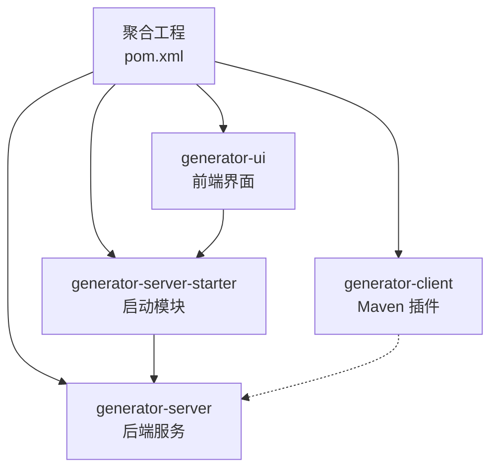
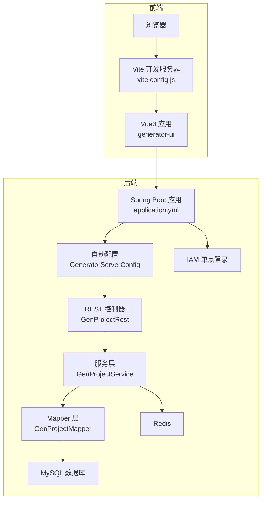
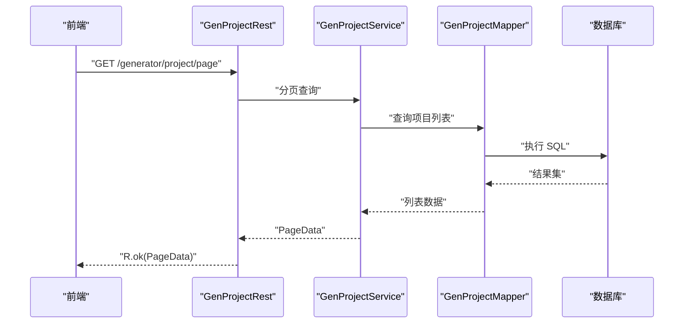
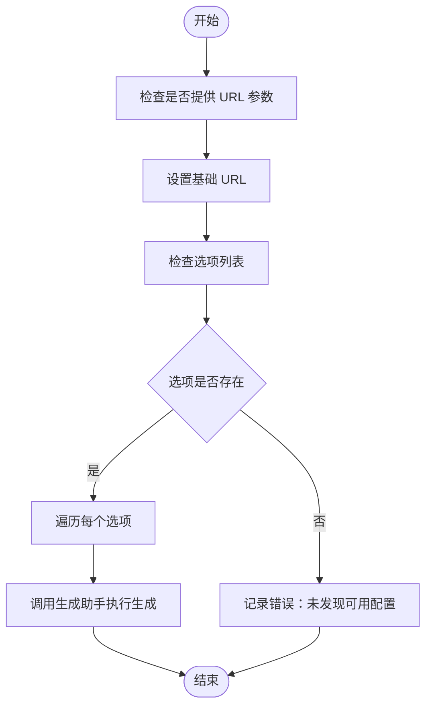
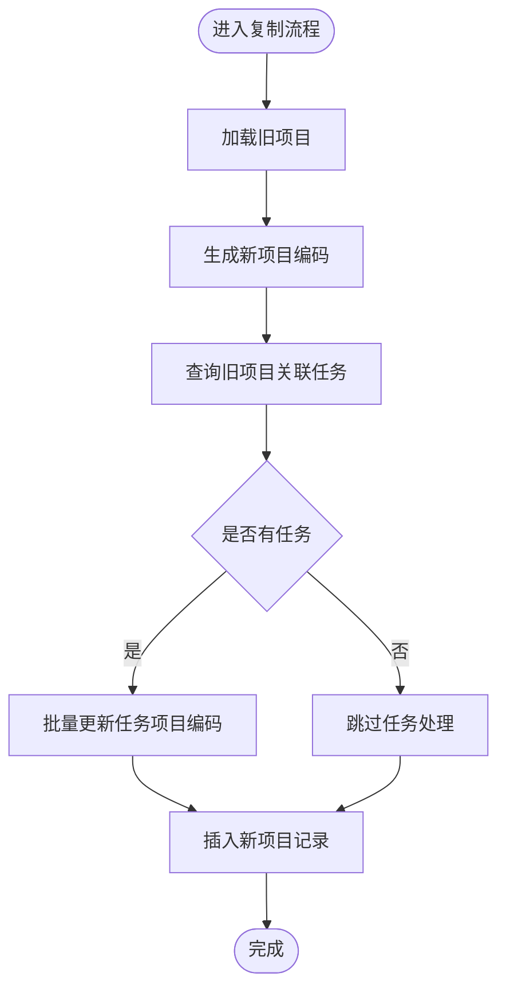
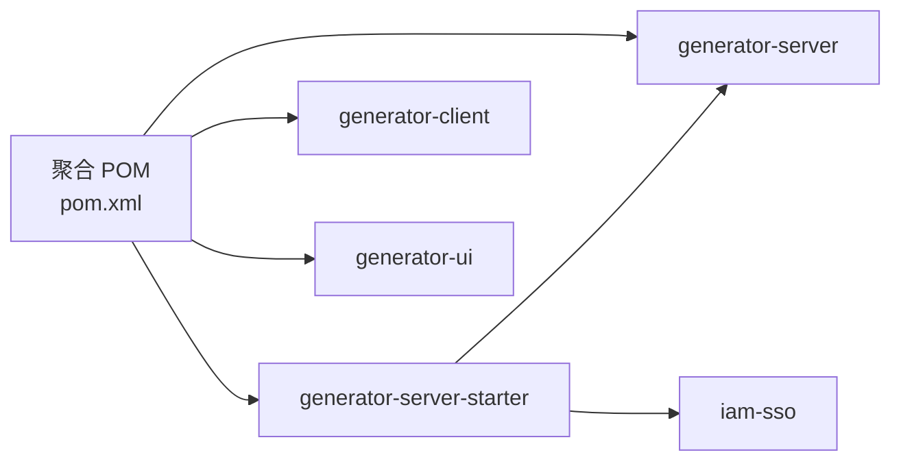

# 开发者指南

<cite>
**本文引用的文件**   
- [pom.xml](file://pom.xml)
- [generator-server-starter/pom.xml](file://generator-server-starter/pom.xml)
- [generator-server-starter/src/main/resources/config/application.yml](file://generator-server-starter/src/main/resources/config/application.yml)
- [generator-server/src/main/java/com/wkclz/generator/server/GeneratorServerConfig.java](file://generator-server/src/main/java/com/wkclz/generator/server/GeneratorServerConfig.java)
- [generator-server/src/main/java/com/wkclz/generator/server/Route.java](file://generator-server/src/main/java/com/wkclz/generator/server/Route.java)
- [generator-server/src/main/resources/META-INF/spring/org.springframework.boot.autoconfigure.AutoConfiguration.imports](file://generator-server/src/main/resources/META-INF/spring/org.springframework.boot.autoconfigure.AutoConfiguration.imports)
- [generator-server/src/main/java/com/wkclz/generator/server/rest/GenProjectRest.java](file://generator-server/src/main/java/com/wkclz/generator/server/rest/GenProjectRest.java)
- [generator-server/src/main/java/com/wkclz/generator/server/service/GenProjectService.java](file://generator-server/src/main/java/com/wkclz/generator/server/service/GenProjectService.java)
- [generator-server/src/main/java/com/wkclz/generator/server/mapper/GenProjectMapper.java](file://generator-server/src/main/java/com/wkclz/generator/server/mapper/GenProjectMapper.java)
- [generator-client/src/main/java/com/wkclz/generator/client/GenMojo.java](file://generator-client/src/main/java/com/wkclz/generator/client/GenMojo.java)
- [generator-ui/package.json](file://generator-ui/package.json)
- [generator-ui/vite.config.js](file://generator-ui/vite.config.js)
- [generator-ui/Dockerfile](file://generator-ui/Dockerfile)
- [.editorconfig](file://generator-ui/.editorconfig)
- [generator-ui/README.md](file://generator-ui/README.md)
</cite>

## 目录
1. [引言](#引言)
2. [项目结构](#项目结构)
3. [核心组件](#核心组件)
4. [架构总览](#架构总览)
5. [详细组件分析](#详细组件分析)
6. [依赖关系分析](#依赖关系分析)
7. [性能考虑](#性能考虑)
8. [调试与测试策略](#调试与测试策略)
9. [常见问题与故障排除](#常见问题与故障排除)
10. [结论](#结论)
11. [附录](#附录)

## 引言
本指南面向 SH-Generator 项目的开发者，提供从环境搭建、构建流程、代码规范、调试与测试到部署运维的完整开发手册。项目采用多模块 Maven 结构，后端基于 Spring Boot，前端基于 Vue3 + Vite，提供代码生成器能力并通过 Maven 插件在 CI/CD 中调用。

## 项目结构
项目采用聚合工程结构，包含以下模块：
- generator-server：后端服务核心模块，包含实体、Mapper、Service、REST 控制器、路由常量与 MyBatis 映射 XML。
- generator-server-starter：启动模块，整合 IAM 单点登录与后端服务，提供 Spring Boot 启动入口与配置。
- generator-client：Maven 插件模块，提供代码生成调用入口，可在构建阶段触发远程生成。
- generator-ui：前端模块，基于 Vue3 + Element Plus + Vite 的可视化界面，提供数据源、模板、项目、任务与日志管理。

图表来源
- [pom.xml:1-35](file://pom.xml#L1-L35)
- [generator-server-starter/pom.xml:1-52](file://generator-server-starter/pom.xml#L1-L52)

章节来源
- [pom.xml:1-35](file://pom.xml#L1-L35)
- [generator-server-starter/pom.xml:1-52](file://generator-server-starter/pom.xml#L1-L52)

## 核心组件
- 后端配置与扫描
  - 自动配置类负责组件扫描与 Mapper 扫描，确保 Service 与 Mapper 注册生效。
  - Spring 自动导入文件声明了自动配置类，保证启动时加载。
- 路由常量
  - 统一定义 REST 接口前缀与各模块路由，便于集中管理与维护。
- 项目服务层
  - 提供分页查询、创建、更新、复制、按编码查询与唯一性校验等逻辑。
- Maven 插件
  - 通过 Mojo 在打包阶段调用远程生成接口，支持传入 URL 与选项列表。

章节来源
- [generator-server/src/main/java/com/wkclz/generator/server/GeneratorServerConfig.java:1-14](file://generator-server/src/main/java/com/wkclz/generator/server/GeneratorServerConfig.java#L1-L14)
- [generator-server/src/main/resources/META-INF/spring/org.springframework.boot.autoconfigure.AutoConfiguration.imports:1-2](file://generator-server/src/main/resources/META-INF/spring/org.springframework.boot.autoconfigure.AutoConfiguration.imports#L1-L2)
- [generator-server/src/main/java/com/wkclz/generator/server/Route.java:1-89](file://generator-server/src/main/java/com/wkclz/generator/server/Route.java#L1-L89)
- [generator-server/src/main/java/com/wkclz/generator/server/service/GenProjectService.java:1-134](file://generator-server/src/main/java/com/wkclz/generator/server/service/GenProjectService.java#L1-L134)
- [generator-client/src/main/java/com/wkclz/generator/client/GenMojo.java:1-42](file://generator-client/src/main/java/com/wkclz/generator/client/GenMojo.java#L1-L42)

## 架构总览
整体架构分为三层：前端 UI、后端服务与外部依赖（数据库、Redis、IAM）。前端通过代理访问后端接口，后端通过 MyBatis 访问数据库，使用 Redis 生成 ID，通过 IAM 提供单点登录能力。

图表来源
- [generator-ui/vite.config.js:1-72](file://generator-ui/vite.config.js#L1-L72)
- [generator-server-starter/src/main/resources/config/application.yml:1-52](file://generator-server-starter/src/main/resources/config/application.yml#L1-L52)
- [generator-server/src/main/java/com/wkclz/generator/server/GeneratorServerConfig.java:1-14](file://generator-server/src/main/java/com/wkclz/generator/server/GeneratorServerConfig.java#L1-L14)
- [generator-server/src/main/java/com/wkclz/generator/server/rest/GenProjectRest.java:1-79](file://generator-server/src/main/java/com/wkclz/generator/server/rest/GenProjectRest.java#L1-L79)
- [generator-server/src/main/java/com/wkclz/generator/server/service/GenProjectService.java:1-134](file://generator-server/src/main/java/com/wkclz/generator/server/service/GenProjectService.java#L1-L134)
- [generator-server/src/main/java/com/wkclz/generator/server/mapper/GenProjectMapper.java:1-15](file://generator-server/src/main/java/com/wkclz/generator/server/mapper/GenProjectMapper.java#L1-L15)

## 详细组件分析

### 后端 REST 控制器与服务层交互
- 控制器接收请求，调用服务层处理业务，并返回统一响应包装。
- 服务层执行参数校验、唯一性检查、复制逻辑与 ID 生成等。
- Mapper 负责数据持久化，配合分页查询工具实现分页。

图表来源
- [generator-server/src/main/java/com/wkclz/generator/server/rest/GenProjectRest.java:22-33](file://generator-server/src/main/java/com/wkclz/generator/server/rest/GenProjectRest.java#L22-L33)
- [generator-server/src/main/java/com/wkclz/generator/server/service/GenProjectService.java:31-33](file://generator-server/src/main/java/com/wkclz/generator/server/service/GenProjectService.java#L31-L33)
- [generator-server/src/main/java/com/wkclz/generator/server/mapper/GenProjectMapper.java:12](file://generator-server/src/main/java/com/wkclz/generator/server/mapper/GenProjectMapper.java#L12)

章节来源
- [generator-server/src/main/java/com/wkclz/generator/server/rest/GenProjectRest.java:1-79](file://generator-server/src/main/java/com/wkclz/generator/server/rest/GenProjectRest.java#L1-L79)
- [generator-server/src/main/java/com/wkclz/generator/server/service/GenProjectService.java:1-134](file://generator-server/src/main/java/com/wkclz/generator/server/service/GenProjectService.java#L1-L134)
- [generator-server/src/main/java/com/wkclz/generator/server/mapper/GenProjectMapper.java:1-15](file://generator-server/src/main/java/com/wkclz/generator/server/mapper/GenProjectMapper.java#L1-L15)

### Maven 插件调用流程
- 插件在 PACKAGE 生命周期阶段执行，读取配置参数，遍历选项并调用生成助手发起远程生成。

图表来源
- [generator-client/src/main/java/com/wkclz/generator/client/GenMojo.java:27-40](file://generator-client/src/main/java/com/wkclz/generator/client/GenMojo.java#L27-L40)

章节来源
- [generator-client/src/main/java/com/wkclz/generator/client/GenMojo.java:1-42](file://generator-client/src/main/java/com/wkclz/generator/client/GenMojo.java#L1-L42)

### 项目服务层算法
- 复制流程：生成新项目编码，查询旧项目关联的任务并批量更新或插入，最后插入新项目记录。
- 唯一性检查：当提供项目编码时，查询是否存在相同编码且不同主键的记录，避免重复。

图表来源
- [generator-server/src/main/java/com/wkclz/generator/server/service/GenProjectService.java:72-93](file://generator-server/src/main/java/com/wkclz/generator/server/service/GenProjectService.java#L72-L93)

章节来源
- [generator-server/src/main/java/com/wkclz/generator/server/service/GenProjectService.java:72-93](file://generator-server/src/main/java/com/wkclz/generator/server/service/GenProjectService.java#L72-L93)

## 依赖关系分析
- 聚合工程统一管理版本与模块依赖。
- 启动模块依赖后端服务模块与 IAM 单点登录模块。
- 前端模块通过 Vite 构建，使用代理将 /api 请求转发至后端服务。

图表来源
- [pom.xml:20-24](file://pom.xml#L20-L24)
- [generator-server-starter/pom.xml:15-26](file://generator-server-starter/pom.xml#L15-L26)

章节来源
- [pom.xml:1-35](file://pom.xml#L1-L35)
- [generator-server-starter/pom.xml:1-52](file://generator-server-starter/pom.xml#L1-L52)

## 性能考虑
- 前端构建优化
  - 使用 Vite 构建，开启产物分块命名策略与内联 SourceMap（开发模式）。
  - 通过代理将 /api 请求转发至后端，减少跨域与额外中间层。
- 后端性能
  - MyBatis 开启下划线转驼峰映射，提升字段映射效率。
  - 分页插件配置合理化，避免大分页导致的性能问题。
- 容器化部署
  - 前端使用 Nginx 静态托管，结合压缩插件减小传输体积。

章节来源
- [generator-ui/vite.config.js:25-53](file://generator-ui/vite.config.js#L25-L53)
- [generator-server-starter/src/main/resources/config/application.yml:14-26](file://generator-server-starter/src/main/resources/config/application.yml#L14-L26)
- [generator-ui/Dockerfile:1-15](file://generator-ui/Dockerfile#L1-L15)

## 调试与测试策略
- 开发环境调试
  - 前端：使用 Vite 开发服务器，端口默认 80，配置代理将 /api 转发至后端 8080。
  - 后端：Spring Boot 启动模块提供健康检查端口与指标暴露，便于本地观测。
- 测试建议
  - 单元测试：针对服务层方法（如分页、创建、复制、唯一性检查）编写断言覆盖。
  - 集成测试：通过 REST 控制器层发起真实请求，验证路由、参数校验与返回格式。
  - 性能测试：对分页查询与批量任务更新进行压力测试，关注数据库索引与分页大小。
- 代码质量
  - 前端统一缩进与编码规范，遵循 EditorConfig。
  - 后端统一响应包装与异常处理，保持接口一致性。

章节来源
- [generator-ui/vite.config.js:41-53](file://generator-ui/vite.config.js#L41-L53)
- [generator-server-starter/src/main/resources/config/application.yml:29-52](file://generator-server-starter/src/main/resources/config/application.yml#L29-L52)
- [.editorconfig:1-10](file://generator-ui/.editorconfig#L1-L10)

## 常见问题与故障排除
- 前端无法访问后端接口
  - 检查 Vite 代理配置是否正确指向后端地址与端口。
  - 确认后端 CORS 与跨域策略未阻断请求。
- 启动模块无法连接数据库
  - 检查 application.yml 中数据源驱动与连接参数。
  - 确认数据库服务可用与网络连通。
- Maven 插件未执行或无输出
  - 确认插件在 PACKAGE 生命周期阶段被触发。
  - 检查传入的 URL 与选项列表参数是否正确。
- 前端构建失败或资源加载错误
  - 清理 node_modules 与构建缓存后重试。
  - 检查依赖版本与 Node.js 版本兼容性。

章节来源
- [generator-ui/vite.config.js:45-52](file://generator-ui/vite.config.js#L45-L52)
- [generator-server-starter/src/main/resources/config/application.yml:9-12](file://generator-server-starter/src/main/resources/config/application.yml#L9-L12)
- [generator-client/src/main/java/com/wkclz/generator/client/GenMojo.java:27-40](file://generator-client/src/main/java/com/wkclz/generator/client/GenMojo.java#L27-L40)

## 结论
本指南提供了从环境搭建到部署运维的全流程开发指引。建议在开发过程中严格遵循统一的代码规范与测试策略，利用现有模块化结构与工具链提升开发效率与系统稳定性。

## 附录

### 开发环境搭建步骤
- Java 与 Maven
  - JDK 版本要求与 Maven 编译目标版本已在聚合 POM 中配置。
- IDE 配置
  - 导入聚合工程，启用 Maven 自动导入与 Lombok 支持（如使用）。
- 数据库初始化
  - 准备 MySQL 数据库，应用配置中已声明驱动与 MyBatis Mapper 路径。
- 前端依赖
  - 使用包管理器安装依赖，启动开发服务器进行联调。

章节来源
- [pom.xml:30-33](file://pom.xml#L30-L33)
- [generator-server-starter/src/main/resources/config/application.yml:10-18](file://generator-server-starter/src/main/resources/config/application.yml#L10-L18)
- [generator-ui/package.json:1-53](file://generator-ui/package.json#L1-L53)

### 项目构建流程
- 多模块构建
  - 在聚合根目录执行构建，Maven 将按模块顺序构建并打包。
- 启动模块打包
  - 启动模块启用 Spring Boot Maven 插件，跳过安装与部署插件以仅生成可执行包。
- 前端构建与部署
  - 使用 Vite 构建前端产物，容器化部署使用 Nginx 静态托管。

章节来源
- [pom.xml:20-24](file://pom.xml#L20-L24)
- [generator-server-starter/pom.xml:30-50](file://generator-server-starter/pom.xml#L30-L50)
- [generator-ui/vite.config.js:25-39](file://generator-ui/vite.config.js#L25-L39)
- [generator-ui/Dockerfile:1-15](file://generator-ui/Dockerfile#L1-L15)

### 代码规范与最佳实践
- 命名约定
  - 后端包结构清晰，REST 控制器、服务层、Mapper 层职责明确。
  - 路由常量集中管理，统一前缀与语义化命名。
- 注释规范
  - 控制器与服务方法应包含必要的业务说明与参数约束。
- 代码审查标准
  - 关注参数校验、异常处理、事务边界与幂等性。
  - 对外接口需保持稳定，避免破坏性变更。

章节来源
- [generator-server/src/main/java/com/wkclz/generator/server/Route.java:6-89](file://generator-server/src/main/java/com/wkclz/generator/server/Route.java#L6-L89)
- [generator-server/src/main/java/com/wkclz/generator/server/rest/GenProjectRest.java:64-75](file://generator-server/src/main/java/com/wkclz/generator/server/rest/GenProjectRest.java#L64-L75)

### 调试技巧
- 前端调试
  - 利用 Vite 的热更新与代理能力，快速定位接口问题。
- 后端调试
  - 通过健康检查端点与日志观察服务状态。
- 插件调试
  - 在插件执行前打印关键参数，确认远程地址与选项列表。

章节来源
- [generator-ui/vite.config.js:41-53](file://generator-ui/vite.config.js#L41-L53)
- [generator-server-starter/src/main/resources/config/application.yml:29-52](file://generator-server-starter/src/main/resources/config/application.yml#L29-L52)
- [generator-client/src/main/java/com/wkclz/generator/client/GenMojo.java:27-40](file://generator-client/src/main/java/com/wkclz/generator/client/GenMojo.java#L27-L40)

### 测试策略
- 单元测试
  - 针对服务层方法编写覆盖用例，重点覆盖分支与边界条件。
- 集成测试
  - 通过 REST 控制器发起端到端请求，验证路由与响应。
- 性能测试
  - 对高频接口进行并发与吞吐测试，评估数据库与缓存策略。

章节来源
- [generator-server/src/main/java/com/wkclz/generator/server/service/GenProjectService.java:31-33](file://generator-server/src/main/java/com/wkclz/generator/server/service/GenProjectService.java#L31-L33)
- [generator-server/src/main/java/com/wkclz/generator/server/rest/GenProjectRest.java:22-33](file://generator-server/src/main/java/com/wkclz/generator/server/rest/GenProjectRest.java#L22-L33)

### 部署与运维
- 容器化
  - 前端使用 Nginx 静态托管，构建产物拷贝至容器并加载 Nginx 配置。
- 健康检查
  - 启动模块暴露独立管理端口与健康探针，便于容器编排与监控。

章节来源
- [generator-ui/Dockerfile:1-15](file://generator-ui/Dockerfile#L1-L15)
- [generator-server-starter/src/main/resources/config/application.yml:29-52](file://generator-server-starter/src/main/resources/config/application.yml#L29-L52)