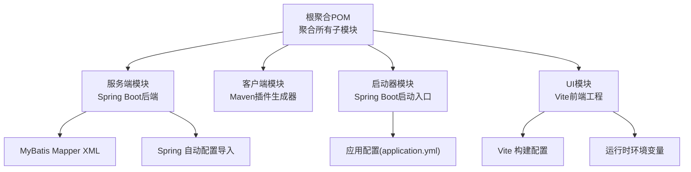
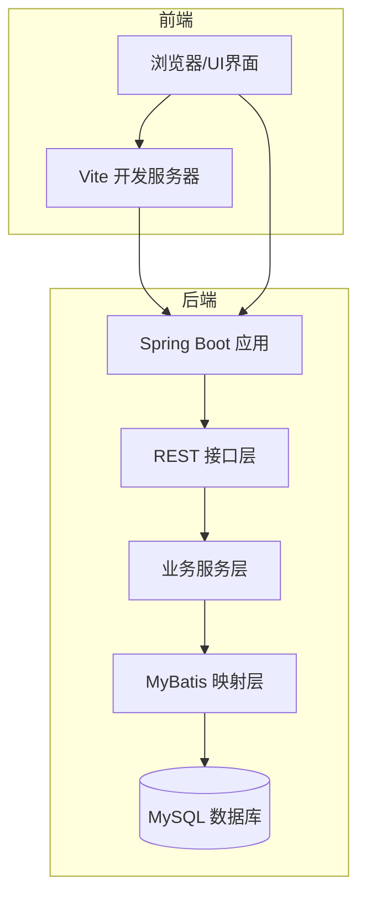
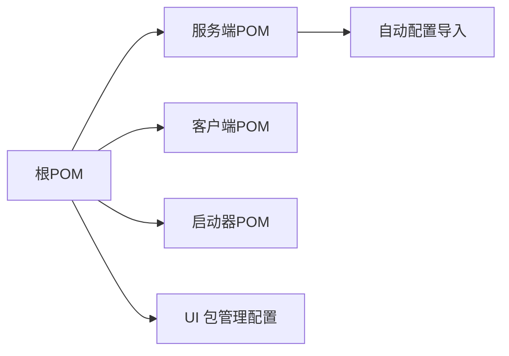

# 环境搭建

<cite>
**本文引用的文件**
- [根目录聚合POM](file://pom.xml)
- [服务端聚合POM](file://generator-server/pom.xml)
- [客户端模块POM](file://generator-client/pom.xml)
- [启动器模块POM](file://generator-server-starter/pom.xml)
- [UI包管理配置](file://generator-ui/package.json)
- [启动器应用配置](file://generator-server-starter/src/main/resources/config/application.yml)
- [服务端自动配置导入](file://generator-server/src/main/resources/META-INF/spring/org.springframework.boot.autoconfigure.AutoConfiguration.imports)
- [UI构建配置](file://generator-ui/vite.config.js)
- [UI入口页面](file://generator-ui/index.html)
- [UI运行时环境变量](file://generator-ui/env.js)
</cite>

## 目录
1. [简介](#简介)
2. [项目结构](#项目结构)
3. [核心组件](#核心组件)
4. [架构总览](#架构总览)
5. [详细组件分析](#详细组件分析)
6. [依赖分析](#依赖分析)
7. [性能考虑](#性能考虑)
8. [故障排除指南](#故障排除指南)
9. [结论](#结论)
10. [附录](#附录)

## 简介
本指南面向SH-Generator项目的开发者，提供从硬件到软件、从依赖安装到IDE配置、从数据库初始化到环境验证的完整开发环境搭建流程。通过遵循本指南，您可以在本地快速搭建可运行的开发环境，并解决常见的环境问题。

## 项目结构
SH-Generator采用多模块Maven工程组织，包含服务端、客户端、UI与启动器四个主要模块，配合前端Vite构建系统与Spring Boot自动装配机制。

图表来源
- [根目录聚合POM](file://pom.xml)
- [服务端聚合POM](file://generator-server/pom.xml)
- [启动器应用配置](file://generator-server-starter/src/main/resources/config/application.yml)
- [UI构建配置](file://generator-ui/vite.config.js)
- [UI运行时环境变量](file://generator-ui/env.js)

章节来源
- [根目录聚合POM](file://pom.xml)
- [服务端聚合POM](file://generator-server/pom.xml)
- [启动器模块POM](file://generator-server-starter/pom.xml)
- [UI包管理配置](file://generator-ui/package.json)

## 核心组件
- 服务端模块：基于Spring Boot的后端服务，负责数据源管理、任务调度、模板生成与日志记录。
- 客户端模块：Maven插件形式的代码生成器，用于在构建阶段执行代码生成任务。
- 启动器模块：Spring Boot启动入口，提供应用配置与运行参数。
- UI模块：基于Vite的前端界面，提供数据源、项目、模板与任务的可视化管理。

章节来源
- [服务端聚合POM](file://generator-server/pom.xml)
- [客户端模块POM](file://generator-client/pom.xml)
- [启动器模块POM](file://generator-server-starter/pom.xml)
- [UI包管理配置](file://generator-ui/package.json)

## 架构总览
下图展示了SH-Generator的典型开发环境部署拓扑：前端UI通过HTTP访问后端REST接口；后端服务连接数据库并调用客户端模块进行代码生成；启动器模块提供Spring Boot应用上下文。

图表来源
- [启动器应用配置](file://generator-server-starter/src/main/resources/config/application.yml)
- [服务端自动配置导入](file://generator-server/src/main/resources/META-INF/spring/org.springframework.boot.autoconfigure.AutoConfiguration.imports)

## 详细组件分析

### 服务端模块（Spring Boot）
- 模块职责：提供REST接口、业务逻辑与数据持久化能力。
- 关键特性：使用Spring Boot自动装配，集成MyBatis进行数据库操作。
- 配置要点：通过application.yml集中管理数据库连接、端口与日志级别等。

章节来源
- [服务端聚合POM](file://generator-server/pom.xml)
- [服务端自动配置导入](file://generator-server/src/main/resources/META-INF/spring/org.springframework.boot.autoconfigure.AutoConfiguration.imports)
- [启动器应用配置](file://generator-server-starter/src/main/resources/config/application.yml)

### 客户端模块（Maven插件）
- 模块职责：作为Maven插件，在构建生命周期中触发代码生成任务。
- 关键特性：通过Maven坐标引入，支持在CI/CD流水线中自动化执行。

章节来源
- [客户端模块POM](file://generator-client/pom.xml)

### 启动器模块（Spring Boot启动）
- 模块职责：定义Spring Boot应用入口类与默认配置。
- 关键特性：提供application.yml配置文件，便于统一管理环境变量与数据库连接。

章节来源
- [启动器模块POM](file://generator-server-starter/pom.xml)
- [启动器应用配置](file://generator-server-starter/src/main/resources/config/application.yml)

### UI模块（Vite前端）
- 模块职责：提供用户交互界面，管理数据源、项目、模板与任务。
- 关键特性：使用Vite进行开发与打包，支持热更新与按需加载。

章节来源
- [UI包管理配置](file://generator-ui/package.json)
- [UI构建配置](file://generator-ui/vite.config.js)
- [UI入口页面](file://generator-ui/index.html)
- [UI运行时环境变量](file://generator-ui/env.js)

## 依赖分析
- Maven聚合关系：根POM聚合服务端、客户端、启动器与UI模块，确保统一版本与构建顺序。
- 前端依赖：package.json声明了UI所需的依赖与脚本命令。
- Spring自动装配：通过META-INF下的自动配置导入文件启用相关功能。

图表来源
- [根目录聚合POM](file://pom.xml)
- [服务端聚合POM](file://generator-server/pom.xml)
- [客户端模块POM](file://generator-client/pom.xml)
- [启动器模块POM](file://generator-server-starter/pom.xml)
- [UI包管理配置](file://generator-ui/package.json)
- [服务端自动配置导入](file://generator-server/src/main/resources/META-INF/spring/org.springframework.boot.autoconfigure.AutoConfiguration.imports)

章节来源
- [根目录聚合POM](file://pom.xml)
- [服务端聚合POM](file://generator-server/pom.xml)
- [客户端模块POM](file://generator-client/pom.xml)
- [启动器模块POM](file://generator-server-starter/pom.xml)
- [UI包管理配置](file://generator-ui/package.json)
- [服务端自动配置导入](file://generator-server/src/main/resources/META-INF/spring/org.springframework.boot.autoconfigure.AutoConfiguration.imports)

## 性能考虑
- 前端开发体验：Vite提供快速冷启动与热更新，建议在开发时开启相应模式以提升效率。
- 后端启动时间：合理配置Spring Boot自动装配与懒加载策略，避免不必要的Bean初始化。
- 数据库连接池：根据并发量调整连接池大小与超时参数，减少请求等待时间。

## 故障排除指南
- 前端依赖安装失败
  - 症状：执行npm install时报错或部分依赖无法解析。
  - 处理：检查网络代理与npm镜像源；清理缓存后重试；确认package.json中的依赖版本兼容性。
- 后端启动失败
  - 症状：Spring Boot应用无法正常启动，提示数据库连接异常或端口占用。
  - 处理：核对application.yml中的数据库连接信息；确认MySQL服务已启动且端口可用；检查防火墙与安全组规则。
- 生成器任务异常
  - 症状：客户端插件执行失败或生成结果不符合预期。
  - 处理：检查Maven插件坐标与版本；确认数据源配置正确；查看日志定位具体错误位置。
- UI界面空白或资源加载失败
  - 症状：浏览器打开页面白屏或静态资源404。
  - 处理：确认Vite开发服务器已启动；检查index.html与env.js中的API地址；核对CORS与反向代理配置。

章节来源
- [启动器应用配置](file://generator-server-starter/src/main/resources/config/application.yml)
- [UI入口页面](file://generator-ui/index.html)
- [UI运行时环境变量](file://generator-ui/env.js)

## 结论
通过本指南，您可以完成SH-Generator项目的开发环境搭建与基础配置。建议在本地先完成前端与后端的基本联调，再逐步完善数据库初始化与生产环境部署细节。遇到问题时，优先检查配置文件与依赖版本，结合日志进行定位排查。

## 附录

### 硬件与软件要求
- 操作系统：Windows/Linux/macOS（推荐最新长期支持版本）
- JDK：Java 8 或 Java 17（建议使用LTS版本）
- Maven：3.6+（确保settings.xml配置正确）
- Node.js：16.x 或 18.x（建议使用长期支持版本）
- MySQL：5.7+ 或 8.0+（需支持JSON与InnoDB引擎）

### 依赖安装步骤
- Maven依赖
  - 在项目根目录执行构建命令，确保所有模块依赖下载完成。
  - 如需离线开发，提前在本地仓库准备必要依赖。
- npm依赖
  - 在generator-ui目录执行安装命令，确保依赖完整。
  - 若网络受限，可配置npm镜像源或使用代理。
- 数据库驱动
  - 确保MySQL Connector/J版本与JDK兼容。
  - 将驱动jar包放置于Maven本地仓库或项目lib目录（如自定义打包需要）。

章节来源
- [根目录聚合POM](file://pom.xml)
- [UI包管理配置](file://generator-ui/package.json)
- [启动器应用配置](file://generator-server-starter/src/main/resources/config/application.yml)

### IDE配置要求
- IntelliJ IDEA
  - 导入根POM为Maven项目，启用“Use plugin registry”与“Import Maven projects automatically”。
  - 安装Lombok、MyBatisX、Rainbow Brackets等常用插件。
  - 配置代码风格：使用EditorConfig与Google JavaFormat或Spotless。
- Eclipse
  - 使用Maven项目导入向导，选择根POM。
  - 安装m2eclipse与Buildship插件，启用Annotation Processing。
  - 配置代码格式化：参考EditorConfig或使用Spring Tools Suite的代码规范。

### 数据库初始化与配置
- 创建数据库与用户
  - 登录MySQL，创建数据库与专用用户，并授予相应权限。
- 初始化表结构
  - 使用项目提供的SQL脚本初始化表结构（如存在迁移脚本，请按顺序执行）。
- 连接配置
  - 在application.yml中配置数据库URL、用户名、密码与连接池参数。
  - 确认字符集与时区设置符合项目要求。

章节来源
- [启动器应用配置](file://generator-server-starter/src/main/resources/config/application.yml)

### 环境验证步骤
- 启动后端服务
  - 使用Maven命令启动Spring Boot应用，访问健康检查端点确认服务状态。
- 启动前端开发服务器
  - 在generator-ui目录启动Vite开发服务器，访问默认端口确认页面加载。
- 联调测试
  - 在UI中添加数据源并执行一次生成任务，检查日志与输出结果。
- 数据库连通性
  - 使用数据库管理工具验证表结构与数据写入情况。

章节来源
- [启动器应用配置](file://generator-server-starter/src/main/resources/config/application.yml)
- [UI入口页面](file://generator-ui/index.html)