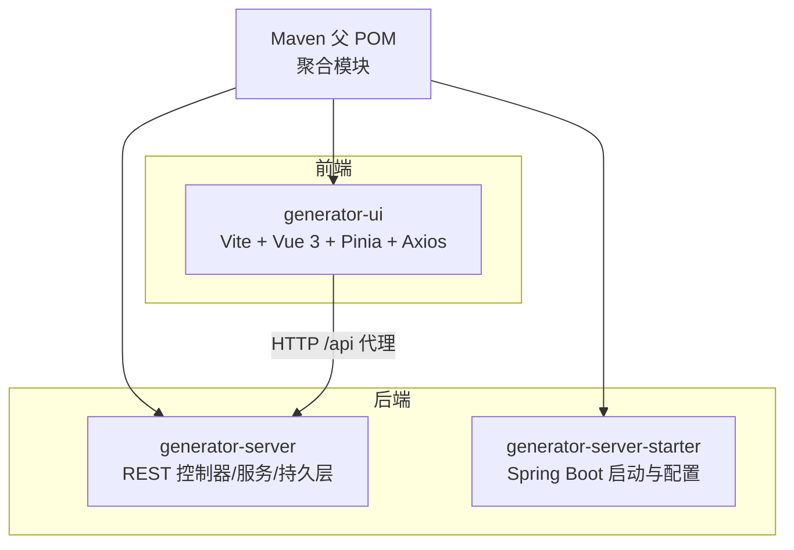
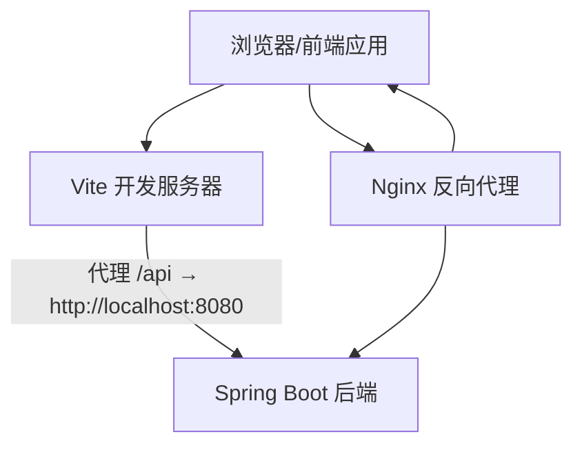
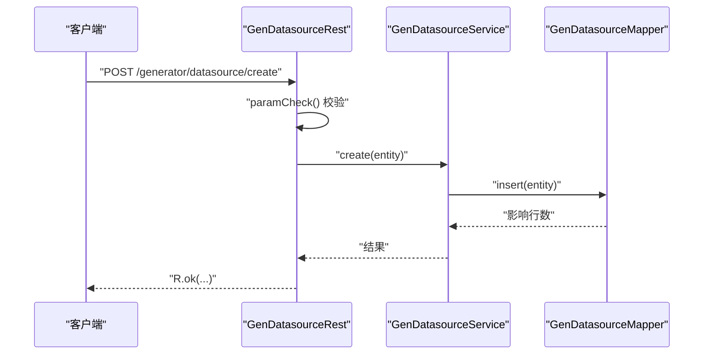
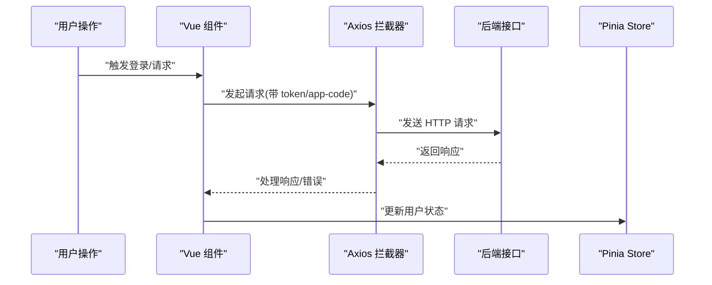
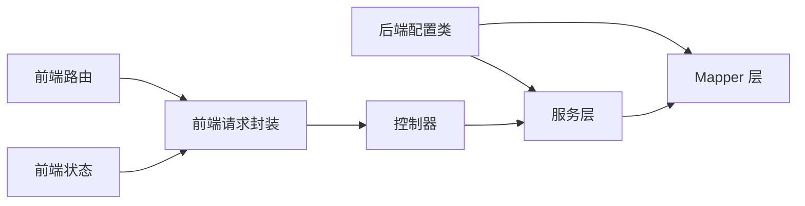

# 调试与测试

<cite>
**本文引用的文件**
- [pom.xml](file://pom.xml)
- [application.yml](file://generator-server-starter/src/main/resources/config/application.yml)
- [GeneratorServerConfig.java](file://generator-server/src/main/java/com/wkclz/generator/server/GeneratorServerConfig.java)
- [Route.java](file://generator-server/src/main/java/com/wkclz/generator/server/Route.java)
- [GenDatasourceRest.java](file://generator-server/src/main/java/com/wkclz/generator/server/rest/GenDatasourceRest.java)
- [GenDatasourceService.java](file://generator-server/src/main/java/com/wkclz/generator/server/service/GenDatasourceService.java)
- [package.json](file://generator-ui/package.json)
- [vite.config.js](file://generator-ui/vite.config.js)
- [request.js](file://generator-ui/src/utils/request.js)
- [user.js](file://generator-ui/src/store/modules/user.js)
- [index.js](file://generator-ui/src/router/index.js)
- [main.js](file://generator-ui/src/main.js)
- [nginx.conf](file://generator-ui/nginx.conf)
</cite>

## 目录
1. [简介](#简介)
2. [项目结构](#项目结构)
3. [核心组件](#核心组件)
4. [架构总览](#架构总览)
5. [详细组件分析](#详细组件分析)
6. [依赖分析](#依赖分析)
7. [性能考虑](#性能考虑)
8. [故障排查指南](#故障排查指南)
9. [结论](#结论)
10. [附录](#附录)

## 简介
本指南面向 SH-Generator 项目的后端与前端调试与测试实践，覆盖以下主题：
- 后端 Spring Boot 应用的断点调试、数据库连接调试、API 接口测试与日志分析
- 前端 Vue.js 应用的组件调试、浏览器开发者工具使用、网络请求调试与状态管理调试
- 单元测试与集成测试设计方法（含 JUnit/Mock 与 API/数据库/E2E 策略）
- 性能与压力测试方法
- 常见问题诊断与解决技巧

## 项目结构
项目采用多模块 Maven 结构，包含后端服务模块、启动器模块与前端 UI 模块；前端使用 Vite 构建与代理，后端通过 Spring Boot 提供 REST API。

图表来源
- [pom.xml:20-24](file://pom.xml#L20-L24)
- [application.yml:1-52](file://generator-server-starter/src/main/resources/config/application.yml#L1-L52)
- [vite.config.js:45-52](file://generator-ui/vite.config.js#L45-L52)

章节来源
- [pom.xml:18-24](file://pom.xml#L18-L24)
- [application.yml:1-52](file://generator-server-starter/src/main/resources/config/application.yml#L1-L52)
- [vite.config.js:41-53](file://generator-ui/vite.config.js#L41-L53)

## 核心组件
- 后端配置与扫描
  - 组件扫描与 Mapper 扫描通过自定义配置类启用，确保服务与 Mapper 被容器管理。
- 路由常量
  - 定义统一前缀与各模块接口路径，便于控制器与前端对接。
- REST 控制器
  - 示例：数据源模块控制器，提供分页、详情、新增、更新、删除、选项等接口。
- 服务层
  - 封装分页查询、插入、选择性更新、按编码查找等业务逻辑。
- 前端请求封装
  - Axios 实例与拦截器，统一处理鉴权头、重复提交、响应错误、下载等。
- 前端状态与路由
  - Pinia Store 用户模块、Vue Router 路由定义与全局注册。

章节来源
- [GeneratorServerConfig.java:7-11](file://generator-server/src/main/java/com/wkclz/generator/server/GeneratorServerConfig.java#L7-L11)
- [Route.java:6-88](file://generator-server/src/main/java/com/wkclz/generator/server/Route.java#L6-L88)
- [GenDatasourceRest.java:16-82](file://generator-server/src/main/java/com/wkclz/generator/server/rest/GenDatasourceRest.java#L16-L82)
- [GenDatasourceService.java:16-58](file://generator-server/src/main/java/com/wkclz/generator/server/service/GenDatasourceService.java#L16-L58)
- [request.js:17-125](file://generator-ui/src/utils/request.js#L17-L125)
- [user.js:7-88](file://generator-ui/src/store/modules/user.js#L7-L88)
- [index.js:28-85](file://generator-ui/src/router/index.js#L28-L85)
- [main.js:64-104](file://generator-ui/src/main.js#L64-L104)

## 架构总览
后端以 Spring Boot 提供 REST API，前端通过 Vite 开发服务器代理 /api 前缀请求至后端；Nginx 作为静态资源与反向代理入口。

图表来源
- [vite.config.js:45-52](file://generator-ui/vite.config.js#L45-L52)
- [nginx.conf:67-75](file://generator-ui/nginx.conf#L67-L75)

## 详细组件分析

### 后端：数据源模块调试要点
- 断点调试
  - 在控制器层设置断点，观察请求参数绑定与校验；在服务层断点，验证分页查询与选择性更新逻辑。
- 参数校验与异常
  - 控制器对必填字段进行断言校验，若失败可快速定位入参缺失或格式问题。
- 数据库连接
  - 检查数据源驱动、连接串与 MyBatis 映射 XML 是否正确加载；可通过健康检查端点确认服务可用性。
- 日志与监控
  - 启用 Actuator 端点暴露，结合日志查看 SQL 与请求链路；必要时开启 MyBatis 日志输出。

图表来源
- [GenDatasourceRest.java:38-50](file://generator-server/src/main/java/com/wkclz/generator/server/rest/GenDatasourceRest.java#L38-L50)
- [GenDatasourceService.java:27-40](file://generator-server/src/main/java/com/wkclz/generator/server/service/GenDatasourceService.java#L27-L40)

章节来源
- [GenDatasourceRest.java:67-81](file://generator-server/src/main/java/com/wkclz/generator/server/rest/GenDatasourceRest.java#L67-L81)
- [GenDatasourceService.java:31-40](file://generator-server/src/main/java/com/wkclz/generator/server/service/GenDatasourceService.java#L31-L40)
- [application.yml:29-51](file://generator-server-starter/src/main/resources/config/application.yml#L29-L51)

### 前端：组件与状态调试
- 组件调试
  - 使用 Vue Devtools 观察组件层级、Props、状态与事件流；在 main.js 中注册的全局组件有助于定位渲染问题。
- 浏览器开发者工具
  - Network 面板观察 /api 请求与响应；Console 查看拦截器错误与警告；Sources 定位脚本执行位置。
- 网络请求调试
  - request.js 中的请求/响应拦截器统一处理鉴权头、重复提交与错误提示；下载功能支持 Blob 校验与错误回退。
- 状态管理调试
  - Pinia Store 的用户模块负责登录、获取用户信息与登出流程；可在 Actions 中设置断点观察 JWT 解析与路由跳转。

图表来源
- [request.js:25-96](file://generator-ui/src/utils/request.js#L25-L96)
- [user.js:18-34](file://generator-ui/src/store/modules/user.js#L18-L34)

章节来源
- [main.js:64-104](file://generator-ui/src/main.js#L64-L104)
- [request.js:17-125](file://generator-ui/src/utils/request.js#L17-L125)
- [user.js:16-87](file://generator-ui/src/store/modules/user.js#L16-L87)

### 前端：路由与全局配置
- 路由
  - constantRoutes 定义公共页面（登录、404、401 等），动态路由为空；滚动行为与哈希历史模式已配置。
- 全局注册
  - Element Plus、指令、插件、SVG 图标、全局组件与全局方法均在 main.js 中集中初始化。

章节来源
- [index.js:28-85](file://generator-ui/src/router/index.js#L28-L85)
- [main.js:64-104](file://generator-ui/src/main.js#L64-L104)

### 前端：构建与代理
- Vite 代理
  - 将 /api 前缀转发至后端 8080 端口，便于本地联调。
- 构建优化
  - 生产环境关闭内联 SourceMap，分包与文件命名策略已配置，避免大包告警。

章节来源
- [vite.config.js:41-53](file://generator-ui/vite.config.js#L41-L53)
- [vite.config.js:25-39](file://generator-ui/vite.config.js#L25-L39)

### 前端：依赖与运行脚本
- 依赖
  - Vue 3、Element Plus、Axios、Pinia、Monaco Editor 等核心依赖已声明。
- 脚本
  - dev/build/preview 等脚本用于本地开发与预览。

章节来源
- [package.json:8-13](file://generator-ui/package.json#L8-L13)
- [package.json:18-51](file://generator-ui/package.json#L18-L51)

## 依赖分析
- 后端
  - 组件扫描与 Mapper 扫描集中在自定义配置类中，保证服务与映射器被容器发现。
  - 路由常量集中定义，便于前后端契约一致。
- 前端
  - Axios 实例与拦截器集中于 request.js，统一处理鉴权与错误；路由与状态管理分别位于 index.js 与 user.js。

图表来源
- [GeneratorServerConfig.java:7-11](file://generator-server/src/main/java/com/wkclz/generator/server/GeneratorServerConfig.java#L7-L11)
- [Route.java:6-88](file://generator-server/src/main/java/com/wkclz/generator/server/Route.java#L6-L88)
- [GenDatasourceRest.java:16-82](file://generator-server/src/main/java/com/wkclz/generator/server/rest/GenDatasourceRest.java#L16-L82)
- [GenDatasourceService.java:16-58](file://generator-server/src/main/java/com/wkclz/generator/server/service/GenDatasourceService.java#L16-L58)
- [request.js:17-125](file://generator-ui/src/utils/request.js#L17-L125)
- [index.js:28-85](file://generator-ui/src/router/index.js#L28-L85)
- [user.js:7-88](file://generator-ui/src/store/modules/user.js#L7-L88)

章节来源
- [GeneratorServerConfig.java:7-11](file://generator-server/src/main/java/com/wkclz/generator/server/GeneratorServerConfig.java#L7-L11)
- [Route.java:6-88](file://generator-server/src/main/java/com/wkclz/generator/server/Route.java#L6-L88)
- [GenDatasourceRest.java:16-82](file://generator-server/src/main/java/com/wkclz/generator/server/rest/GenDatasourceRest.java#L16-L82)
- [GenDatasourceService.java:16-58](file://generator-server/src/main/java/com/wkclz/generator/server/service/GenDatasourceService.java#L16-L58)
- [request.js:17-125](file://generator-ui/src/utils/request.js#L17-L125)
- [index.js:28-85](file://generator-ui/src/router/index.js#L28-L85)
- [user.js:7-88](file://generator-ui/src/store/modules/user.js#L7-L88)

## 性能考虑
- 前端
  - 合理拆分包与懒加载，关注打包体积与首屏加载；利用 Vite 的内联 SourceMap 仅在开发启用。
- 后端
  - 启用分页插件与合适的方言，避免一次性拉取大量数据；合理设置 MyBatis 映射与缓存策略。
- 网络
  - Nginx 配置启用 gzip、长连接与 keepalive，提升静态资源与 API 的传输效率。

章节来源
- [vite.config.js:25-39](file://generator-ui/vite.config.js#L25-L39)
- [application.yml:20-26](file://generator-server-starter/src/main/resources/config/application.yml#L20-L26)
- [nginx.conf:58-66](file://generator-ui/nginx.conf#L58-L66)

## 故障排查指南

### 后端常见问题
- 数据源连接失败
  - 检查驱动类名与连接串；确认数据库可达与账号权限。
- SQL 映射异常
  - 核对 Mapper XML 路径与命名空间；必要时开启 MyBatis 日志输出辅助定位。
- 接口 404/403
  - 核对路由常量与控制器注解；确认鉴权头是否正确传递。
- 健康检查
  - 通过 Actuator 端点查看服务状态与指标，定位运行时问题。

章节来源
- [application.yml:29-51](file://generator-server-starter/src/main/resources/config/application.yml#L29-L51)
- [Route.java:6-88](file://generator-server/src/main/java/com/wkclz/generator/server/Route.java#L6-L88)

### 前端常见问题
- 代理失效
  - 确认 Vite 代理配置与后端端口一致；检查 /api 前缀是否匹配。
- 请求重复提交
  - request.js 对 POST/PUT 请求做重复提交检测，过大请求会被跳过检测；注意控制请求体大小。
- 登录态过期
  - 401 错误触发重新登录弹窗；检查 Token 设置与刷新机制。
- 下载失败
  - 下载拦截器对 Blob 校验，失败时回退到错误提示；检查后端返回类型与文件名。

章节来源
- [vite.config.js:45-52](file://generator-ui/vite.config.js#L45-L52)
- [request.js:40-68](file://generator-ui/src/utils/request.js#L40-L68)
- [request.js:102-124](file://generator-ui/src/utils/request.js#L102-L124)
- [request.js:127-151](file://generator-ui/src/utils/request.js#L127-L151)

### 日志与监控
- 后端
  - 启用 Actuator 端点，查看健康、指标与重启能力；结合日志定位慢查询与异常。
- 前端
  - Console 输出错误与警告；Network 面板核对状态码与响应体；必要时开启浏览器性能面板分析渲染瓶颈。

章节来源
- [application.yml:29-51](file://generator-server-starter/src/main/resources/config/application.yml#L29-L51)
- [request.js:75-125](file://generator-ui/src/utils/request.js#L75-L125)

## 结论
通过明确的断点调试策略、统一的请求拦截与状态管理、完善的路由与全局配置，以及合理的性能与监控手段，可以高效完成 SH-Generator 的调试与测试工作。建议在开发过程中持续完善单元与集成测试，保障质量与稳定性。

## 附录

### 单元测试与集成测试指南
- 单元测试（后端）
  - 使用 JUnit 与 Spring Test；对服务层进行 Mock（如 Mapper），验证分支逻辑与异常场景。
- 集成测试（后端）
  - 使用 @DataJpaTest 或 @MybatisTest 验证数据库交互；通过 @WebMvcTest 验证控制器行为。
- 前端测试
  - 使用 Vitest/Jest 与 Vue Test Utils 对组件与组合式函数进行单元测试；对 API 封装进行拦截模拟。

[本节为通用指导，无需列出具体文件来源]

### 性能与压力测试
- 前端
  - 使用 Lighthouse/Chrome DevTools Performance 面板评估首屏与交互性能；关注资源加载与重绘。
- 后端
  - 使用 JMeter/Gatling 对关键接口施压；结合 Micrometer 与 Actuator 指标观测 CPU、内存与线程池。
- 端到端测试
  - 使用 Playwright/Cypress 录制用户路径，验证真实交互链路与跨页面状态一致性。

[本节为通用指导，无需列出具体文件来源]