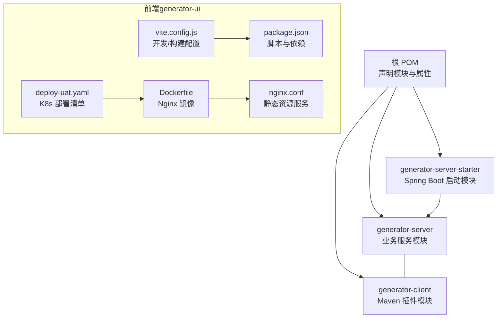
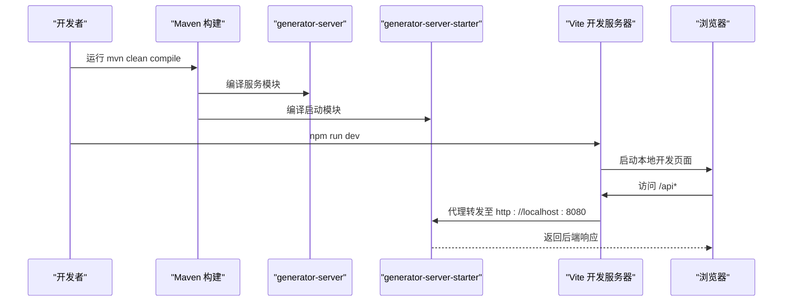
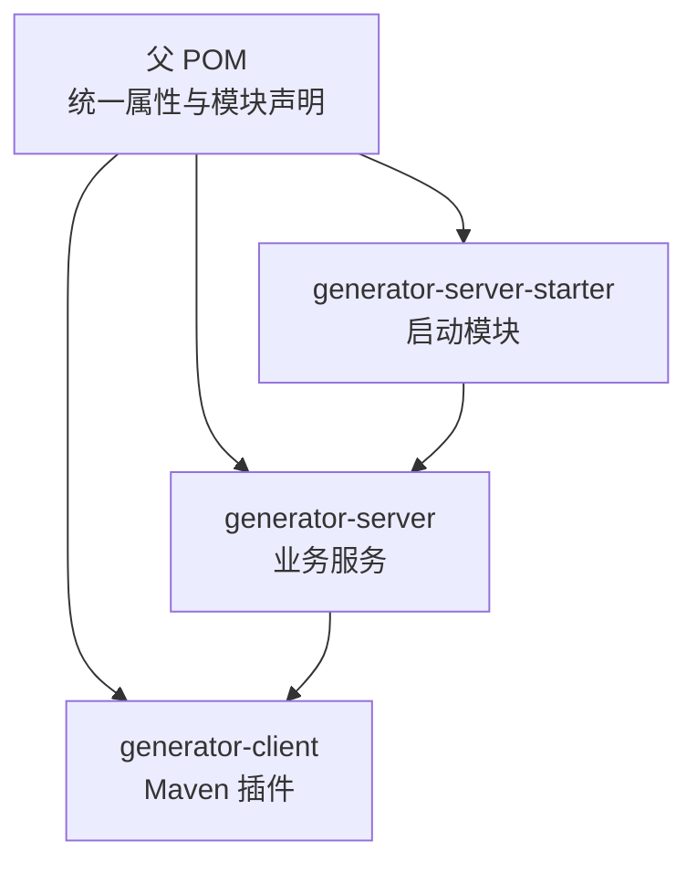
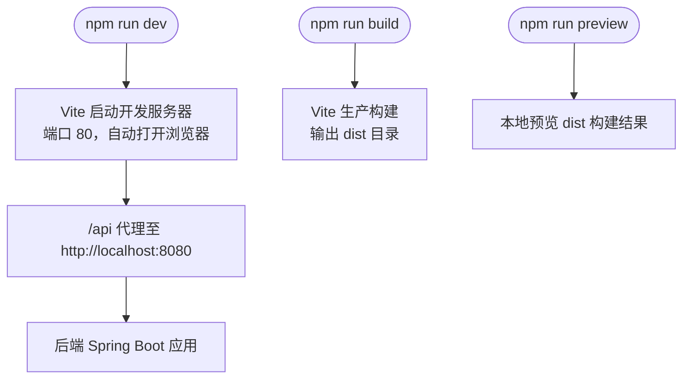
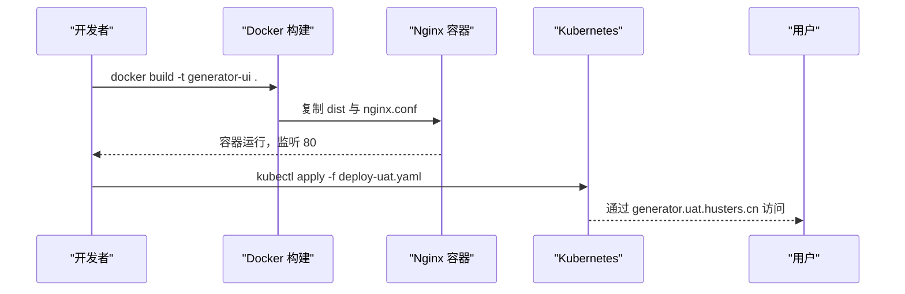
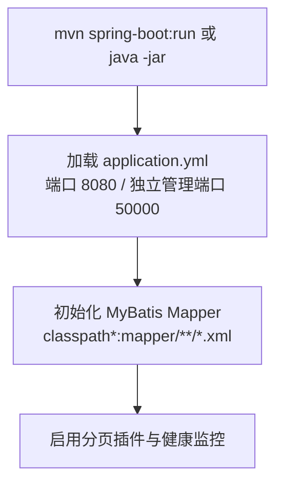
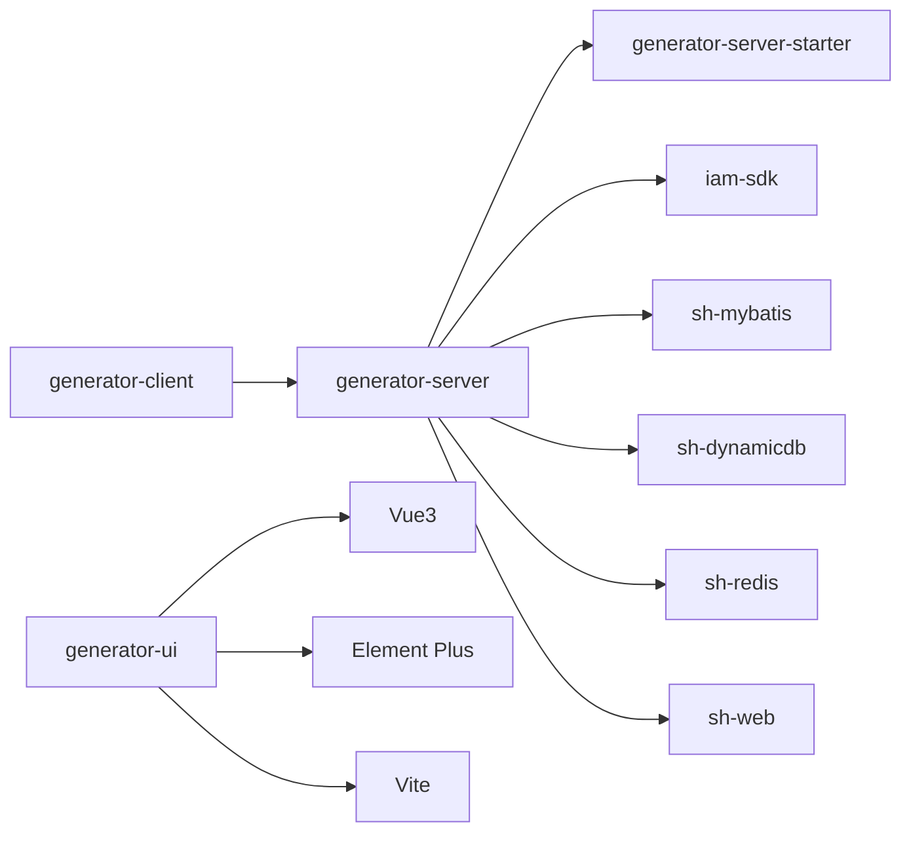

# 项目构建

<cite>
**本文引用的文件**
- [pom.xml（根）](file://pom.xml)
- [generator-client/pom.xml](file://generator-client/pom.xml)
- [generator-server/pom.xml](file://generator-server/pom.xml)
- [generator-server-starter/pom.xml](file://generator-server-starter/pom.xml)
- [generator-server-starter/src/main/resources/config/application.yml](file://generator-server-starter/src/main/resources/config/application.yml)
- [generator-ui/package.json](file://generator-ui/package.json)
- [generator-ui/vite.config.js](file://generator-ui/vite.config.js)
- [generator-ui/Dockerfile](file://generator-ui/Dockerfile)
- [generator-ui/deploy-uat.yaml](file://generator-ui/deploy-uat.yaml)
- [generator-ui/nginx.conf](file://generator-ui/nginx.conf)
- [generator-ui/env.js](file://generator-ui/env.js)
</cite>

## 目录
1. [简介](#简介)
2. [项目结构](#项目结构)
3. [核心组件](#核心组件)
4. [架构总览](#架构总览)
5. [详细组件分析](#详细组件分析)
6. [依赖分析](#依赖分析)
7. [性能考虑](#性能考虑)
8. [故障排查指南](#故障排查指南)
9. [结论](#结论)
10. [附录](#附录)

## 简介
本指南面向 SH-Generator 多模块项目，覆盖 Maven 父子工程构建、子模块依赖与构建顺序、前端 Vite 构建与部署、Docker 容器化与 Kubernetes 部署、以及 CI/CD 自动化建议。文档以仓库现有配置为依据，提供可操作的构建命令、参数说明与优化策略。

## 项目结构
项目采用 Maven 多模块聚合结构，父 POM 声明模块并统一属性；后端由服务模块与启动模块组成；前端为独立的 Vue3 应用，使用 Vite 构建；UI 提供 Dockerfile 与 K8s 部署清单。

图表来源
- [pom.xml（根）:20-24](file://pom.xml#L20-L24)
- [generator-server/pom.xml:14-40](file://generator-server/pom.xml#L14-L40)
- [generator-server-starter/pom.xml:15-28](file://generator-server-starter/pom.xml#L15-L28)
- [generator-client/pom.xml:16-38](file://generator-client/pom.xml#L16-L38)
- [generator-ui/vite.config.js:1-72](file://generator-ui/vite.config.js#L1-L72)
- [generator-ui/package.json:8-13](file://generator-ui/package.json#L8-L13)
- [generator-ui/Dockerfile:1-15](file://generator-ui/Dockerfile#L1-L15)
- [generator-ui/deploy-uat.yaml:1-77](file://generator-ui/deploy-uat.yaml#L1-L77)
- [generator-ui/nginx.conf:67-75](file://generator-ui/nginx.conf#L67-L75)

章节来源
- [pom.xml（根）:1-35](file://pom.xml#L1-L35)
- [generator-server/pom.xml:1-58](file://generator-server/pom.xml#L1-L58)
- [generator-server-starter/pom.xml:1-52](file://generator-server-starter/pom.xml#L1-L52)
- [generator-client/pom.xml:1-75](file://generator-client/pom.xml#L1-L75)
- [generator-ui/package.json:1-53](file://generator-ui/package.json#L1-L53)
- [generator-ui/vite.config.js:1-72](file://generator-ui/vite.config.js#L1-L72)
- [generator-ui/Dockerfile:1-15](file://generator-ui/Dockerfile#L1-L15)
- [generator-ui/deploy-uat.yaml:1-77](file://generator-ui/deploy-uat.yaml#L1-L77)
- [generator-ui/nginx.conf:1-77](file://generator-ui/nginx.conf#L1-L77)

## 核心组件
- 父 POM：统一版本、编译目标、模块声明与属性管理。
- generator-server：业务服务模块，依赖框架与通用组件，内嵌 Maven 插件执行入口。
- generator-server-starter：Spring Boot 启动模块，打包为可运行 JAR，并跳过安装/部署插件。
- generator-client：Maven 插件模块，提供自定义 goal 前缀，便于在服务模块中触发代码生成。
- generator-ui：Vue3 + Vite 前端应用，提供开发、构建、预览脚本，配套 Docker 与 K8s 部署。

章节来源
- [pom.xml（根）:26-33](file://pom.xml#L26-L33)
- [generator-server/pom.xml:14-56](file://generator-server/pom.xml#L14-L56)
- [generator-server-starter/pom.xml:15-49](file://generator-server-starter/pom.xml#L15-L49)
- [generator-client/pom.xml:16-73](file://generator-client/pom.xml#L16-L73)
- [generator-ui/package.json:8-13](file://generator-ui/package.json#L8-L13)

## 架构总览
下图展示从 Maven 构建到前端产物与后端启动的整体流程，以及前端通过代理访问后端 API 的开发模式。

图表来源
- [generator-ui/vite.config.js:41-53](file://generator-ui/vite.config.js#L41-L53)
- [generator-server-starter/src/main/resources/config/application.yml:1-52](file://generator-server-starter/src/main/resources/config/application.yml#L1-L52)

## 详细组件分析

### Maven 多模块构建与顺序
- 模块声明与顺序：父 POM 中按顺序声明 generator-server → generator-server-starter → generator-client，建议遵循该顺序进行构建，确保插件与依赖解析一致。
- 属性与版本：统一使用 ${revision} 版本占位符，Java 编译目标为 25，编码为 UTF-8。
- 子模块特性：
  - generator-client：打包类型为 maven-plugin，内置 maven-plugin-plugin，goalPrefix 为 sh-generator。
  - generator-server：依赖 iam-sdk、sh-mybatis、sh-dynamicdb、sh-redis、sh-web 等框架模块，并在自身 build 中声明调用 generator-client 插件。
  - generator-server-starter：依赖 generator-server，启用 spring-boot-maven-plugin，同时显式跳过 maven-install 与 maven-deploy 插件，仅用于启动与打包。

图表来源
- [pom.xml（根）:20-24](file://pom.xml#L20-L24)
- [generator-server/pom.xml:14-56](file://generator-server/pom.xml#L14-L56)
- [generator-server-starter/pom.xml:15-28](file://generator-server-starter/pom.xml#L15-L28)
- [generator-client/pom.xml:16-38](file://generator-client/pom.xml#L16-L38)

章节来源
- [pom.xml（根）:20-33](file://pom.xml#L20-L33)
- [generator-client/pom.xml:41-73](file://generator-client/pom.xml#L41-L73)
- [generator-server/pom.xml:43-56](file://generator-server/pom.xml#L43-L56)
- [generator-server-starter/pom.xml:30-49](file://generator-server-starter/pom.xml#L30-L49)

### 前端构建与开发服务器
- 构建脚本：提供 dev、build、build:stage、preview 四类脚本，分别对应开发、生产构建、预发布构建与本地预览。
- 开发服务器：默认监听 80 端口，开启自动打开浏览器，配置了 /api 前缀代理至 http://localhost:8080，便于前后端联调。
- 构建输出：生产构建产物输出至 dist，静态资源按 hash 命名，Rollup 输出配置可控制分包与命名。
- 环境配置：env.js 提供本地/测试/UAT/生产等环境判断与基础 API 地址映射，支持本地存储覆盖 CAS 与 API 地址。

图表来源
- [generator-ui/package.json:8-13](file://generator-ui/package.json#L8-L13)
- [generator-ui/vite.config.js:41-53](file://generator-ui/vite.config.js#L41-L53)
- [generator-ui/vite.config.js:26-39](file://generator-ui/vite.config.js#L26-L39)
- [generator-ui/env.js:11-40](file://generator-ui/env.js#L11-L40)

章节来源
- [generator-ui/package.json:8-13](file://generator-ui/package.json#L8-L13)
- [generator-ui/vite.config.js:1-72](file://generator-ui/vite.config.js#L1-L72)
- [generator-ui/env.js:1-40](file://generator-ui/env.js#L1-L40)

### Docker 容器化与 Kubernetes 部署
- Dockerfile：基于 nginx:alpine，设置 Asia/Shanghai 时区，复制 dist 至 /usr/share/nginx/html，复制 nginx.conf 并以 nginx -g daemon off 启动。
- Nginx 配置：启用 gzip、access/error 日志、keepalive、epoll 等优化项，server 中 try_files 支持 SPA 单页路由回退。
- K8s 部署：提供 UAT 环境的 Deployment/Service/Ingress 清单，镜像地址通过变量注入，Ingress 绑定域名 generator.uat.husters.cn 并启用 TLS。

图表来源
- [generator-ui/Dockerfile:1-15](file://generator-ui/Dockerfile#L1-L15)
- [generator-ui/nginx.conf:17-76](file://generator-ui/nginx.conf#L17-L76)
- [generator-ui/deploy-uat.yaml:1-77](file://generator-ui/deploy-uat.yaml#L1-L77)

章节来源
- [generator-ui/Dockerfile:1-15](file://generator-ui/Dockerfile#L1-L15)
- [generator-ui/nginx.conf:1-77](file://generator-ui/nginx.conf#L1-L77)
- [generator-ui/deploy-uat.yaml:1-77](file://generator-ui/deploy-uat.yaml#L1-L77)

### 后端启动与配置要点
- 启动模块：generator-server-starter 使用 spring-boot-maven-plugin，打包可执行 JAR；显式跳过 install 与 deploy，避免重复安装与部署。
- 应用配置：application.yml 指定服务端口 8080，激活本地 profile，MyBatis Mapper 路径为 classpath*:mapper/**/*.xml，开启分页插件与健康监控端点，独立管理端口 50000。

图表来源
- [generator-server-starter/pom.xml:32-35](file://generator-server-starter/pom.xml#L32-L35)
- [generator-server-starter/src/main/resources/config/application.yml:1-52](file://generator-server-starter/src/main/resources/config/application.yml#L1-L52)

章节来源
- [generator-server-starter/pom.xml:30-49](file://generator-server-starter/pom.xml#L30-L49)
- [generator-server-starter/src/main/resources/config/application.yml:1-52](file://generator-server-starter/src/main/resources/config/application.yml#L1-L52)

## 依赖分析
- 模块耦合：
  - generator-server 依赖 generator-client（通过插件形式），用于在构建期生成代码或执行任务。
  - generator-server-starter 依赖 generator-server，作为最终可运行的启动模块。
- 外部依赖：
  - generator-server 依赖 iam-sdk 与多个 sh-* 框架模块，体现统一基础设施能力。
  - generator-ui 依赖 Vue3、Element Plus、Axios 等生态库，构建期使用 Vite 与相关插件。

图表来源
- [generator-server/pom.xml:14-40](file://generator-server/pom.xml#L14-L40)
- [generator-server-starter/pom.xml:15-28](file://generator-server-starter/pom.xml#L15-L28)
- [generator-ui/package.json:18-48](file://generator-ui/package.json#L18-L48)

章节来源
- [generator-server/pom.xml:14-40](file://generator-server/pom.xml#L14-L40)
- [generator-server-starter/pom.xml:15-28](file://generator-server-starter/pom.xml#L15-L28)
- [generator-ui/package.json:18-48](file://generator-ui/package.json#L18-L48)

## 性能考虑
- 前端构建优化：
  - 生产构建关闭 sourcemap，减少体积与解析开销。
  - Rollup 输出按 hash 命名，利于浏览器缓存与长期缓存策略。
  - 启用 gzip 压缩与合理的 keepalive 参数，提升静态资源传输效率。
- 后端构建优化：
  - 使用 maven-compiler-plugin 指定 release 版本，确保字节码与运行时一致。
  - 在 generator-server-starter 中跳过 install/deploy，缩短 CI 时间。
- 构建缓存与并行：
  - Maven：利用本地仓库缓存与增量编译；合理拆分模块，避免不必要的全量重编译。
  - Vite：利用内置缓存与依赖预构建，开发阶段保持常驻进程以复用缓存。

## 故障排查指南
- 前端代理 404 或跨域问题：
  - 确认 vite.config.js 中 /api 代理指向正确后端地址（默认 http://localhost:8080）。
  - 检查后端是否已启动且端口 8080 可达。
- 前端路由刷新 404：
  - 确认 nginx.conf 中 try_files $uri $uri/ /index.html，保证 SPA 回退至 index.html。
- Docker 构建失败：
  - 确保 dist 已存在（先执行 npm run build），Dockerfile 中复制路径正确。
- K8s 部署异常：
  - 检查镜像拉取密钥（imagePullSecrets）、Ingress 主机名与证书配置。
- 启动模块无法运行：
  - 确认 spring-boot-maven-plugin 已启用，且未被跳过 install/deploy 导致本地缺少依赖。

章节来源
- [generator-ui/vite.config.js:41-53](file://generator-ui/vite.config.js#L41-L53)
- [generator-ui/nginx.conf:67-75](file://generator-ui/nginx.conf#L67-L75)
- [generator-ui/Dockerfile:11-12](file://generator-ui/Dockerfile#L11-L12)
- [generator-ui/deploy-uat.yaml:26-34](file://generator-ui/deploy-uat.yaml#L26-L34)
- [generator-server-starter/pom.xml:38-48](file://generator-server-starter/pom.xml#L38-L48)

## 结论
本项目通过清晰的多模块划分与前后端分离架构，实现了可维护、可扩展的构建与部署体系。建议在 CI/CD 中固化构建顺序、启用缓存与并行策略，并结合 K8s 与 Ingress 实现稳定交付。

## 附录

### Maven 构建命令与参数说明
- 基础命令
  - mvn clean：清理各模块 target 目录
  - mvn compile：编译所有模块（按模块声明顺序）
  - mvn test：执行测试（如各模块包含测试）
  - mvn package：打包所有模块（含可执行 JAR）
- 常用参数
  - -T N：并行构建，N 可为数字或 auto
  - -DskipTests：跳过测试
  - -Dmaven.test.skip=true：完全跳过测试执行
  - -am/-amd：同时构建当前模块及其下游模块
  - -pl 模块路径：限定构建模块集合
- 顺序建议
  - 先构建 generator-server，再构建 generator-server-starter，最后构建 generator-client，以确保插件可用与依赖解析正确。

章节来源
- [pom.xml（根）:20-24](file://pom.xml#L20-L24)
- [generator-server/pom.xml:43-56](file://generator-server/pom.xml#L43-L56)
- [generator-server-starter/pom.xml:30-49](file://generator-server-starter/pom.xml#L30-L49)
- [generator-client/pom.xml:41-73](file://generator-client/pom.xml#L41-L73)

### 前端构建命令与参数说明
- npm run dev：启动 Vite 开发服务器，默认端口 80，自动打开浏览器
- npm run build：生产构建，输出至 dist
- npm run build:stage：预发布模式构建
- npm run preview：本地预览 dist 构建结果
- Vite 代理：/api 前缀代理至 http://localhost:8080，便于联调

章节来源
- [generator-ui/package.json:8-13](file://generator-ui/package.json#L8-L13)
- [generator-ui/vite.config.js:41-53](file://generator-ui/vite.config.js#L41-L53)

### Docker 构建与部署
- 构建镜像：docker build -t generator-ui .
- 运行容器：基于 nginx:alpine，复制 dist 与 nginx.conf，监听 80
- K8s 部署：kubectl apply -f deploy-uat.yaml，绑定 generator.uat.husters.cn 域名并启用 TLS

章节来源
- [generator-ui/Dockerfile:1-15](file://generator-ui/Dockerfile#L1-L15)
- [generator-ui/nginx.conf:17-76](file://generator-ui/nginx.conf#L17-L76)
- [generator-ui/deploy-uat.yaml:1-77](file://generator-ui/deploy-uat.yaml#L1-L77)

### CI/CD 流水线建议
- 触发条件：push 到主分支或合并请求
- 步骤建议：
  - 前端构建：npm ci → npm run build → 上传 dist 产物
  - 后端构建：mvn clean compile → mvn package（可选 -DskipTests）
  - Docker 构建：docker build -t ${IMAGE}
  - 部署：kubectl set image + kubectl apply（或 Helm/ArgoCD/Kaoto）
- 缓存策略：
  - Maven：缓存 ~/.m2/repository
  - Node：缓存 node_modules（注意 package-lock.json 一致性）

[本节为通用实践建议，不直接分析具体文件，故无“章节来源”]