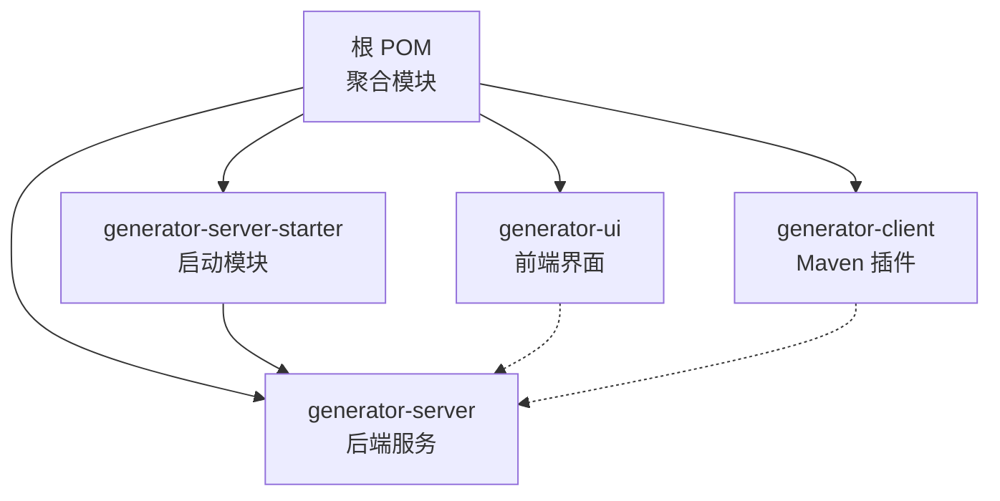
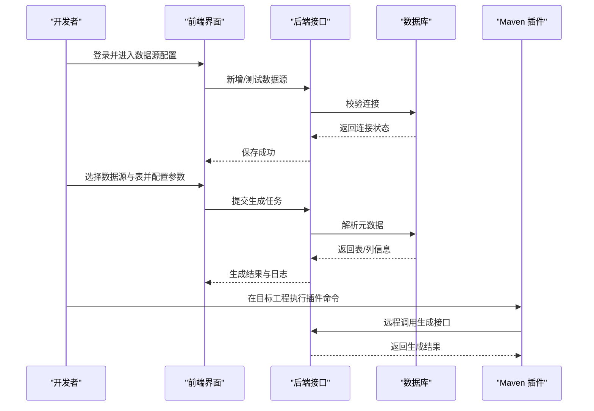
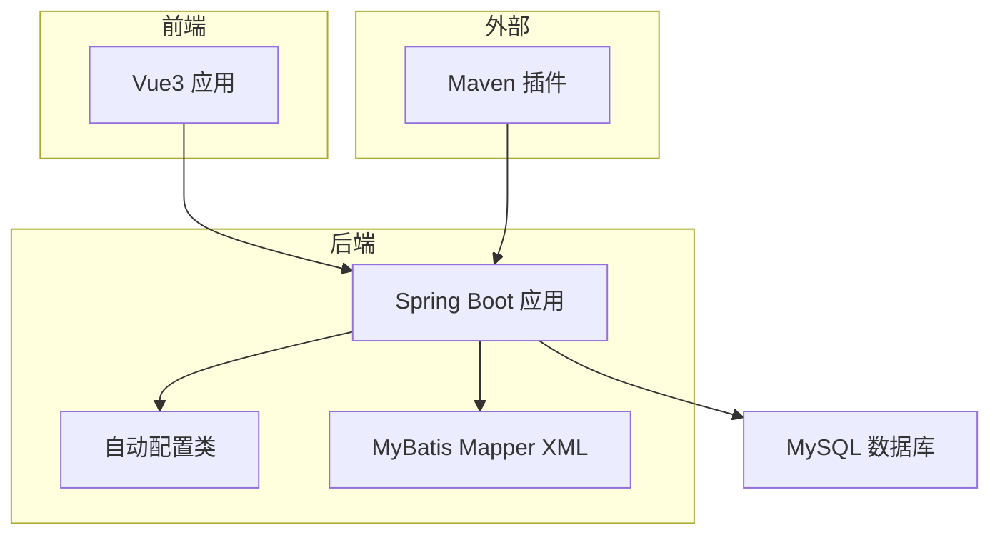
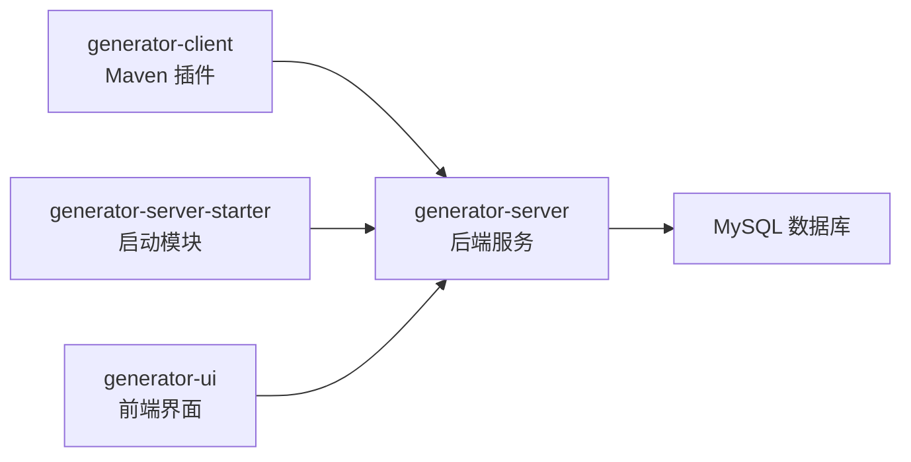

# 快速开始

<cite>
**本文引用的文件**
- [根 POM 文件](file://pom.xml)
- [后端启动模块 POM](file://generator-server-starter/pom.xml)
- [后端启动配置](file://generator-server-starter/src/main/resources/config/application.yml)
- [后端配置类](file://generator-server/src/main/java/com/wkclz/generator/server/GeneratorServerConfig.java)
- [前端包管理配置](file://generator-ui/package.json)
- [Maven 插件模块 POM](file://generator-client/pom.xml)
- [后端 Mapper XML 示例（占位）](file://generator-server/src/main/resources/mapper/GenDatasourceMapper.xml)
- [后端自动配置导入](file://generator-server/src/main/resources/META-INF/spring/org.springframework.boot.autoconfigure.AutoConfiguration.imports)
</cite>

## 目录
1. [简介](#简介)
2. [项目结构](#项目结构)
3. [环境准备](#环境准备)
4. [安装与部署](#安装与部署)
5. [首次使用全流程](#首次使用全流程)
6. [架构概览](#架构概览)
7. [详细组件分析](#详细组件分析)
8. [依赖关系分析](#依赖关系分析)
9. [性能考虑](#性能考虑)
10. [故障排查指南](#故障排查指南)
11. [结论](#结论)

## 简介
SH-Generator 是一个基于 Spring Boot 的代码生成器系统，包含后端服务、前端界面以及 Maven 插件三部分。通过统一的数据源配置与模板机制，用户可以在可视化界面中完成表结构解析、模板编辑与批量代码生成，并可通过 Maven 插件在构建阶段直接触发代码生成。

## 项目结构
该项目采用多模块聚合工程组织，核心模块如下：
- generator-server：后端服务与业务逻辑
- generator-server-starter：Spring Boot 启动模块，打包为可执行应用
- generator-ui：Vue3 前端界面
- generator-client：Maven 插件模块，提供命令式代码生成能力

图表来源
- [根 POM 文件:20-24](file://pom.xml#L20-L24)
- [后端启动模块 POM:1-52](file://generator-server-starter/pom.xml#L1-L52)
- [Maven 插件模块 POM:1-75](file://generator-client/pom.xml#L1-L75)

章节来源
- [根 POM 文件:1-35](file://pom.xml#L1-L35)
- [后端启动模块 POM:1-52](file://generator-server-starter/pom.xml#L1-L52)
- [Maven 插件模块 POM:1-75](file://generator-client/pom.xml#L1-L75)

## 环境准备
- JDK 版本要求
  - 源码编译目标版本：JDK 25
  - 编译属性设置于根 POM 与客户端模块中，需确保本地 JDK 版本满足要求
- Node.js 环境
  - 前端使用 Vite 构建工具，需安装 Node.js（推荐 LTS 版本）
  - 安装依赖后可进行开发与构建
- 数据库准备
  - 后端默认使用 MySQL 驱动（驱动类名已在启动配置中声明）
  - 需要提前创建数据库实例，并准备好连接信息（主机、端口、库名、账号、密码）

章节来源
- [根 POM 文件:30-31](file://pom.xml#L30-L31)
- [Maven 插件模块 POM:58-61](file://generator-client/pom.xml#L58-L61)
- [后端启动配置:10-11](file://generator-server-starter/src/main/resources/config/application.yml#L10-L11)

## 安装与部署
- 后端服务启动
  - 使用 Spring Boot 启动模块打包并运行，监听端口由配置文件指定
  - 启动前请确认数据库连接可用
- 前端界面访问
  - 在 generator-ui 目录下安装依赖并启动开发服务器
  - 默认访问地址与端口以前端配置为准
- Maven 插件配置
  - 将插件模块安装至本地仓库或私服
  - 在目标工程的 Maven 插件配置中添加对应 goal 与参数，即可在构建阶段触发代码生成

章节来源
- [后端启动配置:1-52](file://generator-server-starter/src/main/resources/config/application.yml#L1-L52)
- [前端包管理配置:8-13](file://generator-ui/package.json#L8-L13)
- [Maven 插件模块 POM:63-71](file://generator-client/pom.xml#L63-L71)

## 首次使用全流程
以下为从零到一的完整操作步骤，帮助你快速完成一次代码生成任务：

1) 准备数据库
- 确保数据库已创建并可连通
- 记录数据库连接信息（主机、端口、库名、账号、密码）

2) 启动后端服务
- 进入启动模块目录，执行打包命令
- 使用 Java 命令运行生成的可执行 JAR
- 确认服务健康检查端口与主端口均可达

3) 访问前端界面
- 在 generator-ui 目录安装依赖并启动开发服务器
- 打开浏览器访问前端页面，登录系统（如启用认证）

4) 创建数据源
- 在“配置/数据源”页面新增数据源，填写连接信息
- 测试连接成功后保存

5) 选择表并生成代码
- 在“项目/代码生成”页面选择目标数据源与表
- 配置生成参数（包名、作者、输出路径等）
- 触发生成任务，查看日志与结果

6) 使用 Maven 插件（可选）
- 在目标工程中引入插件并配置参数
- 在构建阶段执行插件目标，完成代码生成

图表来源
- [后端启动配置:1-52](file://generator-server-starter/src/main/resources/config/application.yml#L1-L52)
- [后端自动配置导入:1-2](file://generator-server/src/main/resources/META-INF/spring/org.springframework.boot.autoconfigure.AutoConfiguration.imports#L1-L2)

章节来源
- [后端启动配置:1-52](file://generator-server-starter/src/main/resources/config/application.yml#L1-L52)
- [后端配置类:1-14](file://generator-server/src/main/java/com/wkclz/generator/server/GeneratorServerConfig.java#L1-L14)

## 架构概览
系统采用前后端分离架构，后端通过 Spring Boot 提供 REST 接口，前端通过 Vue3 与 Element Plus 构建交互界面；Maven 插件作为外部调用入口，统一接入后端生成能力。

图表来源
- [后端配置类:1-14](file://generator-server/src/main/java/com/wkclz/generator/server/GeneratorServerConfig.java#L1-L14)
- [后端自动配置导入:1-2](file://generator-server/src/main/resources/META-INF/spring/org.springframework.boot.autoconfigure.AutoConfiguration.imports#L1-L2)
- [后端启动配置:1-52](file://generator-server-starter/src/main/resources/config/application.yml#L1-L52)

## 详细组件分析

### 后端服务配置
- 自动扫描与 Mapper 扫描
  - 通过自动配置类开启组件扫描与 Mapper 扫描，确保服务层与持久层正常装配
- MyBatis 配置
  - 映射文件位置与驼峰命名映射已启用
- 分页插件
  - PageHelper 已配置，方言为 MySQL
- 健康监控
  - Actuator 端点开放，独立端口暴露健康状态

章节来源
- [后端配置类:1-14](file://generator-server/src/main/java/com/wkclz/generator/server/GeneratorServerConfig.java#L1-L14)
- [后端启动配置:14-26](file://generator-server-starter/src/main/resources/config/application.yml#L14-L26)
- [后端启动配置:29-52](file://generator-server-starter/src/main/resources/config/application.yml#L29-L52)

### 启动模块与打包
- 依赖
  - 引入 IAM 单点登录与后端服务模块
- 插件
  - Spring Boot Maven 插件用于打包
  - 跳过 install 与 deploy 插件，仅用于启动模块

章节来源
- [后端启动模块 POM:15-27](file://generator-server-starter/pom.xml#L15-L27)
- [后端启动模块 POM:30-50](file://generator-server-starter/pom.xml#L30-L50)

### 前端构建与运行
- 开发脚本
  - dev：启动 Vite 开发服务器
  - build：生产构建
  - preview：预览构建产物
- 依赖
  - Vue3、Element Plus、Axios、Monaco Editor 等生态组件

章节来源
- [前端包管理配置:8-13](file://generator-ui/package.json#L8-L13)
- [前端包管理配置:18-51](file://generator-ui/package.json#L18-L51)

### Maven 插件模块
- 插件类型
  - maven-plugin，打包为插件模块
- 关键配置
  - 编译目标 JDK 25
  - maven-plugin-plugin 配置 goal 前缀
- 依赖
  - Maven 插件 API、注解、FastJSON2、Lombok

章节来源
- [Maven 插件模块 POM:14-14](file://generator-client/pom.xml#L14-L14)
- [Maven 插件模块 POM:55-71](file://generator-client/pom.xml#L55-L71)
- [Maven 插件模块 POM:16-38](file://generator-client/pom.xml#L16-L38)

## 依赖关系分析
- 模块间耦合
  - 启动模块聚合后端服务，前端与 Maven 插件均通过后端接口交互
- 外部依赖
  - MySQL 驱动、MyBatis、PageHelper、Spring Boot、Vite、Vue3 生态

图表来源
- [后端启动模块 POM:15-27](file://generator-server-starter/pom.xml#L15-L27)
- [Maven 插件模块 POM:16-38](file://generator-client/pom.xml#L16-L38)

章节来源
- [后端启动模块 POM:15-27](file://generator-server-starter/pom.xml#L15-L27)
- [Maven 插件模块 POM:16-38](file://generator-client/pom.xml#L16-L38)

## 性能考虑
- 数据库连接与 SQL 日志
  - 可根据需要启用 SQL 日志以便诊断，但生产环境建议关闭
- 分页与查询
  - PageHelper 已配置，合理使用分页可降低内存压力
- 前端构建优化
  - 使用 Vite 的按需加载与压缩插件提升开发体验与构建效率

## 故障排查指南
- 启动失败（端口占用）
  - 检查主端口与健康检查端口是否被占用，修改配置后重试
- 数据库连接异常
  - 确认驱动类名、主机、端口、库名、账号、密码正确
  - 如使用自定义驱动，请在配置中补充相应驱动类名
- 前端无法访问
  - 确认前端依赖安装完成，开发服务器端口未被占用
  - 若跨域，请在后端配置允许跨域或调整代理
- Maven 插件执行失败
  - 确认插件已安装至本地仓库或私服
  - 检查插件目标与参数配置是否正确

## 结论
通过以上步骤，你可以完成 SH-Generator 的环境准备、安装部署与首次使用。建议在开发环境中先行验证，再逐步迁移至生产配置。遇到问题时，优先检查数据库连接、端口占用与依赖版本匹配情况。