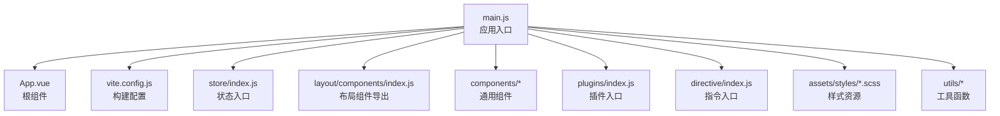
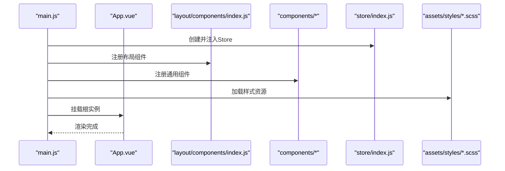
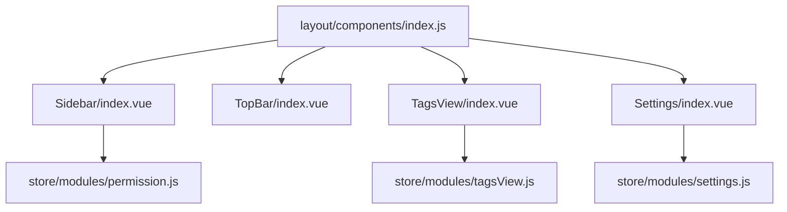
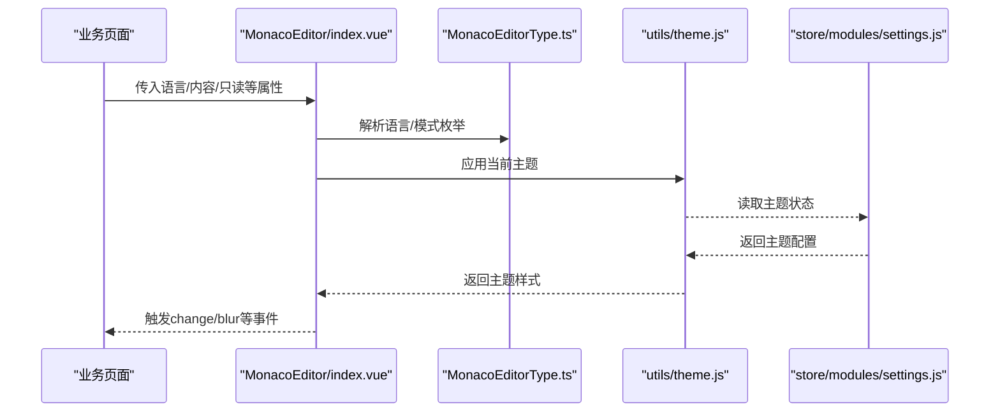
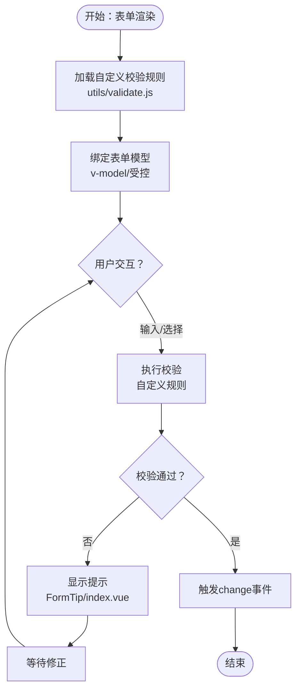
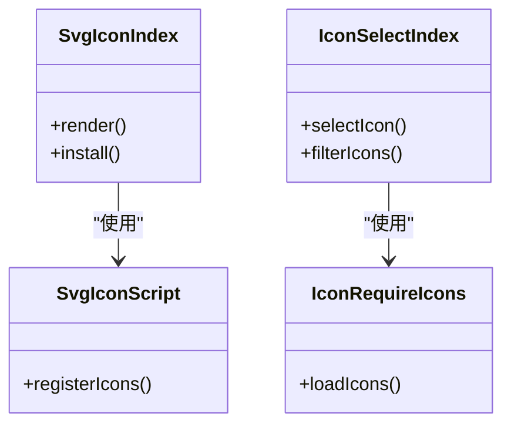
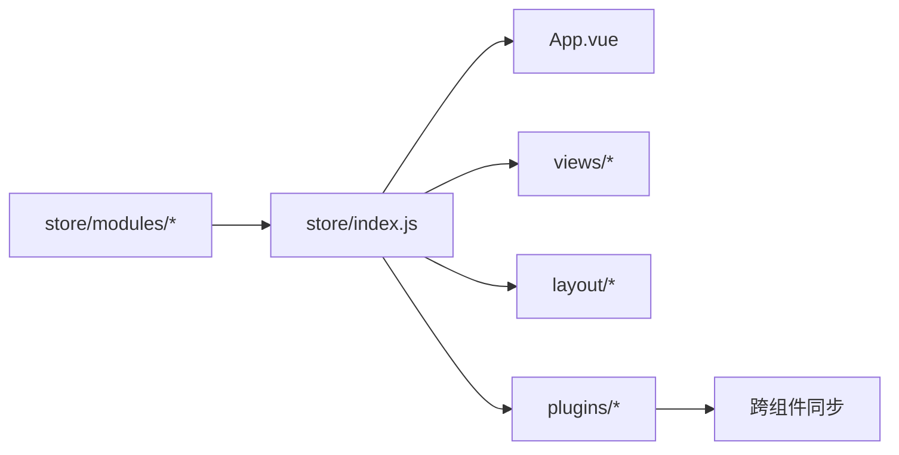
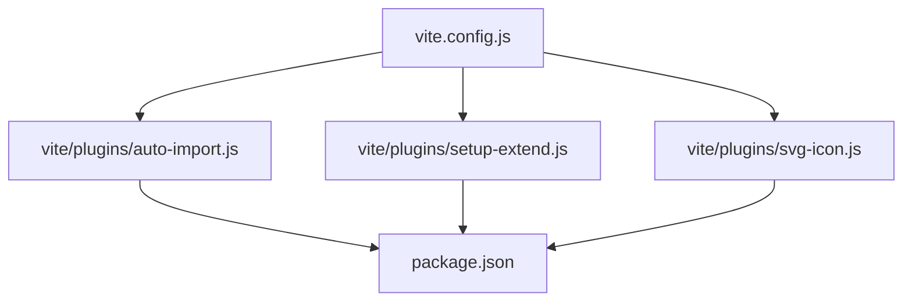

# UI组件扩展

<cite>
**本文引用的文件**
- [main.js](file://generator-ui/src/main.js)
- [App.vue](file://generator-ui/src/App.vue)
- [index.js](file://generator-ui/src/layout/components/index.js)
- [Sidebar/index.vue](file://generator-ui/src/layout/components/Sidebar/index.vue)
- [TopBar/index.vue](file://generator-ui/src/layout/components/TopBar/index.vue)
- [TagsView/index.vue](file://generator-ui/src/layout/components/TagsView/index.vue)
- [Settings/index.vue](file://generator-ui/src/layout/components/Settings/index.vue)
- [MonacoEditor/MonacoEditorType.ts](file://generator-ui/src/components/MonacoEditor/MonacoEditorType.ts)
- [MonacoEditor/index.vue](file://generator-ui/src/components/MonacoEditor/index.vue)
- [SvgIcon/svgicon.js](file://generator-ui/src/components/SvgIcon/svgicon.js)
- [SvgIcon/index.vue](file://generator-ui/src/components/SvgIcon/index.vue)
- [IconSelect/index.vue](file://generator-ui/src/components/IconSelect/index.vue)
- [IconSelect/requireIcons.js](file://generator-ui/src/components/IconSelect/requireIcons.js)
- [Pagination/index.vue](file://generator-ui/src/components/Pagination/index.vue)
- [FormTip/index.vue](file://generator-ui/src/components/FormTip/index.vue)
- [TableSetting/index.vue](file://generator-ui/src/components/TableSetting/index.vue)
- [RuoYi/Doc/index.vue](file://generator-ui/src/components/RuoYi/Doc/index.vue)
- [RuoYi/Git/index.vue](file://generator-ui/src/components/RuoYi/Git/index.vue)
- [directive/index.js](file://generator-ui/src/directive/index.js)
- [directive/permission/hasPermi.js](file://generator-ui/src/directive/permission/hasPermi.js)
- [directive/permission/hasRole.js](file://generator-ui/src/directive/permission/hasRole.js)
- [plugins/index.js](file://generator-ui/src/plugins/index.js)
- [plugins/modal.js](file://generator-ui/src/plugins/modal.js)
- [plugins/tab.js](file://generator-ui/src/plugins/tab.js)
- [store/index.js](file://generator-ui/src/store/index.js)
- [store/modules/app.js](file://generator-ui/src/store/modules/app.js)
- [store/modules/settings.js](file://generator-ui/src/store/modules/settings.js)
- [store/modules/user.js](file://generator-ui/src/store/modules/user.js)
- [store/modules/permission.js](file://generator-ui/src/store/modules/permission.js)
- [store/modules/tagsView.js](file://generator-ui/src/store/modules/tagsView.js)
- [utils/theme.js](file://generator-ui/src/utils/theme.js)
- [utils/validate.js](file://generator-ui/src/utils/validate.js)
- [assets/styles/variables.module.scss](file://generator-ui/src/assets/styles/variables.module.scss)
- [assets/styles/custom.scss](file://generator-ui/src/assets/styles/custom.scss)
- [assets/styles/element-ui.scss](file://generator-ui/src/assets/styles/element-ui.scss)
- [assets/styles/mixin.scss](file://generator-ui/src/assets/styles/mixin.scss)
- [assets/styles/sidebar.scss](file://generator-ui/src/assets/styles/sidebar.scss)
- [assets/styles/transition.scss](file://generator-ui/src/assets/styles/transition.scss)
- [vite.config.js](file://generator-ui/vite.config.js)
- [vite/plugins/auto-import.js](file://generator-ui/vite/plugins/auto-import.js)
- [vite/plugins/setup-extend.js](file://generator-ui/vite/plugins/setup-extend.js)
- [vite/plugins/svg-icon.js](file://generator-ui/vite/plugins/svg-icon.js)
- [package.json](file://generator-ui/package.json)
</cite>

## 目录
1. [简介](#简介)
2. [项目结构](#项目结构)
3. [核心组件](#核心组件)
4. [架构总览](#架构总览)
5. [详细组件分析](#详细组件分析)
6. [依赖分析](#依赖分析)
7. [性能考虑](#性能考虑)
8. [故障排查指南](#故障排查指南)
9. [结论](#结论)
10. [附录](#附录)

## 简介
本文件面向SH-Generator项目的前端UI扩展，系统化阐述Vue 3组件体系的扩展方法，涵盖自定义组件开发、组件注册与全局配置；MonacoEditor编辑器的语法高亮、代码补全与主题定制；布局组件（侧边栏、顶部导航、标签页）的扩展方案；表单组件的扩展指南（自定义校验、复杂表单组合与数据绑定）；状态管理（Vuex Store模块）的扩展与状态同步；UI样式扩展（主题、CSS变量、响应式）；以及组件测试与调试技巧，帮助开发者在保证稳定性与兼容性的前提下高效扩展。

## 项目结构
前端工程位于generator-ui目录，采用Vite构建，组织方式以功能域划分：components（通用组件）、layout（布局）、store（状态）、utils（工具）、plugins（插件）、assets/styles（样式）、directive（指令）、views（页面）等。入口文件main.js挂载应用至DOM，App.vue作为根组件，路由与权限在独立文件中处理。

图示来源
- [main.js:1-200](file://generator-ui/src/main.js#L1-L200)
- [App.vue:1-200](file://generator-ui/src/App.vue#L1-L200)
- [vite.config.js:1-200](file://generator-ui/vite.config.js#L1-L200)
- [store/index.js:1-200](file://generator-ui/src/store/index.js#L1-L200)
- [layout/components/index.js:1-200](file://generator-ui/src/layout/components/index.js#L1-L200)
- [plugins/index.js:1-200](file://generator-ui/src/plugins/index.js#L1-L200)
- [directive/index.js:1-200](file://generator-ui/src/directive/index.js#L1-L200)

章节来源
- [main.js:1-200](file://generator-ui/src/main.js#L1-L200)
- [App.vue:1-200](file://generator-ui/src/App.vue#L1-L200)
- [vite.config.js:1-200](file://generator-ui/vite.config.js#L1-L200)

## 核心组件
- 组件注册与全局配置
  - 在main.js中完成应用初始化、插件安装、指令注册与全局组件挂载。
  - 布局组件通过layout/components/index.js统一导出，便于按需引入或全局注册。
  - Vite插件auto-import.js实现自动导入，减少重复引入；setup-extend.js提供扩展能力；svg-icon.js负责SVG图标注册。
- 指令系统
  - 权限指令hasPermi.js与hasRole.js封装权限控制逻辑，集中于directive/index.js统一管理。
- 插件体系
  - plugins/index.js聚合modal.js、tab.js等插件，提供弹窗、标签页等横切能力。
- 状态管理
  - store/index.js聚合modules下的app、settings、user、permission、tagsView等模块，形成清晰的状态分层。
- 样式体系
  - assets/styles目录下提供variables.module.scss（CSS Modules变量）、custom.scss（自定义样式）、element-ui.scss（第三方样式覆盖）、mixin.scss（混入）、sidebar.scss、transition.scss等，支持主题与布局定制。

章节来源
- [main.js:1-200](file://generator-ui/src/main.js#L1-L200)
- [layout/components/index.js:1-200](file://generator-ui/src/layout/components/index.js#L1-L200)
- [directive/index.js:1-200](file://generator-ui/src/directive/index.js#L1-L200)
- [directive/permission/hasPermi.js:1-200](file://generator-ui/src/directive/permission/hasPermi.js#L1-L200)
- [directive/permission/hasRole.js:1-200](file://generator-ui/src/directive/permission/hasRole.js#L1-L200)
- [plugins/index.js:1-200](file://generator-ui/src/plugins/index.js#L1-L200)
- [plugins/modal.js:1-200](file://generator-ui/src/plugins/modal.js#L1-L200)
- [plugins/tab.js:1-200](file://generator-ui/src/plugins/tab.js#L1-L200)
- [store/index.js:1-200](file://generator-ui/src/store/index.js#L1-L200)
- [store/modules/app.js:1-200](file://generator-ui/src/store/modules/app.js#L1-L200)
- [store/modules/settings.js:1-200](file://generator-ui/src/store/modules/settings.js#L1-L200)
- [store/modules/user.js:1-200](file://generator-ui/src/store/modules/user.js#L1-L200)
- [store/modules/permission.js:1-200](file://generator-ui/src/store/modules/permission.js#L1-L200)
- [store/modules/tagsView.js:1-200](file://generator-ui/src/store/modules/tagsView.js#L1-L200)
- [assets/styles/variables.module.scss:1-200](file://generator-ui/src/assets/styles/variables.module.scss#L1-L200)
- [assets/styles/custom.scss:1-200](file://generator-ui/src/assets/styles/custom.scss#L1-L200)
- [assets/styles/element-ui.scss:1-200](file://generator-ui/src/assets/styles/element-ui.scss#L1-L200)
- [assets/styles/mixin.scss:1-200](file://generator-ui/src/assets/styles/mixin.scss#L1-L200)
- [assets/styles/sidebar.scss:1-200](file://generator-ui/src/assets/styles/sidebar.scss#L1-L200)
- [assets/styles/transition.scss:1-200](file://generator-ui/src/assets/styles/transition.scss#L1-L200)

## 架构总览
下图展示应用启动到组件渲染的关键流程：入口初始化、布局装配、组件注册、状态注入与样式加载。

图示来源
- [main.js:1-200](file://generator-ui/src/main.js#L1-L200)
- [App.vue:1-200](file://generator-ui/src/App.vue#L1-L200)
- [layout/components/index.js:1-200](file://generator-ui/src/layout/components/index.js#L1-L200)
- [store/index.js:1-200](file://generator-ui/src/store/index.js#L1-L200)

## 详细组件分析

### 布局组件扩展（侧边栏、顶部导航、标签页）
- 扩展点
  - 侧边栏：通过Sidebar/index.vue扩展菜单项、折叠行为与路由联动。
  - 顶部导航：通过TopBar/index.vue扩展用户信息、搜索、全屏等功能。
  - 标签页：通过TagsView/index.vue扩展多页签的增删与切换。
  - 设置面板：通过Settings/index.vue扩展主题、布局参数等设置项。
- 接入方式
  - 在layout/components/index.js中统一导出，供页面或路由视图直接使用。
  - 结合store/modules/tagsView.js与store/modules/permission.js实现标签页与权限联动。
- 定制建议
  - 使用assets/styles/sidebar.scss与assets/styles/transition.scss进行视觉与过渡效果定制。
  - 通过CSS Modules变量（variables.module.scss）统一主题色与间距。

图示来源
- [layout/components/index.js:1-200](file://generator-ui/src/layout/components/index.js#L1-L200)
- [Sidebar/index.vue:1-200](file://generator-ui/src/layout/components/Sidebar/index.vue#L1-L200)
- [TopBar/index.vue:1-200](file://generator-ui/src/layout/components/TopBar/index.vue#L1-L200)
- [TagsView/index.vue:1-200](file://generator-ui/src/layout/components/TagsView/index.vue#L1-L200)
- [Settings/index.vue:1-200](file://generator-ui/src/layout/components/Settings/index.vue#L1-L200)
- [store/modules/tagsView.js:1-200](file://generator-ui/src/store/modules/tagsView.js#L1-L200)
- [store/modules/permission.js:1-200](file://generator-ui/src/store/modules/permission.js#L1-L200)
- [store/modules/settings.js:1-200](file://generator-ui/src/store/modules/settings.js#L1-L200)

章节来源
- [layout/components/index.js:1-200](file://generator-ui/src/layout/components/index.js#L1-L200)
- [Sidebar/index.vue:1-200](file://generator-ui/src/layout/components/Sidebar/index.vue#L1-L200)
- [TopBar/index.vue:1-200](file://generator-ui/src/layout/components/TopBar/index.vue#L1-L200)
- [TagsView/index.vue:1-200](file://generator-ui/src/layout/components/TagsView/index.vue#L1-L200)
- [Settings/index.vue:1-200](file://generator-ui/src/layout/components/Settings/index.vue#L1-L200)
- [store/modules/tagsView.js:1-200](file://generator-ui/src/store/modules/tagsView.js#L1-L200)
- [store/modules/permission.js:1-200](file://generator-ui/src/store/modules/permission.js#L1-L200)
- [store/modules/settings.js:1-200](file://generator-ui/src/store/modules/settings.js#L1-L200)
- [assets/styles/sidebar.scss:1-200](file://generator-ui/src/assets/styles/sidebar.scss#L1-L200)
- [assets/styles/transition.scss:1-200](file://generator-ui/src/assets/styles/transition.scss#L1-L200)
- [assets/styles/variables.module.scss:1-200](file://generator-ui/src/assets/styles/variables.module.scss#L1-L200)

### MonacoEditor 编辑器组件扩展
- 能力范围
  - 语法高亮：通过MonacoEditorType.ts定义语言类型与模式，结合monaco-editor内置能力实现。
  - 代码补全：可扩展提供自定义补全项与触发策略。
  - 主题定制：通过utils/theme.js与assets/styles/element-ui.scss实现主题切换与样式覆盖。
- 扩展步骤
  - 在MonacoEditor/index.vue中封装props、事件与状态，对接monaco-editor实例。
  - 在MonacoEditorType.ts中新增语言/模式枚举，便于统一管理。
  - 利用store/modules/settings.js中的主题状态驱动编辑器主题切换。
- 性能优化
  - 按需加载monaco-editor，避免首屏体积过大。
  - 合理拆分补全逻辑，避免频繁触发。

图示来源
- [MonacoEditor/index.vue:1-200](file://generator-ui/src/components/MonacoEditor/index.vue#L1-L200)
- [MonacoEditor/MonacoEditorType.ts:1-200](file://generator-ui/src/components/MonacoEditor/MonacoEditorType.ts#L1-L200)
- [utils/theme.js:1-200](file://generator-ui/src/utils/theme.js#L1-L200)
- [store/modules/settings.js:1-200](file://generator-ui/src/store/modules/settings.js#L1-L200)

章节来源
- [MonacoEditor/index.vue:1-200](file://generator-ui/src/components/MonacoEditor/index.vue#L1-L200)
- [MonacoEditor/MonacoEditorType.ts:1-200](file://generator-ui/src/components/MonacoEditor/MonacoEditorType.ts#L1-L200)
- [utils/theme.js:1-200](file://generator-ui/src/utils/theme.js#L1-L200)
- [store/modules/settings.js:1-200](file://generator-ui/src/store/modules/settings.js#L1-L200)
- [assets/styles/element-ui.scss:1-200](file://generator-ui/src/assets/styles/element-ui.scss#L1-L200)

### 表单组件扩展（自定义校验、复杂表单组合与数据绑定）
- 自定义校验
  - 在utils/validate.js中扩展校验规则，统一暴露校验函数，供表单组件使用。
  - 表单组件内部通过props接收rules与model，结合Element Plus的表单能力实现双向绑定。
- 复杂表单组合
  - 将多个基础表单控件组合为复合组件（如地址选择器、时间区间选择器），通过插槽与事件解耦。
  - 使用FormTip/index.vue作为提示组件，提升用户体验。
- 数据绑定
  - 通过v-model或受控模式实现数据流闭环，配合store/modules/app.js中的临时状态管理复杂场景。
- 典型组件
  - FormTip/index.vue用于字段提示；Pagination/index.vue用于分页场景；TableSetting/index.vue用于表格列设置。

图示来源
- [utils/validate.js:1-200](file://generator-ui/src/utils/validate.js#L1-L200)
- [FormTip/index.vue:1-200](file://generator-ui/src/components/FormTip/index.vue#L1-L200)
- [Pagination/index.vue:1-200](file://generator-ui/src/components/Pagination/index.vue#L1-L200)
- [TableSetting/index.vue:1-200](file://generator-ui/src/components/TableSetting/index.vue#L1-L200)
- [store/modules/app.js:1-200](file://generator-ui/src/store/modules/app.js#L1-L200)

章节来源
- [utils/validate.js:1-200](file://generator-ui/src/utils/validate.js#L1-L200)
- [FormTip/index.vue:1-200](file://generator-ui/src/components/FormTip/index.vue#L1-L200)
- [Pagination/index.vue:1-200](file://generator-ui/src/components/Pagination/index.vue#L1-L200)
- [TableSetting/index.vue:1-200](file://generator-ui/src/components/TableSetting/index.vue#L1-L200)
- [store/modules/app.js:1-200](file://generator-ui/src/store/modules/app.js#L1-L200)

### 图标与通用组件扩展
- SVG图标
  - 通过SvgIcon/svgicon.js与SvgIcon/index.vue实现SVG图标的批量注册与组件化使用。
  - IconSelect/index.vue与IconSelect/requireIcons.js提供图标选择器，支持搜索与懒加载。
- 通用组件
  - 包括Hamburger、Screenfull、SizeSelect、RightToolbar等，均以独立组件形式存在，便于复用与替换。

图示来源
- [SvgIcon/svgicon.js:1-200](file://generator-ui/src/components/SvgIcon/svgicon.js#L1-L200)
- [SvgIcon/index.vue:1-200](file://generator-ui/src/components/SvgIcon/index.vue#L1-L200)
- [IconSelect/index.vue:1-200](file://generator-ui/src/components/IconSelect/index.vue#L1-L200)
- [IconSelect/requireIcons.js:1-200](file://generator-ui/src/components/IconSelect/requireIcons.js#L1-L200)

章节来源
- [SvgIcon/svgicon.js:1-200](file://generator-ui/src/components/SvgIcon/svgicon.js#L1-L200)
- [SvgIcon/index.vue:1-200](file://generator-ui/src/components/SvgIcon/index.vue#L1-L200)
- [IconSelect/index.vue:1-200](file://generator-ui/src/components/IconSelect/index.vue#L1-L200)
- [IconSelect/requireIcons.js:1-200](file://generator-ui/src/components/IconSelect/requireIcons.js#L1-L200)

### 状态管理扩展（Store模块与同步机制）
- 模块扩展
  - 在store/modules下新增模块文件（如user.js、permission.js、tagsView.js、settings.js、app.js），并在store/index.js中聚合。
  - 每个模块职责明确：用户信息、权限、标签页、设置、应用上下文等。
- 同步机制
  - 通过mutations与actions实现状态变更与异步操作；结合插件（如plugins/tab.js）实现跨组件状态同步。
  - 与布局组件联动：TagsView与Permission模块影响侧边栏与路由渲染。
- 最佳实践
  - 避免在组件内直接修改全局状态，统一通过dispatch与commit。
  - 对大对象状态进行深拷贝，防止意外共享引用。

图示来源
- [store/index.js:1-200](file://generator-ui/src/store/index.js#L1-L200)
- [store/modules/user.js:1-200](file://generator-ui/src/store/modules/user.js#L1-L200)
- [store/modules/permission.js:1-200](file://generator-ui/src/store/modules/permission.js#L1-L200)
- [store/modules/tagsView.js:1-200](file://generator-ui/src/store/modules/tagsView.js#L1-L200)
- [store/modules/settings.js:1-200](file://generator-ui/src/store/modules/settings.js#L1-L200)
- [store/modules/app.js:1-200](file://generator-ui/src/store/modules/app.js#L1-L200)
- [plugins/tab.js:1-200](file://generator-ui/src/plugins/tab.js#L1-L200)

章节来源
- [store/index.js:1-200](file://generator-ui/src/store/index.js#L1-L200)
- [store/modules/user.js:1-200](file://generator-ui/src/store/modules/user.js#L1-L200)
- [store/modules/permission.js:1-200](file://generator-ui/src/store/modules/permission.js#L1-L200)
- [store/modules/tagsView.js:1-200](file://generator-ui/src/store/modules/tagsView.js#L1-L200)
- [store/modules/settings.js:1-200](file://generator-ui/src/store/modules/settings.js#L1-L200)
- [store/modules/app.js:1-200](file://generator-ui/src/store/modules/app.js#L1-L200)
- [plugins/tab.js:1-200](file://generator-ui/src/plugins/tab.js#L1-L200)

### UI样式扩展（主题、CSS变量与响应式）
- 主题定制
  - 通过utils/theme.js与store/modules/settings.js实现主题切换；在assets/styles/element-ui.scss中覆盖第三方组件样式。
- CSS变量
  - 使用assets/styles/variables.module.scss定义CSS Modules变量，统一颜色、字体、间距等。
- 响应式设计
  - 结合assets/styles/mixin.scss与sidebar.scss实现响应式布局与侧边栏适配。
- 自定义样式
  - 在assets/styles/custom.scss中编写业务专属样式，避免污染全局命名空间。

章节来源
- [utils/theme.js:1-200](file://generator-ui/src/utils/theme.js#L1-L200)
- [store/modules/settings.js:1-200](file://generator-ui/src/store/modules/settings.js#L1-L200)
- [assets/styles/element-ui.scss:1-200](file://generator-ui/src/assets/styles/element-ui.scss#L1-L200)
- [assets/styles/variables.module.scss:1-200](file://generator-ui/src/assets/styles/variables.module.scss#L1-L200)
- [assets/styles/mixin.scss:1-200](file://generator-ui/src/assets/styles/mixin.scss#L1-L200)
- [assets/styles/sidebar.scss:1-200](file://generator-ui/src/assets/styles/sidebar.scss#L1-L200)
- [assets/styles/custom.scss:1-200](file://generator-ui/src/assets/styles/custom.scss#L1-L200)

### 指令与插件扩展
- 指令
  - hasPermi.js与hasRole.js封装权限指令，集中于directive/index.js，便于在模板中快速使用。
- 插件
  - plugins/index.js聚合modal.js、tab.js等插件，提供弹窗、标签页等横切能力；可在插件中注入全局服务或工具。

章节来源
- [directive/index.js:1-200](file://generator-ui/src/directive/index.js#L1-L200)
- [directive/permission/hasPermi.js:1-200](file://generator-ui/src/directive/permission/hasPermi.js#L1-L200)
- [directive/permission/hasRole.js:1-200](file://generator-ui/src/directive/permission/hasRole.js#L1-L200)
- [plugins/index.js:1-200](file://generator-ui/src/plugins/index.js#L1-L200)
- [plugins/modal.js:1-200](file://generator-ui/src/plugins/modal.js#L1-L200)
- [plugins/tab.js:1-200](file://generator-ui/src/plugins/tab.js#L1-L200)

## 依赖分析
- 构建与自动导入
  - vite.config.js集成Vite插件链，auto-import.js实现组件与API的自动导入；setup-extend.js提供扩展钩子；svg-icon.js负责SVG图标注册。
- 运行时依赖
  - package.json声明运行时依赖，确保组件库、monaco-editor、Vuex等版本兼容。

图示来源
- [vite.config.js:1-200](file://generator-ui/vite.config.js#L1-L200)
- [vite/plugins/auto-import.js:1-200](file://generator-ui/vite/plugins/auto-import.js#L1-L200)
- [vite/plugins/setup-extend.js:1-200](file://generator-ui/vite/plugins/setup-extend.js#L1-L200)
- [vite/plugins/svg-icon.js:1-200](file://generator-ui/vite/plugins/svg-icon.js#L1-L200)
- [package.json:1-200](file://generator-ui/package.json#L1-L200)

章节来源
- [vite.config.js:1-200](file://generator-ui/vite.config.js#L1-L200)
- [vite/plugins/auto-import.js:1-200](file://generator-ui/vite/plugins/auto-import.js#L1-L200)
- [vite/plugins/setup-extend.js:1-200](file://generator-ui/vite/plugins/setup-extend.js#L1-L200)
- [vite/plugins/svg-icon.js:1-200](file://generator-ui/vite/plugins/svg-icon.js#L1-L200)
- [package.json:1-200](file://generator-ui/package.json#L1-L200)

## 性能考虑
- 按需加载
  - 对MonacoEditor与大型组件采用动态import，降低首屏包体。
- 组件缓存
  - 合理使用keep-alive与缓存策略，避免重复渲染。
- 样式优化
  - 使用CSS Modules与局部作用域样式，减少全局样式冲突与重绘。
- 状态瘦身
  - 将非必要状态下沉至组件内部，仅在store中保留跨组件共享的核心状态。

## 故障排查指南
- 组件无法注册
  - 检查main.js中的全局组件注册与layout/components/index.js导出是否一致。
- 样式不生效
  - 确认CSS Modules变量是否正确导入；第三方样式覆盖顺序是否正确。
- MonacoEditor主题异常
  - 检查utils/theme.js与store/modules/settings.js的主题状态是否同步；确认assets/styles/element-ui.scss覆盖是否生效。
- 权限指令无效
  - 核对directive/index.js是否正确安装；hasPermi.js与hasRole.js的权限值是否匹配。
- 插件冲突
  - 检查plugins/index.js中插件的安装顺序与依赖关系，避免重复注册或覆盖。

章节来源
- [main.js:1-200](file://generator-ui/src/main.js#L1-L200)
- [layout/components/index.js:1-200](file://generator-ui/src/layout/components/index.js#L1-L200)
- [utils/theme.js:1-200](file://generator-ui/src/utils/theme.js#L1-L200)
- [store/modules/settings.js:1-200](file://generator-ui/src/store/modules/settings.js#L1-L200)
- [directive/index.js:1-200](file://generator-ui/src/directive/index.js#L1-L200)
- [directive/permission/hasPermi.js:1-200](file://generator-ui/src/directive/permission/hasPermi.js#L1-L200)
- [directive/permission/hasRole.js:1-200](file://generator-ui/src/directive/permission/hasRole.js#L1-L200)
- [plugins/index.js:1-200](file://generator-ui/src/plugins/index.js#L1-L200)

## 结论
通过以上扩展方法，开发者可以在SH-Generator的UI体系中安全地增加新组件、增强编辑器能力、定制布局与表单体验，并以模块化的方式管理状态与样式。遵循本文的架构与最佳实践，可显著提升扩展效率与系统稳定性。

## 附录
- 快速定位
  - 组件注册入口：[main.js:1-200](file://generator-ui/src/main.js#L1-L200)
  - 布局组件导出：[layout/components/index.js:1-200](file://generator-ui/src/layout/components/index.js#L1-L200)
  - 状态入口：[store/index.js:1-200](file://generator-ui/src/store/index.js#L1-L200)
  - 样式变量：[assets/styles/variables.module.scss:1-200](file://generator-ui/src/assets/styles/variables.module.scss#L1-L200)
  - 构建配置：[vite.config.js:1-200](file://generator-ui/vite.config.js#L1-L200)