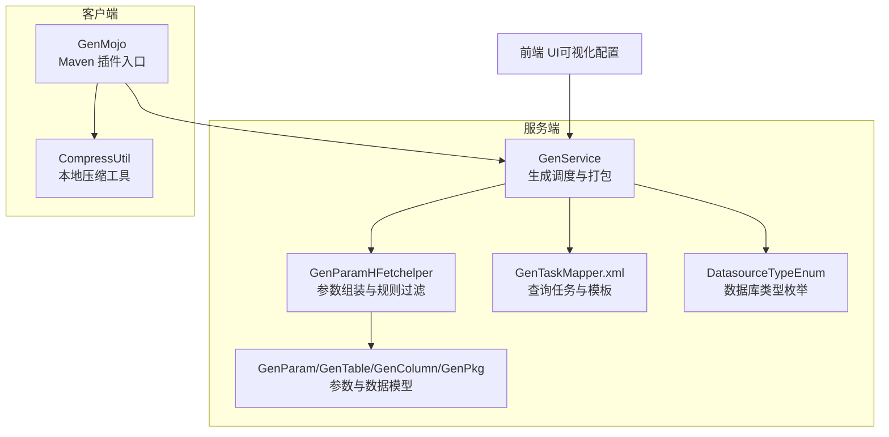
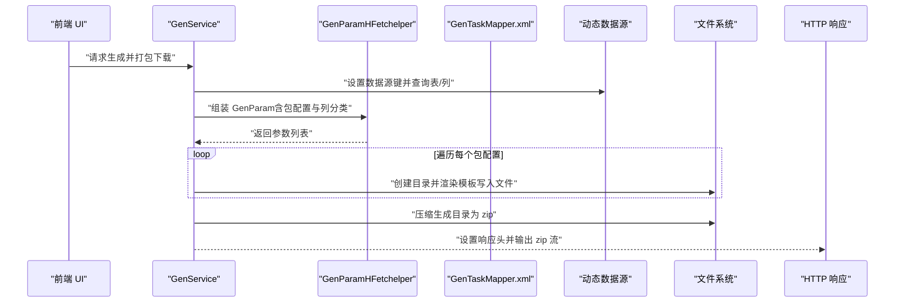
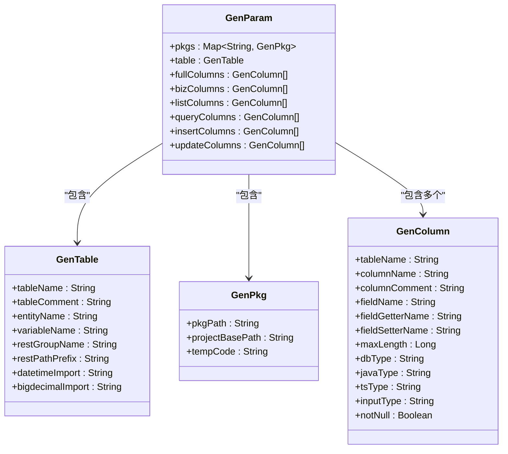
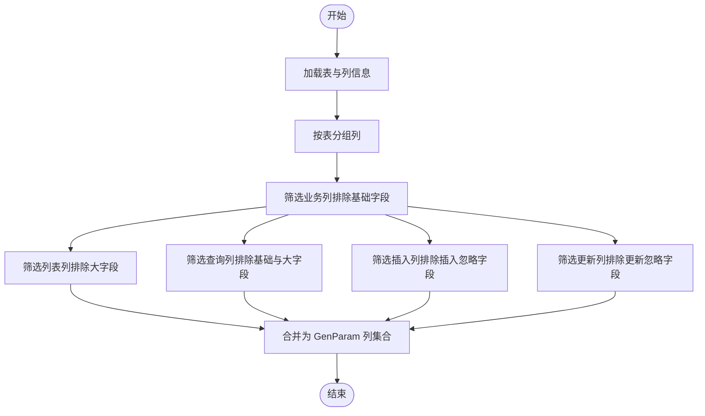
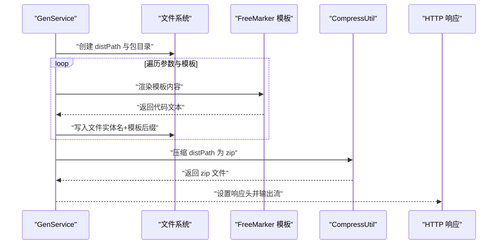
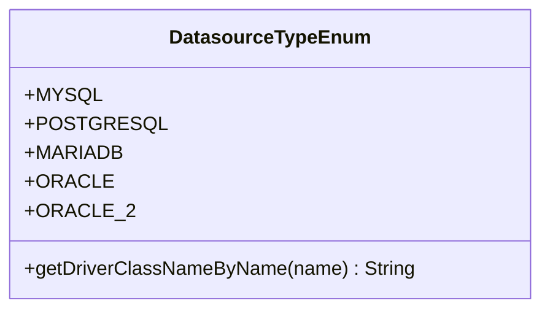
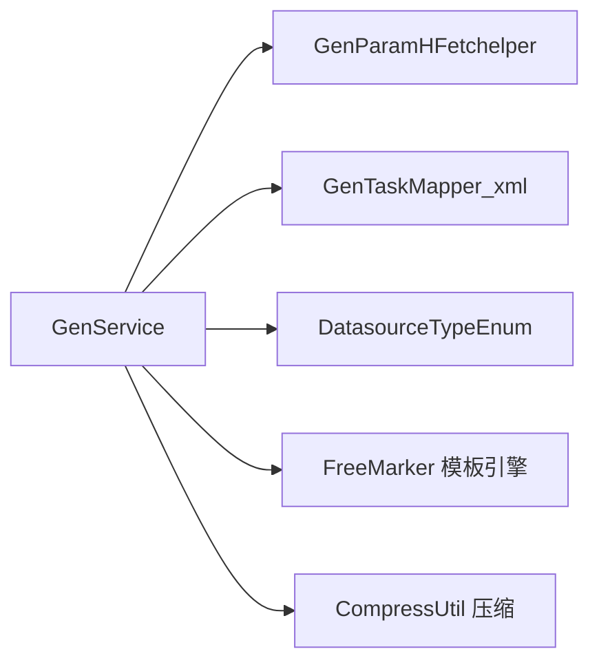

# 代码生成定制

<cite>
**本文引用的文件**
- [GenParam.java](file://generator-server/src/main/java/com/wkclz/generator/server/bean/gen/GenParam.java)
- [GenTable.java](file://generator-server/src/main/java/com/wkclz/generator/server/bean/gen/GenTable.java)
- [GenColumn.java](file://generator-server/src/main/java/com/wkclz/generator/server/bean/gen/GenColumn.java)
- [GenPkg.java](file://generator-server/src/main/java/com/wkclz/generator/server/bean/gen/GenPkg.java)
- [GenParamHFetchelper.java](file://generator-server/src/main/java/com/wkclz/generator/server/helper/GenParamHFetchelper.java)
- [GenService.java](file://generator-server/src/main/java/com/wkclz/generator/server/service/GenService.java)
- [GenMojo.java](file://generator-client/src/main/java/com/wkclz/generator/client/GenMojo.java)
- [CompressUtil.java](file://generator-client/src/main/java/com/wkclz/generator/client/utils/CompressUtil.java)
- [GenTaskDto.java](file://generator-server/src/main/java/com/wkclz/generator/server/bean/dto/GenTaskDto.java)
- [GenTask.java](file://generator-server/src/main/java/com/wkclz/generator/server/bean/entity/GenTask.java)
- [GenTemplate.java](file://generator-server/src/main/java/com/wkclz/generator/server/bean/entity/GenTemplate.java)
- [GenTemplateDto.java](file://generator-server/src/main/java/com/wkclz/generator/server/bean/dto/GenTemplateDto.java)
- [GenTaskMapper.xml](file://generator-server/src/main/resources/mapper/GenTaskMapper.xml)
- [DatasourceTypeEnum.java](file://generator-server/src/main/java/com/wkclz/generator/server/bean/enums/DatasourceTypeEnum.java)
</cite>

## 目录
1. 引言
2. 项目结构
3. 核心组件
4. 架构总览
5. 详细组件分析
6. 依赖分析
7. 性能考虑
8. 故障排查指南
9. 结论
10. 附录

## 引言
本文件面向需要对 SH-Generator 进行深度定制与扩展的工程师，系统阐述代码生成流程的定制方法，包括生成规则配置、输出格式调整、特殊需求处理；详解 GenParam 参数模型的使用（字段映射、包名配置、生成选项设置）；介绍数据模型定制（GenTable 表模型与 GenColumn 列模型的扩展）；说明文件生成与压缩打包的定制方案（输出路径、文件命名规则、压缩格式）；提供多数据库支持的扩展方法（新增数据库类型与驱动配置）；最后给出生成结果的后处理机制（代码格式化、注释生成、版权信息添加）、性能优化技巧与错误处理策略。

## 项目结构
SH-Generator 采用前后端分离与模块化设计：前端 UI 提供可视化配置与下载；服务端负责数据采集、模板渲染、文件生成与打包；客户端插件用于在 Maven 生命周期中触发远程调用或本地生成。核心模块如下：
- generator-server：服务端核心，包含数据模型、模板、任务、数据源、服务层与接口层
- generator-client：Maven 插件入口，封装远程调用与本地压缩工具
- generator-ui：前端界面（本文件不展开）

图示来源
- [GenService.java:38-231](file://generator-server/src/main/java/com/wkclz/generator/server/service/GenService.java#L38-L231)
- [GenParamHFetchelper.java:20-137](file://generator-server/src/main/java/com/wkclz/generator/server/helper/GenParamHFetchelper.java#L20-L137)
- [GenParam.java:10-32](file://generator-server/src/main/java/com/wkclz/generator/server/bean/gen/GenParam.java#L10-L32)
- [GenTaskMapper.xml:38-58](file://generator-server/src/main/resources/mapper/GenTaskMapper.xml#L38-L58)
- [DatasourceTypeEnum.java:13-56](file://generator-server/src/main/java/com/wkclz/generator/server/bean/enums/DatasourceTypeEnum.java#L13-L56)
- [GenMojo.java:15-42](file://generator-client/src/main/java/com/wkclz/generator/client/GenMojo.java#L15-L42)
- [CompressUtil.java:21-82](file://generator-client/src/main/java/com/wkclz/generator/client/utils/CompressUtil.java#L21-L82)

章节来源
- [GenService.java:38-231](file://generator-server/src/main/java/com/wkclz/generator/server/service/GenService.java#L38-L231)
- [GenParamHFetchelper.java:20-137](file://generator-server/src/main/java/com/wkclz/generator/server/helper/GenParamHFetchelper.java#L20-L137)
- [GenTaskMapper.xml:38-58](file://generator-server/src/main/resources/mapper/GenTaskMapper.xml#L38-L58)

## 核心组件
- 参数模型与数据模型
  - GenParam：聚合包配置、表结构、全量列与按用途分类的列集合（业务列、列表列、查询列、新增列、修改列）
  - GenTable：表级元信息（表名、注释、实体名、变量名、REST 分组与路径前缀、导入类型等）
  - GenColumn：列级元信息（列名、注释、变量名、getter/setter、长度、数据库类型、Java/TS 类型、输入类型、非空标记）
  - GenPkg：包级配置（包路径、项目基础路径、模板编码）
- 生成规则与参数组装
  - GenParamHFetchelper：根据表与列信息，组装 GenParam，并按预设规则过滤列（如忽略基础字段、BLOB 字段、插入/更新忽略字段），同时推导表的 REST 配置与导入类型
- 生成服务与打包
  - GenService：拉取项目、数据源、表与列信息，组装参数，渲染模板，写入文件，打包压缩并响应下载
- Maven 客户端
  - GenMojo：Maven 插件入口，接收远程地址与选项，逐项触发生成
  - CompressUtil：本地 ZIP 压缩与解压工具（客户端侧）

章节来源
- [GenParam.java:10-32](file://generator-server/src/main/java/com/wkclz/generator/server/bean/gen/GenParam.java#L10-L32)
- [GenTable.java:8-29](file://generator-server/src/main/java/com/wkclz/generator/server/bean/gen/GenTable.java#L8-L29)
- [GenColumn.java:8-38](file://generator-server/src/main/java/com/wkclz/generator/server/bean/gen/GenColumn.java#L8-L38)
- [GenPkg.java:8-14](file://generator-server/src/main/java/com/wkclz/generator/server/bean/gen/GenPkg.java#L8-L14)
- [GenParamHFetchelper.java:28-80](file://generator-server/src/main/java/com/wkclz/generator/server/helper/GenParamHFetchelper.java#L28-L80)
- [GenService.java:55-90](file://generator-server/src/main/java/com/wkclz/generator/server/service/GenService.java#L55-L90)
- [GenMojo.java:15-42](file://generator-client/src/main/java/com/wkclz/generator/client/GenMojo.java#L15-L42)
- [CompressUtil.java:21-82](file://generator-client/src/main/java/com/wkclz/generator/client/utils/CompressUtil.java#L21-L82)

## 架构总览
下图展示从 UI 触发到生成与下载的关键交互流程，涵盖参数组装、模板渲染、文件落盘与打包下载。

图示来源
- [GenService.java:72-90](file://generator-server/src/main/java/com/wkclz/generator/server/service/GenService.java#L72-L90)
- [GenParamHFetchelper.java:28-80](file://generator-server/src/main/java/com/wkclz/generator/server/helper/GenParamHFetchelper.java#L28-L80)
- [GenTaskMapper.xml:38-58](file://generator-server/src/main/resources/mapper/GenTaskMapper.xml#L38-L58)

## 详细组件分析

### 参数模型与数据模型定制
- GenParam 字段映射与用途
  - pkgs：包级配置集合，键为模板键，值为 GenPkg，决定输出包路径、项目基础路径与模板编码
  - table：表级信息，包含实体名、变量名、REST 分组与路径前缀等
  - fullColumns/bizColumns/listColumns/queryColumns/insertColumns/updateColumns：按用途划分的列集合，便于模板按需取数
- GenTable 扩展点
  - 可扩展表级元信息（如额外的导入包、REST 注解、业务域标识等），以满足不同框架或规范
- GenColumn 扩展点
  - 可扩展列级元信息（如是否主键、是否乐观锁、是否逻辑删除、默认值、校验规则等），用于模板渲染更丰富的上下文
- GenPkg 扩展点
  - 可扩展包级配置（如是否启用特定开关、输出子目录规则、命名策略等）

图示来源
- [GenParam.java:10-32](file://generator-server/src/main/java/com/wkclz/generator/server/bean/gen/GenParam.java#L10-L32)
- [GenTable.java:8-29](file://generator-server/src/main/java/com/wkclz/generator/server/bean/gen/GenTable.java#L8-L29)
- [GenColumn.java:8-38](file://generator-server/src/main/java/com/wkclz/generator/server/bean/gen/GenColumn.java#L8-L38)
- [GenPkg.java:8-14](file://generator-server/src/main/java/com/wkclz/generator/server/bean/gen/GenPkg.java#L8-L14)

章节来源
- [GenParam.java:10-32](file://generator-server/src/main/java/com/wkclz/generator/server/bean/gen/GenParam.java#L10-L32)
- [GenTable.java:8-29](file://generator-server/src/main/java/com/wkclz/generator/server/bean/gen/GenTable.java#L8-L29)
- [GenColumn.java:8-38](file://generator-server/src/main/java/com/wkclz/generator/server/bean/gen/GenColumn.java#L8-L38)
- [GenPkg.java:8-14](file://generator-server/src/main/java/com/wkclz/generator/server/bean/gen/GenPkg.java#L8-L14)

### 生成规则配置与列过滤
- 规则来源与默认行为
  - 忽略基础字段：通过反射读取基础实体字段名集合，排除于业务列
  - 忽略大字段：TEXT/MEDIUMTEXT/TINYTEXT/LONGTEXT/JSON 等列不进入列表与查询列
  - 插入忽略字段：id、createTime、updateTime、version 等
  - 更新忽略字段：id、createBy、createTime、updateTime、version 等
- 自定义扩展建议
  - 在规则集中增加新的忽略字段或条件，以适配业务表结构差异
  - 支持按表名/列名正则匹配进行差异化处理
  - 支持在 GenTask 中扩展“列过滤规则”字段，由服务端读取并注入到参数组装阶段

图示来源
- [GenParamHFetchelper.java:28-80](file://generator-server/src/main/java/com/wkclz/generator/server/helper/GenParamHFetchelper.java#L28-L80)

章节来源
- [GenParamHFetchelper.java:23-80](file://generator-server/src/main/java/com/wkclz/generator/server/helper/GenParamHFetchelper.java#L23-L80)

### 输出格式与文件生成
- 输出路径与命名规则
  - distPath：基于容器工作目录生成唯一时间戳目录
  - 包路径：将包名以点分隔转换为斜杠分隔的层级
  - 文件名：以实体名+模板后缀生成
  - 父路径转义：将 ../ 替换为 parent/，避免路径逃逸
- 写入与模板渲染
  - 使用 FreeMarker 渲染模板，统一换行符为 LF
  - 异常兜底：模板解析异常时输出可定位的错误信息
- 下载与压缩
  - 生成完成后打包为 zip 并通过响应流输出，设置 Content-Disposition 与字符集

图示来源
- [GenService.java:92-159](file://generator-server/src/main/java/com/wkclz/generator/server/service/GenService.java#L92-L159)
- [GenService.java:162-190](file://generator-server/src/main/java/com/wkclz/generator/server/service/GenService.java#L162-L190)

章节来源
- [GenService.java:92-159](file://generator-server/src/main/java/com/wkclz/generator/server/service/GenService.java#L92-L159)
- [GenService.java:162-190](file://generator-server/src/main/java/com/wkclz/generator/server/service/GenService.java#L162-L190)

### Maven 客户端与本地压缩
- GenMojo
  - 支持通过 url 设置远程服务地址，options 传入多个生成选项，逐项执行
- CompressUtil
  - 提供 ZIP 解压能力，支持目录与文件递归解压，缓冲区大小固定

章节来源
- [GenMojo.java:15-42](file://generator-client/src/main/java/com/wkclz/generator/client/GenMojo.java#L15-L42)
- [CompressUtil.java:21-82](file://generator-client/src/main/java/com/wkclz/generator/client/utils/CompressUtil.java#L21-L82)

### 多数据库支持扩展
- 当前支持类型
  - MYSQL、POSTGRESQL、MARIADB、ORACLE、ORACLE_2
- 扩展步骤
  - 在枚举中新增数据库类型与驱动类名
  - 在数据源配置处补充对应驱动与连接参数
  - 若底层 SQL 差异较大，可在表/列信息查询处增加分支处理

图示来源
- [DatasourceTypeEnum.java:13-56](file://generator-server/src/main/java/com/wkclz/generator/server/bean/enums/DatasourceTypeEnum.java#L13-L56)

章节来源
- [DatasourceTypeEnum.java:13-56](file://generator-server/src/main/java/com/wkclz/generator/server/bean/enums/DatasourceTypeEnum.java#L13-L56)

### 生成结果后处理
- 代码格式化
  - 建议在模板中引入格式化占位符或在生成后统一调用外部格式化工具（如 Spotless、Prettier、Google Java Format）
- 注释生成
  - 可在模板中为类与方法生成注释，结合 GenTable.tableComment 与 GenColumn.columnComment
- 版权信息
  - 在模板头部加入版权注释块，或通过全局变量注入公司/项目版权信息

（本节为通用实践建议，不直接分析具体文件）

## 依赖分析
- 组件耦合
  - GenService 依赖任务查询、表/列信息查询、模板查询、日志与数据源切换
  - GenParamHFetchelper 仅依赖表/列信息与任务配置，保持纯数据组装职责
- 外部依赖
  - MyBatis 查询表/列信息
  - FreeMarker 渲染模板
  - CompressUtil 压缩工具

图示来源
- [GenService.java:40-52](file://generator-server/src/main/java/com/wkclz/generator/server/service/GenService.java#L40-L52)
- [GenTaskMapper.xml:38-58](file://generator-server/src/main/resources/mapper/GenTaskMapper.xml#L38-L58)
- [DatasourceTypeEnum.java:13-56](file://generator-server/src/main/java/com/wkclz/generator/server/bean/enums/DatasourceTypeEnum.java#L13-L56)

章节来源
- [GenService.java:40-52](file://generator-server/src/main/java/com/wkclz/generator/server/service/GenService.java#L40-L52)
- [GenTaskMapper.xml:38-58](file://generator-server/src/main/resources/mapper/GenTaskMapper.xml#L38-L58)

## 性能考虑
- 批量查询与缓存
  - 表与列查询应一次性批量获取，减少多次往返
  - 对模板内容与任务配置进行缓存，避免重复 IO
- 渲染与写入
  - 使用缓冲流写入，减少磁盘 IO 次数
  - 模板渲染尽量避免复杂计算，将逻辑前置到参数组装阶段
- 压缩优化
  - 采用合适的缓冲区大小，避免过大内存占用
  - 对大体积项目可考虑分批压缩或增量生成

（本节为通用指导，不直接分析具体文件）

## 故障排查指南
- 常见问题与定位
  - 模板解析异常：查看异常兜底输出的文件路径与模板内容片段，定位模板语法或变量缺失
  - 文件写入失败：检查 distPath 权限与磁盘空间，确认包路径与文件名合法性
  - 下载响应异常：检查 Content-Type、字符集与响应头设置
  - 数据源切换失败：确认动态数据源键与连接配置一致
- 日志与追踪
  - 生成开始与结束时间记录在日志表中，便于追踪耗时与失败原因

章节来源
- [GenService.java:75-90](file://generator-server/src/main/java/com/wkclz/generator/server/service/GenService.java#L75-L90)
- [GenService.java:132-140](file://generator-server/src/main/java/com/wkclz/generator/server/service/GenService.java#L132-L140)

## 结论
通过参数模型与规则组装、模板渲染与文件落盘、以及统一的打包下载机制，SH-Generator 提供了可扩展的代码生成体系。针对不同业务场景，可在参数模型、列过滤规则、输出路径与命名规则、模板内容与注释版权等方面进行定制；同时通过多数据库类型枚举与驱动配置实现对新数据库的支持。配合性能优化与完善的错误处理，可满足大规模代码生成的稳定性与效率要求。

## 附录
- 任务与模板关联查询
  - 通过任务表与模板表的内连接，按项目编码筛选任务并返回模板键，用于确定包级配置与模板编码
- 生成选项与包配置
  - GenTask 中包含项目基础路径、包路径与模板编码，GenPkg 作为最终落盘的包级配置载体

章节来源
- [GenTaskMapper.xml:38-58](file://generator-server/src/main/resources/mapper/GenTaskMapper.xml#L38-L58)
- [GenTask.java:58-67](file://generator-server/src/main/java/com/wkclz/generator/server/bean/entity/GenTask.java#L58-L67)
- [GenTemplate.java:36-49](file://generator-server/src/main/java/com/wkclz/generator/server/bean/entity/GenTemplate.java#L36-L49)
- [GenPkg.java:10-12](file://generator-server/src/main/java/com/wkclz/generator/server/bean/gen/GenPkg.java#L10-L12)