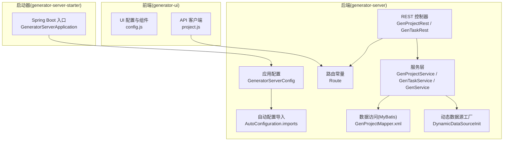
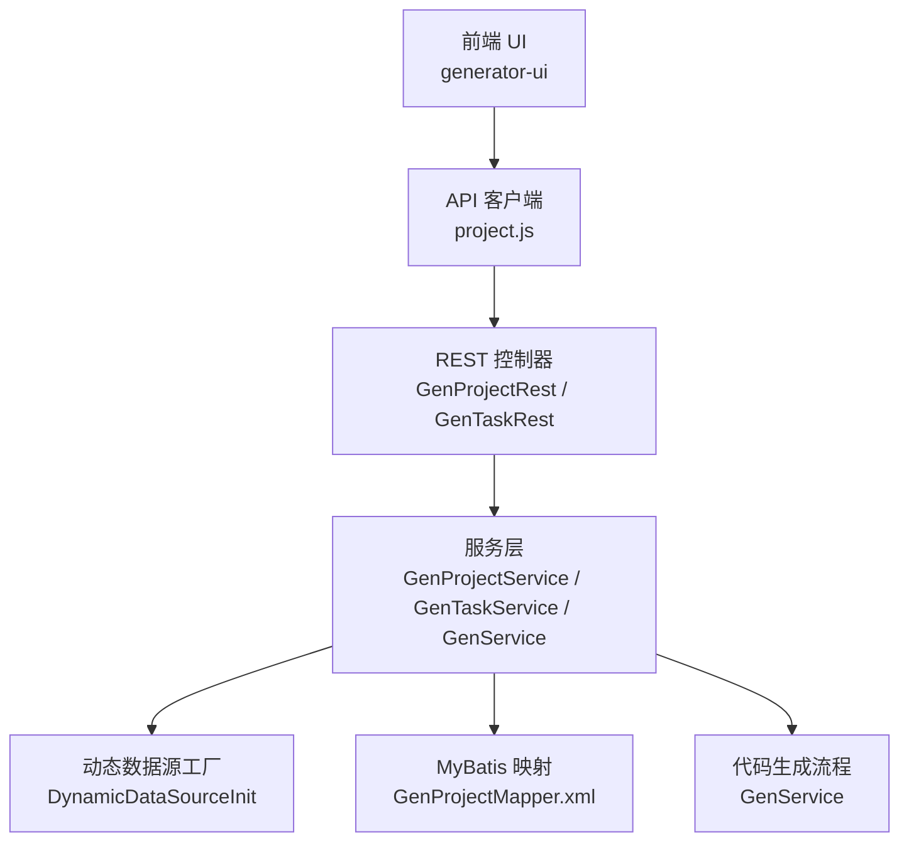
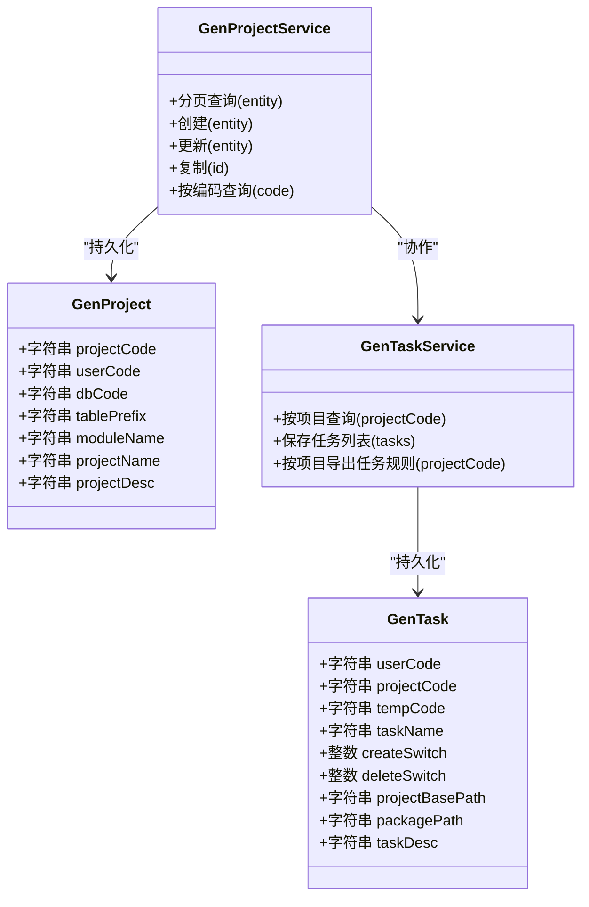
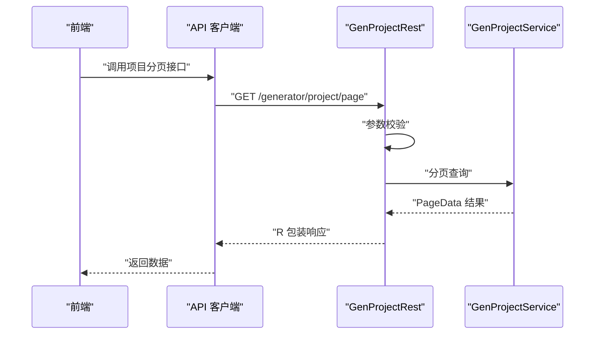
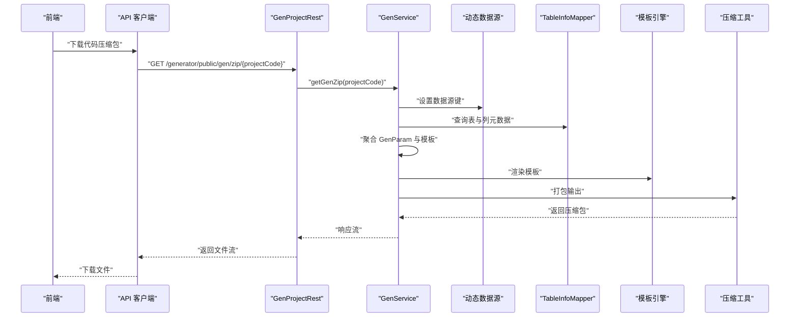
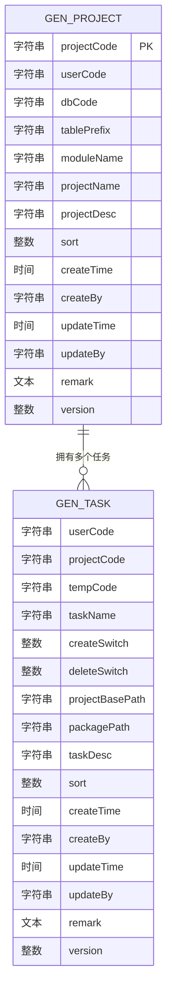
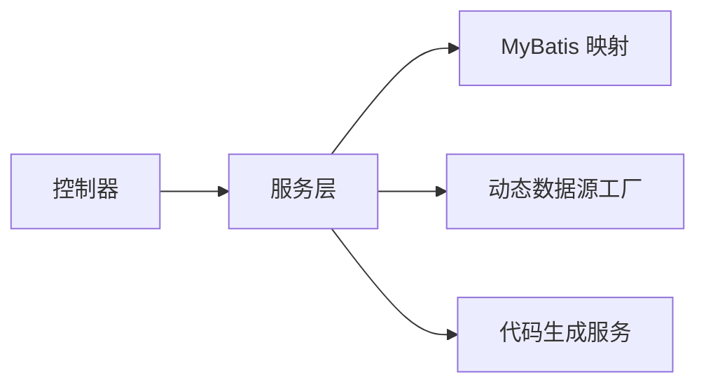

# 功能扩展

<cite>
**本文引用的文件**
- [generator-server/src/main/java/com/wkclz/generator/server/GeneratorServerConfig.java](file://generator-server/src/main/java/com/wkclz/generator/server/GeneratorServerConfig.java)
- [generator-server/src/main/java/com/wkclz/generator/server/Route.java](file://generator-server/src/main/java/com/wkclz/generator/server/Route.java)
- [generator-server/src/main/java/com/wkclz/generator/server/service/GenService.java](file://generator-server/src/main/java/com/wkclz/generator/server/service/GenService.java)
- [generator-server/src/main/java/com/wkclz/generator/server/helper/DynamicDataSourceInit.java](file://generator-server/src/main/java/com/wkclz/generator/server/helper/DynamicDataSourceInit.java)
- [generator-server/src/main/java/com/wkclz/generator/server/rest/GenProjectRest.java](file://generator-server/src/main/java/com/wkclz/generator/server/rest/GenProjectRest.java)
- [generator-server/src/main/java/com/wkclz/generator/server/rest/GenTaskRest.java](file://generator-server/src/main/java/com/wkclz/generator/server/rest/GenTaskRest.java)
- [generator-server/src/main/java/com/wkclz/generator/server/service/GenProjectService.java](file://generator-server/src/main/java/com/wkclz/generator/server/service/GenProjectService.java)
- [generator-server/src/main/java/com/wkclz/generator/server/service/GenTaskService.java](file://generator-server/src/main/java/com/wkclz/generator/server/service/GenTaskService.java)
- [generator-server/src/main/java/com/wkclz/generator/server/bean/entity/GenProject.java](file://generator-server/src/main/java/com/wkclz/generator/server/bean/entity/GenProject.java)
- [generator-server/src/main/java/com/wkclz/generator/server/bean/entity/GenTask.java](file://generator-server/src/main/java/com/wkclz/generator/server/bean/entity/GenTask.java)
- [generator-server/src/main/resources/META-INF/spring/org.springframework.boot.autoconfigure.AutoConfiguration.imports](file://generator-server/src/main/resources/META-INF/spring/org.springframework.boot.autoconfigure.AutoConfiguration.imports)
- [generator-server/src/main/resources/mapper/GenProjectMapper.xml](file://generator-server/src/main/resources/mapper/GenProjectMapper.xml)
- [generator-server-starter/src/main/java/com/wkclz/generator/server/starter/GeneratorServerApplication.java](file://generator-server-starter/src/main/java/com/wkclz/generator/server/starter/GeneratorServerApplication.java)
- [generator-ui/src/utils/generator/config.js](file://generator-ui/src/utils/generator/config.js)
- [generator-ui/src/api/project.js](file://generator-ui/src/api/project.js)
</cite>

## 目录
1. [引言](#引言)
2. [项目结构](#项目结构)
3. [核心组件](#核心组件)
4. [架构总览](#架构总览)
5. [详细组件分析](#详细组件分析)
6. [依赖分析](#依赖分析)
7. [性能考量](#性能考量)
8. [故障排查指南](#故障排查指南)
9. [结论](#结论)
10. [附录](#附录)

## 引言
本文件面向希望在 SH-Generator 项目上进行功能扩展与二次开发的工程师，系统化地说明如何新增业务模块（服务层、数据访问层、接口层），如何基于现有插件化能力进行扩展（当前项目未内置通用插件框架，但具备可扩展点），以及如何对接第三方系统（API 扩展、数据源适配、外部服务）。同时，文档给出动态数据源配置与路由管理的扩展实现思路，详解代码生成流程的扩展点（自定义生成规则、输出格式定制、特殊需求处理），并总结最佳实践与常见问题排查方法。

## 项目结构
项目采用前后端分离与多模块划分：后端由 Spring Boot 应用、MyBatis 映射、REST 接口、服务层与实体类组成；前端使用 Vue3 + Vite 构建，提供可视化配置与交互；另有启动模块负责应用入口。

图表来源
- [generator-server/src/main/java/com/wkclz/generator/server/GeneratorServerConfig.java:1-14](file://generator-server/src/main/java/com/wkclz/generator/server/GeneratorServerConfig.java#L1-L14)
- [generator-server/src/main/resources/META-INF/spring/org.springframework.boot.autoconfigure.AutoConfiguration.imports:1-2](file://generator-server/src/main/resources/META-INF/spring/org.springframework.boot.autoconfigure.AutoConfiguration.imports#L1-L2)
- [generator-server/src/main/java/com/wkclz/generator/server/Route.java:1-89](file://generator-server/src/main/java/com/wkclz/generator/server/Route.java#L1-L89)
- [generator-server/src/main/java/com/wkclz/generator/server/rest/GenProjectRest.java:1-79](file://generator-server/src/main/java/com/wkclz/generator/server/rest/GenProjectRest.java#L1-L79)
- [generator-server/src/main/java/com/wkclz/generator/server/rest/GenTaskRest.java:1-75](file://generator-server/src/main/java/com/wkclz/generator/server/rest/GenTaskRest.java#L1-L75)
- [generator-server/src/main/java/com/wkclz/generator/server/service/GenProjectService.java:1-134](file://generator-server/src/main/java/com/wkclz/generator/server/service/GenProjectService.java#L1-L134)
- [generator-server/src/main/java/com/wkclz/generator/server/service/GenTaskService.java:1-114](file://generator-server/src/main/java/com/wkclz/generator/server/service/GenTaskService.java#L1-L114)
- [generator-server/src/main/resources/mapper/GenProjectMapper.xml:1-38](file://generator-server/src/main/resources/mapper/GenProjectMapper.xml#L1-L38)
- [generator-server/src/main/java/com/wkclz/generator/server/helper/DynamicDataSourceInit.java:1-61](file://generator-server/src/main/java/com/wkclz/generator/server/helper/DynamicDataSourceInit.java#L1-L61)
- [generator-server-starter/src/main/java/com/wkclz/generator/server/starter/GeneratorServerApplication.java:1-16](file://generator-server-starter/src/main/java/com/wkclz/generator/server/starter/GeneratorServerApplication.java#L1-L16)
- [generator-ui/src/utils/generator/config.js:1-453](file://generator-ui/src/utils/generator/config.js#L1-L453)
- [generator-ui/src/api/project.js:1-34](file://generator-ui/src/api/project.js#L1-L34)

章节来源
- [generator-server/src/main/java/com/wkclz/generator/server/GeneratorServerConfig.java:1-14](file://generator-server/src/main/java/com/wkclz/generator/server/GeneratorServerConfig.java#L1-L14)
- [generator-server-starter/src/main/java/com/wkclz/generator/server/starter/GeneratorServerApplication.java:1-16](file://generator-server-starter/src/main/java/com/wkclz/generator/server/starter/GeneratorServerApplication.java#L1-L16)

## 核心组件
- 应用配置与扫描
  - 自动装配与组件扫描、Mapper 扫描集中在应用配置类中，确保服务、控制器、映射器被正确加载。
- 路由常量
  - 将所有 REST 路由集中定义，便于统一维护与扩展。
- REST 控制器
  - 以项目与任务为例，提供分页、详情、新增、修改、删除、复制等标准 CRUD 接口。
- 服务层
  - 提供业务逻辑封装，如项目唯一性校验、任务批量保存与差异同步、代码生成主流程。
- 数据访问层
  - MyBatis XML 映射，支持分页查询与条件过滤。
- 动态数据源
  - 基于项目编码切换数据源，支持 MySQL/MariaDB 类型校验与连接参数组装。
- 代码生成服务
  - 聚合表元数据、列元数据、任务规则，渲染模板并输出压缩包返回。

章节来源
- [generator-server/src/main/java/com/wkclz/generator/server/Route.java:1-89](file://generator-server/src/main/java/com/wkclz/generator/server/Route.java#L1-L89)
- [generator-server/src/main/java/com/wkclz/generator/server/rest/GenProjectRest.java:1-79](file://generator-server/src/main/java/com/wkclz/generator/server/rest/GenProjectRest.java#L1-L79)
- [generator-server/src/main/java/com/wkclz/generator/server/rest/GenTaskRest.java:1-75](file://generator-server/src/main/java/com/wkclz/generator/server/rest/GenTaskRest.java#L1-L75)
- [generator-server/src/main/java/com/wkclz/generator/server/service/GenProjectService.java:1-134](file://generator-server/src/main/java/com/wkclz/generator/server/service/GenProjectService.java#L1-L134)
- [generator-server/src/main/java/com/wkclz/generator/server/service/GenTaskService.java:1-114](file://generator-server/src/main/java/com/wkclz/generator/server/service/GenTaskService.java#L1-L114)
- [generator-server/src/main/resources/mapper/GenProjectMapper.xml:1-38](file://generator-server/src/main/resources/mapper/GenProjectMapper.xml#L1-L38)
- [generator-server/src/main/java/com/wkclz/generator/server/helper/DynamicDataSourceInit.java:1-61](file://generator-server/src/main/java/com/wkclz/generator/server/helper/DynamicDataSourceInit.java#L1-L61)
- [generator-server/src/main/java/com/wkclz/generator/server/service/GenService.java:1-231](file://generator-server/src/main/java/com/wkclz/generator/server/service/GenService.java#L1-L231)

## 架构总览
后端采用典型的三层架构：接口层（REST）负责请求接入与参数校验；服务层承载业务规则；数据访问层负责持久化；动态数据源工厂按项目维度切换数据源；前端通过 API 客户端调用后端路由。

图表来源
- [generator-ui/src/api/project.js:1-34](file://generator-ui/src/api/project.js#L1-L34)
- [generator-server/src/main/java/com/wkclz/generator/server/rest/GenProjectRest.java:1-79](file://generator-server/src/main/java/com/wkclz/generator/server/rest/GenProjectRest.java#L1-L79)
- [generator-server/src/main/java/com/wkclz/generator/server/rest/GenTaskRest.java:1-75](file://generator-server/src/main/java/com/wkclz/generator/server/rest/GenTaskRest.java#L1-L75)
- [generator-server/src/main/java/com/wkclz/generator/server/service/GenProjectService.java:1-134](file://generator-server/src/main/java/com/wkclz/generator/server/service/GenProjectService.java#L1-L134)
- [generator-server/src/main/java/com/wkclz/generator/server/service/GenTaskService.java:1-114](file://generator-server/src/main/java/com/wkclz/generator/server/service/GenTaskService.java#L1-L114)
- [generator-server/src/main/java/com/wkclz/generator/server/service/GenService.java:1-231](file://generator-server/src/main/java/com/wkclz/generator/server/service/GenService.java#L1-L231)
- [generator-server/src/main/java/com/wkclz/generator/server/helper/DynamicDataSourceInit.java:1-61](file://generator-server/src/main/java/com/wkclz/generator/server/helper/DynamicDataSourceInit.java#L1-L61)
- [generator-server/src/main/resources/mapper/GenProjectMapper.xml:1-38](file://generator-server/src/main/resources/mapper/GenProjectMapper.xml#L1-L38)

## 详细组件分析

### 服务层扩展指南（以项目与任务为例）
- 新增实体与映射
  - 在实体包中新增领域对象，参考项目与任务实体的字段注解与拷贝工具方法。
  - 在资源目录新增对应的 MyBatis 映射文件，遵循命名空间与 SQL 片段组织。
- 新增服务类
  - 继承基础服务基类，实现分页查询、唯一性校验、复制逻辑等。
  - 对外暴露方法，内部协调 Mapper 与缓存/ID 生成器等依赖。
- 新增控制器
  - 在路由常量中补充新模块的路由常量。
  - 编写 REST 控制器，完成参数校验、调用服务层并返回结果包装。
- 新增前端页面与 API 客户端
  - 在前端 API 目录新增对应客户端方法，统一调用后端路由。
  - 在视图层新增页面组件，绑定 API 并展示数据。

图表来源
- [generator-server/src/main/java/com/wkclz/generator/server/bean/entity/GenProject.java:1-108](file://generator-server/src/main/java/com/wkclz/generator/server/bean/entity/GenProject.java#L1-L108)
- [generator-server/src/main/java/com/wkclz/generator/server/bean/entity/GenTask.java:1-124](file://generator-server/src/main/java/com/wkclz/generator/server/bean/entity/GenTask.java#L1-L124)
- [generator-server/src/main/java/com/wkclz/generator/server/service/GenProjectService.java:1-134](file://generator-server/src/main/java/com/wkclz/generator/server/service/GenProjectService.java#L1-L134)
- [generator-server/src/main/java/com/wkclz/generator/server/service/GenTaskService.java:1-114](file://generator-server/src/main/java/com/wkclz/generator/server/service/GenTaskService.java#L1-L114)

章节来源
- [generator-server/src/main/java/com/wkclz/generator/server/bean/entity/GenProject.java:1-108](file://generator-server/src/main/java/com/wkclz/generator/server/bean/entity/GenProject.java#L1-L108)
- [generator-server/src/main/java/com/wkclz/generator/server/bean/entity/GenTask.java:1-124](file://generator-server/src/main/java/com/wkclz/generator/server/bean/entity/GenTask.java#L1-L124)
- [generator-server/src/main/java/com/wkclz/generator/server/service/GenProjectService.java:1-134](file://generator-server/src/main/java/com/wkclz/generator/server/service/GenProjectService.java#L1-L134)
- [generator-server/src/main/java/com/wkclz/generator/server/service/GenTaskService.java:1-114](file://generator-server/src/main/java/com/wkclz/generator/server/service/GenTaskService.java#L1-L114)

### 接口层扩展指南（REST）
- 路由常量扩展
  - 在路由常量接口中新增模块路由常量，保持前缀与语义一致。
- 控制器扩展
  - 使用注解声明请求路径与方法，完成参数校验与结果包装。
  - 参考项目与任务控制器的参数校验与异常断言策略。

图表来源
- [generator-ui/src/api/project.js:1-34](file://generator-ui/src/api/project.js#L1-L34)
- [generator-server/src/main/java/com/wkclz/generator/server/rest/GenProjectRest.java:1-79](file://generator-server/src/main/java/com/wkclz/generator/server/rest/GenProjectRest.java#L1-L79)
- [generator-server/src/main/java/com/wkclz/generator/server/service/GenProjectService.java:1-134](file://generator-server/src/main/java/com/wkclz/generator/server/service/GenProjectService.java#L1-L134)

章节来源
- [generator-server/src/main/java/com/wkclz/generator/server/Route.java:1-89](file://generator-server/src/main/java/com/wkclz/generator/server/Route.java#L1-L89)
- [generator-server/src/main/java/com/wkclz/generator/server/rest/GenProjectRest.java:1-79](file://generator-server/src/main/java/com/wkclz/generator/server/rest/GenProjectRest.java#L1-L79)
- [generator-ui/src/api/project.js:1-34](file://generator-ui/src/api/project.js#L1-L34)

### 插件开发指南（当前项目未内置通用插件框架）
- 现状说明
  - 项目未发现通用插件接口或 SPI 机制，无法直接“插拔式”扩展。
- 可行的扩展路径
  - 通过配置化与策略模式：在服务层引入可配置的策略类，按项目或模板编码选择不同实现。
  - 通过继承与多态：在服务层新增抽象基类，子类覆盖特定行为（如模板解析、输出格式）。
  - 通过外部钩子：在关键流程（如生成前/后）预留回调接口，由外部注入实现。
- 生命周期管理建议
  - 初始化：在应用启动时加载配置与策略映射。
  - 运行期：按需选择策略，保证线程安全与幂等。
  - 卸载/切换：通过配置热更新或重启生效。
- 注册机制建议
  - 使用枚举或 Map 映射策略键与实现类，避免硬编码分支。
  - 提供默认实现与可替换实现，确保向后兼容。

[本节为概念性指导，不直接分析具体文件，故无章节来源]

### 第三方系统集成方案
- API 接口扩展
  - 在路由常量中新增第三方集成接口，控制器中完成鉴权与参数校验，服务层对接外部系统。
- 数据源适配
  - 动态数据源工厂支持 MySQL/MariaDB，若需扩展其他数据库，可在工厂中增加类型判断与连接串拼装。
- 外部服务对接
  - 在服务层通过 HTTP 客户端或 SDK 调用外部服务，注意超时、重试与熔断策略。
  - 对接完成后，将外部结果与本地实体进行映射与持久化。

章节来源
- [generator-server/src/main/java/com/wkclz/generator/server/helper/DynamicDataSourceInit.java:1-61](file://generator-server/src/main/java/com/wkclz/generator/server/helper/DynamicDataSourceInit.java#L1-L61)
- [generator-server/src/main/java/com/wkclz/generator/server/Route.java:1-89](file://generator-server/src/main/java/com/wkclz/generator/server/Route.java#L1-L89)

### 动态数据源配置与路由管理扩展
- 动态数据源扩展
  - 在工厂中新增数据库类型分支，组装相应连接串与驱动参数。
  - 支持凭据加密、连接池参数配置与健康检查。
- 路由管理扩展
  - 在路由常量中新增模块与接口常量，控制器中统一使用注解声明路径。
  - 前端 API 客户端与视图层按新路由进行对接。

章节来源
- [generator-server/src/main/java/com/wkclz/generator/server/helper/DynamicDataSourceInit.java:1-61](file://generator-server/src/main/java/com/wkclz/generator/server/helper/DynamicDataSourceInit.java#L1-L61)
- [generator-server/src/main/java/com/wkclz/generator/server/Route.java:1-89](file://generator-server/src/main/java/com/wkclz/generator/server/Route.java#L1-L89)

### 代码生成流程扩展点
- 自定义生成规则
  - 在任务服务中扩展规则导出与校验逻辑，支持按模板编码与项目维度生成差异化规则。
- 输出格式定制
  - 在生成服务中扩展模板解析与文件输出策略，支持多模板组合与文件后缀定制。
- 特殊需求处理
  - 在生成服务中增加异常兜底与日志记录，对模板解析失败、文件写入失败等情况进行降级处理。
- 生成流程时序

图表来源
- [generator-server/src/main/java/com/wkclz/generator/server/service/GenService.java:1-231](file://generator-server/src/main/java/com/wkclz/generator/server/service/GenService.java#L1-L231)
- [generator-server/src/main/java/com/wkclz/generator/server/helper/DynamicDataSourceInit.java:1-61](file://generator-server/src/main/java/com/wkclz/generator/server/helper/DynamicDataSourceInit.java#L1-L61)

章节来源
- [generator-server/src/main/java/com/wkclz/generator/server/service/GenService.java:1-231](file://generator-server/src/main/java/com/wkclz/generator/server/service/GenService.java#L1-L231)

### 数据模型与关系

图表来源
- [generator-server/src/main/java/com/wkclz/generator/server/bean/entity/GenProject.java:1-108](file://generator-server/src/main/java/com/wkclz/generator/server/bean/entity/GenProject.java#L1-L108)
- [generator-server/src/main/java/com/wkclz/generator/server/bean/entity/GenTask.java:1-124](file://generator-server/src/main/java/com/wkclz/generator/server/bean/entity/GenTask.java#L1-L124)

## 依赖分析
- 组件耦合
  - 控制器依赖服务层；服务层依赖映射器与动态数据源工厂；生成服务依赖模板引擎与压缩工具。
- 外部依赖
  - Spring Boot、MyBatis、FreeMarker、Apache Commons、Hutool、动态数据源组件等。
- 自动装配
  - 通过自动配置导入与组件扫描，确保模块被纳入上下文。

图表来源
- [generator-server/src/main/java/com/wkclz/generator/server/rest/GenProjectRest.java:1-79](file://generator-server/src/main/java/com/wkclz/generator/server/rest/GenProjectRest.java#L1-L79)
- [generator-server/src/main/java/com/wkclz/generator/server/service/GenProjectService.java:1-134](file://generator-server/src/main/java/com/wkclz/generator/server/service/GenProjectService.java#L1-L134)
- [generator-server/src/main/resources/mapper/GenProjectMapper.xml:1-38](file://generator-server/src/main/resources/mapper/GenProjectMapper.xml#L1-L38)
- [generator-server/src/main/java/com/wkclz/generator/server/helper/DynamicDataSourceInit.java:1-61](file://generator-server/src/main/java/com/wkclz/generator/server/helper/DynamicDataSourceInit.java#L1-L61)
- [generator-server/src/main/java/com/wkclz/generator/server/service/GenService.java:1-231](file://generator-server/src/main/java/com/wkclz/generator/server/service/GenService.java#L1-L231)

章节来源
- [generator-server/src/main/resources/META-INF/spring/org.springframework.boot.autoconfigure.AutoConfiguration.imports:1-2](file://generator-server/src/main/resources/META-INF/spring/org.springframework.boot.autoconfigure.AutoConfiguration.imports#L1-L2)
- [generator-server/src/main/java/com/wkclz/generator/server/GeneratorServerConfig.java:1-14](file://generator-server/src/main/java/com/wkclz/generator/server/GeneratorServerConfig.java#L1-L14)

## 性能考量
- 生成性能
  - 批量写文件与模板渲染可能成为瓶颈，建议异步生成与分批输出，减少 IO 抖动。
  - 对模板内容进行缓存与预编译，降低解析开销。
- 数据访问
  - 分页查询与条件过滤已由映射器实现，建议合理使用索引与分页大小控制。
- 动态数据源
  - 切换数据源应尽量复用连接池，避免频繁创建销毁连接。
- 前端交互
  - 大文件下载建议采用分片或后台任务+消息通知，避免阻塞主线程。

[本节提供通用建议，不直接分析具体文件，故无章节来源]

## 故障排查指南
- 参数校验异常
  - 控制器与服务层均进行参数校验，关注空值与唯一性冲突。
- 数据源异常
  - 动态数据源工厂对数据库类型与连接参数进行校验，检查编码是否存在与类型是否受支持。
- 生成异常
  - 模板解析失败时会回退为异常文本，检查模板内容与变量映射。
- 下载异常
  - 压缩包生成与响应流写出失败时，检查磁盘权限与临时目录可用性。

章节来源
- [generator-server/src/main/java/com/wkclz/generator/server/rest/GenProjectRest.java:1-79](file://generator-server/src/main/java/com/wkclz/generator/server/rest/GenProjectRest.java#L1-L79)
- [generator-server/src/main/java/com/wkclz/generator/server/service/GenProjectService.java:1-134](file://generator-server/src/main/java/com/wkclz/generator/server/service/GenProjectService.java#L1-L134)
- [generator-server/src/main/java/com/wkclz/generator/server/helper/DynamicDataSourceInit.java:1-61](file://generator-server/src/main/java/com/wkclz/generator/server/helper/DynamicDataSourceInit.java#L1-L61)
- [generator-server/src/main/java/com/wkclz/generator/server/service/GenService.java:1-231](file://generator-server/src/main/java/com/wkclz/generator/server/service/GenService.java#L1-L231)

## 结论
SH-Generator 已具备清晰的三层架构与可扩展的路由体系。通过在实体、映射、服务与控制器层面进行标准化扩展，即可快速新增业务模块；通过动态数据源与生成流程的扩展点，可满足多样化的数据源与输出格式需求。建议在后续版本中引入通用插件框架与策略模式，进一步提升系统的可插拔性与可维护性。

## 附录
- 前端组件与表单配置
  - UI 层提供了丰富的表单组件与布局配置，可用于扩展新的业务表单与可视化配置面板。
- API 客户端示例
  - 项目模块的 API 客户端展示了标准的 GET/POST 请求封装方式，可作为新增模块 API 的参考。

章节来源
- [generator-ui/src/utils/generator/config.js:1-453](file://generator-ui/src/utils/generator/config.js#L1-L453)
- [generator-ui/src/api/project.js:1-34](file://generator-ui/src/api/project.js#L1-L34)