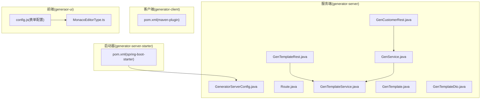
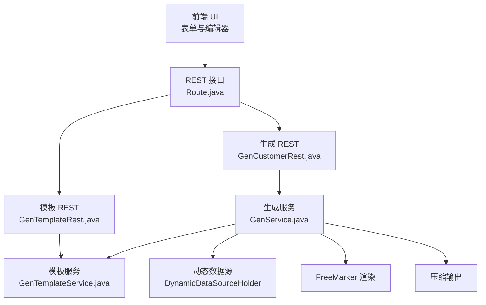
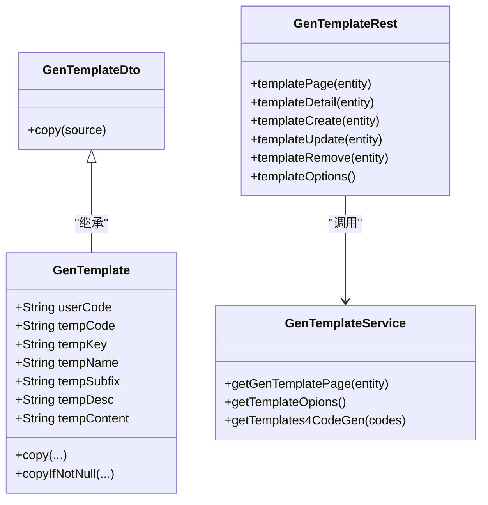
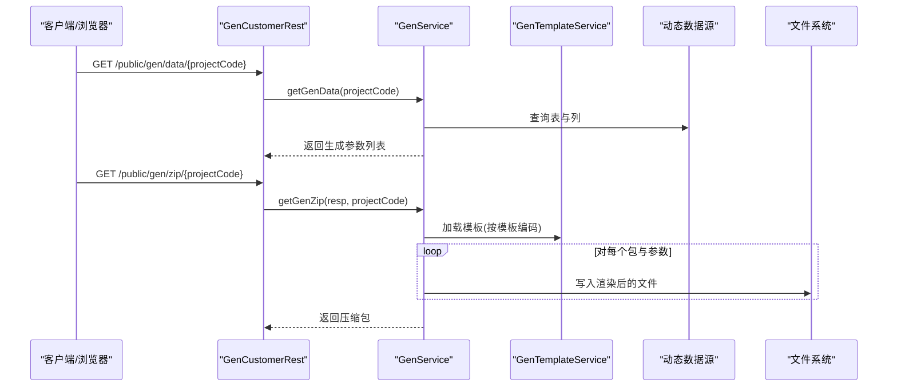
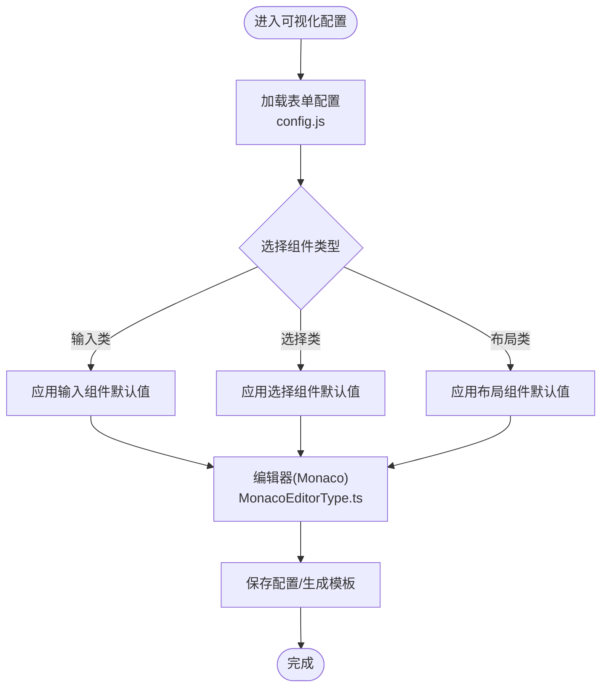
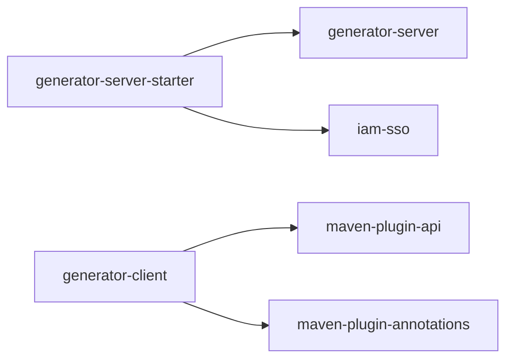

# 扩展与定制

<cite>
**本文引用的文件**
- [README.md](file://README.md)
- [generator-server/src/main/java/com/wkclz/generator/server/Route.java](file://generator-server/src/main/java/com/wkclz/generator/server/Route.java)
- [generator-server/src/main/java/com/wkclz/generator/server/service/GenTemplateService.java](file://generator-server/src/main/java/com/wkclz/generator/server/service/GenTemplateService.java)
- [generator-server/src/main/java/com/wkclz/generator/server/rest/GenTemplateRest.java](file://generator-server/src/main/java/com/wkclz/generator/server/rest/GenTemplateRest.java)
- [generator-server/src/main/java/com/wkclz/generator/server/bean/entity/GenTemplate.java](file://generator-server/src/main/java/com/wkclz/generator/server/bean/entity/GenTemplate.java)
- [generator-server/src/main/java/com/wkclz/generator/server/bean/dto/GenTemplateDto.java](file://generator-server/src/main/java/com/wkclz/generator/server/bean/dto/GenTemplateDto.java)
- [generator-server/src/main/java/com/wkclz/generator/server/service/GenService.java](file://generator-server/src/main/java/com/wkclz/generator/server/service/GenService.java)
- [generator-server/src/main/java/com/wkclz/generator/server/rest/GenCustomerRest.java](file://generator-server/src/main/java/com/wkclz/generator/server/rest/GenCustomerRest.java)
- [generator-server/src/main/java/com/wkclz/generator/server/GeneratorServerConfig.java](file://generator-server/src/main/java/com/wkclz/generator/server/GeneratorServerConfig.java)
- [generator-server-starter/pom.xml](file://generator-server-starter/pom.xml)
- [generator-client/pom.xml](file://generator-client/pom.xml)
- [generator-ui/src/utils/generator/config.js](file://generator-ui/src/utils/generator/config.js)
- [generator-ui/src/components/MonacoEditor/MonacoEditorType.ts](file://generator-ui/src/components/MonacoEditor/MonacoEditorType.ts)
</cite>

## 目录
1. 引言
2. 项目结构
3. 核心组件
4. 架构总览
5. 详细组件分析
6. 依赖分析
7. 性能考虑
8. 故障排查指南
9. 结论
10. 附录

## 引言
本文件面向需要对 SH-Generator 进行扩展与定制的开发者，围绕以下目标展开：模板系统的定制（自定义模板开发、模板变量与语法）、功能扩展（新增业务模块、插件与第三方集成）、代码生成流程定制（生成规则、输出格式、特殊需求）、以及 UI 组件扩展（自定义组件、样式与交互）。文档在每个涉及具体实现细节的部分均给出“章节来源”，并在可视化图表中注明“图示来源”。

## 项目结构
项目采用多模块架构，分为服务端、客户端插件与前端 UI 三部分：
- 服务端模块：提供 REST 接口、模板管理、生成流程与数据访问能力
- 客户端插件模块：Maven 插件入口，便于在构建阶段触发生成
- 前端 UI 模块：基于 Vue 3 + Element Plus 的可视化界面，支持表单拖拽与编辑器

**图示来源**
- [generator-server/src/main/java/com/wkclz/generator/server/GeneratorServerConfig.java:1-14](file://generator-server/src/main/java/com/wkclz/generator/server/GeneratorServerConfig.java#L1-L14)
- [generator-server/src/main/java/com/wkclz/generator/server/Route.java:1-89](file://generator-server/src/main/java/com/wkclz/generator/server/Route.java#L1-L89)
- [generator-server/src/main/java/com/wkclz/generator/server/rest/GenTemplateRest.java:1-82](file://generator-server/src/main/java/com/wkclz/generator/server/rest/GenTemplateRest.java#L1-L82)
- [generator-server/src/main/java/com/wkclz/generator/server/service/GenTemplateService.java:1-34](file://generator-server/src/main/java/com/wkclz/generator/server/service/GenTemplateService.java#L1-L34)
- [generator-server/src/main/java/com/wkclz/generator/server/bean/entity/GenTemplate.java:1-108](file://generator-server/src/main/java/com/wkclz/generator/server/bean/entity/GenTemplate.java#L1-L108)
- [generator-server/src/main/java/com/wkclz/generator/server/bean/dto/GenTemplateDto.java:1-32](file://generator-server/src/main/java/com/wkclz/generator/server/bean/dto/GenTemplateDto.java#L1-L32)
- [generator-server/src/main/java/com/wkclz/generator/server/rest/GenCustomerRest.java:1-44](file://generator-server/src/main/java/com/wkclz/generator/server/rest/GenCustomerRest.java#L1-L44)
- [generator-server/src/main/java/com/wkclz/generator/server/service/GenService.java:1-231](file://generator-server/src/main/java/com/wkclz/generator/server/service/GenService.java#L1-L231)
- [generator-client/pom.xml:1-75](file://generator-client/pom.xml#L1-L75)
- [generator-server-starter/pom.xml:1-52](file://generator-server-starter/pom.xml#L1-L52)
- [generator-ui/src/utils/generator/config.js:1-453](file://generator-ui/src/utils/generator/config.js#L1-L453)
- [generator-ui/src/components/MonacoEditor/MonacoEditorType.ts:1-76](file://generator-ui/src/components/MonacoEditor/MonacoEditorType.ts#L1-L76)

**章节来源**
- [README.md:1-3](file://README.md#L1-L3)
- [generator-server/src/main/java/com/wkclz/generator/server/Route.java:1-89](file://generator-server/src/main/java/com/wkclz/generator/server/Route.java#L1-L89)
- [generator-server-starter/pom.xml:1-52](file://generator-server-starter/pom.xml#L1-L52)
- [generator-client/pom.xml:1-75](file://generator-client/pom.xml#L1-L75)

## 核心组件
- 模板管理：通过 REST 接口提供模板的增删改查与选项查询；模板实体包含模板编码、键、名称、后缀、描述与内容等字段；服务层提供分页、选项与按编码集合批量加载模板的能力
- 代码生成：根据项目配置与任务规则，动态获取表与列信息，组装生成参数，使用 FreeMarker 渲染模板，写入磁盘并打包下载
- 路由与接口：统一在 Route 接口中声明 REST 路径常量，便于前后端协作与扩展
- 前端配置：提供丰富的表单组件配置与 Monaco 编辑器类型定义，支撑模板编辑与可视化配置

**章节来源**
- [generator-server/src/main/java/com/wkclz/generator/server/rest/GenTemplateRest.java:1-82](file://generator-server/src/main/java/com/wkclz/generator/server/rest/GenTemplateRest.java#L1-L82)
- [generator-server/src/main/java/com/wkclz/generator/server/service/GenTemplateService.java:1-34](file://generator-server/src/main/java/com/wkclz/generator/server/service/GenTemplateService.java#L1-L34)
- [generator-server/src/main/java/com/wkclz/generator/server/bean/entity/GenTemplate.java:1-108](file://generator-server/src/main/java/com/wkclz/generator/server/bean/entity/GenTemplate.java#L1-L108)
- [generator-server/src/main/java/com/wkclz/generator/server/service/GenService.java:1-231](file://generator-server/src/main/java/com/wkclz/generator/server/service/GenService.java#L1-L231)
- [generator-server/src/main/java/com/wkclz/generator/server/rest/GenCustomerRest.java:1-44](file://generator-server/src/main/java/com/wkclz/generator/server/rest/GenCustomerRest.java#L1-L44)
- [generator-server/src/main/java/com/wkclz/generator/server/Route.java:1-89](file://generator-server/src/main/java/com/wkclz/generator/server/Route.java#L1-L89)
- [generator-ui/src/utils/generator/config.js:1-453](file://generator-ui/src/utils/generator/config.js#L1-L453)
- [generator-ui/src/components/MonacoEditor/MonacoEditorType.ts:1-76](file://generator-ui/src/components/MonacoEditor/MonacoEditorType.ts#L1-L76)

## 架构总览
整体架构遵循“前端可视化 + 后端服务 + 模板引擎 + 数据源”的模式。前端负责模板与规则的可视化配置，后端负责解析规则、读取数据库元数据、渲染模板并输出压缩包。

**图示来源**
- [generator-server/src/main/java/com/wkclz/generator/server/Route.java:1-89](file://generator-server/src/main/java/com/wkclz/generator/server/Route.java#L1-L89)
- [generator-server/src/main/java/com/wkclz/generator/server/rest/GenTemplateRest.java:1-82](file://generator-server/src/main/java/com/wkclz/generator/server/rest/GenTemplateRest.java#L1-L82)
- [generator-server/src/main/java/com/wkclz/generator/server/rest/GenCustomerRest.java:1-44](file://generator-server/src/main/java/com/wkclz/generator/server/rest/GenCustomerRest.java#L1-L44)
- [generator-server/src/main/java/com/wkclz/generator/server/service/GenTemplateService.java:1-34](file://generator-server/src/main/java/com/wkclz/generator/server/service/GenTemplateService.java#L1-L34)
- [generator-server/src/main/java/com/wkclz/generator/server/service/GenService.java:1-231](file://generator-server/src/main/java/com/wkclz/generator/server/service/GenService.java#L1-L231)

## 详细组件分析

### 模板系统定制
- 模板实体与 DTO：模板实体包含用户标识、模板编码、键、名称、后缀、描述与内容等字段；DTO 提供实体拷贝能力，便于扩展时保持不变性
- 模板服务：提供分页查询、选项查询与按编码集合批量加载模板的能力
- 模板 REST：提供模板的分页、详情、创建、更新、删除与选项接口，并进行参数校验
- 模板语法与变量：服务端使用 FreeMarker 渲染模板，模板变量来源于生成参数对象，包含表、列、包等上下文信息

**图示来源**
- [generator-server/src/main/java/com/wkclz/generator/server/bean/entity/GenTemplate.java:1-108](file://generator-server/src/main/java/com/wkclz/generator/server/bean/entity/GenTemplate.java#L1-L108)
- [generator-server/src/main/java/com/wkclz/generator/server/bean/dto/GenTemplateDto.java:1-32](file://generator-server/src/main/java/com/wkclz/generator/server/bean/dto/GenTemplateDto.java#L1-L32)
- [generator-server/src/main/java/com/wkclz/generator/server/service/GenTemplateService.java:1-34](file://generator-server/src/main/java/com/wkclz/generator/server/service/GenTemplateService.java#L1-L34)
- [generator-server/src/main/java/com/wkclz/generator/server/rest/GenTemplateRest.java:1-82](file://generator-server/src/main/java/com/wkclz/generator/server/rest/GenTemplateRest.java#L1-L82)

**章节来源**
- [generator-server/src/main/java/com/wkclz/generator/server/bean/entity/GenTemplate.java:1-108](file://generator-server/src/main/java/com/wkclz/generator/server/bean/entity/GenTemplate.java#L1-L108)
- [generator-server/src/main/java/com/wkclz/generator/server/bean/dto/GenTemplateDto.java:1-32](file://generator-server/src/main/java/com/wkclz/generator/server/bean/dto/GenTemplateDto.java#L1-L32)
- [generator-server/src/main/java/com/wkclz/generator/server/service/GenTemplateService.java:1-34](file://generator-server/src/main/java/com/wkclz/generator/server/service/GenTemplateService.java#L1-L34)
- [generator-server/src/main/java/com/wkclz/generator/server/rest/GenTemplateRest.java:1-82](file://generator-server/src/main/java/com/wkclz/generator/server/rest/GenTemplateRest.java#L1-L82)

### 代码生成流程定制
- 元数据采集：根据项目配置与数据源，动态切换数据源并查询表与列信息，过滤逻辑删除列
- 参数装配：将表、列与任务规则转换为生成参数对象
- 模板渲染：按模板编码加载模板内容，使用 FreeMarker 渲染，写入目标目录
- 输出打包：将生成结果压缩为 zip 并作为附件返回

**图示来源**
- [generator-server/src/main/java/com/wkclz/generator/server/rest/GenCustomerRest.java:1-44](file://generator-server/src/main/java/com/wkclz/generator/server/rest/GenCustomerRest.java#L1-L44)
- [generator-server/src/main/java/com/wkclz/generator/server/service/GenService.java:1-231](file://generator-server/src/main/java/com/wkclz/generator/server/service/GenService.java#L1-L231)
- [generator-server/src/main/java/com/wkclz/generator/server/service/GenTemplateService.java:1-34](file://generator-server/src/main/java/com/wkclz/generator/server/service/GenTemplateService.java#L1-L34)

**章节来源**
- [generator-server/src/main/java/com/wkclz/generator/server/service/GenService.java:55-227](file://generator-server/src/main/java/com/wkclz/generator/server/service/GenService.java#L55-L227)
- [generator-server/src/main/java/com/wkclz/generator/server/rest/GenCustomerRest.java:26-41](file://generator-server/src/main/java/com/wkclz/generator/server/rest/GenCustomerRest.java#L26-L41)

### UI 组件扩展
- 表单组件配置：config.js 中集中定义了输入、选择、布局等组件的默认属性、校验规则与文档链接，便于快速扩展新组件或修改默认行为
- 编辑器类型定义：MonacoEditorType.ts 定义了编辑器的属性、主题与选项，支持语言、只读、字体大小、折叠策略等配置

**图示来源**
- [generator-ui/src/utils/generator/config.js:1-453](file://generator-ui/src/utils/generator/config.js#L1-L453)
- [generator-ui/src/components/MonacoEditor/MonacoEditorType.ts:1-76](file://generator-ui/src/components/MonacoEditor/MonacoEditorType.ts#L1-L76)

**章节来源**
- [generator-ui/src/utils/generator/config.js:1-453](file://generator-ui/src/utils/generator/config.js#L1-L453)
- [generator-ui/src/components/MonacoEditor/MonacoEditorType.ts:1-76](file://generator-ui/src/components/MonacoEditor/MonacoEditorType.ts#L1-L76)

## 依赖分析
- 服务端启动与扫描：通过自动配置与组件扫描，启用 MyBatis Mapper 扫描，保证服务与映射器可用
- 启动器模块：聚合服务端与单点登录依赖，提供 Spring Boot 启动入口
- 客户端插件：声明 Maven 插件 API 与注解处理器，定义 goal 前缀

**图示来源**
- [generator-server-starter/pom.xml:1-52](file://generator-server-starter/pom.xml#L1-L52)
- [generator-client/pom.xml:1-75](file://generator-client/pom.xml#L1-L75)

**章节来源**
- [generator-server/src/main/java/com/wkclz/generator/server/GeneratorServerConfig.java:1-14](file://generator-server/src/main/java/com/wkclz/generator/server/GeneratorServerConfig.java#L1-L14)
- [generator-server-starter/pom.xml:1-52](file://generator-server-starter/pom.xml#L1-L52)
- [generator-client/pom.xml:1-75](file://generator-client/pom.xml#L1-L75)

## 性能考虑
- 模板渲染：FreeMarker 渲染为 CPU 密集型操作，建议控制模板复杂度与嵌套层级，避免在模板中执行重型计算
- I/O 写入：批量写入文件前先创建目录，减少多次 IO 开销；注意磁盘空间与权限
- 压缩输出：大体积生成物压缩耗时较长，建议在后台异步执行并提供进度反馈
- 动态数据源：频繁切换数据源可能带来连接开销，建议复用连接或在事务内批量查询

## 故障排查指南
- 模板渲染异常：当 FreeMarker 解析失败时，服务端会捕获异常并回填错误信息到生成文件中，便于定位问题
- 参数缺失：REST 接口对关键字段进行校验，若缺失会返回明确错误提示
- 文件写入异常：文件输出流异常会被包装为系统异常，需检查目标路径权限与磁盘空间

**章节来源**
- [generator-server/src/main/java/com/wkclz/generator/server/service/GenService.java:132-143](file://generator-server/src/main/java/com/wkclz/generator/server/service/GenService.java#L132-L143)
- [generator-server/src/main/java/com/wkclz/generator/server/rest/GenTemplateRest.java:66-78](file://generator-server/src/main/java/com/wkclz/generator/server/rest/GenTemplateRest.java#L66-L78)

## 结论
通过以上分析可知，SH-Generator 在模板管理、生成流程与前端配置方面具备良好的扩展点。开发者可在不破坏现有结构的前提下，新增模板、扩展生成规则、定制 UI 组件，并结合启动器与客户端插件实现更灵活的集成方式。建议在扩展过程中遵循“最小改动、清晰职责、可测试性”的原则，确保扩展的稳定性与可维护性。

## 附录
- 最佳实践
  - 模板设计：保持模板简洁，将复杂逻辑移至 Java 层；为模板提供示例与文档链接
  - 规则配置：以任务维度组织生成规则，避免硬编码；提供规则预览与导出
  - UI 扩展：复用现有组件配置与编辑器类型定义，统一风格与交互
  - 第三方集成：通过启动器与客户端插件桥接外部工具链，保持接口契约稳定
- 注意事项
  - 路由与接口：新增接口时同步更新 Route 常量与 REST 控制器
  - 数据一致性：模板与规则变更应有版本控制与回滚机制
  - 安全性：对模板内容与用户输入进行必要的校验与转义