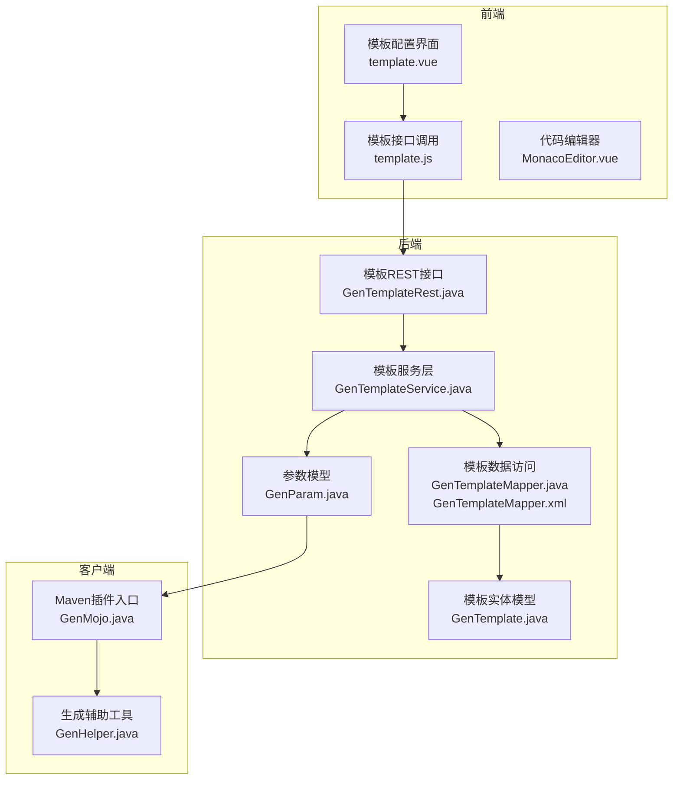
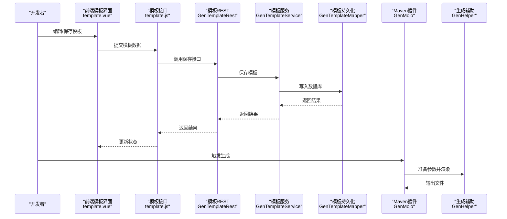
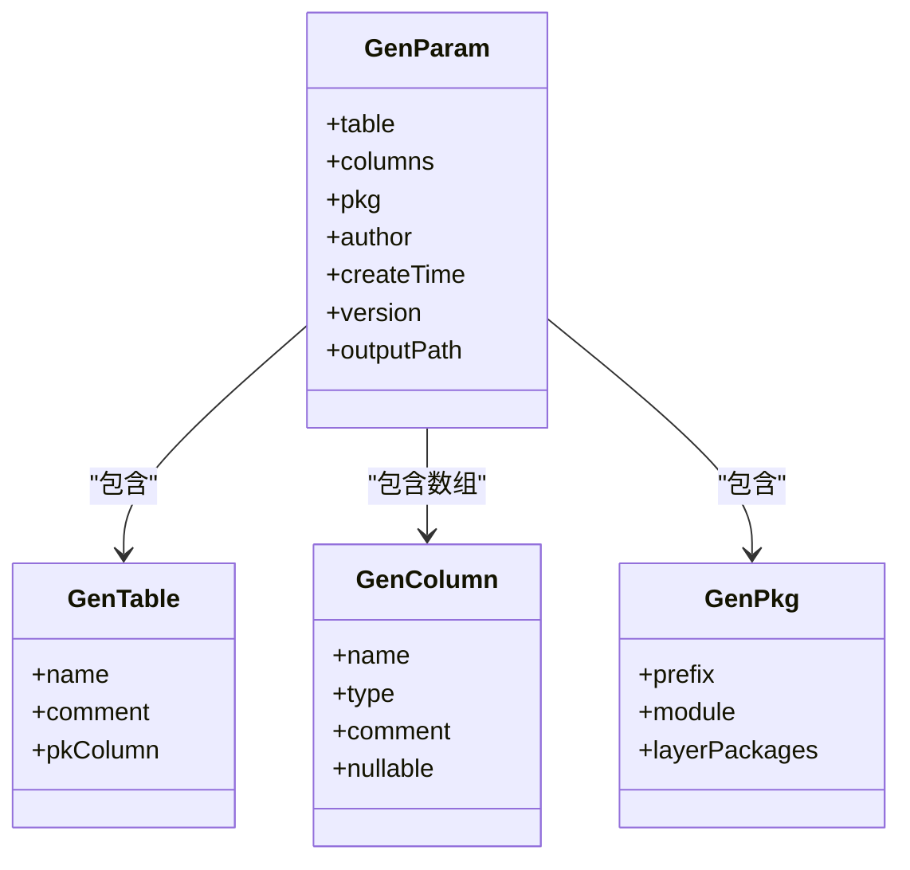
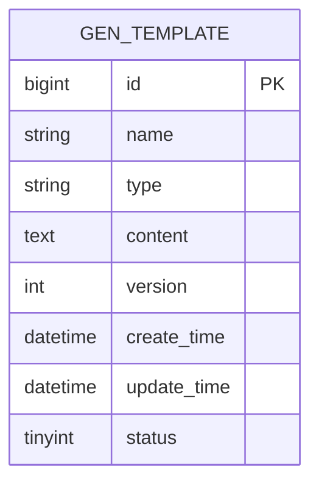
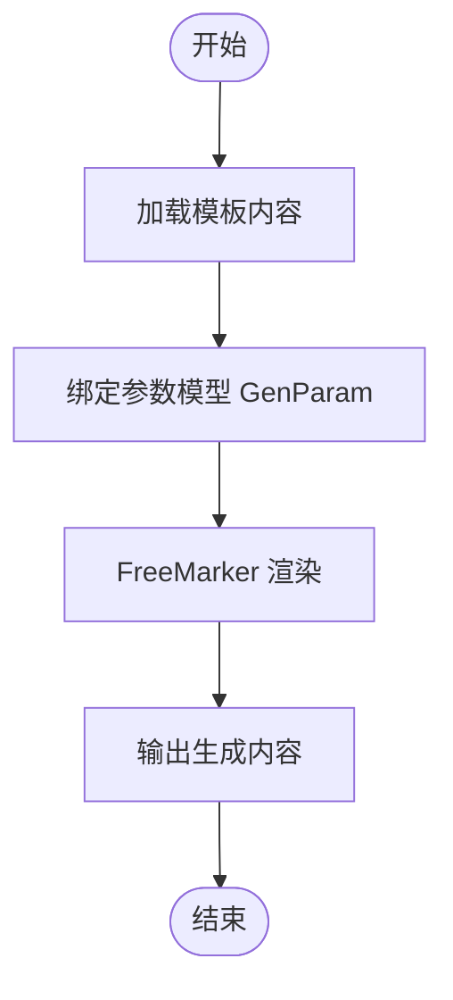
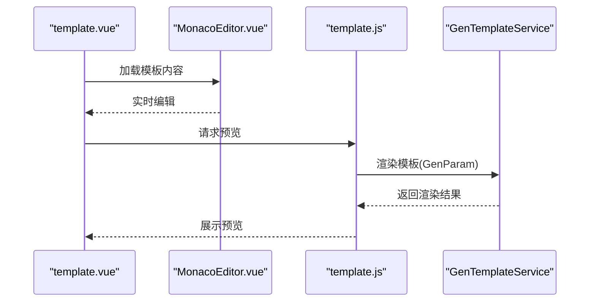
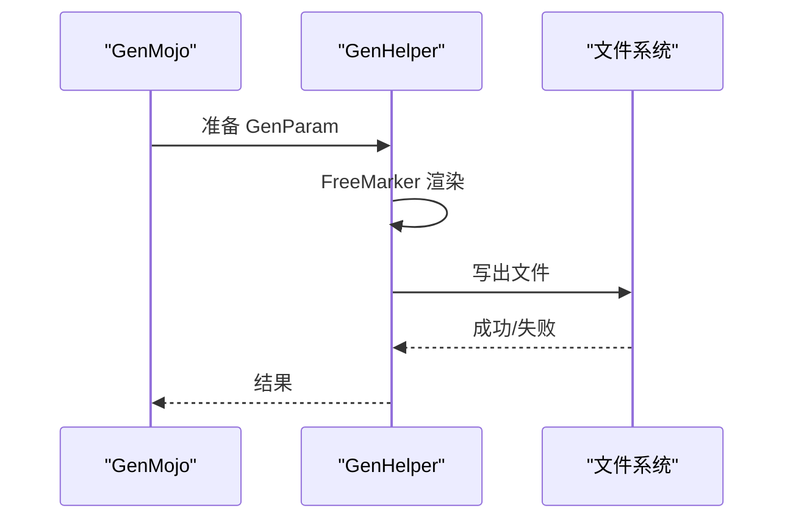
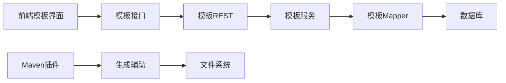
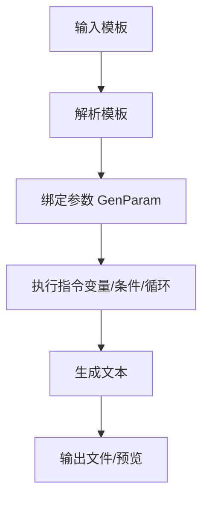

# 模板定制

<cite>
**本文引用的文件**
- [GenParam.java](file://generator-server/src/main/java/com/wkclz/generator/server/bean/gen/GenParam.java)
- [GenTable.java](file://generator-server/src/main/java/com/wkclz/generator/server/bean/gen/GenTable.java)
- [GenColumn.java](file://generator-server/src/main/java/com/wkclz/generator/server/bean/gen/GenColumn.java)
- [GenPkg.java](file://generator-server/src/main/java/com/wkclz/generator/server/bean/gen/GenPkg.java)
- [GenTemplate.java](file://generator-server/src/main/java/com/wkclz/generator/server/bean/entity/GenTemplate.java)
- [GenTemplateDto.java](file://generator-server/src/main/java/com/wkclz/generator/server/bean/dto/GenTemplateDto.java)
- [GenTemplateRest.java](file://generator-server/src/main/java/com/wkclz/generator/server/rest/GenTemplateRest.java)
- [GenTemplateService.java](file://generator-server/src/main/java/com/wkclz/generator/server/service/GenTemplateService.java)
- [GenTemplateMapper.java](file://generator-server/src/main/java/com/wkclz/generator/server/mapper/GenTemplateMapper.java)
- [GenTemplateMapper.xml](file://generator-server/src/main/resources/mapper/GenTemplateMapper.xml)
- [GenParamHFetchelper.java](file://generator-server/src/main/java/com/wkclz/generator/server/helper/GenParamHFetchelper.java)
- [GenHelper.java](file://generator-client/src/main/java/com/wkclz/generator/client/helper/GenHelper.java)
- [GenMojo.java](file://generator-client/src/main/java/com/wkclz/generator/client/GenMojo.java)
- [template.js](file://generator-ui/src/api/template.js)
- [template.vue](file://generator-ui/src/views/config/template/components/template.vue)
- [drawingDefault.js](file://generator-ui/src/utils/generator/drawingDefault.js)
- [render.js](file://generator-ui/src/utils/generator/render.js)
- [js.js](file://generator-ui/src/utils/generator/js.js)
- [css.js](file://generator-ui/src/utils/generator/css.js)
- [html.js](file://generator-ui/src/utils/generator/html.js)
- [MonacoEditor.vue](file://generator-ui/src/components/MonacoEditor/MonacoEditor.vue)
- [application.yml](file://generator-server-starter/src/main/resources/config/application.yml)
</cite>

## 目录
1. [简介](#简介)
2. [项目结构](#项目结构)
3. [核心组件](#核心组件)
4. [架构总览](#架构总览)
5. [详细组件分析](#详细组件分析)
6. [依赖关系分析](#依赖关系分析)
7. [性能考虑](#性能考虑)
8. [故障排查指南](#故障排查指南)
9. [结论](#结论)
10. [附录](#附录)

## 简介
本章节面向需要在 SH-Generator 中进行“模板定制”的开发者与使用者，系统性讲解如何基于 FreeMarker 模板引擎构建高质量的代码生成模板。内容涵盖：模板变量绑定、条件判断、循环遍历等语法要点；自定义模板的开发流程（从创建到测试验证）；模板参数传递机制（GenParam 参数模型与字段映射规则）；常见业务场景模板示例（Controller、Service、Mapper、Entity 等）；模板分类管理、模板预览与版本控制策略；以及模板调试技巧与性能优化建议。

## 项目结构
SH-Generator 采用前后端分离架构，分为三部分：
- generator-server：后端服务，负责模板管理、参数解析、生成执行与持久化
- generator-client：Maven 插件入口，封装生成流程与打包输出
- generator-ui：前端界面，提供模板编辑、预览、分类管理与任务调度

图表来源
- [GenTemplateRest.java:1-200](file://generator-server/src/main/java/com/wkclz/generator/server/rest/GenTemplateRest.java#L1-L200)
- [GenTemplateService.java:1-200](file://generator-server/src/main/java/com/wkclz/generator/server/service/GenTemplateService.java#L1-L200)
- [GenTemplateMapper.java:1-200](file://generator-server/src/main/java/com/wkclz/generator/server/mapper/GenTemplateMapper.java#L1-L200)
- [GenTemplateMapper.xml:1-200](file://generator-server/src/main/resources/mapper/GenTemplateMapper.xml#L1-L200)
- [GenTemplate.java:1-200](file://generator-server/src/main/java/com/wkclz/generator/server/bean/entity/GenTemplate.java#L1-L200)
- [GenParam.java:1-200](file://generator-server/src/main/java/com/wkclz/generator/server/bean/gen/GenParam.java#L1-L200)
- [GenMojo.java:1-200](file://generator-client/src/main/java/com/wkclz/generator/client/GenMojo.java#L1-L200)
- [GenHelper.java:1-200](file://generator-client/src/main/java/com/wkclz/generator/client/helper/GenHelper.java#L1-L200)

章节来源
- [GenTemplateRest.java:1-200](file://generator-server/src/main/java/com/wkclz/generator/server/rest/GenTemplateRest.java#L1-L200)
- [GenTemplateService.java:1-200](file://generator-server/src/main/java/com/wkclz/generator/server/service/GenTemplateService.java#L1-L200)
- [GenTemplateMapper.java:1-200](file://generator-server/src/main/java/com/wkclz/generator/server/mapper/GenTemplateMapper.java#L1-L200)
- [GenTemplateMapper.xml:1-200](file://generator-server/src/main/resources/mapper/GenTemplateMapper.xml#L1-L200)
- [GenTemplate.java:1-200](file://generator-server/src/main/java/com/wkclz/generator/server/bean/entity/GenTemplate.java#L1-L200)
- [GenParam.java:1-200](file://generator-server/src/main/java/com/wkclz/generator/server/bean/gen/GenParam.java#L1-L200)
- [GenMojo.java:1-200](file://generator-client/src/main/java/com/wkclz/generator/client/GenMojo.java#L1-L200)
- [GenHelper.java:1-200](file://generator-client/src/main/java/com/wkclz/generator/client/helper/GenHelper.java#L1-L200)

## 核心组件
- 模板实体与DTO：GenTemplate、GenTemplateDto 负责模板的存储与传输，包含模板名称、类型、内容、版本等元信息
- 参数模型：GenParam 封装生成所需的上下文参数，如表信息、列信息、包名、目标路径等
- 模板服务：GenTemplateService 提供模板的增删改查、版本管理、预览渲染等能力
- 模板接口：GenTemplateRest 对外暴露模板管理的 REST 接口
- 模板持久化：GenTemplateMapper + XML 映射实现模板数据的 CRUD
- 前端模板管理：template.vue + template.js + MonacoEditor.vue 提供可视化编辑与预览
- 客户端生成：GenMojo 作为 Maven 插件入口，调用 GenHelper 执行模板渲染与文件写出

章节来源
- [GenTemplate.java:1-200](file://generator-server/src/main/java/com/wkclz/generator/server/bean/entity/GenTemplate.java#L1-L200)
- [GenTemplateDto.java:1-200](file://generator-server/src/main/java/com/wkclz/generator/server/bean/dto/GenTemplateDto.java#L1-L200)
- [GenParam.java:1-200](file://generator-server/src/main/java/com/wkclz/generator/server/bean/gen/GenParam.java#L1-L200)
- [GenTemplateService.java:1-200](file://generator-server/src/main/java/com/wkclz/generator/server/service/GenTemplateService.java#L1-L200)
- [GenTemplateRest.java:1-200](file://generator-server/src/main/java/com/wkclz/generator/server/rest/GenTemplateRest.java#L1-L200)
- [GenTemplateMapper.java:1-200](file://generator-server/src/main/java/com/wkclz/generator/server/mapper/GenTemplateMapper.java#L1-L200)
- [GenTemplateMapper.xml:1-200](file://generator-server/src/main/resources/mapper/GenTemplateMapper.xml#L1-L200)
- [template.vue:1-200](file://generator-ui/src/views/config/template/components/template.vue#L1-L200)
- [template.js:1-200](file://generator-ui/src/api/template.js#L1-L200)
- [MonacoEditor.vue:1-200](file://generator-ui/src/components/MonacoEditor/MonacoEditor.vue#L1-L200)
- [GenMojo.java:1-200](file://generator-client/src/main/java/com/wkclz/generator/client/GenMojo.java#L1-L200)
- [GenHelper.java:1-200](file://generator-client/src/main/java/com/wkclz/generator/client/helper/GenHelper.java#L1-L200)

## 架构总览
下图展示模板从“创建/编辑”到“生成”的全链路：

图表来源
- [template.vue:1-200](file://generator-ui/src/views/config/template/components/template.vue#L1-L200)
- [template.js:1-200](file://generator-ui/src/api/template.js#L1-L200)
- [GenTemplateRest.java:1-200](file://generator-server/src/main/java/com/wkclz/generator/server/rest/GenTemplateRest.java#L1-L200)
- [GenTemplateService.java:1-200](file://generator-server/src/main/java/com/wkclz/generator/server/service/GenTemplateService.java#L1-L200)
- [GenTemplateMapper.java:1-200](file://generator-server/src/main/java/com/wkclz/generator/server/mapper/GenTemplateMapper.java#L1-L200)
- [GenMojo.java:1-200](file://generator-client/src/main/java/com/wkclz/generator/client/GenMojo.java#L1-L200)
- [GenHelper.java:1-200](file://generator-client/src/main/java/com/wkclz/generator/client/helper/GenHelper.java#L1-L200)

## 详细组件分析

### 模板参数模型与字段映射（GenParam）
GenParam 是模板渲染的核心上下文对象，承载表级与列级信息、包名、目标路径、生成策略等。其字段映射规则如下：
- 表级信息：来源于 GenTable，包含表名、注释、主键列等
- 列级信息：来源于 GenColumn 数组，包含列名、类型、注解、是否可空等
- 包级信息：GenPkg 定义包前缀、模块名、分层包结构
- 其他：生成时间、作者、模板版本、输出路径等

图表来源
- [GenParam.java:1-200](file://generator-server/src/main/java/com/wkclz/generator/server/bean/gen/GenParam.java#L1-L200)
- [GenTable.java:1-200](file://generator-server/src/main/java/com/wkclz/generator/server/bean/gen/GenTable.java#L1-L200)
- [GenColumn.java:1-200](file://generator-server/src/main/java/com/wkclz/generator/server/bean/gen/GenColumn.java#L1-L200)
- [GenPkg.java:1-200](file://generator-server/src/main/java/com/wkclz/generator/server/bean/gen/GenPkg.java#L1-L200)

章节来源
- [GenParam.java:1-200](file://generator-server/src/main/java/com/wkclz/generator/server/bean/gen/GenParam.java#L1-L200)
- [GenTable.java:1-200](file://generator-server/src/main/java/com/wkclz/generator/server/bean/gen/GenTable.java#L1-L200)
- [GenColumn.java:1-200](file://generator-server/src/main/java/com/wkclz/generator/server/bean/gen/GenColumn.java#L1-L200)
- [GenPkg.java:1-200](file://generator-server/src/main/java/com/wkclz/generator/server/bean/gen/GenPkg.java#L1-L200)

### 模板实体与版本控制（GenTemplate）
- 字段：模板名称、类型（如 controller/service/mapper/entity）、内容、版本号、创建/更新时间、状态等
- 版本控制：同一模板名可存在多个版本，通过版本号区分；服务层提供版本比较与回滚逻辑
- 分类管理：模板类型用于前端分类筛选与生成时按类型批量执行

图表来源
- [GenTemplate.java:1-200](file://generator-server/src/main/java/com/wkclz/generator/server/bean/entity/GenTemplate.java#L1-L200)
- [GenTemplateMapper.xml:1-200](file://generator-server/src/main/resources/mapper/GenTemplateMapper.xml#L1-L200)

章节来源
- [GenTemplate.java:1-200](file://generator-server/src/main/java/com/wkclz/generator/server/bean/entity/GenTemplate.java#L1-L200)
- [GenTemplateDto.java:1-200](file://generator-server/src/main/java/com/wkclz/generator/server/bean/dto/GenTemplateDto.java#L1-L200)
- [GenTemplateMapper.java:1-200](file://generator-server/src/main/java/com/wkclz/generator/server/mapper/GenTemplateMapper.java#L1-L200)
- [GenTemplateMapper.xml:1-200](file://generator-server/src/main/resources/mapper/GenTemplateMapper.xml#L1-L200)

### 模板服务与渲染（GenTemplateService）
- 模板 CRUD：保存、删除、更新、查询
- 预览渲染：接收 GenParam，结合模板内容进行 FreeMarker 渲染，返回渲染后的文本
- 版本管理：支持版本切换、对比与回滚
- 生成执行：在客户端侧由 GenMojo 调用，传入 GenParam 并输出文件

图表来源
- [GenTemplateService.java:1-200](file://generator-server/src/main/java/com/wkclz/generator/server/service/GenTemplateService.java#L1-L200)

章节来源
- [GenTemplateService.java:1-200](file://generator-server/src/main/java/com/wkclz/generator/server/service/GenTemplateService.java#L1-L200)

### 前端模板管理与预览（template.vue + MonacoEditor）
- 可视化编辑：MonacoEditor.vue 提供语法高亮与智能提示
- 预览渲染：调用后端接口进行实时预览，避免离线渲染误差
- 分类与搜索：按模板类型筛选，支持名称/版本检索
- 保存与发布：提交模板至后端，触发版本号递增

图表来源
- [template.vue:1-200](file://generator-ui/src/views/config/template/components/template.vue#L1-L200)
- [MonacoEditor.vue:1-200](file://generator-ui/src/components/MonacoEditor/MonacoEditor.vue#L1-L200)
- [template.js:1-200](file://generator-ui/src/api/template.js#L1-L200)
- [GenTemplateService.java:1-200](file://generator-server/src/main/java/com/wkclz/generator/server/service/GenTemplateService.java#L1-L200)

章节来源
- [template.vue:1-200](file://generator-ui/src/views/config/template/components/template.vue#L1-L200)
- [MonacoEditor.vue:1-200](file://generator-ui/src/components/MonacoEditor/MonacoEditor.vue#L1-L200)
- [template.js:1-200](file://generator-ui/src/api/template.js#L1-L200)

### 客户端生成流程（GenMojo + GenHelper）
- GenMojo 作为 Maven 插件入口，负责收集项目上下文、准备 GenParam、调用后端或本地渲染
- GenHelper 提供通用的渲染与文件写出能力，支持压缩、路径拼接、命名规范等

图表来源
- [GenMojo.java:1-200](file://generator-client/src/main/java/com/wkclz/generator/client/GenMojo.java#L1-L200)
- [GenHelper.java:1-200](file://generator-client/src/main/java/com/wkclz/generator/client/helper/GenHelper.java#L1-L200)

章节来源
- [GenMojo.java:1-200](file://generator-client/src/main/java/com/wkclz/generator/client/GenMojo.java#L1-L200)
- [GenHelper.java:1-200](file://generator-client/src/main/java/com/wkclz/generator/client/helper/GenHelper.java#L1-L200)

## 依赖关系分析
- 后端依赖 Spring Boot 与 MyBatis，模板数据通过 XML 映射访问数据库
- 前端依赖 Monaco 编辑器与 Element Plus，提供良好的编辑与交互体验
- 客户端依赖 FreeMarker 运行时进行模板渲染

图表来源
- [GenTemplateRest.java:1-200](file://generator-server/src/main/java/com/wkclz/generator/server/rest/GenTemplateRest.java#L1-L200)
- [GenTemplateService.java:1-200](file://generator-server/src/main/java/com/wkclz/generator/server/service/GenTemplateService.java#L1-L200)
- [GenTemplateMapper.java:1-200](file://generator-server/src/main/java/com/wkclz/generator/server/mapper/GenTemplateMapper.java#L1-L200)
- [GenMojo.java:1-200](file://generator-client/src/main/java/com/wkclz/generator/client/GenMojo.java#L1-L200)
- [GenHelper.java:1-200](file://generator-client/src/main/java/com/wkclz/generator/client/helper/GenHelper.java#L1-L200)

章节来源
- [GenTemplateRest.java:1-200](file://generator-server/src/main/java/com/wkclz/generator/server/rest/GenTemplateRest.java#L1-L200)
- [GenTemplateService.java:1-200](file://generator-server/src/main/java/com/wkclz/generator/server/service/GenTemplateService.java#L1-L200)
- [GenTemplateMapper.java:1-200](file://generator-server/src/main/java/com/wkclz/generator/server/mapper/GenTemplateMapper.java#L1-L200)
- [GenMojo.java:1-200](file://generator-client/src/main/java/com/wkclz/generator/client/GenMojo.java#L1-L200)
- [GenHelper.java:1-200](file://generator-client/src/main/java/com/wkclz/generator/client/helper/GenHelper.java#L1-L200)

## 性能考虑
- 模板体积控制：避免在模板中嵌入大段重复内容，优先抽取公共片段
- 参数精简：仅传递必要字段，减少渲染负担
- 预览缓存：前端对最近一次预览结果进行缓存，降低频繁请求压力
- 并发渲染：服务端对模板渲染进行限流与超时控制，防止资源耗尽
- 文件写出批量化：客户端合并写盘操作，减少 IO 次数

## 故障排查指南
- 模板语法错误：通过前端 Monaco 的语法高亮定位；若后端报错，检查 FreeMarker 变量是否存在、集合是否为空
- 参数缺失：确认 GenParam 是否正确填充表/列信息与包信息
- 预览不一致：前端预览与后端渲染差异较大时，检查模板中的动态逻辑与环境变量
- 生成失败：查看客户端日志与后端异常栈，定位具体模板与行号
- 权限问题：确保输出目录可写，避免跨平台路径分隔符问题

章节来源
- [GenTemplateService.java:1-200](file://generator-server/src/main/java/com/wkclz/generator/server/service/GenTemplateService.java#L1-L200)
- [GenMojo.java:1-200](file://generator-client/src/main/java/com/wkclz/generator/client/GenMojo.java#L1-L200)

## 结论
通过统一的参数模型（GenParam）与模板实体（GenTemplate），SH-Generator 在前后端之间建立了清晰的边界：前端负责可视化与预览，后端负责渲染与持久化，客户端负责最终产出。遵循本文提供的模板开发流程、参数映射规则与调试优化建议，可以高效地构建高质量的代码生成模板，并在团队内形成可维护、可演进的模板体系。

## 附录

### FreeMarker 模板语法速查（基于 GenParam 字段）
- 变量绑定：使用表/列/包相关字段进行占位替换
- 条件判断：根据字段是否为空或布尔值进行分支渲染
- 循环遍历：遍历列集合生成字段声明、构造函数、SQL 占位等
- 内置函数：字符串处理、首字母大小写转换、驼峰命名等
- 注释与格式：使用 FreeMarker 注释避免输出干扰

章节来源
- [GenParam.java:1-200](file://generator-server/src/main/java/com/wkclz/generator/server/bean/gen/GenParam.java#L1-L200)
- [GenTable.java:1-200](file://generator-server/src/main/java/com/wkclz/generator/server/bean/gen/GenTable.java#L1-L200)
- [GenColumn.java:1-200](file://generator-server/src/main/java/com/wkclz/generator/server/bean/gen/GenColumn.java#L1-L200)
- [GenPkg.java:1-200](file://generator-server/src/main/java/com/wkclz/generator/server/bean/gen/GenPkg.java#L1-L200)

### 开发流程（从创建到测试验证）
- 创建模板：在前端选择模板类型，编写模板内容
- 参数准备：确保 GenParam 已正确填充表/列/包信息
- 预览验证：使用前端预览功能快速迭代
- 保存与版本：提交模板并观察版本号变化
- 客户端测试：在真实项目中运行 Maven 插件，验证输出质量

章节来源
- [template.vue:1-200](file://generator-ui/src/views/config/template/components/template.vue#L1-L200)
- [template.js:1-200](file://generator-ui/src/api/template.js#L1-L200)
- [GenTemplateService.java:1-200](file://generator-server/src/main/java/com/wkclz/generator/server/service/GenTemplateService.java#L1-L200)
- [GenMojo.java:1-200](file://generator-client/src/main/java/com/wkclz/generator/client/GenMojo.java#L1-L200)

### 常见业务场景模板示例（描述性说明）
- Controller 模板：根据表信息生成控制器类，包含路径、请求映射、参数校验、分页查询、单条/批量增删改查等
- Service 模板：生成服务类，包含业务方法、事务控制、异常处理、调用 Mapper 的方法签名
- Mapper 模板：生成 Mapper 接口与 XML，包含基础 CRUD、条件查询、分页 SQL、批量插入/更新
- Entity 模板：生成实体类，包含字段、注解（如 @TableField）、序列化、toString 等

章节来源
- [GenParam.java:1-200](file://generator-server/src/main/java/com/wkclz/generator/server/bean/gen/GenParam.java#L1-L200)
- [GenTemplate.java:1-200](file://generator-server/src/main/java/com/wkclz/generator/server/bean/entity/GenTemplate.java#L1-L200)

### 模板分类管理与版本控制
- 分类：按模板类型（controller/service/mapper/entity）进行分类，便于批量选择与执行
- 版本：同一模板名对应多版本，版本号递增；支持对比与回滚
- 预览：每次修改后即时预览，确保渲染效果符合预期

章节来源
- [GenTemplate.java:1-200](file://generator-server/src/main/java/com/wkclz/generator/server/bean/entity/GenTemplate.java#L1-L200)
- [GenTemplateService.java:1-200](file://generator-server/src/main/java/com/wkclz/generator/server/service/GenTemplateService.java#L1-L200)

### 模板调试技巧
- 使用前端 Monaco 的语法高亮与错误提示
- 逐步缩小变量范围，先验证简单字段再扩展复杂逻辑
- 在模板中添加占位注释，帮助定位渲染位置
- 对比不同版本模板的差异，定位引入问题的变更点

章节来源
- [MonacoEditor.vue:1-200](file://generator-ui/src/components/MonacoEditor/MonacoEditor.vue#L1-L200)
- [GenTemplateService.java:1-200](file://generator-server/src/main/java/com/wkclz/generator/server/service/GenTemplateService.java#L1-L200)

### FreeMarker 渲染管线（概念示意）

[此图为概念示意，无需图表来源]