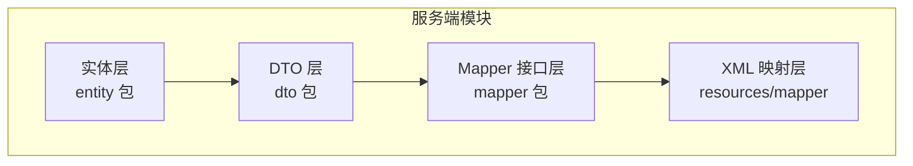
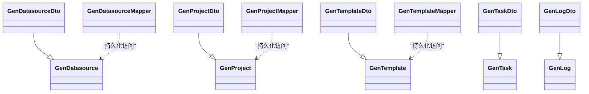
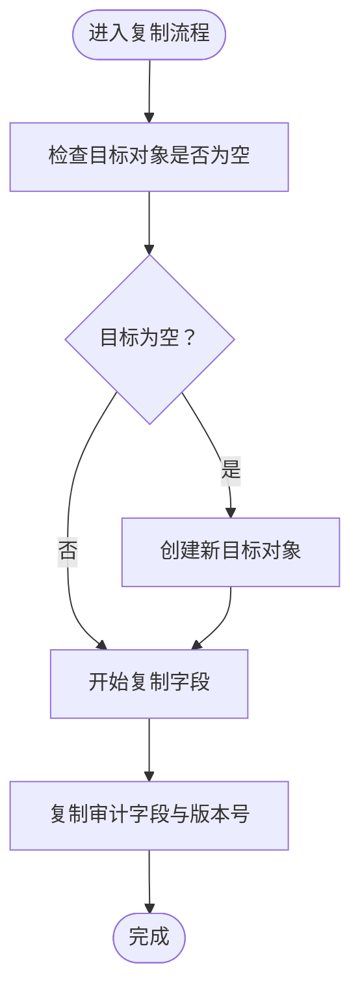
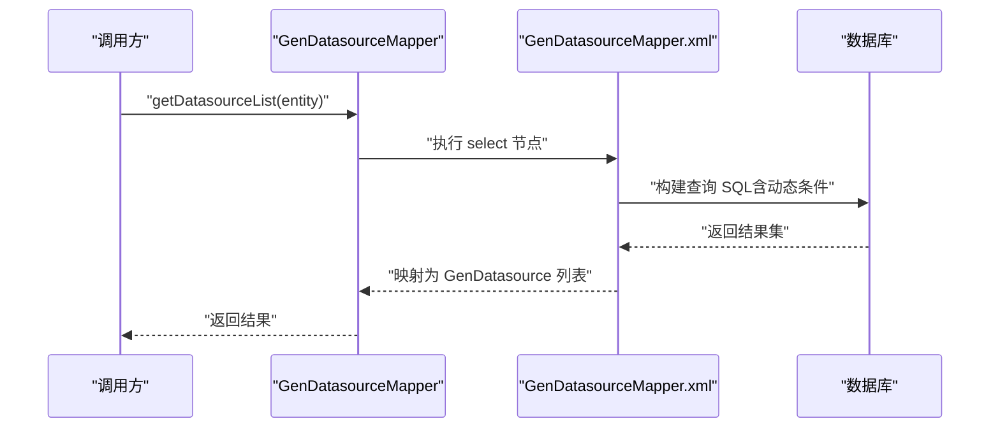

# 实体模型设计

<cite>
**本文引用的文件**
- [GenDatasource.java](file://generator-server/src/main/java/com/wkclz/generator/server/bean/entity/GenDatasource.java)
- [GenProject.java](file://generator-server/src/main/java/com/wkclz/generator/server/bean/entity/GenProject.java)
- [GenTemplate.java](file://generator-server/src/main/java/com/wkclz/generator/server/bean/entity/GenTemplate.java)
- [GenTask.java](file://generator-server/src/main/java/com/wkclz/generator/server/bean/entity/GenTask.java)
- [GenLog.java](file://generator-server/src/main/java/com/wkclz/generator/server/bean/entity/GenLog.java)
- [GenDatasourceDto.java](file://generator-server/src/main/java/com/wkclz/generator/server/bean/dto/GenDatasourceDto.java)
- [GenProjectDto.java](file://generator-server/src/main/java/com/wkclz/generator/server/bean/dto/GenProjectDto.java)
- [GenTemplateDto.java](file://generator-server/src/main/java/com/wkclz/generator/server/bean/dto/GenTemplateDto.java)
- [GenTaskDto.java](file://generator-server/src/main/java/com/wkclz/generator/server/bean/dto/GenTaskDto.java)
- [GenLogDto.java](file://generator-server/src/main/java/com/wkclz/generator/server/bean/dto/GenLogDto.java)
- [GenDatasourceMapper.java](file://generator-server/src/main/java/com/wkclz/generator/server/mapper/GenDatasourceMapper.java)
- [GenProjectMapper.java](file://generator-server/src/main/java/com/wkclz/generator/server/mapper/GenProjectMapper.java)
- [GenTemplateMapper.java](file://generator-server/src/main/java/com/wkclz/generator/server/mapper/GenTemplateMapper.java)
- [GenDatasourceMapper.xml](file://generator-server/src/main/resources/mapper/GenDatasourceMapper.xml)
- [GenProjectMapper.xml](file://generator-server/src/main/resources/mapper/GenProjectMapper.xml)
</cite>

## 目录
1. [简介](#简介)
2. [项目结构](#项目结构)
3. [核心组件](#核心组件)
4. [架构总览](#架构总览)
5. [详细组件分析](#详细组件分析)
6. [依赖分析](#依赖分析)
7. [性能考虑](#性能考虑)
8. [故障排查指南](#故障排查指南)
9. [结论](#结论)

## 简介
本设计文档围绕 SH-Generator 的实体模型展开，重点分析 GenDatasource（数据源）、GenProject（项目）、GenTemplate（模板）、GenTask（任务）、GenLog（日志）等核心实体的字段定义、业务含义与关系映射；阐明属性设计原则（字段类型、长度限制、空值约束等）；给出实体间关联与外键策略（一对一、一对多）；提供完整数据库表结构设计（主键、索引、约束）；并总结实体复制方法的设计思路与使用场景。

## 项目结构
实体层位于服务端模块的 entity 包中，DTO 层在 dto 包中，Mapper 接口在 mapper 包中，XML 映射文件位于 resources/mapper 目录。整体采用分层清晰的结构：实体负责领域建模，DTO 负责传输与视图展示，Mapper 负责持久化访问。

**章节来源**
- [GenDatasource.java:1-116](file://generator-server/src/main/java/com/wkclz/generator/server/bean/entity/GenDatasource.java#L1-L116)
- [GenProject.java:1-108](file://generator-server/src/main/java/com/wkclz/generator/server/bean/entity/GenProject.java#L1-L108)
- [GenTemplate.java:1-108](file://generator-server/src/main/java/com/wkclz/generator/server/bean/entity/GenTemplate.java#L1-L108)
- [GenTask.java:1-124](file://generator-server/src/main/java/com/wkclz/generator/server/bean/entity/GenTask.java#L1-L124)
- [GenLog.java:1-100](file://generator-server/src/main/java/com/wkclz/generator/server/bean/entity/GenLog.java#L1-L100)

## 核心组件
本节对五个核心实体进行字段与业务语义说明，并给出复制方法的设计要点与使用场景。

- GenDatasource（数据源）
  - 字段与业务含义：用户标识、数据源编码、数据库类型、主机、端口、数据库名、用户名、密码等。用于配置可复用的数据源连接参数。
  - 约束与类型：多字段标注非空；端口为整型；其余为字符串；继承基础实体的通用审计字段。
  - 复制方法：提供全量复制与按非空复制两种策略，便于从旧对象安全地迁移或更新目标对象。

- GenProject（项目）
  - 字段与业务含义：项目编码（唯一标识）、用户标识、数据库编码、表前缀、模块名、项目名称、项目说明等。用于组织生成范围与命名规范。
  - 约束与类型：项目编码、用户标识、数据库编码等关键字段非空；其余为可选字符串；继承基础实体的通用审计字段。
  - 复制方法：同上，支持全量与按非空复制。

- GenTemplate（模板）
  - 字段与业务含义：用户标识、模板编码、模板Key、模板名称、文件后缀、模板描述、模板内容等。用于定义生成产物的模板骨架。
  - 约束与类型：模板编码、模板Key等关键字段非空；模板内容为长文本；其余为字符串；继承基础实体的通用审计字段。
  - 复制方法：同上，支持全量与按非空复制。

- GenTask（任务）
  - 字段与业务含义：用户标识、项目编码、模板编码、任务名称、开关（生成/删除）、项目基本路径、包路径、任务描述等。用于驱动具体生成流程。
  - 约束与类型：用户标识、项目编码、模板编码、开关字段非空；路径相关为字符串；继承基础实体的通用审计字段。
  - 复制方法：同上，支持全量与按非空复制。

- GenLog（日志）
  - 字段与业务含义：用户标识、项目编码、授权码、生成路径、开始/结束时间等。用于记录生成过程与结果。
  - 约束与类型：时间字段为日期时间类型；其余为字符串；继承基础实体的通用审计字段。
  - 复制方法：同上，支持全量与按非空复制。

**章节来源**
- [GenDatasource.java:21-116](file://generator-server/src/main/java/com/wkclz/generator/server/bean/entity/GenDatasource.java#L21-L116)
- [GenProject.java:21-108](file://generator-server/src/main/java/com/wkclz/generator/server/bean/entity/GenProject.java#L21-L108)
- [GenTemplate.java:21-108](file://generator-server/src/main/java/com/wkclz/generator/server/bean/entity/GenTemplate.java#L21-L108)
- [GenTask.java:21-124](file://generator-server/src/main/java/com/wkclz/generator/server/bean/entity/GenTask.java#L21-L124)
- [GenLog.java:21-100](file://generator-server/src/main/java/com/wkclz/generator/server/bean/entity/GenLog.java#L21-L100)

## 架构总览
下图展示了实体、DTO、Mapper 以及 XML 映射之间的关系与职责分工。

**图表来源**
- [GenDatasource.java:19](file://generator-server/src/main/java/com/wkclz/generator/server/bean/entity/GenDatasource.java#L19)
- [GenProject.java:19](file://generator-server/src/main/java/com/wkclz/generator/server/bean/entity/GenProject.java#L19)
- [GenTemplate.java:19](file://generator-server/src/main/java/com/wkclz/generator/server/bean/entity/GenTemplate.java#L19)
- [GenTask.java:19](file://generator-server/src/main/java/com/wkclz/generator/server/bean/entity/GenTask.java#L19)
- [GenLog.java:19](file://generator-server/src/main/java/com/wkclz/generator/server/bean/entity/GenLog.java#L19)
- [GenDatasourceDto.java:15](file://generator-server/src/main/java/com/wkclz/generator/server/bean/dto/GenDatasourceDto.java#L15)
- [GenProjectDto.java:15](file://generator-server/src/main/java/com/wkclz/generator/server/bean/dto/GenProjectDto.java#L15)
- [GenTemplateDto.java:15](file://generator-server/src/main/java/com/wkclz/generator/server/bean/dto/GenTemplateDto.java#L15)
- [GenTaskDto.java:15](file://generator-server/src/main/java/com/wkclz/generator/server/bean/dto/GenTaskDto.java#L15)
- [GenLogDto.java:15](file://generator-server/src/main/java/com/wkclz/generator/server/bean/dto/GenLogDto.java#L15)
- [GenDatasourceMapper.java:10](file://generator-server/src/main/java/com/wkclz/generator/server/mapper/GenDatasourceMapper.java#L10)
- [GenProjectMapper.java:10](file://generator-server/src/main/java/com/wkclz/generator/server/mapper/GenProjectMapper.java#L10)
- [GenTemplateMapper.java:11](file://generator-server/src/main/java/com/wkclz/generator/server/mapper/GenTemplateMapper.java#L11)

## 详细组件分析

### GenDatasource（数据源）分析
- 字段设计原则
  - 非空性：用户标识、数据源编码、数据库类型、主机、端口、数据库名、数据库用户名、数据库密码等关键字段标注非空，确保数据源可用性。
  - 类型与长度：字符串字段未显式限定长度，建议在数据库层面设置合理上限；端口为整数类型。
  - 审计字段：继承基础实体，包含排序、创建/更新时间与人员、备注、版本号等。
- 关系映射
  - 与 GenProject：通过 dbCode 建立一对多关系（一个数据源可被多个项目使用）。
  - 与 GenTask：通过 dbCode 建立一对多关系（一个数据源可被多个任务使用）。
- 复制方法
  - 全量复制：适用于从源对象完整拷贝到目标对象。
  - 按非空复制：适用于增量更新或部分字段变更场景，避免覆盖目标对象已有值。
- 使用场景
  - 在新增/编辑数据源时，优先使用按非空复制以减少误覆盖风险。
  - 在批量导入或迁移时，使用全量复制保证一致性。

**图表来源**
- [GenDatasource.java:70-112](file://generator-server/src/main/java/com/wkclz/generator/server/bean/entity/GenDatasource.java#L70-L112)

**章节来源**
- [GenDatasource.java:21-116](file://generator-server/src/main/java/com/wkclz/generator/server/bean/entity/GenDatasource.java#L21-L116)

### GenProject（项目）分析
- 字段设计原则
  - 唯一性：项目编码作为唯一标识，用于跨模块引用与去重。
  - 可选性：表前缀、模块名、项目名称、项目说明等为可选字段，便于灵活配置。
  - 关联性：数据库编码用于关联 GenDatasource。
- 关系映射
  - 与 GenDatasource：通过 dbCode 建立一对多关系（一个数据源可支撑多个项目）。
  - 与 GenTask：通过 projectCode 建立一对多关系（一个项目可触发多个任务）。
- 复制方法
  - 同 GenDatasource，支持全量与按非空复制。
- 使用场景
  - 在项目初始化时使用全量复制；在修改项目配置时使用按非空复制以保留其他字段不变。

**章节来源**
- [GenProject.java:21-108](file://generator-server/src/main/java/com/wkclz/generator/server/bean/entity/GenProject.java#L21-L108)

### GenTemplate（模板）分析
- 字段设计原则
  - 唯一性：模板编码与模板Key用于区分不同模板。
  - 内容存储：模板内容为长文本，适合存放模板片段或完整模板。
  - 可选性：模板名称、文件后缀、描述等为可选字段。
- 关系映射
  - 与 GenTask：通过 tempCode 建立一对多关系（一个模板可被多个任务使用）。
- 复制方法
  - 支持全量与按非空复制，注意模板内容字段的完整性。
- 使用场景
  - 模板版本管理与复用：使用全量复制保存历史版本；按需更新时使用按非空复制。

**章节来源**
- [GenTemplate.java:21-108](file://generator-server/src/main/java/com/wkclz/generator/server/bean/entity/GenTemplate.java#L21-L108)

### GenTask（任务）分析
- 字段设计原则
  - 关联性：用户标识、项目编码、模板编码三者构成任务的核心关联。
  - 开关控制：生成开关与删除开关用于控制本地模式下的行为。
  - 路径配置：项目基本路径与包路径决定生成产物的落盘位置。
- 关系映射
  - 与 GenProject：通过 projectCode 建立一对多关系。
  - 与 GenTemplate：通过 tempCode 建立一对多关系。
- 复制方法
  - 支持全量与按非空复制，注意开关字段与路径字段的正确性。
- 使用场景
  - 批量任务复制与克隆：使用全量复制；局部调整：使用按非空复制。

**章节来源**
- [GenTask.java:21-124](file://generator-server/src/main/java/com/wkclz/generator/server/bean/entity/GenTask.java#L21-L124)

### GenLog（日志）分析
- 字段设计原则
  - 时间维度：开始时间与结束时间用于记录生成耗时与周期。
  - 关联性：用户标识与项目编码用于定位生成归属。
  - 追踪性：授权码与生成路径便于问题定位与回溯。
- 关系映射
  - 与 GenProject：通过 projectCode 建立一对多关系（一个项目可产生多条日志）。
- 复制方法
  - 支持全量与按非空复制，注意时间字段的准确性。
- 使用场景
  - 日志归档与查询：使用全量复制；增量写入：使用按非空复制。

**章节来源**
- [GenLog.java:21-100](file://generator-server/src/main/java/com/wkclz/generator/server/bean/entity/GenLog.java#L21-L100)

### DTO 层与复制策略
- DTO 设计原则
  - 继承实体：DTO 继承对应实体，便于统一复制与序列化。
  - 视图扩展：如 GenTaskDto 新增 tempKey 字段，用于前端展示模板键。
- 复制策略
  - DTO 提供静态 copy 方法，内部调用实体的复制方法，实现“实体到 DTO”的转换。
  - 保持与实体一致的复制语义（全量/按非空），确保数据一致性。

**章节来源**
- [GenDatasourceDto.java:15-30](file://generator-server/src/main/java/com/wkclz/generator/server/bean/dto/GenDatasourceDto.java#L15-L30)
- [GenProjectDto.java:15-30](file://generator-server/src/main/java/com/wkclz/generator/server/bean/dto/GenProjectDto.java#L15-L30)
- [GenTemplateDto.java:15-30](file://generator-server/src/main/java/com/wkclz/generator/server/bean/dto/GenTemplateDto.java#L15-L30)
- [GenTaskDto.java:15-36](file://generator-server/src/main/java/com/wkclz/generator/server/bean/dto/GenTaskDto.java#L15-L36)
- [GenLogDto.java:15-30](file://generator-server/src/main/java/com/wkclz/generator/server/bean/dto/GenLogDto.java#L15-L30)

## 依赖分析
- 实体与 Mapper
  - 实体通过 MyBatis Mapper 接口进行持久化操作，Mapper 继承 BaseMapper，具备通用 CRUD 能力。
  - XML 映射文件定义查询条件与排序规则，支持动态 SQL（如模糊匹配、条件拼接）。
- 查询能力
  - GenDatasourceMapper：支持按数据源编码、类型、主机、数据库名、用户标识等条件查询，并按排序与 ID 倒序。
  - GenProjectMapper：支持按项目编码、模块名、项目名、用户标识、数据库编码等条件查询，并按排序与 ID 倒序。
  - GenTemplateMapper：提供模板列表查询、选项查询与按模板编码集合查询的能力。

**图表来源**
- [GenDatasourceMapper.java:12](file://generator-server/src/main/java/com/wkclz/generator/server/mapper/GenDatasourceMapper.java#L12)
- [GenDatasourceMapper.xml:5-34](file://generator-server/src/main/resources/mapper/GenDatasourceMapper.xml#L5-L34)

**章节来源**
- [GenDatasourceMapper.java:1-17](file://generator-server/src/main/java/com/wkclz/generator/server/mapper/GenDatasourceMapper.java#L1-L17)
- [GenProjectMapper.java:1-15](file://generator-server/src/main/java/com/wkclz/generator/server/mapper/GenProjectMapper.java#L1-L15)
- [GenTemplateMapper.java:1-19](file://generator-server/src/main/java/com/wkclz/generator/server/mapper/GenTemplateMapper.java#L1-L19)
- [GenDatasourceMapper.xml:1-59](file://generator-server/src/main/resources/mapper/GenDatasourceMapper.xml#L1-L59)
- [GenProjectMapper.xml:1-38](file://generator-server/src/main/resources/mapper/GenProjectMapper.xml#L1-L38)

## 性能考虑
- 动态 SQL 条件
  - XML 中广泛使用动态条件（如 LIKE 拼接），建议在数据库层面为相关列建立合适的索引，避免全表扫描。
- 排序与分页
  - 查询默认按排序字段与 ID 倒序，有利于热点数据的快速检索；若数据量大，建议结合分页与复合索引优化。
- 复制方法
  - 按非空复制可减少不必要的字段赋值，降低对象构造成本；在批量处理时建议优先使用该策略。

## 故障排查指南
- 常见问题
  - 非空字段缺失：当用户标识、数据源编码、数据库类型、端口、数据库名、用户名、密码等关键字段为空时，可能导致数据源不可用或校验失败。
  - 关联字段不一致：项目编码、模板编码、数据源编码等关联字段不匹配会导致任务无法执行或日志无法关联。
  - 模板内容异常：模板内容过长或格式错误可能影响生成结果。
- 排查步骤
  - 核对实体字段的非空约束与类型；检查 DTO 转换是否正确。
  - 检查 Mapper XML 的动态条件是否正确拼接；确认数据库索引是否存在。
  - 对比任务与项目、模板的编码一致性；核对生成路径与权限。

**章节来源**
- [GenDatasource.java:24-67](file://generator-server/src/main/java/com/wkclz/generator/server/bean/entity/GenDatasource.java#L24-L67)
- [GenProject.java:24-61](file://generator-server/src/main/java/com/wkclz/generator/server/bean/entity/GenProject.java#L24-L61)
- [GenTemplate.java:24-61](file://generator-server/src/main/java/com/wkclz/generator/server/bean/entity/GenTemplate.java#L24-L61)
- [GenTask.java:24-73](file://generator-server/src/main/java/com/wkclz/generator/server/bean/entity/GenTask.java#L24-L73)
- [GenLog.java:24-55](file://generator-server/src/main/java/com/wkclz/generator/server/bean/entity/GenLog.java#L24-L55)

## 结论
本实体模型围绕数据源、项目、模板、任务与日志五大核心域构建，采用统一的实体基类与复制策略，确保了字段约束的一致性与数据迁移的安全性。通过 DTO 层与 Mapper/XML 的配合，实现了清晰的职责分离与高效的查询能力。建议在生产环境中完善数据库索引与约束，强化非空与唯一性校验，并在批量处理时优先采用按非空复制策略以提升稳定性与性能。