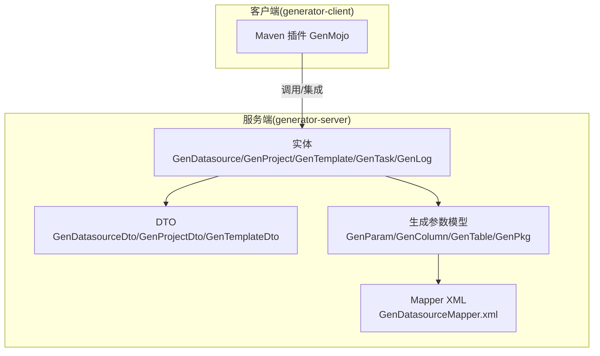
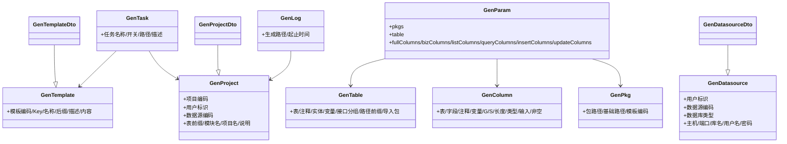
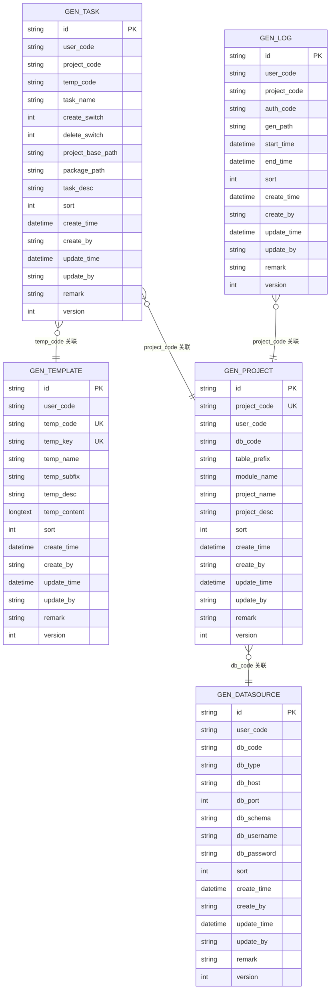
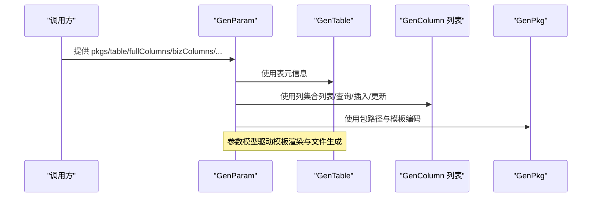
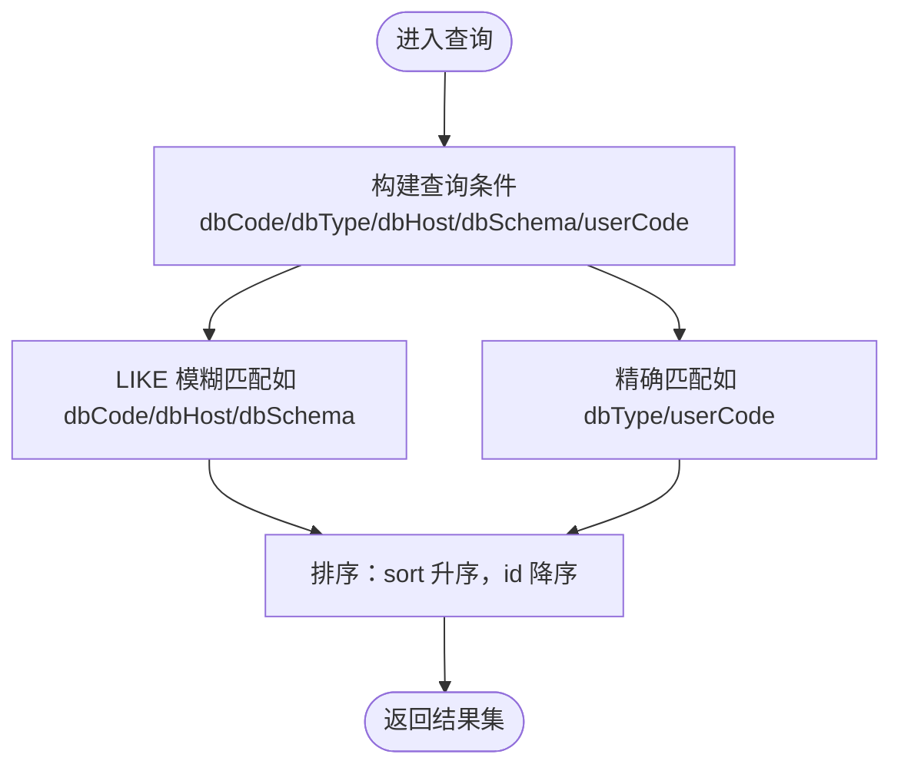
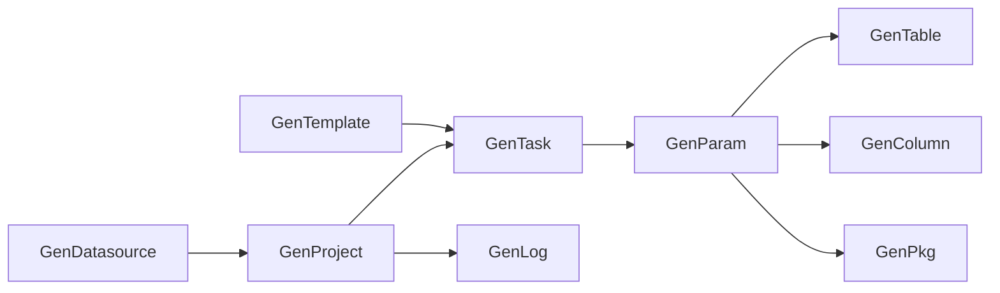

# 数据模型设计

<cite>
**本文引用的文件**
- [GenDatasource.java](file://generator-server/src/main/java/com/wkclz/generator/server/bean/entity/GenDatasource.java)
- [GenProject.java](file://generator-server/src/main/java/com/wkclz/generator/server/bean/entity/GenProject.java)
- [GenTemplate.java](file://generator-server/src/main/java/com/wkclz/generator/server/bean/entity/GenTemplate.java)
- [GenTask.java](file://generator-server/src/main/java/com/wkclz/generator/server/bean/entity/GenTask.java)
- [GenLog.java](file://generator-server/src/main/java/com/wkclz/generator/server/bean/entity/GenLog.java)
- [GenParam.java](file://generator-server/src/main/java/com/wkclz/generator/server/bean/gen/GenParam.java)
- [GenColumn.java](file://generator-server/src/main/java/com/wkclz/generator/server/bean/gen/GenColumn.java)
- [GenTable.java](file://generator-server/src/main/java/com/wkclz/generator/server/bean/gen/GenTable.java)
- [GenPkg.java](file://generator-server/src/main/java/com/wkclz/generator/server/bean/gen/GenPkg.java)
- [GenDatasourceDto.java](file://generator-server/src/main/java/com/wkclz/generator/server/bean/dto/GenDatasourceDto.java)
- [GenProjectDto.java](file://generator-server/src/main/java/com/wkclz/generator/server/bean/dto/GenProjectDto.java)
- [GenTemplateDto.java](file://generator-server/src/main/java/com/wkclz/generator/server/bean/dto/GenTemplateDto.java)
- [GenDatasourceMapper.xml](file://generator-server/src/main/resources/mapper/GenDatasourceMapper.xml)
</cite>

## 目录
1. [简介](#简介)
2. [项目结构](#项目结构)
3. [核心实体与设计原则](#核心实体与设计原则)
4. [架构总览](#架构总览)
5. [详细组件分析](#详细组件分析)
6. [依赖关系分析](#依赖关系分析)
7. [性能考量](#性能考量)
8. [故障排查指南](#故障排查指南)
9. [结论](#结论)
10. [附录：数据库表结构与约束](#附录数据库表结构与约束)

## 简介
本设计文档围绕 SH-Generator 的数据模型进行系统化梳理，重点覆盖以下方面：
- 实体模型设计原则与关系映射：GenDatasource、GenProject、GenTemplate、GenTask、GenLog 等核心实体的字段定义与业务含义。
- 生成参数模型设计思路：GenParam、GenColumn、GenTable、GenPkg 等模型在“表结构到代码”的生成流程中的作用与数据流转。
- 数据库表结构设计：主键、外键、索引策略及与实体模型的对应关系。
- 数据验证规则与业务约束：空值、默认值、类型转换与校验逻辑。
- 数据模型演进策略与版本兼容性。

## 项目结构
本项目采用前后端分离与多模块划分：
- generator-server：服务端核心，包含实体、DTO、Mapper、Service、REST 层以及 MyBatis XML 映射。
- generator-client：Maven 插件侧（用于在构建阶段触发生成）。
- generator-ui：前端管理界面（非本次建模重点）。
- generator-server-starter：Spring Boot 启动模块。

## 核心实体与设计原则
本节对核心实体进行逐项说明，强调字段语义、约束与业务含义，并给出拷贝工具方法的使用场景。

- GenDatasource（数据源）
  - 关键字段：用户标识、数据源编码、数据库类型、主机、端口、库名、用户名、密码等。
  - 约束：多处字段标注为必填；提供 copy/copyIfNotNull 工具方法，便于从请求体或持久化对象复制属性。
  - 业务含义：承载数据库连接配置，支持按用户维度隔离与筛选。

- GenProject（项目）
  - 关键字段：项目编码（唯一标识）、用户标识、数据源编码、表前缀、模块英文名、项目名称与说明。
  - 约束：项目编码作为唯一标识；提供 copy/copyIfNotNull 工具方法。
  - 业务含义：定义一次“代码生成”的上下文，绑定数据源与命名规范。

- GenTemplate（模板）
  - 关键字段：用户标识、模板编码、模板Key、模板名称、文件后缀、描述、模板内容。
  - 约束：模板Key与模板编码通常需唯一；提供 copy/copyIfNotNull 工具方法。
  - 业务含义：定义生成产物的模板骨架与内容。

- GenTask（任务）
  - 关键字段：用户标识、项目编码、模板编码、任务名称、开关（创建/删除）、项目基础路径、包路径、任务描述。
  - 约束：创建/删除开关与路径、描述等字段；提供 copy/copyIfNotNull 工具方法。
  - 业务含义：具体的一次生成任务，串联项目与模板。

- GenLog（日志）
  - 关键字段：用户标识、项目编码、授权码、生成路径、开始/结束时间。
  - 约束：时间字段为日期时间类型；提供 copy/copyIfNotNull 工具方法。
  - 业务含义：记录生成执行轨迹与结果定位信息。

- DTO 扩展
  - GenDatasourceDto/GenProjectDto/GenTemplateDto 继承自对应实体，提供 entity -> DTO 的转换工具方法，便于对外暴露时扩展字段而不破坏实体。

**章节来源**
- [GenDatasource.java:1-116](file://generator-server/src/main/java/com/wkclz/generator/server/bean/entity/GenDatasource.java#L1-L116)
- [GenProject.java:1-108](file://generator-server/src/main/java/com/wkclz/generator/server/bean/entity/GenProject.java#L1-L108)
- [GenTemplate.java:1-108](file://generator-server/src/main/java/com/wkclz/generator/server/bean/entity/GenTemplate.java#L1-L108)
- [GenTask.java:1-124](file://generator-server/src/main/java/com/wkclz/generator/server/bean/entity/GenTask.java#L1-L124)
- [GenLog.java:1-100](file://generator-server/src/main/java/com/wkclz/generator/server/bean/entity/GenLog.java#L1-L100)
- [GenDatasourceDto.java:1-32](file://generator-server/src/main/java/com/wkclz/generator/server/bean/dto/GenDatasourceDto.java#L1-L32)
- [GenProjectDto.java:1-32](file://generator-server/src/main/java/com/wkclz/generator/server/bean/dto/GenProjectDto.java#L1-L32)
- [GenTemplateDto.java:1-32](file://generator-server/src/main/java/com/wkclz/generator/server/bean/dto/GenTemplateDto.java#L1-L32)

## 架构总览
下图展示实体、DTO、生成参数模型与 Mapper 的交互关系，体现“表结构到代码”的数据流：

**图表来源**
- [GenDatasource.java:1-116](file://generator-server/src/main/java/com/wkclz/generator/server/bean/entity/GenDatasource.java#L1-L116)
- [GenProject.java:1-108](file://generator-server/src/main/java/com/wkclz/generator/server/bean/entity/GenProject.java#L1-L108)
- [GenTemplate.java:1-108](file://generator-server/src/main/java/com/wkclz/generator/server/bean/entity/GenTemplate.java#L1-L108)
- [GenTask.java:1-124](file://generator-server/src/main/java/com/wkclz/generator/server/bean/entity/GenTask.java#L1-L124)
- [GenLog.java:1-100](file://generator-server/src/main/java/com/wkclz/generator/server/bean/entity/GenLog.java#L1-L100)
- [GenParam.java:1-33](file://generator-server/src/main/java/com/wkclz/generator/server/bean/gen/GenParam.java#L1-L33)
- [GenColumn.java:1-39](file://generator-server/src/main/java/com/wkclz/generator/server/bean/gen/GenColumn.java#L1-L39)
- [GenTable.java:1-30](file://generator-server/src/main/java/com/wkclz/generator/server/bean/gen/GenTable.java#L1-L30)
- [GenPkg.java:1-15](file://generator-server/src/main/java/com/wkclz/generator/server/bean/gen/GenPkg.java#L1-L15)
- [GenDatasourceDto.java:1-32](file://generator-server/src/main/java/com/wkclz/generator/server/bean/dto/GenDatasourceDto.java#L1-L32)
- [GenProjectDto.java:1-32](file://generator-server/src/main/java/com/wkclz/generator/server/bean/dto/GenProjectDto.java#L1-L32)
- [GenTemplateDto.java:1-32](file://generator-server/src/main/java/com/wkclz/generator/server/bean/dto/GenTemplateDto.java#L1-L32)

## 详细组件分析

### 实体关系与业务映射
- 数据源与项目：GenProject 通过数据源编码关联 GenDatasource，实现“项目绑定数据源”。
- 项目与模板：GenTask 通过模板编码关联 GenTemplate，实现“任务绑定模板”。
- 项目与日志：GenLog 通过项目编码关联 GenProject，实现“生成日志归档”。

**图表来源**
- [GenDatasource.java:1-116](file://generator-server/src/main/java/com/wkclz/generator/server/bean/entity/GenDatasource.java#L1-L116)
- [GenProject.java:1-108](file://generator-server/src/main/java/com/wkclz/generator/server/bean/entity/GenProject.java#L1-L108)
- [GenTemplate.java:1-108](file://generator-server/src/main/java/com/wkclz/generator/server/bean/entity/GenTemplate.java#L1-L108)
- [GenTask.java:1-124](file://generator-server/src/main/java/com/wkclz/generator/server/bean/entity/GenTask.java#L1-L124)
- [GenLog.java:1-100](file://generator-server/src/main/java/com/wkclz/generator/server/bean/entity/GenLog.java#L1-L100)

**章节来源**
- [GenDatasource.java:1-116](file://generator-server/src/main/java/com/wkclz/generator/server/bean/entity/GenDatasource.java#L1-L116)
- [GenProject.java:1-108](file://generator-server/src/main/java/com/wkclz/generator/server/bean/entity/GenProject.java#L1-L108)
- [GenTemplate.java:1-108](file://generator-server/src/main/java/com/wkclz/generator/server/bean/entity/GenTemplate.java#L1-L108)
- [GenTask.java:1-124](file://generator-server/src/main/java/com/wkclz/generator/server/bean/entity/GenTask.java#L1-L124)
- [GenLog.java:1-100](file://generator-server/src/main/java/com/wkclz/generator/server/bean/entity/GenLog.java#L1-L100)

### 生成参数模型与数据流转
- GenParam：聚合生成所需的所有上下文，包括包信息、表结构、各类列集合（全量、业务、列表、查询、新增、修改）。
- GenTable：描述表级元信息（表名、注释、实体名、变量名、接口分组、路径前缀、导入包）。
- GenColumn：描述列级元信息（表/字段/注释、变量/G/S、长度、数据库类型、Java/TS 类型、输入类型、非空）。
- GenPkg：描述包路径、基础路径与模板编码，用于生成目录组织。

**图表来源**
- [GenParam.java:1-33](file://generator-server/src/main/java/com/wkclz/generator/server/bean/gen/GenParam.java#L1-L33)
- [GenTable.java:1-30](file://generator-server/src/main/java/com/wkclz/generator/server/bean/gen/GenTable.java#L1-L30)
- [GenColumn.java:1-39](file://generator-server/src/main/java/com/wkclz/generator/server/bean/gen/GenColumn.java#L1-L39)
- [GenPkg.java:1-15](file://generator-server/src/main/java/com/wkclz/generator/server/bean/gen/GenPkg.java#L1-L15)

**章节来源**
- [GenParam.java:1-33](file://generator-server/src/main/java/com/wkclz/generator/server/bean/gen/GenParam.java#L1-L33)
- [GenColumn.java:1-39](file://generator-server/src/main/java/com/wkclz/generator/server/bean/gen/GenColumn.java#L1-L39)
- [GenTable.java:1-30](file://generator-server/src/main/java/com/wkclz/generator/server/bean/gen/GenTable.java#L1-L30)
- [GenPkg.java:1-15](file://generator-server/src/main/java/com/wkclz/generator/server/bean/gen/GenPkg.java#L1-L15)

### 数据验证与业务约束
- 必填字段：GenDatasource、GenProject、GenTask 中多处字段标注为必填，确保关键业务信息完整。
- 唯一标识：GenProject 的项目编码、GenTemplate 的模板编码与模板Key常用于唯一约束。
- 类型与范围：端口为整数类型；开关字段以整型表示布尔；时间字段为日期时间类型。
- 复制策略：提供 copy 与 copyIfNotNull 两种复制方式，前者覆盖全部字段，后者仅在非空时复制，便于增量更新与 DTO 转换。

**章节来源**
- [GenDatasource.java:24-67](file://generator-server/src/main/java/com/wkclz/generator/server/bean/entity/GenDatasource.java#L24-L67)
- [GenProject.java:24-61](file://generator-server/src/main/java/com/wkclz/generator/server/bean/entity/GenProject.java#L24-L61)
- [GenTemplate.java:24-61](file://generator-server/src/main/java/com/wkclz/generator/server/bean/entity/GenTemplate.java#L24-L61)
- [GenTask.java:24-73](file://generator-server/src/main/java/com/wkclz/generator/server/bean/entity/GenTask.java#L24-L73)
- [GenLog.java:24-55](file://generator-server/src/main/java/com/wkclz/generator/server/bean/entity/GenLog.java#L24-L55)

### 查询与筛选流程（示例：数据源列表）
以下流程展示基于条件的动态 SQL 查询与排序策略，体现字段匹配与模糊搜索逻辑。

**图表来源**
- [GenDatasourceMapper.xml:5-34](file://generator-server/src/main/resources/mapper/GenDatasourceMapper.xml#L5-L34)

**章节来源**
- [GenDatasourceMapper.xml:5-34](file://generator-server/src/main/resources/mapper/GenDatasourceMapper.xml#L5-L34)

## 依赖关系分析
- 实体与 DTO：DTO 继承实体并提供 copy 工具方法，便于在接口层扩展字段而不影响持久化模型。
- 生成参数模型：GenParam 聚合 GenTable/GenColumn/GenPkg，形成“表结构到代码”的参数闭环。
- 任务与模板/项目：GenTask 通过外键字段关联 GenTemplate 与 GenProject，形成任务执行链路。
- 日志与项目：GenLog 通过项目编码回溯任务执行上下文。

**图表来源**
- [GenDatasource.java:1-116](file://generator-server/src/main/java/com/wkclz/generator/server/bean/entity/GenDatasource.java#L1-L116)
- [GenProject.java:1-108](file://generator-server/src/main/java/com/wkclz/generator/server/bean/entity/GenProject.java#L1-L108)
- [GenTemplate.java:1-108](file://generator-server/src/main/java/com/wkclz/generator/server/bean/entity/GenTemplate.java#L1-L108)
- [GenTask.java:1-124](file://generator-server/src/main/java/com/wkclz/generator/server/bean/entity/GenTask.java#L1-L124)
- [GenLog.java:1-100](file://generator-server/src/main/java/com/wkclz/generator/server/bean/entity/GenLog.java#L1-L100)
- [GenParam.java:1-33](file://generator-server/src/main/java/com/wkclz/generator/server/bean/gen/GenParam.java#L1-L33)
- [GenTable.java:1-30](file://generator-server/src/main/java/com/wkclz/generator/server/bean/gen/GenTable.java#L1-L30)
- [GenColumn.java:1-39](file://generator-server/src/main/java/com/wkclz/generator/server/bean/gen/GenColumn.java#L1-L39)
- [GenPkg.java:1-15](file://generator-server/src/main/java/com/wkclz/generator/server/bean/gen/GenPkg.java#L1-L15)

## 性能考量
- 查询优化：建议在常用过滤字段（如 dbCode、userCode、projectCode、tempCode）上建立索引，配合排序字段（sort/id）提升检索效率。
- DTO 转换：使用 copyIfNotNull 可减少无效字段写入，降低存储与序列化开销。
- 模板内容：模板内容为长文本类型，建议按需加载并在缓存中复用，避免重复解析。
- 并发控制：版本号与乐观锁可用于并发更新冲突处理。

## 故障排查指南
- 字段缺失：若出现必填字段为空导致保存失败，请检查 GenDatasource/GenProject/GenTask 对应字段是否正确传入。
- 唯一性冲突：当项目编码或模板编码/Key冲突时，需调整唯一标识或清理历史数据。
- 时间字段异常：确认传入的时间类型与数据库映射一致，避免时区与时区字段转换问题。
- 查询无结果：核对查询条件（如 dbCode 模糊匹配、dbType 精确匹配），并检查排序字段是否符合预期。

**章节来源**
- [GenDatasource.java:24-67](file://generator-server/src/main/java/com/wkclz/generator/server/bean/entity/GenDatasource.java#L24-L67)
- [GenProject.java:24-61](file://generator-server/src/main/java/com/wkclz/generator/server/bean/entity/GenProject.java#L24-L61)
- [GenTemplate.java:24-61](file://generator-server/src/main/java/com/wkclz/generator/server/bean/entity/GenTemplate.java#L24-L61)
- [GenTask.java:24-73](file://generator-server/src/main/java/com/wkclz/generator/server/bean/entity/GenTask.java#L24-L73)
- [GenLog.java:24-55](file://generator-server/src/main/java/com/wkclz/generator/server/bean/entity/GenLog.java#L24-L55)

## 结论
本数据模型以“数据源—项目—模板—任务—日志”为主线，结合生成参数模型 GenParam/GenTable/GenColumn/GenPkg，形成从表结构到代码产物的完整闭环。通过明确的字段约束、复制策略与查询流程，既保证了业务一致性，也为后续扩展与演进提供了清晰边界。

## 附录：数据库表结构与约束
- 主键与唯一键
  - 所有实体均以字符串 ID 为主键。
  - 项目编码、模板编码、模板Key在实体层面具备唯一性语义，建议在数据库层面建立唯一索引。
- 外键关系
  - GenProject.db_code → GenDatasource.db_code
  - GenTask.temp_code → GenTemplate.temp_code
  - GenTask.project_code → GenProject.project_code
  - GenLog.project_code → GenProject.project_code
- 索引策略建议
  - 在 GenDatasource 上对 dbCode、dbType、dbHost、dbSchema、userCode 建立组合索引或单列索引，支持常见筛选。
  - 在 GenProject 上对 projectCode 建唯一索引；在 userCode、dbCode 上建立普通索引。
  - 在 GenTemplate 上对 tempCode、tempKey 建唯一索引；在 userCode 上建立普通索引。
  - 在 GenTask 上对 projectCode、tempCode、userCode 建索引；在 createSwitch/deleteSwitch 上建立选择性索引。
  - 在 GenLog 上对 projectCode、userCode 建索引；对时间字段建立范围查询索引。
- 默认值与类型
  - 排序字段 sort 默认 0；版本号 version 默认 1；布尔开关字段默认 0 或 1。
  - 时间字段使用日期时间类型；长文本字段（如模板内容）使用长文本类型。

**章节来源**
- [GenDatasource.java:1-116](file://generator-server/src/main/java/com/wkclz/generator/server/bean/entity/GenDatasource.java#L1-L116)
- [GenProject.java:1-108](file://generator-server/src/main/java/com/wkclz/generator/server/bean/entity/GenProject.java#L1-L108)
- [GenTemplate.java:1-108](file://generator-server/src/main/java/com/wkclz/generator/server/bean/entity/GenTemplate.java#L1-L108)
- [GenTask.java:1-124](file://generator-server/src/main/java/com/wkclz/generator/server/bean/entity/GenTask.java#L1-L124)
- [GenLog.java:1-100](file://generator-server/src/main/java/com/wkclz/generator/server/bean/entity/GenLog.java#L1-L100)
- [GenDatasourceMapper.xml:5-55](file://generator-server/src/main/resources/mapper/GenDatasourceMapper.xml#L5-L55)